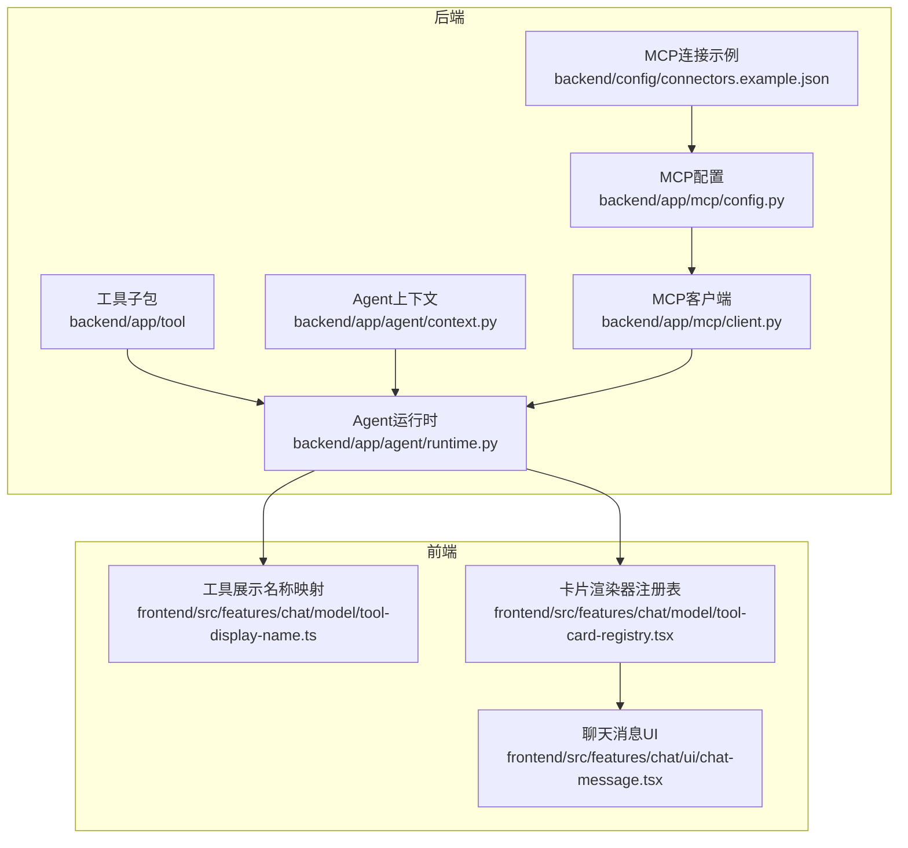
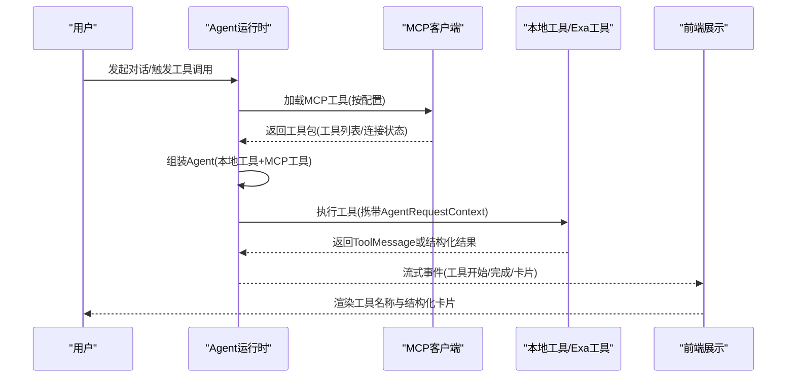
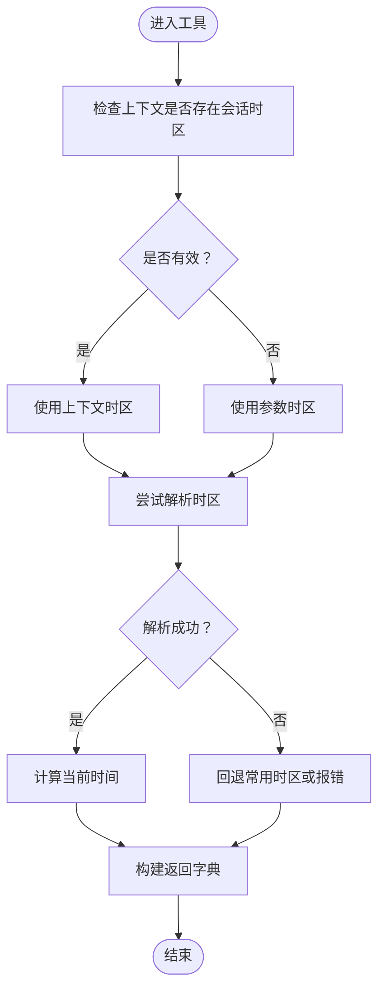
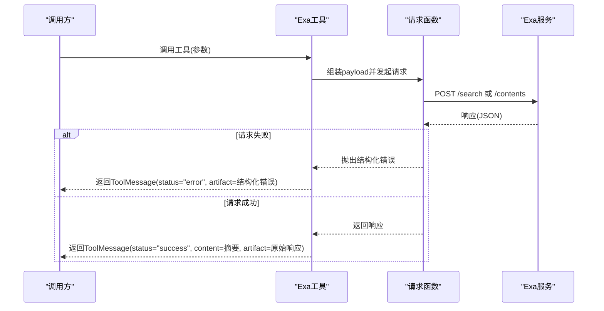
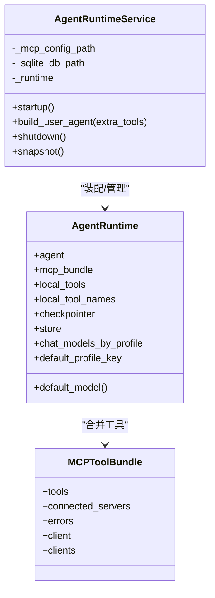
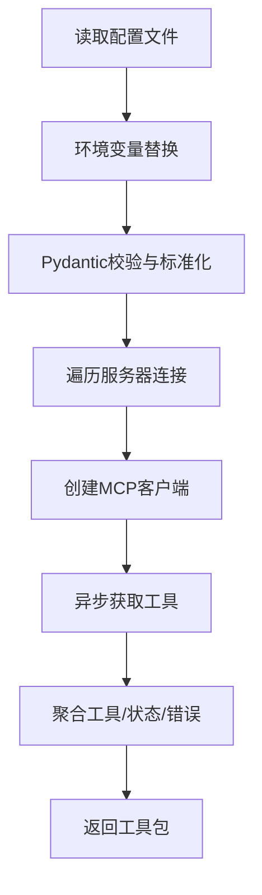
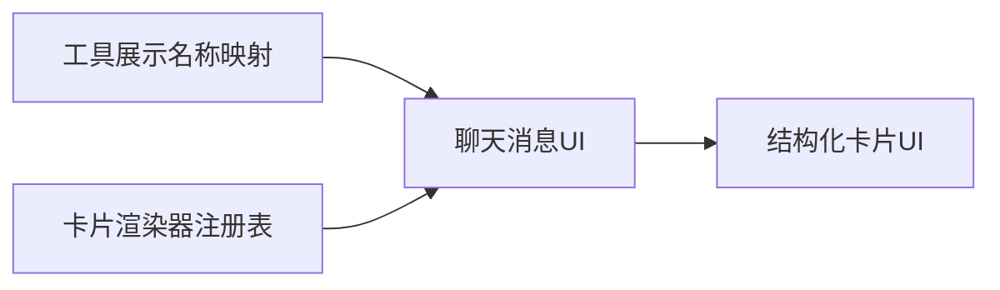
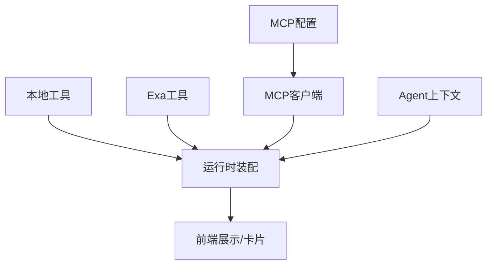

# 工具开发

<cite>
**本文引用的文件**
- [backend/app/tool/local_tools.py](file://backend/app/tool/local_tools.py)
- [backend/app/tool/exa_tools.py](file://backend/app/tool/exa_tools.py)
- [backend/app/agent/runtime.py](file://backend/app/agent/runtime.py)
- [backend/app/agent/context.py](file://backend/app/agent/context.py)
- [backend/app/mcp/client.py](file://backend/app/mcp/client.py)
- [backend/app/mcp/config.py](file://backend/app/mcp/config.py)
- [backend/tests/test_local_tools.py](file://backend/tests/test_local_tools.py)
- [backend/tests/test_exa_tools.py](file://backend/tests/test_exa_tools.py)
- [frontend/src/features/chat/model/tool-display-name.ts](file://frontend/src/features/chat/model/tool-display-name.ts)
- [frontend/src/features/chat/model/tool-card-registry.tsx](file://frontend/src/features/chat/model/tool-card-registry.tsx)
- [frontend/src/features/chat/ui/chat-message.tsx](file://frontend/src/features/chat/ui/chat-message.tsx)
- [backend/config/connectors.example.json](file://backend/config/connectors.example.json)
</cite>

## 目录
1. [简介](#简介)
2. [项目结构](#项目结构)
3. [核心组件](#核心组件)
4. [架构总览](#架构总览)
5. [详细组件分析](#详细组件分析)
6. [依赖关系分析](#依赖关系分析)
7. [性能考量](#性能考量)
8. [故障排查指南](#故障排查指南)
9. [结论](#结论)
10. [附录](#附录)

## 简介
本文件面向开发者，系统性讲解如何在本项目中创建与集成本地工具与MCP工具。内容涵盖：
- 工具函数定义规范、参数校验与返回值格式
- @tool装饰器的使用方法、ToolRuntime上下文传递与AgentRequestContext的获取方式
- 工具注册机制、工具列表管理与工具调用流程
- Exa API工具实现示例、时区工具开发模式与错误处理最佳实践
- 工具测试方法、性能优化技巧与安全注意事项
- 完整的代码示例路径与实际应用场景

## 项目结构
本项目的工具体系主要位于后端的工具子包与Agent运行时装配模块，并通过MCP客户端加载外部工具。前端负责工具展示名称与结构化卡片渲染。

**图表来源**
- [backend/app/tool/local_tools.py](file://backend/app/tool/local_tools.py)
- [backend/app/tool/exa_tools.py](file://backend/app/tool/exa_tools.py)
- [backend/app/agent/runtime.py](file://backend/app/agent/runtime.py)
- [backend/app/agent/context.py](file://backend/app/agent/context.py)
- [backend/app/mcp/client.py](file://backend/app/mcp/client.py)
- [backend/app/mcp/config.py](file://backend/app/mcp/config.py)
- [frontend/src/features/chat/model/tool-display-name.ts](file://frontend/src/features/chat/model/tool-display-name.ts)
- [frontend/src/features/chat/model/tool-card-registry.tsx](file://frontend/src/features/chat/model/tool-card-registry.tsx)
- [frontend/src/features/chat/ui/chat-message.tsx](file://frontend/src/features/chat/ui/chat-message.tsx)
- [backend/config/connectors.example.json](file://backend/config/connectors.example.json)

**章节来源**
- [backend/app/tool/local_tools.py:1-56](file://backend/app/tool/local_tools.py#L1-L56)
- [backend/app/tool/exa_tools.py:1-216](file://backend/app/tool/exa_tools.py#L1-L216)
- [backend/app/agent/runtime.py:1-174](file://backend/app/agent/runtime.py#L1-L174)
- [backend/app/agent/context.py:1-22](file://backend/app/agent/context.py#L1-L22)
- [backend/app/mcp/client.py:1-69](file://backend/app/mcp/client.py#L1-L69)
- [backend/app/mcp/config.py:1-91](file://backend/app/mcp/config.py#L1-L91)
- [frontend/src/features/chat/model/tool-display-name.ts:1-72](file://frontend/src/features/chat/model/tool-display-name.ts#L1-L72)
- [frontend/src/features/chat/model/tool-card-registry.tsx:1-99](file://frontend/src/features/chat/model/tool-card-registry.tsx#L1-L99)
- [frontend/src/features/chat/ui/chat-message.tsx:445-478](file://frontend/src/features/chat/ui/chat-message.tsx#L445-L478)
- [backend/config/connectors.example.json:1-25](file://backend/config/connectors.example.json#L1-L25)

## 核心组件
- 本地工具定义与注册
  - 本地工具通过装饰器注册，统一由工具列表函数集中导出，供Agent运行时装配。
  - 示例：时区工具与Exa工具均采用装饰器注册，并通过列表函数统一返回。
- Agent运行时装配
  - 运行时负责加载本地工具、MCP工具、中间件与检查点，组装Agent并提供按用户扩展的能力。
- Agent上下文
  - 提供用户标识、线程标识、区域设置、模型档位与会话元数据等，贯穿工具执行链路。
- MCP工具加载
  - 通过配置文件加载MCP连接，客户端异步获取工具并返回工具包，包含连接状态与错误信息。
- 前端工具展示与卡片渲染
  - 工具展示名称映射支持本地工具与MCP工具；卡片渲染器按类型分组渲染结构化数据。

**章节来源**
- [backend/app/tool/local_tools.py:1-56](file://backend/app/tool/local_tools.py#L1-L56)
- [backend/app/agent/runtime.py:80-132](file://backend/app/agent/runtime.py#L80-L132)
- [backend/app/agent/context.py:10-22](file://backend/app/agent/context.py#L10-L22)
- [backend/app/mcp/client.py:32-68](file://backend/app/mcp/client.py#L32-L68)
- [frontend/src/features/chat/model/tool-display-name.ts:5-44](file://frontend/src/features/chat/model/tool-display-name.ts#L5-L44)

## 架构总览
工具开发与调用的整体流程如下：

**图表来源**
- [backend/app/agent/runtime.py:80-132](file://backend/app/agent/runtime.py#L80-L132)
- [backend/app/mcp/client.py:32-68](file://backend/app/mcp/client.py#L32-L68)
- [backend/app/tool/exa_tools.py:108-143](file://backend/app/tool/exa_tools.py#L108-L143)
- [frontend/src/features/chat/model/tool-display-name.ts:51-69](file://frontend/src/features/chat/model/tool-display-name.ts#L51-L69)
- [frontend/src/features/chat/model/tool-card-registry.tsx:84-98](file://frontend/src/features/chat/model/tool-card-registry.tsx#L84-L98)

## 详细组件分析

### 本地工具：时区工具
- 定义与装饰器
  - 使用装饰器注册工具函数，函数签名包含可选的ToolRuntime参数，以便在运行时访问AgentRequestContext。
  - 通过列表函数统一导出工具，供Agent运行时装配。
- 参数与上下文
  - 支持传入时区名称；若未提供且存在上下文中的会话时区，则优先使用上下文时区。
  - 返回包含时区、ISO时间、日期、时间、星期与UTC偏移的字典。
- 错误处理
  - 当时区不可识别时，返回包含错误信息与原始时区的字典，便于前端与日志定位。

**图表来源**
- [backend/app/tool/local_tools.py:16-46](file://backend/app/tool/local_tools.py#L16-L46)

**章节来源**
- [backend/app/tool/local_tools.py:16-46](file://backend/app/tool/local_tools.py#L16-L46)
- [backend/tests/test_local_tools.py:6-15](file://backend/tests/test_local_tools.py#L6-L15)

### Exa API工具：搜索与内容抓取
- 工具设计
  - 两个异步工具分别封装高级搜索与内容抓取，内部通过统一的请求函数与错误处理，最终返回ToolMessage，包含状态、内容与原始artifact。
- 请求与错误处理
  - 通过环境变量注入API密钥；对HTTP状态错误与通用HTTP错误进行结构化包装，便于前端展示与日志记录。
  - artifact字段保留原始响应或结构化错误，便于调试与审计。
- 参数校验
  - 搜索工具对结果数量进行范围约束；内容抓取工具对URL列表进行清洗与非空校验。
- 返回格式
  - ToolMessage包含工具名、工具调用ID、状态(success/error)、内容与artifact，前端据此渲染卡片与对话气泡。

**图表来源**
- [backend/app/tool/exa_tools.py:108-143](file://backend/app/tool/exa_tools.py#L108-L143)
- [backend/app/tool/exa_tools.py:146-187](file://backend/app/tool/exa_tools.py#L146-L187)
- [backend/app/tool/exa_tools.py:42-70](file://backend/app/tool/exa_tools.py#L42-L70)

**章节来源**
- [backend/app/tool/exa_tools.py:108-143](file://backend/app/tool/exa_tools.py#L108-L143)
- [backend/app/tool/exa_tools.py:146-187](file://backend/app/tool/exa_tools.py#L146-L187)
- [backend/app/tool/exa_tools.py:42-70](file://backend/app/tool/exa_tools.py#L42-L70)
- [backend/tests/test_exa_tools.py:12-103](file://backend/tests/test_exa_tools.py#L12-L103)
- [backend/tests/test_exa_tools.py:105-168](file://backend/tests/test_exa_tools.py#L105-L168)
- [backend/tests/test_exa_tools.py:170-223](file://backend/tests/test_exa_tools.py#L170-L223)

### Agent运行时与工具注册
- 运行时装配
  - 初始化时加载本地工具与MCP工具，创建Agent并注入上下文Schema与中间件；提供按用户扩展额外工具的能力。
- 工具列表管理
  - 本地工具通过列表函数集中管理；MCP工具通过客户端批量加载并聚合。
- 快照与健康检查
  - 运行时快照包含本地工具名、MCP已连接服务器与错误列表，便于运维监控。

**图表来源**
- [backend/app/agent/runtime.py:31-115](file://backend/app/agent/runtime.py#L31-L115)
- [backend/app/mcp/client.py:14-30](file://backend/app/mcp/client.py#L14-L30)

**章节来源**
- [backend/app/agent/runtime.py:80-132](file://backend/app/agent/runtime.py#L80-L132)
- [backend/app/mcp/client.py:32-68](file://backend/app/mcp/client.py#L32-L68)

### MCP配置与连接
- 配置解析
  - 支持stdio与http/sse/streamable_http三种传输方式；支持环境变量占位符替换与字段标准化。
- 工具加载
  - 客户端按服务器连接获取工具，聚合工具列表并记录连接状态与错误，便于诊断。

**图表来源**
- [backend/app/mcp/config.py:63-90](file://backend/app/mcp/config.py#L63-L90)
- [backend/app/mcp/client.py:32-68](file://backend/app/mcp/client.py#L32-L68)

**章节来源**
- [backend/app/mcp/config.py:36-60](file://backend/app/mcp/config.py#L36-L60)
- [backend/app/mcp/config.py:63-90](file://backend/app/mcp/config.py#L63-L90)
- [backend/app/mcp/client.py:32-68](file://backend/app/mcp/client.py#L32-L68)
- [backend/config/connectors.example.json:1-25](file://backend/config/connectors.example.json#L1-L25)

### 前端工具展示与卡片渲染
- 工具展示名称
  - 本地工具与MCP工具分别维护映射表，支持按服务器前缀与工具名进行双层匹配，未命中时回退为格式化名称。
- 卡片渲染
  - 前端按卡片类型分组渲染，新增卡片类型只需在注册表中添加映射，无需改动消息渲染逻辑。

**图表来源**
- [frontend/src/features/chat/model/tool-display-name.ts:51-69](file://frontend/src/features/chat/model/tool-display-name.ts#L51-L69)
- [frontend/src/features/chat/model/tool-card-registry.tsx:84-98](file://frontend/src/features/chat/model/tool-card-registry.tsx#L84-L98)
- [frontend/src/features/chat/ui/chat-message.tsx:445-478](file://frontend/src/features/chat/ui/chat-message.tsx#L445-L478)

**章节来源**
- [frontend/src/features/chat/model/tool-display-name.ts:5-44](file://frontend/src/features/chat/model/tool-display-name.ts#L5-L44)
- [frontend/src/features/chat/model/tool-card-registry.tsx:60-98](file://frontend/src/features/chat/model/tool-card-registry.tsx#L60-L98)
- [frontend/src/features/chat/ui/chat-message.tsx:445-478](file://frontend/src/features/chat/ui/chat-message.tsx#L445-L478)

## 依赖关系分析
- 组件耦合
  - Agent运行时依赖本地工具列表与MCP工具包；MCP工具包由MCP客户端与配置共同决定。
  - 工具函数依赖LangChain工具装饰器与上下文Schema；前端依赖工具名称映射与卡片渲染器。
- 外部依赖
  - MCP客户端依赖多服务器适配器；Exa工具依赖HTTP客户端与环境变量。
- 潜在循环
  - 工具与运行时通过函数调用解耦，未见直接循环依赖。

**图表来源**
- [backend/app/tool/local_tools.py:49-56](file://backend/app/tool/local_tools.py#L49-L56)
- [backend/app/tool/exa_tools.py:190-215](file://backend/app/tool/exa_tools.py#L190-L215)
- [backend/app/agent/runtime.py:85-104](file://backend/app/agent/runtime.py#L85-L104)
- [backend/app/mcp/client.py:32-68](file://backend/app/mcp/client.py#L32-L68)
- [backend/app/mcp/config.py:63-90](file://backend/app/mcp/config.py#L63-L90)
- [frontend/src/features/chat/model/tool-display-name.ts:51-69](file://frontend/src/features/chat/model/tool-display-name.ts#L51-L69)

**章节来源**
- [backend/app/agent/runtime.py:80-132](file://backend/app/agent/runtime.py#L80-L132)
- [backend/app/mcp/client.py:32-68](file://backend/app/mcp/client.py#L32-L68)
- [backend/app/mcp/config.py:63-90](file://backend/app/mcp/config.py#L63-L90)

## 性能考量
- 异步I/O与超时控制
  - Exa工具请求设置合理超时，避免阻塞；MCP客户端按服务器异步加载，减少启动延迟。
- 缓存与复用
  - 运行时复用SQLite检查点与模型实例，降低重复初始化成本。
- 参数限制
  - 对搜索结果数量进行范围约束，减少不必要的大开销请求。
- 建议
  - 对频繁调用的工具增加本地缓存策略；对第三方API引入指数退避与熔断保护。

[本节为通用建议，不直接分析具体文件]

## 故障排查指南
- Exa API密钥缺失
  - 现象：工具返回结构化错误artifact，提示缺少密钥。
  - 处理：设置环境变量后重启服务。
- HTTP错误与异常
  - 现象：请求失败时捕获结构化错误，artifact包含原始响应或错误信息。
  - 处理：根据状态码与错误信息定位问题，必要时开启更详细的日志。
- MCP连接失败
  - 现象：工具包包含错误列表与未连接服务器。
  - 处理：检查配置文件、网络连通性与服务器状态；确认环境变量替换正确。
- 工具未出现在前端
  - 现象：工具调用成功但未显示名称或卡片。
  - 处理：确认工具名称映射与卡片渲染器注册表配置正确。

**章节来源**
- [backend/tests/test_exa_tools.py:170-191](file://backend/tests/test_exa_tools.py#L170-L191)
- [backend/tests/test_exa_tools.py:193-223](file://backend/tests/test_exa_tools.py#L193-L223)
- [backend/app/mcp/client.py:52-57](file://backend/app/mcp/client.py#L52-L57)
- [backend/app/mcp/config.py:44-51](file://backend/app/mcp/config.py#L44-L51)
- [frontend/src/features/chat/model/tool-display-name.ts:51-69](file://frontend/src/features/chat/model/tool-display-name.ts#L51-L69)

## 结论
本项目提供了完善的本地工具与MCP工具开发框架：通过装饰器与上下文Schema实现工具的统一注册与运行时注入；通过MCP配置与客户端实现外部工具的动态加载；通过前端映射与卡片渲染实现工具结果的可视化呈现。开发者可参考时区工具与Exa工具的实现模式，快速创建新工具并集成到Agent运行时中。

[本节为总结，不直接分析具体文件]

## 附录

### 工具开发规范与最佳实践
- 函数定义
  - 使用装饰器注册工具；函数签名包含必要的参数与可选的ToolRuntime参数以访问上下文。
- 参数校验
  - 对输入参数进行范围与类型校验；对列表参数进行清洗与非空校验。
- 返回值格式
  - 优先返回ToolMessage，包含状态、内容与artifact；若为本地工具，可返回结构化字典并在前端统一处理。
- 上下文传递
  - 在工具函数中通过ToolRuntime.context获取AgentRequestContext，读取用户、线程、区域与会话元数据。
- 错误处理
  - 对第三方API错误进行结构化包装，保留原始响应与状态码，便于前端与日志定位。
- 安全考虑
  - 通过环境变量注入敏感配置；避免在artifact中泄露敏感信息；对输入进行清洗与长度限制。
- 性能优化
  - 使用异步I/O与超时控制；对高频调用增加缓存；限制请求规模与并发度。
- 测试方法
  - 使用单元测试覆盖正常路径与错误路径；通过环境变量模拟与请求桩函数隔离外部依赖。

**章节来源**
- [backend/app/tool/local_tools.py:16-46](file://backend/app/tool/local_tools.py#L16-L46)
- [backend/app/tool/exa_tools.py:108-143](file://backend/app/tool/exa_tools.py#L108-L143)
- [backend/app/tool/exa_tools.py:146-187](file://backend/app/tool/exa_tools.py#L146-L187)
- [backend/app/agent/context.py:10-22](file://backend/app/agent/context.py#L10-L22)
- [backend/tests/test_local_tools.py:6-22](file://backend/tests/test_local_tools.py#L6-L22)
- [backend/tests/test_exa_tools.py:12-103](file://backend/tests/test_exa_tools.py#L12-L103)