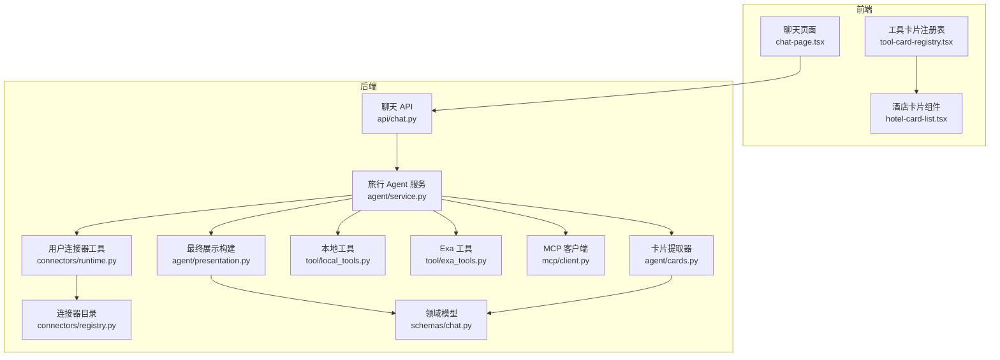
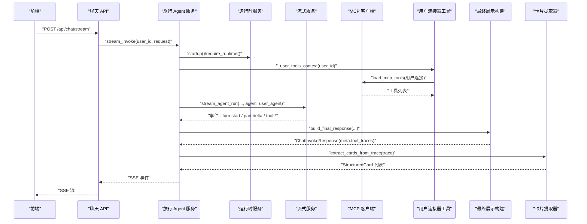
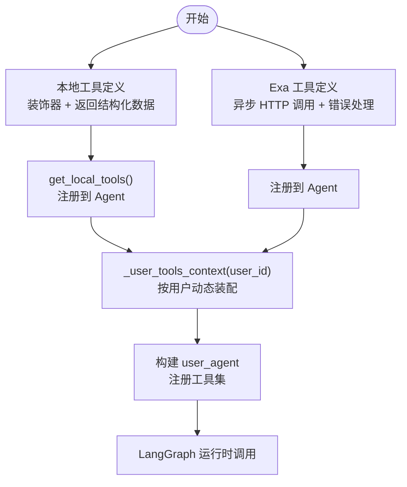
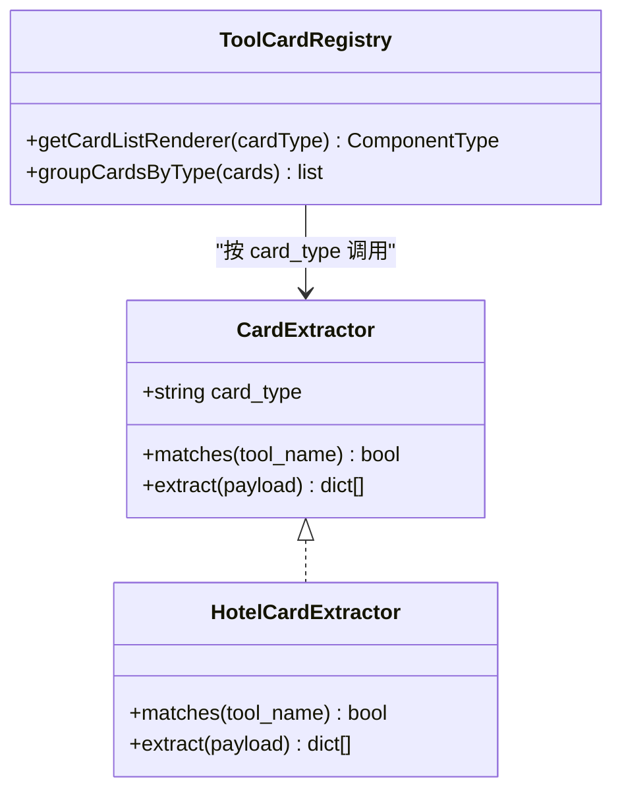
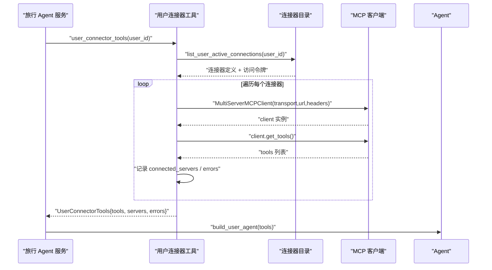
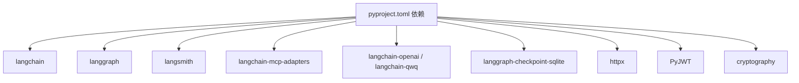

# 扩展开发

<cite>
**本文引用的文件**
- [backend/app/agent/service.py](file://backend/app/agent/service.py)
- [backend/app/agent/presentation.py](file://backend/app/agent/presentation.py)
- [backend/app/agent/cards.py](file://backend/app/agent/cards.py)
- [backend/app/tool/local_tools.py](file://backend/app/tool/local_tools.py)
- [backend/app/tool/exa_tools.py](file://backend/app/tool/exa_tools.py)
- [backend/app/mcp/client.py](file://backend/app/mcp/client.py)
- [backend/app/connectors/runtime.py](file://backend/app/connectors/runtime.py)
- [backend/app/connectors/registry.py](file://backend/app/connectors/registry.py)
- [backend/app/api/chat.py](file://backend/app/api/chat.py)
- [backend/app/schemas/chat.py](file://backend/app/schemas/chat.py)
- [backend/pyproject.toml](file://backend/pyproject.toml)
- [backend/config/connectors.example.json](file://backend/config/connectors.example.json)
- [frontend/src/features/chat/model/tool-card-registry.tsx](file://frontend/src/features/chat/model/tool-card-registry.tsx)
- [frontend/src/features/chat/ui/hotel-card-list.tsx](file://frontend/src/features/chat/ui/hotel-card-list.tsx)
- [frontend/src/features/chat/model/chat.types.ts](file://frontend/src/features/chat/model/chat.types.ts)
</cite>

## 目录
1. [简介](#简介)
2. [项目结构](#项目结构)
3. [核心组件](#核心组件)
4. [架构总览](#架构总览)
5. [详细组件分析](#详细组件分析)
6. [依赖关系分析](#依赖关系分析)
7. [性能考量](#性能考量)
8. [故障排查指南](#故障排查指南)
9. [结论](#结论)
10. [附录](#附录)

## 简介
本文件面向扩展开发者，系统性说明如何在现有 AI 旅行 Agent 中进行功能扩展与定制，覆盖以下主题：
- 新工具开发流程与注册机制
- 工具卡片渲染器实现与扩展
- MCP 工具集成、连接器开发与第三方服务接入
- 自定义 Agent 行为、提示词工程与模型配置优化
- 插件开发指南、API 扩展方法与 UI 组件定制
- 性能优化技巧、安全考虑与兼容性保障
- 实际案例分析与最佳实践

## 项目结构
后端采用分层架构：API 层负责 SSE 流事件封装，服务层聚合运行时、检查点、流式处理与语音合成，工具层提供本地与第三方工具，MCP 层负责多服务器工具加载，连接器层管理用户授权与动态工具装配。前端通过类型化消息与卡片渲染器解耦展示。

图表来源
- [backend/app/api/chat.py:1-72](file://backend/app/api/chat.py#L1-L72)
- [backend/app/agent/service.py:1-529](file://backend/app/agent/service.py#L1-L529)
- [backend/app/agent/presentation.py:1-118](file://backend/app/agent/presentation.py#L1-L118)
- [backend/app/agent/cards.py:1-342](file://backend/app/agent/cards.py#L1-L342)
- [backend/app/tool/local_tools.py:1-56](file://backend/app/tool/local_tools.py#L1-L56)
- [backend/app/tool/exa_tools.py:1-216](file://backend/app/tool/exa_tools.py#L1-L216)
- [backend/app/mcp/client.py:1-69](file://backend/app/mcp/client.py#L1-L69)
- [backend/app/connectors/runtime.py:1-88](file://backend/app/connectors/runtime.py#L1-L88)
- [backend/app/connectors/registry.py:1-62](file://backend/app/connectors/registry.py#L1-L62)
- [backend/app/schemas/chat.py:1-200](file://backend/app/schemas/chat.py#L1-L200)

章节来源
- [backend/app/api/chat.py:1-72](file://backend/app/api/chat.py#L1-L72)
- [backend/app/agent/service.py:1-529](file://backend/app/agent/service.py#L1-L529)
- [backend/app/agent/presentation.py:1-118](file://backend/app/agent/presentation.py#L1-L118)
- [backend/app/agent/cards.py:1-342](file://backend/app/agent/cards.py#L1-L342)
- [backend/app/tool/local_tools.py:1-56](file://backend/app/tool/local_tools.py#L1-L56)
- [backend/app/tool/exa_tools.py:1-216](file://backend/app/tool/exa_tools.py#L1-L216)
- [backend/app/mcp/client.py:1-69](file://backend/app/mcp/client.py#L1-L69)
- [backend/app/connectors/runtime.py:1-88](file://backend/app/connectors/runtime.py#L1-L88)
- [backend/app/connectors/registry.py:1-62](file://backend/app/connectors/registry.py#L1-L62)
- [backend/app/schemas/chat.py:1-200](file://backend/app/schemas/chat.py#L1-L200)

## 核心组件
- 旅行 Agent 服务：封装运行时启动、会话管理、模型档位、流式调用、语音合成与检查点回滚等能力。
- 工具与卡片：本地工具（如时间查询、Exa 搜索/抓取）、MCP 工具动态加载、卡片提取器与前端渲染器。
- 连接器与目录：管理员维护的连接器目录，用户级连接器工具装配与生命周期管理。
- API 与类型：SSE 流式聊天 API、统一的聊天领域模型与事件类型。

章节来源
- [backend/app/agent/service.py:97-529](file://backend/app/agent/service.py#L97-L529)
- [backend/app/tool/local_tools.py:49-56](file://backend/app/tool/local_tools.py#L49-L56)
- [backend/app/tool/exa_tools.py:190-216](file://backend/app/tool/exa_tools.py#L190-L216)
- [backend/app/agent/cards.py:306-342](file://backend/app/agent/cards.py#L306-L342)
- [backend/app/connectors/runtime.py:50-88](file://backend/app/connectors/runtime.py#L50-L88)
- [backend/app/connectors/registry.py:23-62](file://backend/app/connectors/registry.py#L23-L62)
- [backend/app/api/chat.py:41-72](file://backend/app/api/chat.py#L41-L72)
- [backend/app/schemas/chat.py:18-200](file://backend/app/schemas/chat.py#L18-L200)

## 架构总览
下图展示了从前端发起聊天请求到后端构建最终响应与卡片提取的整体流程，以及 MCP 工具与连接器的集成路径。

图表来源
- [backend/app/api/chat.py:41-72](file://backend/app/api/chat.py#L41-L72)
- [backend/app/agent/service.py:373-507](file://backend/app/agent/service.py#L373-L507)
- [backend/app/agent/presentation.py:17-36](file://backend/app/agent/presentation.py#L17-L36)
- [backend/app/agent/cards.py:315-342](file://backend/app/agent/cards.py#L315-L342)
- [backend/app/mcp/client.py:32-69](file://backend/app/mcp/client.py#L32-L69)
- [backend/app/connectors/runtime.py:50-88](file://backend/app/connectors/runtime.py#L50-L88)

## 详细组件分析

### 新工具开发与注册机制
- 本地工具
  - 使用装饰器声明工具函数，返回结构化结果或 ToolMessage，支持注入工具调用 ID 与状态。
  - 将工具加入本地工具列表，随 Agent 一起注册。
- 第三方工具（示例：Exa）
  - 通过异步 HTTP 客户端调用外部 API，统一错误处理与 Artifact 返回。
  - 支持搜索与内容抓取两类工具，便于检索与摘要场景。
- 工具注册与装配
  - 旅行 Agent 服务在每次会话中按需装配用户级 MCP 工具与本地工具，形成完整的工具集。

图表来源
- [backend/app/tool/local_tools.py:16-56](file://backend/app/tool/local_tools.py#L16-L56)
- [backend/app/tool/exa_tools.py:108-216](file://backend/app/tool/exa_tools.py#L108-L216)
- [backend/app/agent/service.py:513-521](file://backend/app/agent/service.py#L513-L521)

章节来源
- [backend/app/tool/local_tools.py:16-56](file://backend/app/tool/local_tools.py#L16-L56)
- [backend/app/tool/exa_tools.py:108-216](file://backend/app/tool/exa_tools.py#L108-L216)
- [backend/app/agent/service.py:513-521](file://backend/app/agent/service.py#L513-L521)

### 工具卡片渲染器实现
- 卡片提取器（后端）
  - 定义协议型提取器，按工具名匹配与 payload 形状提取结构化卡片数据。
  - 提供通用解包与归一化逻辑，确保不同 MCP 工具返回格式的一致性。
  - 已内置酒店卡片提取器，支持多形态输入与字段归一化。
- 前端渲染器（注册表）
  - 通过 card_type 将提取器输出映射到具体 React 组件，按类型分组渲染。
  - 新增卡片类型仅需在后端实现提取器并在前端注册渲染器。

图表来源
- [backend/app/agent/cards.py:34-46](file://backend/app/agent/cards.py#L34-L46)
- [backend/app/agent/cards.py:247-299](file://backend/app/agent/cards.py#L247-L299)
- [frontend/src/features/chat/model/tool-card-registry.tsx:75-99](file://frontend/src/features/chat/model/tool-card-registry.tsx#L75-L99)

章节来源
- [backend/app/agent/cards.py:34-46](file://backend/app/agent/cards.py#L34-L46)
- [backend/app/agent/cards.py:247-299](file://backend/app/agent/cards.py#L247-L299)
- [frontend/src/features/chat/model/tool-card-registry.tsx:75-99](file://frontend/src/features/chat/model/tool-card-registry.tsx#L75-L99)

### MCP 工具集成与连接器开发
- MCP 客户端
  - 支持多服务器连接，按配置初始化客户端并批量加载工具。
  - 返回工具集合、成功连接的服务名与错误列表，便于诊断。
- 用户连接器工具
  - 基于用户已授权的连接器定义，推断传输方式（SSE 或 HTTP），构造请求头并加载工具。
  - 生命周期由上下文管理器控制，退出时自动关闭连接。
- 连接器目录
  - 管理员维护的连接器清单，支持启用/禁用与元数据配置。
  - 支持通过环境变量覆盖默认目录路径。

图表来源
- [backend/app/connectors/runtime.py:50-88](file://backend/app/connectors/runtime.py#L50-L88)
- [backend/app/mcp/client.py:32-69](file://backend/app/mcp/client.py#L32-L69)
- [backend/app/connectors/registry.py:23-62](file://backend/app/connectors/registry.py#L23-L62)

章节来源
- [backend/app/mcp/client.py:32-69](file://backend/app/mcp/client.py#L32-L69)
- [backend/app/connectors/runtime.py:50-88](file://backend/app/connectors/runtime.py#L50-L88)
- [backend/app/connectors/registry.py:23-62](file://backend/app/connectors/registry.py#L23-L62)
- [backend/config/connectors.example.json:1-25](file://backend/config/connectors.example.json#L1-L25)

### 第三方服务集成（以 Exa 为例）
- 关键点
  - 通过环境变量注入 API Key，统一错误消息与状态码映射。
  - 将工具调用结果封装为 ToolMessage，携带 content 与 artifact，便于前端展示与调试。
  - 支持搜索与内容抓取两类能力，满足检索与摘要场景。
- 安全与健壮性
  - 异常捕获与错误归一化，避免泄露敏感细节。
  - 对空输入进行显式校验与错误提示。

章节来源
- [backend/app/tool/exa_tools.py:27-78](file://backend/app/tool/exa_tools.py#L27-L78)
- [backend/app/tool/exa_tools.py:108-216](file://backend/app/tool/exa_tools.py#L108-L216)

### 自定义 Agent 行为、提示词工程与模型配置优化
- 模型档位与会话记忆
  - 支持为会话设置模型档位，服务层在运行时解析并应用。
  - 通过检查点与 SQLite 存储实现对话历史与版本管理。
- 提示词与推理内容
  - 最终响应包含 reasoning 文本与工具轨迹，便于调试与溯源。
  - 前端可按事件流增量渲染文本与推理块。
- 优化建议
  - 合理选择模型档位以平衡成本与质量。
  - 在工具调用前注入上下文（如时区、语言），提升工具准确性。

章节来源
- [backend/app/agent/service.py:141-163](file://backend/app/agent/service.py#L141-L163)
- [backend/app/agent/service.py:212-220](file://backend/app/agent/service.py#L212-L220)
- [backend/app/agent/presentation.py:17-36](file://backend/app/agent/presentation.py#L17-L36)
- [backend/app/schemas/chat.py:18-200](file://backend/app/schemas/chat.py#L18-L200)

### 插件开发指南、API 扩展与 UI 定制
- 插件开发
  - 后端：新增本地工具或 MCP 工具，确保返回结构化数据或 ToolMessage。
  - 前端：在工具卡片注册表中添加新的 card_type 对应渲染器。
- API 扩展
  - 在 API 层增加路由与事件编码，保持与现有 SSE 协议一致。
  - 在服务层扩展业务逻辑，注意错误边界与日志记录。
- UI 定制
  - 遵循现有卡片渲染约定，组件自行处理空数组与字段缺失。
  - 通过类型系统约束数据形状，避免跨边界泄漏业务模型。

章节来源
- [frontend/src/features/chat/model/tool-card-registry.tsx:60-99](file://frontend/src/features/chat/model/tool-card-registry.tsx#L60-L99)
- [frontend/src/features/chat/ui/hotel-card-list.tsx:19-39](file://frontend/src/features/chat/ui/hotel-card-list.tsx#L19-L39)
- [backend/app/api/chat.py:41-72](file://backend/app/api/chat.py#L41-L72)
- [backend/app/schemas/chat.py:18-200](file://backend/app/schemas/chat.py#L18-L200)

## 依赖关系分析
后端依赖以 LangChain/LangGraph 为核心，结合 MCP 适配器、SQLite 检查点、语音服务与第三方 HTTP 客户端。前端通过类型与事件契约与后端解耦。

图表来源
- [backend/pyproject.toml:6-24](file://backend/pyproject.toml#L6-L24)

章节来源
- [backend/pyproject.toml:6-24](file://backend/pyproject.toml#L6-L24)

## 性能考量
- 流式输出与增量渲染
  - 使用 SSE 事件流与部分增量事件，降低前端等待时间。
  - 语音合成与文本增量同步推进，减少延迟。
- 工具调用与缓存
  - 对高频工具调用结果进行缓存（如搜索摘要），避免重复请求。
  - 合理设置超时与重试策略，提升稳定性。
- 数据结构与序列化
  - 统一使用 Pydantic 模型，减少序列化开销与字段漂移风险。
- 模型档位与并发
  - 根据任务复杂度选择合适档位，避免过度计算。
  - 控制并发工具调用数量，防止资源争用。

## 故障排查指南
- 工具加载失败
  - 检查 MCP 服务器连接配置与访问令牌有效性。
  - 查看连接器目录是否启用目标连接器。
- 工具调用异常
  - 关注工具返回的 ToolMessage 状态与 artifact，定位错误原因。
  - 核对环境变量（如 EXA_API_KEY）是否正确配置。
- 流式事件异常
  - 捕获并记录服务层异常，前端显示通用错误提示。
  - 检查 SSE 编码与网络中断处理。

章节来源
- [backend/app/mcp/client.py:32-69](file://backend/app/mcp/client.py#L32-L69)
- [backend/app/connectors/runtime.py:50-88](file://backend/app/connectors/runtime.py#L50-L88)
- [backend/app/tool/exa_tools.py:27-78](file://backend/app/tool/exa_tools.py#L27-L78)
- [backend/app/api/chat.py:55-61](file://backend/app/api/chat.py#L55-L61)

## 结论
通过模块化设计与清晰的契约（类型、事件、渲染器），本项目提供了高扩展性的 Agent 平台。开发者可按需新增工具、卡片与连接器，同时保持前后端解耦与运行时稳定性。建议在扩展过程中严格遵循类型约束、错误处理与性能优化原则，确保系统的可维护性与可扩展性。

## 附录
- 新增卡片类型步骤
  - 后端：实现提取器并加入提取器列表。
  - 前端：在工具卡片注册表中添加对应渲染器。
- 新增本地工具步骤
  - 定义工具函数，加入本地工具列表，随 Agent 注册。
- 新增 MCP 工具步骤
  - 配置连接器目录，确保启用并正确授权，运行时自动装配。
- API 扩展步骤
  - 新增路由与事件编码，保持与现有协议一致；在服务层扩展业务逻辑并完善错误处理。