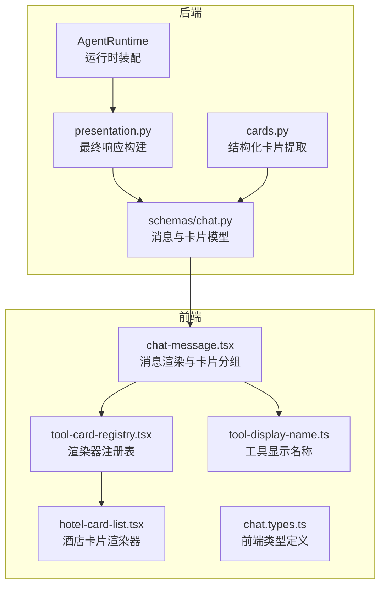
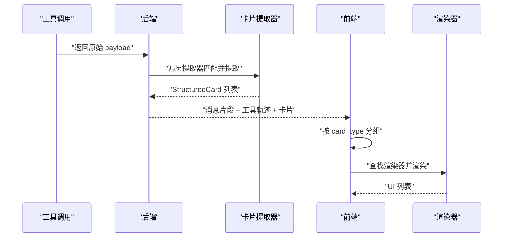
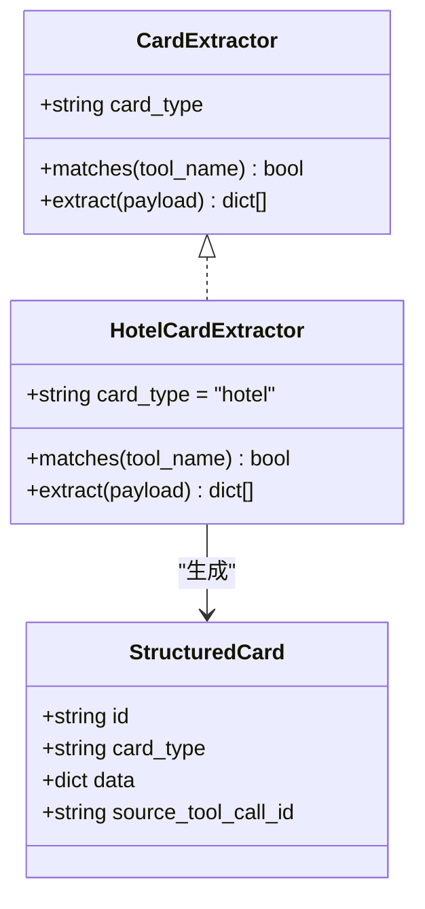
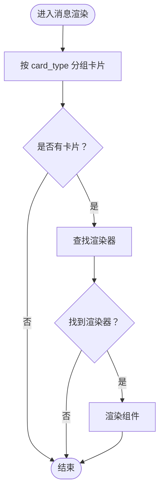
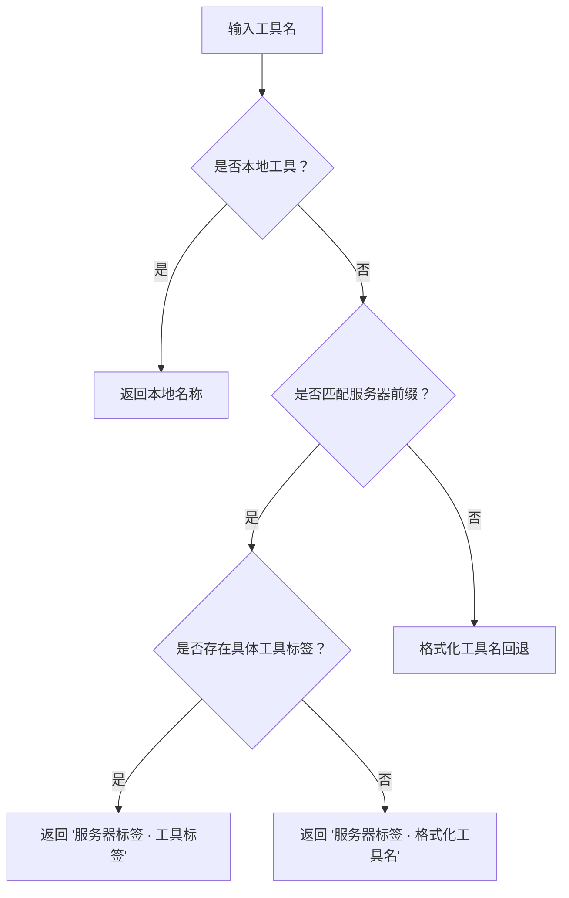
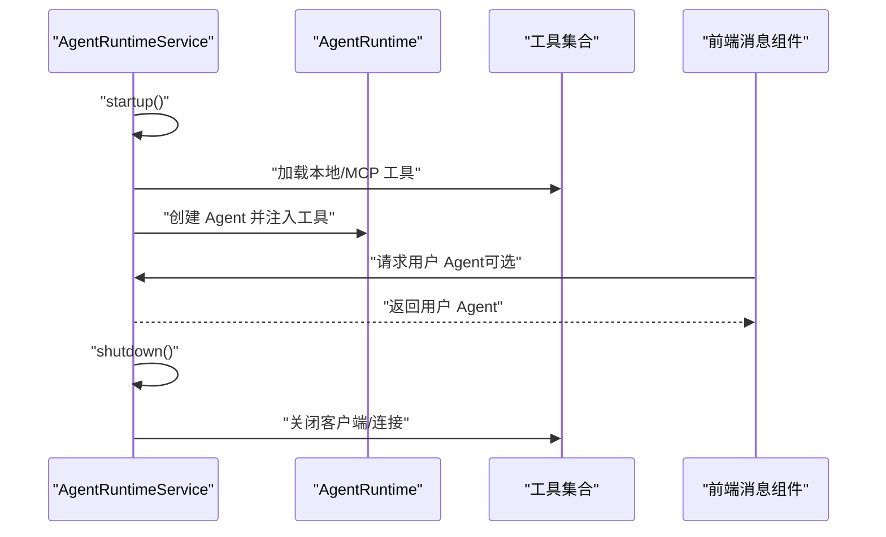
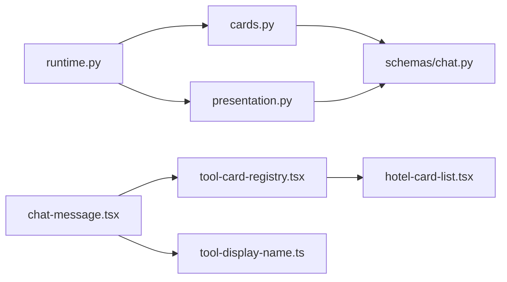

# 插件系统

<cite>
**本文引用的文件**   
- [backend/app/agent/cards.py](file://backend/app/agent/cards.py)
- [backend/app/schemas/chat.py](file://backend/app/schemas/chat.py)
- [backend/app/agent/presentation.py](file://backend/app/agent/presentation.py)
- [backend/app/agent/runtime.py](file://backend/app/agent/runtime.py)
- [frontend/src/features/chat/model/tool-card-registry.tsx](file://frontend/src/features/chat/model/tool-card-registry.tsx)
- [frontend/src/features/chat/ui/chat-message.tsx](file://frontend/src/features/chat/ui/chat-message.tsx)
- [frontend/src/features/chat/ui/hotel-card-list.tsx](file://frontend/src/features/chat/ui/hotel-card-list.tsx)
- [frontend/src/features/chat/model/tool-display-name.ts](file://frontend/src/features/chat/model/tool-display-name.ts)
- [frontend/src/features/chat/model/chat.types.ts](file://frontend/src/features/chat/model/chat.types.ts)
</cite>

## 目录
1. [简介](#简介)
2. [项目结构](#项目结构)
3. [核心组件](#核心组件)
4. [架构总览](#架构总览)
5. [详细组件分析](#详细组件分析)
6. [依赖关系分析](#依赖关系分析)
7. [性能考量](#性能考量)
8. [故障排查指南](#故障排查指南)
9. [结论](#结论)
10. [附录](#附录)

## 简介
本文件面向希望扩展与定制 Agent 功能插件的开发者，系统阐述“工具卡片”插件体系的设计与实现：包括后端工具返回的结构化卡片提取、前端渲染器注册与动态加载、工具显示名称的本地化、卡片样式与交互扩展、生命周期与状态同步、国际化与样式定制、最佳实践与性能优化、打包发布与版本管理、以及调试技巧与完整示例路径。

## 项目结构
插件系统跨越后端 Python 与前端 TypeScript 两部分，围绕“工具调用 → 结构化卡片 → 前端渲染”的链路协作：
- 后端负责工具调用与结果解析，将原始 payload 提炼为类型化的结构化卡片，并在最终消息中携带工具轨迹与推理信息。
- 前端负责根据卡片类型动态选择渲染器，分组展示卡片列表，并提供工具显示名称的本地化与样式定制能力。

图表来源
- [backend/app/agent/runtime.py:61-174](file://backend/app/agent/runtime.py#L61-L174)
- [backend/app/agent/presentation.py:17-118](file://backend/app/agent/presentation.py#L17-L118)
- [backend/app/agent/cards.py:315-342](file://backend/app/agent/cards.py#L315-L342)
- [backend/app/schemas/chat.py:31-110](file://backend/app/schemas/chat.py#L31-L110)
- [frontend/src/features/chat/ui/chat-message.tsx:420-476](file://frontend/src/features/chat/ui/chat-message.tsx#L420-L476)
- [frontend/src/features/chat/model/tool-card-registry.tsx:60-99](file://frontend/src/features/chat/model/tool-card-registry.tsx#L60-L99)
- [frontend/src/features/chat/ui/hotel-card-list.tsx:180-198](file://frontend/src/features/chat/ui/hotel-card-list.tsx#L180-L198)
- [frontend/src/features/chat/model/tool-display-name.ts:51-72](file://frontend/src/features/chat/model/tool-display-name.ts#L51-L72)
- [frontend/src/features/chat/model/chat.types.ts:28-60](file://frontend/src/features/chat/model/chat.types.ts#L28-L60)

章节来源
- [backend/app/agent/runtime.py:61-174](file://backend/app/agent/runtime.py#L61-L174)
- [backend/app/agent/presentation.py:17-118](file://backend/app/agent/presentation.py#L17-L118)
- [backend/app/agent/cards.py:315-342](file://backend/app/agent/cards.py#L315-L342)
- [backend/app/schemas/chat.py:31-110](file://backend/app/schemas/chat.py#L31-L110)
- [frontend/src/features/chat/ui/chat-message.tsx:420-476](file://frontend/src/features/chat/ui/chat-message.tsx#L420-L476)
- [frontend/src/features/chat/model/tool-card-registry.tsx:60-99](file://frontend/src/features/chat/model/tool-card-registry.tsx#L60-L99)
- [frontend/src/features/chat/ui/hotel-card-list.tsx:180-198](file://frontend/src/features/chat/ui/hotel-card-list.tsx#L180-L198)
- [frontend/src/features/chat/model/tool-display-name.ts:51-72](file://frontend/src/features/chat/model/tool-display-name.ts#L51-L72)
- [frontend/src/features/chat/model/chat.types.ts:28-60](file://frontend/src/features/chat/model/chat.types.ts#L28-L60)

## 核心组件
- 后端卡片提取器与注册表
  - 卡片提取协议与实现：定义匹配规则与提取逻辑，确保“首个命中即接管”，避免重复渲染。
  - 预置提取器：酒店卡片提取器，支持多种输入形态与嵌套结构。
  - 提取入口：从工具轨迹中抽取结构化卡片，输出类型化卡片对象。
- 前端渲染器注册与分组
  - 渲染器注册表：将卡片类型映射到具体渲染组件，支持列表型渲染器。
  - 分组算法：按连续相同类型聚合，便于一次性渲染。
- 工具显示名称本地化
  - 本地工具与 MCP 服务器维度的名称表，支持回退格式化。
- 类型与消息模型
  - 后端与前端共享的结构化卡片与消息片段模型，确保跨边界一致性。

章节来源
- [backend/app/agent/cards.py:34-46](file://backend/app/agent/cards.py#L34-L46)
- [backend/app/agent/cards.py:247-299](file://backend/app/agent/cards.py#L247-L299)
- [backend/app/agent/cards.py:315-342](file://backend/app/agent/cards.py#L315-L342)
- [frontend/src/features/chat/model/tool-card-registry.tsx:30-41](file://frontend/src/features/chat/model/tool-card-registry.tsx#L30-L41)
- [frontend/src/features/chat/model/tool-card-registry.tsx:84-99](file://frontend/src/features/chat/model/tool-card-registry.tsx#L84-L99)
- [frontend/src/features/chat/model/tool-display-name.ts:51-72](file://frontend/src/features/chat/model/tool-display-name.ts#L51-L72)
- [backend/app/schemas/chat.py:63-77](file://backend/app/schemas/chat.py#L63-L77)
- [frontend/src/features/chat/model/chat.types.ts:28-34](file://frontend/src/features/chat/model/chat.types.ts#L28-L34)

## 架构总览
整体流程：工具调用返回 → 后端提取结构化卡片 → 前端按类型分组渲染 → 工具显示名称本地化。

图表来源
- [backend/app/agent/cards.py:315-342](file://backend/app/agent/cards.py#L315-L342)
- [frontend/src/features/chat/ui/chat-message.tsx:420-476](file://frontend/src/features/chat/ui/chat-message.tsx#L420-L476)
- [frontend/src/features/chat/model/tool-card-registry.tsx:75-99](file://frontend/src/features/chat/model/tool-card-registry.tsx#L75-L99)

## 详细组件分析

### 后端：结构化卡片提取与注册
- 设计要点
  - 协议式提取器：定义 card_type、匹配规则与提取方法，确保扩展简单、边界清晰。
  - 容错策略：不抛异常，遇到不识别形状返回空列表，保障主流程稳定。
  - 多形态输入适配：支持纯字符串、MCP 文本块包装、字典与列表嵌套等。
- 酒店卡片提取器
  - 匹配：基于工具名关键词判断。
  - 形态：支持列表、字典、嵌套列表等；对价格、评分、地址、星级等字段进行归一化。
- 提取入口
  - 遍历注册的提取器，首个匹配者负责；将结果封装为结构化卡片，包含来源工具调用 ID，便于追踪。

图表来源
- [backend/app/agent/cards.py:34-46](file://backend/app/agent/cards.py#L34-L46)
- [backend/app/agent/cards.py:247-299](file://backend/app/agent/cards.py#L247-L299)
- [backend/app/schemas/chat.py:63-77](file://backend/app/schemas/chat.py#L63-L77)

章节来源
- [backend/app/agent/cards.py:34-46](file://backend/app/agent/cards.py#L34-L46)
- [backend/app/agent/cards.py:247-299](file://backend/app/agent/cards.py#L247-L299)
- [backend/app/agent/cards.py:315-342](file://backend/app/agent/cards.py#L315-L342)
- [backend/app/schemas/chat.py:63-77](file://backend/app/schemas/chat.py#L63-L77)

### 前端：渲染器注册与动态加载
- 渲染器注册表
  - 将 card_type 映射到列表型渲染器组件，组件自行处理空数组场景。
  - 提供获取渲染器与按类型分组卡片的工具函数。
- 消息渲染与卡片展示
  - 工具组折叠展示，仅在工具执行完成后渲染卡片，避免中间态。
  - 使用分组函数将连续同类卡片聚合，减少渲染开销。
- 酒店卡片渲染器
  - 适配后端输出的酒店数据结构，按存在性渲染关键信息，支持图片懒加载与错误回退。
  - 提供横向滚动的卡片列表布局，移动端友好。

图表来源
- [frontend/src/features/chat/ui/chat-message.tsx:420-476](file://frontend/src/features/chat/ui/chat-message.tsx#L420-L476)
- [frontend/src/features/chat/model/tool-card-registry.tsx:75-99](file://frontend/src/features/chat/model/tool-card-registry.tsx#L75-L99)

章节来源
- [frontend/src/features/chat/model/tool-card-registry.tsx:30-41](file://frontend/src/features/chat/model/tool-card-registry.tsx#L30-L41)
- [frontend/src/features/chat/model/tool-card-registry.tsx:60-99](file://frontend/src/features/chat/model/tool-card-registry.tsx#L60-L99)
- [frontend/src/features/chat/ui/chat-message.tsx:420-476](file://frontend/src/features/chat/ui/chat-message.tsx#L420-L476)
- [frontend/src/features/chat/ui/hotel-card-list.tsx:180-198](file://frontend/src/features/chat/ui/hotel-card-list.tsx#L180-L198)

### 工具显示名称的国际化与本地化
- 本地工具名称表：键为后端本地工具函数名，值为展示名称。
- MCP 工具名称表：按服务器前缀组织，展示格式为“服务器标签 · 工具标签”，未注册时回退为格式化工具名。
- 前端渲染：在工具芯片与详情面板中统一使用该函数进行名称展示。

图表来源
- [frontend/src/features/chat/model/tool-display-name.ts:51-72](file://frontend/src/features/chat/model/tool-display-name.ts#L51-L72)

章节来源
- [frontend/src/features/chat/model/tool-display-name.ts:5-72](file://frontend/src/features/chat/model/tool-display-name.ts#L5-L72)
- [frontend/src/features/chat/ui/chat-message.tsx:450-455](file://frontend/src/features/chat/ui/chat-message.tsx#L450-L455)

### 生命周期管理与状态同步
- 后端运行时
  - 初始化：加载本地工具、MCP 工具、内存检查点、模型档位，装配 Agent。
  - 用户级扩展：按需为用户构建挂载额外工具的 Agent。
  - 关闭：关闭 MCP 客户端与数据库连接，释放资源。
  - 快照：导出运行时状态，便于健康检查与可观测性。
- 前端状态
  - 工具组折叠与展开、版本切换、反馈与语音播放状态等，均在消息组件内管理，与卡片渲染解耦。

图表来源
- [backend/app/agent/runtime.py:80-155](file://backend/app/agent/runtime.py#L80-L155)
- [frontend/src/features/chat/ui/chat-message.tsx:612-674](file://frontend/src/features/chat/ui/chat-message.tsx#L612-L674)

章节来源
- [backend/app/agent/runtime.py:61-174](file://backend/app/agent/runtime.py#L61-L174)
- [frontend/src/features/chat/ui/chat-message.tsx:269-679](file://frontend/src/features/chat/ui/chat-message.tsx#L269-L679)

### 配置选项与数据模型
- 后端模型
  - 工具轨迹：记录工具名、调用 ID、结果状态与 payload。
  - 结构化卡片：包含 id、card_type、data 与来源工具调用 ID。
  - 最终响应：包含助手文本、工具轨迹与推理信息。
- 前端类型
  - 结构化卡片与消息片段类型，确保前后端一致。

章节来源
- [backend/app/schemas/chat.py:31-110](file://backend/app/schemas/chat.py#L31-L110)
- [backend/app/schemas/chat.py:132-137](file://backend/app/schemas/chat.py#L132-L137)
- [frontend/src/features/chat/model/chat.types.ts:28-60](file://frontend/src/features/chat/model/chat.types.ts#L28-L60)

## 依赖关系分析
- 后端
  - 运行时依赖：LangChain Agent、MCP 工具包、SQLite 检查点。
  - 卡片提取依赖：工具轨迹与结构化卡片模型。
- 前端
  - 渲染依赖：React 组件、工具显示名称、渲染器注册表与卡片分组工具。
  - 样式依赖：Tailwind 类名与图标库。

图表来源
- [backend/app/agent/cards.py:315-342](file://backend/app/agent/cards.py#L315-L342)
- [backend/app/schemas/chat.py:63-110](file://backend/app/schemas/chat.py#L63-L110)
- [backend/app/agent/presentation.py:17-36](file://backend/app/agent/presentation.py#L17-L36)
- [backend/app/agent/runtime.py:94-104](file://backend/app/agent/runtime.py#L94-L104)
- [frontend/src/features/chat/ui/chat-message.tsx:420-476](file://frontend/src/features/chat/ui/chat-message.tsx#L420-L476)
- [frontend/src/features/chat/model/tool-card-registry.tsx:60-99](file://frontend/src/features/chat/model/tool-card-registry.tsx#L60-L99)
- [frontend/src/features/chat/ui/hotel-card-list.tsx:180-198](file://frontend/src/features/chat/ui/hotel-card-list.tsx#L180-L198)
- [frontend/src/features/chat/model/tool-display-name.ts:51-72](file://frontend/src/features/chat/model/tool-display-name.ts#L51-L72)

章节来源
- [backend/app/agent/runtime.py:94-104](file://backend/app/agent/runtime.py#L94-L104)
- [backend/app/agent/presentation.py:17-36](file://backend/app/agent/presentation.py#L17-L36)
- [frontend/src/features/chat/ui/chat-message.tsx:420-476](file://frontend/src/features/chat/ui/chat-message.tsx#L420-L476)

## 性能考量
- 后端
  - 提取器短路：首个匹配即接管，避免重复计算。
  - 输入形态预处理：统一解析 JSON 字符串与 MCP 文本块包装，降低后续处理复杂度。
  - 字段归一化：减少前端适配成本，提升渲染稳定性。
- 前端
  - 渲染分组：按类型聚合，减少重复查找与渲染。
  - 图片懒加载与错误回退：避免阻塞主线程与提升健壮性。
  - 组件最小化：渲染器仅处理自身职责，保持消息组件简洁。

[本节为通用指导，不直接分析具体文件]

## 故障排查指南
- 工具未显示卡片
  - 检查后端是否注册了对应提取器，且匹配规则是否覆盖该工具名。
  - 确认前端渲染器注册表是否包含该 card_type。
- 卡片渲染为空
  - 核对提取器对 payload 的归一化与过滤逻辑，确认数据字段存在。
  - 前端分组函数是否正确聚合同类卡片。
- 工具显示名称异常
  - 检查本地工具或 MCP 工具名称表是否正确配置，必要时回退格式化。
- 运行时启动失败
  - 查看 MCP 连接与工具加载日志，关注错误快照输出。

章节来源
- [backend/app/agent/cards.py:315-342](file://backend/app/agent/cards.py#L315-L342)
- [frontend/src/features/chat/model/tool-card-registry.tsx:75-99](file://frontend/src/features/chat/model/tool-card-registry.tsx#L75-L99)
- [frontend/src/features/chat/model/tool-display-name.ts:51-72](file://frontend/src/features/chat/model/tool-display-name.ts#L51-L72)
- [backend/app/agent/runtime.py:156-174](file://backend/app/agent/runtime.py#L156-L174)

## 结论
该插件系统通过“后端提取 + 前端渲染”的清晰分工，实现了工具卡片的可扩展与低耦合：新增卡片类型仅需在两端各添加一处实现，即可无缝接入现有消息渲染与工具显示体系。配合完善的生命周期管理、类型模型与本地化支持，能够满足多场景下的功能扩展与产品化需求。

[本节为总结性内容，不直接分析具体文件]

## 附录

### 开发步骤与最佳实践
- 新增卡片类型（以“机票/行程/POI”为例）
  - 后端
    - 实现提取器：定义 card_type、匹配规则与提取方法，注册到提取器列表。
    - 确保对多种输入形态的兼容与容错。
  - 前端
    - 新增渲染器组件，按 data 字典渲染 UI。
    - 在渲染器注册表中添加映射，使用分组函数统一渲染。
  - 国际化
    - 在工具显示名称表中补充本地工具或 MCP 工具标签。
- 样式与交互
  - 使用现有卡片组件作为基线，按需扩展样式类名与交互行为。
  - 保持渲染器职责单一，避免在消息组件中混入渲染逻辑。
- 性能优化
  - 后端：尽量在提取阶段完成数据规整，减少前端重复处理。
  - 前端：利用分组与懒加载，避免不必要的重渲染。
- 兼容性
  - 严格遵守结构化卡片 data 字段的可选性，前端按存在性渲染。
  - 保持 card_type 的稳定性，避免破坏现有渲染器映射。

### 打包发布与版本管理
- 版本与依赖
  - 后端：通过运行时装配统一管理工具与模型，确保版本一致性。
  - 前端：通过组件注册表与类型定义约束版本边界。
- 发布建议
  - 以“提取器 + 渲染器 + 名称表”的最小单元进行发布与回滚。
  - 在变更前提供迁移指引与兼容策略，确保现有卡片不受影响。

### 调试技巧
- 后端
  - 在提取器中增加日志与断点，定位 payload 形态与字段差异。
  - 使用最小化 payload 复现实例，逐步扩大范围。
- 前端
  - 在渲染器组件中打印 props，确认 data 字段与 card_type。
  - 使用浏览器开发者工具检查渲染树与事件绑定。
- 端到端
  - 通过消息组件的工具详情面板核对工具名、入参与输出，辅助定位问题。

章节来源
- [backend/app/agent/cards.py:315-342](file://backend/app/agent/cards.py#L315-L342)
- [frontend/src/features/chat/ui/chat-message.tsx:612-674](file://frontend/src/features/chat/ui/chat-message.tsx#L612-L674)
- [frontend/src/features/chat/model/tool-card-registry.tsx:60-99](file://frontend/src/features/chat/model/tool-card-registry.tsx#L60-L99)
- [frontend/src/features/chat/model/tool-display-name.ts:51-72](file://frontend/src/features/chat/model/tool-display-name.ts#L51-L72)