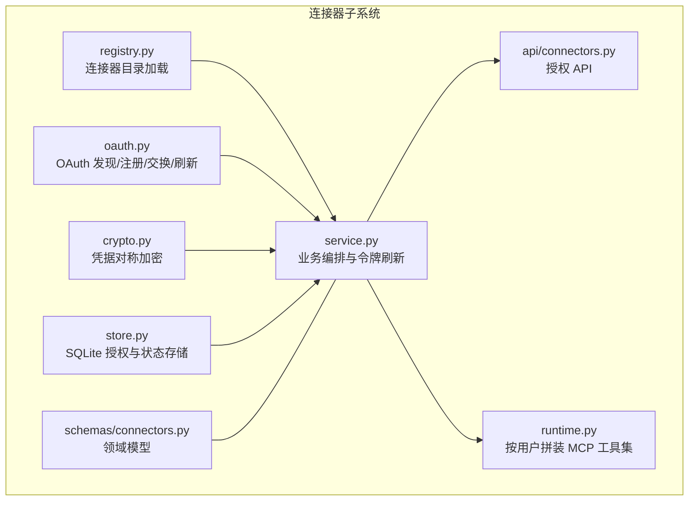
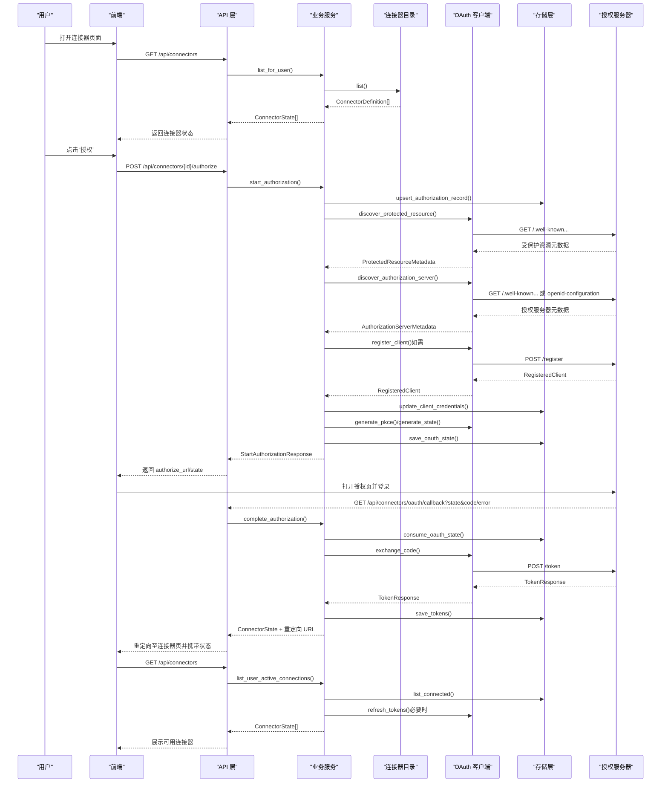
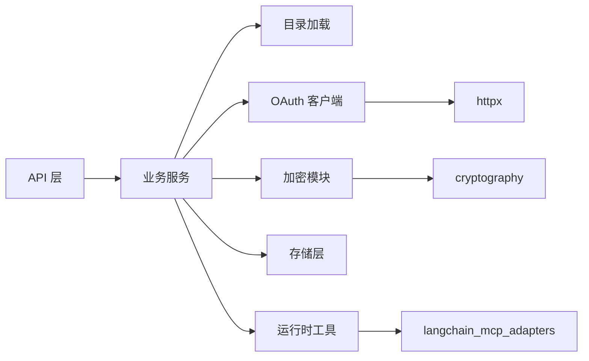
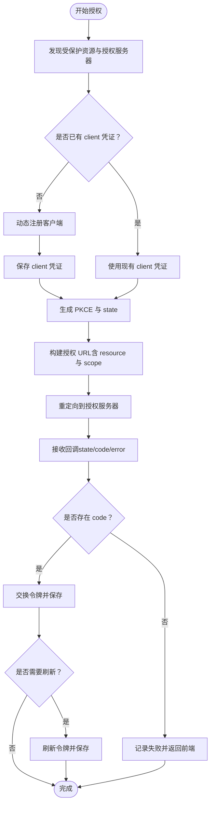

# 连接器开发

<cite>
**本文引用的文件**
- [backend/app/connectors/__init__.py](file://backend/app/connectors/__init__.py)
- [backend/app/connectors/registry.py](file://backend/app/connectors/registry.py)
- [backend/app/connectors/oauth.py](file://backend/app/connectors/oauth.py)
- [backend/app/connectors/crypto.py](file://backend/app/connectors/crypto.py)
- [backend/app/connectors/service.py](file://backend/app/connectors/service.py)
- [backend/app/connectors/store.py](file://backend/app/connectors/store.py)
- [backend/app/connectors/runtime.py](file://backend/app/connectors/runtime.py)
- [backend/app/schemas/connectors.py](file://backend/app/schemas/connectors.py)
- [backend/app/api/connectors.py](file://backend/app/api/connectors.py)
- [backend/config/connectors.example.json](file://backend/config/connectors.example.json)
- [backend/migrations/006_user_mcp_authorizations.sql](file://backend/migrations/006_user_mcp_authorizations.sql)
- [backend/tests/test_connectors_oauth.py](file://backend/tests/test_connectors_oauth.py)
- [backend/tests/test_connectors_crypto.py](file://backend/tests/test_connectors_crypto.py)
- [backend/app/main.py](file://backend/app/main.py)
</cite>

## 目录
1. [简介](#简介)
2. [项目结构](#项目结构)
3. [核心组件](#核心组件)
4. [架构总览](#架构总览)
5. [详细组件分析](#详细组件分析)
6. [依赖分析](#依赖分析)
7. [性能考量](#性能考量)
8. [故障排除指南](#故障排除指南)
9. [结论](#结论)
10. [附录](#附录)

## 简介
本文件面向希望为系统添加新外部服务连接器的开发者，提供从“注册、认证、加密、配置、状态管理、错误恢复”到“测试、监控与日志”的全流程开发指南。系统基于 MCP 协议与 OAuth 2.1 实现，支持动态客户端注册、PKCE、令牌刷新与安全存储，确保连接器在生产环境中的安全性与可靠性。

## 项目结构
连接器子系统位于后端模块 app/connectors 下，围绕“目录定义、OAuth 客户端、加密、持久化、运行时工具拼装、API 路由”等职责分层组织。管理员通过 JSON 文件维护连接器清单，运行时由服务层编排发现、注册、授权与令牌管理，并通过 SQLite 存储授权状态与临时 OAuth state；前端通过 API 完成授权回调与状态展示。

图表来源
- [backend/app/connectors/registry.py:23-62](file://backend/app/connectors/registry.py#L23-L62)
- [backend/app/connectors/oauth.py:1-419](file://backend/app/connectors/oauth.py#L1-L419)
- [backend/app/connectors/crypto.py:1-55](file://backend/app/connectors/crypto.py#L1-L55)
- [backend/app/connectors/store.py:78-349](file://backend/app/connectors/store.py#L78-L349)
- [backend/app/connectors/service.py:74-407](file://backend/app/connectors/service.py#L74-L407)
- [backend/app/connectors/runtime.py:50-88](file://backend/app/connectors/runtime.py#L50-L88)
- [backend/app/api/connectors.py:21-103](file://backend/app/api/connectors.py#L21-L103)
- [backend/app/schemas/connectors.py:13-51](file://backend/app/schemas/connectors.py#L13-L51)

章节来源
- [backend/app/connectors/__init__.py:1-5](file://backend/app/connectors/__init__.py#L1-L5)
- [backend/app/connectors/registry.py:23-62](file://backend/app/connectors/registry.py#L23-L62)
- [backend/app/connectors/service.py:74-407](file://backend/app/connectors/service.py#L74-L407)
- [backend/app/api/connectors.py:21-103](file://backend/app/api/connectors.py#L21-L103)

## 核心组件
- 连接器目录加载：从 JSON 文件读取管理员维护的连接器定义，支持按字母序列出启用项。
- OAuth 客户端：实现 RFC 9728、8414、7591、7636、8707，完成受保护资源元数据发现、授权服务器发现、动态客户端注册、授权码交换、PKCE、令牌刷新与资源指示。
- 加密模块：基于 AES-256-GCM 对敏感字符串进行加解密，密钥来源支持专用环境变量与 JWT 密钥回退。
- 存储层：SQLite 表 user_mcp_authorizations 记录授权与令牌，表 connector_oauth_states 记录一次性 OAuth state，支持 TTL 清理。
- 业务服务：编排发现、注册、授权、令牌刷新与状态构建，统一对外返回 ConnectorState。
- 运行时工具：按用户聚合已连接的 MCP 服务器，注入 Bearer 令牌，自动加载工具集。
- API 层：提供连接器列表、开始授权、断开授权、OAuth 回调等接口。

章节来源
- [backend/app/connectors/registry.py:23-62](file://backend/app/connectors/registry.py#L23-L62)
- [backend/app/connectors/oauth.py:1-419](file://backend/app/connectors/oauth.py#L1-L419)
- [backend/app/connectors/crypto.py:1-55](file://backend/app/connectors/crypto.py#L1-L55)
- [backend/app/connectors/store.py:78-349](file://backend/app/connectors/store.py#L78-L349)
- [backend/app/connectors/service.py:74-407](file://backend/app/connectors/service.py#L74-L407)
- [backend/app/connectors/runtime.py:50-88](file://backend/app/connectors/runtime.py#L50-L88)
- [backend/app/api/connectors.py:21-103](file://backend/app/api/connectors.py#L21-L103)
- [backend/app/schemas/connectors.py:13-51](file://backend/app/schemas/connectors.py#L13-L51)

## 架构总览
下图展示了从用户触发授权到运行时工具加载的关键交互路径，包括 OAuth 发现、动态注册、令牌交换与刷新、以及工具拼装。

图表来源
- [backend/app/api/connectors.py:24-95](file://backend/app/api/connectors.py#L24-L95)
- [backend/app/connectors/service.py:108-271](file://backend/app/connectors/service.py#L108-L271)
- [backend/app/connectors/oauth.py:123-381](file://backend/app/connectors/oauth.py#L123-L381)
- [backend/app/connectors/store.py:105-221](file://backend/app/connectors/store.py#L105-L221)

## 详细组件分析

### 组件一：连接器目录加载（管理员维护）
- 职责：从 JSON 文件加载连接器定义，校验结构，按启用状态与 ID 排序返回。
- 关键点：支持通过环境变量覆盖默认路径；非法条目会抛出错误；返回类型为 ConnectorDefinition。
- 使用场景：API 列表、状态组装、默认作用域合并。

章节来源
- [backend/app/connectors/registry.py:15-62](file://backend/app/connectors/registry.py#L15-L62)
- [backend/config/connectors.example.json:1-25](file://backend/config/connectors.example.json#L1-L25)
- [backend/app/schemas/connectors.py:13-23](file://backend/app/schemas/connectors.py#L13-L23)

### 组件二：OAuth 客户端（发现/注册/交换/刷新/PKCE/资源指示）
- 职责：实现多条 RFC 规范，完成受保护资源与授权服务器元数据发现、动态客户端注册、授权码交换、PKCE、令牌刷新与资源指示。
- 关键点：
  - 受保护资源发现：优先尝试带路径的 .well-known 端点，再回落到根路径。
  - 授权服务器发现：支持 oauth-authorization-server 与 openid-configuration。
  - 动态注册：按规范构造请求，保存返回的 client_id/secret。
  - PKCE：生成 S256 verifier/challenge。
  - 令牌刷新：在过期前自动刷新，失败则标记为 expired。
  - 资源指示：规范化 MCP server URL 作为 resource 参数。
- 错误处理：HTTP 错误会记录警告并抛出业务异常，避免静默失败。

章节来源
- [backend/app/connectors/oauth.py:123-381](file://backend/app/connectors/oauth.py#L123-L381)
- [backend/app/connectors/oauth.py:82-87](file://backend/app/connectors/oauth.py#L82-L87)
- [backend/app/connectors/oauth.py:95-107](file://backend/app/connectors/oauth.py#L95-L107)

### 组件三：加密模块（对称加密凭据）
- 职责：对敏感字符串（如 access_token、refresh_token、client_secret）进行加解密。
- 关键点：
  - 密钥派生：使用 SHA-256 将任意长度密钥字符串派生为 32 字节密钥。
  - 密钥来源：优先 MCP_TOKEN_ENC_KEY；缺失时回退到 JWT_SECRET。
  - 加密格式：base64 编码，前缀 12 字节随机 nonce。
  - 解密校验：格式错误会抛出异常。
- 安全性：AES-256-GCM 提供机密性与完整性；密钥独立于 JWT，便于轮换。

章节来源
- [backend/app/connectors/crypto.py:18-55](file://backend/app/connectors/crypto.py#L18-L55)

### 组件四：存储层（SQLite 授权与 OAuth state）
- 职责：持久化用户对连接器的授权状态、OAuth 临时 state、令牌与元数据。
- 关键表：
  - user_mcp_authorizations：授权记录、client 凭证、令牌、过期时间、状态、错误信息。
  - connector_oauth_states：state、verifier、redirect_after、过期时间。
- 关键操作：upsert、更新 client 凭证、保存令牌、标记失败/撤销、消费 state、清理过期 state。
- 约束与索引：外键约束、唯一索引、状态枚举校验。

章节来源
- [backend/migrations/006_user_mcp_authorizations.sql:1-44](file://backend/migrations/006_user_mcp_authorizations.sql#L1-L44)
- [backend/app/connectors/store.py:105-221](file://backend/app/connectors/store.py#L105-L221)
- [backend/app/connectors/store.py:321-349](file://backend/app/connectors/store.py#L321-L349)

### 组件五：业务服务（编排与令牌刷新）
- 职责：协调目录、OAuth 发现/注册、授权流程、令牌保存与刷新、状态构建。
- 关键流程：
  - 开始授权：发现元数据、动态注册、生成 PKCE/state、保存 state、返回 authorize_url。
  - 完成授权：消费 state、校验用户与错误、交换令牌、保存令牌、返回状态与重定向 URL。
  - 用户活动连接：列出已连接记录，按需刷新令牌，失败标记 expired。
  - 断开授权：清空令牌并标记 revoked。
- 异常：统一包装为 ConnectorAuthorizationError，便于 API 层转换为 HTTP 400。

章节来源
- [backend/app/connectors/service.py:108-271](file://backend/app/connectors/service.py#L108-L271)
- [backend/app/connectors/service.py:334-373](file://backend/app/connectors/service.py#L334-L373)

### 组件六：运行时工具（按用户拼装 MCP 工具集）
- 职责：根据用户已连接的连接器，自动建立 MCP 客户端连接，注入 Bearer 令牌，加载工具集。
- 关键点：
  - 传输推断：根据 URL 路径判断 SSE 或 streamable_http。
  - 生命周期：异步上下文管理器，退出时自动关闭客户端。
  - 错误收集：加载失败记录到 errors，不影响其他连接器。

章节来源
- [backend/app/connectors/runtime.py:50-88](file://backend/app/connectors/runtime.py#L50-L88)

### 组件七：API 层（授权 API）
- 职责：提供连接器列表、开始授权、断开授权、OAuth 回调重定向。
- 关键点：
  - 列表：返回 ConnectorState。
  - 开始授权：返回 authorize_url、state、过期秒数。
  - 断开授权：返回最新状态。
  - 回调：无论成功/失败均重定向回前端，附带状态参数。

章节来源
- [backend/app/api/connectors.py:24-95](file://backend/app/api/connectors.py#L24-L95)

### 组件八：领域模型（连接器状态与响应）
- 职责：定义连接器元数据、状态、列表响应、开始授权响应。
- 关键点：状态枚举包含 pending/connected/expired/revoked/failed/disconnected；默认 disconnected。

章节来源
- [backend/app/schemas/connectors.py:13-51](file://backend/app/schemas/connectors.py#L13-L51)

## 依赖分析
- 组件耦合：
  - API 层依赖业务服务；业务服务依赖目录、OAuth、加密、存储；运行时依赖业务服务。
  - OAuth 与存储之间存在间接依赖（通过业务服务）。
- 外部依赖：
  - httpx：异步 HTTP 客户端，用于发现与令牌端点。
  - cryptography：AES-256-GCM 加密。
  - langchain_mcp_adapters：MCP 客户端工具加载。
- 循环依赖：未见循环导入。

图表来源
- [backend/app/api/connectors.py:11-18](file://backend/app/api/connectors.py#L11-L18)
- [backend/app/connectors/service.py:14-41](file://backend/app/connectors/service.py#L14-L41)
- [backend/app/connectors/oauth.py:22](file://backend/app/connectors/oauth.py#L22)
- [backend/app/connectors/crypto.py:10](file://backend/app/connectors/crypto.py#L10)
- [backend/app/connectors/runtime.py:11](file://backend/app/connectors/runtime.py#L11)

## 性能考量
- 异步 I/O：OAuth 发现与令牌交换使用 httpx 异步客户端，减少阻塞。
- 令牌预检：在刷新前检查过期时间，避免频繁刷新。
- 缓存与 LRU：加密密钥材料使用 LRU 缓存，降低重复派生成本。
- 连接复用：运行时工具在一次会话内复用 MCP 客户端，避免重复握手。
- 索引优化：SQLite 表包含必要的索引，提升查询效率。

章节来源
- [backend/app/connectors/oauth.py:28-29](file://backend/app/connectors/oauth.py#L28-L29)
- [backend/app/connectors/service.py:354-355](file://backend/app/connectors/service.py#L354-L355)
- [backend/app/connectors/crypto.py:18-32](file://backend/app/connectors/crypto.py#L18-L32)
- [backend/migrations/006_user_mcp_authorizations.sql:25-44](file://backend/migrations/006_user_mcp_authorizations.sql#L25-L44)

## 故障排除指南
- 授权失败
  - 现象：回调返回 error 或业务异常。
  - 排查：检查 CONNECTOR_REDIRECT_URL 与 CONNECTOR_FRONTEND_RETURN_URL 是否与 MCP 注册一致；确认 state 未过期；查看存储层 last_error。
- 令牌过期
  - 现象：调用第三方 API 返回 401。
  - 排查：确认 expires_at 是否存在；业务服务会在过期前自动刷新；若无 refresh_token 或 client 凭证缺失，将报错。
- 加密初始化失败
  - 现象：启动时报错提示缺少密钥。
  - 排查：设置 MCP_TOKEN_ENC_KEY 或 JWT_SECRET；重启服务。
- OAuth 发现失败
  - 现象：无法解析受保护资源或授权服务器元数据。
  - 排查：确认 MCP server 的 .well-known 端点可达；检查 URL 规范化逻辑。
- 回调重定向问题
  - 现象：前端未收到状态参数。
  - 排查：确认回调 URL 与注册一致；检查 API 层重定向参数拼接。

章节来源
- [backend/app/connectors/service.py:121-127](file://backend/app/connectors/service.py#L121-L127)
- [backend/app/connectors/service.py:221-224](file://backend/app/connectors/service.py#L221-L224)
- [backend/app/connectors/crypto.py:24-32](file://backend/app/connectors/crypto.py#L24-L32)
- [backend/app/connectors/oauth.py:123-217](file://backend/app/connectors/oauth.py#L123-L217)
- [backend/app/api/connectors.py:76-95](file://backend/app/api/connectors.py#L76-L95)

## 结论
该连接器子系统以清晰的分层设计实现了从“目录管理、OAuth 发现与注册、令牌管理与刷新、安全存储、运行时工具拼装”到“API 对接”的完整闭环。开发者只需按照标准配置文件格式新增连接器定义，即可通过 OAuth 流程完成授权与工具加载；系统内置的安全与错误处理机制可有效保障生产环境的稳定性与安全性。

## 附录

### A. 创建新连接器的步骤
- 准备
  - 在配置文件中新增连接器定义，至少包含 id、display_name、description、icon_url、mcp_server_url、enabled。
  - 设置环境变量：CONNECTOR_REDIRECT_URL、CONNECTOR_FRONTEND_RETURN_URL（与 MCP 注册一致）。
- 开发
  - 若授权服务器不支持动态注册，需在 MCP 侧预先注册并提供 client_id/secret。
  - 如需自定义默认作用域，可在定义中设置 default_scopes。
- 集成
  - 启动应用后，通过 API 获取连接器列表并发起授权。
  - 授权完成后，运行时工具会自动加载对应 MCP 工具集。
- 测试
  - 使用单元测试验证 PKCE、URL 规范化、作用域合并等逻辑。
  - 使用加密测试验证密钥来源与加解密往返。

章节来源
- [backend/config/connectors.example.json:1-25](file://backend/config/connectors.example.json#L1-L25)
- [backend/app/api/connectors.py:24-31](file://backend/app/api/connectors.py#L24-L31)
- [backend/tests/test_connectors_oauth.py:20-88](file://backend/tests/test_connectors_oauth.py#L20-L88)
- [backend/tests/test_connectors_crypto.py:17-47](file://backend/tests/test_connectors_crypto.py#L17-L47)

### B. OAuth 认证与令牌管理流程图

图表来源
- [backend/app/connectors/service.py:108-271](file://backend/app/connectors/service.py#L108-L271)
- [backend/app/connectors/oauth.py:297-381](file://backend/app/connectors/oauth.py#L297-L381)

### C. 配置标准化格式
- 连接器定义字段
  - id：连接器标识符（与文件键一致）
  - display_name：显示名称
  - description：描述
  - icon_url：图标 URL
  - mcp_server_url：MCP 服务器地址（支持 /sse）
  - default_scopes：默认作用域（可选）
  - enabled：是否启用
- 示例参考
  - [backend/config/connectors.example.json:1-25](file://backend/config/connectors.example.json#L1-L25)

章节来源
- [backend/config/connectors.example.json:1-25](file://backend/config/connectors.example.json#L1-L25)
- [backend/app/schemas/connectors.py:13-23](file://backend/app/schemas/connectors.py#L13-L23)

### D. 连接状态管理与错误恢复
- 状态枚举：pending/connected/expired/revoked/failed/disconnected
- 恢复策略：
  - 过期：自动刷新；失败：记录 last_error，保持记录以便重试。
  - 撤销：清空令牌并标记 revoked。
  - 失效：state 过期自动清理，避免重放攻击。
- 日志与监控：
  - 业务异常统一记录；回调端点记录警告与错误详情。
  - 建议在网关或代理层增加超时与限流策略，配合应用日志进行追踪。

章节来源
- [backend/app/schemas/connectors.py:10](file://backend/app/schemas/connectors.py#L10)
- [backend/app/connectors/store.py:222-250](file://backend/app/connectors/store.py#L222-L250)
- [backend/app/connectors/store.py:343-349](file://backend/app/connectors/store.py#L343-L349)
- [backend/app/connectors/service.py:261-268](file://backend/app/connectors/service.py#L261-L268)

### E. 第三方 API 集成示例与数据转换
- 示例：Notion/Linear
  - 在配置文件中定义 mcp_server_url 与默认作用域；授权后运行时工具自动加载工具集。
- 数据转换与格式化
  - URL 规范化：统一 scheme/netloc/path，移除多余斜杠。
  - 作用域合并：管理员默认优先，否则使用服务器公开作用域。
- 参考
  - [backend/config/connectors.example.json:1-25](file://backend/config/connectors.example.json#L1-L25)
  - [backend/app/connectors/oauth.py:95-107](file://backend/app/connectors/oauth.py#L95-L107)
  - [backend/app/connectors/oauth.py:393-400](file://backend/app/connectors/oauth.py#L393-L400)

章节来源
- [backend/config/connectors.example.json:1-25](file://backend/config/connectors.example.json#L1-L25)
- [backend/app/connectors/oauth.py:95-107](file://backend/app/connectors/oauth.py#L95-L107)
- [backend/app/connectors/oauth.py:393-400](file://backend/app/connectors/oauth.py#L393-L400)

### F. 测试策略与覆盖率建议
- 单元测试
  - OAuth：PKCE 一致性、URL 规范化、授权 URL 参数、作用域合并。
  - 加密：显式密钥与回退密钥、空值处理、异常路径。
- 集成测试
  - API：授权流程端到端、回调重定向、状态变更。
- 覆盖率建议
  - 重点覆盖异常分支（网络错误、格式错误、过期处理）。

章节来源
- [backend/tests/test_connectors_oauth.py:20-88](file://backend/tests/test_connectors_oauth.py#L20-L88)
- [backend/tests/test_connectors_crypto.py:17-47](file://backend/tests/test_connectors_crypto.py#L17-L47)

### G. 安全考虑
- 密钥管理
  - 显式设置 MCP_TOKEN_ENC_KEY，避免依赖 JWT_SECRET；定期轮换。
- 传输与 URL
  - 使用 HTTPS；严格校验与规范化 MCP server URL。
- 令牌存储
  - 仅存储加密后的令牌；避免明文落盘。
- 重放防护
  - state TTL 与一次性消费；过期清理。
- 最小权限
  - default_scopes 由管理员控制，避免过度授权。

章节来源
- [backend/app/connectors/crypto.py:24-32](file://backend/app/connectors/crypto.py#L24-L32)
- [backend/app/connectors/oauth.py:95-107](file://backend/app/connectors/oauth.py#L95-L107)
- [backend/app/connectors/store.py:321-349](file://backend/app/connectors/store.py#L321-L349)

### H. 监控指标与日志记录
- 指标建议
  - OAuth 发现成功率、令牌交换失败率、刷新失败率、state 过期率。
  - 连接器工具加载失败次数与耗时。
- 日志建议
  - 请求级 trace_id；OAuth 错误响应摘要；令牌交换警告。
- 集成
  - 应用启动时注册路由与中间件；在 API 层捕获异常并记录。

章节来源
- [backend/app/main.py:31-54](file://backend/app/main.py#L31-L54)
- [backend/app/api/connectors.py:76-95](file://backend/app/api/connectors.py#L76-L95)