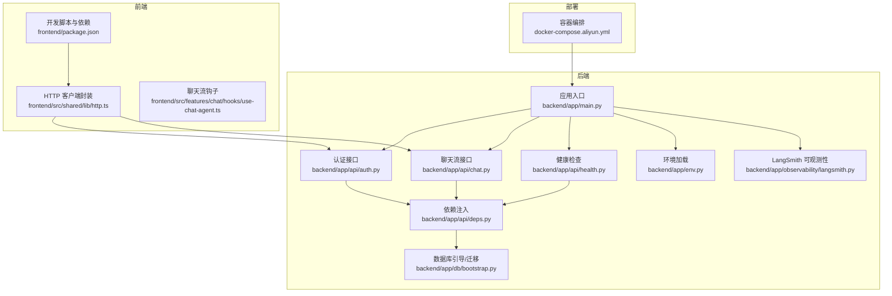
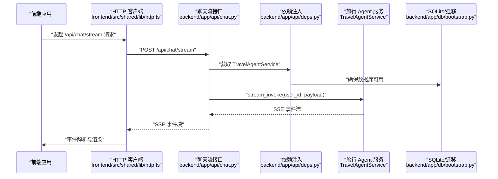
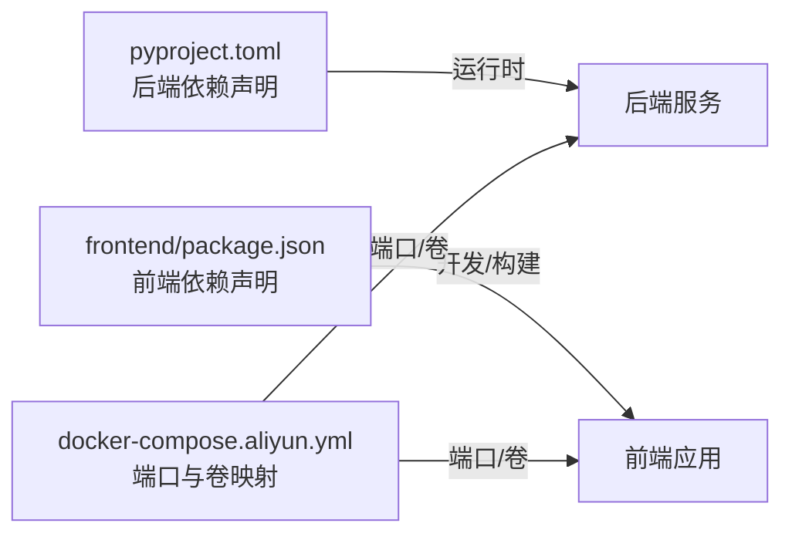

# 故障排除

<cite>
**本文引用的文件**
- [backend/app/main.py](file://backend/app/main.py)
- [backend/app/env.py](file://backend/app/env.py)
- [backend/pyproject.toml](file://backend/pyproject.toml)
- [backend/app/db/bootstrap.py](file://backend/app/db/bootstrap.py)
- [backend/app/api/health.py](file://backend/app/api/health.py)
- [backend/app/api/deps.py](file://backend/app/api/deps.py)
- [backend/app/api/chat.py](file://backend/app/api/chat.py)
- [backend/app/api/auth.py](file://backend/app/api/auth.py)
- [backend/app/observability/langsmith.py](file://backend/app/observability/langsmith.py)
- [backend/tests/test_env.py](file://backend/tests/test_env.py)
- [backend/tests/test_api.py](file://backend/tests/test_api.py)
- [frontend/package.json](file://frontend/package.json)
- [frontend/src/shared/lib/http.ts](file://frontend/src/shared/lib/http.ts)
- [frontend/src/features/chat/hooks/use-chat-agent.ts](file://frontend/src/features/chat/hooks/use-chat-agent.ts)
- [docker-compose.aliyun.yml](file://docker-compose.aliyun.yml)
</cite>

## 目录
1. [简介](#简介)
2. [项目结构](#项目结构)
3. [核心组件](#核心组件)
4. [架构总览](#架构总览)
5. [详细组件分析](#详细组件分析)
6. [依赖关系分析](#依赖关系分析)
7. [性能考量](#性能考量)
8. [故障排除指南](#故障排除指南)
9. [结论](#结论)
10. [附录](#附录)

## 简介
本指南面向开发者，聚焦于启动失败、连接超时、内存泄漏、数据库连接问题、API 调用失败、前端渲染错误等常见问题的诊断与解决。内容涵盖日志分析、错误追踪、性能监控、调试工具使用、系统监控最佳实践、常见配置错误与依赖冲突、以及紧急回滚策略。

## 项目结构
后端基于 FastAPI，采用分层设计：路由层、依赖注入层、服务层、数据库与迁移层、可观测性层；前端基于 React/Vite，通过 HTTP 与 SSE 与后端交互；容器编排通过 docker-compose 提供一键部署。

图表来源
- [backend/app/main.py:1-54](file://backend/app/main.py#L1-L54)
- [backend/app/env.py:1-18](file://backend/app/env.py#L1-L18)
- [backend/app/api/deps.py:1-60](file://backend/app/api/deps.py#L1-L60)
- [backend/app/db/bootstrap.py:1-226](file://backend/app/db/bootstrap.py#L1-L226)
- [backend/app/api/auth.py:1-36](file://backend/app/api/auth.py#L1-L36)
- [backend/app/api/chat.py:1-72](file://backend/app/api/chat.py#L1-L72)
- [backend/app/api/health.py:1-18](file://backend/app/api/health.py#L1-L18)
- [backend/app/observability/langsmith.py:1-57](file://backend/app/observability/langsmith.py#L1-L57)
- [frontend/package.json:1-52](file://frontend/package.json#L1-L52)
- [frontend/src/shared/lib/http.ts:46-74](file://frontend/src/shared/lib/http.ts#L46-L74)
- [frontend/src/features/chat/hooks/use-chat-agent.ts:359-390](file://frontend/src/features/chat/hooks/use-chat-agent.ts#L359-L390)
- [docker-compose.aliyun.yml:1-14](file://docker-compose.aliyun.yml#L1-L14)

章节来源
- [backend/app/main.py:1-54](file://backend/app/main.py#L1-L54)
- [frontend/package.json:1-52](file://frontend/package.json#L1-L52)

## 核心组件
- 应用入口与生命周期：负责加载环境、引导数据库、注册路由与 CORS 中间件，并通过 lifespan 管理 Agent 的启动与关闭。
- 依赖注入：集中提供 TravelAgentService、AuthService、ConnectorService 等单例服务，确保进程内共享运行时与连接状态。
- 数据库与迁移：自动发现并按序执行 SQL 迁移，强制约束历史数据库版本，支持重置与 WAL/SHM 清理。
- API 层：认证、聊天流式、健康检查等接口；聊天流接口对异常进行统一封装，向客户端返回通用错误提示。
- 前端 HTTP 客户端：统一处理响应状态码、JSON 解析与空响应，抛出带状态与消息的错误对象。
- 可观测性：LangSmith tracing 开关与上下文封装，便于追踪用户、线程、模型档位等元数据。

章节来源
- [backend/app/main.py:23-53](file://backend/app/main.py#L23-L53)
- [backend/app/api/deps.py:18-60](file://backend/app/api/deps.py#L18-L60)
- [backend/app/db/bootstrap.py:181-226](file://backend/app/db/bootstrap.py#L181-L226)
- [backend/app/api/chat.py:41-72](file://backend/app/api/chat.py#L41-L72)
- [frontend/src/shared/lib/http.ts:46-74](file://frontend/src/shared/lib/http.ts#L46-L74)
- [backend/app/observability/langsmith.py:19-56](file://backend/app/observability/langsmith.py#L19-L56)

## 架构总览
后端通过 FastAPI 提供 REST 与 SSE 接口，前端通过 HTTP 发起请求，聊天流通过服务器推送事件（SSE）实时返回。数据库通过 SQLite 与迁移脚本管理，依赖注入保证服务单例与共享状态。容器编排将后端服务映射到本地端口，便于联调。

图表来源
- [frontend/src/shared/lib/http.ts:67-74](file://frontend/src/shared/lib/http.ts#L67-L74)
- [backend/app/api/chat.py:41-72](file://backend/app/api/chat.py#L41-L72)
- [backend/app/api/deps.py:18-32](file://backend/app/api/deps.py#L18-L32)
- [backend/app/db/bootstrap.py:213-226](file://backend/app/db/bootstrap.py#L213-L226)

## 详细组件分析

### 组件一：应用入口与生命周期（启动失败排查）
- 关键点
  - 加载环境变量、引导 SQLite 数据库、注册路由与 CORS。
  - lifespan 在启动时调用 Agent 启动，在关闭时调用 Agent 关闭。
- 常见问题
  - 环境变量缺失导致数据库路径或密钥不可用。
  - 迁移失败或历史数据库不兼容导致启动阻塞。
  - CORS 配置不当导致跨域预检失败。
- 排查步骤
  - 检查 .env 是否存在且未被覆盖。
  - 查看数据库路径解析与权限。
  - 打开健康检查接口确认 Agent 快照状态。
  - 逐步注释路由或中间件定位具体模块。

章节来源
- [backend/app/main.py:23-53](file://backend/app/main.py#L23-L53)
- [backend/app/env.py:10-17](file://backend/app/env.py#L10-L17)
- [backend/app/db/bootstrap.py:213-226](file://backend/app/db/bootstrap.py#L213-L226)
- [backend/app/api/health.py:13-17](file://backend/app/api/health.py#L13-L17)

### 组件二：依赖注入与服务单例（连接超时/并发问题）
- 关键点
  - LRU 缓存提供全局单例服务，共享 Agent 运行时与 MCP 连接状态。
  - 依赖注入同时负责数据库引导与服务实例化。
- 常见问题
  - 服务实例未正确缓存导致重复初始化。
  - 数据库连接池耗尽或锁竞争。
- 排查步骤
  - 确认 get_*_service 的缓存键与作用域一致。
  - 检查数据库连接上下文是否正确提交/回滚/关闭。
  - 对外暴露健康检查快照，观察服务状态。

章节来源
- [backend/app/api/deps.py:18-60](file://backend/app/api/deps.py#L18-L60)
- [backend/app/db/bootstrap.py:76-86](file://backend/app/db/bootstrap.py#L76-L86)
- [backend/app/api/health.py:13-17](file://backend/app/api/health.py#L13-L17)

### 组件三：数据库与迁移（数据库连接问题）
- 关键点
  - 自动发现迁移文件、按序执行、记录已应用版本。
  - 强制保护：拒绝未版本化的旧表、拒绝旧整数型 schema。
  - 支持重置数据库（含 WAL/SHM）。
- 常见问题
  - 迁移文件命名不规范或版本重复。
  - 历史数据库未清理导致启动报错。
  - 权限不足导致无法创建/写入数据库文件。
- 排查步骤
  - 校验 migrations 目录下 SQL 文件命名与版本号。
  - 设置重置开关或手动删除数据库文件后重启。
  - 检查数据目录权限与磁盘空间。

章节来源
- [backend/app/db/bootstrap.py:48-65](file://backend/app/db/bootstrap.py#L48-L65)
- [backend/app/db/bootstrap.py:112-131](file://backend/app/db/bootstrap.py#L112-L131)
- [backend/app/db/bootstrap.py:142-165](file://backend/app/db/bootstrap.py#L142-L165)
- [backend/app/db/bootstrap.py:167-179](file://backend/app/db/bootstrap.py#L167-L179)
- [backend/app/db/bootstrap.py:213-226](file://backend/app/db/bootstrap.py#L213-L226)

### 组件四：聊天流式接口（API 调用失败/流中断）
- 关键点
  - 以 SSE 返回 LangGraph 原生事件。
  - 对 ValueError 输出具体错误，对其他异常输出通用错误消息。
  - 客户端中断通过取消异常处理。
- 常见问题
  - 服务内部异常被包装为通用错误，难以定位根因。
  - 客户端未正确处理 SSE 事件，导致 UI 不更新。
- 排查步骤
  - 打开 LangSmith tracing，查看用户、线程、模型档位元数据。
  - 前端监听 error 事件并显示友好提示，必要时回退到默认助手消息。
  - 使用健康检查接口确认 Agent 运行时快照。

章节来源
- [backend/app/api/chat.py:41-72](file://backend/app/api/chat.py#L41-L72)
- [backend/app/observability/langsmith.py:19-56](file://backend/app/observability/langsmith.py#L19-L56)
- [frontend/src/features/chat/hooks/use-chat-agent.ts:359-390](file://frontend/src/features/chat/hooks/use-chat-agent.ts#L359-L390)

### 组件五：认证接口（API 调用失败/鉴权问题）
- 关键点
  - 发送验证码、校验验证码、获取当前用户。
  - 依赖注入提供 AuthService，统一用户解析。
- 常见问题
  - CORS 预检仅允许特定来源，导致跨域失败。
  - JWT 密钥未正确配置，导致令牌无效。
- 排查步骤
  - 校验 CORS_ALLOW_ORIGINS 配置。
  - 检查 JWT_SECRET 环境变量与服务端日志。

章节来源
- [backend/app/api/auth.py:14-36](file://backend/app/api/auth.py#L14-L36)
- [backend/app/api/deps.py:52-60](file://backend/app/api/deps.py#L52-L60)
- [backend/tests/test_auth_api.py:22-42](file://backend/tests/test_auth_api.py#L22-L42)

### 组件六：前端 HTTP 客户端与聊天流处理（前端渲染错误）
- 关键点
  - 统一处理 204、JSON 解析、错误抛出。
  - 聊天流钩子监听 error 事件，进行 UI 回退与错误标记。
- 常见问题
  - 未捕获的异常导致页面崩溃。
  - SSE 事件丢失或解析失败。
- 排查步骤
  - 捕获并记录 HttpError，区分网络错误与业务错误。
  - 前端在 error 事件时替换为默认助手消息并提示用户。

章节来源
- [frontend/src/shared/lib/http.ts:46-74](file://frontend/src/shared/lib/http.ts#L46-L74)
- [frontend/src/features/chat/hooks/use-chat-agent.ts:359-390](file://frontend/src/features/chat/hooks/use-chat-agent.ts#L359-L390)

## 依赖关系分析
- 后端依赖
  - FastAPI、Uvicorn、Pydantic、LangChain/LangGraph、LangSmith、Cryptography、httpx 等。
  - 测试依赖 pytest 与 asyncio。
- 前端依赖
  - React、React Router、Radix UI、Tailwind 等生态库。
- 容器编排
  - 映射本地端口至容器内 8000，挂载数据与配置目录。

图表来源
- [backend/pyproject.toml:1-42](file://backend/pyproject.toml#L1-L42)
- [frontend/package.json:1-52](file://frontend/package.json#L1-L52)
- [docker-compose.aliyun.yml:1-14](file://docker-compose.aliyun.yml#L1-L14)

章节来源
- [backend/pyproject.toml:1-42](file://backend/pyproject.toml#L1-L42)
- [frontend/package.json:1-52](file://frontend/package.json#L1-L52)
- [docker-compose.aliyun.yml:1-14](file://docker-compose.aliyun.yml#L1-L14)

## 性能考量
- SSE 流式输出
  - 保持长连接与无缓存策略，避免代理缓冲导致延迟。
  - 客户端需正确处理中断与重连。
- 数据库
  - 迁移与 WAL/SHM 管理，避免锁竞争与 I/O 阻塞。
  - 合理设置连接参数与事务边界。
- 可观测性
  - 启用 LangSmith tracing，记录用户、线程、模型档位元数据，便于定位热点与瓶颈。
- 前端
  - 避免不必要的重渲染，合理使用事件回调与状态更新。

章节来源
- [backend/app/api/chat.py:63-71](file://backend/app/api/chat.py#L63-L71)
- [backend/app/db/bootstrap.py:167-179](file://backend/app/db/bootstrap.py#L167-L179)
- [backend/app/observability/langsmith.py:19-56](file://backend/app/observability/langsmith.py#L19-L56)

## 故障排除指南

### 启动失败
- 症状
  - 服务无法启动或启动后立即退出。
- 诊断步骤
  - 检查 .env 是否存在且未被覆盖，验证敏感值未被插值展开。
  - 确认数据库路径可写，必要时开启重置开关或删除数据库文件后重启。
  - 通过健康检查接口确认 Agent 运行时快照。
  - 临时注释路由或中间件定位具体模块。
- 解决方案
  - 修复 .env 内容与权限。
  - 清理历史数据库或设置重置开关。
  - 修正 CORS 配置，确保允许前端来源。
- 相关文件
  - [backend/app/env.py:10-17](file://backend/app/env.py#L10-L17)
  - [backend/app/db/bootstrap.py:213-226](file://backend/app/db/bootstrap.py#L213-L226)
  - [backend/app/api/health.py:13-17](file://backend/app/api/health.py#L13-L17)
  - [backend/app/main.py:37-44](file://backend/app/main.py#L37-L44)

章节来源
- [backend/tests/test_env.py:8-26](file://backend/tests/test_env.py#L8-L26)
- [backend/app/env.py:10-17](file://backend/app/env.py#L10-L17)
- [backend/app/db/bootstrap.py:213-226](file://backend/app/db/bootstrap.py#L213-L226)
- [backend/app/api/health.py:13-17](file://backend/app/api/health.py#L13-L17)
- [backend/app/main.py:37-44](file://backend/app/main.py#L37-L44)

### 连接超时
- 症状
  - 前端请求长时间无响应，SSE 事件迟迟不到。
- 诊断步骤
  - 检查后端日志与 LangSmith tracing，确认请求进入服务层。
  - 确认数据库连接正常，迁移已完成。
  - 检查网络连通性与代理配置。
- 解决方案
  - 优化数据库访问路径与权限。
  - 调整代理超时与缓冲策略。
  - 前端增加重试与降级提示。
- 相关文件
  - [backend/app/db/bootstrap.py:68-86](file://backend/app/db/bootstrap.py#L68-L86)
  - [backend/app/observability/langsmith.py:19-56](file://backend/app/observability/langsmith.py#L19-L56)

章节来源
- [backend/app/db/bootstrap.py:68-86](file://backend/app/db/bootstrap.py#L68-L86)
- [backend/app/observability/langsmith.py:19-56](file://backend/app/observability/langsmith.py#L19-L56)

### 内存泄漏
- 症状
  - 进程内存持续增长，偶发 OOM。
- 诊断步骤
  - 使用容器监控查看内存曲线，结合健康检查快照观察 Agent 状态。
  - 检查数据库连接是否正确关闭，事务是否正确提交/回滚。
  - 关注长连接与 SSE 事件堆积。
- 解决方案
  - 确保连接上下文在 finally 中关闭。
  - 控制事件队列长度与客户端消费速度。
  - 限制并发与批量大小。
- 相关文件
  - [backend/app/db/bootstrap.py:76-86](file://backend/app/db/bootstrap.py#L76-L86)
  - [backend/app/api/health.py:13-17](file://backend/app/api/health.py#L13-L17)

章节来源
- [backend/app/db/bootstrap.py:76-86](file://backend/app/db/bootstrap.py#L76-L86)
- [backend/app/api/health.py:13-17](file://backend/app/api/health.py#L13-L17)

### 数据库连接问题
- 症状
  - 启动时报错提示未版本化历史数据库或旧 schema。
- 诊断步骤
  - 检查 migrations 目录与文件命名。
  - 确认 schema_migrations 表是否存在。
  - 检查历史表是否与新 schema 兼容。
- 解决方案
  - 设置重置开关或删除数据库文件后重启。
  - 修复迁移文件命名与版本号。
- 相关文件
  - [backend/app/db/bootstrap.py:112-131](file://backend/app/db/bootstrap.py#L112-L131)
  - [backend/app/db/bootstrap.py:142-165](file://backend/app/db/bootstrap.py#L142-L165)
  - [backend/app/db/bootstrap.py:48-65](file://backend/app/db/bootstrap.py#L48-L65)

章节来源
- [backend/app/db/bootstrap.py:112-131](file://backend/app/db/bootstrap.py#L112-L131)
- [backend/app/db/bootstrap.py:142-165](file://backend/app/db/bootstrap.py#L142-L165)
- [backend/app/db/bootstrap.py:48-65](file://backend/app/db/bootstrap.py#L48-L65)

### API 调用失败
- 症状
  - 返回通用错误消息，无法定位具体原因。
- 诊断步骤
  - 打开 LangSmith tracing，查看用户、线程、模型档位元数据。
  - 前端捕获 HttpError，区分网络与业务错误。
  - 检查聊天流接口对异常的封装策略。
- 解决方案
  - 在开发环境启用详细日志与 tracing。
  - 前端在 error 事件时进行 UI 回退与提示。
- 相关文件
  - [backend/app/observability/langsmith.py:19-56](file://backend/app/observability/langsmith.py#L19-L56)
  - [frontend/src/shared/lib/http.ts:46-74](file://frontend/src/shared/lib/http.ts#L46-L74)
  - [backend/app/api/chat.py:55-61](file://backend/app/api/chat.py#L55-L61)

章节来源
- [backend/app/observability/langsmith.py:19-56](file://backend/app/observability/langsmith.py#L19-L56)
- [frontend/src/shared/lib/http.ts:46-74](file://frontend/src/shared/lib/http.ts#L46-L74)
- [backend/app/api/chat.py:55-61](file://backend/app/api/chat.py#L55-L61)

### 前端渲染错误
- 症状
  - SSE 事件未正确渲染，或错误未被用户感知。
- 诊断步骤
  - 检查前端 error 事件处理逻辑，确认回退消息与状态更新。
  - 校验 HTTP 客户端对空响应与 JSON 解析的处理。
- 解决方案
  - 在 error 事件时替换为默认助手消息并提示用户。
  - 增强错误提示与重试按钮。
- 相关文件
  - [frontend/src/features/chat/hooks/use-chat-agent.ts:359-390](file://frontend/src/features/chat/hooks/use-chat-agent.ts#L359-L390)
  - [frontend/src/shared/lib/http.ts:46-74](file://frontend/src/shared/lib/http.ts#L46-L74)

章节来源
- [frontend/src/features/chat/hooks/use-chat-agent.ts:359-390](file://frontend/src/features/chat/hooks/use-chat-agent.ts#L359-L390)
- [frontend/src/shared/lib/http.ts:46-74](file://frontend/src/shared/lib/http.ts#L46-L74)

### 日志分析、错误追踪与性能监控
- 日志分析
  - 启动阶段关注环境加载、数据库引导、路由注册与 CORS 配置。
  - 运行阶段关注数据库事务提交/回滚、SSE 事件流与异常捕获。
- 错误追踪
  - 通过 LangSmith tracing 记录用户、线程、模型档位元数据，定位慢查询与异常路径。
- 性能监控
  - 使用容器监控内存与 CPU，结合健康检查快照评估 Agent 状态。
  - 前端监控 SSE 事件到达时间与渲染耗时。

章节来源
- [backend/app/env.py:10-17](file://backend/app/env.py#L10-L17)
- [backend/app/db/bootstrap.py:76-86](file://backend/app/db/bootstrap.py#L76-L86)
- [backend/app/api/chat.py:49-61](file://backend/app/api/chat.py#L49-L61)
- [backend/app/observability/langsmith.py:19-56](file://backend/app/observability/langsmith.py#L19-L56)

### 调试工具使用与系统监控最佳实践
- 调试工具
  - 后端：Uvicorn 开发服务器、pytest 单元测试、LangSmith tracing。
  - 前端：Vite 开发服务器、浏览器开发者工具、单元测试。
- 最佳实践
  - 严格区分环境变量与进程变量，避免覆盖。
  - 通过健康检查接口定期巡检服务状态。
  - 对外暴露最小化错误细节，增强用户体验。

章节来源
- [frontend/package.json:7-13](file://frontend/package.json#L7-L13)
- [backend/pyproject.toml:27-30](file://backend/pyproject.toml#L27-L30)
- [backend/app/api/health.py:13-17](file://backend/app/api/health.py#L13-L17)

### 常见配置错误、依赖冲突与环境问题
- 配置错误
  - CORS_ALLOW_ORIGINS 未正确配置导致跨域失败。
  - JWT_SECRET 未设置或与服务端不一致。
  - CHAT_SQLITE_PATH 权限不足或磁盘空间不足。
- 依赖冲突
  - Python 版本与依赖范围不匹配。
  - 前后端端口冲突或代理配置不当。
- 环境问题
  - .env 未加载或被覆盖。
  - 容器卷映射路径不正确。

章节来源
- [backend/app/main.py:37-44](file://backend/app/main.py#L37-L44)
- [backend/app/env.py:10-17](file://backend/app/env.py#L10-L17)
- [backend/app/db/bootstrap.py:38-40](file://backend/app/db/bootstrap.py#L38-L40)
- [backend/pyproject.toml:5-24](file://backend/pyproject.toml#L5-L24)
- [docker-compose.aliyun.yml:7-13](file://docker-compose.aliyun.yml#L7-L13)

### 紧急情况处理流程与回滚策略
- 紧急处理流程
  - 立即停止新流量，保留健康检查与日志采集。
  - 通过健康检查确认服务状态，定位异常模块。
  - 临时降低并发或禁用部分功能。
- 回滚策略
  - 使用容器编排回滚镜像版本。
  - 回滚数据库迁移：删除 schema_migrations 中的最新版本记录并重置数据库。
  - 回滚配置：恢复 .env 与 docker-compose 配置。

章节来源
- [backend/app/api/health.py:13-17](file://backend/app/api/health.py#L13-L17)
- [backend/app/db/bootstrap.py:181-210](file://backend/app/db/bootstrap.py#L181-L210)
- [docker-compose.aliyun.yml:1-14](file://docker-compose.aliyun.yml#L1-14)

## 结论
通过明确的组件职责、完善的依赖注入、严格的数据库迁移保护、清晰的 API 错误封装与前端事件处理，以及可观测性的 tracing 能力，本项目具备良好的可维护性与可诊断性。遵循本文提供的故障排除流程与最佳实践，可快速定位并解决启动失败、连接超时、内存泄漏、数据库与 API 问题，保障系统稳定运行。

## 附录
- 健康检查接口：用于获取服务健康状态与 Agent 运行时快照。
- 环境加载：确保 .env 正确加载且不覆盖进程变量。
- 容器编排：映射本地端口与数据卷，便于开发与联调。

章节来源
- [backend/app/api/health.py:13-17](file://backend/app/api/health.py#L13-L17)
- [backend/app/env.py:10-17](file://backend/app/env.py#L10-L17)
- [docker-compose.aliyun.yml:9-13](file://docker-compose.aliyun.yml#L9-L13)