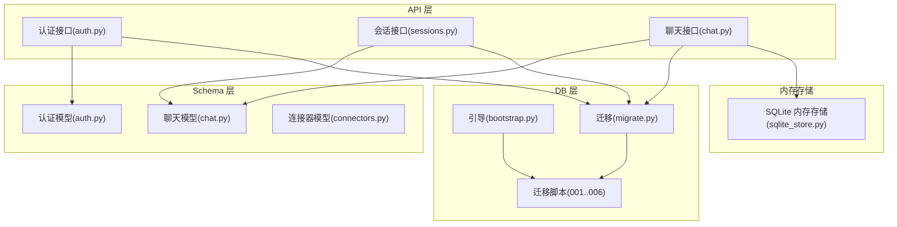
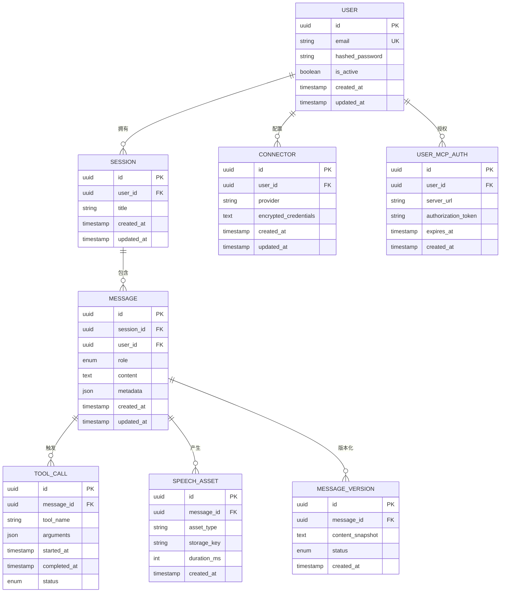
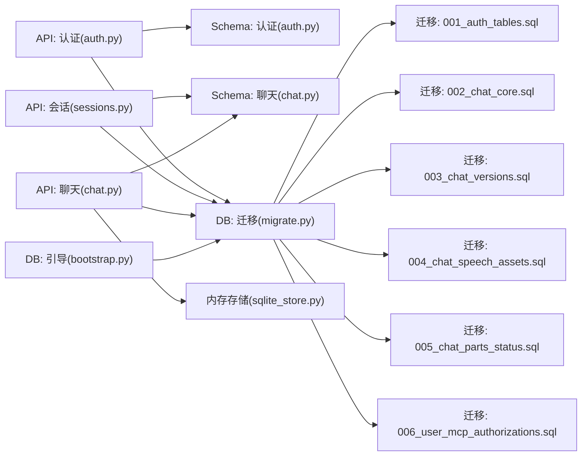

# 数据模型

<cite>
**本文引用的文件**
- [001_auth_tables.sql](file://backend/migrations/001_auth_tables.sql)
- [002_chat_core.sql](file://backend/migrations/002_chat_core.sql)
- [003_chat_versions.sql](file://backend/migrations/003_chat_versions.sql)
- [004_chat_speech_assets.sql](file://backend/migrations/004_chat_speech_assets.sql)
- [005_chat_parts_status.sql](file://backend/migrations/005_chat_parts_status.sql)
- [006_user_mcp_authorizations.sql](file://backend/migrations/006_user_mcp_authorizations.sql)
- [bootstrap.py](file://backend/app/db/bootstrap.py)
- [migrate.py](file://backend/app/db/migrate.py)
- [auth.py](file://backend/app/schemas/auth.py)
- [chat.py](file://backend/app/schemas/chat.py)
- [connectors.py](file://backend/app/schemas/connectors.py)
- [auth.py](file://backend/app/api/auth.py)
- [sessions.py](file://backend/app/api/sessions.py)
- [chat.py](file://backend/app/api/chat.py)
- [sqlite_store.py](file://backend/app/memory/sqlite_store.py)
</cite>

## 目录
1. [简介](#简介)
2. [项目结构](#项目结构)
3. [核心组件](#核心组件)
4. [架构总览](#架构总览)
5. [详细组件分析](#详细组件分析)
6. [依赖分析](#依赖分析)
7. [性能考量](#性能考量)
8. [故障排查指南](#故障排查指南)
9. [结论](#结论)
10. [附录](#附录)

## 简介
本文件系统化梳理后端数据模型与数据库架构，覆盖用户、会话、消息、工具调用等核心实体及其关系；解释外键、索引与约束；给出迁移策略、版本管理与向后兼容建议；总结数据访问模式、缓存策略与性能优化；提供数据生命周期、安全与隐私保护实践，并给出备份、恢复与迁移最佳实践。

## 项目结构
后端采用分层架构：API 层负责请求入口与业务编排；Schemas 定义数据契约；DB 层负责数据库初始化、迁移与访问；内存存储用于短期对话状态；迁移脚本集中管理数据库演进。

**图示来源**
- [auth.py](file://backend/app/api/auth.py)
- [sessions.py](file://backend/app/api/sessions.py)
- [chat.py](file://backend/app/api/chat.py)
- [auth.py](file://backend/app/schemas/auth.py)
- [chat.py](file://backend/app/schemas/chat.py)
- [connectors.py](file://backend/app/schemas/connectors.py)
- [bootstrap.py](file://backend/app/db/bootstrap.py)
- [migrate.py](file://backend/app/db/migrate.py)
- [001_auth_tables.sql](file://backend/migrations/001_auth_tables.sql)
- [002_chat_core.sql](file://backend/migrations/002_chat_core.sql)
- [003_chat_versions.sql](file://backend/migrations/003_chat_versions.sql)
- [004_chat_speech_assets.sql](file://backend/migrations/004_chat_speech_assets.sql)
- [005_chat_parts_status.sql](file://backend/migrations/005_chat_parts_status.sql)
- [006_user_mcp_authorizations.sql](file://backend/migrations/006_user_mcp_authorizations.sql)
- [sqlite_store.py](file://backend/app/memory/sqlite_store.py)

**章节来源**
- [bootstrap.py](file://backend/app/db/bootstrap.py)
- [migrate.py](file://backend/app/db/migrate.py)
- [001_auth_tables.sql](file://backend/migrations/001_auth_tables.sql)
- [002_chat_core.sql](file://backend/migrations/002_chat_core.sql)
- [003_chat_versions.sql](file://backend/migrations/003_chat_versions.sql)
- [004_chat_speech_assets.sql](file://backend/migrations/004_chat_speech_assets.sql)
- [005_chat_parts_status.sql](file://backend/migrations/005_chat_parts_status.sql)
- [006_user_mcp_authorizations.sql](file://backend/migrations/006_user_mcp_authorizations.sql)

## 核心组件
- 用户(User)：身份标识、凭证与授权主体
- 会话(Session)：一次或多轮对话的上下文容器
- 消息(Message)：单条对话内容（文本/语音/附件等）
- 工具调用(ToolCall)：消息中触发的外部工具执行记录
- 连接器(Connector)：第三方服务集成与凭据加密存储
- MCP 授权(UserMCPAuthorization)：用户对 MCP 服务器的授权记录
- 语音资产(SpeechAsset)：消息中的语音资源元数据
- 版本化消息(MessageVersion)：消息历史快照与状态

上述实体在迁移脚本中定义，通过引导与迁移模块完成初始化与升级。

**章节来源**
- [001_auth_tables.sql](file://backend/migrations/001_auth_tables.sql)
- [002_chat_core.sql](file://backend/migrations/002_chat_core.sql)
- [003_chat_versions.sql](file://backend/migrations/003_chat_versions.sql)
- [004_chat_speech_assets.sql](file://backend/migrations/004_chat_speech_assets.sql)
- [005_chat_parts_status.sql](file://backend/migrations/005_chat_parts_status.sql)
- [006_user_mcp_authorizations.sql](file://backend/migrations/006_user_mcp_authorizations.sql)

## 架构总览
数据模型围绕“用户-会话-消息-工具调用”主线展开，辅以“语音资产”“版本化消息”“MCP 授权”等扩展实体，形成完整的对话数据生命周期。

**图示来源**
- [001_auth_tables.sql](file://backend/migrations/001_auth_tables.sql)
- [002_chat_core.sql](file://backend/migrations/002_chat_core.sql)
- [003_chat_versions.sql](file://backend/migrations/003_chat_versions.sql)
- [004_chat_speech_assets.sql](file://backend/migrations/004_chat_speech_assets.sql)
- [005_chat_parts_status.sql](file://backend/migrations/005_chat_parts_status.sql)
- [006_user_mcp_authorizations.sql](file://backend/migrations/006_user_mcp_authorizations.sql)

## 详细组件分析

### 用户(User)
- 职责：身份标识、登录凭证、激活状态
- 关键字段：唯一邮箱、哈希密码、激活标志、时间戳
- 约束：邮箱唯一；软删除/激活控制
- 外键：与 Session、Message、Connector、UserMCPAuthorization 建立一对多关系

**章节来源**
- [001_auth_tables.sql](file://backend/migrations/001_auth_tables.sql)
- [auth.py](file://backend/app/schemas/auth.py)

### 会话(Session)
- 职责：承载一次或多轮对话的上下文
- 关键字段：标题、用户归属、时间戳
- 约束：用户与会话的归属关系；会话内消息有序
- 外键：用户到会话为一对多

**章节来源**
- [002_chat_core.sql](file://backend/migrations/002_chat_core.sql)
- [sessions.py](file://backend/app/api/sessions.py)

### 消息(Message)
- 职责：单条对话内容载体，支持文本、语音、附件等
- 关键字段：角色（用户/助手）、内容、元数据、时间戳
- 约束：消息属于会话与用户；可被版本化
- 外键：会话与用户；与 ToolCall、SpeechAsset、MessageVersion 关联

**章节来源**
- [002_chat_core.sql](file://backend/migrations/002_chat_core.sql)
- [chat.py](file://backend/app/schemas/chat.py)
- [chat.py](file://backend/app/api/chat.py)

### 工具调用(ToolCall)
- 职责：记录消息中触发的工具执行详情
- 关键字段：工具名、参数、开始/结束时间、状态
- 约束：一对一关联到消息；状态机驱动
- 外键：消息到工具调用为一对一

**章节来源**
- [002_chat_core.sql](file://backend/migrations/002_chat_core.sql)
- [chat.py](file://backend/app/schemas/chat.py)

### 语音资产(SpeechAsset)
- 职责：记录消息中的语音资源元数据
- 关键字段：资源类型、存储键、时长等
- 约束：一对一关联到消息；与消息生命周期一致
- 外键：消息到语音资产为一对一

**章节来源**
- [004_chat_speech_assets.sql](file://backend/migrations/004_chat_speech_assets.sql)

### 版本化消息(MessageVersion)
- 职责：保存消息的历史快照与状态
- 关键字段：消息快照、状态、时间戳
- 约束：一对一关联到消息；按时间排序
- 外键：消息到版本为一对多

**章节来源**
- [003_chat_versions.sql](file://backend/migrations/003_chat_versions.sql)

### 连接器(Connector)
- 职责：第三方服务集成与凭据加密存储
- 关键字段：提供商、加密凭据、时间戳
- 约束：用户与连接器的归属关系；凭据加密
- 外键：用户到连接器为一对多

**章节来源**
- [connectors.py](file://backend/app/schemas/connectors.py)
- [001_auth_tables.sql](file://backend/migrations/001_auth_tables.sql)

### MCP 授权(UserMCPAuthorization)
- 职责：用户对 MCP 服务器的授权令牌与过期时间
- 关键字段：服务器地址、授权令牌、过期时间
- 约束：用户与授权的归属关系；令牌过期控制
- 外键：用户到授权为一对多

**章节来源**
- [006_user_mcp_authorizations.sql](file://backend/migrations/006_user_mcp_authorizations.sql)

### 数据访问模式与缓存策略
- 访问模式
  - 读多写少场景：消息查询按会话分页、按时间倒序
  - 写入模式：消息插入与工具调用并发写入，保证事务一致性
  - 版本化：消息更新时生成新版本，保留历史快照
- 缓存策略
  - 热点会话：最近 N 条消息与工具调用结果缓存
  - 低频配置：连接器凭据与 MCP 授权缓存短期有效
  - 内存存储：短期对话状态使用 SQLite 内存存储，避免持久化开销

**章节来源**
- [chat.py](file://backend/app/api/chat.py)
- [sqlite_store.py](file://backend/app/memory/sqlite_store.py)

### 性能优化
- 索引设计
  - 会话：user_id + created_at
  - 消息：session_id + created_at；role；metadata 查询字段
  - 工具调用：message_id + status
  - 语音资产：message_id + created_at
  - 版本化消息：message_id + created_at
  - 用户：email 唯一索引
- 批量操作：消息导入与版本化批量写入
- 分页与投影：仅返回必要字段，避免大对象传输
- 连接池：数据库连接池大小与超时配置

**章节来源**
- [002_chat_core.sql](file://backend/migrations/002_chat_core.sql)
- [003_chat_versions.sql](file://backend/migrations/003_chat_versions.sql)
- [004_chat_speech_assets.sql](file://backend/migrations/004_chat_speech_assets.sql)
- [005_chat_parts_status.sql](file://backend/migrations/005_chat_parts_status.sql)

### 数据生命周期管理
- 创建：用户注册、会话创建、消息写入、工具调用与语音资产登记
- 更新：消息编辑生成版本；工具调用状态流转
- 归档：超过保留期的会话与消息归档至冷存储
- 清理：过期 MCP 授权与失效语音资产清理
- 删除：用户注销或数据保留期满后的合规删除

**章节来源**
- [001_auth_tables.sql](file://backend/migrations/001_auth_tables.sql)
- [002_chat_core.sql](file://backend/migrations/002_chat_core.sql)
- [003_chat_versions.sql](file://backend/migrations/003_chat_versions.sql)
- [004_chat_speech_assets.sql](file://backend/migrations/004_chat_speech_assets.sql)
- [006_user_mcp_authorizations.sql](file://backend/migrations/006_user_mcp_authorizations.sql)

### 安全与隐私
- 凭据加密：连接器凭据采用对称加密存储
- 授权控制：MCP 授权令牌过期管理与最小权限原则
- 隐私保护：消息与语音资产的访问审计与脱敏
- 合规：遵循数据最小化与可追溯性要求

**章节来源**
- [001_auth_tables.sql](file://backend/migrations/001_auth_tables.sql)
- [006_user_mcp_authorizations.sql](file://backend/migrations/006_user_mcp_authorizations.sql)

### 备份、恢复与迁移最佳实践
- 备份
  - 全量备份：定期导出数据库与对象存储中的语音资产清单
  - 增量备份：基于 WAL 的增量日志备份
- 恢复
  - 快速恢复：从最近全量+增量恢复，验证完整性
  - 回滚：迁移失败时回退到上一版本
- 迁移
  - 版本化：每个迁移脚本独立、幂等、可回滚
  - 向后兼容：新增列默认值与非空约束需谨慎处理
  - 测试：迁移前后一致性校验与性能回归测试

**章节来源**
- [bootstrap.py](file://backend/app/db/bootstrap.py)
- [migrate.py](file://backend/app/db/migrate.py)
- [001_auth_tables.sql](file://backend/migrations/001_auth_tables.sql)
- [002_chat_core.sql](file://backend/migrations/002_chat_core.sql)
- [003_chat_versions.sql](file://backend/migrations/003_chat_versions.sql)
- [004_chat_speech_assets.sql](file://backend/migrations/004_chat_speech_assets.sql)
- [005_chat_parts_status.sql](file://backend/migrations/005_chat_parts_status.sql)
- [006_user_mcp_authorizations.sql](file://backend/migrations/006_user_mcp_authorizations.sql)

## 依赖分析
- 组件耦合
  - API 层依赖 Schema 与 DB 层
  - DB 层依赖迁移脚本与引导模块
  - 内存存储作为短期状态缓存，降低持久化压力
- 外部依赖
  - 数据库：PostgreSQL/SQLite（根据部署环境）
  - 对象存储：语音资产存储与访问
- 循环依赖
  - 通过分层与接口隔离避免循环依赖

**图示来源**
- [auth.py](file://backend/app/api/auth.py)
- [sessions.py](file://backend/app/api/sessions.py)
- [chat.py](file://backend/app/api/chat.py)
- [auth.py](file://backend/app/schemas/auth.py)
- [chat.py](file://backend/app/schemas/chat.py)
- [bootstrap.py](file://backend/app/db/bootstrap.py)
- [migrate.py](file://backend/app/db/migrate.py)
- [001_auth_tables.sql](file://backend/migrations/001_auth_tables.sql)
- [002_chat_core.sql](file://backend/migrations/002_chat_core.sql)
- [003_chat_versions.sql](file://backend/migrations/003_chat_versions.sql)
- [004_chat_speech_assets.sql](file://backend/migrations/004_chat_speech_assets.sql)
- [005_chat_parts_status.sql](file://backend/migrations/005_chat_parts_status.sql)
- [006_user_mcp_authorizations.sql](file://backend/migrations/006_user_mcp_authorizations.sql)
- [sqlite_store.py](file://backend/app/memory/sqlite_store.py)

**章节来源**
- [auth.py](file://backend/app/api/auth.py)
- [sessions.py](file://backend/app/api/sessions.py)
- [chat.py](file://backend/app/api/chat.py)
- [auth.py](file://backend/app/schemas/auth.py)
- [chat.py](file://backend/app/schemas/chat.py)
- [bootstrap.py](file://backend/app/db/bootstrap.py)
- [migrate.py](file://backend/app/db/migrate.py)
- [sqlite_store.py](file://backend/app/memory/sqlite_store.py)

## 性能考量
- 查询优化
  - 使用复合索引覆盖高频过滤条件（如 user_id + created_at）
  - 对消息内容与元数据建立合适索引，避免全表扫描
- 写入优化
  - 批量插入与事务合并，减少往返开销
  - 工具调用与语音资产异步写入，降低主流程阻塞
- 缓存与内存
  - 短期对话状态使用内存存储，避免磁盘 IO
  - 热点数据缓存与失效策略，结合 LRU 或 TTL
- 连接与并发
  - 合理设置连接池大小与超时，避免资源争用
  - 读写分离与只读副本提升查询吞吐

[本节为通用指导，无需列出具体文件来源]

## 故障排查指南
- 迁移失败
  - 检查迁移脚本幂等性与依赖顺序
  - 回滚至上一版本并修复问题
- 查询慢
  - 分析执行计划，确认索引是否命中
  - 调整查询条件与分页策略
- 写入异常
  - 检查事务边界与冲突重试
  - 核对约束与外键关系
- 缓存不一致
  - 校验缓存键与失效策略
  - 对热点数据增加一致性校验

**章节来源**
- [migrate.py](file://backend/app/db/migrate.py)
- [bootstrap.py](file://backend/app/db/bootstrap.py)

## 结论
该数据模型以“用户-会话-消息-工具调用”为核心，配合“语音资产”“版本化消息”“MCP 授权”等扩展，形成完整的对话数据生命周期。通过合理的索引、缓存与迁移策略，兼顾性能与可维护性；安全与隐私机制确保合规运营；备份与恢复方案保障业务连续性。

## 附录
- 示例数据
  - 用户：唯一邮箱、激活状态、注册时间
  - 会话：标题、所属用户、创建时间
  - 消息：角色、内容、元数据、所属会话与用户
  - 工具调用：工具名、参数、状态、时间戳
  - 语音资产：类型、存储键、时长、创建时间
  - 版本化消息：快照、状态、时间戳
  - 连接器：提供商、加密凭据、时间戳
  - MCP 授权：服务器地址、令牌、过期时间
- 迁移清单
  - 001_auth_tables.sql：用户与认证基础表
  - 002_chat_core.sql：会话、消息、工具调用核心表
  - 003_chat_versions.sql：消息版本化
  - 004_chat_speech_assets.sql：语音资产
  - 005_chat_parts_status.sql：消息部件状态
  - 006_user_mcp_authorizations.sql：MCP 授权

**章节来源**
- [001_auth_tables.sql](file://backend/migrations/001_auth_tables.sql)
- [002_chat_core.sql](file://backend/migrations/002_chat_core.sql)
- [003_chat_versions.sql](file://backend/migrations/003_chat_versions.sql)
- [004_chat_speech_assets.sql](file://backend/migrations/004_chat_speech_assets.sql)
- [005_chat_parts_status.sql](file://backend/migrations/005_chat_parts_status.sql)
- [006_user_mcp_authorizations.sql](file://backend/migrations/006_user_mcp_authorizations.sql)