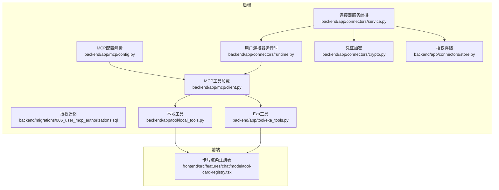
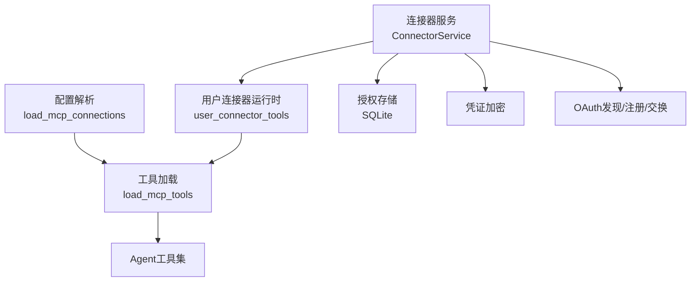
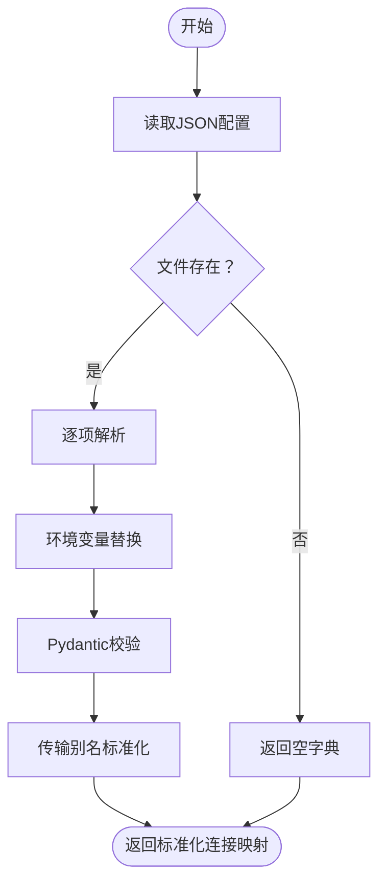
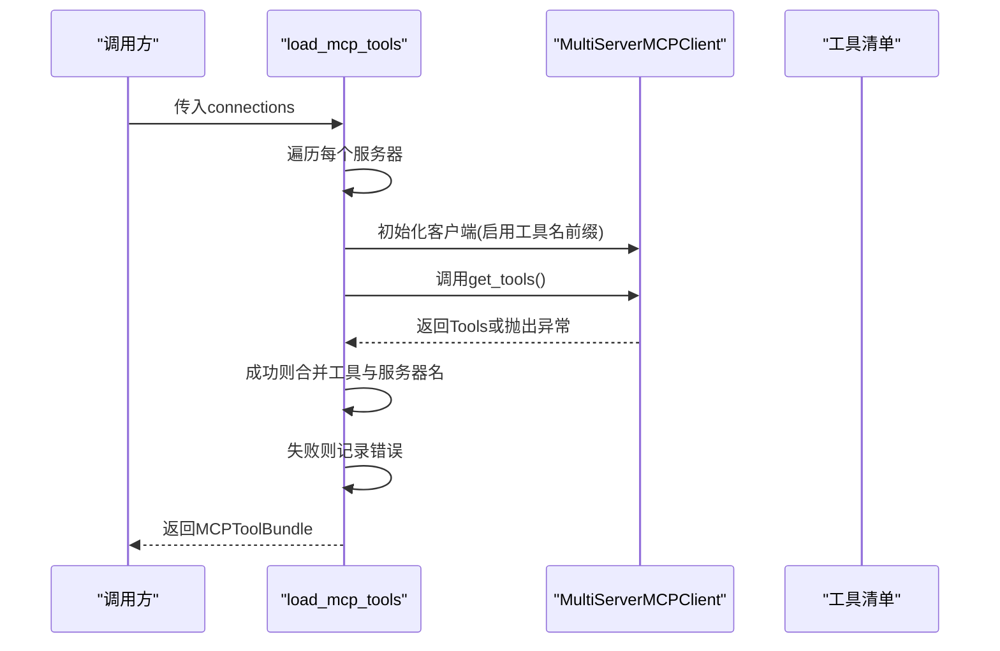
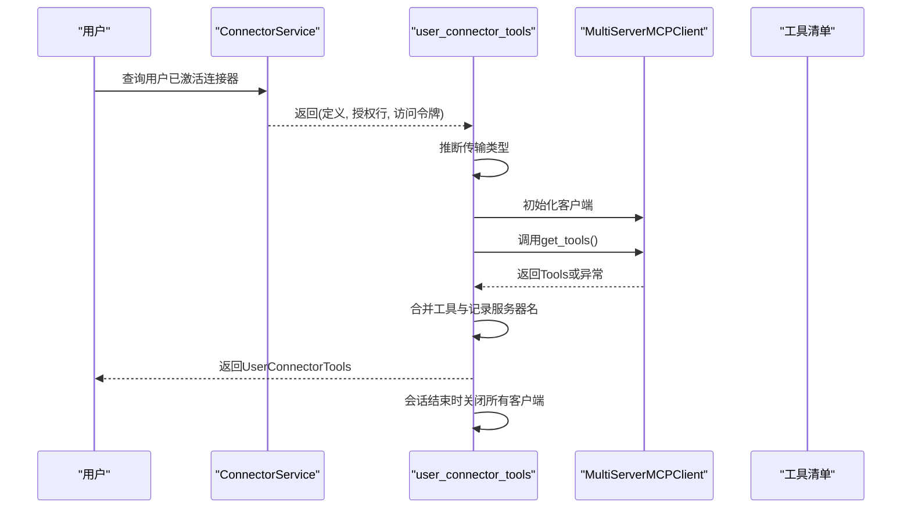
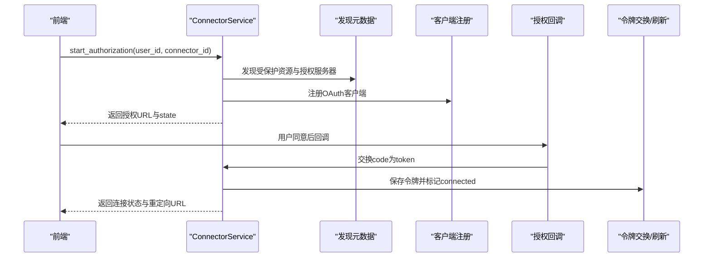
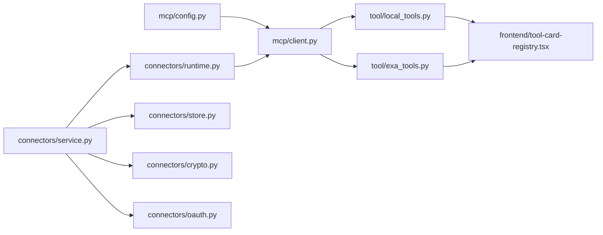

# MCP工具集成

<cite>
**本文引用的文件**
- [backend/app/mcp/client.py](file://backend/app/mcp/client.py)
- [backend/app/mcp/config.py](file://backend/app/mcp/config.py)
- [backend/config/mcp.servers.example.json](file://backend/config/mcp.servers.example.json)
- [backend/tests/test_mcp_client.py](file://backend/tests/test_mcp_client.py)
- [backend/tests/test_mcp_config.py](file://backend/tests/test_mcp_config.py)
- [backend/app/connectors/runtime.py](file://backend/app/connectors/runtime.py)
- [backend/app/connectors/service.py](file://backend/app/connectors/service.py)
- [backend/app/connectors/crypto.py](file://backend/app/connectors/crypto.py)
- [backend/app/connectors/oauth.py](file://backend/app/connectors/oauth.py)
- [backend/app/connectors/store.py](file://backend/app/connectors/store.py)
- [backend/migrations/006_user_mcp_authorizations.sql](file://backend/migrations/006_user_mcp_authorizations.sql)
- [docs/oauth流程调研.md](file://docs/oauth流程调研.md)
- [backend/app/tool/local_tools.py](file://backend/app/tool/local_tools.py)
- [backend/app/tool/exa_tools.py](file://backend/app/tool/exa_tools.py)
- [frontend/src/features/chat/model/tool-card-registry.tsx](file://frontend/src/features/chat/model/tool-card-registry.tsx)
</cite>

## 目录
1. [简介](#简介)
2. [项目结构](#项目结构)
3. [核心组件](#核心组件)
4. [架构总览](#架构总览)
5. [详细组件分析](#详细组件分析)
6. [依赖分析](#依赖分析)
7. [性能考虑](#性能考虑)
8. [故障排除指南](#故障排除指南)
9. [结论](#结论)
10. [附录](#附录)

## 简介
本文件系统性阐述本仓库中的MCP（Model Context Protocol）工具集成方案，覆盖连接器服务的实现原理、运行时工具管理与工具注册流程、MCP协议工作原理、工具发现与动态加载策略、工具调用编排与并发控制、资源管理、开发指南（接口规范、消息格式与通信协议）、权限控制与安全验证、访问限制、配置示例、调试方法与故障排除。

## 项目结构
围绕MCP工具集成的关键目录与文件如下：
- 后端MCP客户端与配置
  - [backend/app/mcp/client.py](file://backend/app/mcp/client.py)
  - [backend/app/mcp/config.py](file://backend/app/mcp/config.py)
  - [backend/config/mcp.servers.example.json](file://backend/config/mcp.servers.example.json)
- 用户级连接器与运行时工具拼装
  - [backend/app/connectors/runtime.py](file://backend/app/connectors/runtime.py)
  - [backend/app/connectors/service.py](file://backend/app/connectors/service.py)
  - [backend/app/connectors/crypto.py](file://backend/app/connectors/crypto.py)
  - [backend/app/connectors/oauth.py](file://backend/app/connectors/oauth.py)
  - [backend/app/connectors/store.py](file://backend/app/connectors/store.py)
  - [backend/migrations/006_user_mcp_authorizations.sql](file://backend/migrations/006_user_mcp_authorizations.sql)
- 本地工具与卡片渲染
  - [backend/app/tool/local_tools.py](file://backend/app/tool/local_tools.py)
  - [backend/app/tool/exa_tools.py](file://backend/app/tool/exa_tools.py)
  - [frontend/src/features/chat/model/tool-card-registry.tsx](file://frontend/src/features/chat/model/tool-card-registry.tsx)
- 协议与OAuth流程参考
  - [docs/oauth流程调研.md](file://docs/oauth流程调研.md)

图表来源
- [backend/app/mcp/config.py:63-91](file://backend/app/mcp/config.py#L63-L91)
- [backend/app/mcp/client.py:32-69](file://backend/app/mcp/client.py#L32-L69)
- [backend/app/connectors/runtime.py:50-88](file://backend/app/connectors/runtime.py#L50-L88)
- [backend/app/connectors/service.py:74-272](file://backend/app/connectors/service.py#L74-L272)
- [backend/app/connectors/crypto.py:18-55](file://backend/app/connectors/crypto.py#L18-L55)
- [backend/app/connectors/store.py:122-251](file://backend/app/connectors/store.py#L122-L251)
- [backend/migrations/006_user_mcp_authorizations.sql:1-44](file://backend/migrations/006_user_mcp_authorizations.sql#L1-L44)
- [backend/app/tool/local_tools.py:49-56](file://backend/app/tool/local_tools.py#L49-L56)
- [backend/app/tool/exa_tools.py:190-216](file://backend/app/tool/exa_tools.py#L190-L216)
- [frontend/src/features/chat/model/tool-card-registry.tsx:60-99](file://frontend/src/features/chat/model/tool-card-registry.tsx#L60-L99)

章节来源
- [backend/app/mcp/client.py:1-69](file://backend/app/mcp/client.py#L1-L69)
- [backend/app/mcp/config.py:1-91](file://backend/app/mcp/config.py#L1-L91)
- [backend/config/mcp.servers.example.json:1-18](file://backend/config/mcp.servers.example.json#L1-L18)
- [backend/app/connectors/runtime.py:1-88](file://backend/app/connectors/runtime.py#L1-L88)
- [backend/app/connectors/service.py:1-407](file://backend/app/connectors/service.py#L1-L407)
- [backend/app/connectors/crypto.py:1-55](file://backend/app/connectors/crypto.py#L1-L55)
- [backend/app/connectors/oauth.py:91-125](file://backend/app/connectors/oauth.py#L91-L125)
- [backend/app/connectors/store.py:122-251](file://backend/app/connectors/store.py#L122-L251)
- [backend/migrations/006_user_mcp_authorizations.sql:1-44](file://backend/migrations/006_user_mcp_authorizations.sql#L1-L44)
- [docs/oauth流程调研.md:1-53](file://docs/oauth流程调研.md#L1-L53)
- [backend/app/tool/local_tools.py:1-56](file://backend/app/tool/local_tools.py#L1-L56)
- [backend/app/tool/exa_tools.py:1-216](file://backend/app/tool/exa_tools.py#L1-L216)
- [frontend/src/features/chat/model/tool-card-registry.tsx:1-99](file://frontend/src/features/chat/model/tool-card-registry.tsx#L1-L99)

## 核心组件
- MCP配置解析与校验
  - 支持HTTP/SSE/streamable_http与stdio两种传输方式，提供环境变量占位符替换与字段标准化。
- MCP工具加载
  - 基于连接配置批量初始化MCP客户端，动态拉取工具清单，聚合成功连接的服务器与错误信息。
- 用户级连接器运行时
  - 按用户拼装MCP工具集合，自动推断传输类型，封装生命周期管理与连接关闭。
- 连接器服务编排
  - 统一管理OAuth授权发现、客户端注册、令牌刷新与持久化，保障工具调用所需的访问令牌有效。
- 本地工具与外部工具
  - 提供本地工具（如时区时间查询）与第三方API工具（如Exa搜索/抓取），统一以LangChain工具接口暴露。
- 前端卡片渲染
  - 将后端返回的结构化卡片数据按类型分组并渲染为UI组件。

章节来源
- [backend/app/mcp/config.py:63-91](file://backend/app/mcp/config.py#L63-L91)
- [backend/app/mcp/client.py:32-69](file://backend/app/mcp/client.py#L32-L69)
- [backend/app/connectors/runtime.py:18-88](file://backend/app/connectors/runtime.py#L18-L88)
- [backend/app/connectors/service.py:74-272](file://backend/app/connectors/service.py#L74-L272)
- [backend/app/tool/local_tools.py:16-56](file://backend/app/tool/local_tools.py#L16-L56)
- [backend/app/tool/exa_tools.py:108-216](file://backend/app/tool/exa_tools.py#L108-L216)
- [frontend/src/features/chat/model/tool-card-registry.tsx:60-99](file://frontend/src/features/chat/model/tool-card-registry.tsx#L60-L99)

## 架构总览
整体架构分为三层：
- 配置层：解析与校验MCP连接配置，支持环境变量注入与传输别名标准化。
- 运行时层：按用户维度拼装MCP工具集合，负责连接生命周期与错误隔离。
- 服务层：完成OAuth授权发现、客户端注册、令牌刷新与持久化，保障工具调用的安全与可用。

图表来源
- [backend/app/mcp/config.py:63-91](file://backend/app/mcp/config.py#L63-L91)
- [backend/app/mcp/client.py:32-69](file://backend/app/mcp/client.py#L32-L69)
- [backend/app/connectors/runtime.py:50-88](file://backend/app/connectors/runtime.py#L50-L88)
- [backend/app/connectors/service.py:108-272](file://backend/app/connectors/service.py#L108-L272)
- [backend/app/connectors/crypto.py:35-55](file://backend/app/connectors/crypto.py#L35-L55)
- [backend/app/connectors/store.py:193-251](file://backend/app/connectors/store.py#L193-L251)

## 详细组件分析

### MCP配置解析与校验
- 功能要点
  - 支持两类连接：HTTP/SSE/streamable_http与stdio。
  - 环境变量占位符${ENV_NAME}在解析前进行一次性替换，缺失即报错，确保部署期可见性。
  - 传输别名兼容：transport=http自动规范化为streamable_http。
  - 使用Pydantic校验，保证字段类型与结构正确。
- 错误处理
  - 配置非对象、键值类型不合法时抛出异常；环境变量缺失时立即失败，避免静默兜底。
- 示例配置
  - HTTP与stdio示例见[mcp.servers.example.json:1-18](file://backend/config/mcp.servers.example.json#L1-L18)。

图表来源
- [backend/app/mcp/config.py:63-91](file://backend/app/mcp/config.py#L63-L91)

章节来源
- [backend/app/mcp/config.py:1-91](file://backend/app/mcp/config.py#L1-L91)
- [backend/config/mcp.servers.example.json:1-18](file://backend/config/mcp.servers.example.json#L1-L18)
- [backend/tests/test_mcp_config.py:10-50](file://backend/tests/test_mcp_config.py#L10-L50)

### MCP工具加载与动态装配
- 功能要点
  - 为每个服务器建立独立的MCP客户端实例，启用工具名前缀，避免命名冲突。
  - 并发地从多个服务器拉取工具清单，聚合成功与失败结果。
  - 记录连接成功的服务器名与错误详情，便于可观测性与重试策略。
- 错误隔离
  - 单个服务器失败不影响其他服务器的工具加载，保证系统韧性。
- 生命周期
  - 通过返回的客户端集合，可在上层统一管理关闭与清理。

图表来源
- [backend/app/mcp/client.py:32-69](file://backend/app/mcp/client.py#L32-L69)

章节来源
- [backend/app/mcp/client.py:1-69](file://backend/app/mcp/client.py#L1-L69)
- [backend/tests/test_mcp_client.py:10-35](file://backend/tests/test_mcp_client.py#L10-L35)

### 用户级连接器运行时工具拼装
- 功能要点
  - 基于用户已激活的连接器，动态推断传输类型（SSE或streamable_http），构造连接负载。
  - 为每个连接器创建独立客户端，拉取工具并聚合到单次会话的工具集中。
  - 使用异步上下文管理器确保会话结束时关闭所有客户端连接。
- 错误处理
  - 单个连接器失败仅影响该连接器的工具加载，其他连接器不受影响。
- 生命周期
  - 在finally块中统一关闭客户端，避免资源泄漏。

图表来源
- [backend/app/connectors/runtime.py:50-88](file://backend/app/connectors/runtime.py#L50-L88)
- [backend/app/connectors/service.py:241-272](file://backend/app/connectors/service.py#L241-L272)

章节来源
- [backend/app/connectors/runtime.py:1-88](file://backend/app/connectors/runtime.py#L1-L88)
- [backend/app/connectors/service.py:241-272](file://backend/app/connectors/service.py#L241-L272)

### 连接器服务编排与OAuth授权
- 功能要点
  - 发现授权服务器：通过RFC 9728受保护资源元数据发现授权服务器，再通过RFC 8414发现端点。
  - 客户端注册：按RFC 7591在授权服务器注册OAuth客户端，保存client_id与加密的client_secret。
  - 授权与令牌交换：生成state/PKCE，引导用户浏览器授权，回调后用code换token。
  - 令牌刷新：在过期前30秒尝试刷新，失败则标记为expired并排除。
  - 存储与状态：使用SQLite持久化授权记录、令牌与状态，支持失败重试与撤销。
- 安全与合规
  - 严格要求环境变量配置，禁止静默回退至localhost。
  - 访问令牌与密钥采用对称加密存储，密钥可独立轮换。
  - 规范化MCP server的resource URI，遵循RFC 8707与MCP规范。

图表来源
- [backend/app/connectors/service.py:108-230](file://backend/app/connectors/service.py#L108-L230)
- [docs/oauth流程调研.md:22-53](file://docs/oauth流程调研.md#L22-L53)

章节来源
- [backend/app/connectors/service.py:1-407](file://backend/app/connectors/service.py#L1-L407)
- [backend/app/connectors/crypto.py:1-55](file://backend/app/connectors/crypto.py#L1-L55)
- [backend/app/connectors/oauth.py:91-125](file://backend/app/connectors/oauth.py#L91-L125)
- [backend/app/connectors/store.py:122-251](file://backend/app/connectors/store.py#L122-L251)
- [backend/migrations/006_user_mcp_authorizations.sql:1-44](file://backend/migrations/006_user_mcp_authorizations.sql#L1-L44)
- [docs/oauth流程调研.md:1-53](file://docs/oauth流程调研.md#L1-L53)

### 本地工具与外部工具
- 本地工具
  - 提供时区时间查询等本地能力，统一以LangChain工具装饰器注册。
- 外部工具
  - Exa搜索与内容抓取工具，封装HTTP请求、错误提取与ToolMessage返回，支持工具调用ID注入。
- 与MCP工具的协作
  - 本地工具与MCP工具共同注册到Agent，形成统一的可调用函数集。

章节来源
- [backend/app/tool/local_tools.py:16-56](file://backend/app/tool/local_tools.py#L16-L56)
- [backend/app/tool/exa_tools.py:108-216](file://backend/app/tool/exa_tools.py#L108-L216)

### 前端卡片渲染与工具输出展示
- 功能要点
  - 后端工具返回结构化卡片数据，前端按card_type映射到对应渲染器。
  - 提供按类型分组的工具卡片渲染器注册表，支持扩展新卡片类型。
- 设计原则
  - 卡片仅在工具chip下方以列表形式展示，避免与自由文本混杂导致的解析不稳定。

章节来源
- [frontend/src/features/chat/model/tool-card-registry.tsx:1-99](file://frontend/src/features/chat/model/tool-card-registry.tsx#L1-L99)

## 依赖分析
- 组件耦合
  - MCP配置解析与工具加载之间为纯数据依赖，低耦合高内聚。
  - 用户连接器运行时依赖连接器服务与MCP客户端，形成清晰的调用链。
  - 连接器服务内部依赖OAuth发现、客户端注册、令牌交换与存储模块，职责明确。
- 外部依赖
  - 使用langchain_mcp_adapters的MultiServerMCPClient进行MCP通信。
  - 使用httpx进行HTTP与SSE请求，使用cryptography进行对称加密。
- 循环依赖
  - 未发现循环导入或循环调用，模块边界清晰。

图表来源
- [backend/app/mcp/config.py:63-91](file://backend/app/mcp/config.py#L63-L91)
- [backend/app/mcp/client.py:32-69](file://backend/app/mcp/client.py#L32-L69)
- [backend/app/connectors/runtime.py:50-88](file://backend/app/connectors/runtime.py#L50-L88)
- [backend/app/connectors/service.py:74-272](file://backend/app/connectors/service.py#L74-L272)
- [backend/app/connectors/crypto.py:35-55](file://backend/app/connectors/crypto.py#L35-L55)
- [backend/app/connectors/oauth.py:91-125](file://backend/app/connectors/oauth.py#L91-L125)
- [backend/app/connectors/store.py:193-251](file://backend/app/connectors/store.py#L193-L251)
- [backend/app/tool/local_tools.py:49-56](file://backend/app/tool/local_tools.py#L49-L56)
- [backend/app/tool/exa_tools.py:190-216](file://backend/app/tool/exa_tools.py#L190-L216)
- [frontend/src/features/chat/model/tool-card-registry.tsx:60-99](file://frontend/src/features/chat/model/tool-card-registry.tsx#L60-L99)

章节来源
- [backend/app/mcp/config.py:1-91](file://backend/app/mcp/config.py#L1-L91)
- [backend/app/mcp/client.py:1-69](file://backend/app/mcp/client.py#L1-L69)
- [backend/app/connectors/runtime.py:1-88](file://backend/app/connectors/runtime.py#L1-L88)
- [backend/app/connectors/service.py:1-407](file://backend/app/connectors/service.py#L1-L407)
- [backend/app/connectors/crypto.py:1-55](file://backend/app/connectors/crypto.py#L1-L55)
- [backend/app/connectors/oauth.py:91-125](file://backend/app/connectors/oauth.py#L91-L125)
- [backend/app/connectors/store.py:122-251](file://backend/app/connectors/store.py#L122-L251)
- [backend/app/tool/local_tools.py:1-56](file://backend/app/tool/local_tools.py#L1-L56)
- [backend/app/tool/exa_tools.py:1-216](file://backend/app/tool/exa_tools.py#L1-L216)
- [frontend/src/features/chat/model/tool-card-registry.tsx:1-99](file://frontend/src/features/chat/model/tool-card-registry.tsx#L1-L99)

## 性能考虑
- 并发加载
  - 工具加载阶段对多服务器并行调用，缩短总等待时间；单服务器失败不影响其他服务器。
- 令牌刷新策略
  - 在过期前30秒触发刷新，减少因令牌过期导致的调用失败。
- 资源管理
  - 异步上下文管理器确保客户端连接及时关闭，避免连接池耗尽。
- I/O优化
  - 使用httpx异步客户端，减少阻塞；对敏感数据采用对称加密，避免重复计算。

## 故障排除指南
- 配置相关
  - 缺失环境变量：检查配置文件中的${ENV_NAME}是否在运行环境中设置。
  - 传输别名：transport=http将被规范化为streamable_http，确认目标MCP服务器支持该协议。
  - 参考测试用例：[test_mcp_config.py:10-50](file://backend/tests/test_mcp_config.py#L10-L50)
- 工具加载相关
  - 单个服务器失败：系统会记录错误并继续加载其他服务器，检查日志定位具体失败原因。
  - 参考测试用例：[test_mcp_client.py:10-35](file://backend/tests/test_mcp_client.py#L10-L35)
- OAuth授权相关
  - 授权失败或过期：检查授权服务器发现、客户端注册、回调参数与令牌刷新流程。
  - 存储状态：查看授权状态与最后错误信息，必要时撤销后重试。
  - 参考实现：[ConnectorService:108-230](file://backend/app/connectors/service.py#L108-L230)，[授权迁移:1-44](file://backend/migrations/006_user_mcp_authorizations.sql#L1-L44)
- 通信协议
  - 传输类型推断：根据URL路径后缀自动选择SSE或streamable_http，确保MCP服务器端正确配置。
  - 参考实现：[_infer_transport:41-48](file://backend/app/connectors/runtime.py#L41-L48)

章节来源
- [backend/tests/test_mcp_config.py:10-50](file://backend/tests/test_mcp_config.py#L10-L50)
- [backend/tests/test_mcp_client.py:10-35](file://backend/tests/test_mcp_client.py#L10-L35)
- [backend/app/connectors/service.py:108-230](file://backend/app/connectors/service.py#L108-L230)
- [backend/migrations/006_user_mcp_authorizations.sql:1-44](file://backend/migrations/006_user_mcp_authorizations.sql#L1-L44)
- [backend/app/connectors/runtime.py:41-48](file://backend/app/connectors/runtime.py#L41-L48)

## 结论
本项目通过清晰的模块划分与严格的协议实现，完成了MCP工具的动态加载、用户级连接器授权与运行时拼装、以及本地与外部工具的统一注册。配合完善的OAuth流程、加密存储与错误隔离策略，形成了高可用、可扩展、可维护的MCP工具集成方案。

## 附录

### MCP工具开发指南
- 工具接口规范
  - 使用LangChain工具装饰器注册，支持同步与异步实现。
  - 返回ToolMessage时，携带工具调用ID、状态与结构化artifact，便于前端渲染与追踪。
- 消息格式与通信协议
  - 传输类型：HTTP/SSE/streamable_http或stdio。
  - 令牌传递：通过Authorization头携带Bearer token。
  - 参考：[mcp.servers.example.json:1-18](file://backend/config/mcp.servers.example.json#L1-L18)
- 并发控制与资源管理
  - 工具加载阶段对多服务器并行调用；会话结束后统一关闭客户端连接。
  - 参考：[load_mcp_tools:32-69](file://backend/app/mcp/client.py#L32-L69)，[user_connector_tools:50-88](file://backend/app/connectors/runtime.py#L50-L88)
- 权限控制与安全验证
  - 严格要求环境变量配置，禁止静默回退。
  - 访问令牌与密钥加密存储，密钥可独立轮换。
  - 参考：[ConnectorService:64-72](file://backend/app/connectors/service.py#L64-L72)，[encrypt_secret/decrypt_secret:35-55](file://backend/app/connectors/crypto.py#L35-L55)
- 访问限制
  - 令牌过期前30秒刷新，失败标记为expired并排除。
  - 参考：[_ensure_fresh_token:334-374](file://backend/app/connectors/service.py#L334-L374)

章节来源
- [backend/app/tool/local_tools.py:16-56](file://backend/app/tool/local_tools.py#L16-L56)
- [backend/app/tool/exa_tools.py:108-216](file://backend/app/tool/exa_tools.py#L108-L216)
- [backend/config/mcp.servers.example.json:1-18](file://backend/config/mcp.servers.example.json#L1-L18)
- [backend/app/mcp/client.py:32-69](file://backend/app/mcp/client.py#L32-L69)
- [backend/app/connectors/runtime.py:50-88](file://backend/app/connectors/runtime.py#L50-L88)
- [backend/app/connectors/service.py:64-72](file://backend/app/connectors/service.py#L64-L72)
- [backend/app/connectors/crypto.py:35-55](file://backend/app/connectors/crypto.py#L35-L55)
- [backend/app/connectors/service.py:334-374](file://backend/app/connectors/service.py#L334-L374)