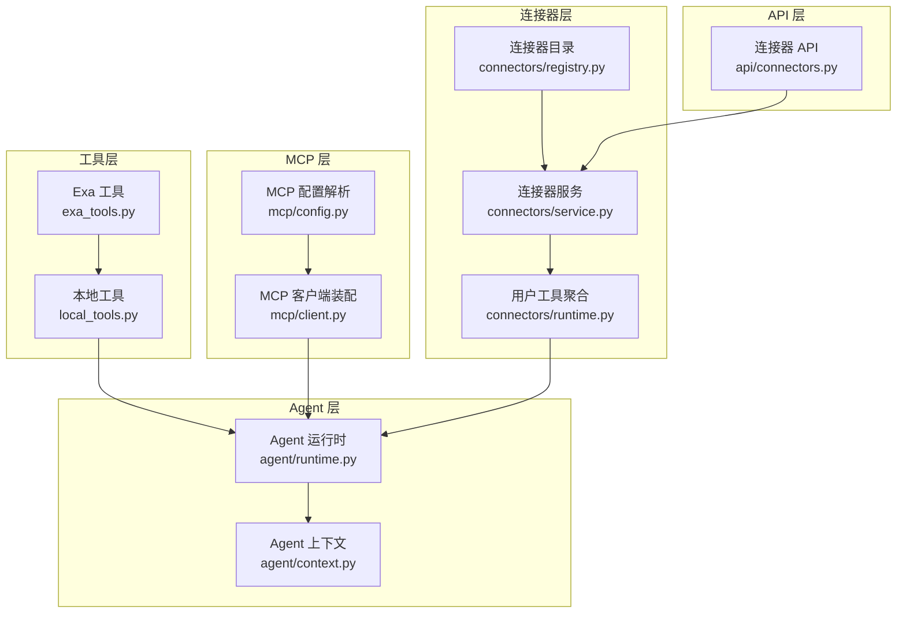
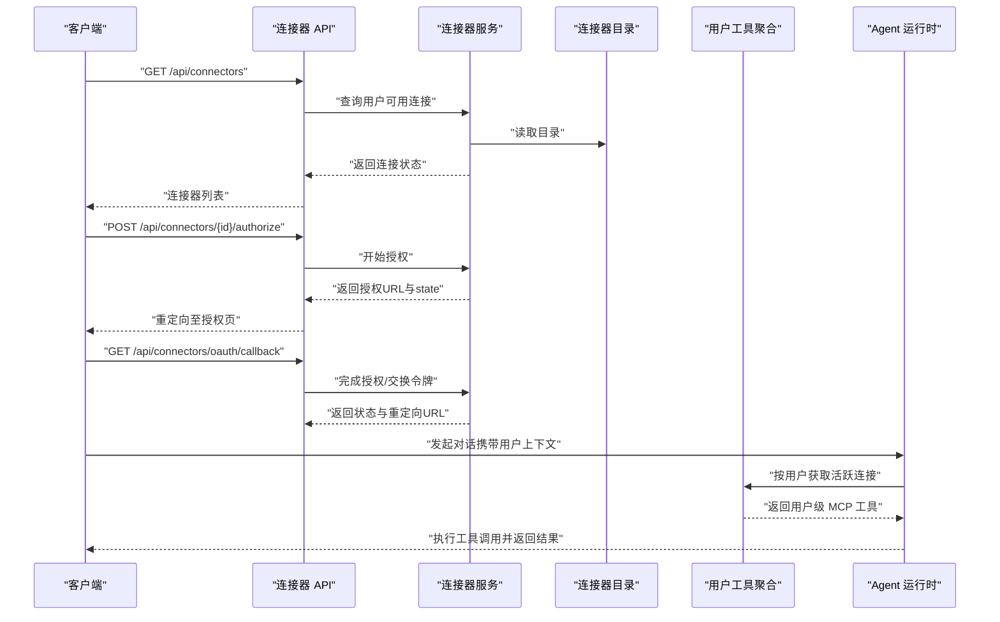
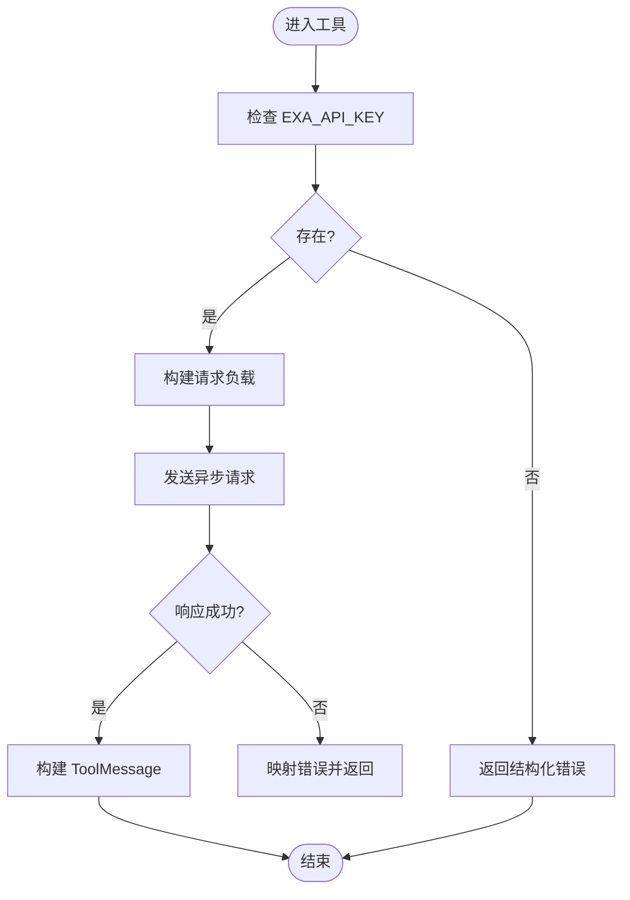
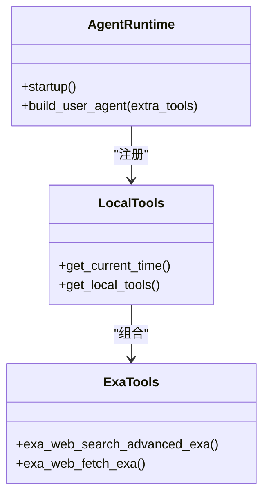
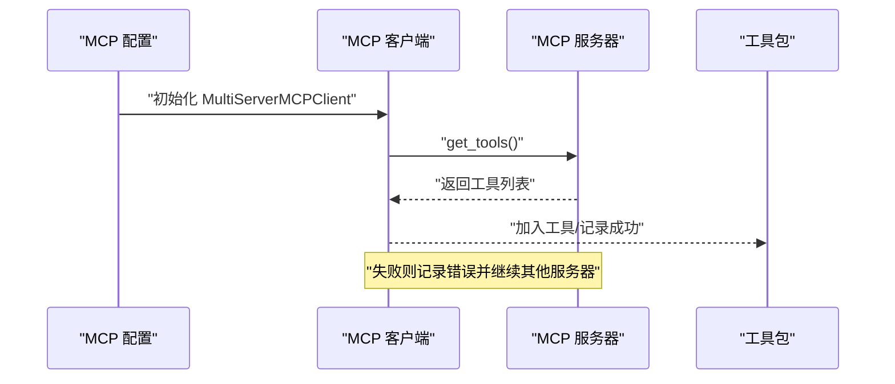
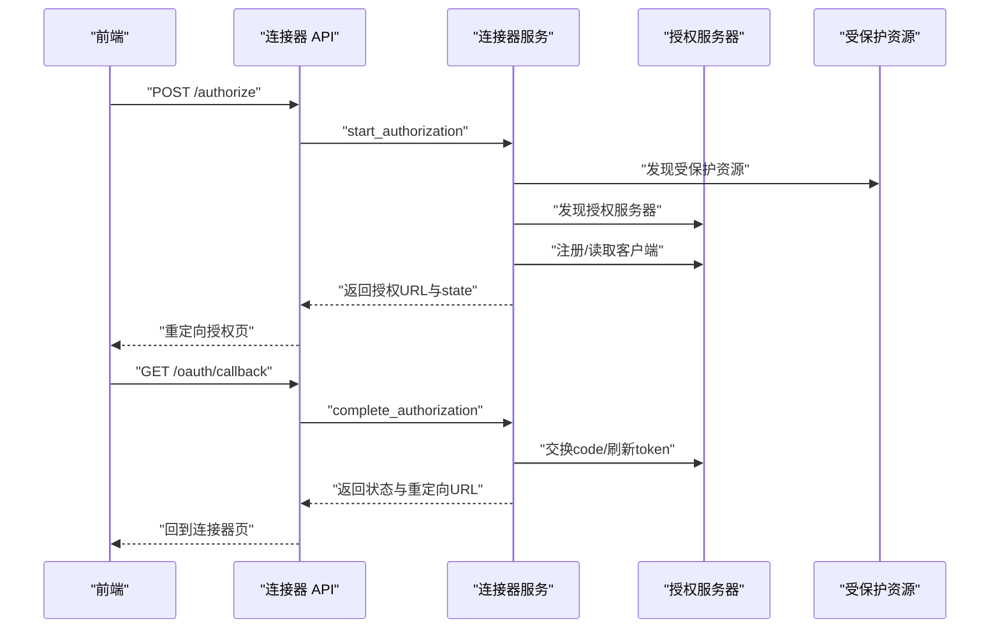
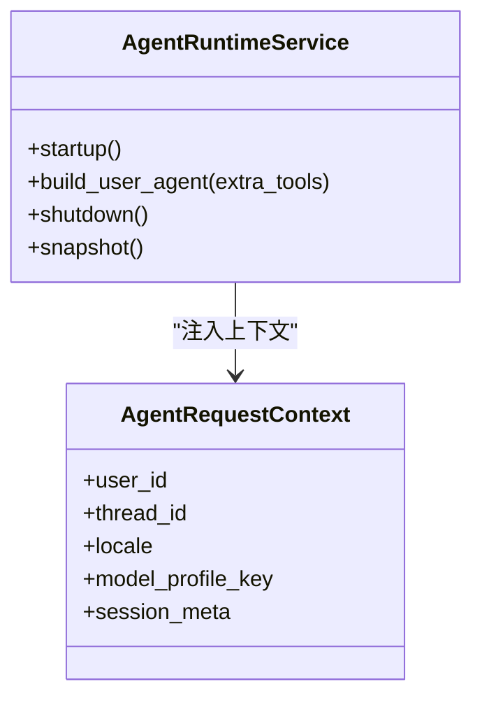
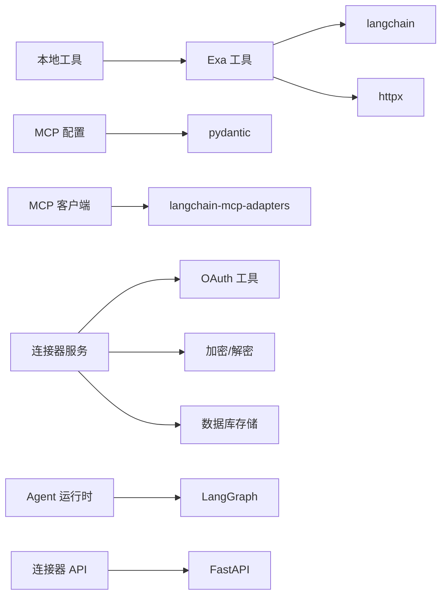

# 工具集成系统

<cite>
**本文引用的文件**
- [exa_tools.py](file://backend/app/tool/exa_tools.py)
- [local_tools.py](file://backend/app/tool/local_tools.py)
- [client.py](file://backend/app/mcp/client.py)
- [config.py](file://backend/app/mcp/config.py)
- [runtime.py](file://backend/app/agent/runtime.py)
- [connectors.py](file://backend/app/api/connectors.py)
- [service.py](file://backend/app/connectors/service.py)
- [runtime.py](file://backend/app/connectors/runtime.py)
- [context.py](file://backend/app/agent/context.py)
- [connectors.py](file://backend/app/schemas/connectors.py)
- [registry.py](file://backend/app/connectors/registry.py)
- [mcp.servers.example.json](file://backend/config/mcp.servers.example.json)
- [test_exa_tools.py](file://backend/tests/test_exa_tools.py)
- [test_local_tools.py](file://backend/tests/test_local_tools.py)
- [test_mcp_client.py](file://backend/tests/test_mcp_client.py)
</cite>

## 目录
1. [简介](#简介)
2. [项目结构](#项目结构)
3. [核心组件](#核心组件)
4. [架构总览](#架构总览)
5. [详细组件分析](#详细组件分析)
6. [依赖分析](#依赖分析)
7. [性能考虑](#性能考虑)
8. [故障排查指南](#故障排查指南)
9. [结论](#结论)
10. [附录](#附录)

## 简介
本文件系统性梳理工具集成系统的设计与实现，覆盖本地工具开发模式（以 Exa API 工具为例）、MCP 工具集成机制（连接器服务、运行时工具管理与注册流程）、工具调用编排策略、错误处理与性能优化、工具开发指南、示例与集成测试方法，以及权限管理、安全与监控指标建议。目标是帮助开发者快速理解并扩展工具生态。

## 项目结构
后端采用分层与功能域划分：
- 工具层：本地工具与第三方工具封装（如 Exa API）
- MCP 层：MCP 连接配置解析、客户端装配与工具加载
- 连接器层：OAuth 授权、令牌刷新、用户级 MCP 工具聚合
- Agent 层：运行时装配、工具注册、中间件与检查点
- API 层：连接器授权的对外接口
- 测试层：针对工具与 MCP 客户端行为的单元测试

**图表来源**
- [exa_tools.py:1-216](file://backend/app/tool/exa_tools.py#L1-L216)
- [local_tools.py:1-56](file://backend/app/tool/local_tools.py#L1-L56)
- [config.py:1-91](file://backend/app/mcp/config.py#L1-L91)
- [client.py:1-69](file://backend/app/mcp/client.py#L1-L69)
- [registry.py:1-62](file://backend/app/connectors/registry.py#L1-L62)
- [service.py:1-407](file://backend/app/connectors/service.py#L1-L407)
- [runtime.py:1-88](file://backend/app/connectors/runtime.py#L1-L88)
- [runtime.py:1-174](file://backend/app/agent/runtime.py#L1-L174)
- [connectors.py:1-103](file://backend/app/api/connectors.py#L1-L103)
- [context.py:1-22](file://backend/app/agent/context.py#L1-L22)

**章节来源**
- [exa_tools.py:1-216](file://backend/app/tool/exa_tools.py#L1-L216)
- [local_tools.py:1-56](file://backend/app/tool/local_tools.py#L1-L56)
- [config.py:1-91](file://backend/app/mcp/config.py#L1-L91)
- [client.py:1-69](file://backend/app/mcp/client.py#L1-L69)
- [registry.py:1-62](file://backend/app/connectors/registry.py#L1-L62)
- [service.py:1-407](file://backend/app/connectors/service.py#L1-L407)
- [runtime.py:1-88](file://backend/app/connectors/runtime.py#L1-L88)
- [runtime.py:1-174](file://backend/app/agent/runtime.py#L1-L174)
- [connectors.py:1-103](file://backend/app/api/connectors.py#L1-L103)
- [context.py:1-22](file://backend/app/agent/context.py#L1-L22)

## 核心组件
- Exa 工具：封装高级搜索与内容抓取，统一错误处理与消息返回格式
- 本地工具：提供系统能力（如获取当前时间），并组合本地与第三方工具
- MCP 配置与客户端：解析连接配置、按服务器批量加载工具、聚合状态与错误
- 连接器服务：OAuth 发现、注册、授权、令牌刷新与状态管理
- 用户级工具聚合：按用户活跃连接动态拼装 MCP 工具集合
- Agent 运行时：全局与用户级 Agent 构建、中间件、检查点与快照
- API：连接器授权的对外接口，支持开始授权、断开与回调处理

**章节来源**
- [exa_tools.py:108-216](file://backend/app/tool/exa_tools.py#L108-L216)
- [local_tools.py:16-56](file://backend/app/tool/local_tools.py#L16-L56)
- [config.py:63-91](file://backend/app/mcp/config.py#L63-L91)
- [client.py:32-69](file://backend/app/mcp/client.py#L32-L69)
- [service.py:74-407](file://backend/app/connectors/service.py#L74-L407)
- [runtime.py:50-88](file://backend/app/connectors/runtime.py#L50-L88)
- [runtime.py:61-174](file://backend/app/agent/runtime.py#L61-L174)
- [connectors.py:24-103](file://backend/app/api/connectors.py#L24-L103)

## 架构总览
系统通过“全局工具 + MCP 工具 + 用户级 MCP 工具”的方式实现工具编排。Agent 启动时加载本地工具与全局 MCP 工具，按需在用户会话中叠加用户级 MCP 工具，形成最终可调用工具集。

**图表来源**
- [connectors.py:24-103](file://backend/app/api/connectors.py#L24-L103)
- [service.py:108-272](file://backend/app/connectors/service.py#L108-L272)
- [registry.py:29-62](file://backend/app/connectors/registry.py#L29-L62)
- [runtime.py:50-88](file://backend/app/connectors/runtime.py#L50-L88)
- [runtime.py:117-133](file://backend/app/agent/runtime.py#L117-L133)

## 详细组件分析

### Exa API 工具实现
- 统一请求封装：基于异步 HTTP 客户端，设置超时与头部，集中处理状态码与网络异常
- 错误结构化：自定义异常类与错误消息提取，保证返回 Artifact 的一致性
- 工具消息：统一返回 ToolMessage，包含 content、artifact、tool_call_id、name、status
- 搜索与内容抓取：分别构造 payload，限制返回条数与高亮长度，控制输出规模

**图表来源**
- [exa_tools.py:42-78](file://backend/app/tool/exa_tools.py#L42-L78)
- [exa_tools.py:108-144](file://backend/app/tool/exa_tools.py#L108-L144)
- [exa_tools.py:146-188](file://backend/app/tool/exa_tools.py#L146-L188)

**章节来源**
- [exa_tools.py:18-78](file://backend/app/tool/exa_tools.py#L18-L78)
- [exa_tools.py:108-216](file://backend/app/tool/exa_tools.py#L108-L216)

### 本地工具与工具注册
- 本地工具：包含系统能力（如获取当前时间）与第三方工具（Exa 搜索/抓取）
- 工具注册：Agent 启动时合并本地工具与全局 MCP 工具；按需在用户会话中叠加用户级 MCP 工具

**图表来源**
- [local_tools.py:16-56](file://backend/app/tool/local_tools.py#L16-L56)
- [runtime.py:80-133](file://backend/app/agent/runtime.py#L80-L133)

**章节来源**
- [local_tools.py:16-56](file://backend/app/tool/local_tools.py#L16-L56)
- [runtime.py:80-133](file://backend/app/agent/runtime.py#L80-L133)

### MCP 工具集成机制
- 配置解析：支持 stdio 与 http/streamable_http/sse 传输，环境变量占位符替换，字段标准化
- 客户端装配：按服务器逐个初始化客户端，批量加载工具，收集连接成功/失败与错误信息
- 用户级聚合：按用户活跃连接推断传输类型，注入 Bearer 令牌，加载工具并汇总

**图表来源**
- [config.py:63-91](file://backend/app/mcp/config.py#L63-L91)
- [client.py:32-69](file://backend/app/mcp/client.py#L32-L69)
- [runtime.py:50-88](file://backend/app/connectors/runtime.py#L50-L88)

**章节来源**
- [config.py:16-91](file://backend/app/mcp/config.py#L16-L91)
- [client.py:32-69](file://backend/app/mcp/client.py#L32-L69)
- [runtime.py:50-88](file://backend/app/connectors/runtime.py#L50-L88)

### 连接器服务与授权流程
- 授权发现：发现受保护资源与授权服务器元数据
- 客户端注册：按需注册 OAuth 客户端，保存密钥与元数据
- 授权与回调：生成授权 URL、保存 state、交换 code 获取令牌、刷新 access token
- 用户级工具：按用户有效连接加载 MCP 工具，失败记录并忽略

**图表来源**
- [connectors.py:34-95](file://backend/app/api/connectors.py#L34-L95)
- [service.py:108-272](file://backend/app/connectors/service.py#L108-L272)

**章节来源**
- [connectors.py:24-103](file://backend/app/api/connectors.py#L24-L103)
- [service.py:74-407](file://backend/app/connectors/service.py#L74-L407)

### 工具调用编排策略
- 全局工具：Agent 启动时一次性注册，包含本地工具与全局 MCP 工具
- 用户级工具：按用户活跃连接动态叠加，支持多服务器工具聚合
- 中间件与上下文：通过 AgentRequestContext 注入用户、线程、语言与模型档位等信息
- 检查点与存储：LangGraph 检查点与存储用于状态持久化与恢复

**图表来源**
- [runtime.py:61-174](file://backend/app/agent/runtime.py#L61-L174)
- [context.py:10-22](file://backend/app/agent/context.py#L10-L22)

**章节来源**
- [runtime.py:61-174](file://backend/app/agent/runtime.py#L61-L174)
- [context.py:10-22](file://backend/app/agent/context.py#L10-L22)

## 依赖分析
- 工具层依赖：langchain 工具装饰器、消息模型、异步 HTTP 客户端
- MCP 层依赖：langchain-mcp-adapters 客户端、Pydantic 校验
- 连接器层依赖：OAuth 协议工具、加密/解密、数据库存储
- Agent 层依赖：LangGraph Agent、中间件、检查点与存储
- API 层依赖：FastAPI 路由、认证依赖注入

**图表来源**
- [exa_tools.py:8-12](file://backend/app/tool/exa_tools.py#L8-L12)
- [local_tools.py:11-14](file://backend/app/tool/local_tools.py#L11-L14)
- [config.py:11](file://backend/app/mcp/config.py#L11)
- [client.py:9](file://backend/app/mcp/client.py#L9)
- [service.py:15-41](file://backend/app/connectors/service.py#L15-L41)
- [runtime.py:9-21](file://backend/app/agent/runtime.py#L9-L21)
- [connectors.py:8-18](file://backend/app/api/connectors.py#L8-L18)

**章节来源**
- [exa_tools.py:8-12](file://backend/app/tool/exa_tools.py#L8-L12)
- [local_tools.py:11-14](file://backend/app/tool/local_tools.py#L11-L14)
- [config.py:11](file://backend/app/mcp/config.py#L11)
- [client.py:9](file://backend/app/mcp/client.py#L9)
- [service.py:15-41](file://backend/app/connectors/service.py#L15-L41)
- [runtime.py:9-21](file://backend/app/agent/runtime.py#L9-L21)
- [connectors.py:8-18](file://backend/app/api/connectors.py#L8-L18)

## 性能考虑
- 异步 I/O：Exa 请求与 OAuth 交互均采用异步客户端，降低阻塞
- 超时与重试：请求超时固定，建议在上游网关或代理层配置重试与熔断
- 输出裁剪：限制高亮与摘要长度，控制工具返回规模
- 工具聚合：按用户动态加载，避免不必要的工具注册
- 缓存与检查点：利用 LangGraph 检查点减少重复计算

[本节为通用指导，无需具体文件分析]

## 故障排查指南
- Exa 工具错误
  - 缺少 API Key：返回结构化错误，Artifact 包含错误信息
  - 请求失败：捕获 HTTP 异常，映射为结构化错误并返回
- MCP 工具加载
  - 单服务器失败不影响其他服务器：检查错误列表与连接状态
- 连接器授权
  - 授权失败/过期：查看最后错误字段，必要时重新授权
  - 回调参数缺失：确认 state、code、error 参数是否正确传递

**章节来源**
- [test_exa_tools.py:170-223](file://backend/tests/test_exa_tools.py#L170-L223)
- [test_mcp_client.py:10-35](file://backend/tests/test_mcp_client.py#L10-L35)
- [service.py:176-230](file://backend/app/connectors/service.py#L176-L230)

## 结论
该工具集成系统通过本地工具与 MCP 工具的统一编排，结合连接器授权与用户级工具聚合，实现了灵活、可扩展的工具生态。系统在错误处理、配置解析与运行时装配方面具备良好内聚性，适合进一步扩展更多第三方工具与连接器。

[本节为总结，无需具体文件分析]

## 附录

### 工具开发指南
- 工具接口定义
  - 使用装饰器声明工具，返回 ToolMessage 或结构化字典
  - 显式注入 tool_call_id，便于追踪调用链
- 参数验证
  - 使用 Pydantic 字段约束（如范围、类型），提前拦截非法输入
- 返回值处理
  - 成功：content 用于消息展示，artifact 用于后续处理
  - 失败：status 设为 error，artifact 提供结构化错误
- 异常捕获
  - 统一捕获网络与业务异常，转换为结构化错误
- 示例参考
  - Exa 搜索与抓取工具的请求封装、错误映射与消息构建

**章节来源**
- [exa_tools.py:190-216](file://backend/app/tool/exa_tools.py#L190-L216)
- [exa_tools.py:108-188](file://backend/app/tool/exa_tools.py#L108-L188)
- [local_tools.py:16-56](file://backend/app/tool/local_tools.py#L16-L56)

### 集成测试方法
- 工具行为验证
  - 使用模拟 HTTP 请求，断言请求路径与负载
  - 断言 ToolMessage 的状态、名称与内容片段
- MCP 客户端容错
  - 模拟部分服务器失败，验证其余工具仍可加载
- 本地工具清单
  - 断言工具列表包含预期工具名称

**章节来源**
- [test_exa_tools.py:12-103](file://backend/tests/test_exa_tools.py#L12-L103)
- [test_exa_tools.py:105-168](file://backend/tests/test_exa_tools.py#L105-L168)
- [test_mcp_client.py:10-35](file://backend/tests/test_mcp_client.py#L10-L35)
- [test_local_tools.py:6-23](file://backend/tests/test_local_tools.py#L6-L23)

### 权限管理、安全与监控
- 权限与授权
  - 连接器授权采用 OAuth 2.0/PKCE，令牌加密存储，支持刷新
  - 授权回调严格校验 state 与用户身份
- 安全
  - 环境变量占位符在配置解析阶段替换，缺失即报错
  - 传输类型自动推断（http/sse/streamable_http），避免硬编码
- 监控
  - Agent 运行时快照包含 MCP 连接状态、错误列表与工具清单
  - 建议在 MCP 客户端与工具层增加日志与指标上报

**章节来源**
- [config.py:36-52](file://backend/app/mcp/config.py#L36-L52)
- [service.py:108-272](file://backend/app/connectors/service.py#L108-L272)
- [runtime.py:156-174](file://backend/app/agent/runtime.py#L156-L174)

### 配置示例
- MCP 服务器配置示例展示了 http 与 stdio 两种传输方式，以及环境变量占位符的使用

**章节来源**
- [mcp.servers.example.json:1-18](file://backend/config/mcp.servers.example.json#L1-L18)