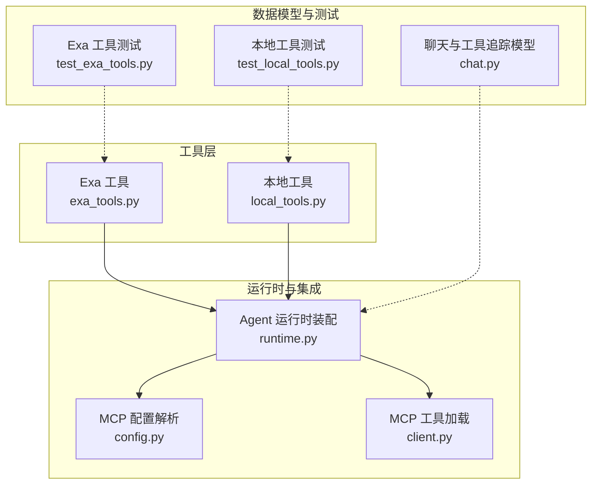
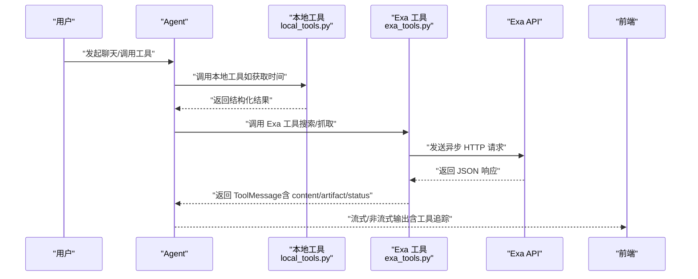
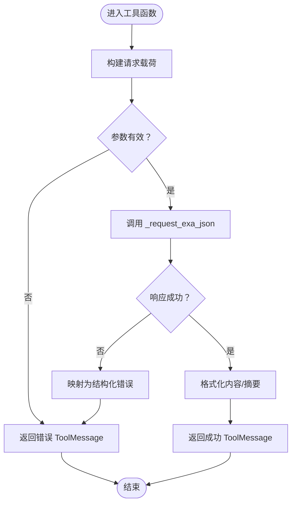
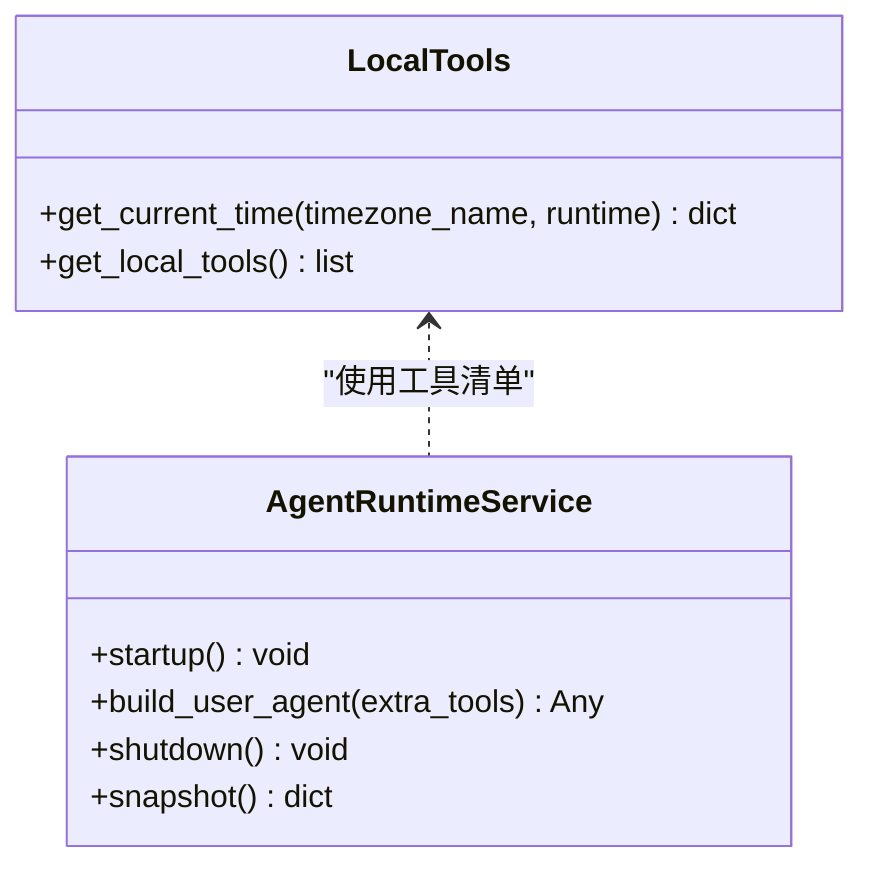
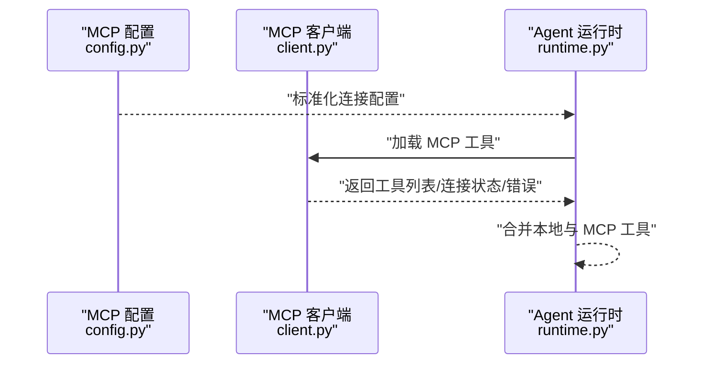
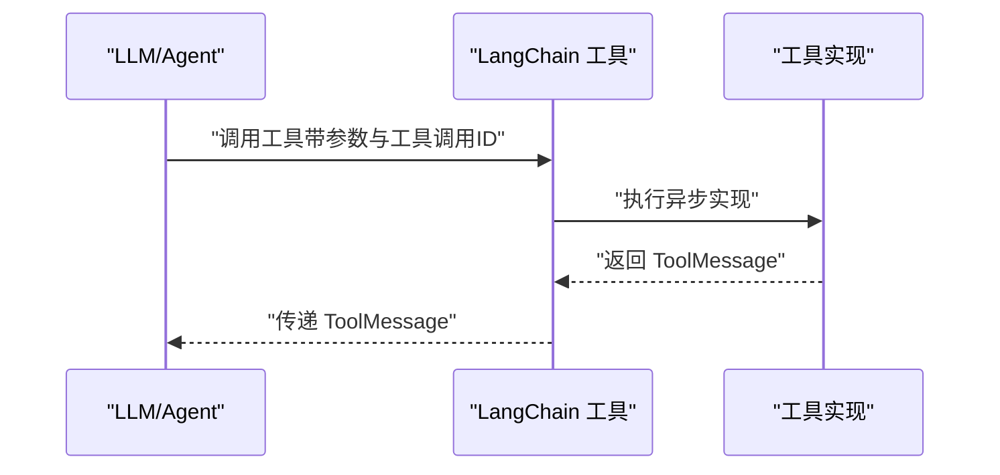
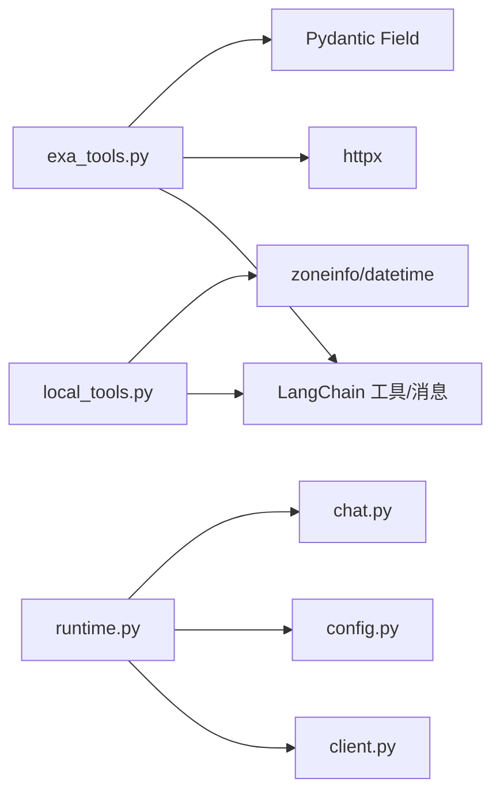

# 本地工具开发

<cite>
**本文引用的文件**
- [exa_tools.py](file://backend/app/tool/exa_tools.py)
- [local_tools.py](file://backend/app/tool/local_tools.py)
- [test_exa_tools.py](file://backend/tests/test_exa_tools.py)
- [test_local_tools.py](file://backend/tests/test_local_tools.py)
- [runtime.py](file://backend/app/agent/runtime.py)
- [client.py](file://backend/app/mcp/client.py)
- [config.py](file://backend/app/mcp/config.py)
- [chat.py](file://backend/app/schemas/chat.py)
- [pyproject.toml](file://backend/pyproject.toml)
- [connectors.registry.py](file://backend/app/connectors/registry.py)
- [connectors.oauth.py](file://backend/app/connectors/oauth.py)
- [connectors.store.py](file://backend/app/connectors/store.py)
</cite>

## 目录
1. [简介](#简介)
2. [项目结构](#项目结构)
3. [核心组件](#核心组件)
4. [架构总览](#架构总览)
5. [详细组件分析](#详细组件分析)
6. [依赖分析](#依赖分析)
7. [性能考量](#性能考量)
8. [故障排查指南](#故障排查指南)
9. [结论](#结论)
10. [附录](#附录)

## 简介
本文件面向本地工具开发，系统性阐述工具开发模式与实现规范，重点覆盖以下方面：
- Exa API 工具的具体实现与调用流程
- 工具接口定义、参数验证与返回值处理
- 工具类设计模式、错误处理策略、性能优化与安全考虑
- 工具注册、调用方式与测试方法
- 工具权限管理、日志记录与监控指标
- 工具扩展指南与常见问题解决方案

## 项目结构
本地工具位于后端应用的工具子包中，结合 Agent 运行时与 MCP 工具进行统一装配与调度。核心目录与文件如下：
- 工具实现：backend/app/tool/exa_tools.py、backend/app/tool/local_tools.py
- 工具注册与装配：backend/app/agent/runtime.py
- MCP 工具客户端与配置：backend/app/mcp/client.py、backend/app/mcp/config.py
- 聊天与工具追踪数据模型：backend/app/schemas/chat.py
- 测试用例：backend/tests/test_exa_tools.py、backend/tests/test_local_tools.py
- 依赖与运行时配置：backend/pyproject.toml
- 连接器与权限：backend/app/connectors/registry.py、backend/app/connectors/oauth.py、backend/app/connectors/store.py

图表来源
- [exa_tools.py:1-216](file://backend/app/tool/exa_tools.py#L1-L216)
- [local_tools.py:1-56](file://backend/app/tool/local_tools.py#L1-L56)
- [runtime.py:1-174](file://backend/app/agent/runtime.py#L1-L174)
- [client.py:1-69](file://backend/app/mcp/client.py#L1-L69)
- [config.py:1-91](file://backend/app/mcp/config.py#L1-L91)
- [chat.py:1-274](file://backend/app/schemas/chat.py#L1-L274)
- [test_exa_tools.py:1-223](file://backend/tests/test_exa_tools.py#L1-L223)
- [test_local_tools.py:1-23](file://backend/tests/test_local_tools.py#L1-L23)

章节来源
- [exa_tools.py:1-216](file://backend/app/tool/exa_tools.py#L1-L216)
- [local_tools.py:1-56](file://backend/app/tool/local_tools.py#L1-L56)
- [runtime.py:1-174](file://backend/app/agent/runtime.py#L1-L174)
- [client.py:1-69](file://backend/app/mcp/client.py#L1-L69)
- [config.py:1-91](file://backend/app/mcp/config.py#L1-L91)
- [chat.py:1-274](file://backend/app/schemas/chat.py#L1-L274)
- [test_exa_tools.py:1-223](file://backend/tests/test_exa_tools.py#L1-L223)
- [test_local_tools.py:1-23](file://backend/tests/test_local_tools.py#L1-L23)

## 核心组件
- Exa 工具：封装异步 HTTP 请求、参数校验、错误转换与结果格式化，提供高级搜索与内容抓取两类工具函数。
- 本地工具：提供系统时间查询等本地能力，并统一导出本地工具清单以供 Agent 注册。
- Agent 运行时：负责聚合本地工具与 MCP 工具，创建可调用的 Agent 并提供运行时快照。
- MCP 工具：通过配置加载多个 MCP 服务器工具，统一管理连接状态与错误。
- 数据模型：定义聊天消息、工具追踪、卡片等结构，支撑前端展示与调试。

章节来源
- [exa_tools.py:18-216](file://backend/app/tool/exa_tools.py#L18-L216)
- [local_tools.py:16-56](file://backend/app/tool/local_tools.py#L16-L56)
- [runtime.py:80-133](file://backend/app/agent/runtime.py#L80-L133)
- [client.py:32-69](file://backend/app/mcp/client.py#L32-L69)
- [chat.py:31-110](file://backend/app/schemas/chat.py#L31-L110)

## 架构总览
本地工具与 MCP 工具在 Agent 运行时被统一装配，形成可调用的工具集。工具调用通过 LangChain 工具装饰器包装，返回标准化的消息对象，便于前端展示与追踪。

图表来源
- [runtime.py:94-104](file://backend/app/agent/runtime.py#L94-L104)
- [local_tools.py:16-56](file://backend/app/tool/local_tools.py#L16-L56)
- [exa_tools.py:108-216](file://backend/app/tool/exa_tools.py#L108-L216)
- [chat.py:31-110](file://backend/app/schemas/chat.py#L31-L110)

## 详细组件分析

### Exa 工具实现与调用流程
- 异步请求封装：统一基地址、超时与鉴权头，捕获 HTTP 错误并转换为结构化错误。
- 参数校验与构建：对搜索/抓取请求构造 payload，限制结果数量范围，规范化 URL 列表。
- 结果格式化：将响应结果转为人类可读摘要或简要列表，同时保留原始 artifact 以便前端渲染与调试。
- 工具函数：提供高级搜索与内容抓取两个异步工具，均返回 ToolMessage，包含工具调用 ID、名称、状态与内容。

图表来源
- [exa_tools.py:42-78](file://backend/app/tool/exa_tools.py#L42-L78)
- [exa_tools.py:108-144](file://backend/app/tool/exa_tools.py#L108-L144)
- [exa_tools.py:146-188](file://backend/app/tool/exa_tools.py#L146-L188)

章节来源
- [exa_tools.py:18-216](file://backend/app/tool/exa_tools.py#L18-L216)

### 本地工具与注册机制
- 本地工具：提供获取当前时间工具，支持时区解析与回退策略，返回结构化时间信息。
- 工具清单：集中导出本地工具列表，供 Agent 运行时装配。
- 运行时装配：在启动时合并本地工具与 MCP 工具，创建 Agent 并生成运行时快照。

图表来源
- [local_tools.py:16-56](file://backend/app/tool/local_tools.py#L16-L56)
- [runtime.py:80-133](file://backend/app/agent/runtime.py#L80-L133)

章节来源
- [local_tools.py:16-56](file://backend/app/tool/local_tools.py#L16-L56)
- [runtime.py:80-133](file://backend/app/agent/runtime.py#L80-L133)

### MCP 工具加载与配置
- 配置解析：支持 http/sse/streamable_http 传输与 stdio 传输，自动替换环境变量占位符。
- 工具加载：多服务器客户端统一加载工具，记录连接状态与错误，便于诊断。
- 运行时集成：将 MCP 工具与本地工具合并注入 Agent。

图表来源
- [config.py:63-91](file://backend/app/mcp/config.py#L63-L91)
- [client.py:32-69](file://backend/app/mcp/client.py#L32-L69)
- [runtime.py:85-104](file://backend/app/agent/runtime.py#L85-L104)

章节来源
- [config.py:1-91](file://backend/app/mcp/config.py#L1-L91)
- [client.py:1-69](file://backend/app/mcp/client.py#L1-L69)
- [runtime.py:1-174](file://backend/app/agent/runtime.py#L1-L174)

### 工具接口定义与调用流程
- 接口装饰：使用 LangChain 工具装饰器，统一签名与调用协议。
- 参数验证：通过 Pydantic 字段约束（如最小/最大结果数），保证输入合法性。
- 返回值处理：统一返回 ToolMessage，包含 content、artifact、status、tool_call_id、name 等字段，便于前端渲染与追踪。

图表来源
- [exa_tools.py:190-216](file://backend/app/tool/exa_tools.py#L190-L216)
- [exa_tools.py:205-216](file://backend/app/tool/exa_tools.py#L205-L216)
- [chat.py:98-110](file://backend/app/schemas/chat.py#L98-L110)

章节来源
- [exa_tools.py:18-216](file://backend/app/tool/exa_tools.py#L18-L216)
- [chat.py:31-110](file://backend/app/schemas/chat.py#L31-L110)

### 参数验证机制与返回值处理
- 参数验证：使用 Pydantic Field 约束（如 ge/le），确保数值范围合法；对 URL 列表进行清洗与过滤。
- 返回值处理：ToolMessage 统一承载内容与原始 artifact，便于前端以卡片或文本形式展示；状态字段用于区分成功/错误。
- 错误处理：自定义异常类与结构化错误映射，保留原始响应以便调试。

章节来源
- [exa_tools.py:192-194](file://backend/app/tool/exa_tools.py#L192-L194)
- [exa_tools.py:151-159](file://backend/app/tool/exa_tools.py#L151-L159)
- [exa_tools.py:72-78](file://backend/app/tool/exa_tools.py#L72-L78)

### 工具开发最佳实践
- 设计模式
  - 使用 LangChain 工具装饰器统一工具签名与调用协议。
  - 将网络请求封装为独立异步函数，便于测试与复用。
  - 将结果格式化与错误映射分离，提升可维护性。
- 参数验证
  - 对外部输入进行显式校验（长度、范围、类型），必要时进行清洗（如 URL 规范化）。
- 返回值处理
  - 统一返回 ToolMessage，保留 artifact 与状态，便于前端渲染与调试。
- 错误处理
  - 捕获网络异常并转换为结构化错误，保留原始响应体以便定位问题。
- 性能优化
  - 控制并发与超时，避免阻塞；合理设置结果数量上限。
- 安全考虑
  - 敏感配置通过环境变量注入；避免在日志中泄露敏感信息。
  - 对第三方 API 的响应进行最小化处理，仅保留必要字段。

章节来源
- [exa_tools.py:42-78](file://backend/app/tool/exa_tools.py#L42-L78)
- [exa_tools.py:108-188](file://backend/app/tool/exa_tools.py#L108-L188)
- [pyproject.toml:6-24](file://backend/pyproject.toml#L6-L24)

### 工具实现示例与测试方法
- Exa 工具测试要点
  - 模拟请求映射请求与响应，断言路径、载荷与 ToolMessage 字段。
  - 验证缺失 API Key 与 HTTP 错误时的结构化错误返回。
- 本地工具测试要点
  - 断言返回字段完整性与工具清单包含预期工具。

章节来源
- [test_exa_tools.py:12-103](file://backend/tests/test_exa_tools.py#L12-L103)
- [test_exa_tools.py:105-168](file://backend/tests/test_exa_tools.py#L105-L168)
- [test_exa_tools.py:170-223](file://backend/tests/test_exa_tools.py#L170-L223)
- [test_local_tools.py:6-23](file://backend/tests/test_local_tools.py#L6-L23)

### 工具权限管理、日志记录与监控指标
- 权限与连接器
  - 连接器目录：通过 JSON 文件维护管理员可维护的应用列表，支持启用/禁用与排序。
  - OAuth 流程：记录授权服务器发现与令牌保存状态，支持过期与撤销状态管理。
- 日志记录
  - MCP 客户端在初始化失败时记录异常日志，便于快速定位问题。
- 监控指标
  - Agent 运行时快照包含本地工具与 MCP 工具列表、连接状态与错误列表，可用于健康检查与运维监控。

章节来源
- [connectors.registry.py:23-62](file://backend/app/connectors/registry.py#L23-L62)
- [connectors.oauth.py:358-392](file://backend/app/connectors/oauth.py#L358-L392)
- [connectors.store.py:181-218](file://backend/app/connectors/store.py#L181-L218)
- [client.py:52-57](file://backend/app/mcp/client.py#L52-L57)
- [runtime.py:156-174](file://backend/app/agent/runtime.py#L156-L174)

### 工具扩展指南
- 新增本地工具
  - 在本地工具模块中定义新工具函数，使用工具装饰器与统一签名。
  - 将新工具加入工具清单导出函数，确保被 Agent 正常注册。
- 新增 MCP 工具
  - 在 MCP 配置文件中添加新的服务器连接项，支持 http/sse/streamable_http 或 stdio 传输。
  - 启动时由运行时加载并注入 Agent。
- 新增第三方 API 工具
  - 参考 Exa 工具的请求封装、错误映射与结果格式化模式，保持一致的返回结构。

章节来源
- [local_tools.py:49-56](file://backend/app/tool/local_tools.py#L49-L56)
- [config.py:63-91](file://backend/app/mcp/config.py#L63-L91)
- [runtime.py:85-104](file://backend/app/agent/runtime.py#L85-L104)

## 依赖分析
- 工具层依赖
  - Exa 工具依赖 httpx、LangChain 工具装饰器与 ToolMessage，以及 Pydantic 字段校验。
  - 本地工具依赖 LangChain 工具装饰器与时区库，组合本地工具清单。
- 运行时依赖
  - Agent 运行时依赖 MCP 客户端与配置模块，统一装配本地与 MCP 工具。
- 前后端交互
  - 聊天与工具追踪模型支撑前端展示与调试，工具调用状态与内容通过消息部件传递。

图表来源
- [exa_tools.py:8-12](file://backend/app/tool/exa_tools.py#L8-L12)
- [local_tools.py:11-14](file://backend/app/tool/local_tools.py#L11-L14)
- [runtime.py:19-21](file://backend/app/agent/runtime.py#L19-L21)
- [chat.py:12-12](file://backend/app/schemas/chat.py#L12-L12)

章节来源
- [exa_tools.py:1-216](file://backend/app/tool/exa_tools.py#L1-L216)
- [local_tools.py:1-56](file://backend/app/tool/local_tools.py#L1-L56)
- [runtime.py:1-174](file://backend/app/agent/runtime.py#L1-L174)
- [chat.py:1-274](file://backend/app/schemas/chat.py#L1-L274)

## 性能考量
- 网络请求
  - 设置合理的超时与重试策略，避免阻塞 Agent 执行。
  - 控制结果数量上限，减少不必要的数据传输与处理。
- 工具并发
  - 在 Agent 中合理组织工具调用顺序，避免高并发下的资源争用。
- 前端渲染
  - 通过 ToolMessage 的 artifact 与 content 分离，前端按需渲染，降低重复计算。

## 故障排查指南
- 缺少 API Key
  - 现象：工具返回结构化错误，artifact 包含明确提示。
  - 处理：检查环境变量配置，确保密钥正确注入。
- HTTP 错误
  - 现象：工具返回结构化错误，artifact 保留原始响应体。
  - 处理：根据状态码与错误信息定位上游问题，必要时重试或降级。
- MCP 连接失败
  - 现象：运行时快照显示连接失败与错误列表。
  - 处理：检查 MCP 配置文件与目标服务可达性，查看日志异常堆栈。

章节来源
- [test_exa_tools.py:170-191](file://backend/tests/test_exa_tools.py#L170-L191)
- [test_exa_tools.py:193-223](file://backend/tests/test_exa_tools.py#L193-L223)
- [client.py:52-57](file://backend/app/mcp/client.py#L52-L57)
- [runtime.py:156-174](file://backend/app/agent/runtime.py#L156-L174)

## 结论
本地工具开发应遵循统一的接口规范与错误处理策略，结合 MCP 工具实现能力扩展。通过结构化的 ToolMessage 返回、完善的测试与可观测性，可显著提升工具的稳定性与可维护性。建议在新增工具时严格复用现有模式，确保一致的用户体验与工程实践。

## 附录
- 依赖与运行时配置
  - 项目依赖与测试配置见后端依赖清单与测试选项。
- 工具追踪与前端展示
  - 聊天与工具追踪模型定义了工具调用轨迹与消息部件结构，支撑前端渲染与调试。

章节来源
- [pyproject.toml:1-42](file://backend/pyproject.toml#L1-L42)
- [chat.py:31-110](file://backend/app/schemas/chat.py#L31-L110)