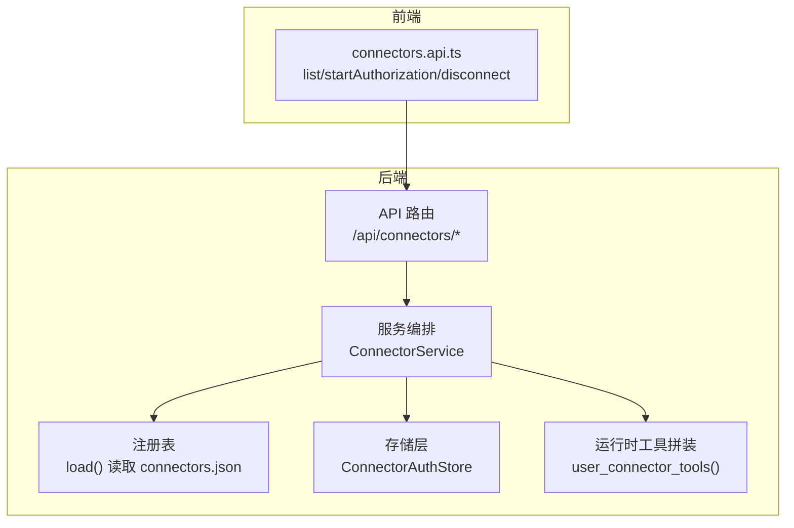
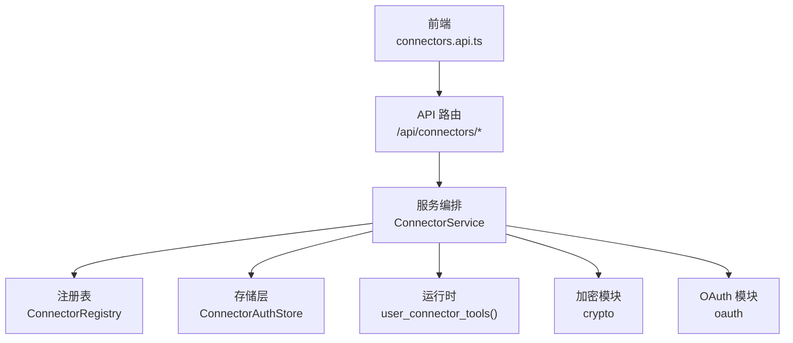
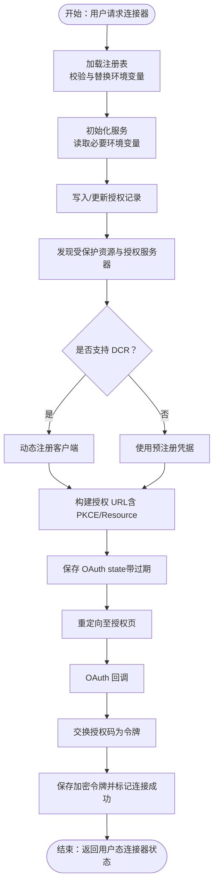
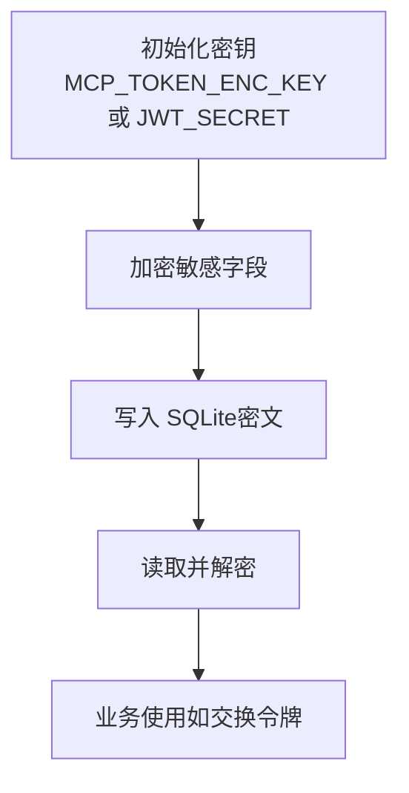
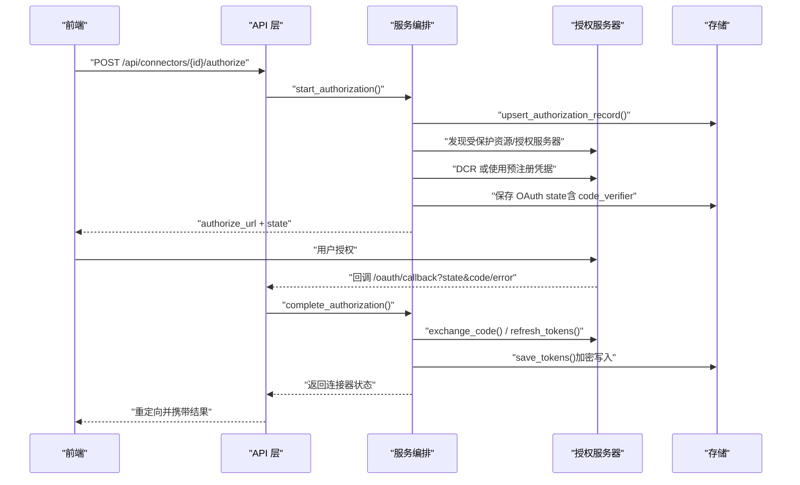
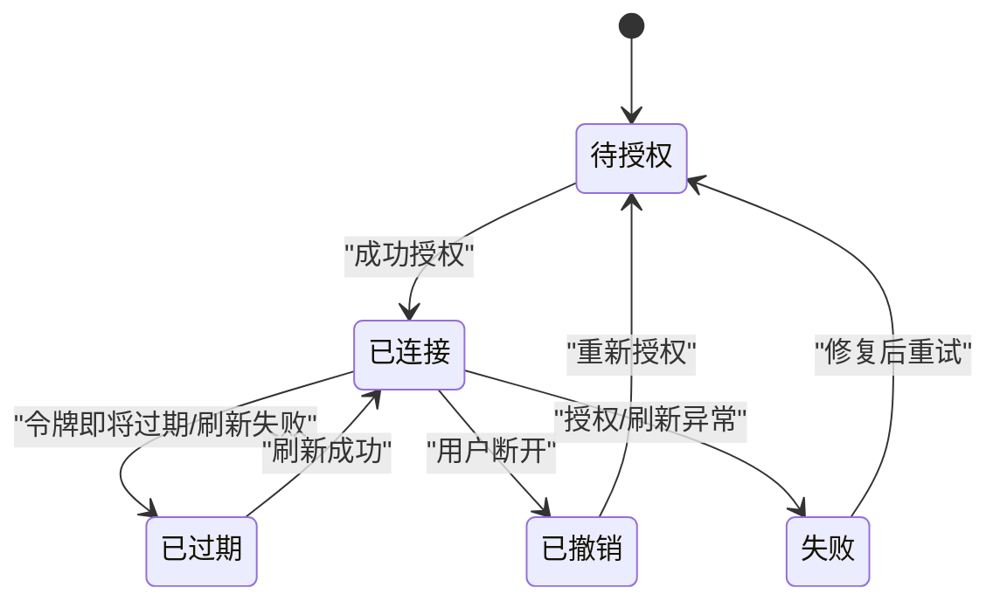
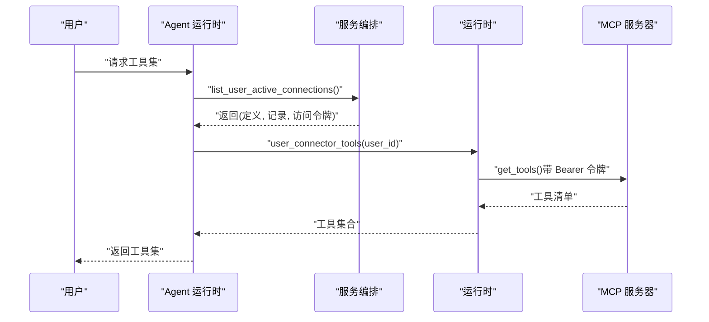
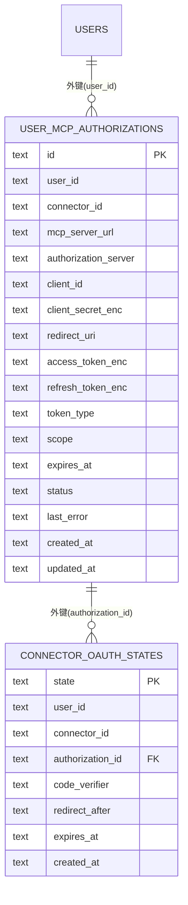

# 连接器管理

<cite>
**本文引用的文件**
- [backend/app/connectors/__init__.py](file://backend/app/connectors/__init__.py)
- [backend/app/connectors/service.py](file://backend/app/connectors/service.py)
- [backend/app/connectors/runtime.py](file://backend/app/connectors/runtime.py)
- [backend/app/connectors/registry.py](file://backend/app/connectors/registry.py)
- [backend/app/connectors/crypto.py](file://backend/app/connectors/crypto.py)
- [backend/app/connectors/oauth.py](file://backend/app/connectors/oauth.py)
- [backend/app/connectors/store.py](file://backend/app/connectors/store.py)
- [backend/app/schemas/connectors.py](file://backend/app/schemas/connectors.py)
- [backend/app/api/connectors.py](file://backend/app/api/connectors.py)
- [backend/config/connectors.example.json](file://backend/config/connectors.example.json)
- [backend/migrations/006_user_mcp_authorizations.sql](file://backend/migrations/006_user_mcp_authorizations.sql)
- [backend/app/db/bootstrap.py](file://backend/app/db/bootstrap.py)
- [backend/tests/test_connectors_oauth.py](file://backend/tests/test_connectors_oauth.py)
- [backend/tests/test_connectors_crypto.py](file://backend/tests/test_connectors_crypto.py)
- [frontend/src/features/connectors/api/connectors.api.ts](file://frontend/src/features/connectors/api/connectors.api.ts)
</cite>

## 目录
1. [简介](#简介)
2. [项目结构](#项目结构)
3. [核心组件](#核心组件)
4. [架构总览](#架构总览)
5. [详细组件分析](#详细组件分析)
6. [依赖分析](#依赖分析)
7. [性能考量](#性能考量)
8. [故障排查指南](#故障排查指南)
9. [结论](#结论)
10. [附录](#附录)

## 简介
本文件系统性阐述连接器管理子系统的设计与实现，覆盖连接器生命周期（创建、初始化、配置、销毁）、加密存储机制、OAuth 认证流程与安全令牌管理、状态管理与连接池优化、资源回收策略、开发与运维指南、监控与诊断、以及与 Agent 服务的集成与数据流转。

## 项目结构
连接器子系统位于后端 Python 包 app/connectors 下，围绕“注册表（管理员定义）—服务编排（业务逻辑）—存储（SQLite）—运行时（工具拼装）—API（HTTP 接口）”展开；前端通过统一 API 与后端交互。

图表来源
- [backend/app/connectors/registry.py:52-87](file://backend/app/connectors/registry.py#L52-L87)
- [backend/app/connectors/service.py:74-106](file://backend/app/connectors/service.py#L74-L106)
- [backend/app/connectors/store.py:78-102](file://backend/app/connectors/store.py#L78-L102)
- [backend/app/connectors/runtime.py:50-88](file://backend/app/connectors/runtime.py#L50-L88)
- [backend/app/api/connectors.py:24-103](file://backend/app/api/connectors.py#L24-L103)
- [frontend/src/features/connectors/api/connectors.api.ts:33-40](file://frontend/src/features/connectors/api/connectors.api.ts#L33-L40)

章节来源
- [backend/app/connectors/__init__.py:1-5](file://backend/app/connectors/__init__.py#L1-L5)
- [backend/app/connectors/registry.py:46-87](file://backend/app/connectors/registry.py#L46-L87)
- [backend/app/connectors/service.py:74-106](file://backend/app/connectors/service.py#L74-L106)
- [backend/app/connectors/store.py:78-102](file://backend/app/connectors/store.py#L78-L102)
- [backend/app/connectors/runtime.py:50-88](file://backend/app/connectors/runtime.py#L50-L88)
- [backend/app/api/connectors.py:24-103](file://backend/app/api/connectors.py#L24-L103)
- [frontend/src/features/connectors/api/connectors.api.ts:33-40](file://frontend/src/features/connectors/api/connectors.api.ts#L33-L40)

## 核心组件
- 注册表（ConnectorRegistry）
  - 负责从 connectors.json 加载管理员维护的连接器元数据，支持环境变量占位符替换与 Pydantic 校验。
- 服务编排（ConnectorService）
  - 协调注册表、用户授权状态与 OAuth 流程，提供“列出用户可用连接器”“开始授权”“完成授权”“断开连接”“列举活跃连接”等能力。
- 存储（ConnectorAuthStore）
  - 基于 SQLite 的持久化存储，维护用户对各连接器的授权记录与 OAuth 临时状态，提供事务与外键约束。
- 运行时（user_connector_tools）
  - 按用户聚合可用的 MCP 工具集，自动管理底层 MCP 客户端生命周期并在退出时回收资源。
- 加密（crypto）
  - 基于 AES-256-GCM 的对称加密，密钥来自 MCP_TOKEN_ENC_KEY 或 JWT_SECRET。
- OAuth（oauth）
  - 实现 MCP 授权规范相关能力：受保护资源发现、授权服务器元数据发现、DCR、PKCE、授权码与刷新令牌。
- API（/api/connectors）
  - 提供连接器列表、发起授权、断开连接、OAuth 回调重定向等接口。
- 前端 API（connectors.api.ts）
  - 定义与后端交互的数据结构与方法。

章节来源
- [backend/app/connectors/registry.py:46-87](file://backend/app/connectors/registry.py#L46-L87)
- [backend/app/connectors/service.py:74-421](file://backend/app/connectors/service.py#L74-L421)
- [backend/app/connectors/store.py:78-349](file://backend/app/connectors/store.py#L78-L349)
- [backend/app/connectors/runtime.py:18-88](file://backend/app/connectors/runtime.py#L18-L88)
- [backend/app/connectors/crypto.py:13-55](file://backend/app/connectors/crypto.py#L13-L55)
- [backend/app/connectors/oauth.py:32-419](file://backend/app/connectors/oauth.py#L32-L419)
- [backend/app/api/connectors.py:24-103](file://backend/app/api/connectors.py#L24-L103)
- [frontend/src/features/connectors/api/connectors.api.ts:11-40](file://frontend/src/features/connectors/api/connectors.api.ts#L11-L40)

## 架构总览
连接器管理采用“分层+职责分离”的设计：注册表负责静态元数据，服务层编排业务流程，存储层持久化状态，运行时负责动态工具装配，API 层暴露 HTTP 接口并与前端协作。

图表来源
- [backend/app/api/connectors.py:24-103](file://backend/app/api/connectors.py#L24-L103)
- [backend/app/connectors/service.py:74-421](file://backend/app/connectors/service.py#L74-L421)
- [backend/app/connectors/registry.py:52-87](file://backend/app/connectors/registry.py#L52-L87)
- [backend/app/connectors/store.py:78-102](file://backend/app/connectors/store.py#L78-L102)
- [backend/app/connectors/runtime.py:50-88](file://backend/app/connectors/runtime.py#L50-L88)
- [backend/app/connectors/crypto.py:13-55](file://backend/app/connectors/crypto.py#L13-L55)
- [backend/app/connectors/oauth.py:110-161](file://backend/app/connectors/oauth.py#L110-L161)

## 详细组件分析

### 生命周期管理
- 创建与初始化
  - 通过注册表加载管理员配置，结合环境变量占位符进行替换与校验。
  - 初始化时要求 CONNECTOR_REDIRECT_URL 与 CONNECTOR_FRONTEND_RETURN_URL 环境变量，确保 OAuth 回调一致性。
- 配置
  - 支持默认作用域合并策略与预注册客户端凭据（用于不支持 DCR 的服务）。
- 销毁
  - 断开授权会清理令牌并标记状态为 revoked；运行时在退出时关闭 MCP 客户端连接。

图表来源
- [backend/app/connectors/service.py:108-175](file://backend/app/connectors/service.py#L108-L175)
- [backend/app/connectors/service.py:176-230](file://backend/app/connectors/service.py#L176-L230)
- [backend/app/connectors/oauth.py:220-269](file://backend/app/connectors/oauth.py#L220-L269)
- [backend/app/connectors/oauth.py:271-295](file://backend/app/connectors/oauth.py#L271-L295)
- [backend/app/connectors/store.py:105-159](file://backend/app/connectors/store.py#L105-L159)
- [backend/app/connectors/store.py:300-342](file://backend/app/connectors/store.py#L300-L342)

章节来源
- [backend/app/connectors/registry.py:52-87](file://backend/app/connectors/registry.py#L52-L87)
- [backend/app/connectors/service.py:77-84](file://backend/app/connectors/service.py#L77-L84)
- [backend/app/connectors/service.py:108-175](file://backend/app/connectors/service.py#L108-L175)
- [backend/app/connectors/service.py:176-230](file://backend/app/connectors/service.py#L176-L230)
- [backend/app/connectors/store.py:105-159](file://backend/app/connectors/store.py#L105-L159)
- [backend/app/connectors/store.py:300-342](file://backend/app/connectors/store.py#L300-L342)

### 加密存储机制
- 密钥来源
  - 优先 MCP_TOKEN_ENC_KEY，其次 JWT_SECRET；任一缺失会导致初始化失败。
- 加密算法
  - AES-256-GCM，随机 12 字节 nonce，密文为 base64(URL 安全)。
- 存储对象
  - 授权记录中的 client_secret_enc、access_token_enc、refresh_token_enc 均为密文。
- 解密与校验
  - 解密失败或格式错误会触发异常；空值安全处理。

图表来源
- [backend/app/connectors/crypto.py:18-33](file://backend/app/connectors/crypto.py#L18-L33)
- [backend/app/connectors/crypto.py:35-55](file://backend/app/connectors/crypto.py#L35-L55)
- [backend/app/connectors/service.py:338-347](file://backend/app/connectors/service.py#L338-L347)
- [backend/app/connectors/store.py:193-221](file://backend/app/connectors/store.py#L193-L221)

章节来源
- [backend/app/connectors/crypto.py:13-55](file://backend/app/connectors/crypto.py#L13-L55)
- [backend/app/connectors/service.py:338-347](file://backend/app/connectors/service.py#L338-L347)
- [backend/app/connectors/store.py:193-221](file://backend/app/connectors/store.py#L193-L221)

### OAuth 认证流程与安全令牌管理
- 发现阶段
  - 受保护资源元数据发现 → 授权服务器元数据发现 → 选择授权服务器。
- 注册阶段
  - 支持 DCR（动态客户端注册）；不支持 DCR 时使用预注册 client_id/client_secret。
- 授权阶段
  - 生成 PKCE（S256）、state；构建授权 URL；回调后消费 state，防止重放。
- 令牌管理
  - 交换授权码为令牌；按需刷新；过期前主动刷新；失败标记为 failed/expired。
- 安全要点
  - state 过期清理；PKCE 防止授权码拦截；Basic 认证与 form 参数组合；资源指示器规范化。

图表来源
- [backend/app/api/connectors.py:34-95](file://backend/app/api/connectors.py#L34-L95)
- [backend/app/connectors/service.py:108-175](file://backend/app/connectors/service.py#L108-L175)
- [backend/app/connectors/service.py:176-230](file://backend/app/connectors/service.py#L176-L230)
- [backend/app/connectors/oauth.py:123-161](file://backend/app/connectors/oauth.py#L123-L161)
- [backend/app/connectors/oauth.py:220-269](file://backend/app/connectors/oauth.py#L220-L269)
- [backend/app/connectors/store.py:105-159](file://backend/app/connectors/store.py#L105-L159)
- [backend/app/connectors/store.py:300-342](file://backend/app/connectors/store.py#L300-L342)

章节来源
- [backend/app/connectors/oauth.py:32-419](file://backend/app/connectors/oauth.py#L32-L419)
- [backend/app/connectors/service.py:108-230](file://backend/app/connectors/service.py#L108-L230)
- [backend/app/connectors/store.py:300-342](file://backend/app/connectors/store.py#L300-L342)

### 状态管理、连接池与资源回收
- 状态机
  - pending → connected（成功）；connected → expired（过期）；connected/failed → revoked（断开）；failed（失败）。
- 连接池与工具拼装
  - 按用户聚合可用连接器，自动推断传输类型（SSE/streamable_http），构造 MultiServerMCPClient。
- 资源回收
  - 运行时上下文管理器在退出时逐个关闭底层客户端，捕获异常并记录日志。

图表来源
- [backend/app/schemas/connectors.py:10](file://backend/app/schemas/connectors.py#L10)
- [backend/app/connectors/runtime.py:50-88](file://backend/app/connectors/runtime.py#L50-L88)
- [backend/app/connectors/service.py:241-272](file://backend/app/connectors/service.py#L241-L272)

章节来源
- [backend/app/schemas/connectors.py:10-40](file://backend/app/schemas/connectors.py#L10-L40)
- [backend/app/connectors/runtime.py:18-88](file://backend/app/connectors/runtime.py#L18-L88)
- [backend/app/connectors/service.py:241-272](file://backend/app/connectors/service.py#L241-L272)

### 开发与运维指南
- 接口规范
  - 使用 FastAPI 路由定义，响应模型由 Pydantic 校验。
- 配置文件格式
  - connectors.json：键为连接器 ID，值为 ConnectorDefinition；支持 ${ENV_VAR} 占位符。
- 验证规则
  - 注册表加载时进行类型与字段校验；OAuth URL 规范化与校验；环境变量缺失时抛出配置错误。
- 最佳实践
  - 显式设置 MCP_TOKEN_ENC_KEY；严格管理 CONNECTOR_REDIRECT_URL 与前端 return_url；定期清理过期 OAuth state。
- 安全考虑
  - 严禁在日志中打印明文密钥；所有敏感字段均加密存储；回调 state 一次性消费并过期清理。

章节来源
- [backend/app/api/connectors.py:24-103](file://backend/app/api/connectors.py#L24-L103)
- [backend/app/schemas/connectors.py:13-54](file://backend/app/schemas/connectors.py#L13-L54)
- [backend/app/connectors/registry.py:52-87](file://backend/app/connectors/registry.py#L52-L87)
- [backend/app/connectors/crypto.py:18-33](file://backend/app/connectors/crypto.py#L18-L33)
- [backend/app/connectors/store.py:343-349](file://backend/app/connectors/store.py#L343-L349)

### 监控指标、性能统计与故障诊断
- 指标建议
  - 授权成功率/失败率、令牌刷新成功率、OAuth state 过期率、连接器工具加载失败率。
- 性能统计
  - 记录授权发现、DCR、令牌交换耗时；对 httpx 超时进行合理配置。
- 故障诊断
  - 关注授权服务器元数据发现失败、DCR 不可用、令牌交换错误、刷新失败、state 无效或过期。
  - 日志中记录关键步骤与错误摘要，便于定位问题。

章节来源
- [backend/app/connectors/oauth.py:28-30](file://backend/app/connectors/oauth.py#L28-L30)
- [backend/app/connectors/service.py:121-127](file://backend/app/connectors/service.py#L121-L127)
- [backend/app/connectors/service.py:221-224](file://backend/app/connectors/service.py#L221-L224)
- [backend/app/connectors/store.py:222-234](file://backend/app/connectors/store.py#L222-L234)

### 与 Agent 服务的集成与数据流转
- Agent 运行时
  - 通过 user_connector_tools 上下文管理器按用户聚合 MCP 工具，自动注入 Authorization 头。
- 数据流
  - 用户 → API → 服务编排 → 存储/加密/OAuth → 运行时 → MCP 服务器 → 返回工具集给 Agent。

图表来源
- [backend/app/connectors/service.py:241-272](file://backend/app/connectors/service.py#L241-L272)
- [backend/app/connectors/runtime.py:50-88](file://backend/app/connectors/runtime.py#L50-L88)

章节来源
- [backend/app/connectors/service.py:241-272](file://backend/app/connectors/service.py#L241-L272)
- [backend/app/connectors/runtime.py:50-88](file://backend/app/connectors/runtime.py#L50-L88)

## 依赖分析
- 组件耦合
  - ConnectorService 依赖 ConnectorRegistry、ConnectorAuthStore、OAuth/Crypto 模块；运行时依赖服务层与第三方 MCP 客户端。
- 外部依赖
  - httpx（异步 HTTP）、sqlite3（本地存储）、cryptography（AES-GCM）、langchain-mcp-adapters（MCP 客户端）。
- 数据模型
  - user_mcp_authorizations 与 connector_oauth_states 两张表，前者主键唯一约束 (user_id, connector_id)，外键关联 users 与自身。

图表来源
- [backend/migrations/006_user_mcp_authorizations.sql:1-43](file://backend/migrations/006_user_mcp_authorizations.sql#L1-L43)
- [backend/app/connectors/store.py:19-76](file://backend/app/connectors/store.py#L19-L76)

章节来源
- [backend/migrations/006_user_mcp_authorizations.sql:1-43](file://backend/migrations/006_user_mcp_authorizations.sql#L1-L43)
- [backend/app/connectors/store.py:78-102](file://backend/app/connectors/store.py#L78-L102)

## 性能考量
- 异步 I/O
  - OAuth 元数据发现与令牌交换使用 httpx.AsyncClient，减少阻塞。
- 连接复用
  - 运行时按用户聚合工具，避免重复握手；在多连接场景下注意 MCP 客户端的并发限制。
- 缓存与降级
  - 加密密钥派生结果缓存；令牌刷新失败时保留旧令牌并标记状态，避免频繁重试。
- 超时与重试
  - 发现与令牌端点分别设置不同超时；对网络错误进行告警但不盲目重试。

## 故障排查指南
- 常见问题
  - 环境变量缺失：初始化加密模块或读取回调 URL 失败。
  - 授权服务器不可达：受保护资源或授权服务器元数据发现失败。
  - DCR 不可用：授权服务器未提供注册端点。
  - state 无效或过期：回调 state 不存在或已清理。
  - 令牌刷新失败：refresh_token 缺失或授权服务器拒绝。
- 定位手段
  - 查看服务日志中的异常堆栈与错误摘要。
  - 核对存储表中授权记录状态与 last_error。
  - 使用单元测试覆盖的关键行为（PKCE、URL 规范化、scope 合并）进行回归验证。

章节来源
- [backend/app/connectors/crypto.py:24-32](file://backend/app/connectors/crypto.py#L24-L32)
- [backend/app/connectors/service.py:121-127](file://backend/app/connectors/service.py#L121-L127)
- [backend/app/connectors/oauth.py:230-236](file://backend/app/connectors/oauth.py#L230-L236)
- [backend/app/connectors/store.py:321-342](file://backend/app/connectors/store.py#L321-L342)
- [backend/tests/test_connectors_oauth.py:20-88](file://backend/tests/test_connectors_oauth.py#L20-L88)
- [backend/tests/test_connectors_crypto.py:17-47](file://backend/tests/test_connectors_crypto.py#L17-L47)

## 结论
连接器管理子系统通过清晰的分层设计与严格的 OAuth 规范实现，结合加密存储与状态机管理，提供了安全、可观测、可扩展的用户级 MCP 连接器授权与工具拼装能力。建议在生产环境中显式配置密钥与回调地址，完善监控与告警，并持续优化连接池与工具加载性能。

## 附录
- 配置示例
  - connectors.json 示例展示了受支持的字段与环境变量占位符使用方式。
- 数据库初始化
  - 通过迁移脚本与引导程序确保 SQLite 表结构与版本一致。

章节来源
- [backend/config/connectors.example.json:1-35](file://backend/config/connectors.example.json#L1-L35)
- [backend/app/db/bootstrap.py:181-226](file://backend/app/db/bootstrap.py#L181-L226)