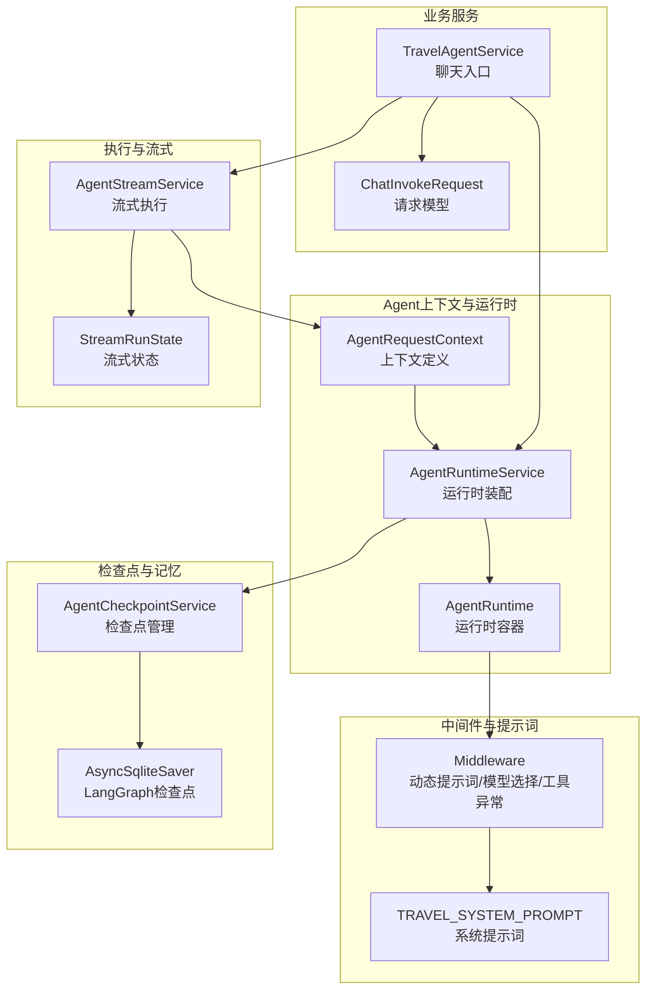
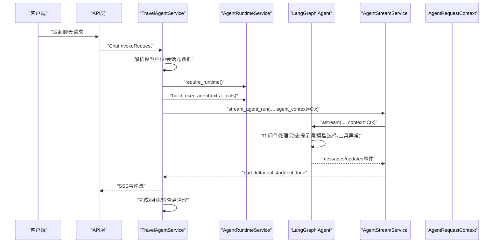
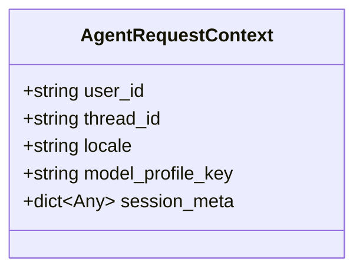
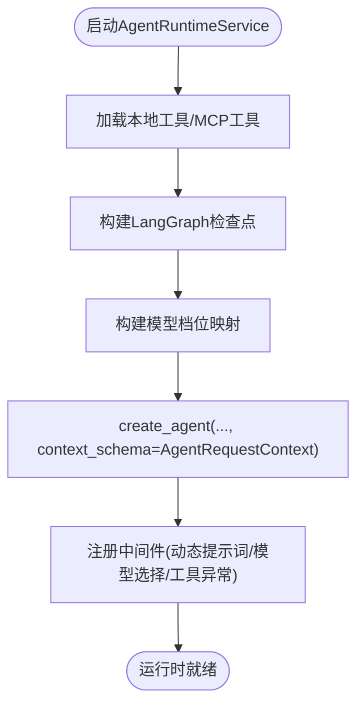
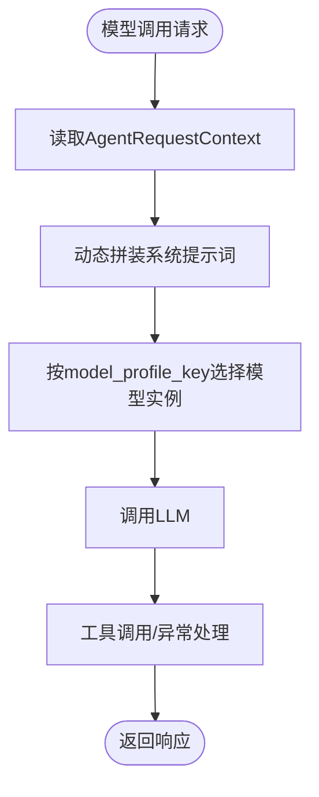
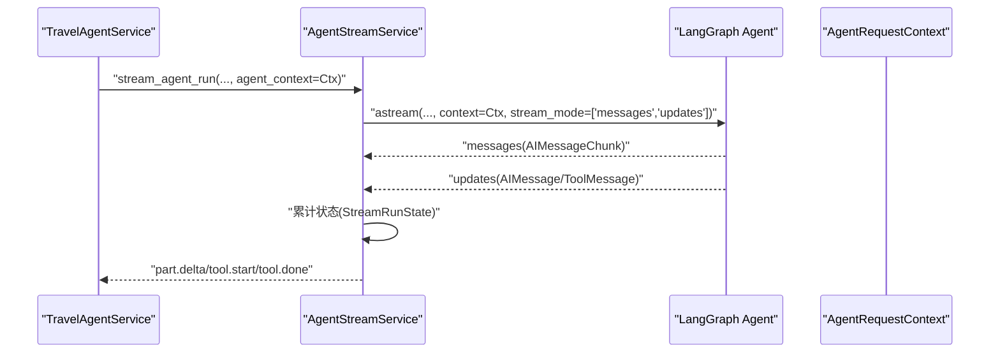
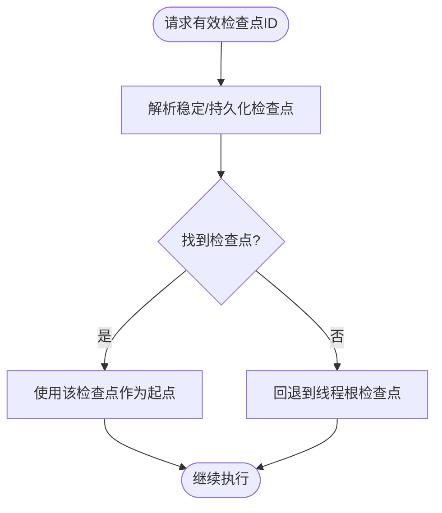
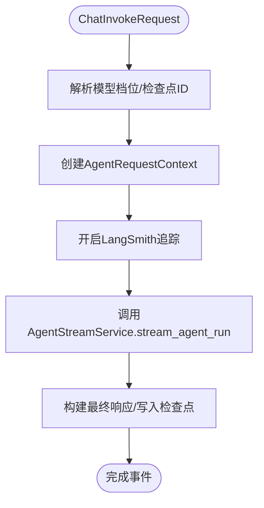
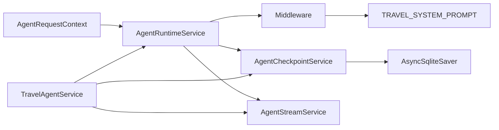

# Agent上下文管理

<cite>
**本文档引用的文件**
- [context.py](file://backend/app/agent/context.py)
- [runtime.py](file://backend/app/agent/runtime.py)
- [service.py](file://backend/app/agent/service.py)
- [middleware.py](file://backend/app/agent/middleware.py)
- [streaming.py](file://backend/app/agent/streaming.py)
- [checkpoints.py](file://backend/app/agent/checkpoints.py)
- [runtime.py](file://backend/app/memory/runtime.py)
- [chat.py](file://backend/app/schemas/chat.py)
- [system.py](file://backend/app/prompt/system.py)
</cite>

## 目录
1. [引言](#引言)
2. [项目结构](#项目结构)
3. [核心组件](#核心组件)
4. [架构总览](#架构总览)
5. [详细组件分析](#详细组件分析)
6. [依赖分析](#依赖分析)
7. [性能考量](#性能考量)
8. [故障排查指南](#故障排查指南)
9. [结论](#结论)
10. [附录](#附录)

## 引言
本文件系统性阐述旅行Agent的上下文管理机制，重点围绕AgentRequestContext的设计与实现，解释请求上下文的创建、传递与管理方式，以及其在Agent执行过程中的作用（状态传播、配置传递、资源管理）。同时，文档说明上下文与运行时服务、检查点服务、流式服务等组件的协作关系，并提供可追溯的代码示例路径，帮助读者快速定位实现细节。

## 项目结构
Agent上下文管理涉及以下关键模块：
- 上下文定义：AgentRequestContext
- 运行时装配：AgentRuntimeService、AgentRuntime
- 中间件：动态系统提示词、模型档位选择、工具异常边界
- 流式执行：AgentStreamService、StreamRunState
- 检查点：AgentCheckpointService
- 记忆组件：AsyncSqliteSaver（LangGraph检查点）
- 业务服务：TravelAgentService（入口门面）

**图表来源**
- [context.py:10-22](file://backend/app/agent/context.py#L10-L22)
- [runtime.py:61-174](file://backend/app/agent/runtime.py#L61-L174)
- [middleware.py:94-211](file://backend/app/agent/middleware.py#L94-L211)
- [streaming.py:74-229](file://backend/app/agent/streaming.py#L74-L229)
- [checkpoints.py:9-106](file://backend/app/agent/checkpoints.py#L9-L106)
- [runtime.py:11-22](file://backend/app/memory/runtime.py#L11-L22)
- [service.py:97-529](file://backend/app/agent/service.py#L97-L529)
- [chat.py:18-29](file://backend/app/schemas/chat.py#L18-L29)

**章节来源**
- [context.py:10-22](file://backend/app/agent/context.py#L10-L22)
- [runtime.py:61-174](file://backend/app/agent/runtime.py#L61-L174)
- [service.py:97-529](file://backend/app/agent/service.py#L97-L529)

## 核心组件
- AgentRequestContext：定义单轮Agent运行所需的上下文字段，包括用户ID、线程ID、语言环境、模型档位键、会话元数据。该上下文通过context_schema注入LangChain运行时，供中间件、工具及后续存储/拦截器使用。
- AgentRuntimeService：负责Agent运行时的装配、启动、关闭与状态快照；在启动时创建Agent实例并注册AgentRequestContext作为上下文模式。
- Middleware：提供动态系统提示词（基于运行时上下文注入当前时间、语言环境、会话元信息）、模型档位选择（根据上下文的model_profile_key动态切换模型实例）、工具异常边界（统一转为ToolMessage）。
- AgentStreamService：协调LangGraph的astream执行，将messages与updates两类事件分别处理，累计流式状态并产出前端可消费的事件流。
- AgentCheckpointService：管理稳定检查点的定位、缓存与回滚，配合LangGraph检查点实现会话状态恢复。
- AsyncSqliteSaver：LangGraph官方异步SQLite检查点实现，承载会话记忆。
- TravelAgentService：业务门面，负责聊天请求的入口处理、会话元数据透传、模型档位解析与流式事件的组装与产出。

**章节来源**
- [context.py:10-22](file://backend/app/agent/context.py#L10-L22)
- [runtime.py:61-174](file://backend/app/agent/runtime.py#L61-L174)
- [middleware.py:94-211](file://backend/app/agent/middleware.py#L94-L211)
- [streaming.py:74-229](file://backend/app/agent/streaming.py#L74-L229)
- [checkpoints.py:9-106](file://backend/app/agent/checkpoints.py#L9-L106)
- [runtime.py:11-22](file://backend/app/memory/runtime.py#L11-L22)
- [service.py:97-529](file://backend/app/agent/service.py#L97-L529)

## 架构总览
Agent上下文贯穿从请求进入、运行时装配、中间件处理、工具调用、流式输出到检查点落盘的全链路。下图展示了关键交互：

**图表来源**
- [service.py:373-507](file://backend/app/agent/service.py#L373-L507)
- [runtime.py:117-132](file://backend/app/agent/runtime.py#L117-L132)
- [streaming.py:80-148](file://backend/app/agent/streaming.py#L80-L148)
- [middleware.py:94-211](file://backend/app/agent/middleware.py#L94-L211)

## 详细组件分析

### AgentRequestContext设计与实现
- 字段定义
  - user_id：用户标识，用于权限隔离与审计
  - thread_id：线程/会话标识，用于LangGraph检查点与会话记忆
  - locale：语言环境，默认"zh-CN"
  - model_profile_key：模型档位键，默认"standard"
  - session_meta：会话元数据，支持业务侧扩展透传
- 注入机制：通过create_agent的context_schema参数将AgentRequestContext注册为运行时上下文模式，使中间件、工具与存储层可访问
- 作用范围：贯穿单轮Agent执行，作为动态提示词、模型选择、工具调用与UI呈现的输入源

**图表来源**
- [context.py:10-22](file://backend/app/agent/context.py#L10-L22)

**章节来源**
- [context.py:10-22](file://backend/app/agent/context.py#L10-L22)

### 运行时装配与上下文注入
- AgentRuntimeService在startup中创建Agent实例，设置context_schema为AgentRequestContext，并挂载中间件
- build_user_agent按需组合用户级工具，保持上下文schema一致
- 运行时容器AgentRuntime保存全局共享的MCP工具集、本地工具、检查点、模型档位映射等

**图表来源**
- [runtime.py:80-115](file://backend/app/agent/runtime.py#L80-L115)
- [runtime.py:117-132](file://backend/app/agent/runtime.py#L117-L132)

**章节来源**
- [runtime.py:61-174](file://backend/app/agent/runtime.py#L61-L174)

### 中间件与上下文协作
- 动态系统提示词：根据AgentRequestContext注入当前时间、语言环境、会话元信息，确保模型始终基于最新上下文生成响应
- 模型档位选择：在wrap_model_call阶段读取context.model_profile_key，动态替换为对应BaseChatModel实例，保证配置传递的确定性
- 工具异常边界：捕获工具执行异常并统一转换为ToolMessage，避免中断机制被吞没

**图表来源**
- [middleware.py:66-109](file://backend/app/agent/middleware.py#L66-L109)
- [middleware.py:133-191](file://backend/app/agent/middleware.py#L133-L191)
- [middleware.py:111-131](file://backend/app/agent/middleware.py#L111-L131)

**章节来源**
- [middleware.py:94-211](file://backend/app/agent/middleware.py#L94-L211)

### 流式执行与上下文传递
- AgentStreamService在stream_agent_run中通过executor.astream传入context=agent_context，确保messages与updates事件携带上下文
- messages事件仅消费AIMessageChunk，updates事件提取工具调用与返回，二者分离以避免事件竞争
- StreamRunState累计AIMessageChunk、工具轨迹、UI片段、引用来源等，支撑前端增量渲染与最终稳定态

**图表来源**
- [streaming.py:80-148](file://backend/app/agent/streaming.py#L80-L148)
- [service.py:425-443](file://backend/app/agent/service.py#L425-L443)

**章节来源**
- [streaming.py:74-229](file://backend/app/agent/streaming.py#L74-L229)

### 检查点服务与上下文一致性
- AgentCheckpointService负责稳定检查点的定位、缓存与回滚，确保会话状态可恢复
- 通过LangGraph AsyncSqliteSaver实现持久化，结合thread_id与checkpoint_id实现线程隔离
- 在回滚与清理阶段，确保检查点之后的半成品数据被修剪，维持一致性

**图表来源**
- [checkpoints.py:32-43](file://backend/app/agent/checkpoints.py#L32-L43)
- [runtime.py:11-22](file://backend/app/memory/runtime.py#L11-L22)

**章节来源**
- [checkpoints.py:9-106](file://backend/app/agent/checkpoints.py#L9-L106)

### 业务服务中的上下文使用
- TravelAgentService在stream_invoke与stream_regenerate中创建AgentRequestContext，填充user_id、thread_id、locale、model_profile_key、session_meta
- 通过langsmith_trace_context记录trace元数据，便于排障
- 在异常场景中，记录失败日志、取消语音生成、回滚线程并产出停止/失败事件

**图表来源**
- [service.py:373-507](file://backend/app/agent/service.py#L373-L507)
- [chat.py:18-29](file://backend/app/schemas/chat.py#L18-L29)

**章节来源**
- [service.py:97-529](file://backend/app/agent/service.py#L97-L529)

## 依赖分析
- 组件耦合
  - AgentRuntimeService依赖LangGraph Agent、LangChain中间件、LangGraph检查点
  - AgentStreamService依赖AgentRuntimeService与AgentRequestContext
  - AgentCheckpointService依赖LangGraph检查点与数据库存储
  - TravelAgentService聚合运行时、流式、检查点、语音服务
- 关键依赖链
  - 上下文定义 → 运行时装配 → 中间件处理 → 流式执行 → 检查点落盘
- 外部依赖
  - LangGraph（异步检查点、流式事件）
  - LangChain（中间件、消息类型）
  - Pydantic（上下文与请求模型）

**图表来源**
- [runtime.py:61-174](file://backend/app/agent/runtime.py#L61-L174)
- [middleware.py:94-211](file://backend/app/agent/middleware.py#L94-L211)
- [streaming.py:74-229](file://backend/app/agent/streaming.py#L74-L229)
- [checkpoints.py:9-106](file://backend/app/agent/checkpoints.py#L9-L106)
- [runtime.py:11-22](file://backend/app/memory/runtime.py#L11-L22)
- [service.py:97-529](file://backend/app/agent/service.py#L97-L529)

**章节来源**
- [runtime.py:61-174](file://backend/app/agent/runtime.py#L61-L174)
- [middleware.py:94-211](file://backend/app/agent/middleware.py#L94-L211)
- [streaming.py:74-229](file://backend/app/agent/streaming.py#L74-L229)
- [checkpoints.py:9-106](file://backend/app/agent/checkpoints.py#L9-L106)
- [runtime.py:11-22](file://backend/app/memory/runtime.py#L11-L22)
- [service.py:97-529](file://backend/app/agent/service.py#L97-L529)

## 性能考量
- 上下文字段精简：仅包含必要字段，减少序列化与传输开销
- 中间件链路短：动态提示词与模型选择在请求末尾执行，避免wrap副作用
- 流式事件分离：messages与updates分离，降低事件竞争与重复处理成本
- 检查点修剪：回滚后清理半成品检查点，避免数据库膨胀
- 异步执行：LangGraph与SQLite检查点均采用异步实现，提升并发能力

[本节为通用性能讨论，无需特定文件来源]

## 故障排查指南
- 上下文字段缺失
  - 现象：动态提示词未注入语言环境或会话元信息
  - 排查：确认AgentRequestContext是否正确传入astream
  - 参考路径：[streaming.py:80-148](file://backend/app/agent/streaming.py#L80-L148)
- 模型档位不生效
  - 现象：请求未按预期切换模型实例
  - 排查：检查AgentRequestContext.model_profile_key与中间件映射
  - 参考路径：[middleware.py:133-191](file://backend/app/agent/middleware.py#L133-L191)
- 工具异常未被捕获
  - 现象：工具异常导致GraphInterrupt失效
  - 排查：确认tool_error_boundary是否正确包裹工具调用
  - 参考路径：[middleware.py:111-131](file://backend/app/agent/middleware.py#L111-L131)
- 会话记忆未恢复
  - 现象：重启后无法从上次位置继续
  - 排查：检查检查点ID与LangGraph检查点一致性
  - 参考路径：[checkpoints.py:32-43](file://backend/app/agent/checkpoints.py#L32-L43)
- 事件重复或丢失
  - 现象：前端收到重复tool.start或缺少状态变更
  - 排查：确认messages与updates事件分离策略与去重逻辑
  - 参考路径：[streaming.py:125-148](file://backend/app/agent/streaming.py#L125-L148)

**章节来源**
- [middleware.py:111-131](file://backend/app/agent/middleware.py#L111-L131)
- [middleware.py:133-191](file://backend/app/agent/middleware.py#L133-L191)
- [streaming.py:125-148](file://backend/app/agent/streaming.py#L125-L148)
- [checkpoints.py:32-43](file://backend/app/agent/checkpoints.py#L32-L43)

## 结论
AgentRequestContext作为旅行Agent运行时的统一上下文载体，贯穿从请求进入、运行时装配、中间件处理、工具调用到流式输出与检查点落盘的全链路。通过明确的字段定义、严格的中间件协作与完善的流式事件处理，系统实现了状态传播、配置传递与资源管理的协同。结合检查点修剪与异步执行，整体具备良好的可恢复性与性能表现。建议在实际使用中严格遵循上下文创建与传递规范，确保各组件间的一致性与可观测性。

[本节为总结性内容，无需特定文件来源]

## 附录

### 代码示例路径索引
- 创建AgentRequestContext并传入流式执行
  - [service.py:431-437](file://backend/app/agent/service.py#L431-L437)
  - [service.py:317-321](file://backend/app/agent/service.py#L317-L321)
- 运行时装配与上下文注入
  - [runtime.py:94-104](file://backend/app/agent/runtime.py#L94-L104)
  - [runtime.py:122-132](file://backend/app/agent/runtime.py#L122-L132)
- 中间件动态提示词与模型选择
  - [middleware.py:66-109](file://backend/app/agent/middleware.py#L66-L109)
  - [middleware.py:172-191](file://backend/app/agent/middleware.py#L172-L191)
- 流式事件处理与状态累计
  - [streaming.py:151-229](file://backend/app/agent/streaming.py#L151-L229)
- 检查点定位与回滚
  - [checkpoints.py:32-43](file://backend/app/agent/checkpoints.py#L32-L43)
  - [checkpoints.py:23-31](file://backend/app/agent/checkpoints.py#L23-L31)

**章节来源**
- [service.py:317-321](file://backend/app/agent/service.py#L317-L321)
- [service.py:431-437](file://backend/app/agent/service.py#L431-L437)
- [runtime.py:94-104](file://backend/app/agent/runtime.py#L94-L104)
- [runtime.py:122-132](file://backend/app/agent/runtime.py#L122-L132)
- [middleware.py:66-109](file://backend/app/agent/middleware.py#L66-L109)
- [middleware.py:172-191](file://backend/app/agent/middleware.py#L172-L191)
- [streaming.py:151-229](file://backend/app/agent/streaming.py#L151-L229)
- [checkpoints.py:32-43](file://backend/app/agent/checkpoints.py#L32-L43)
- [checkpoints.py:23-31](file://backend/app/agent/checkpoints.py#L23-L31)