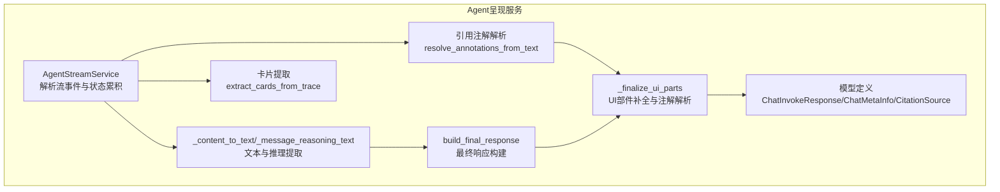
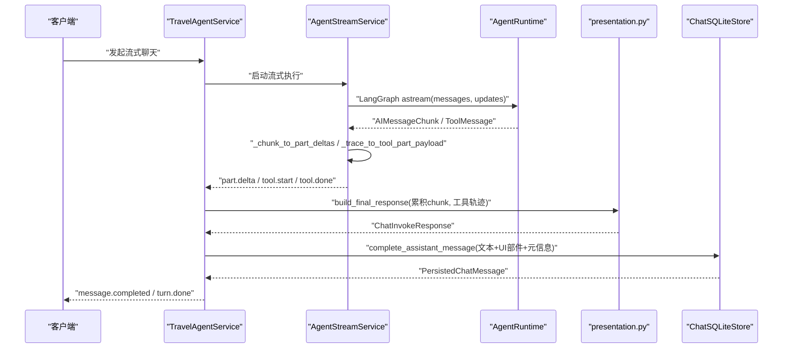
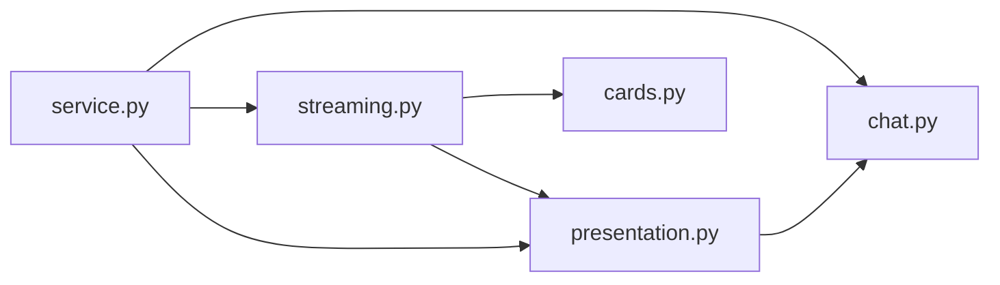

# Agent呈现服务

<cite>
**本文引用的文件**
- [presentation.py](file://backend/app/agent/presentation.py)
- [streaming.py](file://backend/app/agent/streaming.py)
- [service.py](file://backend/app/agent/service.py)
- [chat.py](file://backend/app/schemas/chat.py)
- [cards.py](file://backend/app/agent/cards.py)
- [test_citations.py](file://backend/tests/test_citations.py)
</cite>

## 目录
1. [简介](#简介)
2. [项目结构](#项目结构)
3. [核心组件](#核心组件)
4. [架构总览](#架构总览)
5. [详细组件分析](#详细组件分析)
6. [依赖分析](#依赖分析)
7. [性能考虑](#性能考虑)
8. [故障排查指南](#故障排查指南)
9. [结论](#结论)
10. [附录](#附录)

## 简介
本文件面向“Agent呈现服务”，系统性阐述聊天消息的文本转换、引用注解解析与最终响应构建的全流程实现。重点包括：
- _content_to_text 函数：统一将消息内容归一化为字符串，覆盖不同消息类型与结构。
- _message_reasoning_text 与 _reasoning_blocks_to_text：从 AIMessage/Chunk 中提取“思考”文本。
- build_final_response：构建 ChatInvokeResponse，整合工具轨迹、推理文本与元信息。
- 引用注解解析：从工具返回中抽取来源，解析文本中的 [src-N] 标记，生成带索引的注解。
- UI 部件补全：在最终阶段补齐 text/reasoning 部件，解析注解并注入 annotations。

## 项目结构
Agent呈现服务位于后端应用的 agent 子模块，围绕“流式执行—状态累积—最终呈现—持久化”的流水线组织：
- streaming.py：负责 LangGraph 流事件的解析、状态累积与 UI 部件生成。
- presentation.py：负责最终响应构建与文本/推理内容提取。
- service.py：服务门面，编排流式执行、最终呈现与持久化。
- chat.py：聊天领域模型，定义 ChatInvokeResponse、ChatMetaInfo、CitationSource 等。
- cards.py：通用卡片提取辅助，用于从工具轨迹中抽取结构化卡片。

图表来源
- [streaming.py:74-229](file://backend/app/agent/streaming.py#L74-L229)
- [presentation.py:17-36](file://backend/app/agent/presentation.py#L17-L36)
- [service.py:48-94](file://backend/app/agent/service.py#L48-L94)
- [chat.py:31-137](file://backend/app/schemas/chat.py#L31-L137)
- [cards.py:35-102](file://backend/app/agent/cards.py#L35-L102)

章节来源
- [streaming.py:1-680](file://backend/app/agent/streaming.py#L1-L680)
- [presentation.py:1-118](file://backend/app/agent/presentation.py#L1-L118)
- [service.py:1-529](file://backend/app/agent/service.py#L1-L529)
- [chat.py:1-274](file://backend/app/schemas/chat.py#L1-L274)
- [cards.py:35-102](file://backend/app/agent/cards.py#L35-L102)

## 核心组件
- 文本与推理提取
  - _content_to_text：将 AIMessage/Chunk 的 content 统一转为字符串，过滤 reasoning/reasoning_content 块，保留 text 块与其他可序列化内容。
  - _message_reasoning_text 与 _reasoning_blocks_to_text：从 additional_kwargs 或 content 的块中提取 reasoning 文本。
- 最终响应构建
  - build_final_response：从累积的 AIMessageChunk 与工具轨迹构建 ChatInvokeResponse，填充推理文本、工具轨迹与元信息。
- UI 部件补全与注解解析
  - _finalize_ui_parts：在最终阶段补齐 text/reasoning 部件，解析文本中的 [src-N] 标记并注入 annotations。
  - resolve_annotations_from_text：扫描文本中的 [src-N]，映射到 sources，生成带索引的注解。
- 引用来源抽取
  - _extract_citation_sources_from_trace：从工具返回 payload 中抽取 URL/标题，支持 results 数组与直接数组两种结构。
- 卡片提取
  - extract_cards_from_trace：从工具轨迹中抽取结构化卡片，供 UI 渲染。

章节来源
- [presentation.py:17-118](file://backend/app/agent/presentation.py#L17-L118)
- [streaming.py:502-680](file://backend/app/agent/streaming.py#L502-L680)
- [service.py:48-94](file://backend/app/agent/service.py#L48-L94)
- [chat.py:31-137](file://backend/app/schemas/chat.py#L31-L137)
- [cards.py:35-102](file://backend/app/agent/cards.py#L35-L102)

## 架构总览
下图展示了从流式执行到最终呈现的关键交互：

图表来源
- [service.py:373-507](file://backend/app/agent/service.py#L373-L507)
- [streaming.py:80-229](file://backend/app/agent/streaming.py#L80-L229)
- [presentation.py:17-36](file://backend/app/agent/presentation.py#L17-L36)

## 详细组件分析

### 文本转换：_content_to_text
职责与行为
- 输入：AIMessage/Chunk 的 content（可能为 str、list 或其他类型）。
- 输出：统一的字符串，按以下规则处理：
  - 字符串：直接返回。
  - 列表：遍历元素，仅保留 type 为 "text" 的块；跳过 "reasoning"/"reasoning_content" 块；其他元素转为字符串并以换行连接。
  - None：返回空字符串。
  - 其他类型：转为字符串。

复杂度与优化
- 时间复杂度：O(N)，N 为 content 中元素数量。
- 空字符串快速路径：避免多余 join。
- 过滤 reasoning 块：保证最终文本不含推理内容，避免与 UI reasoning 部件重复。

章节来源
- [presentation.py:91-111](file://backend/app/agent/presentation.py#L91-L111)
- [streaming.py:173-175](file://backend/app/agent/streaming.py#L173-L175)

### 推理文本提取：_message_reasoning_text 与 _reasoning_blocks_to_text
职责与行为
- _message_reasoning_text：优先从 additional_kwargs 获取 reasoning_content；否则从 content 的块中提取。
- _reasoning_blocks_to_text：从 content 列表中筛选 type 为 "reasoning" 或 "reasoning_content" 的块，拼接其中的 reasoning、summary_text、reasoning_content 与 text 字段。

复杂度与优化
- 时间复杂度：O(M)，M 为 content 列表长度。
- 类型与键名校验：严格判断 type 与键存在性，避免误判。
- summary_text 专项处理：支持嵌套结构中的 summary_text。

章节来源
- [presentation.py:39-88](file://backend/app/agent/presentation.py#L39-L88)
- [streaming.py:502-523](file://backend/app/agent/streaming.py#L502-L523)

### 最终响应构建：build_final_response
职责与行为
- 输入：累积的 AIMessageChunk、流式工具轨迹、AgentRuntime。
- 输出：ChatInvokeResponse，包含：
  - assistant_message：通过 _content_to_text 从累积 chunk 提取的文本。
  - meta：ChatMetaInfo，包含：
    - tool_traces：工具轨迹列表。
    - reasoning_text：推理文本（若存在）。
    - reasoning_state：completed（若存在推理文本）。
    - mcp_connected_servers / mcp_errors：来自 runtime 的 MCP 服务器状态。

错误处理
- 空累积 chunk：assistant_message 为空字符串。
- 缺失推理文本：reasoning_text 为 None，reasoning_state 不设置。

章节来源
- [presentation.py:17-36](file://backend/app/agent/presentation.py#L17-L36)
- [chat.py:41-49](file://backend/app/schemas/chat.py#L41-L49)

### UI 部件补全与注解解析：_finalize_ui_parts
职责与行为
- 若 parts 为空：按需生成 reasoning/text 部件；text 部件解析注解。
- 若 parts 非空：将 text/reasoning 部件标记为 completed，并为 text 部件解析注解。
- 若最终文本存在但无 text 部件：自动补充一个 text 部件并解析注解。

注解解析
- 调用 resolve_annotations_from_text，扫描文本中的 [src-N]，映射到 sources，生成带索引的注解。

章节来源
- [service.py:48-94](file://backend/app/agent/service.py#L48-L94)
- [streaming.py:659-679](file://backend/app/agent/streaming.py#L659-L679)

### 引用注解解析：resolve_annotations_from_text
职责与行为
- 正则匹配 [src-N]，N 为 1-indexed 的来源序号。
- 校验 N 范围：1 <= N <= len(sources)，越界则忽略。
- 生成带 start_index/end_index/cited_text 的 CitationSource 注解。

复杂度与优化
- 时间复杂度：O(T)，T 为文本长度。
- 正则迭代：线性扫描文本，高效定位标记。

章节来源
- [streaming.py:659-679](file://backend/app/agent/streaming.py#L659-L679)
- [test_citations.py:147-199](file://backend/tests/test_citations.py#L147-L199)

### 引用来源抽取：_extract_citation_sources_from_trace
职责与行为
- 支持两种 payload 形状：
  - 形状 A：dict 含 "results" 数组（如 Exa 搜索等），遍历 results 中的 dict。
  - 形状 B：直接为 list[dict]（如酒店列表、POI 列表）。
- 从每个 dict 中按优先级字段抽取 URL/标题：
  - URL 字段优先级：bookingUrl > booking_url > url > link > href > sourceUrl > source_url。
  - 标题字段优先级：title > name > hotelName > hotel_name > displayName > display_name。
- 无 URL 则视为不可引用，丢弃。

复杂度与优化
- 时间复杂度：O(R)，R 为 results 或列表长度。
- 字段优先级表：新增领域只需扩展字段表，无需修改提取逻辑。

章节来源
- [streaming.py:611-657](file://backend/app/agent/streaming.py#L611-L657)
- [test_citations.py:16-145](file://backend/tests/test_citations.py#L16-L145)

### 工具轨迹到 UI 部件：_trace_to_tool_part_payload
职责与行为
- called 阶段：创建 ChatToolPart（status=running），写入 tool_name 与 input。
- returned 阶段：查找已有 ChatToolPart，写入 output、status、sources、cards。
- 去重：基于 tool_call_id，避免重复创建。

章节来源
- [streaming.py:435-500](file://backend/app/agent/streaming.py#L435-L500)

### 卡片提取：extract_cards_from_trace
职责与行为
- 从工具轨迹中抽取结构化卡片，供 UI 渲染。
- 支持 JSON 文本块解包，兼容 MCP 返回的文本包裹结构。

章节来源
- [cards.py:35-102](file://backend/app/agent/cards.py#L35-L102)

## 依赖分析
- 组件耦合
  - streaming.py 依赖 presentation.py 的 _content_to_text 与 _tool_message_payload。
  - service.py 依赖 streaming.py 的 resolve_annotations_from_text 与 _finalize_ui_parts。
  - presentation.py 与 chat.py 通过 ChatInvokeResponse/ChatMetaInfo/CitationSource 等模型强耦合。
- 外部依赖
  - LangGraph 流事件（messages/updates）。
  - LangChain 消息类型（AIMessage/Chunk、ToolMessage）。
  - Pydantic 模型用于序列化与校验。

图表来源
- [streaming.py:42-55](file://backend/app/agent/streaming.py#L42-L55)
- [presentation.py:7-14](file://backend/app/agent/presentation.py#L7-L14)
- [service.py:15-43](file://backend/app/agent/service.py#L15-L43)
- [chat.py:31-137](file://backend/app/schemas/chat.py#L31-L137)
- [cards.py:35-102](file://backend/app/agent/cards.py#L35-L102)

章节来源
- [streaming.py:1-680](file://backend/app/agent/streaming.py#L1-L680)
- [presentation.py:1-118](file://backend/app/agent/presentation.py#L1-L118)
- [service.py:1-529](file://backend/app/agent/service.py#L1-L529)
- [chat.py:1-274](file://backend/app/schemas/chat.py#L1-L274)
- [cards.py:35-102](file://backend/app/agent/cards.py#L35-L102)

## 性能考虑
- 文本与推理提取
  - _content_to_text 与 _message_reasoning_text 采用线性扫描，避免不必要的中间对象创建。
  - 对空输入与空列表进行快速返回，减少开销。
- 注解解析
  - 正则匹配 O(T)，建议在文本较大时谨慎使用；可考虑分段处理或延迟解析。
- 工具轨迹
  - 去重集合（seen_called/seen_returned）避免重复事件处理，提升稳定性。
- 序列化
  - 仅在诊断日志中进行原生对象序列化，生产路径依赖 Pydantic 模型 dump。

## 故障排查指南
常见问题与定位
- 最终文本为空
  - 检查累积的 AIMessageChunk 是否为空，确认 messages 事件是否正确传递。
  - 参考：[streaming.py:165-175](file://backend/app/agent/streaming.py#L165-L175)
- 推理文本缺失
  - 确认 additional_kwargs 中是否存在 reasoning_content，或 content 中是否存在 "reasoning"/"reasoning_content" 块。
  - 参考：[_message_reasoning_text:79-88](file://backend/app/agent/presentation.py#L79-L88)
- 注解未显示
  - 确认 sources 是否正确抽取，文本中 [src-N] 的 N 是否在有效范围内。
  - 参考：[_extract_citation_sources_from_trace:611-657](file://backend/app/agent/streaming.py#L611-L657)、[resolve_annotations_from_text:659-679](file://backend/app/agent/streaming.py#L659-L679)
- 工具返回未生成卡片
  - 检查工具返回 payload 是否符合预期形状，或是否被 extract_cards_from_trace 正确识别。
  - 参考：[cards.py:35-102](file://backend/app/agent/cards.py#L35-L102)

章节来源
- [presentation.py:79-118](file://backend/app/agent/presentation.py#L79-L118)
- [streaming.py:611-680](file://backend/app/agent/streaming.py#L611-L680)
- [service.py:48-94](file://backend/app/agent/service.py#L48-L94)
- [cards.py:35-102](file://backend/app/agent/cards.py#L35-L102)

## 结论
Agent呈现服务通过清晰的职责划分与稳健的数据模型，实现了从流式事件到最终 UI 展示的完整闭环：
- 文本与推理提取确保最终文本纯净、推理独立。
- 工具轨迹与来源抽取提供可追溯的元信息与引用。
- 注解解析与 UI 部件补全保障用户看到正确的标注与渲染。
- 通过测试用例与正则/字段优先级策略，系统具备良好的可扩展性与健壮性。

## 附录

### 代码示例路径（不展示具体代码）
- 处理不同类型的消息部分
  - [streaming.py:332-368](file://backend/app/agent/streaming.py#L332-L368)：text/reasoning 增量转换
  - [streaming.py:405-433](file://backend/app/agent/streaming.py#L405-L433)：text-like 部件追加与收尾
- 解析引用注解
  - [streaming.py:611-657](file://backend/app/agent/streaming.py#L611-L657)：从工具轨迹抽取来源
  - [streaming.py:659-679](file://backend/app/agent/streaming.py#L659-L679)：从文本解析 [src-N]
  - [test_citations.py:16-145](file://backend/tests/test_citations.py#L16-L145)：多种 payload 形状测试
  - [test_citations.py:147-199](file://backend/tests/test_citations.py#L147-L199)：注解解析测试
- 构建最终响应
  - [presentation.py:17-36](file://backend/app/agent/presentation.py#L17-L36)：build_final_response
  - [service.py:48-94](file://backend/app/agent/service.py#L48-L94)：_finalize_ui_parts
  - [chat.py:41-137](file://backend/app/schemas/chat.py#L41-L137)：ChatInvokeResponse/ChatMetaInfo/CitationSource