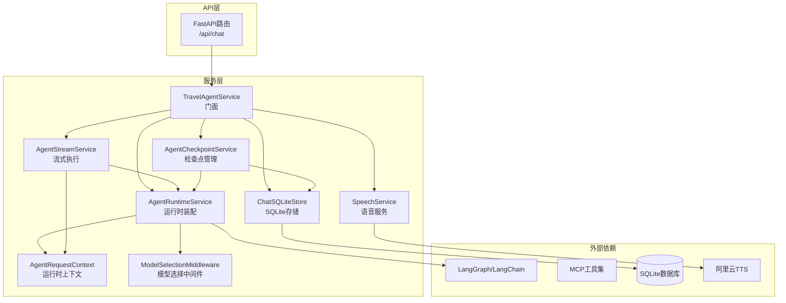
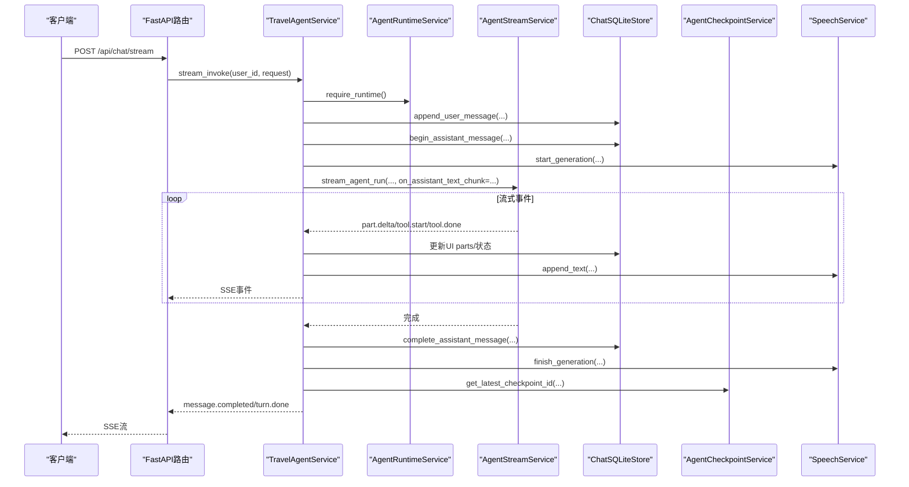
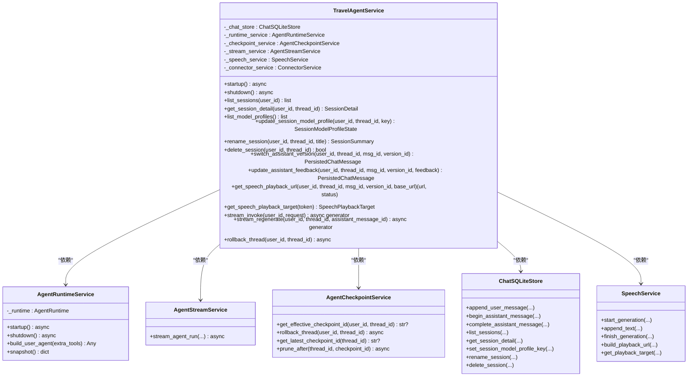
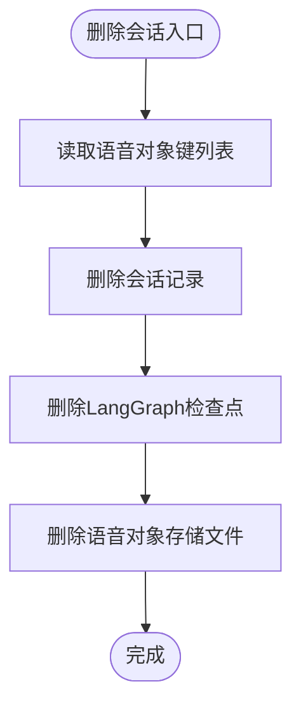
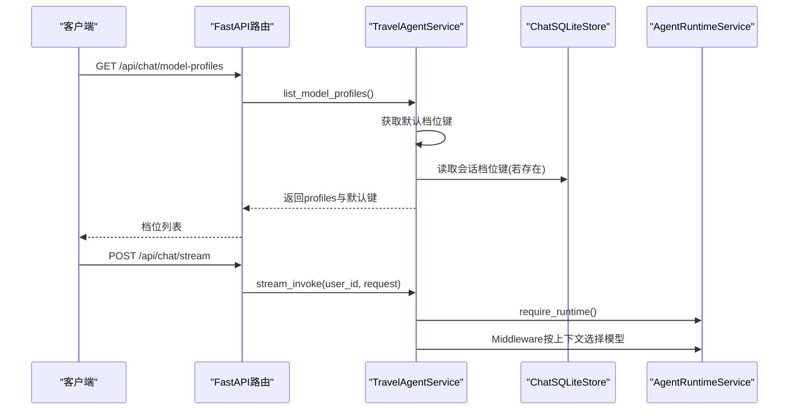
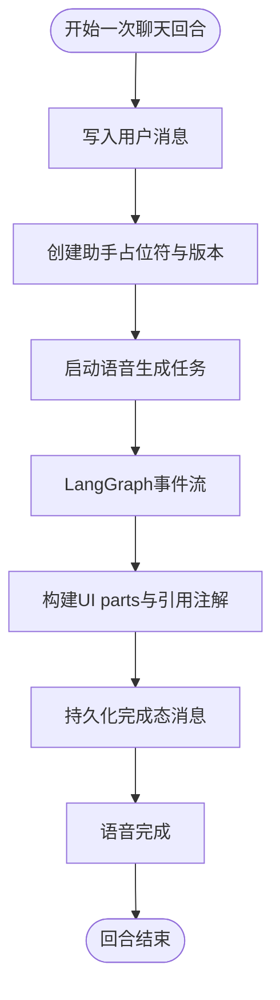
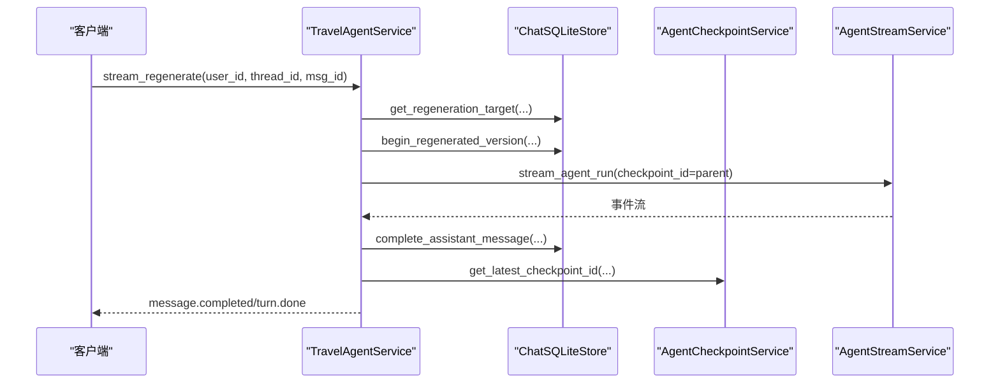
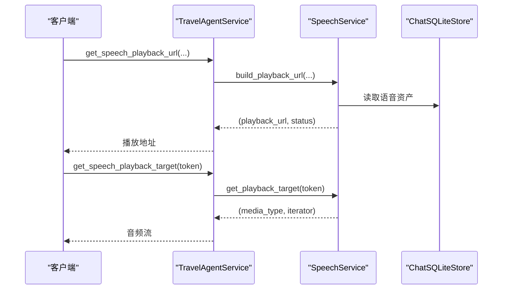
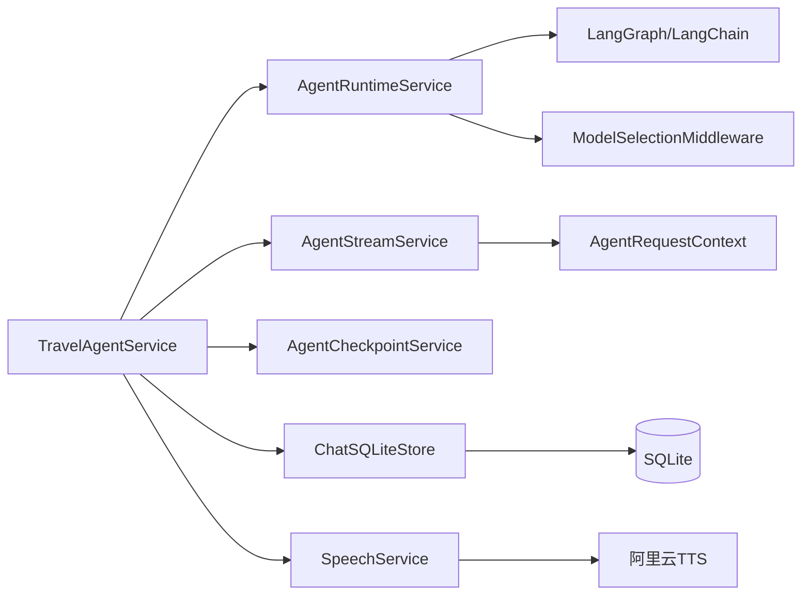

# Agent服务层

<cite>
**本文档引用的文件**
- [service.py](file://backend/app/agent/service.py)
- [runtime.py](file://backend/app/agent/runtime.py)
- [context.py](file://backend/app/agent/context.py)
- [presentation.py](file://backend/app/agent/presentation.py)
- [streaming.py](file://backend/app/agent/streaming.py)
- [checkpoints.py](file://backend/app/agent/checkpoints.py)
- [sqlite_store.py](file://backend/app/memory/sqlite_store.py)
- [chat.py](file://backend/app/api/chat.py)
- [middleware.py](file://backend/app/agent/middleware.py)
- [speech_service.py](file://backend/app/speech/service.py)
- [connectors_service.py](file://backend/app/connectors/service.py)
- [main.py](file://backend/app/main.py)
- [test_agent_service.py](file://backend/tests/test_agent_service.py)
</cite>

## 目录
1. [简介](#简介)
2. [项目结构](#项目结构)
3. [核心组件](#核心组件)
4. [架构总览](#架构总览)
5. [详细组件分析](#详细组件分析)
6. [依赖分析](#依赖分析)
7. [性能考虑](#性能考虑)
8. [故障排查指南](#故障排查指南)
9. [结论](#结论)
10. [附录](#附录)

## 简介
本文件面向使用者与开发者，系统化梳理旅行Agent服务层的设计与实现，重点围绕以下目标：
- 门面模式的实现原理与职责边界
- 组件依赖关系与初始化流程
- 会话管理：列表、详情、重命名、删除
- 模型档位管理：列表、切换、默认档位
- 消息管理：用户消息添加、助手消息占位符、消息完成处理、版本控制
- 错误处理策略与性能优化建议
- 提供可操作的使用示例与最佳实践

## 项目结构
Agent服务层位于后端应用的agent子包中，采用“门面+分层”的组织方式：
- 顶层门面：TravelAgentService，聚合运行时、存储、流式、语音等子服务
- 运行时装配：AgentRuntimeService，负责LangGraph Agent的构建与生命周期
- 流式执行：AgentStreamService，协调LangGraph事件流并转换为UI增量
- 持久化：ChatSQLiteStore，封装SQLite存储与Schema
- 检查点：AgentCheckpointService，管理LangGraph检查点与回滚
- 语音：SpeechService，负责TTS生成、持久化与播放
- 中间件：ModelSelectionMiddleware，按档位动态选择LLM实例
- API层：通过FastAPI路由将服务暴露为SSE流式接口

图表来源
- [service.py:97-128](file://backend/app/agent/service.py#L97-L128)
- [runtime.py:61-115](file://backend/app/agent/runtime.py#L61-L115)
- [streaming.py:74-118](file://backend/app/agent/streaming.py#L74-L118)
- [checkpoints.py:9-47](file://backend/app/agent/checkpoints.py#L9-L47)
- [sqlite_store.py:123-136](file://backend/app/memory/sqlite_store.py#L123-L136)
- [speech_service.py:90-126](file://backend/app/speech/service.py#L90-L126)
- [middleware.py:133-210](file://backend/app/agent/middleware.py#L133-L210)

章节来源
- [service.py:97-128](file://backend/app/agent/service.py#L97-L128)
- [runtime.py:61-115](file://backend/app/agent/runtime.py#L61-L115)
- [streaming.py:74-118](file://backend/app/agent/streaming.py#L74-L118)
- [checkpoints.py:9-47](file://backend/app/agent/checkpoints.py#L9-L47)
- [sqlite_store.py:123-136](file://backend/app/memory/sqlite_store.py#L123-L136)
- [speech_service.py:90-126](file://backend/app/speech/service.py#L90-L126)
- [middleware.py:133-210](file://backend/app/agent/middleware.py#L133-L210)

## 核心组件
- TravelAgentService：旅行Agent业务门面，统一调度运行时、存储、流式、检查点与语音服务，提供会话、模型档位、消息与版本管理的高层API。
- AgentRuntimeService：负责LangGraph Agent的装配、模型档位映射、中间件挂载与生命周期管理。
- AgentStreamService：将LangGraph的messages/updates事件流转换为前端可消费的增量事件（text/reasoning/tool）。
- AgentCheckpointService：管理LangGraph检查点，支持有效检查点解析、回滚与清理。
- ChatSQLiteStore：封装SQLite存储，提供会话、消息、版本、语音资产等CRUD与查询。
- SpeechService：语音生成、持久化与播放，支持播放令牌签发与生成状态跟踪。
- AgentRequestContext：运行时上下文，承载用户ID、线程ID、语言环境、模型档位与会话元信息。
- ModelSelectionMiddleware：按运行时上下文动态选择LLM实例，实现模型档位切换。

章节来源
- [service.py:97-128](file://backend/app/agent/service.py#L97-L128)
- [runtime.py:61-115](file://backend/app/agent/runtime.py#L61-L115)
- [streaming.py:74-118](file://backend/app/agent/streaming.py#L74-L118)
- [checkpoints.py:9-47](file://backend/app/agent/checkpoints.py#L9-L47)
- [sqlite_store.py:123-136](file://backend/app/memory/sqlite_store.py#L123-L136)
- [speech_service.py:90-126](file://backend/app/speech/service.py#L90-L126)
- [context.py:10-22](file://backend/app/agent/context.py#L10-L22)
- [middleware.py:133-210](file://backend/app/agent/middleware.py#L133-L210)

## 架构总览
TravelAgentService作为门面，将复杂子系统整合为统一接口：
- 初始化：startup时装配AgentRuntime，建立LangGraph Agent与工具集，挂载中间件。
- 会话管理：通过ChatSQLiteStore提供会话列表、详情、重命名、删除与模型档位绑定。
- 消息管理：用户消息写入、助手占位符创建、流式增量推送、最终完成态持久化。
- 版本控制：每条助手消息支持多版本（原始/重生成），支持版本切换与反馈。
- 检查点：LangGraph检查点用于回滚与增量恢复，避免重复计算。
- 语音：与TTS服务集成，边流式生成边持久化，支持播放令牌与并发读取。

图表来源
- [chat.py:41-71](file://backend/app/api/chat.py#L41-L71)
- [service.py:373-507](file://backend/app/agent/service.py#L373-L507)
- [streaming.py:80-147](file://backend/app/agent/streaming.py#L80-L147)
- [sqlite_store.py:224-278](file://backend/app/memory/sqlite_store.py#L224-L278)
- [speech_service.py:145-224](file://backend/app/speech/service.py#L145-L224)
- [checkpoints.py:49-60](file://backend/app/agent/checkpoints.py#L49-L60)

## 详细组件分析

### TravelAgentService门面与初始化
- 依赖注入：构造函数接收MCP配置路径、SQLite数据库路径与可选的ConnectorService，内部装配运行时、检查点、流式与语音服务。
- 生命周期：startup负责初始化AgentRuntime；shutdown负责关闭语音与运行时资源。
- 门面职责：会话管理、模型档位管理、消息流式处理、版本切换与回滚、语音播放等。

图表来源
- [service.py:97-128](file://backend/app/agent/service.py#L97-L128)
- [runtime.py:61-115](file://backend/app/agent/runtime.py#L61-L115)
- [streaming.py:74-80](file://backend/app/agent/streaming.py#L74-L80)
- [checkpoints.py:9-21](file://backend/app/agent/checkpoints.py#L9-L21)
- [sqlite_store.py:123-136](file://backend/app/memory/sqlite_store.py#L123-L136)
- [speech_service.py:90-126](file://backend/app/speech/service.py#L90-L126)

章节来源
- [service.py:97-128](file://backend/app/agent/service.py#L97-L128)
- [runtime.py:61-115](file://backend/app/agent/runtime.py#L61-L115)

### 会话管理
- 会话列表查询：基于ChatSQLiteStore按用户ID与更新时间倒序返回会话摘要。
- 会话详情获取：读取会话及历史消息，解析版本与语音状态，统一返回SessionDetail。
- 会话重命名：更新会话标题与自定义标志位，刷新更新时间与预览。
- 会话删除：删除会话记录、LangGraph检查点、语音资产，并清理对象存储文件。

图表来源
- [service.py:168-176](file://backend/app/agent/service.py#L168-L176)
- [sqlite_store.py:771-779](file://backend/app/memory/sqlite_store.py#L771-L779)
- [checkpoints.py:16-21](file://backend/app/agent/checkpoints.py#L16-L21)
- [speech_service.py:140-143](file://backend/app/speech/service.py#L140-L143)

章节来源
- [service.py:129-167](file://backend/app/agent/service.py#L129-L167)
- [sqlite_store.py:593-779](file://backend/app/memory/sqlite_store.py#L593-L779)
- [service.py:168-176](file://backend/app/agent/service.py#L168-L176)

### 模型档位管理
- 档位列表：读取默认档位键，构建前端可见的ChatModelProfile列表，标注是否默认。
- 档位切换：解析请求档位键，写入会话绑定的模型档位键；返回当前线程的档位状态。
- 默认档位：运行时通过Middleware按上下文动态选择模型实例，实现“按线程/请求”切换。

图表来源
- [service.py:141-162](file://backend/app/agent/service.py#L141-L162)
- [middleware.py:133-210](file://backend/app/agent/middleware.py#L133-L210)
- [chat.py:31-38](file://backend/app/api/chat.py#L31-L38)

章节来源
- [service.py:141-162](file://backend/app/agent/service.py#L141-L162)
- [middleware.py:133-210](file://backend/app/agent/middleware.py#L133-L210)
- [chat.py:31-38](file://backend/app/api/chat.py#L31-L38)

### 消息管理与版本控制
- 用户消息添加：写入用户消息并创建会话（若不存在），更新会话预览与时间戳。
- 助手消息占位符：创建assistant消息与首个版本，状态为streaming，等待流式填充。
- 流式增量：将LangGraph messages/updates事件转换为text/reasoning/tool增量，前端实时渲染。
- 版本控制：每条助手消息支持多版本（原始/重生成），支持版本切换、反馈与语音状态。
- 完成处理：构建最终响应，持久化文本、UI parts、元信息与检查点ID，触发语音完成。

图表来源
- [service.py:373-507](file://backend/app/agent/service.py#L373-L507)
- [streaming.py:74-147](file://backend/app/agent/streaming.py#L74-L147)
- [presentation.py:17-36](file://backend/app/agent/presentation.py#L17-L36)
- [sqlite_store.py:224-278](file://backend/app/memory/sqlite_store.py#L224-L278)
- [speech_service.py:145-224](file://backend/app/speech/service.py#L145-L224)

章节来源
- [service.py:373-507](file://backend/app/agent/service.py#L373-L507)
- [streaming.py:74-147](file://backend/app/agent/streaming.py#L74-L147)
- [presentation.py:17-36](file://backend/app/agent/presentation.py#L17-L36)
- [sqlite_store.py:224-278](file://backend/app/memory/sqlite_store.py#L224-L278)
- [speech_service.py:145-224](file://backend/app/speech/service.py#L145-L224)

### 重生成与回滚
- 重生成：仅允许对最新一条助手消息进行重生成，创建新版本并沿用父检查点，流式重新生成。
- 回滚：将线程回滚到最近一个合法检查点，清理后续半成品检查点与writes。

图表来源
- [service.py:269-371](file://backend/app/agent/service.py#L269-L371)
- [sqlite_store.py:781-800](file://backend/app/memory/sqlite_store.py#L781-L800)
- [checkpoints.py:23-47](file://backend/app/agent/checkpoints.py#L23-L47)

章节来源
- [service.py:269-371](file://backend/app/agent/service.py#L269-L371)
- [sqlite_store.py:781-800](file://backend/app/memory/sqlite_store.py#L781-L800)
- [checkpoints.py:23-47](file://backend/app/agent/checkpoints.py#L23-L47)

### 语音播放与令牌
- 播放地址：生成播放令牌，结合会话、消息与版本信息，返回播放URL与当前语音状态。
- 播放目标：解析令牌，返回媒体类型与异步迭代器，支持生成中与已生成两种状态。
- 生成状态：语音生成任务与消息版本绑定，状态持久化到存储，支持并发读取与清理。

图表来源
- [service.py:190-210](file://backend/app/agent/service.py#L190-L210)
- [speech_service.py:238-296](file://backend/app/speech/service.py#L238-L296)

章节来源
- [service.py:190-210](file://backend/app/agent/service.py#L190-L210)
- [speech_service.py:238-296](file://backend/app/speech/service.py#L238-L296)

## 依赖分析
- 组件耦合与内聚
  - TravelAgentService高内聚地封装了会话、消息、版本、检查点与语音等核心能力，对外暴露简洁API。
  - 低耦合体现在各子服务通过接口与依赖注入协作，运行时与流式服务通过上下文与中间件解耦。
- 直接与间接依赖
  - TravelAgentService直接依赖运行时、存储、流式、检查点与语音服务。
  - AgentRuntimeService依赖LangGraph、中间件与模型配置；AgentStreamService依赖运行时与上下文。
  - ChatSQLiteStore依赖SQLite与Schema定义；SpeechService依赖对象存储与TTS服务。
- 循环依赖
  - 未发现循环依赖；服务间通过接口与依赖注入形成清晰的单向依赖。
- 外部依赖与集成点
  - LangGraph/LangChain：事件流与Agent执行
  - MCP工具集：用户级工具注入
  - SQLite：会话与消息持久化
  - 阿里云TTS：语音生成与播放
  - JWT：语音播放令牌签发

图表来源
- [service.py:97-128](file://backend/app/agent/service.py#L97-L128)
- [runtime.py:61-115](file://backend/app/agent/runtime.py#L61-L115)
- [streaming.py:74-118](file://backend/app/agent/streaming.py#L74-L118)
- [checkpoints.py:9-47](file://backend/app/agent/checkpoints.py#L9-L47)
- [sqlite_store.py:123-136](file://backend/app/memory/sqlite_store.py#L123-L136)
- [speech_service.py:90-126](file://backend/app/speech/service.py#L90-L126)
- [middleware.py:133-210](file://backend/app/agent/middleware.py#L133-L210)

章节来源
- [service.py:97-128](file://backend/app/agent/service.py#L97-L128)
- [runtime.py:61-115](file://backend/app/agent/runtime.py#L61-L115)
- [streaming.py:74-118](file://backend/app/agent/streaming.py#L74-L118)
- [checkpoints.py:9-47](file://backend/app/agent/checkpoints.py#L9-L47)
- [sqlite_store.py:123-136](file://backend/app/memory/sqlite_store.py#L123-L136)
- [speech_service.py:90-126](file://backend/app/speech/service.py#L90-L126)
- [middleware.py:133-210](file://backend/app/agent/middleware.py#L133-L210)

## 性能考虑
- 事件流分离：messages与updates分别处理LLM增量与节点快照，避免重复事件与状态竞争，提升事件处理稳定性。
- 增量UI部分：UI parts按text/reasoning/tool分类管理，支持无缝切换与收尾，减少前端重绘成本。
- 检查点裁剪：回滚后清理半成品检查点与writes，降低数据库膨胀与IO压力。
- 语音生成：边流式生成边持久化，支持并发读取与延迟清理，平衡I/O与内存占用。
- 中间件模型选择：按上下文动态选择模型实例，避免不必要的模型切换开销。

## 故障排查指南
- 运行时未初始化
  - 现象：调用stream_invoke或stream_regenerate时报“运行时未初始化”
  - 处理：确保在应用生命周期中调用startup；或在方法内检测并自动启动
- 会话不存在或权限不足
  - 现象：读取会话详情或更新模型档位返回None
  - 处理：确认user_id与thread_id匹配；检查会话是否存在
- 语音播放失败
  - 现象：播放令牌无效或语音资产不可用
  - 处理：检查JWT密钥、语音状态与对象存储；确认资产已生成
- 流式中断
  - 现象：客户端中断或后端异常导致流式中断
  - 处理：捕获CancelledError并回滚线程；非CancelledError记录异常并清理生成任务
- 检查点异常
  - 现象：回滚失败或清理不彻底
  - 处理：确认运行时checkpointer可用；检查线程ID与检查点ID一致性

章节来源
- [service.py:444-482](file://backend/app/agent/service.py#L444-L482)
- [service.py:328-346](file://backend/app/agent/service.py#L328-L346)
- [speech_service.py:270-296](file://backend/app/speech/service.py#L270-L296)
- [checkpoints.py:23-47](file://backend/app/agent/checkpoints.py#L23-L47)

## 结论
TravelAgentService通过门面模式将复杂的LangGraph Agent执行、SQLite存储、检查点管理与语音服务整合为统一接口，既满足前端流式交互需求，又保证会话与版本的可追溯性。其设计强调：
- 明确的职责边界与依赖注入
- 事件流的清晰分离与增量渲染
- 模型档位的动态选择与回滚机制
- 语音生成与播放的可靠集成
配合完善的错误处理与性能优化策略，能够支撑高质量的旅行Agent体验。

## 附录

### 使用示例（基于代码路径）
- 会话操作
  - 查询会话列表：[list_sessions:129-131](file://backend/app/agent/service.py#L129-L131)
  - 获取会话详情：[get_session_detail:133-139](file://backend/app/agent/service.py#L133-L139)
  - 重命名会话：[rename_session:164-166](file://backend/app/agent/service.py#L164-L166)
  - 删除会话：[delete_session:168-176](file://backend/app/agent/service.py#L168-L176)
- 模型配置管理
  - 获取档位列表：[list_model_profiles:141-152](file://backend/app/agent/service.py#L141-L152)
  - 切换档位：[update_session_model_profile:154-162](file://backend/app/agent/service.py#L154-L162)
- 消息处理
  - 流式聊天：[stream_invoke:373-507](file://backend/app/agent/service.py#L373-L507)
  - 重生成：[stream_regenerate:269-371](file://backend/app/agent/service.py#L269-L371)
  - 版本切换与反馈：[switch_assistant_version:184-188](file://backend/app/agent/service.py#L184-L188)
- 语音播放
  - 生成播放地址：[get_speech_playback_url:190-206](file://backend/app/agent/service.py#L190-L206)
  - 获取播放目标：[get_speech_playback_target:208-210](file://backend/app/agent/service.py#L208-L210)

章节来源
- [service.py:129-176](file://backend/app/agent/service.py#L129-L176)
- [service.py:184-210](file://backend/app/agent/service.py#L184-L210)
- [service.py:373-507](file://backend/app/agent/service.py#L373-L507)
- [service.py:269-371](file://backend/app/agent/service.py#L269-L371)