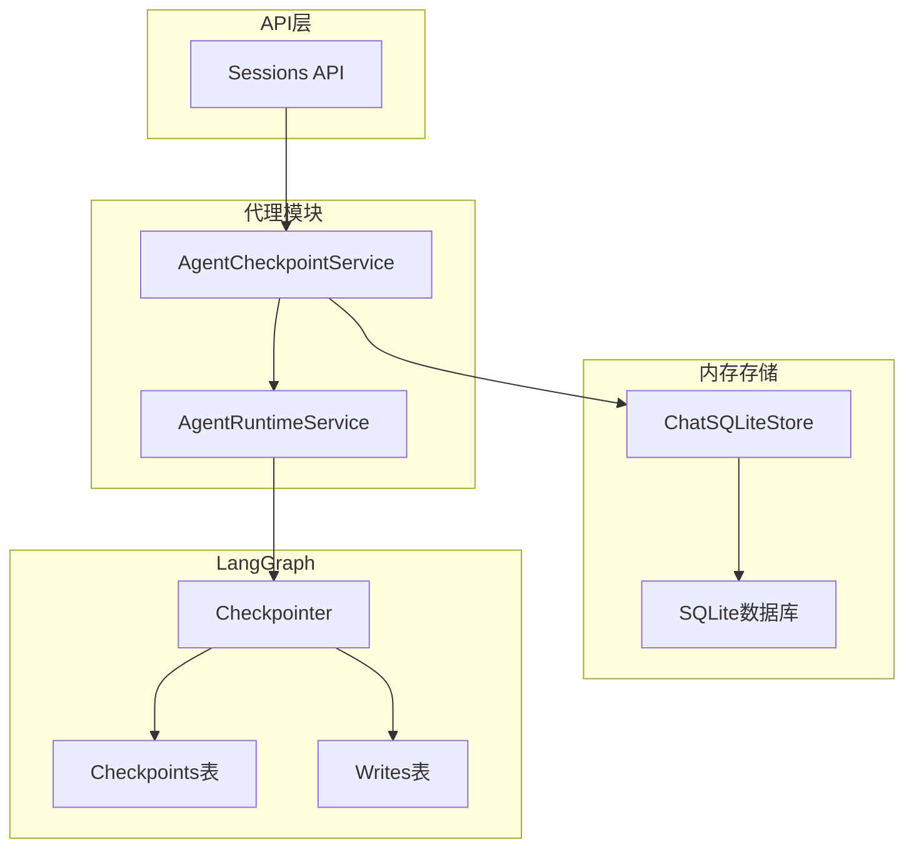
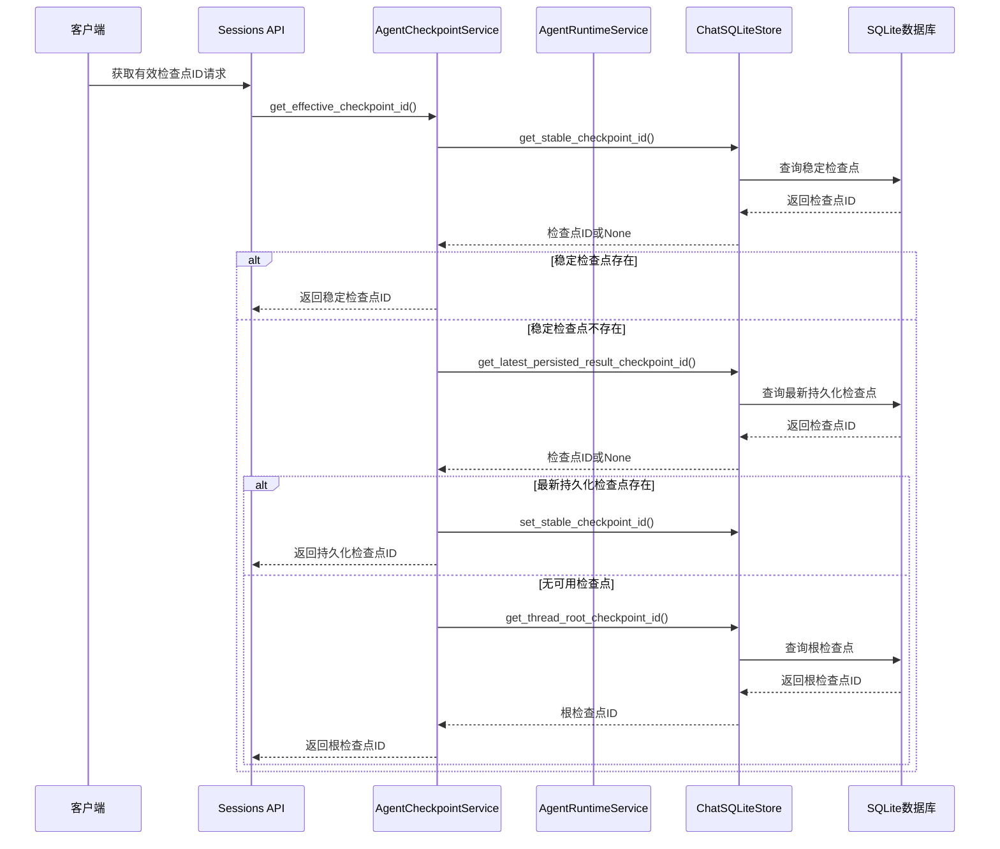
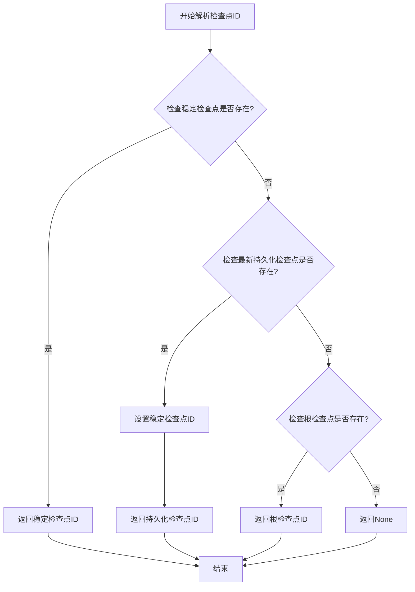
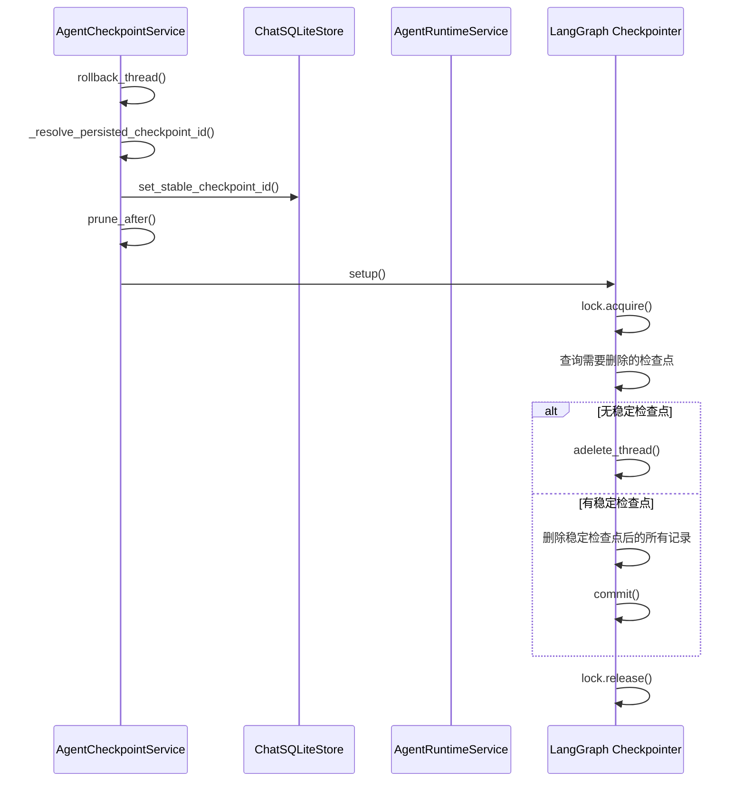
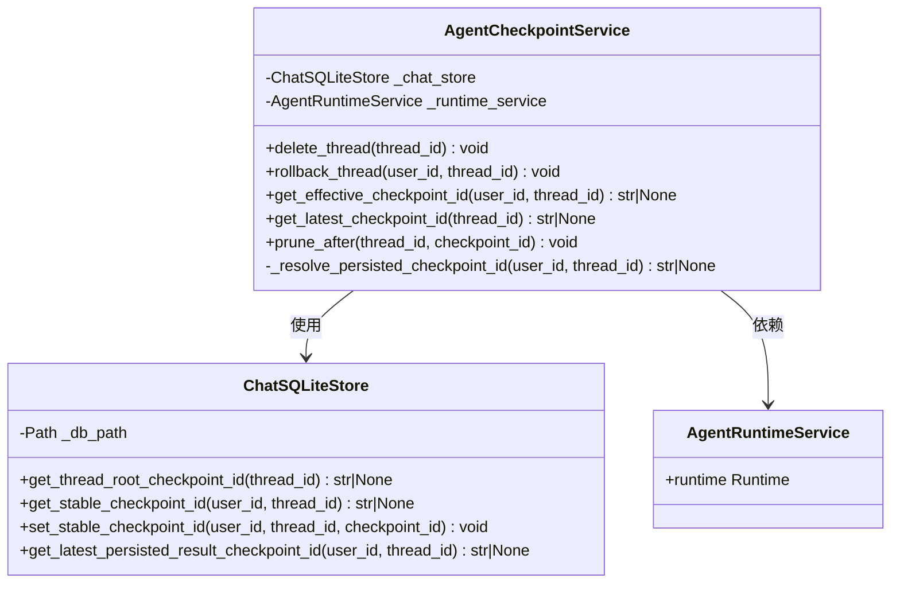
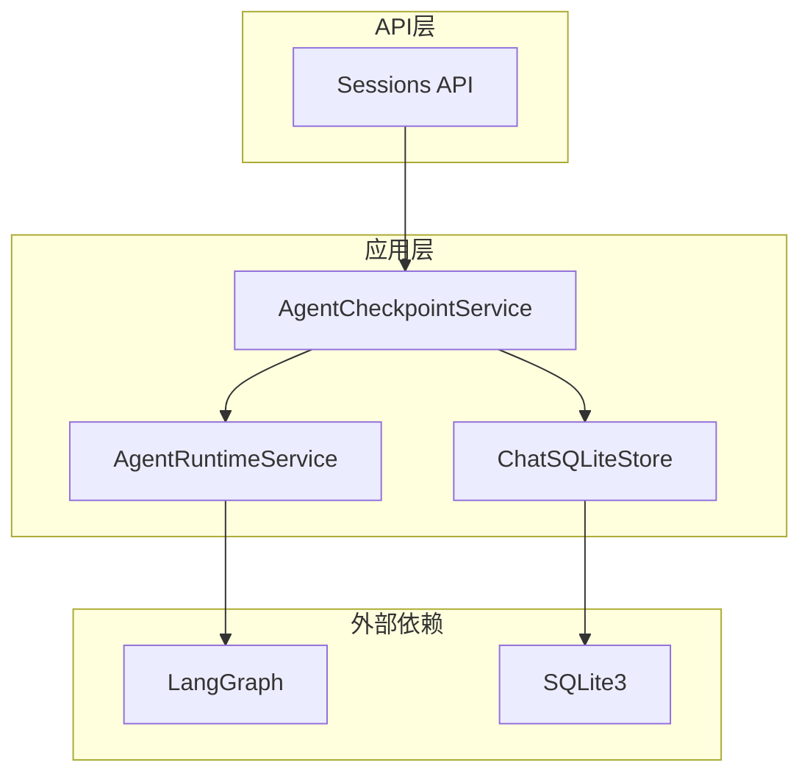

# Agent检查点服务

<cite>
**本文档引用的文件**
- [checkpoints.py](file://backend/app/agent/checkpoints.py)
- [sqlite_store.py](file://backend/app/memory/sqlite_store.py)
- [test_agent_checkpoints.py](file://backend/tests/test_agent_checkpoints.py)
- [runtime.py](file://backend/app/agent/runtime.py)
- [sessions.py](file://backend/app/api/sessions.py)
</cite>

## 目录
1. [简介](#简介)
2. [项目结构](#项目结构)
3. [核心组件](#核心组件)
4. [架构概览](#架构概览)
5. [详细组件分析](#详细组件分析)
6. [依赖关系分析](#依赖关系分析)
7. [性能考虑](#性能考虑)
8. [故障排除指南](#故障排除指南)
9. [结论](#结论)

## 简介

Agent检查点服务是AI旅行项目中LangGraph检查点系统的关键组件，负责管理智能体会话的状态持久化和恢复。该服务通过集成LangGraph的检查点机制，实现了会话状态的可靠持久化、版本控制和线程回滚功能。

检查点服务的核心目标是确保智能体会话能够在意外中断后可靠恢复，同时支持多版本状态管理和并发访问控制。通过与SQLite存储层的深度集成，该服务提供了完整的会话状态生命周期管理能力。

## 项目结构

检查点服务位于后端应用的代理模块中，与内存存储、运行时服务和API层协同工作：



**图表来源**
- [checkpoints.py:1-106](file://backend/app/agent/checkpoints.py#L1-L106)
- [sqlite_store.py:123-180](file://backend/app/memory/sqlite_store.py#L123-L180)

**章节来源**
- [checkpoints.py:1-106](file://backend/app/agent/checkpoints.py#L1-L106)
- [sqlite_store.py:123-180](file://backend/app/memory/sqlite_store.py#L123-L180)

## 核心组件

### AgentCheckpointService类

AgentCheckpointService是检查点管理的核心类，提供以下主要功能：

- **检查点ID解析**：解析有效的检查点标识符，优先使用稳定检查点，然后是已持久化的检查点，最后是根检查点
- **线程回滚**：将线程回滚到最近的合法检查点位置
- **检查点修剪**：删除稳定检查点之后的半成品检查点和写入记录
- **并发控制**：通过锁机制确保多线程环境下的数据一致性

### ChatSQLiteStore类

ChatSQLiteStore提供会话状态的持久化存储，包含：

- **根检查点查询**：获取线程的根检查点标识符
- **会话状态管理**：维护会话的完整状态信息
- **版本控制**：支持消息版本的历史追踪

**章节来源**
- [checkpoints.py:9-106](file://backend/app/agent/checkpoints.py#L9-L106)
- [sqlite_store.py:123-180](file://backend/app/memory/sqlite_store.py#L123-L180)

## 架构概览

检查点服务采用分层架构设计，实现了清晰的关注点分离：



**图表来源**
- [checkpoints.py:32-44](file://backend/app/agent/checkpoints.py#L32-L44)
- [sqlite_store.py:177-180](file://backend/app/memory/sqlite_store.py#L177-L180)

## 详细组件分析

### 检查点ID解析机制

检查点ID解析遵循严格的优先级顺序：



**图表来源**
- [checkpoints.py:32-44](file://backend/app/agent/checkpoints.py#L32-L44)

### 线程回滚功能

线程回滚过程包括检查点解析、状态更新和数据修剪：



**图表来源**
- [checkpoints.py:23-31](file://backend/app/agent/checkpoints.py#L23-L31)
- [checkpoints.py:62-106](file://backend/app/agent/checkpoints.py#L62-L106)

### SQLite检查点存储实现

SQLite存储层提供了完整的检查点数据结构：

#### 数据表设计

| 表名 | 字段 | 类型 | 约束 | 描述 |
|------|------|------|------|------|
| checkpoints | thread_id | TEXT | NOT NULL | 线程标识符 |
| checkpoints | checkpoint_id | TEXT | NOT NULL | 检查点标识符 |
| checkpoints | parent_checkpoint_id | TEXT | NULL | 父检查点标识符 |
| checkpoints | checkpoint_ns | TEXT | NOT NULL | 检查点命名空间 |
| checkpoints | metadata | TEXT | NOT NULL | 元数据JSON |
| checkpoints | created_at | TEXT | NOT NULL | 创建时间 |
| writes | thread_id | TEXT | NOT NULL | 线程标识符 |
| writes | checkpoint_id | TEXT | NOT NULL | 检查点标识符 |
| writes | checkpoint_ns | TEXT | NOT NULL | 检查点命名空间 |
| writes | channel | TEXT | NOT NULL | 通道名称 |
| writes | type | TEXT | NOT NULL | 写入类型 |
| writes | payload | TEXT | NOT NULL | 载荷数据 |

#### 索引优化策略

```sql
-- 主键索引
CREATE UNIQUE INDEX idx_checkpoints_pk ON checkpoints(thread_id, checkpoint_id);
CREATE UNIQUE INDEX idx_writes_pk ON writes(thread_id, checkpoint_id, channel);

-- 查询优化索引
CREATE INDEX idx_checkpoints_thread_time ON checkpoints(thread_id, created_at);
CREATE INDEX idx_checkpoints_parent ON checkpoints(parent_checkpoint_id);
CREATE INDEX idx_writes_thread_checkpoint ON writes(thread_id, checkpoint_id);
```

**章节来源**
- [sqlite_store.py:150-180](file://backend/app/memory/sqlite_store.py#L150-L180)
- [checkpoints.py:75-105](file://backend/app/agent/checkpoints.py#L75-L105)

### 并发控制机制

检查点服务通过以下机制确保并发安全性：

1. **锁机制**：使用异步锁保护关键操作
2. **事务管理**：通过SQLite事务确保操作原子性
3. **连接池**：避免并发连接冲突
4. **状态检查**：在操作前验证运行时状态



**图表来源**
- [checkpoints.py:9-15](file://backend/app/agent/checkpoints.py#L9-L15)
- [sqlite_store.py:123-130](file://backend/app/memory/sqlite_store.py#L123-L130)

## 依赖关系分析

检查点服务的依赖关系体现了清晰的分层架构：



**图表来源**
- [checkpoints.py:5-6](file://backend/app/agent/checkpoints.py#L5-L6)
- [sqlite_store.py:132-136](file://backend/app/memory/sqlite_store.py#L132-L136)

**章节来源**
- [checkpoints.py:5-6](file://backend/app/agent/checkpoints.py#L5-L6)
- [sqlite_store.py:132-136](file://backend/app/memory/sqlite_store.py#L132-L136)

## 性能考虑

### 查询优化

1. **索引策略**：为常用查询字段建立索引
2. **批量操作**：合并相似的数据库操作
3. **连接复用**：避免频繁创建数据库连接

### 内存管理

1. **异步I/O**：使用异步数据库操作避免阻塞
2. **连接池**：合理配置数据库连接池大小
3. **垃圾回收**：及时释放不再使用的对象

### 缓存策略

1. **检查点缓存**：缓存最近使用的检查点信息
2. **元数据缓存**：缓存会话元数据减少查询次数

## 故障排除指南

### 常见问题及解决方案

#### 检查点解析失败

**症状**：`get_effective_checkpoint_id`返回None
**原因**：
- 线程没有有效的检查点
- 数据库连接异常
- 权限不足

**解决方案**：
1. 验证线程是否存在
2. 检查数据库连接状态
3. 确认用户权限

#### 线程回滚异常

**症状**：`rollback_thread`操作失败
**原因**：
- 并发冲突导致锁超时
- 数据库事务失败
- 检查点ID格式错误

**解决方案**：
1. 检查并发访问模式
2. 验证检查点ID的有效性
3. 重新执行回滚操作

#### 数据完整性问题

**症状**：检查点数据不一致
**原因**：
- 异常中断导致的数据损坏
- 并发写入冲突
- 磁盘空间不足

**解决方案**：
1. 执行数据完整性检查
2. 清理损坏的数据记录
3. 重建丢失的检查点

**章节来源**
- [test_agent_checkpoints.py:85-148](file://backend/tests/test_agent_checkpoints.py#L85-L148)

## 结论

Agent检查点服务通过精心设计的架构和实现，成功解决了智能体会话状态管理的核心挑战。该服务不仅提供了可靠的检查点持久化机制，还实现了高效的版本控制和并发安全保证。

### 主要优势

1. **可靠性**：通过多层检查点机制确保会话状态的可靠恢复
2. **性能**：优化的查询策略和索引设计提升了系统响应速度
3. **安全性**：完善的并发控制和事务管理保证了数据一致性
4. **可扩展性**：模块化的架构设计便于功能扩展和维护

### 未来改进方向

1. **监控增强**：添加更详细的性能指标和错误追踪
2. **备份策略**：实现自动化的数据备份和恢复机制
3. **监控告警**：建立检查点服务的健康监控和告警系统
4. **容量规划**：优化存储空间使用和清理策略

该检查点服务为AI旅行项目的智能体功能提供了坚实的技术基础，确保了用户体验的连续性和数据的安全性。