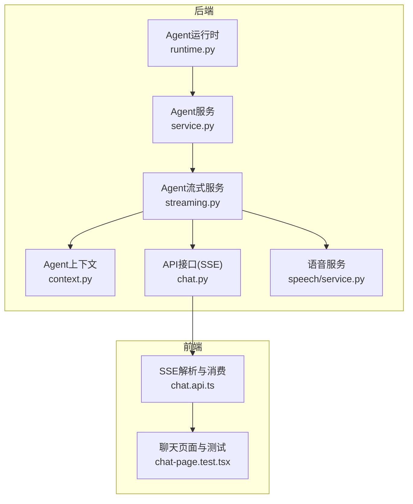
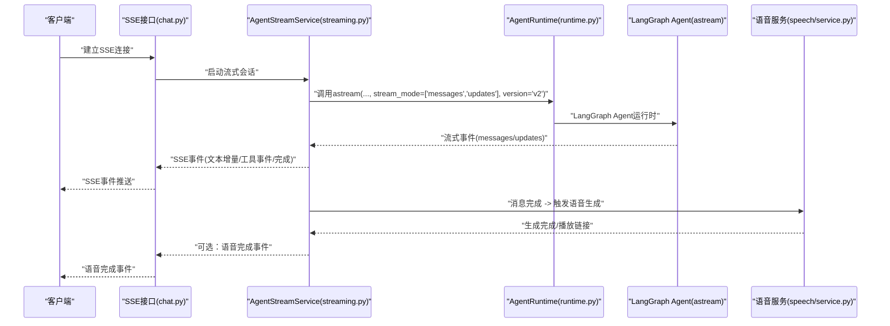
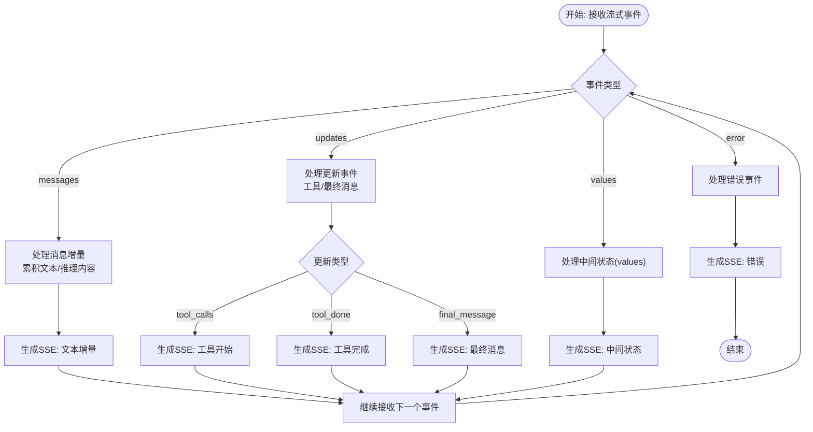
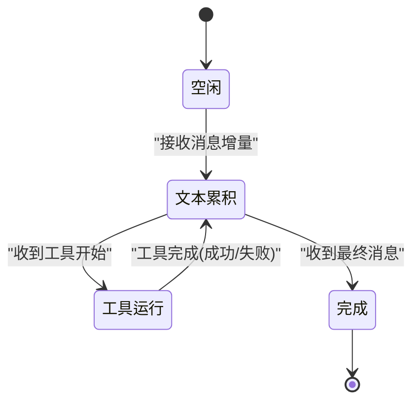
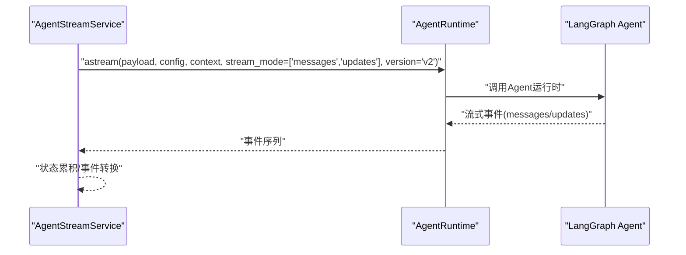
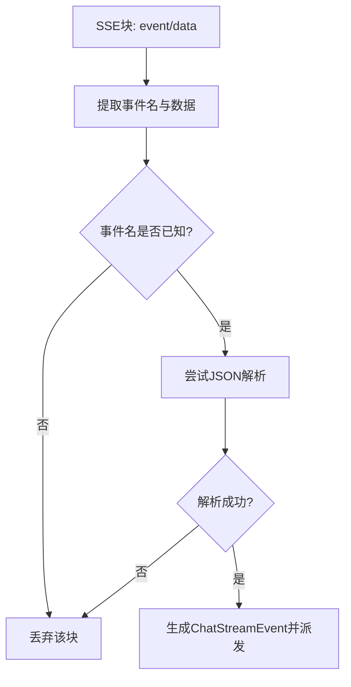
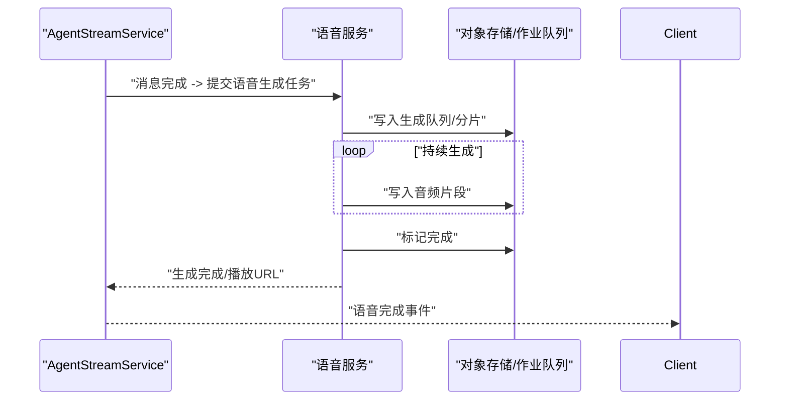
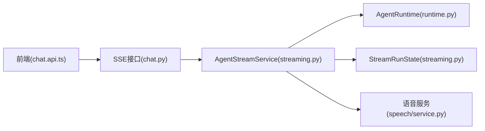

# Agent流式服务

<cite>
**本文引用的文件**
- [streaming.py](file://backend/app/agent/streaming.py)
- [service.py](file://backend/app/agent/service.py)
- [runtime.py](file://backend/app/agent/runtime.py)
- [context.py](file://backend/app/agent/context.py)
- [chat.api.ts](file://frontend/src/features/chat/api/chat.api.ts)
- [chat-page.test.tsx](file://frontend/src/features/chat/ui/chat-page.test.tsx)
- [test_agent_streaming.py](file://backend/tests/test_agent_streaming.py)
- [test_agent_service.py](file://backend/tests/test_agent_service.py)
- [agent-implementation-retrospective.md](file://docs/agent-implementation-retrospective.md)
- [service.py](file://backend/app/speech/service.py)
- [chat.py](file://backend/app/api/chat.py)
</cite>

## 目录
1. [简介](#简介)
2. [项目结构](#项目结构)
3. [核心组件](#核心组件)
4. [架构总览](#架构总览)
5. [详细组件分析](#详细组件分析)
6. [依赖关系分析](#依赖关系分析)
7. [性能考虑](#性能考虑)
8. [故障排查指南](#故障排查指南)
9. [结论](#结论)
10. [附录](#附录)

## 简介
本文件系统性梳理后端Agent流式服务的设计与实现，重点覆盖以下方面：
- AgentStreamService的核心职责：将LangGraph Agent运行时的流式事件进行聚合、转换与分发，支持SSE推送。
- StreamRunState的状态管理：累积文本、追踪工具调用生命周期、维护UI部件状态。
- 流式事件生成与处理：消息增量、工具调用事件、最终状态更新事件的生成与消费。
- 与SSE的集成：事件格式、连接管理、错误处理与客户端兼容性。
- 与语音合成服务的联动：消息完成后的语音资产生成与播放链接发放。

## 项目结构
后端以模块化方式组织Agent相关能力：
- agent子系统：运行时、服务、上下文、流式处理等
- api层：对外接口，负责SSE流式输出
- speech子系统：语音合成与播放
- 前端：SSE解析、事件消费与UI渲染

图表来源
- [streaming.py](file://backend/app/agent/streaming.py)
- [service.py](file://backend/app/agent/service.py)
- [runtime.py](file://backend/app/agent/runtime.py)
- [context.py](file://backend/app/agent/context.py)
- [chat.py](file://backend/app/api/chat.py)
- [service.py](file://backend/app/speech/service.py)
- [chat.api.ts](file://frontend/src/features/chat/api/chat.api.ts)
- [chat-page.test.tsx](file://frontend/src/features/chat/ui/chat-page.test.tsx)

章节来源
- [streaming.py](file://backend/app/agent/streaming.py)
- [service.py](file://backend/app/agent/service.py)
- [runtime.py](file://backend/app/agent/runtime.py)
- [context.py](file://backend/app/agent/context.py)
- [chat.py](file://backend/app/api/chat.py)
- [service.py](file://backend/app/speech/service.py)
- [chat.api.ts](file://frontend/src/features/chat/api/chat.api.ts)
- [chat-page.test.tsx](file://frontend/src/features/chat/ui/chat-page.test.tsx)

## 核心组件
- AgentStreamService：负责将LangGraph Agent运行时的流式事件转换为SSE事件，驱动前端UI实时更新。
- StreamRunState：运行时状态机，负责累积文本、追踪工具调用、维护UI部件状态。
- AgentRuntime：封装LangGraph Agent的异步流式调用，提供统一的流式接口。
- AgentRequestContext：请求上下文，承载认证、配置、版本等信息。
- SSE API：将事件序列化为SSE格式，通过HTTP响应流式输出。
- 语音服务：在消息完成后生成语音资产，并提供安全的播放链接。

章节来源
- [streaming.py](file://backend/app/agent/streaming.py)
- [service.py](file://backend/app/agent/service.py)
- [runtime.py](file://backend/app/agent/runtime.py)
- [context.py](file://backend/app/agent/context.py)
- [chat.py](file://backend/app/api/chat.py)
- [service.py](file://backend/app/speech/service.py)

## 架构总览
Agent流式服务的整体工作流如下：
- 客户端发起SSE订阅
- 后端通过AgentRuntime调用LangGraph Agent的异步流式接口
- AgentStreamService对流式事件进行聚合与转换，生成SSE事件
- SSE事件推送到客户端，前端逐条解析并更新UI
- 消息完成后触发语音合成任务，生成播放链接供客户端播放

图表来源
- [chat.py](file://backend/app/api/chat.py)
- [streaming.py](file://backend/app/agent/streaming.py)
- [runtime.py](file://backend/app/agent/runtime.py)
- [service.py](file://backend/app/speech/service.py)

## 详细组件分析

### AgentStreamService与流式事件处理
- 职责
  - 接收LangGraph Agent的流式事件（messages/updates/values/error）
  - 将事件转换为SSE事件，按顺序推送给客户端
  - 在事件转换过程中，结合StreamRunState进行状态累积与UI部件管理
- 关键点
  - 严格遵循LangGraph v2流式协议，使用messages与updates通道
  - 工具调用生命周期仅通过updates通道驱动，避免重复或冲突事件
  - 对消息增量事件进行节流与合并，提升前端渲染效率

图表来源
- [streaming.py](file://backend/app/agent/streaming.py)

章节来源
- [streaming.py](file://backend/app/agent/streaming.py)
- [test_agent_streaming.py](file://backend/tests/test_agent_streaming.py)

### StreamRunState状态管理
- 职责
  - 累积Assistant文本与推理内容
  - 追踪工具调用的开始/完成，维护工具卡片状态
  - 记录当前会话元信息，用于事件分发与UI渲染
- 状态流转
  - 初始为空，接收消息增量时逐步拼接
  - 接收到工具调用事件时，创建对应工具卡片并标记运行中
  - 接收到工具完成事件时，更新卡片状态为成功或失败
  - 接收到最终消息事件时，标记会话完成并触发后续动作（如语音）

图表来源
- [streaming.py](file://backend/app/agent/streaming.py)

章节来源
- [streaming.py](file://backend/app/agent/streaming.py)

### LangGraph Agent运行时集成
- AgentRuntime封装LangGraph Agent的异步流式调用，确保：
  - 使用LangGraph v2协议，stream_mode为["messages","updates"]
  - 版本号为"v2"，保证事件结构与后端解析逻辑一致
  - 上下文传递与配置注入，便于鉴权与路由

图表来源
- [runtime.py](file://backend/app/agent/runtime.py)
- [test_agent_service.py](file://backend/tests/test_agent_service.py)

章节来源
- [runtime.py](file://backend/app/agent/runtime.py)
- [test_agent_service.py](file://backend/tests/test_agent_service.py)

### SSE事件格式与客户端兼容性
- 事件格式
  - 事件名称：message（文本增量）、tool.start（工具开始）、tool.done（工具完成）、message.completed（最终消息）、turn.done（回合结束）
  - 数据体：JSON结构，包含消息ID、工具调用ID、工具名称、输入/输出、状态等
- 客户端解析
  - 前端使用SSE解析器逐块解析事件，校验事件名称与数据格式
  - 使用requestAnimationFrame优化渲染时机，避免频繁重绘
- 兼容性处理
  - 忽略注释行与空行，兼容不同SSE实现
  - 对未知事件名称与解析异常进行过滤与降级处理

图表来源
- [chat.api.ts](file://frontend/src/features/chat/api/chat.api.ts)

章节来源
- [chat.api.ts](file://frontend/src/features/chat/api/chat.api.ts)
- [chat-page.test.tsx](file://frontend/src/features/chat/ui/chat-page.test.tsx)

### 与语音合成的集成
- 触发时机
  - 当收到message.completed事件时，后端触发语音合成任务
- 生成流程
  - 语音服务接收文本片段，分片调用TTS接口，边生成边落盘
  - 生成完成后，颁发带有效期的播放token，返回播放URL
- 播放机制
  - 前端通过播放URL拉取音频流，支持暂停/继续
  - 若仍在生成中，服务端返回生成中的占位状态与MIME类型

图表来源
- [service.py](file://backend/app/speech/service.py)
- [chat.py](file://backend/app/api/chat.py)

章节来源
- [service.py](file://backend/app/speech/service.py)
- [chat.py](file://backend/app/api/chat.py)

## 依赖关系分析
- 组件耦合
  - AgentStreamService依赖AgentRuntime与StreamRunState，负责事件转换与状态管理
  - SSE API依赖AgentStreamService，负责事件序列化与HTTP流式输出
  - 语音服务独立于流式事件，通过消息完成事件触发
- 外部依赖
  - LangGraph v2流式协议与事件结构
  - SSE客户端解析与渲染框架（requestAnimationFrame）

图表来源
- [chat.py](file://backend/app/api/chat.py)
- [streaming.py](file://backend/app/agent/streaming.py)
- [runtime.py](file://backend/app/agent/runtime.py)
- [service.py](file://backend/app/speech/service.py)
- [chat.api.ts](file://frontend/src/features/chat/api/chat.api.ts)

章节来源
- [chat.py](file://backend/app/api/chat.py)
- [streaming.py](file://backend/app/agent/streaming.py)
- [runtime.py](file://backend/app/agent/runtime.py)
- [service.py](file://backend/app/speech/service.py)
- [chat.api.ts](file://frontend/src/features/chat/api/chat.api.ts)

## 性能考虑
- 流式传输优化
  - 事件合并：将连续的消息增量合并为单个SSE事件，减少网络开销
  - 渲染节流：前端使用requestAnimationFrame控制渲染频率，避免过度重绘
- 缓冲策略
  - 语音合成采用分片写入，边生成边输出，缩短首帧延迟
  - 生成队列支持取消与重试，提升稳定性
- 客户端兼容性
  - 兼容不同SSE实现，忽略注释与空行，增强鲁棒性
  - 对未知事件与解析异常进行降级处理，避免中断

## 故障排查指南
- 常见问题
  - 工具事件重复：检查是否同时从messages与updates通道产生工具事件，应仅通过updates通道驱动
  - 事件丢失：确认LangGraph版本与stream_mode配置正确，确保后端解析逻辑与协议一致
  - SSE解析失败：检查事件名称与JSON格式，确保前端解析器正确过滤注释行
  - 语音播放异常：确认播放token有效期内，对象存储可用且MIME类型正确
- 调试建议
  - 后端：开启详细日志，记录事件类型与数据体
  - 前端：在解析器中增加日志打印，定位具体块与事件
  - 语音：监控生成队列状态与对象存储写入进度

章节来源
- [test_agent_streaming.py](file://backend/tests/test_agent_streaming.py)
- [chat.api.ts](file://frontend/src/features/chat/api/chat.api.ts)
- [service.py](file://backend/app/speech/service.py)

## 结论
Agent流式服务通过严格的LangGraph v2协议与SSE事件模型，实现了从模型推理到工具调用再到UI渲染的全链路实时体验。配合语音合成服务，进一步完善了多模态交互闭环。整体设计强调协议一致性、状态可追踪与前端渲染优化，具备良好的扩展性与可维护性。

## 附录

### 代码示例路径
- 启动流式会话与事件处理
  - [streaming.py](file://backend/app/agent/streaming.py)
  - [test_agent_streaming.py](file://backend/tests/test_agent_streaming.py)
- SSE事件解析与渲染
  - [chat.api.ts](file://frontend/src/features/chat/api/chat.api.ts)
  - [chat-page.test.tsx](file://frontend/src/features/chat/ui/chat-page.test.tsx)
- 语音合成与播放
  - [service.py](file://backend/app/speech/service.py)
  - [chat.py](file://backend/app/api/chat.py)

### 设计原则与背景
- 采用LangGraph原生流式协议，避免二次包装带来的调试复杂度
- 两层存储分离：业务消息存储与Agent运行时存储，明确职责边界
- 工具调用生命周期通过updates通道唯一驱动，避免UI状态不一致

章节来源
- [agent-implementation-retrospective.md](file://docs/agent-implementation-retrospective.md)