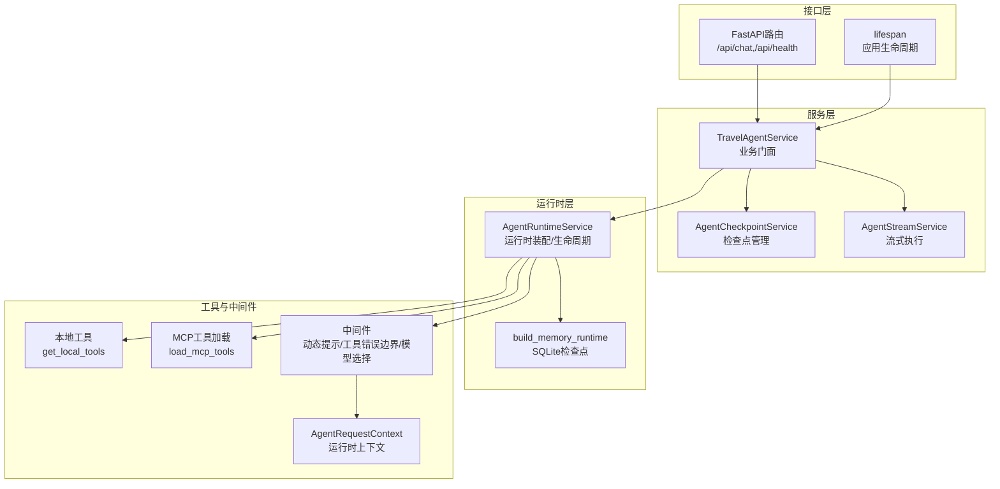
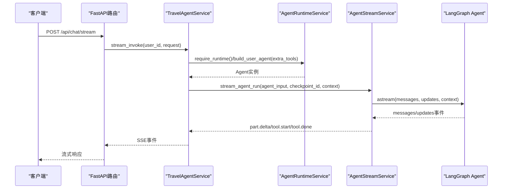
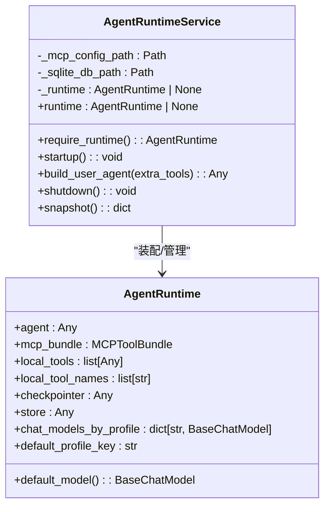
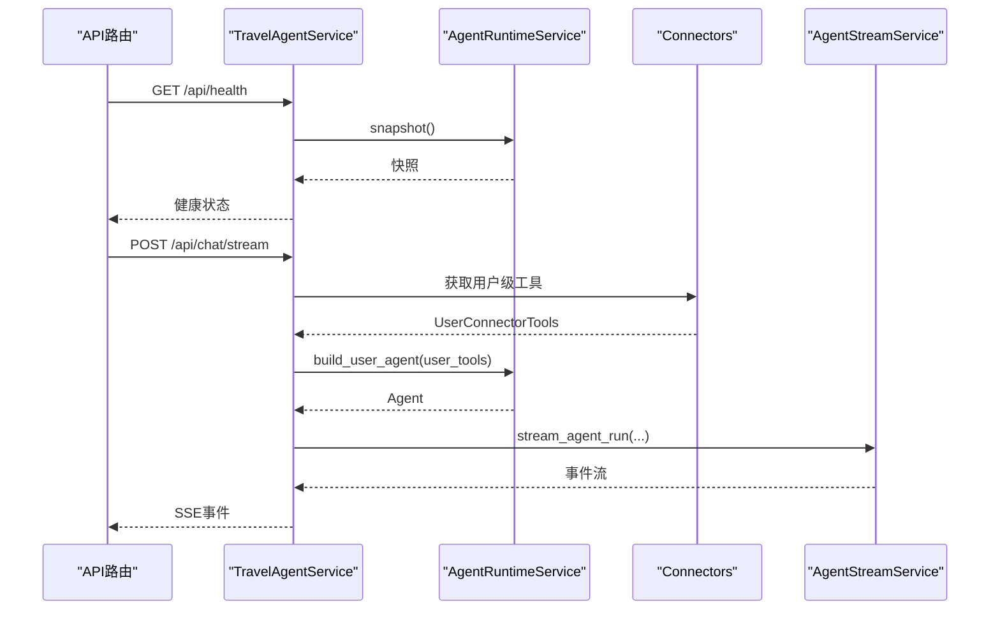
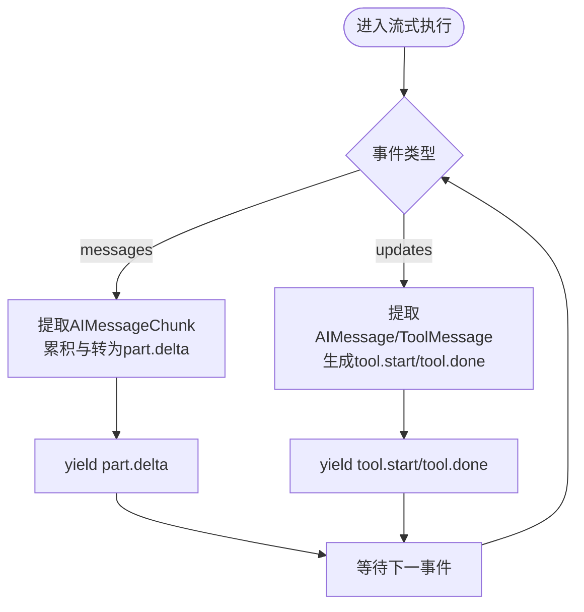
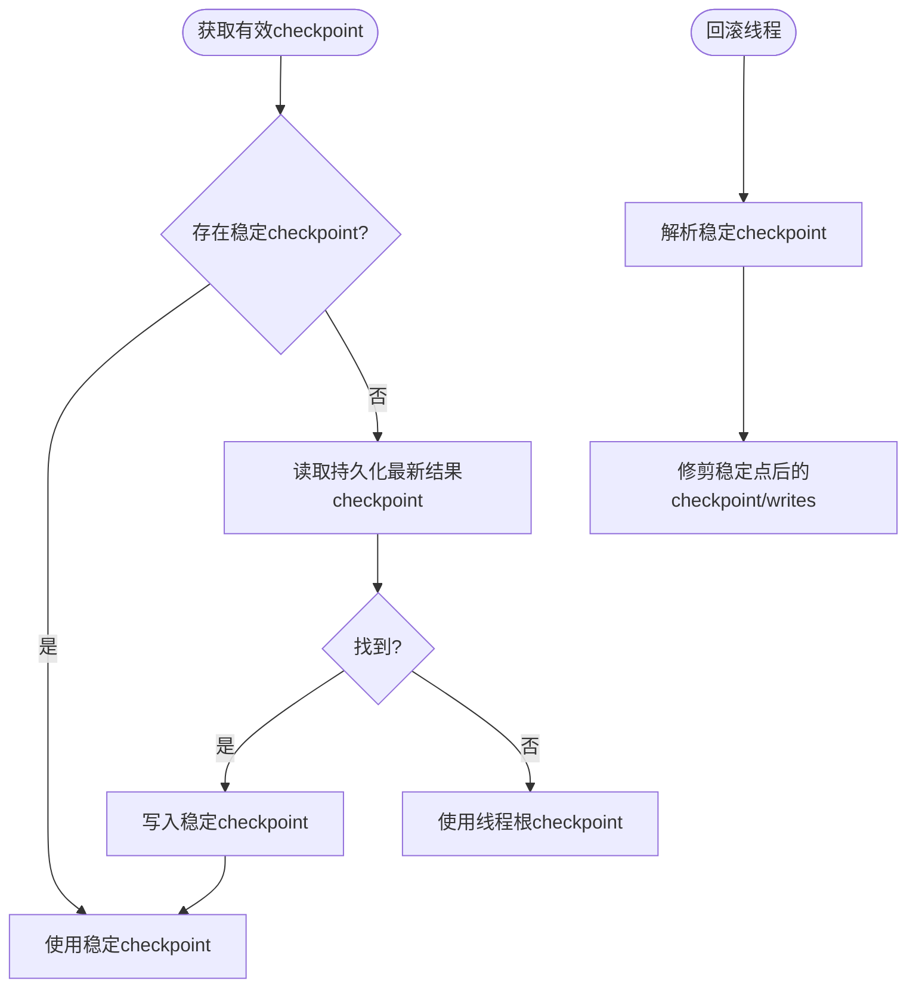
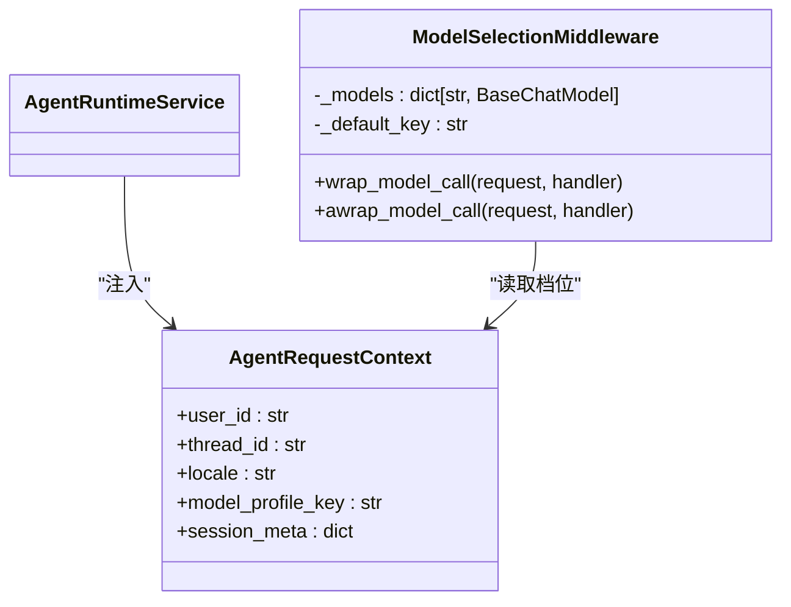
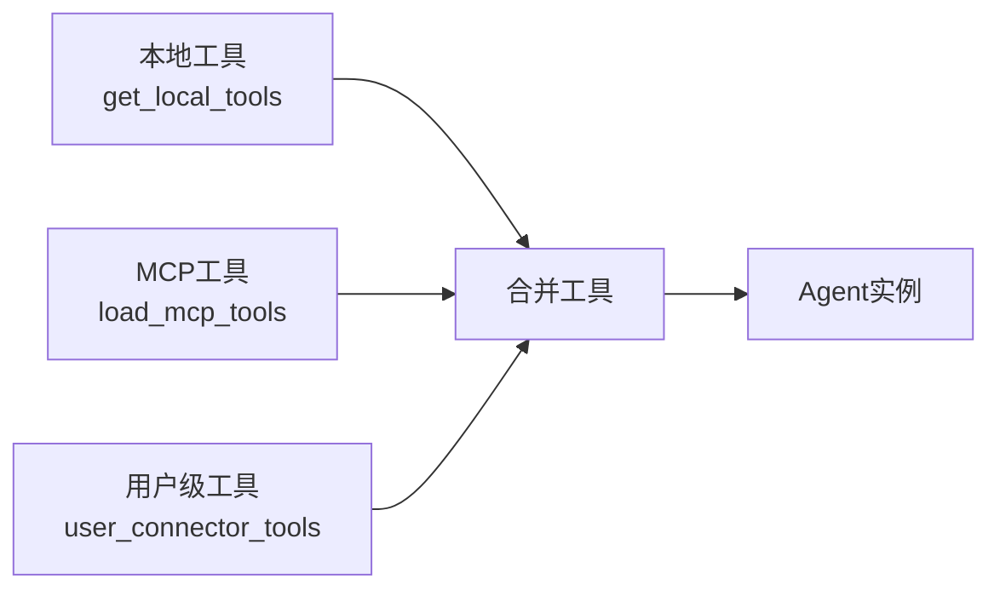
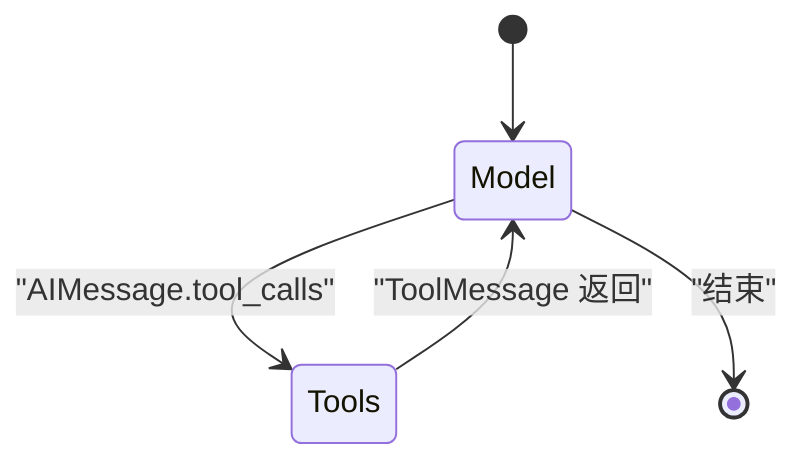
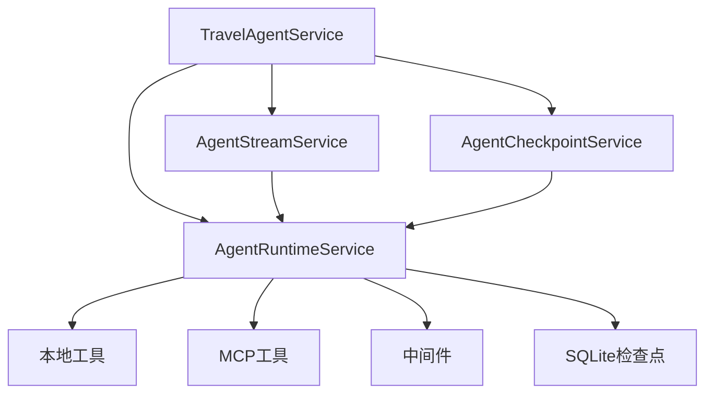

# Agent运行时服务

<cite>
**本文档引用的文件**
- [runtime.py](file://backend/app/agent/runtime.py)
- [service.py](file://backend/app/agent/service.py)
- [checkpoints.py](file://backend/app/agent/checkpoints.py)
- [context.py](file://backend/app/agent/context.py)
- [middleware.py](file://backend/app/agent/middleware.py)
- [runtime.py](file://backend/app/memory/runtime.py)
- [local_tools.py](file://backend/app/tool/local_tools.py)
- [client.py](file://backend/app/mcp/client.py)
- [runtime.py](file://backend/app/connectors/runtime.py)
- [streaming.py](file://backend/app/agent/streaming.py)
- [system.py](file://backend/app/prompt/system.py)
- [main.py](file://backend/app/main.py)
- [chat.py](file://backend/app/api/chat.py)
- [health.py](file://backend/app/api/health.py)
- [test_agent_runtime_features.py](file://backend/tests/test_agent_runtime_features.py)
</cite>

## 目录
1. [简介](#简介)
2. [项目结构](#项目结构)
3. [核心组件](#核心组件)
4. [架构总览](#架构总览)
5. [详细组件分析](#详细组件分析)
6. [依赖分析](#依赖分析)
7. [性能考虑](#性能考虑)
8. [故障排除指南](#故障排除指南)
9. [结论](#结论)
10. [附录](#附录)

## 简介
本文件系统性阐述Agent运行时服务的设计与实现，重点覆盖以下方面：
- LangGraph Agent的启动与初始化流程
- 运行时状态管理与生命周期控制
- Agent构建机制：用户工具集成、Agent图构建与运行时配置
- 运行时快照功能：状态序列化、恢复机制与调试支持
- 与LangGraph的集成方式：节点定义、边连接与状态转换
- 实际使用示例：如何启动运行时、构建Agent实例与管理运行时状态
- 监控、故障恢复与性能调优最佳实践

## 项目结构
Agent运行时服务位于后端Python应用的agent子包内，围绕运行时装配、中间件、工具集成、流式执行与检查点管理展开。整体采用分层设计：服务门面层负责业务编排，运行时服务负责Agent装配与生命周期，中间件负责动态提示词与工具错误边界，流式服务负责LangGraph事件的抽取与前端事件转换。

**图表来源**
- [service.py:97-120](file://backend/app/agent/service.py#L97-L120)
- [runtime.py:61-116](file://backend/app/agent/runtime.py#L61-L116)
- [middleware.py:193-211](file://backend/app/agent/middleware.py#L193-L211)
- [local_tools.py:49-56](file://backend/app/tool/local_tools.py#L49-L56)
- [client.py:32-69](file://backend/app/mcp/client.py#L32-L69)
- [runtime.py:11-22](file://backend/app/memory/runtime.py#L11-L22)
- [main.py:23-29](file://backend/app/main.py#L23-L29)
- [chat.py:41-72](file://backend/app/api/chat.py#L41-L72)

**章节来源**
- [service.py:97-120](file://backend/app/agent/service.py#L97-L120)
- [runtime.py:61-116](file://backend/app/agent/runtime.py#L61-L116)
- [main.py:23-29](file://backend/app/main.py#L23-L29)

## 核心组件
- AgentRuntimeService：负责运行时装配、启动、关闭与快照导出。核心职责包括加载本地工具与MCP工具、构建LangGraph Agent、注入中间件、复用SQLite检查点与共享store。
- TravelAgentService：业务门面，协调运行时、流式执行、检查点与语音合成，提供会话管理、模型档位切换、重新生成与回滚等能力。
- AgentStreamService：封装LangGraph的astream执行，按messages/updates两类事件流进行状态累积与前端事件转换。
- AgentCheckpointService：维护稳定检查点、回滚线程、修剪半成品检查点。
- AgentRequestContext：运行时上下文，贯穿中间件、工具与后续存储/拦截器。
- 中间件体系：动态系统提示词、工具错误边界、模型档位选择。

**章节来源**
- [runtime.py:61-174](file://backend/app/agent/runtime.py#L61-L174)
- [service.py:97-120](file://backend/app/agent/service.py#L97-L120)
- [streaming.py:74-148](file://backend/app/agent/streaming.py#L74-L148)
- [checkpoints.py:9-106](file://backend/app/agent/checkpoints.py#L9-L106)
- [context.py:10-22](file://backend/app/agent/context.py#L10-L22)
- [middleware.py:193-211](file://backend/app/agent/middleware.py#L193-L211)

## 架构总览
Agent运行时服务采用“服务门面 + 运行时装配 + 中间件 + 流式执行 + 检查点”的分层架构。服务门面负责业务编排与对外接口，运行时服务负责Agent装配与生命周期，中间件负责动态提示词与工具错误边界，流式服务负责LangGraph事件抽取与前端事件转换，检查点服务负责稳定点与回滚。

**图表来源**
- [chat.py:41-72](file://backend/app/api/chat.py#L41-L72)
- [service.py:373-507](file://backend/app/agent/service.py#L373-L507)
- [streaming.py:80-148](file://backend/app/agent/streaming.py#L80-L148)
- [runtime.py:117-132](file://backend/app/agent/runtime.py#L117-L132)

## 详细组件分析

### AgentRuntimeService：运行时装配与生命周期
- 启动流程：加载本地工具、MCP连接配置、构建MCP工具包、惰性导入内存运行时（SQLite检查点）、构建多个LLM档位的ChatModel映射、选择默认档位键、调用LangGraph的create_agent创建Agent实例，并封装到AgentRuntime容器。
- 用户Agent构建：基于全局组件与用户级工具（来自Connectors）按需拼装Agent，复用全局中间件、检查点与store。
- 关闭流程：关闭MCP客户端（去重处理）、关闭SQLite检查点连接，清空运行时。
- 快照导出：返回运行时健康状态、MCP连接服务器、错误列表、本地工具与MCP工具名称列表，用于健康检查与调试。

**图表来源**
- [runtime.py:31-116](file://backend/app/agent/runtime.py#L31-L116)

**章节来源**
- [runtime.py:61-174](file://backend/app/agent/runtime.py#L61-L174)

### TravelAgentService：业务门面与编排
- 生命周期：在应用lifespan中启动运行时；关闭时先关闭语音服务再关闭运行时。
- 会话与模型档位：提供会话列表、详情、重命名、删除；支持按线程切换模型档位；列出前端可用的模型档位。
- 流式对话：封装stream_invoke与stream_regenerate，负责准备上下文、构建用户Agent、驱动流式执行、完成消息、生成语音、回滚与错误处理。
- 检查点与回滚：委托AgentCheckpointService进行稳定点定位、回滚与修剪。
- 快照：直接转发AgentRuntimeService的快照。

**图表来源**
- [service.py:116-127](file://backend/app/agent/service.py#L116-L127)
- [service.py:373-507](file://backend/app/agent/service.py#L373-L507)
- [runtime.py:117-132](file://backend/app/agent/runtime.py#L117-L132)
- [runtime.py:156-174](file://backend/app/agent/runtime.py#L156-L174)

**章节来源**
- [service.py:97-120](file://backend/app/agent/service.py#L97-L120)
- [service.py:125-127](file://backend/app/agent/service.py#L125-L127)
- [service.py:373-507](file://backend/app/agent/service.py#L373-L507)

### AgentStreamService：LangGraph事件抽取与前端事件转换
- 事件类型：messages（LLM token增量）、updates（节点结束快照，包含AIMessage/ToolMessage）。
- 状态累积：StreamRunState保存累积的AIMessageChunk、工具追踪、UI片段、引用来源等。
- 事件转换：将messages中的AIMessageChunk转换为text/reasoning的part.delta；将updates中的AIMessage.tool_calls与ToolMessage转换为tool.start/tool.done事件，并填充引用来源与结构化卡片。
- 去重与收尾：按call_id去重工具事件；在切换不同片段类型时收尾上一段streaming片段，避免前端永远“思考中”。

**图表来源**
- [streaming.py:80-148](file://backend/app/agent/streaming.py#L80-L148)
- [streaming.py:151-229](file://backend/app/agent/streaming.py#L151-L229)

**章节来源**
- [streaming.py:74-148](file://backend/app/agent/streaming.py#L74-L148)
- [streaming.py:235-307](file://backend/app/agent/streaming.py#L235-L307)

### AgentCheckpointService：稳定点与回滚
- 稳定点定位：优先读取业务稳定checkpoint，其次读取持久化的最新结果checkpoint，最后回退到线程根checkpoint。
- 回滚与修剪：将线程回滚到最近稳定checkpoint，并删除该稳定点之后的所有半成品checkpoint与writes。
- 删除线程：删除对应线程的LangGraph checkpoint数据。

**图表来源**
- [checkpoints.py:32-61](file://backend/app/agent/checkpoints.py#L32-L61)
- [checkpoints.py:23-31](file://backend/app/agent/checkpoints.py#L23-L31)

**章节来源**
- [checkpoints.py:9-106](file://backend/app/agent/checkpoints.py#L9-L106)

### AgentRequestContext与中间件
- AgentRequestContext：包含user_id、thread_id、locale、model_profile_key、session_meta等，作为运行时上下文注入LangChain runtime。
- 中间件：
  - 动态系统提示词：基于上下文生成“当前时间”、“语言环境”、“会话元信息”，保证模型始终使用权威时间。
  - 工具错误边界：捕获工具异常并转换为标准ToolMessage，同时透传GraphInterrupt以保持人类中断机制。
  - 模型档位选择：根据AgentRequestContext.model_profile_key动态选择对应ChatModel实例，支持运行时切换。

**图表来源**
- [context.py:10-22](file://backend/app/agent/context.py#L10-L22)
- [middleware.py:133-191](file://backend/app/agent/middleware.py#L133-L191)

**章节来源**
- [context.py:10-22](file://backend/app/agent/context.py#L10-L22)
- [middleware.py:66-109](file://backend/app/agent/middleware.py#L66-L109)
- [middleware.py:111-131](file://backend/app/agent/middleware.py#L111-L131)
- [middleware.py:133-191](file://backend/app/agent/middleware.py#L133-L191)

### 工具集成：本地工具与MCP工具
- 本地工具：get_local_tools返回本地工具列表，包含时间工具与网络搜索工具，随Agent注册为可调用函数。
- MCP工具：load_mcp_tools根据连接配置初始化MultiServerMCPClient，批量加载工具并统计连接服务器与错误；UserConnectorTools在会话期间按用户连接动态加载工具并在结束时关闭客户端。
- 用户工具拼装：TravelAgentService在流式调用前通过_connectors_runtime获取用户级工具，AgentRuntimeService.build_user_agent将其与全局工具合并构建用户Agent。

**图表来源**
- [local_tools.py:49-56](file://backend/app/tool/local_tools.py#L49-L56)
- [client.py:32-69](file://backend/app/mcp/client.py#L32-L69)
- [runtime.py:50-88](file://backend/app/connectors/runtime.py#L50-L88)
- [runtime.py:117-132](file://backend/app/agent/runtime.py#L117-L132)

**章节来源**
- [local_tools.py:49-56](file://backend/app/tool/local_tools.py#L49-L56)
- [client.py:32-69](file://backend/app/mcp/client.py#L32-L69)
- [runtime.py:50-88](file://backend/app/connectors/runtime.py#L50-L88)
- [runtime.py:117-132](file://backend/app/agent/runtime.py#L117-L132)

### LangGraph集成：节点、边与状态转换
- 节点类型：LangGraph图包含model节点（LLM推理）与tools节点（工具执行）。model节点在messages事件中产出AIMessageChunk，在updates事件中产出完整AIMessage（含tool_calls）；tools节点在updates事件中产出ToolMessage。
- 边连接：LangGraph根据AIMessage.tool_calls自动连接到对应工具节点；工具执行完成后回到model节点继续推理。
- 状态转换：AgentStreamService将LangGraph事件转换为前端事件：part.delta（text/reasoning增量）、tool.start（工具开始）、tool.done（工具结束）。

**图表来源**
- [streaming.py:1-29](file://backend/app/agent/streaming.py#L1-L29)

**章节来源**
- [streaming.py:1-29](file://backend/app/agent/streaming.py#L1-L29)

## 依赖分析
- 组件耦合：
  - TravelAgentService依赖AgentRuntimeService、AgentStreamService、AgentCheckpointService与语音服务。
  - AgentRuntimeService依赖本地工具、MCP工具、中间件、LLM模型档位与SQLite检查点。
  - AgentStreamService依赖AgentRuntimeService与LangGraph事件结构。
  - AgentCheckpointService依赖ChatSQLiteStore与AgentRuntimeService的检查点实例。
- 外部依赖：
  - LangGraph：异步检查点、流式执行与事件结构。
  - LangChain：Agent创建、中间件、工具包装与消息类型。
  - aiosqlite：异步SQLite访问。
  - langchain-mcp-adapters：MCP客户端与工具加载。

**图表来源**
- [service.py:97-120](file://backend/app/agent/service.py#L97-L120)
- [runtime.py:61-116](file://backend/app/agent/runtime.py#L61-L116)
- [streaming.py:74-148](file://backend/app/agent/streaming.py#L74-L148)
- [checkpoints.py:9-15](file://backend/app/agent/checkpoints.py#L9-L15)

**章节来源**
- [service.py:97-120](file://backend/app/agent/service.py#L97-L120)
- [runtime.py:61-116](file://backend/app/agent/runtime.py#L61-L116)
- [streaming.py:74-148](file://backend/app/agent/streaming.py#L74-L148)
- [checkpoints.py:9-15](file://backend/app/agent/checkpoints.py#L9-L15)

## 性能考虑
- 异步与并发：使用aiosqlite与异步LangGraph执行，减少阻塞；中间件与工具错误边界避免异常扩散影响整体吞吐。
- 检查点修剪：定期修剪稳定点之后的半成品检查点，降低数据库膨胀与IO开销。
- 事件分流：messages与updates双通道分离，避免重复事件竞争，提升事件处理确定性。
- 模型档位选择：在中间件层按请求动态选择模型实例，避免不必要的绑定开销。
- 工具去重：按call_id去重工具事件，避免重复渲染与状态抖动。

[本节为通用指导，无需特定文件来源]

## 故障排除指南
- 运行时未初始化：调用require_runtime()时若未启动运行时会抛出异常，需先调用startup()。
- MCP连接失败：快照中包含connected_servers与errors列表，可用于诊断；UserConnectorTools在异常时记录警告并继续其他连接。
- 工具异常：中间件统一捕获工具异常并转换为ToolMessage，同时透传GraphInterrupt，确保人类中断机制正常工作。
- 会话回滚：通过AgentCheckpointService.rollback_thread将线程回滚到最近稳定checkpoint，并修剪后续半成品。
- 健康检查：/api/health返回运行时快照，包含MCP连接状态与工具列表，便于快速定位问题。

**章节来源**
- [runtime.py:74-78](file://backend/app/agent/runtime.py#L74-L78)
- [runtime.py:156-174](file://backend/app/agent/runtime.py#L156-L174)
- [runtime.py:134-154](file://backend/app/agent/runtime.py#L134-L154)
- [middleware.py:111-131](file://backend/app/agent/middleware.py#L111-L131)
- [checkpoints.py:23-31](file://backend/app/agent/checkpoints.py#L23-L31)
- [health.py:13-18](file://backend/app/api/health.py#L13-L18)

## 结论
Agent运行时服务通过清晰的分层设计与完善的生命周期管理，实现了LangGraph Agent的高效装配、动态提示词注入、工具集成与流式事件转换。结合检查点管理与健康快照，系统具备良好的可观测性与可恢复性。业务门面进一步将运行时能力暴露为REST接口，支撑聊天流式对话、会话管理与语音合成等核心功能。

[本节为总结，无需特定文件来源]

## 附录

### 如何启动运行时
- 应用启动时通过lifespan自动调用startup()完成运行时初始化。
- 或者在业务代码中显式调用TravelAgentService.startup()。

**章节来源**
- [main.py:23-29](file://backend/app/main.py#L23-L29)
- [service.py:116-118](file://backend/app/agent/service.py#L116-L118)

### 如何构建Agent实例
- 全局Agent：AgentRuntimeService.startup()完成后，通过runtime.agent获取。
- 用户Agent：TravelAgentService在流式调用前，通过AgentRuntimeService.build_user_agent(user_tools)构建，合并本地工具、MCP工具与用户级工具。

**章节来源**
- [runtime.py:117-132](file://backend/app/agent/runtime.py#L117-L132)
- [service.py:423-425](file://backend/app/agent/service.py#L423-L425)

### 如何管理运行时状态
- 快照：调用TravelAgentService.runtime_snapshot()或直接调用AgentRuntimeService.snapshot()获取健康状态与工具列表。
- 回滚：调用AgentCheckpointService.rollback_thread()将线程回滚到最近稳定checkpoint并修剪后续半成品。
- 删除线程：调用AgentCheckpointService.delete_thread()删除对应线程的LangGraph checkpoint数据。

**章节来源**
- [service.py:125-127](file://backend/app/agent/service.py#L125-L127)
- [runtime.py:156-174](file://backend/app/agent/runtime.py#L156-L174)
- [checkpoints.py:16-22](file://backend/app/agent/checkpoints.py#L16-L22)
- [checkpoints.py:23-31](file://backend/app/agent/checkpoints.py#L23-L31)

### 与LangGraph的集成要点
- 使用AsyncSqliteSaver作为检查点后端，支持异步操作与多线程安全。
- 通过astream(stream_mode=["messages","updates"])获取LLM token增量与节点结束快照。
- 中间件在请求链末端执行，确保模型档位切换生效。

**章节来源**
- [runtime.py:11-22](file://backend/app/memory/runtime.py#L11-L22)
- [streaming.py:80-148](file://backend/app/agent/streaming.py#L80-L148)
- [middleware.py:176-191](file://backend/app/agent/middleware.py#L176-L191)

### 最佳实践
- 在中间件中注入权威时间与会话元信息，避免模型使用过期知识。
- 对工具异常进行统一边界处理，保留GraphInterrupt以便人类中断。
- 使用检查点修剪策略，定期清理半成品数据，保持数据库整洁。
- 通过快照与日志记录运行时状态，便于问题定位与性能分析。

**章节来源**
- [middleware.py:66-109](file://backend/app/agent/middleware.py#L66-L109)
- [middleware.py:111-131](file://backend/app/agent/middleware.py#L111-L131)
- [checkpoints.py:62-106](file://backend/app/agent/checkpoints.py#L62-L106)
- [service.py:250-268](file://backend/app/agent/service.py#L250-L268)