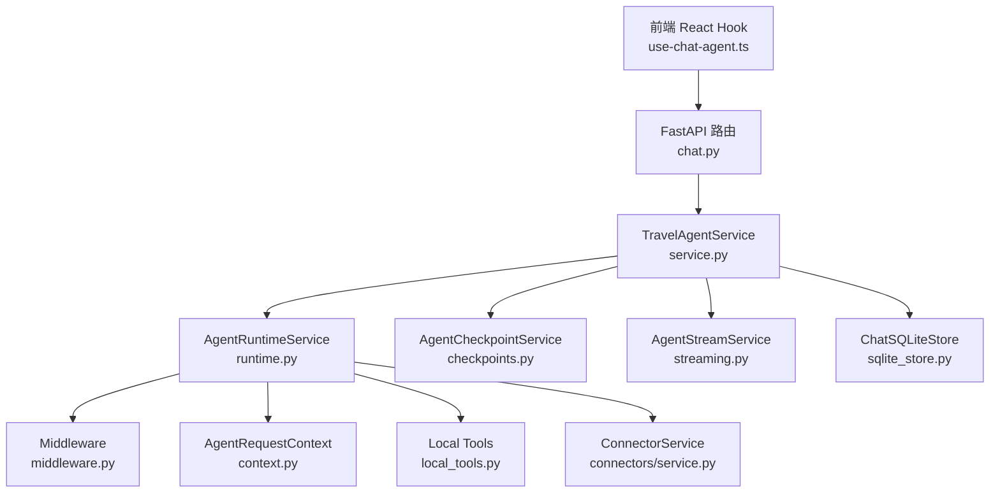
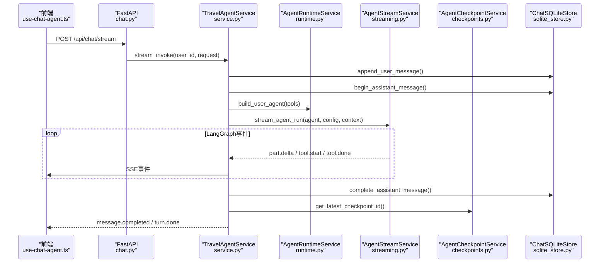
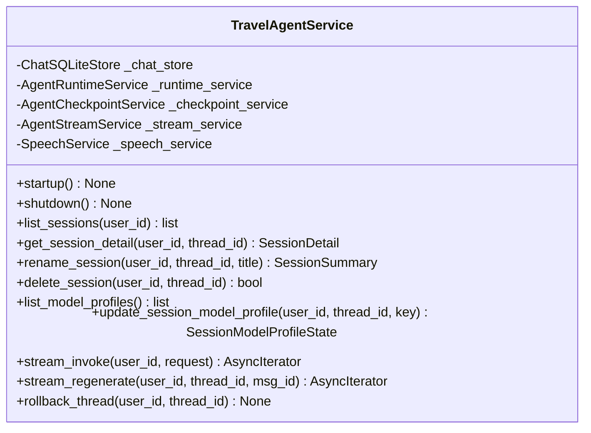
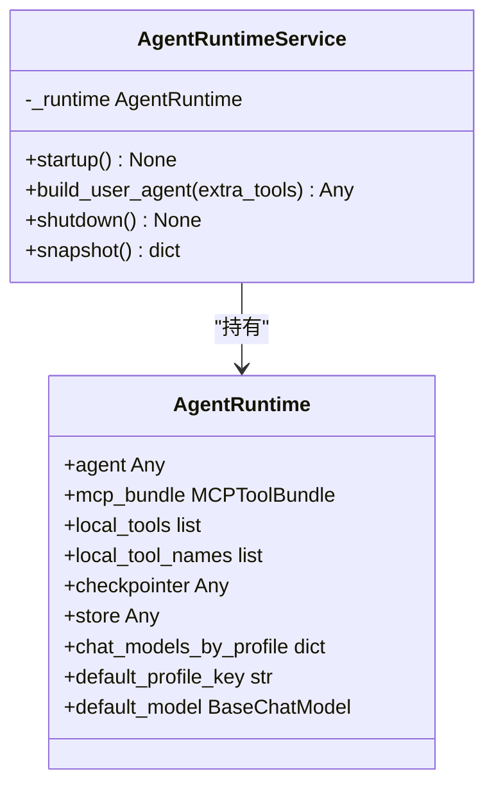
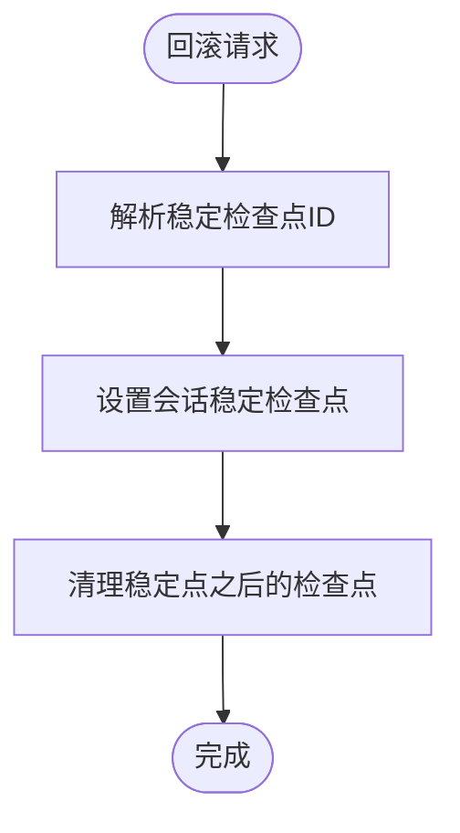
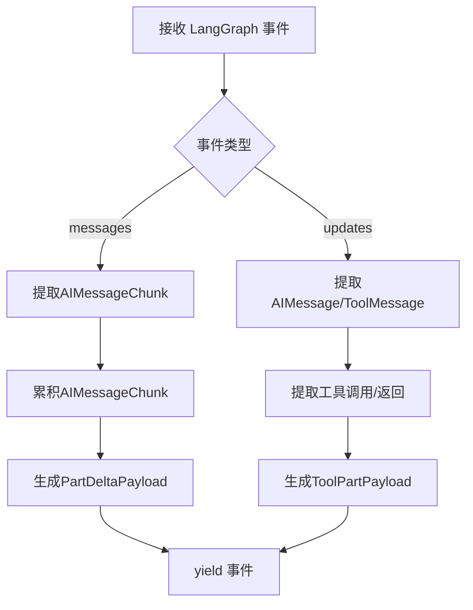
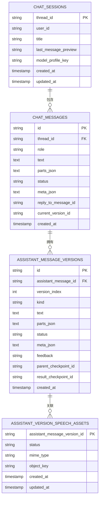
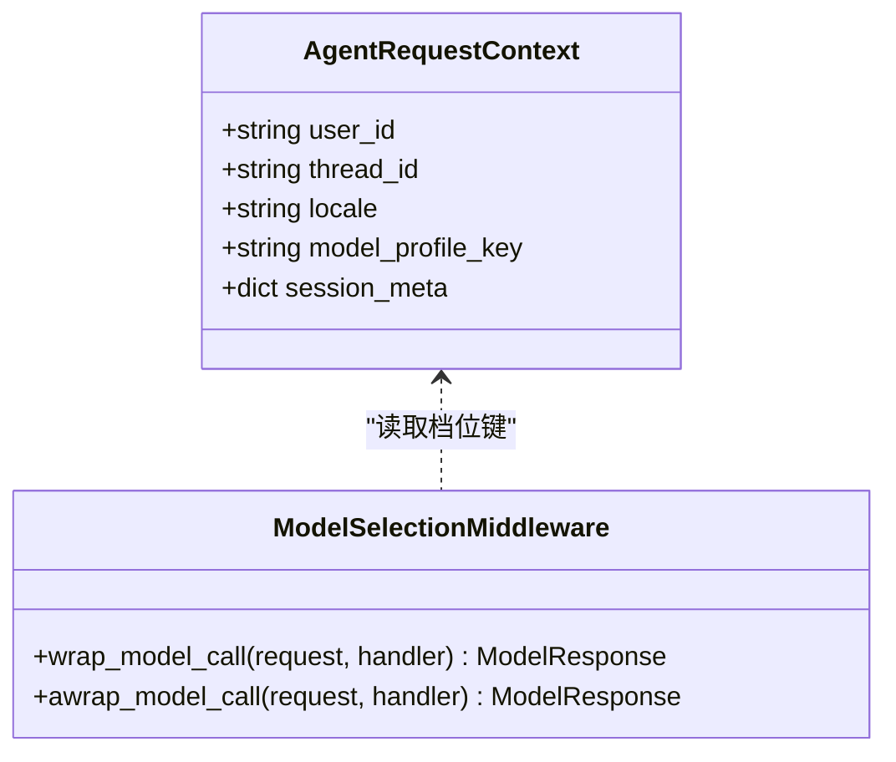
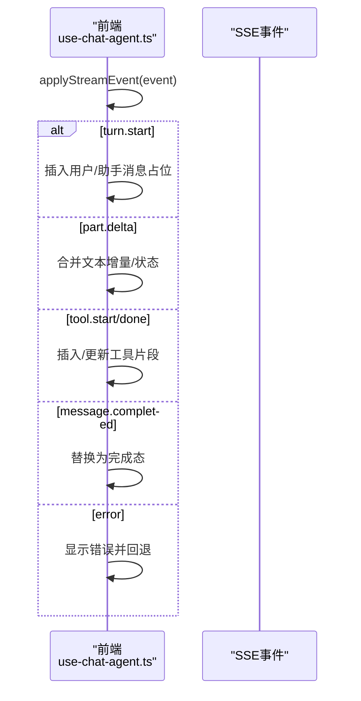
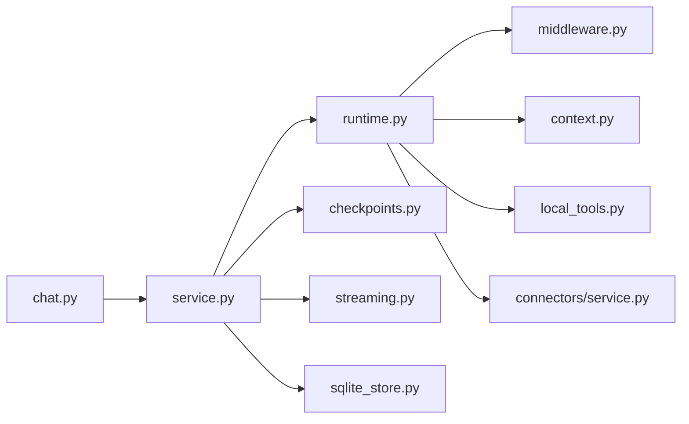

# 智能旅行Agent系统

<cite>
**本文档引用的文件**
- [service.py](file://backend/app/agent/service.py)
- [runtime.py](file://backend/app/agent/runtime.py)
- [checkpoints.py](file://backend/app/agent/checkpoints.py)
- [context.py](file://backend/app/agent/context.py)
- [middleware.py](file://backend/app/agent/middleware.py)
- [streaming.py](file://backend/app/agent/streaming.py)
- [sqlite_store.py](file://backend/app/memory/sqlite_store.py)
- [local_tools.py](file://backend/app/tool/local_tools.py)
- [service.py](file://backend/app/connectors/service.py)
- [chat.py](file://backend/app/api/chat.py)
- [chat.types.ts](file://frontend/src/features/chat/model/chat.types.ts)
- [use-chat-agent.ts](file://frontend/src/features/chat/hooks/use-chat-agent.ts)
- [system.py](file://backend/app/prompt/system.py)
- [main.py](file://backend/app/main.py)
- [test_agent_service.py](file://backend/tests/test_agent_service.py)
</cite>

## 目录
1. [简介](#简介)
2. [项目结构](#项目结构)
3. [核心组件](#核心组件)
4. [架构总览](#架构总览)
5. [详细组件分析](#详细组件分析)
6. [依赖关系分析](#依赖关系分析)
7. [性能考虑](#性能考虑)
8. [故障排除指南](#故障排除指南)
9. [结论](#结论)
10. [附录](#附录)

## 简介
本项目是一个基于LangGraph的智能旅行Agent系统，提供流式对话、工具调用编排、会话管理与检查点持久化能力。系统采用门面模式封装Agent服务，通过运行时装配与中间件实现模型档位切换、动态系统提示词注入与工具错误边界处理，并通过SQLite存储实现会话与版本管理，结合前端React Hook实现流畅的SSE事件消费与UI更新。

## 项目结构
后端采用分层架构：
- API层：FastAPI路由，负责SSE流式响应与模型档位查询
- 服务层：TravelAgentService门面，协调运行时、检查点、流式与语音服务
- 运行时层：AgentRuntimeService装配LangGraph Agent与MCP工具
- 存储层：ChatSQLiteStore管理会话、消息与版本
- 中间件层：动态系统提示词、模型档位选择与工具错误边界
- 工具层：本地工具与MCP连接器工具

**图表来源**
- [chat.py:1-72](file://backend/app/api/chat.py#L1-L72)
- [service.py:1-529](file://backend/app/agent/service.py#L1-L529)
- [runtime.py:1-174](file://backend/app/agent/runtime.py#L1-L174)
- [checkpoints.py:1-106](file://backend/app/agent/checkpoints.py#L1-L106)
- [streaming.py:1-680](file://backend/app/agent/streaming.py#L1-L680)
- [sqlite_store.py:1-800](file://backend/app/memory/sqlite_store.py#L1-L800)
- [middleware.py:1-211](file://backend/app/agent/middleware.py#L1-L211)
- [context.py:1-22](file://backend/app/agent/context.py#L1-L22)
- [local_tools.py:1-56](file://backend/app/tool/local_tools.py#L1-L56)
- [service.py:1-407](file://backend/app/connectors/service.py#L1-L407)
- [use-chat-agent.ts:1-596](file://frontend/src/features/chat/hooks/use-chat-agent.ts#L1-L596)

**章节来源**
- [main.py:1-54](file://backend/app/main.py#L1-L54)
- [chat.py:1-72](file://backend/app/api/chat.py#L1-L72)

## 核心组件
- 旅行Agent服务门面（TravelAgentService）：提供会话管理、模型档位切换、版本回滚、语音集成与流式调用编排
- Agent运行时服务（AgentRuntimeService）：装配LangGraph Agent、MCP工具与SQLite检查点
- 检查点服务（AgentCheckpointService）：定位稳定检查点、回滚与清理
- 流式服务（AgentStreamService）：LangGraph事件解析、UI片段累积与工具调用编排
- 会话存储（ChatSQLiteStore）：会话、消息、版本与语音资产持久化
- 中间件（Middleware）：动态系统提示词、模型档位选择与工具错误边界
- 请求上下文（AgentRequestContext）：单轮运行时上下文注入

**章节来源**
- [service.py:97-529](file://backend/app/agent/service.py#L97-L529)
- [runtime.py:61-174](file://backend/app/agent/runtime.py#L61-L174)
- [checkpoints.py:9-106](file://backend/app/agent/checkpoints.py#L9-L106)
- [streaming.py:74-680](file://backend/app/agent/streaming.py#L74-L680)
- [sqlite_store.py:123-800](file://backend/app/memory/sqlite_store.py#L123-L800)
- [middleware.py:1-211](file://backend/app/agent/middleware.py#L1-L211)
- [context.py:10-22](file://backend/app/agent/context.py#L10-L22)

## 架构总览
系统通过FastAPI暴露SSE接口，前端以Server-Sent Events消费事件流，后端以LangGraph执行Agent，中间件注入动态系统提示词与模型档位选择，工具调用通过updates事件驱动，messages事件驱动文本增量流式输出。

**图表来源**
- [chat.py:41-72](file://backend/app/api/chat.py#L41-L72)
- [service.py:373-507](file://backend/app/agent/service.py#L373-L507)
- [runtime.py:117-132](file://backend/app/agent/runtime.py#L117-L132)
- [streaming.py:80-147](file://backend/app/agent/streaming.py#L80-L147)
- [sqlite_store.py:224-408](file://backend/app/memory/sqlite_store.py#L224-L408)
- [checkpoints.py:49-60](file://backend/app/agent/checkpoints.py#L49-L60)

## 详细组件分析

### TravelAgentService 门面模式与会话管理
- 门面职责：聚合运行时、检查点、流式与语音服务，提供统一API
- 会话管理：列表、详情、重命名、删除、模型档位切换、版本切换与反馈更新
- 生命周期：startup/shutdown，延迟初始化运行时
- 异常处理：统一记录流水线失败日志，失败时回滚并清理临时状态

**图表来源**
- [service.py:97-529](file://backend/app/agent/service.py#L97-L529)

**章节来源**
- [service.py:116-176](file://backend/app/agent/service.py#L116-L176)
- [service.py:178-211](file://backend/app/agent/service.py#L178-L211)
- [service.py:269-371](file://backend/app/agent/service.py#L269-L371)
- [service.py:373-507](file://backend/app/agent/service.py#L373-L507)

### AgentRuntimeService 运行时装配与模型档位切换
- 装配内容：本地工具、MCP工具、SQLite检查点、LangGraph Agent与中间件
- 模型档位：通过Middleware在请求阶段动态选择模型实例
- 快照：运行时状态快照用于健康检查

**图表来源**
- [runtime.py:31-115](file://backend/app/agent/runtime.py#L31-L115)
- [runtime.py:61-174](file://backend/app/agent/runtime.py#L61-L174)

**章节来源**
- [runtime.py:80-115](file://backend/app/agent/runtime.py#L80-L115)
- [runtime.py:117-132](file://backend/app/agent/runtime.py#L117-L132)
- [runtime.py:134-154](file://backend/app/agent/runtime.py#L134-L154)
- [runtime.py:156-174](file://backend/app/agent/runtime.py#L156-L174)

### AgentCheckpointService 检查点持久化与回滚
- 稳定检查点定位：优先业务完成态，其次数据库最新，最后根检查点
- 回滚：设置稳定检查点并清理后续半成品
- 删除：按线程删除LangGraph检查点

**图表来源**
- [checkpoints.py:23-30](file://backend/app/agent/checkpoints.py#L23-L30)
- [checkpoints.py:32-43](file://backend/app/agent/checkpoints.py#L32-L43)
- [checkpoints.py:62-105](file://backend/app/agent/checkpoints.py#L62-L105)

**章节来源**
- [checkpoints.py:16-21](file://backend/app/agent/checkpoints.py#L16-L21)
- [checkpoints.py:23-30](file://backend/app/agent/checkpoints.py#L23-L30)
- [checkpoints.py:32-43](file://backend/app/agent/checkpoints.py#L32-L43)
- [checkpoints.py:49-60](file://backend/app/agent/checkpoints.py#L49-L60)
- [checkpoints.py:62-105](file://backend/app/agent/checkpoints.py#L62-L105)

### AgentStreamService LangGraph事件解析与UI片段累积
- 事件来源：messages（LLM token增量）、updates（节点快照）
- 状态累积：StreamRunState累计AIMessageChunk、工具轨迹、UI片段、引用来源
- 工具编排：去重策略保证每个call_id只触发一次start/done
- 文本/思考/工具片段：统一转换为前端PartDeltaPayload/ToolPartPayload

**图表来源**
- [streaming.py:80-147](file://backend/app/agent/streaming.py#L80-L147)
- [streaming.py:151-183](file://backend/app/agent/streaming.py#L151-L183)
- [streaming.py:186-228](file://backend/app/agent/streaming.py#L186-L228)

**章节来源**
- [streaming.py:58-72](file://backend/app/agent/streaming.py#L58-L72)
- [streaming.py:151-183](file://backend/app/agent/streaming.py#L151-L183)
- [streaming.py:186-228](file://backend/app/agent/streaming.py#L186-L228)
- [streaming.py:261-306](file://backend/app/agent/streaming.py#L261-L306)
- [streaming.py:435-499](file://backend/app/agent/streaming.py#L435-L499)

### ChatSQLiteStore 会话与版本持久化
- 会话：创建、重命名、删除、模型档位绑定
- 消息：用户消息写入、助手消息占位、完成态写入与meta/parts序列化
- 版本：原始版本与重新生成版本，支持反馈与语音状态
- 语音：语音资产与播放URL生成

**图表来源**
- [sqlite_store.py:123-136](file://backend/app/memory/sqlite_store.py#L123-L136)
- [sqlite_store.py:224-278](file://backend/app/memory/sqlite_store.py#L224-L278)
- [sqlite_store.py:355-408](file://backend/app/memory/sqlite_store.py#L355-L408)
- [sqlite_store.py:543-591](file://backend/app/memory/sqlite_store.py#L543-L591)

**章节来源**
- [sqlite_store.py:182-222](file://backend/app/memory/sqlite_store.py#L182-L222)
- [sqlite_store.py:224-278](file://backend/app/memory/sqlite_store.py#L224-L278)
- [sqlite_store.py:355-408](file://backend/app/memory/sqlite_store.py#L355-L408)
- [sqlite_store.py:593-695](file://backend/app/memory/sqlite_store.py#L593-L695)

### Middleware 动态系统提示词与模型档位选择
- 动态系统提示词：注入当前时间、语言环境与会话元信息
- 模型档位选择：在请求阶段通过Middleware覆盖模型实例
- 工具错误边界：捕获工具异常并转换为ToolMessage，保留GraphInterrupt透传

**图表来源**
- [context.py:10-22](file://backend/app/agent/context.py#L10-L22)
- [middleware.py:133-191](file://backend/app/agent/middleware.py#L133-L191)

**章节来源**
- [middleware.py:66-91](file://backend/app/agent/middleware.py#L66-L91)
- [middleware.py:133-191](file://backend/app/agent/middleware.py#L133-L191)
- [middleware.py:111-131](file://backend/app/agent/middleware.py#L111-L131)
- [system.py:7-105](file://backend/app/prompt/system.py#L7-L105)

### 前端集成与事件消费
- 事件映射：turn.start、part.delta、tool.start/done、message.completed、turn.done、error
- UI更新：文本/思考片段增量合并、工具片段插入与状态更新
- 交互：停止生成、重新生成、版本切换、反馈

**图表来源**
- [use-chat-agent.ts:288-382](file://frontend/src/features/chat/hooks/use-chat-agent.ts#L288-L382)
- [chat.types.ts:84-130](file://frontend/src/features/chat/model/chat.types.ts#L84-L130)

**章节来源**
- [use-chat-agent.ts:396-458](file://frontend/src/features/chat/hooks/use-chat-agent.ts#L396-L458)
- [use-chat-agent.ts:478-533](file://frontend/src/features/chat/hooks/use-chat-agent.ts#L478-L533)
- [chat.types.ts:76-82](file://frontend/src/features/chat/model/chat.types.ts#L76-L82)

## 依赖关系分析
- 服务层依赖运行时、检查点、流式与存储服务
- 运行时依赖中间件、本地工具、MCP工具与SQLite检查点
- 流式服务依赖运行时与存储服务
- API层依赖服务层与认证依赖注入

**图表来源**
- [chat.py:16-19](file://backend/app/api/chat.py#L16-L19)
- [service.py:13-27](file://backend/app/agent/service.py#L13-L27)
- [runtime.py:12-21](file://backend/app/agent/runtime.py#L12-L21)

**章节来源**
- [service.py:13-27](file://backend/app/agent/service.py#L13-L27)
- [runtime.py:12-21](file://backend/app/agent/runtime.py#L12-L21)

## 性能考虑
- 流式事件分离：messages与updates分离降低冲突，提升事件处理确定性
- 去重策略：基于call_id的工具事件去重，避免重复触发与状态抖动
- 检查点清理：回滚后清理半成品检查点，减少数据库膨胀
- 模型档位选择：Middleware在请求末尾覆盖模型，避免bind_tools副作用
- 前端增量更新：仅更新受影响片段，减少DOM重绘

[本节为通用指导，无需特定文件引用]

## 故障排除指南
- SSE错误处理：API层捕获ValueError与通用异常，返回标准化错误事件
- 运行时失败日志：服务层记录chat.stream与chat.regenerate失败上下文
- 语音生成异常：失败时取消语音生成并回滚会话
- 会话回滚：发生异常时调用rollback_thread恢复到稳定检查点

**章节来源**
- [chat.py:55-61](file://backend/app/api/chat.py#L55-L61)
- [service.py:250-267](file://backend/app/agent/service.py#L250-L267)
- [service.py:444-482](file://backend/app/agent/service.py#L444-L482)
- [service.py:509-511](file://backend/app/agent/service.py#L509-L511)

## 结论
本系统通过门面模式将复杂Agent运行时、检查点与流式处理抽象为统一服务，结合动态系统提示词与模型档位切换，实现了灵活、可观测且可回滚的旅行Agent。前端以SSE事件驱动UI增量更新，提供流畅的交互体验。测试覆盖验证了事件流、推理文本持久化与运行时装配正确性。

[本节为总结，无需特定文件引用]

## 附录

### 代码示例路径
- 创建Agent实例与运行时装配
  - [runtime.py:80-115](file://backend/app/agent/runtime.py#L80-L115)
- 处理用户输入与流式输出
  - [service.py:373-507](file://backend/app/agent/service.py#L373-L507)
  - [streaming.py:80-147](file://backend/app/agent/streaming.py#L80-L147)
- 管理会话状态与版本
  - [sqlite_store.py:224-408](file://backend/app/memory/sqlite_store.py#L224-L408)
  - [service.py:178-188](file://backend/app/agent/service.py#L178-L188)
- 异常处理与回滚
  - [service.py:444-482](file://backend/app/agent/service.py#L444-L482)
  - [checkpoints.py:23-30](file://backend/app/agent/checkpoints.py#L23-L30)

**章节来源**
- [runtime.py:80-115](file://backend/app/agent/runtime.py#L80-L115)
- [service.py:373-507](file://backend/app/agent/service.py#L373-L507)
- [streaming.py:80-147](file://backend/app/agent/streaming.py#L80-L147)
- [sqlite_store.py:224-408](file://backend/app/memory/sqlite_store.py#L224-L408)
- [service.py:444-482](file://backend/app/agent/service.py#L444-L482)
- [checkpoints.py:23-30](file://backend/app/agent/checkpoints.py#L23-L30)