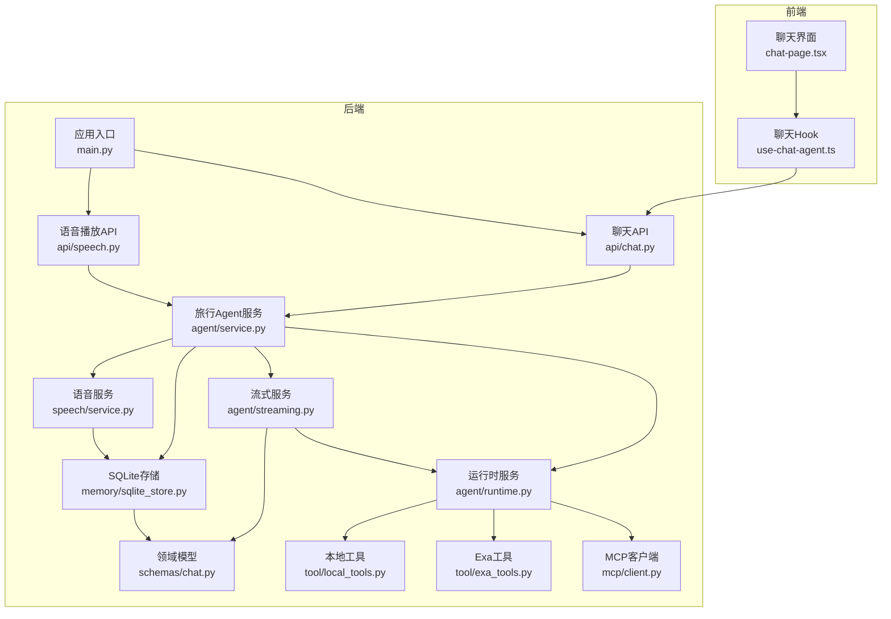
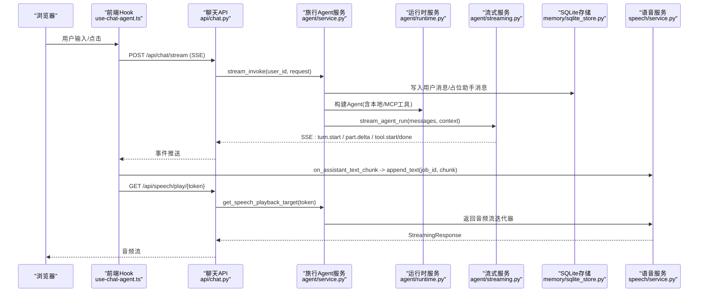
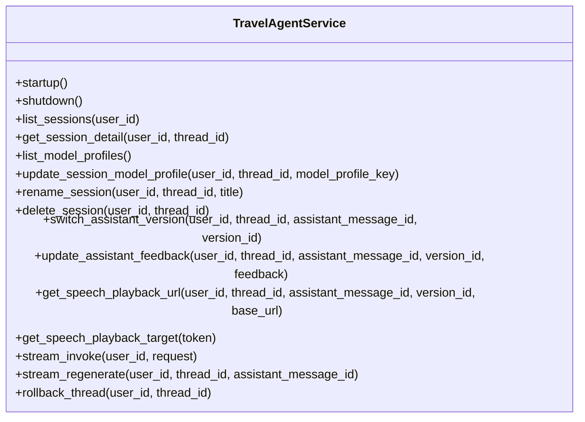
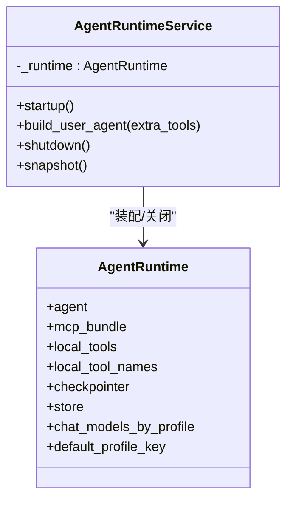
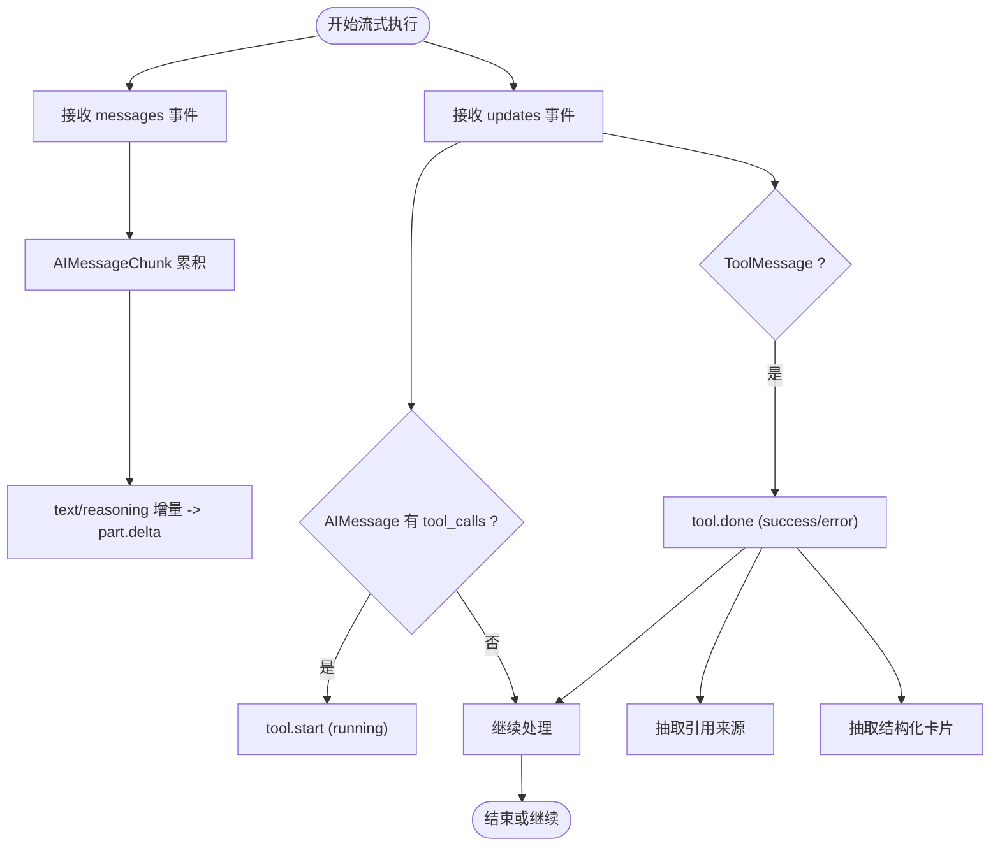
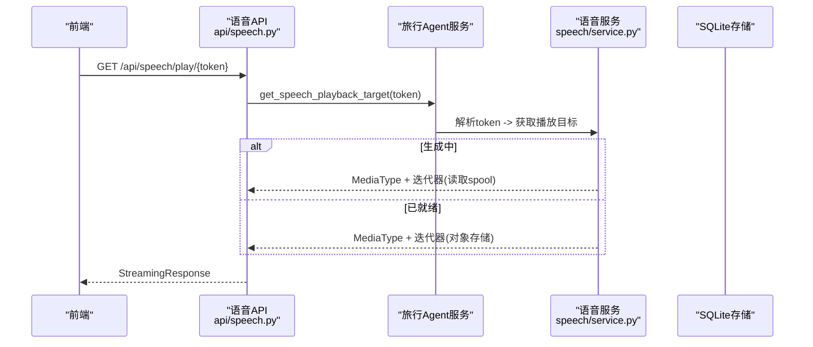
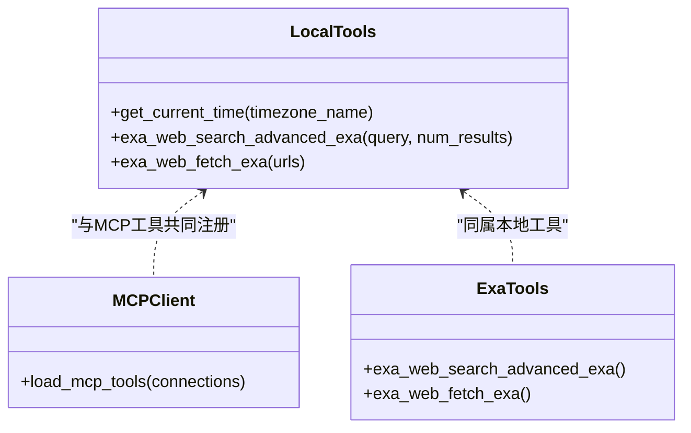
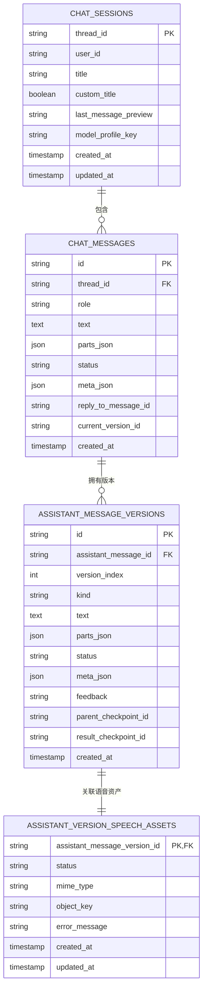
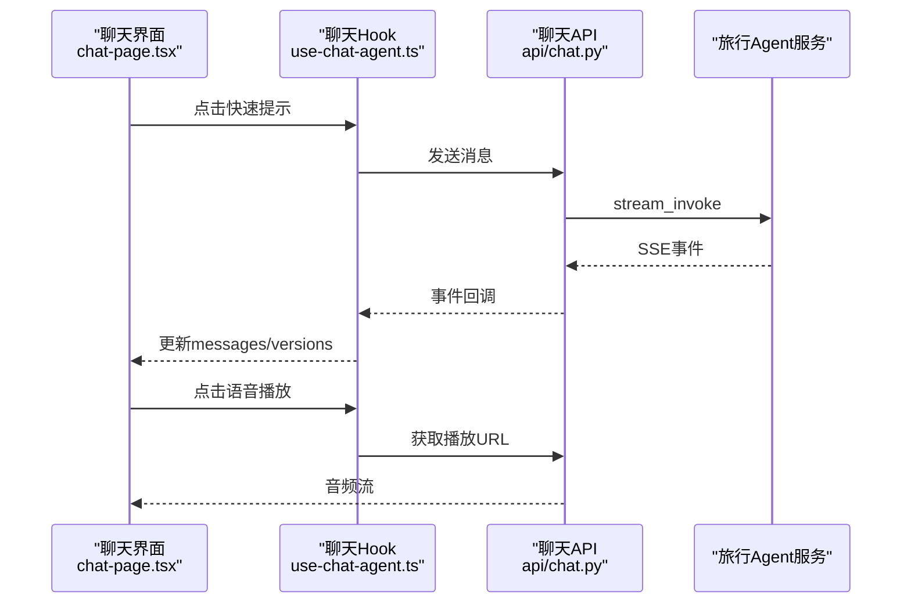
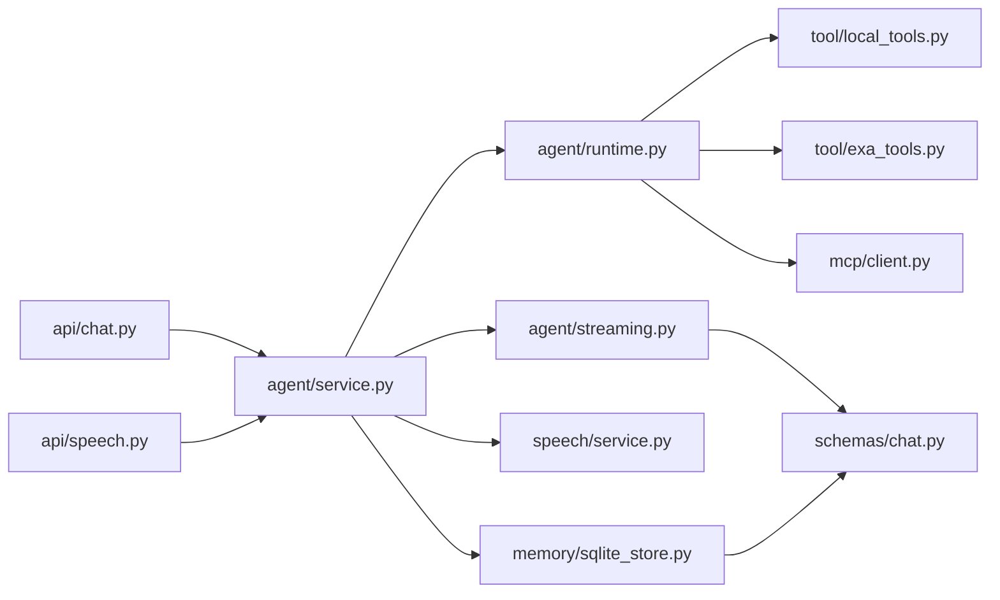

# 核心功能

<cite>
**本文引用的文件**
- [backend/app/main.py](file://backend/app/main.py)
- [backend/app/agent/service.py](file://backend/app/agent/service.py)
- [backend/app/agent/runtime.py](file://backend/app/agent/runtime.py)
- [backend/app/agent/streaming.py](file://backend/app/agent/streaming.py)
- [backend/app/agent/context.py](file://backend/app/agent/context.py)
- [backend/app/api/chat.py](file://backend/app/api/chat.py)
- [backend/app/api/speech.py](file://backend/app/api/speech.py)
- [backend/app/speech/service.py](file://backend/app/speech/service.py)
- [backend/app/tool/local_tools.py](file://backend/app/tool/local_tools.py)
- [backend/app/tool/exa_tools.py](file://backend/app/tool/exa_tools.py)
- [backend/app/mcp/client.py](file://backend/app/mcp/client.py)
- [backend/app/memory/sqlite_store.py](file://backend/app/memory/sqlite_store.py)
- [backend/app/schemas/chat.py](file://backend/app/schemas/chat.py)
- [frontend/src/features/chat/ui/chat-page.tsx](file://frontend/src/features/chat/ui/chat-page.tsx)
- [frontend/src/features/chat/hooks/use-chat-agent.ts](file://frontend/src/features/chat/hooks/use-chat-agent.ts)
</cite>

## 目录
1. [简介](#简介)
2. [项目结构](#项目结构)
3. [核心组件](#核心组件)
4. [架构总览](#架构总览)
5. [详细组件分析](#详细组件分析)
6. [依赖关系分析](#依赖关系分析)
7. [性能考量](#性能考量)
8. [故障排查指南](#故障排查指南)
9. [结论](#结论)
10. [附录](#附录)

## 简介
本文件面向AI旅行Agent的核心功能模块，系统化阐述其工作原理、会话管理、工具调用编排、流式响应处理、聊天交互设计、实时消息展示、快速提示、语音播放控制、语音服务系统、音频资产管理与播放机制，并提供使用示例与扩展指南。目标读者既包括后端工程师，也包括前端与产品同学。

## 项目结构
后端采用FastAPI应用入口，按领域分层组织：API层负责协议与SSE流式传输，服务层封装Agent业务编排，运行时装配LangGraph Agent与工具，内存与存储负责会话与消息持久化，语音服务负责TTS生成与播放，工具层提供本地与外部API工具，MCP客户端负责多服务器工具集成。

图表来源
- [backend/app/main.py:31-54](file://backend/app/main.py#L31-L54)
- [backend/app/api/chat.py:21-72](file://backend/app/api/chat.py#L21-L72)
- [backend/app/api/speech.py:12-35](file://backend/app/api/speech.py#L12-L35)
- [backend/app/agent/service.py:97-529](file://backend/app/agent/service.py#L97-L529)
- [backend/app/agent/runtime.py:61-174](file://backend/app/agent/runtime.py#L61-L174)
- [backend/app/agent/streaming.py:74-680](file://backend/app/agent/streaming.py#L74-L680)
- [backend/app/speech/service.py:90-477](file://backend/app/speech/service.py#L90-L477)
- [backend/app/memory/sqlite_store.py:123-800](file://backend/app/memory/sqlite_store.py#L123-L800)
- [backend/app/schemas/chat.py:18-274](file://backend/app/schemas/chat.py#L18-L274)
- [backend/app/tool/local_tools.py:49-56](file://backend/app/tool/local_tools.py#L49-L56)
- [backend/app/tool/exa_tools.py:190-216](file://backend/app/tool/exa_tools.py#L190-L216)
- [backend/app/mcp/client.py:32-69](file://backend/app/mcp/client.py#L32-L69)

章节来源
- [backend/app/main.py:31-54](file://backend/app/main.py#L31-L54)
- [backend/app/api/chat.py:21-72](file://backend/app/api/chat.py#L21-L72)
- [backend/app/api/speech.py:12-35](file://backend/app/api/speech.py#L12-L35)

## 核心组件
- 应用入口与路由：创建FastAPI实例，注册健康检查、认证、聊天、会话、语音等路由，并在生命周期中启动/关闭Agent服务。
- 旅行Agent服务：统一编排会话、运行时、流式、语音与检查点，提供流式聊天、重新生成、版本切换、反馈更新、语音播放等能力。
- Agent运行时：装配LangGraph Agent，聚合本地工具、MCP工具与SQLite检查点，支持按需构建带用户级工具的Agent。
- 流式服务：从LangGraph事件流中拆分messages与updates两类事件，分别处理LLM文本增量与工具调用/返回，累计状态并转换为前端可渲染的UI部件。
- 语音服务：基于DashScope TTS进行流式语音合成，异步写入磁盘与对象存储，提供JWT签发的短期播放令牌与实时播放流。
- 工具层：本地工具（如当前时间、Exa搜索/抓取）与MCP工具，统一注入Agent。
- 存储层：SQLite持久化会话、消息、版本、语音资产，支持会话列表、详情、重命名、删除、版本切换与反馈。
- 前端：SSE事件驱动的实时消息展示、快速提示、语音播放控制、会话历史管理与模型档位选择。

章节来源
- [backend/app/agent/service.py:97-529](file://backend/app/agent/service.py#L97-L529)
- [backend/app/agent/runtime.py:61-174](file://backend/app/agent/runtime.py#L61-L174)
- [backend/app/agent/streaming.py:74-680](file://backend/app/agent/streaming.py#L74-L680)
- [backend/app/speech/service.py:90-477](file://backend/app/speech/service.py#L90-L477)
- [backend/app/memory/sqlite_store.py:123-800](file://backend/app/memory/sqlite_store.py#L123-L800)

## 架构总览
下图展示了从浏览器到后端服务的端到端调用链，以及Agent内部的事件流与工具调用编排。

图表来源
- [frontend/src/features/chat/hooks/use-chat-agent.ts:396-458](file://frontend/src/features/chat/hooks/use-chat-agent.ts#L396-L458)
- [backend/app/api/chat.py:41-72](file://backend/app/api/chat.py#L41-L72)
- [backend/app/agent/service.py:373-508](file://backend/app/agent/service.py#L373-L508)
- [backend/app/agent/streaming.py:80-148](file://backend/app/agent/streaming.py#L80-L148)
- [backend/app/speech/service.py:270-296](file://backend/app/speech/service.py#L270-L296)

## 详细组件分析

### 旅行Agent服务（TravelAgentService）
- 会话管理：列出会话、获取会话详情、重命名、删除（级联删除检查点与语音资产）、切换助手版本、更新反馈。
- 模型档位：按线程维度读取/更新模型档位，支持默认档位与显式请求档位解析。
- 流式聊天：写入用户消息，创建助手占位消息，启动语音生成任务，绑定生成任务到版本，流式推进事件，最终完成消息并设置稳定检查点。
- 重新生成：定位最新助手消息，基于父检查点重建版本，流式生成并完成。
- 语音集成：启动/追加/结束语音生成，绑定版本，生成播放URL，解析播放令牌。

图表来源
- [backend/app/agent/service.py:97-529](file://backend/app/agent/service.py#L97-L529)

章节来源
- [backend/app/agent/service.py:129-189](file://backend/app/agent/service.py#L129-L189)
- [backend/app/agent/service.py:269-372](file://backend/app/agent/service.py#L269-L372)
- [backend/app/agent/service.py:373-508](file://backend/app/agent/service.py#L373-L508)

### Agent运行时（AgentRuntimeService）
- 初始化：加载本地工具、MCP工具、SQLite检查点、多模型档位，创建默认Agent并注入中间件。
- 用户Agent构建：按需合并用户级MCP工具，复用检查点与中间件。
- 关闭：关闭MCP客户端与SQLite连接。

图表来源
- [backend/app/agent/runtime.py:61-174](file://backend/app/agent/runtime.py#L61-L174)

章节来源
- [backend/app/agent/runtime.py:80-155](file://backend/app/agent/runtime.py#L80-L155)

### 流式执行与事件累计（AgentStreamService）
- 事件拆分：messages通道仅消费AIMessageChunk，updates通道消费AIMessage与ToolMessage，分别映射到text/reasoning增量与tool事件。
- 状态累计：StreamRunState累计AIMessageChunk、工具追踪、UI部件、引用来源等，保证前后端一致的展示状态。
- 工具事件：基于call_id去重，首次called创建running工具part，返回returned填充output/status/sources/cards。
- 引用解析：从工具payload中抽取URL/标题，生成带索引的引用注解，用于文本锚定。

图表来源
- [backend/app/agent/streaming.py:80-229](file://backend/app/agent/streaming.py#L80-L229)
- [backend/app/agent/streaming.py:261-307](file://backend/app/agent/streaming.py#L261-L307)
- [backend/app/agent/streaming.py:435-500](file://backend/app/agent/streaming.py#L435-L500)
- [backend/app/agent/streaming.py:611-680](file://backend/app/agent/streaming.py#L611-L680)

章节来源
- [backend/app/agent/streaming.py:58-72](file://backend/app/agent/streaming.py#L58-L72)
- [backend/app/agent/streaming.py:151-229](file://backend/app/agent/streaming.py#L151-L229)

### 语音服务系统（SpeechService）
- 生成流程：启动生成任务，异步线程中接收文本片段，调用DashScope TTS写入spool文件，完成后上传对象存储并更新数据库状态。
- 播放控制：生成短期JWT令牌，解析后返回媒体类型与异步迭代器；支持生成中与就绪态两种播放路径。
- 清理回收：任务完成后清理spool文件，若无读者则彻底回收资源。

图表来源
- [backend/app/api/speech.py:15-35](file://backend/app/api/speech.py#L15-L35)
- [backend/app/speech/service.py:238-296](file://backend/app/speech/service.py#L238-L296)
- [backend/app/agent/service.py:190-211](file://backend/app/agent/service.py#L190-L211)

章节来源
- [backend/app/speech/service.py:145-237](file://backend/app/speech/service.py#L145-L237)
- [backend/app/speech/service.py:298-477](file://backend/app/speech/service.py#L298-L477)

### 工具集成系统
- 本地工具：当前时间（支持会话时区）、Exa高级搜索、Exa内容抓取。
- MCP工具：按配置连接多个MCP服务器，动态加载工具，记录连接状态与错误。
- 外部API：Exa工具通过HTTP客户端调用，统一错误包装与Artifact返回。

图表来源
- [backend/app/tool/local_tools.py:16-56](file://backend/app/tool/local_tools.py#L16-L56)
- [backend/app/tool/exa_tools.py:108-216](file://backend/app/tool/exa_tools.py#L108-L216)
- [backend/app/mcp/client.py:32-69](file://backend/app/mcp/client.py#L32-L69)

章节来源
- [backend/app/tool/local_tools.py:49-56](file://backend/app/tool/local_tools.py#L49-L56)
- [backend/app/tool/exa_tools.py:190-216](file://backend/app/tool/exa_tools.py#L190-L216)
- [backend/app/mcp/client.py:32-69](file://backend/app/mcp/client.py#L32-L69)

### 会话与消息持久化（SQLiteStore）
- 会话：创建/重命名/删除，按最近活跃时间排序，记录模型档位与最后消息预览。
- 消息：用户消息写入、助手占位消息创建、完整消息写入与版本管理，支持多版本与反馈。
- 语音资产：按版本记录生成状态、MIME类型、对象存储键与错误信息，支持批量删除。

图表来源
- [backend/app/memory/sqlite_store.py:123-800](file://backend/app/memory/sqlite_store.py#L123-L800)

章节来源
- [backend/app/memory/sqlite_store.py:182-409](file://backend/app/memory/sqlite_store.py#L182-L409)
- [backend/app/memory/sqlite_store.py:509-591](file://backend/app/memory/sqlite_store.py#L509-L591)

### 前端交互与实时展示
- 快速提示：内置“规划行程/查询天气/推荐景点/规划路线”四类快捷语句，一键发送。
- 实时消息：SSE事件驱动，支持text/reasoning增量、tool运行状态、message.completed与turn.done。
- 语音播放：点击播放/暂停，自动停止上一播放；遇到409冲突时刷新线程并重试。
- 会话管理：新建/打开/重命名/删除会话，模型档位切换，版本切换与反馈。

图表来源
- [frontend/src/features/chat/ui/chat-page.tsx:329-370](file://frontend/src/features/chat/ui/chat-page.tsx#L329-L370)
- [frontend/src/features/chat/hooks/use-chat-agent.ts:384-458](file://frontend/src/features/chat/hooks/use-chat-agent.ts#L384-L458)
- [backend/app/api/chat.py:41-72](file://backend/app/api/chat.py#L41-L72)

章节来源
- [frontend/src/features/chat/ui/chat-page.tsx:36-76](file://frontend/src/features/chat/ui/chat-page.tsx#L36-L76)
- [frontend/src/features/chat/ui/chat-page.tsx:329-370](file://frontend/src/features/chat/ui/chat-page.tsx#L329-L370)
- [frontend/src/features/chat/hooks/use-chat-agent.ts:288-382](file://frontend/src/features/chat/hooks/use-chat-agent.ts#L288-L382)

## 依赖关系分析
- 组件耦合：API层仅依赖服务层；服务层依赖运行时、流式、语音与存储；运行时依赖工具与MCP；流式依赖运行时与领域模型；语音依赖存储与对象存储；前端通过SSE与API交互。
- 外部依赖：DashScope TTS、Exa API、LangGraph/LangChain、SQLite、JWT。
- 潜在循环：未发现直接循环依赖；MCP客户端与工具通过运行时聚合，避免直接耦合。

图表来源
- [backend/app/api/chat.py:16-72](file://backend/app/api/chat.py#L16-L72)
- [backend/app/api/speech.py:9-35](file://backend/app/api/speech.py#L9-L35)
- [backend/app/agent/service.py:97-529](file://backend/app/agent/service.py#L97-L529)
- [backend/app/agent/runtime.py:61-174](file://backend/app/agent/runtime.py#L61-L174)
- [backend/app/agent/streaming.py:74-680](file://backend/app/agent/streaming.py#L74-L680)
- [backend/app/speech/service.py:90-477](file://backend/app/speech/service.py#L90-L477)
- [backend/app/memory/sqlite_store.py:123-800](file://backend/app/memory/sqlite_store.py#L123-L800)
- [backend/app/schemas/chat.py:18-274](file://backend/app/schemas/chat.py#L18-L274)

章节来源
- [backend/app/agent/service.py:116-124](file://backend/app/agent/service.py#L116-L124)
- [backend/app/agent/runtime.py:80-104](file://backend/app/agent/runtime.py#L80-L104)

## 性能考量
- 流式传输：SSE保持长连接，事件粒度细，前端可即时渲染text/reasoning与tool状态。
- 语音生成：异步线程写入spool文件，边生成边播放，降低首帧延迟；对象存储上传完成后切换就绪态。
- 数据库：SQLite按线程隔离，版本与语音资产独立表，减少锁争用；批量删除会话时先查询对象键再删除，避免级联删除带来的额外开销。
- 工具调用：MCP工具按需加载，本地工具与外部API工具统一抽象为ToolMessage，便于缓存与去重。

## 故障排查指南
- SSE错误：API层捕获异常并返回error事件；前端监听并显示错误消息。
- 语音播放：401无效token、404资源不存在、409生成中不可播放；前端收到409时刷新线程并重试。
- 生成中断：前端AbortController触发中断，后端将助手消息标记为stopped并回滚至最近检查点。
- Agent异常：服务层记录失败日志，包含用户ID、线程ID、模型档位、检查点ID，便于定位问题。

章节来源
- [backend/app/api/chat.py:54-62](file://backend/app/api/chat.py#L54-L62)
- [backend/app/api/speech.py:23-29](file://backend/app/api/speech.py#L23-L29)
- [backend/app/agent/service.py:444-482](file://backend/app/agent/service.py#L444-L482)

## 结论
本系统以LangGraph为核心，结合本地工具、MCP工具与外部API，实现了高扩展性的旅行Agent。通过SSE流式事件与SQLite持久化，兼顾实时性与可靠性；通过语音服务与播放控制，提供自然的人机交互体验。整体架构清晰、职责分离、易于扩展与维护。

## 附录

### 使用示例
- 启动应用：后端启动时自动初始化Agent运行时，注册路由并开放SSE与语音播放接口。
- 发送消息：前端通过SSE订阅/推送事件，实时展示text/reasoning与tool状态。
- 快速提示：点击“规划行程/查询天气/推荐景点/规划路线”，自动发送预设语句。
- 语音播放：点击消息旁的播放按钮，获取短期播放URL并播放音频流。
- 重新生成：仅对最新助手消息生效，基于父检查点重建版本并流式生成。
- 会话管理：新建/打开/重命名/删除会话，切换模型档位，版本切换与反馈。

章节来源
- [backend/app/main.py:31-54](file://backend/app/main.py#L31-L54)
- [frontend/src/features/chat/ui/chat-page.tsx:329-370](file://frontend/src/features/chat/ui/chat-page.tsx#L329-L370)
- [frontend/src/features/chat/hooks/use-chat-agent.ts:478-533](file://frontend/src/features/chat/hooks/use-chat-agent.ts#L478-L533)

### 扩展指南
- 新增本地工具：在本地工具模块添加@tool函数，返回ToolMessage或结构化数据，Agent运行时会自动注册。
- 集成MCP工具：在MCP配置中新增服务器连接，加载后自动注入Agent。
- 外部API工具：参考Exa工具的HTTP客户端封装与错误处理，统一返回ToolMessage与artifact。
- 自定义模型档位：在运行时配置多模型档位，前端通过模型档位列表选择，后端按档位选择对应ChatModel。
- 语音定制：调整DashScope TTS参数（模型、音色、格式），或替换为其他TTS服务，保持接口一致。

章节来源
- [backend/app/tool/local_tools.py:49-56](file://backend/app/tool/local_tools.py#L49-L56)
- [backend/app/tool/exa_tools.py:108-216](file://backend/app/tool/exa_tools.py#L108-L216)
- [backend/app/mcp/client.py:32-69](file://backend/app/mcp/client.py#L32-L69)
- [backend/app/agent/runtime.py:89-104](file://backend/app/agent/runtime.py#L89-L104)
- [backend/app/speech/service.py:112-126](file://backend/app/speech/service.py#L112-L126)