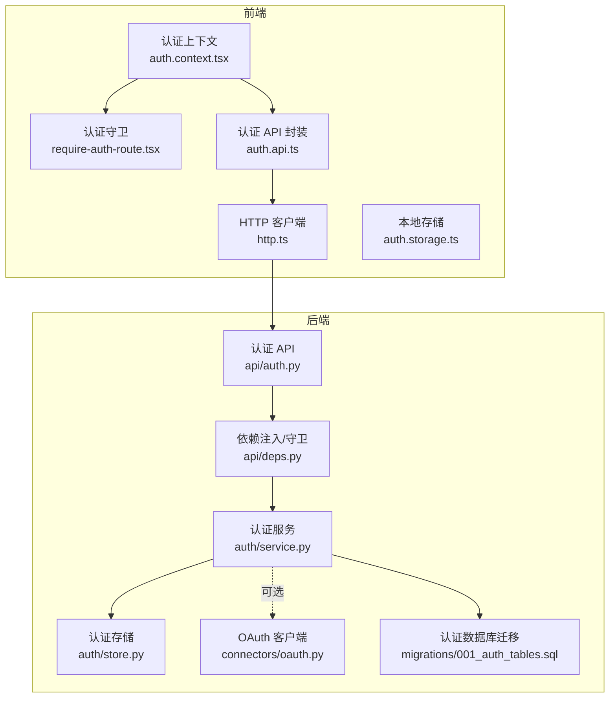
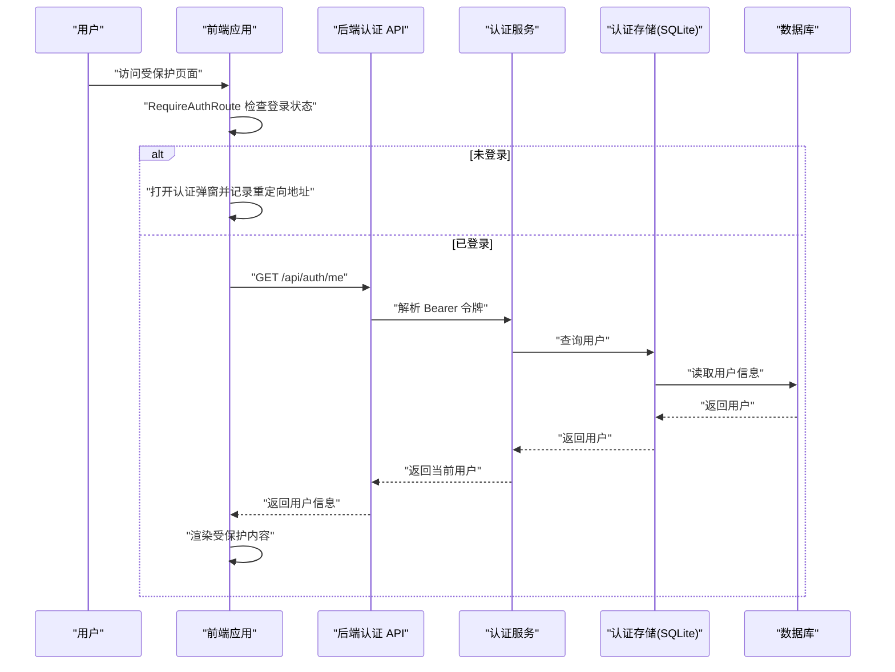
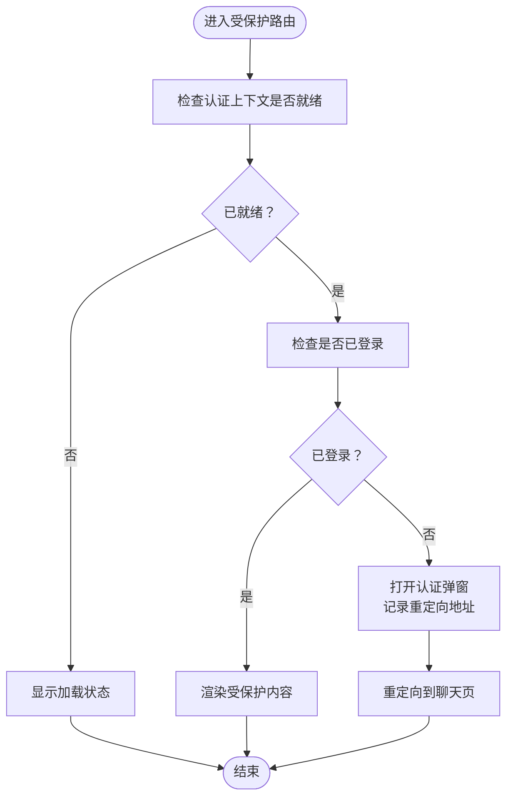
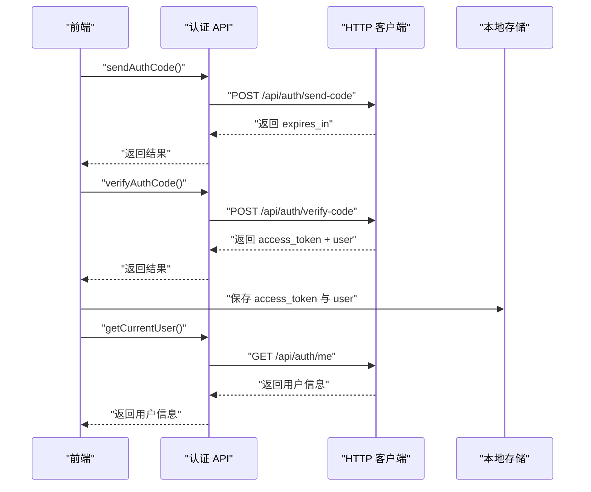
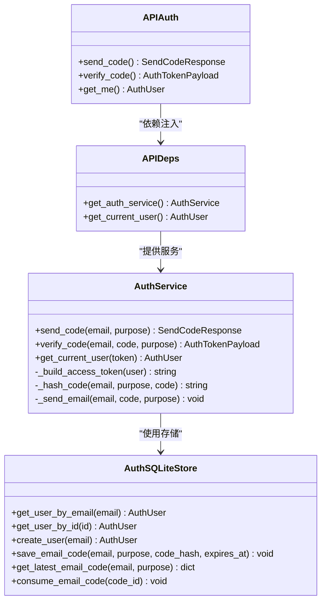
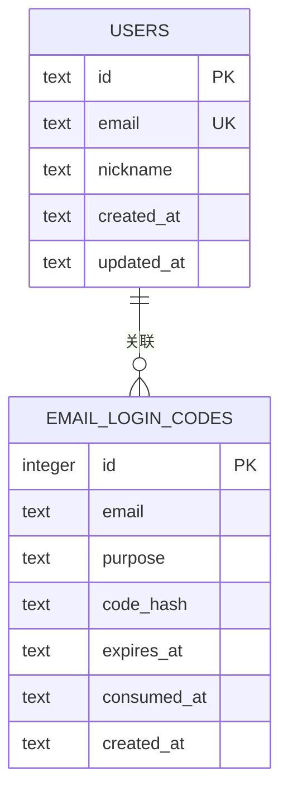
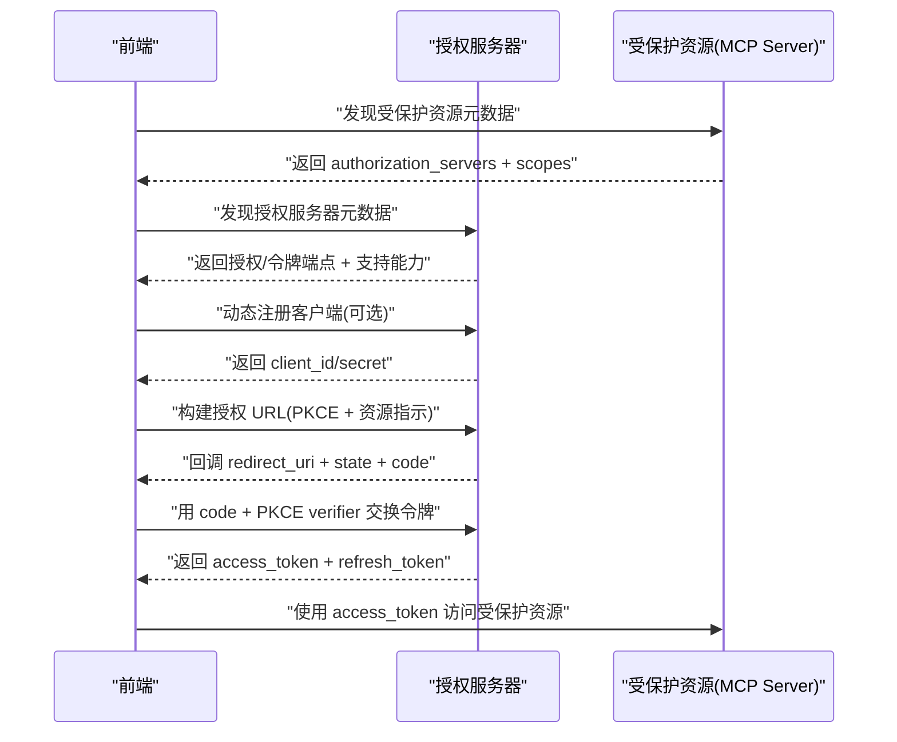
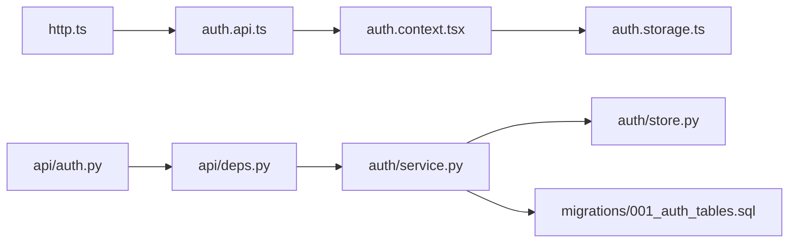
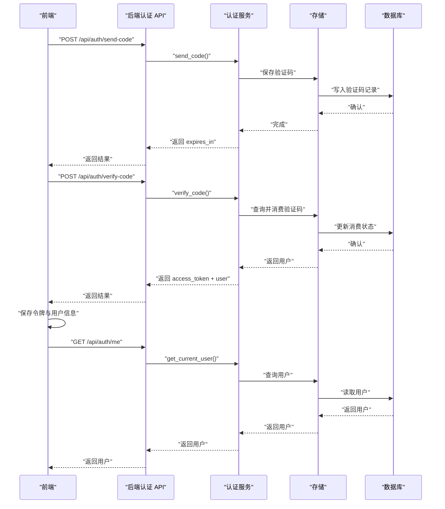

# 用户认证系统

<cite>
**本文引用的文件**
- [backend/app/auth/service.py](file://backend/app/auth/service.py)
- [backend/app/auth/store.py](file://backend/app/auth/store.py)
- [backend/app/connectors/oauth.py](file://backend/app/connectors/oauth.py)
- [backend/app/api/auth.py](file://backend/app/api/auth.py)
- [backend/app/api/deps.py](file://backend/app/api/deps.py)
- [backend/app/schemas/auth.py](file://backend/app/schemas/auth.py)
- [backend/migrations/001_auth_tables.sql](file://backend/migrations/001_auth_tables.sql)
- [frontend/src/features/auth/model/auth.context.tsx](file://frontend/src/features/auth/model/auth.context.tsx)
- [frontend/src/features/auth/model/auth.types.ts](file://frontend/src/features/auth/model/auth.types.ts)
- [frontend/src/features/auth/model/auth.storage.ts](file://frontend/src/features/auth/model/auth.storage.ts)
- [frontend/src/features/auth/api/auth.api.ts](file://frontend/src/features/auth/api/auth.api.ts)
- [frontend/src/features/auth/ui/require-auth-route.tsx](file://frontend/src/features/auth/ui/require-auth-route.tsx)
- [frontend/src/shared/lib/http.ts](file://frontend/src/shared/lib/http.ts)
- [backend/tests/test_auth_api.py](file://backend/tests/test_auth_api.py)
</cite>

## 目录
1. [简介](#简介)
2. [项目结构](#项目结构)
3. [核心组件](#核心组件)
4. [架构总览](#架构总览)
5. [组件详解](#组件详解)
6. [依赖关系分析](#依赖关系分析)
7. [性能考量](#性能考量)
8. [故障排查指南](#故障排查指南)
9. [结论](#结论)
10. [附录](#附录)

## 简介
本文件系统性梳理并说明用户认证系统的设计与实现，覆盖从前端认证上下文与路由保护，到后端认证服务与会话管理，再到 OAuth 流程与安全策略。文档重点解释：
- 邮箱验证码登录流程与 JWT 令牌管理
- 前端认证上下文、认证守卫与路由保护
- 后端认证服务、依赖注入与安全中间件
- OAuth 客户端流程（授权码、PKCE、令牌刷新）
- 认证 API 使用方法、错误处理与安全最佳实践
- 认证状态同步、令牌刷新与注销流程

## 项目结构
认证系统由前后端协同组成：
- 前端负责用户状态管理、认证守卫与路由保护，以及与后端 API 的交互封装
- 后端提供认证 API、JWT 校验与数据库存储，同时提供 OAuth 客户端能力

图表来源
- [frontend/src/features/auth/model/auth.context.tsx:1-155](file://frontend/src/features/auth/model/auth.context.tsx#L1-L155)
- [frontend/src/features/auth/ui/require-auth-route.tsx:1-35](file://frontend/src/features/auth/ui/require-auth-route.tsx#L1-L35)
- [frontend/src/features/auth/api/auth.api.ts:1-21](file://frontend/src/features/auth/api/auth.api.ts#L1-L21)
- [frontend/src/shared/lib/http.ts:1-75](file://frontend/src/shared/lib/http.ts#L1-L75)
- [backend/app/api/auth.py:1-36](file://backend/app/api/auth.py#L1-L36)
- [backend/app/api/deps.py:1-60](file://backend/app/api/deps.py#L1-L60)
- [backend/app/auth/service.py:1-312](file://backend/app/auth/service.py#L1-L312)
- [backend/app/auth/store.py:1-152](file://backend/app/auth/store.py#L1-L152)
- [backend/app/connectors/oauth.py:1-419](file://backend/app/connectors/oauth.py#L1-L419)
- [backend/migrations/001_auth_tables.sql:1-21](file://backend/migrations/001_auth_tables.sql#L1-L21)

章节来源
- [frontend/src/features/auth/model/auth.context.tsx:1-155](file://frontend/src/features/auth/model/auth.context.tsx#L1-L155)
- [frontend/src/features/auth/ui/require-auth-route.tsx:1-35](file://frontend/src/features/auth/ui/require-auth-route.tsx#L1-L35)
- [frontend/src/features/auth/api/auth.api.ts:1-21](file://frontend/src/features/auth/api/auth.api.ts#L1-L21)
- [frontend/src/shared/lib/http.ts:1-75](file://frontend/src/shared/lib/http.ts#L1-L75)
- [backend/app/api/auth.py:1-36](file://backend/app/api/auth.py#L1-L36)
- [backend/app/api/deps.py:1-60](file://backend/app/api/deps.py#L1-L60)
- [backend/app/auth/service.py:1-312](file://backend/app/auth/service.py#L1-L312)
- [backend/app/auth/store.py:1-152](file://backend/app/auth/store.py#L1-L152)
- [backend/app/connectors/oauth.py:1-419](file://backend/app/connectors/oauth.py#L1-L419)
- [backend/migrations/001_auth_tables.sql:1-21](file://backend/migrations/001_auth_tables.sql#L1-L21)

## 核心组件
- 前端认证上下文：负责用户状态、登录/登出、刷新用户信息、打开/关闭认证弹窗等
- 前端认证守卫与路由保护：在未登录时拦截并引导至认证弹窗
- 前端 HTTP 客户端：自动附加 Bearer 令牌，统一封装错误处理
- 后端认证 API：提供发送验证码、校验验证码、获取当前用户等接口
- 后端认证服务：生成/校验 JWT、管理验证码、用户持久化
- 后端依赖注入与守卫：解析 Bearer 令牌并注入当前用户
- 后端存储：SQLite 用户表与验证码表
- OAuth 客户端：实现授权发现、动态注册、授权码交换与令牌刷新

章节来源
- [frontend/src/features/auth/model/auth.context.tsx:1-155](file://frontend/src/features/auth/model/auth.context.tsx#L1-L155)
- [frontend/src/features/auth/ui/require-auth-route.tsx:1-35](file://frontend/src/features/auth/ui/require-auth-route.tsx#L1-L35)
- [frontend/src/shared/lib/http.ts:1-75](file://frontend/src/shared/lib/http.ts#L1-L75)
- [backend/app/api/auth.py:1-36](file://backend/app/api/auth.py#L1-L36)
- [backend/app/auth/service.py:1-312](file://backend/app/auth/service.py#L1-L312)
- [backend/app/api/deps.py:1-60](file://backend/app/api/deps.py#L1-L60)
- [backend/app/auth/store.py:1-152](file://backend/app/auth/store.py#L1-L152)
- [backend/migrations/001_auth_tables.sql:1-21](file://backend/migrations/001_auth_tables.sql#L1-L21)
- [backend/app/connectors/oauth.py:1-419](file://backend/app/connectors/oauth.py#L1-L419)

## 架构总览
下图展示了从用户登录到会话维护的完整流程，涵盖前端状态管理、后端认证服务与数据库交互。

图表来源
- [frontend/src/features/auth/ui/require-auth-route.tsx:1-35](file://frontend/src/features/auth/ui/require-auth-route.tsx#L1-L35)
- [frontend/src/features/auth/model/auth.context.tsx:1-155](file://frontend/src/features/auth/model/auth.context.tsx#L1-L155)
- [frontend/src/features/auth/api/auth.api.ts:1-21](file://frontend/src/features/auth/api/auth.api.ts#L1-L21)
- [frontend/src/shared/lib/http.ts:1-75](file://frontend/src/shared/lib/http.ts#L1-L75)
- [backend/app/api/auth.py:1-36](file://backend/app/api/auth.py#L1-L36)
- [backend/app/api/deps.py:1-60](file://backend/app/api/deps.py#L1-L60)
- [backend/app/auth/service.py:1-312](file://backend/app/auth/service.py#L1-L312)
- [backend/app/auth/store.py:1-152](file://backend/app/auth/store.py#L1-L152)

## 组件详解

### 前端认证上下文与路由保护
- 认证上下文提供用户状态、登录/登出、刷新用户信息、打开/关闭认证弹窗等能力
- 认证守卫在未登录时打开认证弹窗并记录重定向地址，登录成功后自动跳转
- HTTP 客户端自动附加 Bearer 令牌，统一封装错误处理

图表来源
- [frontend/src/features/auth/ui/require-auth-route.tsx:1-35](file://frontend/src/features/auth/ui/require-auth-route.tsx#L1-L35)
- [frontend/src/features/auth/model/auth.context.tsx:1-155](file://frontend/src/features/auth/model/auth.context.tsx#L1-L155)

章节来源
- [frontend/src/features/auth/model/auth.context.tsx:1-155](file://frontend/src/features/auth/model/auth.context.tsx#L1-L155)
- [frontend/src/features/auth/ui/require-auth-route.tsx:1-35](file://frontend/src/features/auth/ui/require-auth-route.tsx#L1-L35)
- [frontend/src/shared/lib/http.ts:1-75](file://frontend/src/shared/lib/http.ts#L1-L75)

### 前端认证 API 与本地存储
- 认证 API 封装发送验证码、校验验证码与获取当前用户
- 本地存储负责保存访问令牌与用户信息，支持会话恢复与注销清理

图表来源
- [frontend/src/features/auth/api/auth.api.ts:1-21](file://frontend/src/features/auth/api/auth.api.ts#L1-L21)
- [frontend/src/shared/lib/http.ts:1-75](file://frontend/src/shared/lib/http.ts#L1-L75)
- [frontend/src/features/auth/model/auth.storage.ts:1-87](file://frontend/src/features/auth/model/auth.storage.ts#L1-L87)

章节来源
- [frontend/src/features/auth/api/auth.api.ts:1-21](file://frontend/src/features/auth/api/auth.api.ts#L1-L21)
- [frontend/src/features/auth/model/auth.storage.ts:1-87](file://frontend/src/features/auth/model/auth.storage.ts#L1-L87)

### 后端认证服务与依赖注入
- 认证服务负责：
  - 邮箱规范化与验证码生成与哈希
  - 发送验证码邮件（SMTP 配置与错误映射）
  - 校验验证码并签发 JWT
  - 解析 JWT 获取当前用户
- 依赖注入提供全局单例服务与 Bearer 令牌守卫

图表来源
- [backend/app/auth/service.py:1-312](file://backend/app/auth/service.py#L1-L312)
- [backend/app/auth/store.py:1-152](file://backend/app/auth/store.py#L1-L152)
- [backend/app/api/auth.py:1-36](file://backend/app/api/auth.py#L1-L36)
- [backend/app/api/deps.py:1-60](file://backend/app/api/deps.py#L1-L60)

章节来源
- [backend/app/auth/service.py:1-312](file://backend/app/auth/service.py#L1-L312)
- [backend/app/auth/store.py:1-152](file://backend/app/auth/store.py#L1-L152)
- [backend/app/api/auth.py:1-36](file://backend/app/api/auth.py#L1-L36)
- [backend/app/api/deps.py:1-60](file://backend/app/api/deps.py#L1-L60)

### 数据模型与数据库
- 认证领域模型定义了用户、验证码请求/响应与令牌负载
- 数据库迁移脚本定义了用户表与验证码表结构

图表来源
- [backend/app/schemas/auth.py:1-51](file://backend/app/schemas/auth.py#L1-L51)
- [backend/migrations/001_auth_tables.sql:1-21](file://backend/migrations/001_auth_tables.sql#L1-L21)

章节来源
- [backend/app/schemas/auth.py:1-51](file://backend/app/schemas/auth.py#L1-L51)
- [backend/migrations/001_auth_tables.sql:1-21](file://backend/migrations/001_auth_tables.sql#L1-L21)

### OAuth 客户端流程
- 支持授权服务器元数据发现、动态客户端注册、PKCE 授权码交换与令牌刷新
- 提供资源标识符规范化与作用域合并策略

图表来源
- [backend/app/connectors/oauth.py:1-419](file://backend/app/connectors/oauth.py#L1-L419)

章节来源
- [backend/app/connectors/oauth.py:1-419](file://backend/app/connectors/oauth.py#L1-L419)

## 依赖关系分析
- 前端依赖于 HTTP 客户端与认证上下文，后者依赖本地存储
- 后端 API 通过依赖注入获取认证服务，认证服务依赖存储层
- 认证服务依赖 JWT 与 SMTP 配置，存储层依赖 SQLite

图表来源
- [frontend/src/shared/lib/http.ts:1-75](file://frontend/src/shared/lib/http.ts#L1-L75)
- [frontend/src/features/auth/api/auth.api.ts:1-21](file://frontend/src/features/auth/api/auth.api.ts#L1-L21)
- [frontend/src/features/auth/model/auth.context.tsx:1-155](file://frontend/src/features/auth/model/auth.context.tsx#L1-L155)
- [frontend/src/features/auth/model/auth.storage.ts:1-87](file://frontend/src/features/auth/model/auth.storage.ts#L1-L87)
- [backend/app/api/auth.py:1-36](file://backend/app/api/auth.py#L1-L36)
- [backend/app/api/deps.py:1-60](file://backend/app/api/deps.py#L1-L60)
- [backend/app/auth/service.py:1-312](file://backend/app/auth/service.py#L1-L312)
- [backend/app/auth/store.py:1-152](file://backend/app/auth/store.py#L1-L152)
- [backend/migrations/001_auth_tables.sql:1-21](file://backend/migrations/001_auth_tables.sql#L1-L21)

章节来源
- [frontend/src/shared/lib/http.ts:1-75](file://frontend/src/shared/lib/http.ts#L1-L75)
- [frontend/src/features/auth/api/auth.api.ts:1-21](file://frontend/src/features/auth/api/auth.api.ts#L1-L21)
- [frontend/src/features/auth/model/auth.context.tsx:1-155](file://frontend/src/features/auth/model/auth.context.tsx#L1-L155)
- [frontend/src/features/auth/model/auth.storage.ts:1-87](file://frontend/src/features/auth/model/auth.storage.ts#L1-L87)
- [backend/app/api/auth.py:1-36](file://backend/app/api/auth.py#L1-L36)
- [backend/app/api/deps.py:1-60](file://backend/app/api/deps.py#L1-L60)
- [backend/app/auth/service.py:1-312](file://backend/app/auth/service.py#L1-L312)
- [backend/app/auth/store.py:1-152](file://backend/app/auth/store.py#L1-L152)
- [backend/migrations/001_auth_tables.sql:1-21](file://backend/migrations/001_auth_tables.sql#L1-L21)

## 性能考量
- 前端
  - 使用本地存储缓存用户信息，减少重复请求
  - 在未登录时仅打开认证弹窗，避免不必要的网络请求
- 后端
  - 使用 LRU 缓存依赖注入的服务实例，降低重复初始化成本
  - JWT 解析与数据库查询均具备合理索引与最小字段选择
- OAuth
  - 异步 HTTP 客户端设置超时，避免阻塞
  - 令牌过期时间预留安全边界，减少临界过期风险

## 故障排查指南
- 前端
  - 未登录导致的路由拦截：确认认证守卫逻辑与认证弹窗状态
  - HTTP 错误处理：捕获 HttpError 并根据状态码提示用户
- 后端
  - SMTP 发送失败：检查主机、端口、用户名、密码与 TLS 模式配置
  - JWT 失效：确认密钥配置与令牌过期时间
  - 验证码问题：检查验证码哈希比较与过期时间
- 单元测试参考
  - CORS 预检限制与邮箱验证码发送/校验流程可通过测试用例验证

章节来源
- [frontend/src/shared/lib/http.ts:1-75](file://frontend/src/shared/lib/http.ts#L1-L75)
- [backend/app/auth/service.py:1-312](file://backend/app/auth/service.py#L1-L312)
- [backend/tests/test_auth_api.py:1-119](file://backend/tests/test_auth_api.py#L1-L119)

## 结论
本认证系统采用“邮箱验证码 + JWT”的轻量方案，结合前端认证上下文与路由守卫，实现了良好的用户体验与安全性。后端通过依赖注入与存储抽象，保证了服务的可维护性与扩展性。OAuth 客户端模块为后续接入外部授权服务器提供了标准化实现路径。建议在生产环境中强化令牌刷新策略、引入速率限制与更严格的会话管理，并持续监控 SMTP 与 OAuth 服务可用性。

## 附录

### 认证流程示例（从登录到会话维护）
- 前端触发发送验证码
- 后端生成验证码并落库，发送邮件
- 前端提交验证码，后端校验并通过后签发 JWT
- 前端保存令牌与用户信息
- 访问受保护路由时，前端携带令牌请求后端，后端解析并返回当前用户

图表来源
- [frontend/src/features/auth/api/auth.api.ts:1-21](file://frontend/src/features/auth/api/auth.api.ts#L1-L21)
- [backend/app/api/auth.py:1-36](file://backend/app/api/auth.py#L1-L36)
- [backend/app/auth/service.py:1-312](file://backend/app/auth/service.py#L1-L312)
- [backend/app/auth/store.py:1-152](file://backend/app/auth/store.py#L1-L152)

### 认证 API 使用方法与错误处理
- 发送验证码：POST /api/auth/send-code
- 校验验证码并登录/注册：POST /api/auth/verify-code
- 获取当前用户：GET /api/auth/me
- 错误处理：HTTP 客户端统一抛出 HttpError，前端根据状态码进行提示与重定向

章节来源
- [backend/app/api/auth.py:1-36](file://backend/app/api/auth.py#L1-L36)
- [frontend/src/shared/lib/http.ts:1-75](file://frontend/src/shared/lib/http.ts#L1-L75)

### 安全最佳实践
- JWT 密钥必须安全配置且定期轮换
- 验证码过期时间与一次性消费机制防止重放攻击
- SMTP 凭据与 TLS 配置需严格校验
- OAuth 流程启用 PKCE，令牌过期时间预留安全边界
- 前端只在内存中持有敏感令牌，避免长期驻留

### 认证状态同步、令牌刷新与注销
- 状态同步：应用启动时拉取当前用户信息，若令牌无效则清空本地状态
- 令牌刷新：当前实现为 JWT 过期后重新登录；如需长会话可扩展后端刷新接口
- 注销：清除本地存储的令牌与用户信息，重置分析埋点并关闭认证弹窗

章节来源
- [frontend/src/features/auth/model/auth.context.tsx:1-155](file://frontend/src/features/auth/model/auth.context.tsx#L1-L155)
- [frontend/src/features/auth/model/auth.storage.ts:1-87](file://frontend/src/features/auth/model/auth.storage.ts#L1-L87)