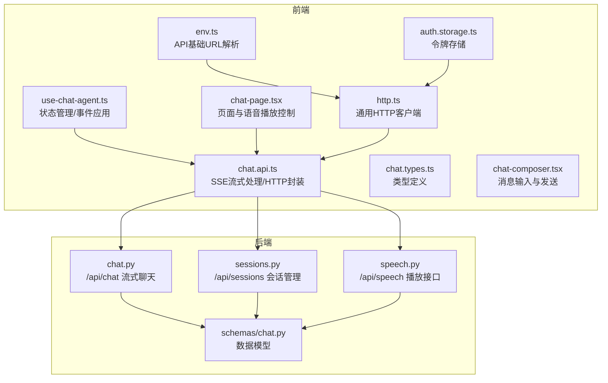
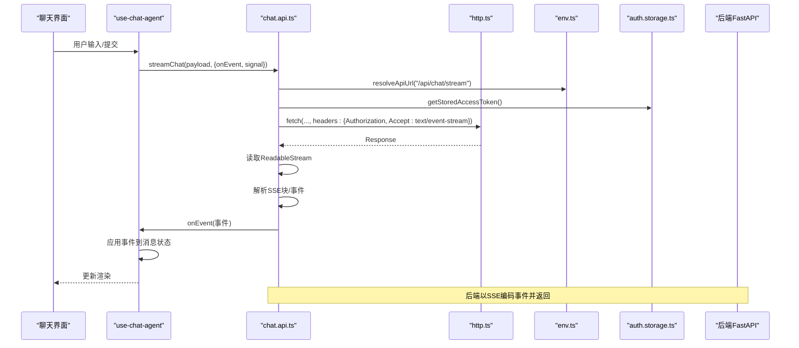
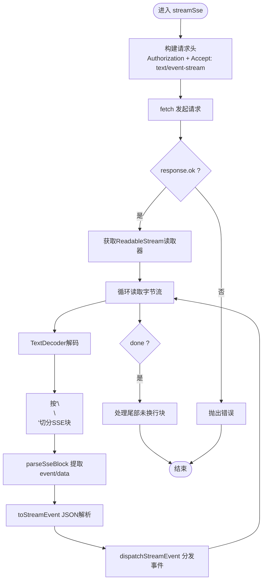
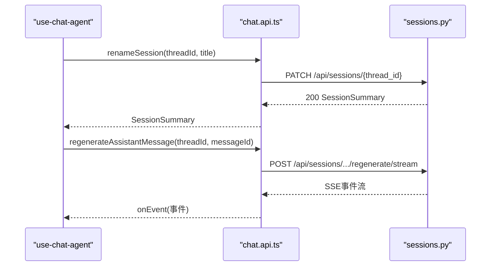
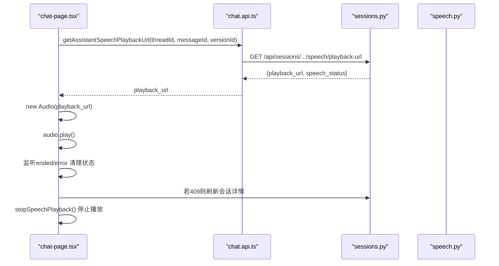
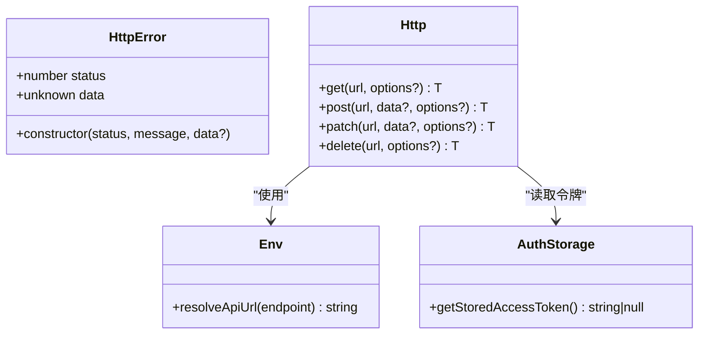
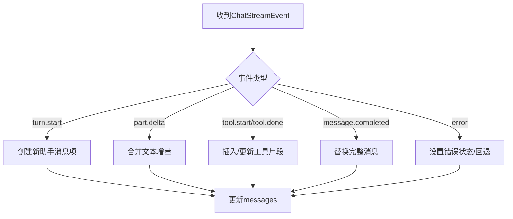
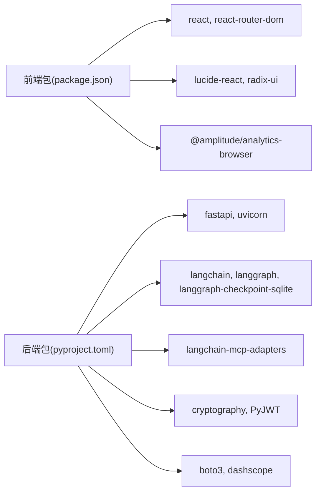

# 前端聊天API

<cite>
**本文档引用的文件**
- [frontend/src/features/chat/api/chat.api.ts](file://frontend/src/features/chat/api/chat.api.ts)
- [frontend/src/features/chat/hooks/use-chat-agent.ts](file://frontend/src/features/chat/hooks/use-chat-agent.ts)
- [frontend/src/features/chat/model/chat.types.ts](file://frontend/src/features/chat/model/chat.types.ts)
- [frontend/src/shared/lib/http.ts](file://frontend/src/shared/lib/http.ts)
- [frontend/src/shared/config/env.ts](file://frontend/src/shared/config/env.ts)
- [frontend/src/features/chat/ui/chat-page.tsx](file://frontend/src/features/chat/ui/chat-page.tsx)
- [frontend/src/features/chat/ui/chat-composer.tsx](file://frontend/src/features/chat/ui/chat-composer.tsx)
- [frontend/src/features/auth/model/auth.storage.ts](file://frontend/src/features/auth/model/auth.storage.ts)
- [backend/app/api/chat.py](file://backend/app/api/chat.py)
- [backend/app/api/sessions.py](file://backend/app/api/sessions.py)
- [backend/app/api/speech.py](file://backend/app/api/speech.py)
- [backend/app/schemas/chat.py](file://backend/app/schemas/chat.py)
- [frontend/package.json](file://frontend/package.json)
- [backend/pyproject.toml](file://backend/pyproject.toml)
</cite>

## 目录
1. [简介](#简介)
2. [项目结构](#项目结构)
3. [核心组件](#核心组件)
4. [架构总览](#架构总览)
5. [详细组件分析](#详细组件分析)
6. [依赖关系分析](#依赖关系分析)
7. [性能考量](#性能考量)
8. [故障排查指南](#故障排查指南)
9. [结论](#结论)
10. [附录](#附录)

## 简介
本文件系统性地梳理了前端聊天API的设计与实现，覆盖以下方面：
- 聊天消息发送与流式事件处理（SSE）
- 会话管理（创建、读取、重命名、删除、模型档位切换）
- 助手版本切换与反馈
- 语音播放（播放地址获取与音频播放控制）
- 客户端配置（环境变量、请求头、错误处理）
- 缓存策略、重试机制与超时处理
- 安全考虑与最佳实践

## 项目结构
前端采用React + TypeScript，后端采用FastAPI。聊天API主要位于前端features/chat目录，后端路由位于backend/app/api。

**图表来源**
- [frontend/src/features/chat/api/chat.api.ts:1-252](file://frontend/src/features/chat/api/chat.api.ts#L1-L252)
- [frontend/src/features/chat/hooks/use-chat-agent.ts:1-596](file://frontend/src/features/chat/hooks/use-chat-agent.ts#L1-L596)
- [frontend/src/features/chat/model/chat.types.ts:1-226](file://frontend/src/features/chat/model/chat.types.ts#L1-L226)
- [frontend/src/shared/lib/http.ts:1-75](file://frontend/src/shared/lib/http.ts#L1-L75)
- [frontend/src/shared/config/env.ts:1-48](file://frontend/src/shared/config/env.ts#L1-L48)
- [frontend/src/features/chat/ui/chat-page.tsx:1-741](file://frontend/src/features/chat/ui/chat-page.tsx#L1-L741)
- [frontend/src/features/chat/ui/chat-composer.tsx:1-156](file://frontend/src/features/chat/ui/chat-composer.tsx#L1-L156)
- [frontend/src/features/auth/model/auth.storage.ts:1-87](file://frontend/src/features/auth/model/auth.storage.ts#L1-L87)
- [backend/app/api/chat.py:1-72](file://backend/app/api/chat.py#L1-L72)
- [backend/app/api/sessions.py:1-197](file://backend/app/api/sessions.py#L1-L197)
- [backend/app/api/speech.py:1-35](file://backend/app/api/speech.py#L1-L35)
- [backend/app/schemas/chat.py:1-274](file://backend/app/schemas/chat.py#L1-L274)

**章节来源**
- [frontend/src/features/chat/api/chat.api.ts:1-252](file://frontend/src/features/chat/api/chat.api.ts#L1-L252)
- [backend/app/api/chat.py:1-72](file://backend/app/api/chat.py#L1-L72)

## 核心组件
- SSE流式聊天客户端：负责建立SSE连接、解析事件、调度UI更新。
- 会话管理客户端：提供会话列表、详情、重命名、删除、模型档位更新等REST接口。
- 助手版本与反馈：支持切换当前展示版本与点赞/点踩反馈。
- 语音播放：通过后端生成播放地址，前端控制播放与停止。
- HTTP客户端：统一封装fetch请求、错误处理与认证头注入。
- 环境配置：动态解析API基础URL，适配本地开发与生产部署。

**章节来源**
- [frontend/src/features/chat/api/chat.api.ts:107-252](file://frontend/src/features/chat/api/chat.api.ts#L107-L252)
- [frontend/src/shared/lib/http.ts:20-75](file://frontend/src/shared/lib/http.ts#L20-L75)
- [frontend/src/shared/config/env.ts:29-48](file://frontend/src/shared/config/env.ts#L29-L48)

## 架构总览
前端通过SSE与后端进行实时事件通信，后端基于LangGraph原生事件结构进行编码，前端仅做事件解析与UI应用。会话与语音播放通过REST接口完成。

**图表来源**
- [frontend/src/features/chat/api/chat.api.ts:115-180](file://frontend/src/features/chat/api/chat.api.ts#L115-L180)
- [frontend/src/features/chat/hooks/use-chat-agent.ts:410-458](file://frontend/src/features/chat/hooks/use-chat-agent.ts#L410-L458)
- [frontend/src/shared/lib/http.ts:20-65](file://frontend/src/shared/lib/http.ts#L20-L65)
- [frontend/src/shared/config/env.ts:29-47](file://frontend/src/shared/config/env.ts#L29-L47)
- [frontend/src/features/auth/model/auth.storage.ts:7-12](file://frontend/src/features/auth/model/auth.storage.ts#L7-L12)
- [backend/app/api/chat.py:41-72](file://backend/app/api/chat.py#L41-L72)

## 详细组件分析

### SSE流式聊天处理
- 事件名称白名单：turn.start、part.delta、tool.start、tool.done、message.completed、turn.done、error。
- 事件解析：逐块解析SSE，提取event与data，JSON反序列化为事件载荷。
- UI调度：在tool.start后等待下一帧绘制机会，保证工具执行反馈及时。
- 错误处理：HTTP非2xx抛出错误；SSE解析失败或未知事件名忽略；后端error事件映射到前端错误状态。

**图表来源**
- [frontend/src/features/chat/api/chat.api.ts:115-180](file://frontend/src/features/chat/api/chat.api.ts#L115-L180)
- [frontend/src/features/chat/api/chat.api.ts:47-86](file://frontend/src/features/chat/api/chat.api.ts#L47-L86)
- [frontend/src/features/chat/api/chat.api.ts:88-105](file://frontend/src/features/chat/api/chat.api.ts#L88-L105)

**章节来源**
- [frontend/src/features/chat/api/chat.api.ts:33-45](file://frontend/src/features/chat/api/chat.api.ts#L33-L45)
- [frontend/src/features/chat/api/chat.api.ts:47-86](file://frontend/src/features/chat/api/chat.api.ts#L47-L86)
- [frontend/src/features/chat/api/chat.api.ts:100-105](file://frontend/src/features/chat/api/chat.api.ts#L100-L105)
- [frontend/src/features/chat/api/chat.api.ts:115-180](file://frontend/src/features/chat/api/chat.api.ts#L115-L180)

### 会话管理API
- 列表：GET /api/sessions
- 详情：GET /api/sessions/{thread_id}
- 重命名：PATCH /api/sessions/{thread_id}
- 删除：DELETE /api/sessions/{thread_id}
- 模型档位更新：PATCH /api/sessions/{thread_id}/model-profile
- 重新生成：POST /api/sessions/{thread_id}/messages/{message_id}/regenerate/stream
- 版本切换：PATCH /api/sessions/{thread_id}/messages/{message_id}/current-version
- 反馈更新：PATCH /api/sessions/{thread_id}/messages/{message_id}/versions/{version_id}/feedback
- 语音播放地址：GET /api/sessions/{thread_id}/messages/{message_id}/versions/{version_id}/speech/playback-url

**图表来源**
- [frontend/src/features/chat/api/chat.api.ts:194-208](file://frontend/src/features/chat/api/chat.api.ts#L194-L208)
- [frontend/src/features/chat/api/chat.api.ts:182-192](file://frontend/src/features/chat/api/chat.api.ts#L182-L192)
- [frontend/src/features/chat/api/chat.api.ts:210-241](file://frontend/src/features/chat/api/chat.api.ts#L210-L241)
- [backend/app/api/sessions.py:37-101](file://backend/app/api/sessions.py#L37-L101)
- [backend/app/api/sessions.py:103-131](file://backend/app/api/sessions.py#L103-L131)
- [backend/app/api/sessions.py:134-167](file://backend/app/api/sessions.py#L134-L167)
- [backend/app/api/sessions.py:170-196](file://backend/app/api/sessions.py#L170-L196)

**章节来源**
- [frontend/src/features/chat/api/chat.api.ts:194-241](file://frontend/src/features/chat/api/chat.api.ts#L194-L241)
- [backend/app/api/sessions.py:37-196](file://backend/app/api/sessions.py#L37-L196)

### 语音播放与播放控制
- 获取播放地址：GET /api/sessions/{thread_id}/messages/{message_id}/versions/{version_id}/speech/playback-url
- 播放控制：前端创建HTMLAudioElement，播放结束后清理状态；遇到409冲突时刷新会话详情。
- 停止播放：暂停并清空当前音频资源。

**图表来源**
- [frontend/src/features/chat/api/chat.api.ts:243-251](file://frontend/src/features/chat/api/chat.api.ts#L243-L251)
- [frontend/src/features/chat/ui/chat-page.tsx:337-369](file://frontend/src/features/chat/ui/chat-page.tsx#L337-L369)
- [backend/app/api/sessions.py:170-196](file://backend/app/api/sessions.py#L170-L196)
- [backend/app/api/speech.py:15-35](file://backend/app/api/speech.py#L15-L35)

**章节来源**
- [frontend/src/features/chat/ui/chat-page.tsx:337-369](file://frontend/src/features/chat/ui/chat-page.tsx#L337-L369)
- [frontend/src/features/chat/api/chat.api.ts:243-251](file://frontend/src/features/chat/api/chat.api.ts#L243-L251)

### HTTP客户端与请求头
- 统一错误类：HttpError，包含status与data。
- 自动注入：Authorization头来自localStorage中的访问令牌；支持查询参数拼接。
- 空响应：204返回空对象；非2xx抛出HttpError。
- 环境解析：resolveApiUrl根据配置与当前页面自动决定基础URL，避免跨域与反代问题。

**图表来源**
- [frontend/src/shared/lib/http.ts:8-18](file://frontend/src/shared/lib/http.ts#L8-L18)
- [frontend/src/shared/lib/http.ts:20-75](file://frontend/src/shared/lib/http.ts#L20-L75)
- [frontend/src/shared/config/env.ts:29-47](file://frontend/src/shared/config/env.ts#L29-L47)
- [frontend/src/features/auth/model/auth.storage.ts:7-12](file://frontend/src/features/auth/model/auth.storage.ts#L7-L12)

**章节来源**
- [frontend/src/shared/lib/http.ts:20-65](file://frontend/src/shared/lib/http.ts#L20-L65)
- [frontend/src/shared/config/env.ts:29-47](file://frontend/src/shared/config/env.ts#L29-L47)
- [frontend/src/features/auth/model/auth.storage.ts:7-12](file://frontend/src/features/auth/model/auth.storage.ts#L7-L12)

### 事件应用与状态管理
- 事件应用：turn.start创建新消息；part.delta增量拼接到文本片段；tool.start/ done插入/更新工具片段；message.completed替换完整消息；error设置错误状态。
- 交互能力：停止生成、重新生成最新助手消息、切换助手版本、设置反馈、重试上次消息。
- 会话同步：每次请求后刷新会话列表，确保UI一致性。

**图表来源**
- [frontend/src/features/chat/hooks/use-chat-agent.ts:288-382](file://frontend/src/features/chat/hooks/use-chat-agent.ts#L288-L382)

**章节来源**
- [frontend/src/features/chat/hooks/use-chat-agent.ts:288-382](file://frontend/src/features/chat/hooks/use-chat-agent.ts#L288-L382)
- [frontend/src/features/chat/hooks/use-chat-agent.ts:478-533](file://frontend/src/features/chat/hooks/use-chat-agent.ts#L478-L533)

## 依赖关系分析
- 前端依赖：React、React Router、Tailwind UI组件库、Amplitude分析库等。
- 后端依赖：FastAPI、Uvicorn、Pydantic、LangChain/LangGraph、MCP适配器、Cryptography、Boto3等。

**图表来源**
- [frontend/package.json:14-34](file://frontend/package.json#L14-L34)
- [backend/pyproject.toml:6-24](file://backend/pyproject.toml#L6-L24)

**章节来源**
- [frontend/package.json:14-34](file://frontend/package.json#L14-L34)
- [backend/pyproject.toml:6-24](file://backend/pyproject.toml#L6-L24)

## 性能考量
- 流式渲染：在工具开始事件后等待下一帧绘制，减少UI抖动，提升感知性能。
- 事件解析：按块解析SSE，避免一次性解析大段文本，降低内存峰值。
- 会话预取：初始化时拉取模型档位与会话列表，减少首次渲染等待。
- 语音播放：播放完成后清理资源，避免内存泄漏；409冲突时刷新会话详情，避免重复请求。

**章节来源**
- [frontend/src/features/chat/api/chat.api.ts:88-105](file://frontend/src/features/chat/api/chat.api.ts#L88-L105)
- [frontend/src/features/chat/hooks/use-chat-agent.ts:206-214](file://frontend/src/features/chat/hooks/use-chat-agent.ts#L206-L214)
- [frontend/src/features/chat/ui/chat-page.tsx:206-225](file://frontend/src/features/chat/ui/chat-page.tsx#L206-L225)

## 故障排查指南
- SSE连接失败
  - 检查网络与CORS配置；确认后端SSE头部正确设置。
  - 查看前端错误：HTTP非2xx或浏览器不支持ReadableStream。
- 事件解析异常
  - 确认事件名为已知白名单；检查JSON载荷格式。
- 认证失败
  - 确认localStorage中存在有效访问令牌；检查后端路由是否需要认证。
- 语音播放409冲突
  - 后端提示语音仍在生成或状态不一致，刷新会话详情后再试。
- 请求被中断
  - 使用AbortController中断请求；前端会将消息状态标记为stopped。

**章节来源**
- [frontend/src/features/chat/api/chat.api.ts:128-135](file://frontend/src/features/chat/api/chat.api.ts#L128-L135)
- [frontend/src/features/chat/api/chat.api.ts:160-167](file://frontend/src/features/chat/api/chat.api.ts#L160-L167)
- [frontend/src/shared/lib/http.ts:45-57](file://frontend/src/shared/lib/http.ts#L45-L57)
- [frontend/src/features/auth/model/auth.storage.ts:7-12](file://frontend/src/features/auth/model/auth.storage.ts#L7-L12)
- [frontend/src/features/chat/ui/chat-page.tsx:365-368](file://frontend/src/features/chat/ui/chat-page.tsx#L365-L368)

## 结论
该聊天API通过SSE实现了低延迟、高并发的流式交互体验，配合完善的会话管理与语音播放能力，满足旅行场景下的多模态需求。前端通过统一的HTTP客户端与事件应用逻辑，确保了良好的可维护性与扩展性。

## 附录

### API调用示例（路径参考）
- 发送消息并接收SSE事件
  - [streamChat:107-109](file://frontend/src/features/chat/api/chat.api.ts#L107-L109)
  - [streamSse:115-180](file://frontend/src/features/chat/api/chat.api.ts#L115-L180)
- 会话管理
  - [listSessions:194-196](file://frontend/src/features/chat/api/chat.api.ts#L194-L196)
  - [getSession:198-200](file://frontend/src/features/chat/api/chat.api.ts#L198-L200)
  - [renameSession:202-204](file://frontend/src/features/chat/api/chat.api.ts#L202-L204)
  - [deleteSession:206-208](file://frontend/src/features/chat/api/chat.api.ts#L206-L208)
  - [updateSessionModelProfile:210-218](file://frontend/src/features/chat/api/chat.api.ts#L210-L218)
- 助手版本与反馈
  - [switchAssistantVersion:220-229](file://frontend/src/features/chat/api/chat.api.ts#L220-L229)
  - [updateAssistantFeedback:231-241](file://frontend/src/features/chat/api/chat.api.ts#L231-L241)
- 语音播放
  - [getAssistantSpeechPlaybackUrl:243-251](file://frontend/src/features/chat/api/chat.api.ts#L243-L251)
  - [chat-page.tsx 播放控制:337-369](file://frontend/src/features/chat/ui/chat-page.tsx#L337-L369)

### 类型定义概览
- 事件与消息
  - [ChatStreamEvent:84-131](file://frontend/src/features/chat/model/chat.types.ts#L84-L131)
  - [PersistedChatMessage:146-158](file://frontend/src/features/chat/model/chat.types.ts#L146-L158)
- 会话与模型档位
  - [SessionSummary/Detail:160-175](file://frontend/src/features/chat/model/chat.types.ts#L160-L175)
  - [ChatModelProfile/ListChatModelProfilesResponse:179-189](file://frontend/src/features/chat/model/chat.types.ts#L179-L189)
- 语音播放
  - [SpeechPlaybackUrlResponse:208-211](file://frontend/src/features/chat/model/chat.types.ts#L208-L211)