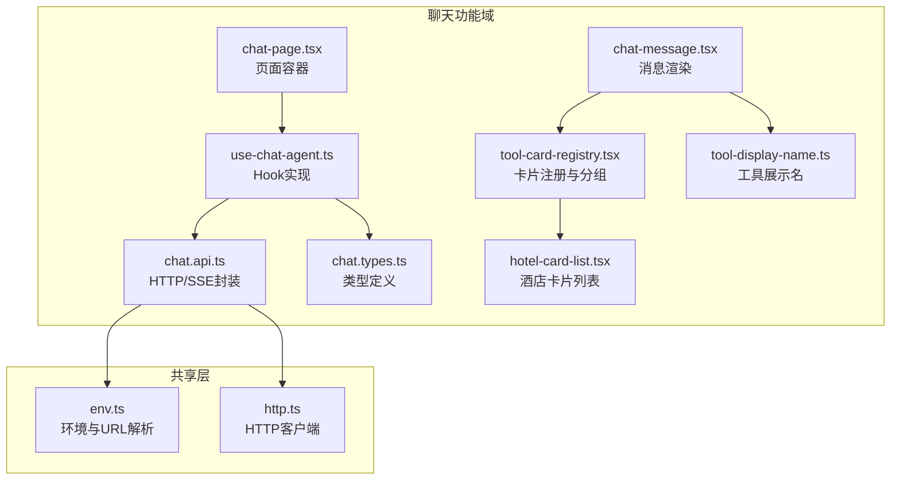
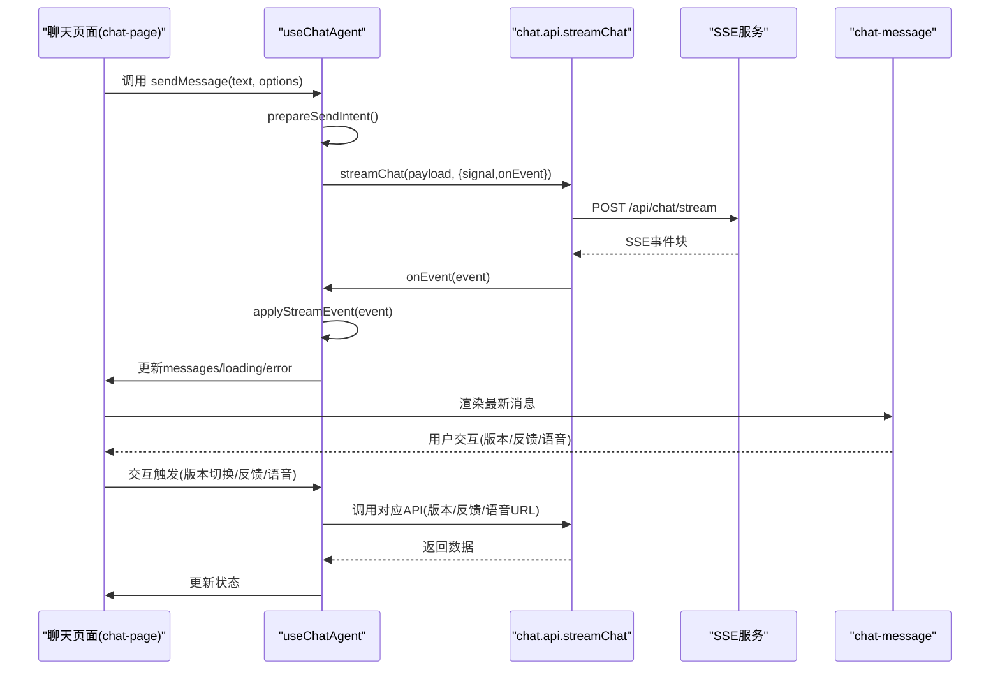
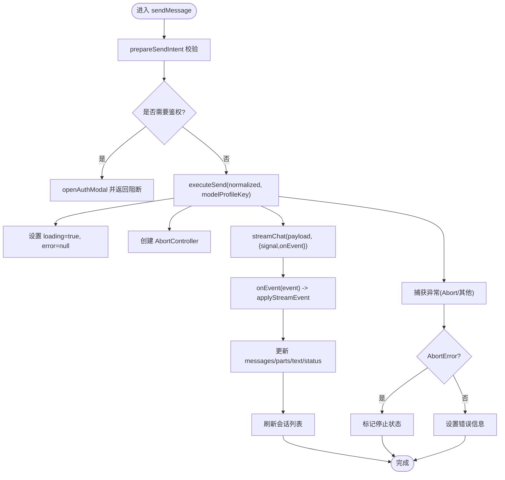
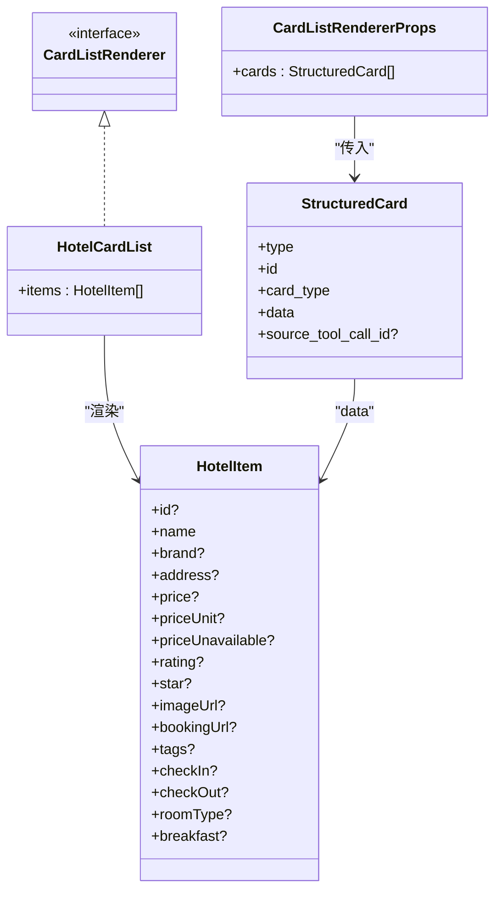
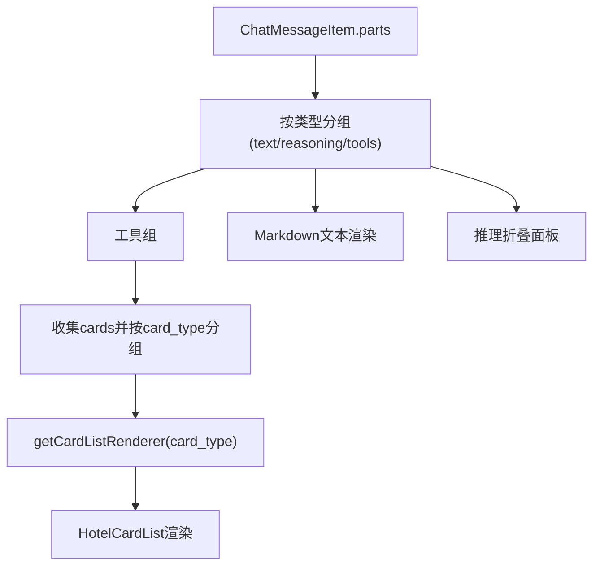
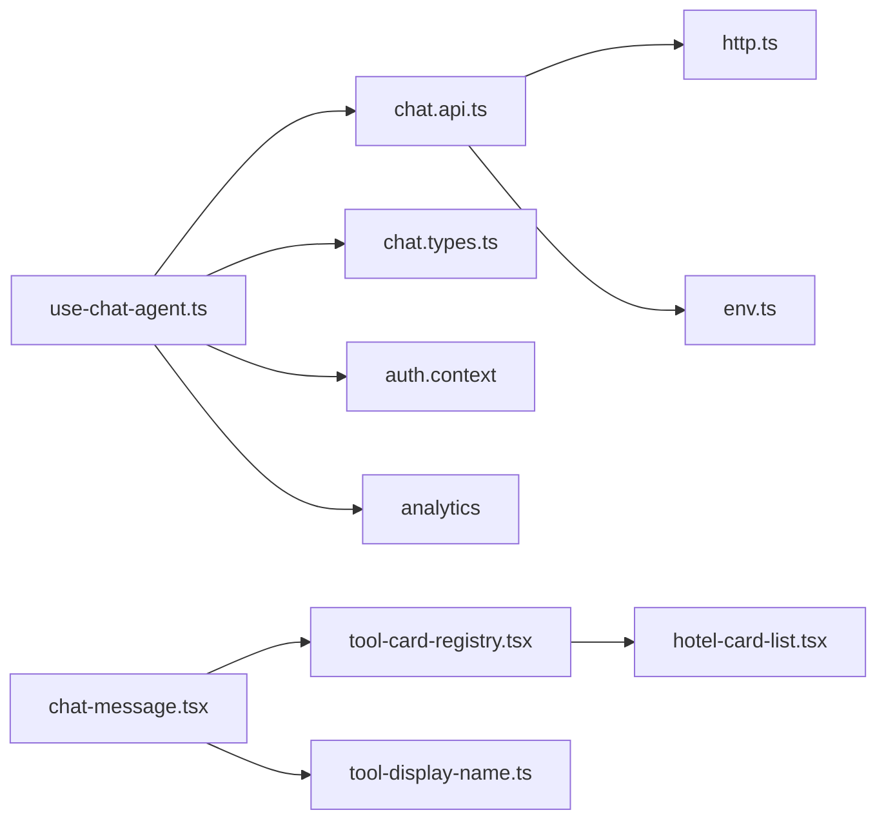

# 前端聊天Hook

<cite>
**本文引用的文件**
- [use-chat-agent.ts](file://frontend/src/features/chat/hooks/use-chat-agent.ts)
- [tool-card-registry.tsx](file://frontend/src/features/chat/model/tool-card-registry.tsx)
- [chat.types.ts](file://frontend/src/features/chat/model/chat.types.ts)
- [chat.api.ts](file://frontend/src/features/chat/api/chat.api.ts)
- [chat-page.tsx](file://frontend/src/features/chat/ui/chat-page.tsx)
- [chat-message.tsx](file://frontend/src/features/chat/ui/chat-message.tsx)
- [hotel-card-list.tsx](file://frontend/src/features/chat/ui/hotel-card-list.tsx)
- [tool-display-name.ts](file://frontend/src/features/chat/model/tool-display-name.ts)
- [env.ts](file://frontend/src/shared/config/env.ts)
- [http.ts](file://frontend/src/shared/lib/http.ts)
</cite>

## 目录
1. [简介](#简介)
2. [项目结构](#项目结构)
3. [核心组件](#核心组件)
4. [架构总览](#架构总览)
5. [详细组件分析](#详细组件分析)
6. [依赖关系分析](#依赖关系分析)
7. [性能考虑](#性能考虑)
8. [故障排查指南](#故障排查指南)
9. [结论](#结论)
10. [附录](#附录)

## 简介
本文件面向前端聊天Hook useChatAgent，提供从状态管理、数据流、事件订阅、副作用处理到工具卡片注册系统的完整技术文档。文档覆盖：
- 会话状态、消息状态、加载状态、错误状态的管理机制
- 流式事件订阅与应用层状态更新
- 工具卡片注册系统的设计与扩展
- Hook使用示例、参数说明与返回值类型
- 状态同步、性能优化与内存管理最佳实践
- 与后端API的集成方式与错误处理策略

## 项目结构
前端聊天相关代码主要位于 frontend/src/features/chat 目录，采用“功能域”划分：
- hooks：useChatAgent Hook 实现
- api：与后端交互的HTTP封装与SSE解析
- model：类型定义、工具卡片注册与显示名映射
- ui：聊天页面、消息渲染、卡片列表等UI组件

图表来源
- [use-chat-agent.ts:125-595](file://frontend/src/features/chat/hooks/use-chat-agent.ts#L125-L595)
- [chat.api.ts:107-252](file://frontend/src/features/chat/api/chat.api.ts#L107-L252)
- [chat.types.ts:1-226](file://frontend/src/features/chat/model/chat.types.ts#L1-L226)
- [tool-card-registry.tsx:1-99](file://frontend/src/features/chat/model/tool-card-registry.tsx#L1-L99)
- [chat-message.tsx:31-476](file://frontend/src/features/chat/ui/chat-message.tsx#L31-L476)
- [chat-page.tsx:148-741](file://frontend/src/features/chat/ui/chat-page.tsx#L148-L741)
- [hotel-card-list.tsx:180-198](file://frontend/src/features/chat/ui/hotel-card-list.tsx#L180-L198)
- [tool-display-name.ts:51-72](file://frontend/src/features/chat/model/tool-display-name.ts#L51-L72)
- [env.ts:29-47](file://frontend/src/shared/config/env.ts#L29-L47)
- [http.ts:20-75](file://frontend/src/shared/lib/http.ts#L20-L75)

章节来源
- [use-chat-agent.ts:125-595](file://frontend/src/features/chat/hooks/use-chat-agent.ts#L125-L595)
- [chat.api.ts:107-252](file://frontend/src/features/chat/api/chat.api.ts#L107-L252)
- [chat.types.ts:1-226](file://frontend/src/features/chat/model/chat.types.ts#L1-L226)
- [tool-card-registry.tsx:1-99](file://frontend/src/features/chat/model/tool-card-registry.tsx#L1-L99)
- [chat-message.tsx:31-476](file://frontend/src/features/chat/ui/chat-message.tsx#L31-L476)
- [chat-page.tsx:148-741](file://frontend/src/features/chat/ui/chat-page.tsx#L148-L741)
- [hotel-card-list.tsx:180-198](file://frontend/src/features/chat/ui/hotel-card-list.tsx#L180-L198)
- [tool-display-name.ts:51-72](file://frontend/src/features/chat/model/tool-display-name.ts#L51-L72)
- [env.ts:29-47](file://frontend/src/shared/config/env.ts#L29-L47)
- [http.ts:20-75](file://frontend/src/shared/lib/http.ts#L20-L75)

## 核心组件
- useChatAgent：聊天主Hook，负责会话生命周期、消息状态、流式事件处理、工具卡片渲染、版本切换与反馈、语音播放等。
- chat.api：封装HTTP请求与SSE流式解析，提供会话列表、消息流、模型配置、版本切换、反馈等API。
- tool-card-registry：工具卡片渲染器注册表，按card_type映射渲染器，并提供卡片分组能力。
- chat.types：统一的消息、会话、卡片、流事件等类型定义。
- chat-message：消息渲染组件，负责文本、推理、工具调用、卡片、版本切换、反馈、语音播放等UI逻辑。
- hotel-card-list：酒店卡片列表渲染组件，展示结构化卡片数据。
- tool-display-name：工具展示名映射，支持本地工具与MCP服务器工具的标签化展示。
- env/http：环境变量解析与HTTP客户端，统一处理鉴权头、错误包装与URL拼接。

章节来源
- [use-chat-agent.ts:125-595](file://frontend/src/features/chat/hooks/use-chat-agent.ts#L125-L595)
- [chat.api.ts:107-252](file://frontend/src/features/chat/api/chat.api.ts#L107-L252)
- [tool-card-registry.tsx:60-98](file://frontend/src/features/chat/model/tool-card-registry.tsx#L60-L98)
- [chat.types.ts:28-131](file://frontend/src/features/chat/model/chat.types.ts#L28-L131)
- [chat-message.tsx:269-679](file://frontend/src/features/chat/ui/chat-message.tsx#L269-L679)
- [hotel-card-list.tsx:180-198](file://frontend/src/features/chat/ui/hotel-card-list.tsx#L180-L198)
- [tool-display-name.ts:51-72](file://frontend/src/features/chat/model/tool-display-name.ts#L51-L72)
- [env.ts:29-47](file://frontend/src/shared/config/env.ts#L29-L47)
- [http.ts:20-75](file://frontend/src/shared/lib/http.ts#L20-L75)

## 架构总览
useChatAgent作为中心控制器，协调以下流程：
- 初始化与鉴权：通过useAuth判断认证状态，必要时弹出登录模态。
- 会话管理：创建/打开/重命名/删除会话，持久化模型配置。
- 流式消息：通过streamChat订阅SSE事件，逐步更新消息parts与text，支持工具调用与卡片渲染。
- 版本与反馈：支持助手版本切换与反馈，更新消息版本树。
- 语音播放：通过API获取播放URL，控制音频播放与停止。
- 错误处理：统一捕获HTTP与SSE错误，设置错误状态并上报事件。

图表来源
- [chat-page.tsx:148-741](file://frontend/src/features/chat/ui/chat-page.tsx#L148-L741)
- [use-chat-agent.ts:460-595](file://frontend/src/features/chat/hooks/use-chat-agent.ts#L460-L595)
- [chat.api.ts:107-180](file://frontend/src/features/chat/api/chat.api.ts#L107-L180)
- [chat-message.tsx:269-679](file://frontend/src/features/chat/ui/chat-message.tsx#L269-L679)

## 详细组件分析

### useChatAgent Hook 状态管理与数据流
- 状态字段
  - threadId：当前会话线程ID
  - messages：消息数组，包含parts与text
  - sessions/sessionsReady：会话列表与加载完成标记
  - modelProfiles/defaultModelProfileKey/selectedModelProfileKey：模型配置
  - loading/error：加载与错误状态
  - isAuthenticated/canStartRequest：鉴权与可发送条件
- 关键方法
  - sendMessage：发送消息，鉴权前置、流式事件处理、会话刷新
  - regenerateLatestAssistantMessage：重新生成助手消息
  - selectAssistantVersion/setAssistantFeedback：版本切换与反馈
  - openSession/startNewSession/renameSession/removeSession：会话管理
  - updateCurrentModelProfile：更新当前会话模型配置
  - stopGenerating/retryLastSubmittedMessage：中断与重试
  - refreshCurrentThread：拉取并填充当前线程消息
- 事件处理
  - applyStreamEvent：根据事件类型更新消息状态、parts、text与状态
  - onEvent回调在chat.api中解析SSE并派发
- 引用与副作用
  - abortControllerRef：用于中断请求
  - activeThreadIdRef/requestInFlightRef/lastSubmittedMessageRef：跨事件引用
  - useEffect：初始化模型配置、会话列表、鉴权后自动发送待处理消息

图表来源
- [use-chat-agent.ts:384-458](file://frontend/src/features/chat/hooks/use-chat-agent.ts#L384-L458)
- [use-chat-agent.ts:288-382](file://frontend/src/features/chat/hooks/use-chat-agent.ts#L288-L382)
- [chat.api.ts:107-180](file://frontend/src/features/chat/api/chat.api.ts#L107-L180)

章节来源
- [use-chat-agent.ts:125-595](file://frontend/src/features/chat/hooks/use-chat-agent.ts#L125-L595)
- [chat.api.ts:107-180](file://frontend/src/features/chat/api/chat.api.ts#L107-L180)

### 工具卡片注册系统
- 设计目标
  - 后端将工具调用结果解析为结构化卡片StructuredCard，前端按card_type映射渲染器
  - 卡片仅在工具chip下方以列表形式展示，避免自然语言反向解析的不稳定
- 注册表
  - cardListRenderers：card_type -> 渲染器映射
  - getCardListRenderer：按类型取出渲染器，未注册返回null
  - groupCardsByType：按card_type分组，保持原数组顺序
- 扩展机制
  - 新增卡片类型：在前端注册表追加映射，无需改动消息渲染与流式管线
  - 示例：酒店卡片通过HotelCardList渲染

图表来源
- [tool-card-registry.tsx:34-54](file://frontend/src/features/chat/model/tool-card-registry.tsx#L34-L54)
- [hotel-card-list.tsx:19-39](file://frontend/src/features/chat/ui/hotel-card-list.tsx#L19-L39)
- [chat.types.ts:28-34](file://frontend/src/features/chat/model/chat.types.ts#L28-L34)

章节来源
- [tool-card-registry.tsx:60-98](file://frontend/src/features/chat/model/tool-card-registry.tsx#L60-L98)
- [hotel-card-list.tsx:180-198](file://frontend/src/features/chat/ui/hotel-card-list.tsx#L180-L198)
- [chat.types.ts:28-34](file://frontend/src/features/chat/model/chat.types.ts#L28-L34)

### 消息渲染与工具调用UI
- 消息体结构
  - ChatMessageItem：包含role、text、parts、status、versions、meta等
  - parts：text/reasoning/tool三类，tool包含cards
- 渲染逻辑
  - 文本：Markdown渲染，支持注释引用
  - 推理：可折叠展开
  - 工具：按组显示，点击展开详情；工具完成后渲染卡片
  - 版本：多版本对比与切换
  - 反馈：点赞/踩
  - 语音：播放/停止
- 工具展示名
  - 本地工具与MCP服务器工具的标签化展示

图表来源
- [chat-message.tsx:303-476](file://frontend/src/features/chat/ui/chat-message.tsx#L303-L476)
- [tool-card-registry.tsx:84-98](file://frontend/src/features/chat/model/tool-card-registry.tsx#L84-L98)
- [hotel-card-list.tsx:180-198](file://frontend/src/features/chat/ui/hotel-card-list.tsx#L180-L198)

章节来源
- [chat-message.tsx:269-679](file://frontend/src/features/chat/ui/chat-message.tsx#L269-L679)
- [tool-display-name.ts:51-72](file://frontend/src/features/chat/model/tool-display-name.ts#L51-L72)

### 页面容器与交互
- ChatPage
  - 订阅useChatAgent返回的状态与动作
  - 历史会话分组展示、新建/重命名/删除会话
  - 快捷提示词、模型配置选择、语音播放控制
  - 路由与会话打开逻辑、鉴权后自动发送待处理消息

章节来源
- [chat-page.tsx:148-741](file://frontend/src/features/chat/ui/chat-page.tsx#L148-L741)

## 依赖关系分析
- useChatAgent依赖
  - chat.api：HTTP与SSE封装
  - chat.types：类型定义
  - auth上下文：鉴权状态与模态
  - analytics：事件追踪
- chat.api依赖
  - http：统一HTTP客户端
  - env：URL解析与反向代理兼容
- chat-message依赖
  - tool-card-registry：卡片渲染器
  - tool-display-name：工具展示名
- hotel-card-list依赖
  - browser：外链打开

图表来源
- [use-chat-agent.ts:125-595](file://frontend/src/features/chat/hooks/use-chat-agent.ts#L125-L595)
- [chat.api.ts:107-252](file://frontend/src/features/chat/api/chat.api.ts#L107-L252)
- [chat.types.ts:1-226](file://frontend/src/features/chat/model/chat.types.ts#L1-L226)
- [chat-message.tsx:31-476](file://frontend/src/features/chat/ui/chat-message.tsx#L31-L476)
- [tool-card-registry.tsx:60-98](file://frontend/src/features/chat/model/tool-card-registry.tsx#L60-L98)
- [hotel-card-list.tsx:180-198](file://frontend/src/features/chat/ui/hotel-card-list.tsx#L180-L198)
- [env.ts:29-47](file://frontend/src/shared/config/env.ts#L29-L47)
- [http.ts:20-75](file://frontend/src/shared/lib/http.ts#L20-L75)

章节来源
- [use-chat-agent.ts:125-595](file://frontend/src/features/chat/hooks/use-chat-agent.ts#L125-L595)
- [chat.api.ts:107-252](file://frontend/src/features/chat/api/chat.api.ts#L107-L252)
- [chat.types.ts:1-226](file://frontend/src/features/chat/model/chat.types.ts#L1-L226)
- [chat-message.tsx:31-476](file://frontend/src/features/chat/ui/chat-message.tsx#L31-L476)
- [tool-card-registry.tsx:60-98](file://frontend/src/features/chat/model/tool-card-registry.tsx#L60-L98)
- [hotel-card-list.tsx:180-198](file://frontend/src/features/chat/ui/hotel-card-list.tsx#L180-L198)
- [env.ts:29-47](file://frontend/src/shared/config/env.ts#L29-L47)
- [http.ts:20-75](file://frontend/src/shared/lib/http.ts#L20-L75)

## 性能考虑
- 流式事件节流
  - tool.start事件后等待下一帧绘制机会，降低频繁重绘开销
- 状态更新最小化
  - 使用不可变更新策略，仅替换受影响的消息项
  - 合并text与parts更新，避免重复计算
- 会话与模型配置缓存
  - 首次加载后复用，避免重复请求
- 组件渲染优化
  - 消息列表使用滚动容器，减少重排
  - 工具卡片按类型分组渲染，避免重复查找
- 中断与清理
  - AbortController确保请求中断后及时清理状态
  - 页面卸载时停止语音播放，释放资源

章节来源
- [chat.api.ts:88-105](file://frontend/src/features/chat/api/chat.api.ts#L88-L105)
- [use-chat-agent.ts:400-458](file://frontend/src/features/chat/hooks/use-chat-agent.ts#L400-L458)
- [chat-page.tsx:217-226](file://frontend/src/features/chat/ui/chat-page.tsx#L217-L226)

## 故障排查指南
- 常见错误与处理
  - HTTP错误：统一抛出HttpError，包含状态码与错误数据
  - SSE解析错误：忽略无效块，继续解析后续事件
  - 请求中断：捕获AbortError，标记消息停止状态
  - 语音播放：409状态触发会话刷新后重试
- 日志与追踪
  - applyStreamEvent中记录事件与错误，便于定位问题
  - 事件追踪：会话新建、消息发送、工具调用、版本切换、反馈、停止生成等
- 会话与消息一致性
  - hydrateThreadMessages与activeThreadIdRef确保线程切换时状态一致
  - persist标识消息ID，区分持久化与临时消息

章节来源
- [http.ts:8-18](file://frontend/src/shared/lib/http.ts#L8-L18)
- [chat.api.ts:25-31](file://frontend/src/features/chat/api/chat.api.ts#L25-L31)
- [use-chat-agent.ts:358-382](file://frontend/src/features/chat/hooks/use-chat-agent.ts#L358-L382)
- [chat-page.tsx:363-369](file://frontend/src/features/chat/ui/chat-page.tsx#L363-L369)

## 结论
useChatAgent通过清晰的状态管理、稳健的流式事件处理与可扩展的工具卡片注册系统，构建了完整的聊天体验。其设计强调：
- 状态与副作用分离，事件驱动更新
- 类型安全与渲染解耦，便于扩展
- 性能与可用性兼顾，提供中断与回退策略
- 与后端API紧密协作，统一错误处理与事件追踪

## 附录

### Hook使用示例与参数说明
- 基本用法
  - 在页面组件中引入并调用：const { messages, sendMessage, loading, error, ... } = useChatAgent(initialThreadId)
- 参数
  - initialThreadId?: string：初始线程ID（可选）
- 返回值（节选）
  - threadId：当前线程ID
  - messages：消息数组
  - sessions/sessionsReady：会话列表与就绪状态
  - modelProfiles/defaultModelProfileKey/selectedModelProfileKey：模型配置
  - loading/error：加载与错误状态
  - sendMessage/openSession/startNewSession/renameSession/removeSession：会话与消息操作
  - regenerateLatestAssistantMessage/selectAssistantVersion/setAssistantFeedback：版本与反馈
  - stopGenerating/retryLastSubmittedMessage：中断与重试
  - updateCurrentModelProfile：更新模型配置
  - refreshCurrentThread：刷新当前线程

章节来源
- [use-chat-agent.ts:569-595](file://frontend/src/features/chat/hooks/use-chat-agent.ts#L569-L595)

### 与后端API集成与错误处理
- 集成点
  - /api/chat/stream：流式聊天
  - /api/sessions/*：会话管理
  - /api/chat/model-profiles：模型配置
  - /api/sessions/{threadId}/messages/{messageId}/regenerate/stream：重新生成
  - /api/sessions/{threadId}/messages/{messageId}/versions/{versionId}/feedback：反馈
  - /api/sessions/{threadId}/messages/{messageId}/versions/{versionId}/speech/playback-url：语音URL
- 错误处理
  - HTTP错误包装为HttpError，包含状态码与数据
  - SSE解析失败跳过无效块，保证流式稳定性
  - 语音播放409触发会话刷新后重试

章节来源
- [chat.api.ts:107-252](file://frontend/src/features/chat/api/chat.api.ts#L107-L252)
- [http.ts:20-75](file://frontend/src/shared/lib/http.ts#L20-L75)