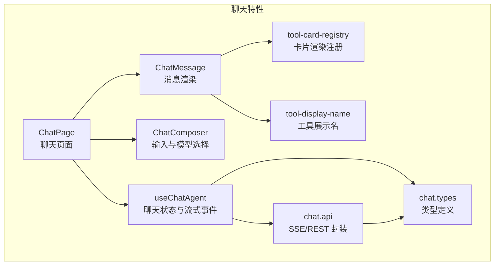
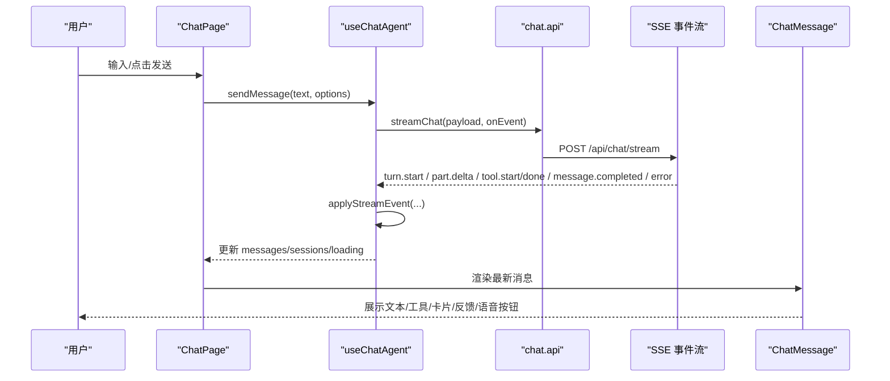
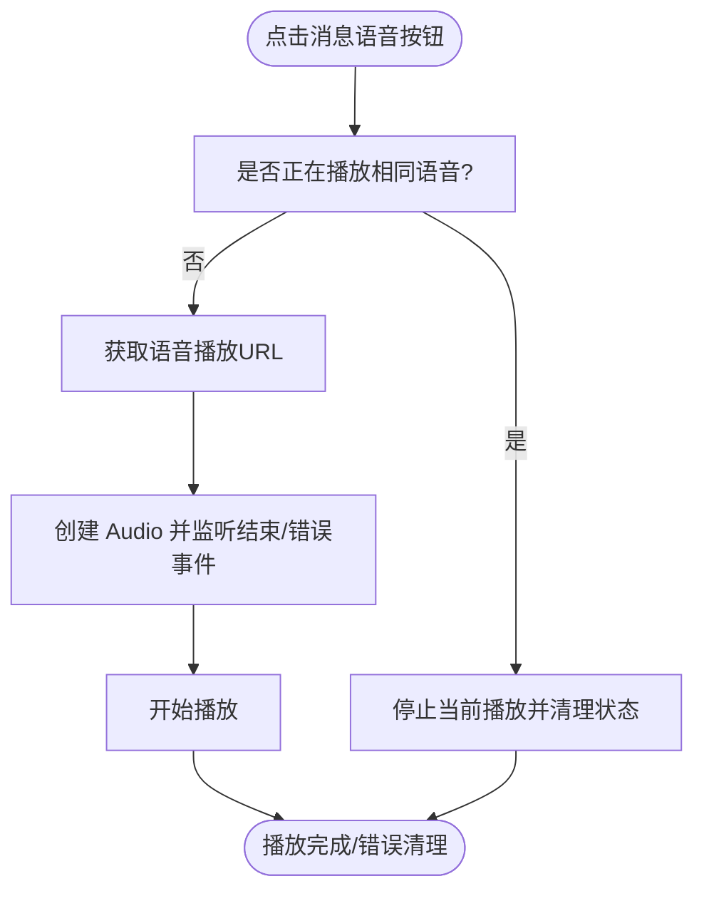
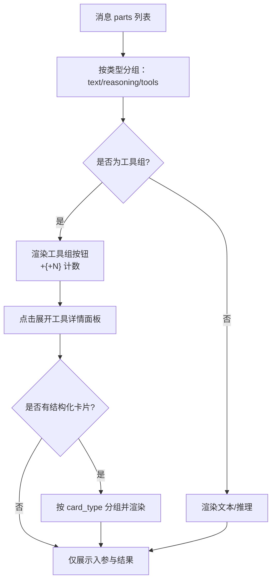
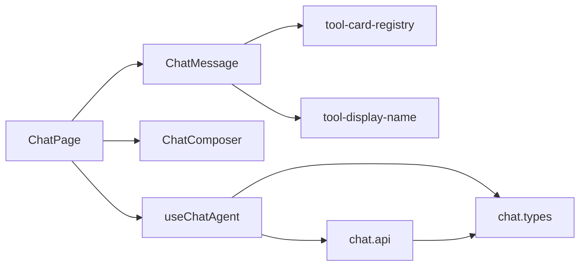

# 前端聊天界面

<cite>
**本文引用的文件**
- [chat-page.tsx](file://frontend/src/features/chat/ui/chat-page.tsx)
- [chat-message.tsx](file://frontend/src/features/chat/ui/chat-message.tsx)
- [chat-composer.tsx](file://frontend/src/features/chat/ui/chat-composer.tsx)
- [chat.types.ts](file://frontend/src/features/chat/model/chat.types.ts)
- [use-chat-agent.ts](file://frontend/src/features/chat/hooks/use-chat-agent.ts)
- [chat.api.ts](file://frontend/src/features/chat/api/chat.api.ts)
- [tool-card-registry.tsx](file://frontend/src/features/chat/model/tool-card-registry.tsx)
- [tool-display-name.ts](file://frontend/src/features/chat/model/tool-display-name.ts)
- [chat-page.test.tsx](file://frontend/src/features/chat/ui/chat-page.test.tsx)
- [chat-message.test.tsx](file://frontend/src/features/chat/ui/chat-message.test.tsx)
</cite>

## 目录
1. [简介](#简介)
2. [项目结构](#项目结构)
3. [核心组件](#核心组件)
4. [架构总览](#架构总览)
5. [详细组件分析](#详细组件分析)
6. [依赖关系分析](#依赖关系分析)
7. [性能考量](#性能考量)
8. [故障排查指南](#故障排查指南)
9. [结论](#结论)
10. [附录](#附录)

## 简介
本文件面向前端聊天界面的实现，围绕 ChatPage、ChatMessage、ChatComposer 三大核心组件，系统性阐述其架构设计、会话历史管理、消息渲染、用户交互处理、组件间通信模式、状态传递与事件处理最佳实践，并补充 UI 响应式设计、移动端适配与无障碍访问的实现要点。同时给出基于仓库实际代码的可视化图示与来源标注，帮助开发者快速理解与维护。

## 项目结构
前端聊天相关代码主要位于 frontend/src/features/chat 目录，采用“按特性分层”的组织方式：
- ui：页面与组件（ChatPage、ChatMessage、ChatComposer）
- hooks：业务逻辑钩子（useChatAgent）
- model：类型定义与工具（chat.types、tool-card-registry、tool-display-name）
- api：与后端交互的封装（chat.api）

图表来源
- [chat-page.tsx:140-741](file://frontend/src/features/chat/ui/chat-page.tsx#L140-L741)
- [chat-message.tsx:269-679](file://frontend/src/features/chat/ui/chat-message.tsx#L269-L679)
- [chat-composer.tsx:17-156](file://frontend/src/features/chat/ui/chat-composer.tsx#L17-L156)
- [use-chat-agent.ts:125-596](file://frontend/src/features/chat/hooks/use-chat-agent.ts#L125-L596)
- [chat.api.ts:107-252](file://frontend/src/features/chat/api/chat.api.ts#L107-L252)
- [chat.types.ts:134-226](file://frontend/src/features/chat/model/chat.types.ts#L134-L226)
- [tool-card-registry.tsx:60-99](file://frontend/src/features/chat/model/tool-card-registry.tsx#L60-L99)
- [tool-display-name.ts:51-72](file://frontend/src/features/chat/model/tool-display-name.ts#L51-L72)

章节来源
- [chat-page.tsx:140-741](file://frontend/src/features/chat/ui/chat-page.tsx#L140-L741)
- [chat.types.ts:134-226](file://frontend/src/features/chat/model/chat.types.ts#L134-L226)

## 核心组件
- ChatPage：聊天页面容器，负责会话历史分组与展示、快捷提示、模型配置选择弹层、消息区域滚动、语音播放控制、会话操作（新建、重命名、删除）、认证态与路由跳转等。
- ChatMessage：消息渲染组件，支持文本、推理过程、工具调用、结构化卡片、反馈、复制、语音播放、版本切换、重新生成等交互。
- ChatComposer：输入框与发送控制，支持文本输入、快捷键发送、模型配置选择、停止生成、语音模式切换等。

章节来源
- [chat-page.tsx:140-741](file://frontend/src/features/chat/ui/chat-page.tsx#L140-L741)
- [chat-message.tsx:269-679](file://frontend/src/features/chat/ui/chat-message.tsx#L269-L679)
- [chat-composer.tsx:17-156](file://frontend/src/features/chat/ui/chat-composer.tsx#L17-L156)

## 架构总览
聊天界面采用“页面容器 + 钩子 + 组件”的分层架构：
- 页面容器（ChatPage）聚合状态与副作用，协调历史面板、消息列表、输入框与模型配置弹层。
- 钩子（useChatAgent）封装 SSE 流式事件、消息状态管理、会话与模型配置持久化、错误处理与重试。
- 组件（ChatMessage、ChatComposer）专注各自职责，通过 props 与回调进行解耦交互。

图表来源
- [chat-page.tsx:174-379](file://frontend/src/features/chat/ui/chat-page.tsx#L174-L379)
- [use-chat-agent.ts:288-382](file://frontend/src/features/chat/hooks/use-chat-agent.ts#L288-L382)
- [chat.api.ts:107-180](file://frontend/src/features/chat/api/chat.api.ts#L107-L180)

## 详细组件分析

### ChatPage 组件
职责与能力
- 会话历史管理：分组显示“今日/7日/30日/更早”，支持新建、重命名、删除、打开会话；未登录时展示访客抽屉。
- 快速提示：提供“规划行程/查询天气/推荐景点/规划路线”四类快捷入口。
- 模型配置选择：通过 AppSurfaceSheet 展示“标准/思考”两种模型配置，支持切换并持久化到会话。
- 消息渲染：遍历 messages 渲染 ChatMessage，传入重新生成、版本切换、反馈、语音播放回调与播放状态。
- 语音播放控制：统一管理 Audio 实例，确保同一时刻仅播放一个语音，处理错误与刷新。
- 认证与路由：未登录时拦截并打开认证模态，登录后自动恢复会话与模型配置。

关键交互流程（语音播放）

图表来源
- [chat-page.tsx:337-369](file://frontend/src/features/chat/ui/chat-page.tsx#L337-L369)
- [chat.api.ts:243-251](file://frontend/src/features/chat/api/chat.api.ts#L243-L251)

章节来源
- [chat-page.tsx:140-741](file://frontend/src/features/chat/ui/chat-page.tsx#L140-L741)

### ChatMessage 组件
职责与能力
- 文本渲染：使用 ReactMarkdown + rehype 插件安全渲染，支持表格、代码块、引用、链接等；支持引用标注（citation-chip）点击打开。
- 推理过程：可折叠显示“思考中/思考过程”，支持展开查看完整内容。
- 工具调用：将连续的 tool 部分合并为“工具组”，点击展开工具详情面板，展示入参与返回结果，支持运行中/成功/错误状态。
- 结构化卡片：根据 card_type 路由到注册的渲染器（如酒店卡片），按类型分组一次性渲染。
- 用户交互：复制文本、播放/停止语音、重新生成、版本切换、点赞/踩反馈。
- 版本控制：最多保留 3 个版本，超过限制禁用重新生成；版本切换按钮支持上一个/下一个。

渲染流程（工具与卡片）

图表来源
- [chat-message.tsx:306-476](file://frontend/src/features/chat/ui/chat-message.tsx#L306-L476)
- [tool-card-registry.tsx:84-99](file://frontend/src/features/chat/model/tool-card-registry.tsx#L84-L99)

章节来源
- [chat-message.tsx:269-679](file://frontend/src/features/chat/ui/chat-message.tsx#L269-L679)
- [tool-card-registry.tsx:60-99](file://frontend/src/features/chat/model/tool-card-registry.tsx#L60-L99)
- [tool-display-name.ts:51-72](file://frontend/src/features/chat/model/tool-display-name.ts#L51-L72)

### ChatComposer 组件
职责与能力
- 文本输入：自适应高度，支持 Shift+Enter 发送，禁用态与加载态控制。
- 模型配置：展示当前模型标签，点击打开模型选择弹层。
- 停止生成：当处于生成中时显示停止按钮。
- 语音模式：提供语音输入入口与键盘切换。

章节来源
- [chat-composer.tsx:17-156](file://frontend/src/features/chat/ui/chat-composer.tsx#L17-L156)

### useChatAgent 钩子
职责与能力
- 会话与消息管理：创建/打开会话、拉取会话详情、更新消息列表、标记可重新生成。
- SSE 流式事件：turn.start、part.delta、tool.start/done、message.completed、error 等事件驱动状态变更。
- 重新生成：针对指定消息触发再生流，即时反馈“思考中”状态。
- 版本切换与反馈：切换助手版本、更新版本反馈。
- 模型配置：列出模型配置、切换当前会话模型并持久化。
- 错误处理与重试：中断生成、错误回退、重试上次消息。

章节来源
- [use-chat-agent.ts:125-596](file://frontend/src/features/chat/hooks/use-chat-agent.ts#L125-L596)
- [chat.api.ts:107-252](file://frontend/src/features/chat/api/chat.api.ts#L107-L252)

### 类型与工具
- 类型定义：消息项、版本、工具部件、结构化卡片、会话摘要/详情、模型配置、SSE 事件等。
- 工具展示名：本地工具与 MCP 服务器工具的本地化展示名映射。
- 卡片渲染注册：按 card_type 将 StructuredCard 列表路由到对应渲染器，支持扩展新卡片类型。

章节来源
- [chat.types.ts:134-226](file://frontend/src/features/chat/model/chat.types.ts#L134-L226)
- [tool-display-name.ts:51-72](file://frontend/src/features/chat/model/tool-display-name.ts#L51-L72)
- [tool-card-registry.tsx:60-99](file://frontend/src/features/chat/model/tool-card-registry.tsx#L60-L99)

## 依赖关系分析
组件与模块之间的依赖关系如下：

图表来源
- [chat-page.tsx:140-741](file://frontend/src/features/chat/ui/chat-page.tsx#L140-L741)
- [chat-message.tsx:269-679](file://frontend/src/features/chat/ui/chat-message.tsx#L269-L679)
- [use-chat-agent.ts:125-596](file://frontend/src/features/chat/hooks/use-chat-agent.ts#L125-L596)
- [chat.api.ts:107-252](file://frontend/src/features/chat/api/chat.api.ts#L107-L252)
- [tool-card-registry.tsx:60-99](file://frontend/src/features/chat/model/tool-card-registry.tsx#L60-L99)
- [tool-display-name.ts:51-72](file://frontend/src/features/chat/model/tool-display-name.ts#L51-L72)

章节来源
- [chat-page.tsx:140-741](file://frontend/src/features/chat/ui/chat-page.tsx#L140-L741)
- [chat-message.tsx:269-679](file://frontend/src/features/chat/ui/chat-message.tsx#L269-L679)
- [use-chat-agent.ts:125-596](file://frontend/src/features/chat/hooks/use-chat-agent.ts#L125-L596)
- [chat.api.ts:107-252](file://frontend/src/features/chat/api/chat.api.ts#L107-L252)

## 性能考量
- 流式渲染优化：SSE 事件到达后通过 requestAnimationFrame 机会点调度工具开始事件，避免阻塞主线程渲染。
- 滚动行为：消息列表自动滚动到底部，减少不必要的滚动计算。
- 语音播放：单实例音频管理，播放前停止前一个音频，避免资源泄漏与冲突。
- 状态最小化：useMemo/groupSessionsByUpdatedAt 等用于稳定渲染与分组计算。
- 无障碍与可访问性：按钮均提供 aria-label，对话框与菜单提供关闭/确认语义，提升可访问性。

章节来源
- [chat.api.ts:88-105](file://frontend/src/features/chat/api/chat.api.ts#L88-L105)
- [chat-page.tsx:198-225](file://frontend/src/features/chat/ui/chat-page.tsx#L198-L225)
- [chat-page.tsx:337-369](file://frontend/src/features/chat/ui/chat-page.tsx#L337-L369)

## 故障排查指南
常见问题与定位方法
- 无法发送消息
  - 检查 canStartRequest 与 loading 状态，确认 ready 与认证状态。
  - 若返回 blocked，检查原因（空消息/加载中/未就绪/未认证）。
- 语音播放异常
  - 检查 HttpError 与 409 状态，必要时刷新当前线程。
  - 确认 activeAudioRef 与 playingSpeechKey 的一致性。
- 工具调用未显示卡片
  - 确认工具已完成（非 running），否则不会渲染卡片。
  - 检查 card_type 是否已在注册表中注册。
- 版本切换无效
  - 确认 persistedMessageId 与 currentVersion 存在，且 onSwitchVersion 回调已传入。
- 重新生成受限
  - 最多 3 个版本，超过限制禁用重新生成按钮。

章节来源
- [chat-page.tsx:337-369](file://frontend/src/features/chat/ui/chat-page.tsx#L337-L369)
- [chat-message.tsx:428-431](file://frontend/src/features/chat/ui/chat-message.tsx#L428-L431)
- [chat.types.ts:47-49](file://frontend/src/features/chat/model/chat.types.ts#L47-L49)
- [chat.types.ts:200-206](file://frontend/src/features/chat/model/chat.types.ts#L200-L206)

## 结论
该聊天界面以清晰的分层与职责划分实现了完整的对话体验：页面容器负责编排与交互，钩子集中处理流式事件与状态，组件专注于渲染与交互细节。通过工具与卡片的注册机制，系统具备良好的扩展性；通过模型配置、版本控制与反馈机制，提升了对话质量与可控性。配合完善的测试覆盖，保证了核心交互的稳定性与可维护性。

## 附录
- 测试参考
  - ChatPage 测试覆盖：登录态/未登录态、快捷提示、模型配置、历史会话恢复、语音播放等场景。
  - ChatMessage 测试覆盖：复制、工具详情、推理过程、卡片渲染、引用标注等场景。

章节来源
- [chat-page.test.tsx:164-800](file://frontend/src/features/chat/ui/chat-page.test.tsx#L164-L800)
- [chat-message.test.tsx:59-519](file://frontend/src/features/chat/ui/chat-message.test.tsx#L59-L519)