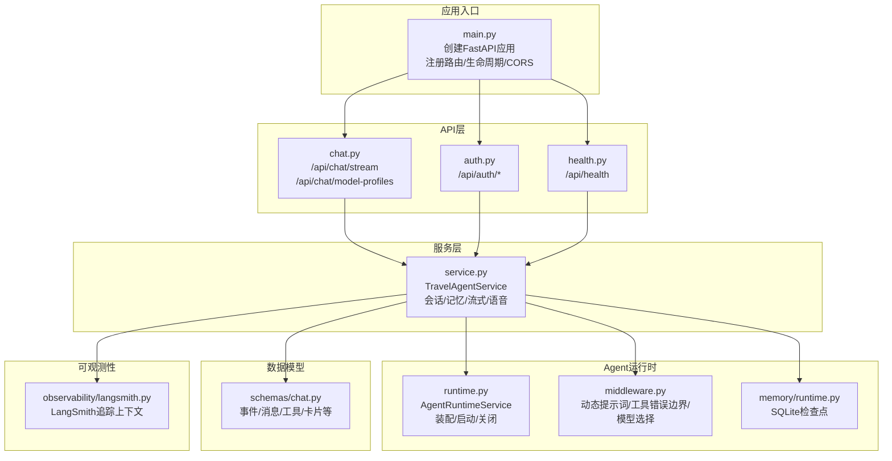
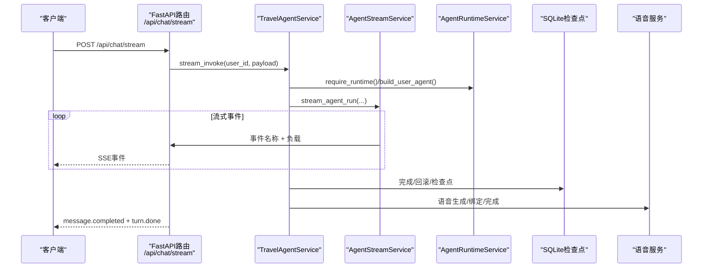
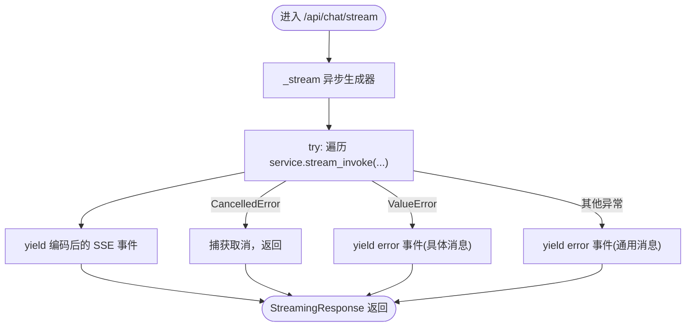
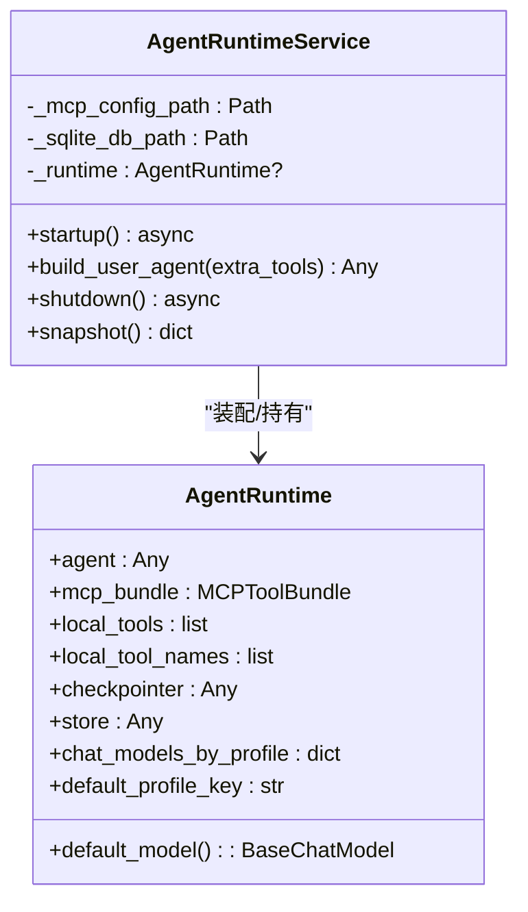
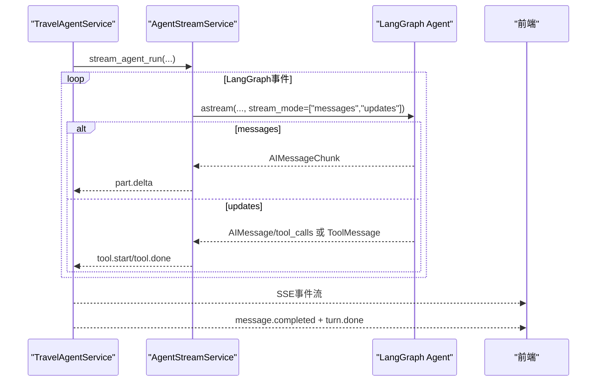
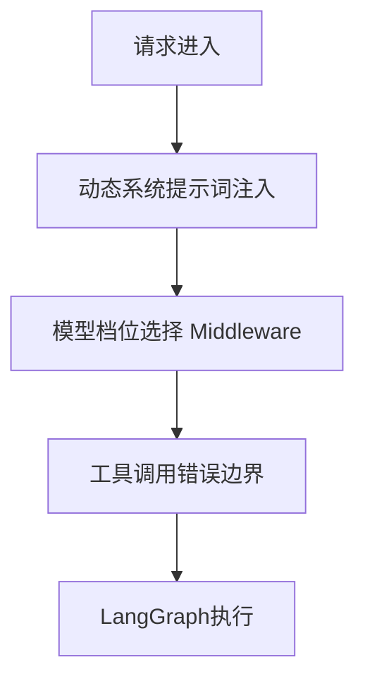
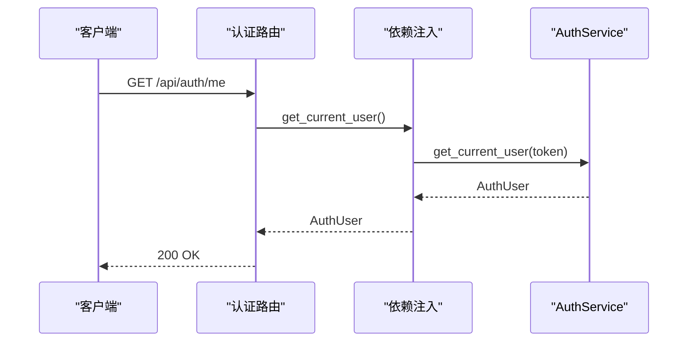
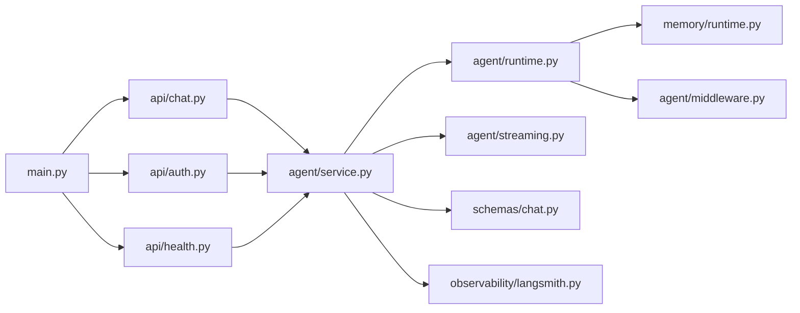

# 后端聊天API

<cite>
**本文引用的文件**
- [main.py](file://backend/app/main.py)
- [chat.py](file://backend/app/api/chat.py)
- [deps.py](file://backend/app/api/deps.py)
- [auth.py](file://backend/app/api/auth.py)
- [health.py](file://backend/app/api/health.py)
- [service.py](file://backend/app/agent/service.py)
- [runtime.py](file://backend/app/agent/runtime.py)
- [middleware.py](file://backend/app/agent/middleware.py)
- [streaming.py](file://backend/app/agent/streaming.py)
- [chat.py](file://backend/app/schemas/chat.py)
- [runtime.py](file://backend/app/memory/runtime.py)
- [langsmith.py](file://backend/app/observability/langsmith.py)
- [pyproject.toml](file://backend/pyproject.toml)
- [README.md](file://README.md)
</cite>

## 目录
1. [简介](#简介)
2. [项目结构](#项目结构)
3. [核心组件](#核心组件)
4. [架构总览](#架构总览)
5. [详细组件分析](#详细组件分析)
6. [依赖关系分析](#依赖关系分析)
7. [性能考量](#性能考量)
8. [故障排查指南](#故障排查指南)
9. [结论](#结论)
10. [附录](#附录)

## 简介
本文件面向后端聊天API的综合技术文档，重点覆盖以下方面：
- FastAPI路由设计与SSE流式响应实现机制及事件格式规范
- Agent运行时管理策略（状态保持、并发处理、资源管理）
- 流式响应生成逻辑（消息分块、事件序列、错误传播）
- 完整API端点说明（HTTP方法、URL模式、请求参数、响应格式）
- 中间件、认证授权与CORS配置
- 性能监控、日志记录与调试工具使用

## 项目结构
后端采用FastAPI + LangChain/LangGraph + MCP的分层架构：
- 应用入口与生命周期：FastAPI应用创建、CORS中间件、路由注册、生命周期钩子
- API层：认证、聊天流式、健康检查等路由
- 服务层：旅行Agent门面，负责会话、记忆、工具、语音、流式事件聚合
- Agent运行时：LangGraph Agent装配、MCP工具、本地工具、SQLite检查点
- 中间件：动态系统提示词、工具错误边界、模型档位选择
- 数据模型：统一的聊天事件与消息结构
- 可观测性：LangSmith追踪上下文

**图表来源**
- [main.py:31-54](file://backend/app/main.py#L31-L54)
- [chat.py:21-72](file://backend/app/api/chat.py#L21-L72)
- [auth.py:11-36](file://backend/app/api/auth.py#L11-L36)
- [health.py:10-18](file://backend/app/api/health.py#L10-L18)
- [service.py:97-128](file://backend/app/agent/service.py#L97-L128)
- [runtime.py:61-174](file://backend/app/agent/runtime.py#L61-L174)
- [middleware.py:193-211](file://backend/app/agent/middleware.py#L193-L211)
- [runtime.py:11-22](file://backend/app/memory/runtime.py#L11-L22)
- [chat.py:18-274](file://backend/app/schemas/chat.py#L18-L274)
- [langsmith.py:24-57](file://backend/app/observability/langsmith.py#L24-L57)

**章节来源**
- [main.py:31-54](file://backend/app/main.py#L31-L54)
- [README.md:78-102](file://README.md#L78-L102)

## 核心组件
- FastAPI应用与路由
  - 应用创建、CORS配置、路由注册、生命周期钩子（启动/关闭）
- 认证与授权
  - Bearer Token解析、用户鉴权、会话信息获取
- 聊天流式API
  - SSE事件编码、错误事件、流式响应头设置
- Agent服务门面
  - 会话管理、模型档位、检查点、语音合成、流式事件聚合
- Agent运行时
  - 全局Agent装配、MCP工具、本地工具、SQLite检查点、关闭清理
- 中间件
  - 动态系统提示词、工具错误边界、模型档位选择
- 数据模型
  - 请求/响应、事件负载、消息片段、工具轨迹、卡片、引用来源

**章节来源**
- [main.py:31-54](file://backend/app/main.py#L31-L54)
- [deps.py:18-60](file://backend/app/api/deps.py#L18-L60)
- [chat.py:21-72](file://backend/app/api/chat.py#L21-L72)
- [service.py:97-128](file://backend/app/agent/service.py#L97-L128)
- [runtime.py:61-174](file://backend/app/agent/runtime.py#L61-L174)
- [middleware.py:193-211](file://backend/app/agent/middleware.py#L193-L211)
- [chat.py:18-274](file://backend/app/schemas/chat.py#L18-L274)

## 架构总览
后端以FastAPI为入口，通过依赖注入获取TravelAgentService，后者协调Agent运行时、工具、记忆与语音服务，最终以SSE事件流的形式向客户端推送聊天过程与结果。

**图表来源**
- [chat.py:41-72](file://backend/app/api/chat.py#L41-L72)
- [service.py:373-508](file://backend/app/agent/service.py#L373-L508)
- [streaming.py:80-148](file://backend/app/agent/streaming.py#L80-L148)
- [runtime.py:80-116](file://backend/app/agent/runtime.py#L80-L116)

## 详细组件分析

### FastAPI路由与SSE实现
- 路由前缀与标签
  - /api/chat：聊天相关端点
  - /api/auth：认证相关端点
  - /api/health：健康检查端点
- SSE编码与事件格式
  - 事件名称与JSON负载通过事件编码函数生成
  - 错误事件统一为“error”事件，包含错误消息
- 流式响应头
  - Cache-Control: no-cache
  - Connection: keep-alive
  - X-Accel-Buffering: no（Nginx兼容）

**图表来源**
- [chat.py:41-72](file://backend/app/api/chat.py#L41-L72)
- [chat.py:25-28](file://backend/app/api/chat.py#L25-L28)

**章节来源**
- [chat.py:21-72](file://backend/app/api/chat.py#L21-L72)

### Agent运行时管理策略
- 生命周期
  - 启动：加载本地工具、MCP连接、SQLite检查点、构建默认Agent与中间件
  - 关闭：关闭MCP客户端、关闭SQLite连接
- 状态保持
  - 通过SQLite检查点实现会话记忆与回滚
  - 运行时快照用于健康检查
- 并发处理
  - 服务层通过异步协程处理单轮流式调用
  - 依赖注入缓存确保同一进程内共享运行时
- 资源管理
  - 运行时关闭时统一释放外部连接与数据库句柄

**图表来源**
- [runtime.py:61-174](file://backend/app/agent/runtime.py#L61-L174)

**章节来源**
- [runtime.py:61-174](file://backend/app/agent/runtime.py#L61-L174)
- [runtime.py:11-22](file://backend/app/memory/runtime.py#L11-L22)

### 流式响应生成逻辑
- LangGraph事件源
  - messages：LLM token增量（AIMessageChunk）
  - updates：节点结束快照（AIMessage/tool_calls、ToolMessage）
- 事件序列
  - turn.start：回合开始，携带用户/助手消息占位
  - part.delta：text/reasoning增量，或text-like片段收尾
  - tool.start/tool.done：工具调用开始/结束，携带输入/输出/卡片/引用
  - message.completed：助手消息完成态
  - turn.done：回合结束
  - error：异常时的错误事件
- 错误传播
  - 服务层捕获异常，记录日志，回滚线程，完成占位消息，抛出异常
  - API层将异常转为SSE error事件

**图表来源**
- [streaming.py:80-148](file://backend/app/agent/streaming.py#L80-L148)
- [service.py:422-443](file://backend/app/agent/service.py#L422-L443)

**章节来源**
- [streaming.py:74-148](file://backend/app/agent/streaming.py#L74-L148)
- [service.py:373-508](file://backend/app/agent/service.py#L373-L508)

### 中间件与模型档位选择
- 动态系统提示词
  - 根据运行时上下文（locale、timezone、session_meta）生成
- 工具错误边界
  - 统一捕获工具异常并转换为ToolMessage，GraphInterrupt透传
- 模型档位选择
  - 根据AgentRequestContext.model_profile_key选择对应BaseChatModel实例

**图表来源**
- [middleware.py:66-109](file://backend/app/agent/middleware.py#L66-L109)
- [middleware.py:133-191](file://backend/app/agent/middleware.py#L133-L191)
- [middleware.py:111-131](file://backend/app/agent/middleware.py#L111-L131)

**章节来源**
- [middleware.py:66-109](file://backend/app/agent/middleware.py#L66-L109)
- [middleware.py:111-131](file://backend/app/agent/middleware.py#L111-L131)
- [middleware.py:133-191](file://backend/app/agent/middleware.py#L133-L191)

### 认证授权与CORS配置
- 认证
  - Bearer Token解析，未提供或非Bearer时返回401
  - 通过AuthService解析当前用户
- CORS
  - 允许来源、凭证、方法与头部均可配置
- 依赖注入
  - 使用LRU缓存的依赖工厂，确保单例与共享状态

**图表来源**
- [auth.py:32-36](file://backend/app/api/auth.py#L32-L36)
- [deps.py:52-60](file://backend/app/api/deps.py#L52-L60)

**章节来源**
- [auth.py:14-36](file://backend/app/api/auth.py#L14-L36)
- [deps.py:18-60](file://backend/app/api/deps.py#L18-L60)
- [main.py:37-44](file://backend/app/main.py#L37-L44)

### API端点说明
- 健康检查
  - 方法：GET
  - 路径：/api/health
  - 认证：无需
  - 响应：包含状态与Agent运行时快照
- 认证
  - 发送验证码：POST /api/auth/send-code
  - 校验验证码：POST /api/auth/verify-code
  - 获取当前用户：GET /api/auth/me
- 聊天流式
  - 模型档位列表：GET /api/chat/model-profiles
  - 流式聊天：POST /api/chat/stream
- 请求参数与响应格式
  - ChatInvokeRequest：thread_id、user_message、locale、model_profile_key、session_meta
  - SSE事件：turn.start、part.delta、tool.start、tool.done、message.completed、turn.done、error

**章节来源**
- [health.py:13-18](file://backend/app/api/health.py#L13-L18)
- [auth.py:14-36](file://backend/app/api/auth.py#L14-L36)
- [chat.py:31-72](file://backend/app/api/chat.py#L31-L72)
- [chat.py:18-274](file://backend/app/schemas/chat.py#L18-L274)

## 依赖关系分析
- 应用层
  - main.py依赖各路由模块与环境/数据库初始化
- API层
  - chat.py依赖服务层与依赖注入
  - auth.py依赖认证服务与依赖注入
  - health.py依赖服务层快照
- 服务层
  - TravelAgentService依赖运行时、检查点、流式服务、语音服务、连接器服务
- 运行时
  - AgentRuntimeService依赖MCP配置、SQLite路径、LangGraph Agent装配
- 中间件
  - 动态提示词、工具错误边界、模型档位选择
- 数据模型
  - 统一的事件与消息结构，供API/服务/测试复用
- 可观测性
  - LangSmith追踪上下文按环境变量开关

**图表来源**
- [main.py:12-21](file://backend/app/main.py#L12-L21)
- [chat.py:16-19](file://backend/app/api/chat.py#L16-L19)
- [auth.py:7-9](file://backend/app/api/auth.py#L7-L9)
- [health.py:7-8](file://backend/app/api/health.py#L7-L8)
- [service.py:100-115](file://backend/app/agent/service.py#L100-L115)
- [runtime.py:80-116](file://backend/app/agent/runtime.py#L80-L116)
- [streaming.py:77-80](file://backend/app/agent/streaming.py#L77-L80)
- [chat.py:18-274](file://backend/app/schemas/chat.py#L18-L274)
- [langsmith.py:24-57](file://backend/app/observability/langsmith.py#L24-L57)
- [runtime.py:11-22](file://backend/app/memory/runtime.py#L11-L22)
- [middleware.py:193-211](file://backend/app/agent/middleware.py#L193-L211)

**章节来源**
- [pyproject.toml:6-24](file://backend/pyproject.toml#L6-L24)

## 性能考量
- 异步与并发
  - 服务层与流式执行均采用async/await，减少阻塞
  - 依赖注入缓存避免重复实例化
- 流式事件最小化
  - 仅转发必要事件，避免冗余负载
- 模型档位选择
  - Middleware在请求末尾覆盖模型实例，确保工具绑定不受影响
- 语音与检查点
  - 语音生成与SQLite检查点分离，降低耦合度

[本节为通用指导，无需特定文件引用]

## 故障排查指南
- 健康检查
  - 通过/health查看Agent运行时快照，确认MCP连接、工具列表与就绪状态
- 日志记录
  - 服务层在异常时记录详细上下文，便于定位问题
- LangSmith追踪
  - 通过环境变量开启追踪，结合操作名、用户ID、线程ID、语言环境、模型档位进行诊断
- 常见问题
  - SSE断连：检查客户端是否正确处理取消与错误事件
  - 工具异常：工具错误边界会统一转换为ToolMessage，GraphInterrupt需透传

**章节来源**
- [health.py:13-18](file://backend/app/api/health.py#L13-L18)
- [service.py:250-268](file://backend/app/agent/service.py#L250-L268)
- [langsmith.py:19-57](file://backend/app/observability/langsmith.py#L19-L57)

## 结论
本后端聊天API以FastAPI为入口，结合LangGraph的流式执行能力与MCP工具生态，实现了高可扩展的旅行Agent服务。通过SSE事件流、统一数据模型与中间件机制，系统在功能完整性与可维护性之间取得平衡。建议在生产环境中：
- 明确CORS白名单与认证策略
- 开启LangSmith追踪以便快速定位问题
- 对长会话与高并发场景进行压力测试与资源评估

[本节为总结性内容，无需特定文件引用]

## 附录
- 启动与开发
  - 后端启动命令与热重载配置
  - 测试运行方式
- 技术栈
  - FastAPI、LangChain/LangGraph、LangSmith、SQLite检查点、MCP适配器

**章节来源**
- [README.md:50-67](file://README.md#L50-L67)
- [README.md:103-118](file://README.md#L103-L118)
- [pyproject.toml:6-24](file://backend/pyproject.toml#L6-L24)