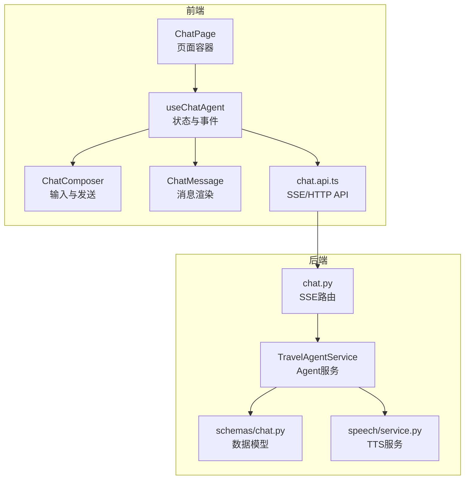
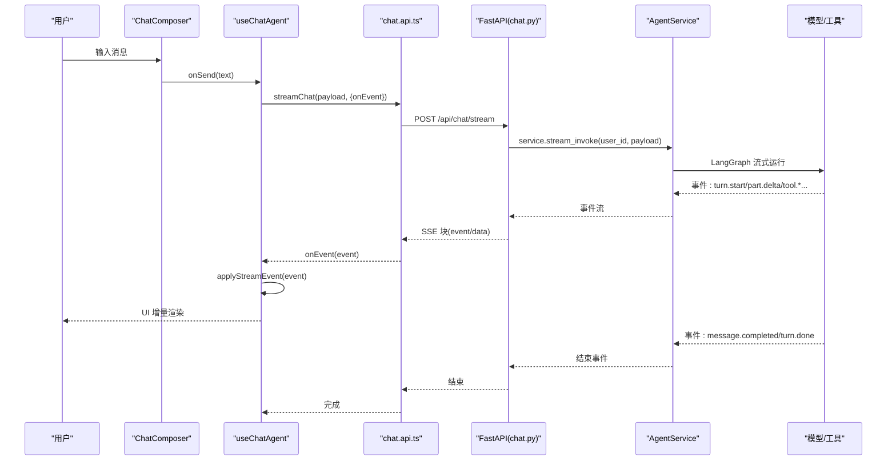
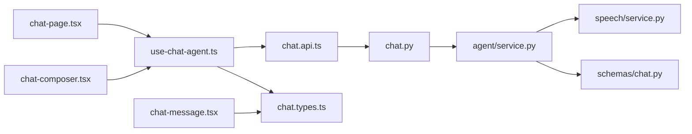

# 聊天交互系统

<cite>
**本文引用的文件**
- [backend/app/api/chat.py](file://backend/app/api/chat.py)
- [backend/app/agent/service.py](file://backend/app/agent/service.py)
- [backend/app/schemas/chat.py](file://backend/app/schemas/chat.py)
- [backend/app/speech/service.py](file://backend/app/speech/service.py)
- [backend/migrations/003_chat_versions.sql](file://backend/migrations/003_chat_versions.sql)
- [frontend/src/features/chat/api/chat.api.ts](file://frontend/src/features/chat/api/chat.api.ts)
- [frontend/src/features/chat/hooks/use-chat-agent.ts](file://frontend/src/features/chat/hooks/use-chat-agent.ts)
- [frontend/src/features/chat/ui/chat-page.tsx](file://frontend/src/features/chat/ui/chat-page.tsx)
- [frontend/src/features/chat/ui/chat-message.tsx](file://frontend/src/features/chat/ui/chat-message.tsx)
- [frontend/src/features/chat/ui/chat-composer.tsx](file://frontend/src/features/chat/ui/chat-composer.tsx)
- [frontend/src/features/chat/model/chat.types.ts](file://frontend/src/features/chat/model/chat.types.ts)
- [frontend/src/shared/lib/http.ts](file://frontend/src/shared/lib/http.ts)
- [frontend/src/features/chat/model/tool-card-registry.tsx](file://frontend/src/features/chat/model/tool-card-registry.tsx)
</cite>

## 目录
1. [简介](#简介)
2. [项目结构](#项目结构)
3. [核心组件](#核心组件)
4. [架构总览](#架构总览)
5. [详细组件分析](#详细组件分析)
6. [依赖关系分析](#依赖关系分析)
7. [性能考量](#性能考量)
8. [故障排查指南](#故障排查指南)
9. [结论](#结论)
10. [附录](#附录)

## 简介
本系统是一个基于 FastAPI + React 的实时聊天交互平台，支持：
- SSE 流式传输与前端解析
- 实时消息增量展示与工具调用可视化
- 快速提示（Quick Prompt）与模型档位切换
- 语音播放控制与消息版本管理
- 会话历史持久化与版本回溯

系统通过后端 Agent 服务驱动 LangGraph 流式事件，前端 Hook 将事件转换为 UI 状态，实现“从用户输入到 AI 回复”的完整闭环。

## 项目结构
- 后端采用分层设计：API 层负责路由与 SSE 输出，服务层封装 Agent 与流式管线，模型层定义数据结构，语音服务负责 TTS 生成与播放。
- 前端采用 Hooks + 组件化架构：use-chat-agent 统一管理状态与事件，UI 组件负责渲染与交互，API 层负责与后端通信。

图表来源
- [frontend/src/features/chat/ui/chat-page.tsx:140-741](file://frontend/src/features/chat/ui/chat-page.tsx#L140-L741)
- [frontend/src/features/chat/hooks/use-chat-agent.ts:125-596](file://frontend/src/features/chat/hooks/use-chat-agent.ts#L125-L596)
- [frontend/src/features/chat/api/chat.api.ts:107-180](file://frontend/src/features/chat/api/chat.api.ts#L107-L180)
- [backend/app/api/chat.py:41-72](file://backend/app/api/chat.py#L41-L72)
- [backend/app/agent/service.py:373-507](file://backend/app/agent/service.py#L373-L507)
- [backend/app/schemas/chat.py:18-274](file://backend/app/schemas/chat.py#L18-L274)
- [backend/app/speech/service.py:90-477](file://backend/app/speech/service.py#L90-L477)

章节来源
- [frontend/src/features/chat/ui/chat-page.tsx:140-741](file://frontend/src/features/chat/ui/chat-page.tsx#L140-L741)
- [backend/app/api/chat.py:1-72](file://backend/app/api/chat.py#L1-L72)

## 核心组件
- 后端 SSE 路由：将 Agent 服务产生的流事件以 SSE 形式输出，事件名与负载结构由后端模型定义。
- 前端 SSE 解析器：逐块解析 event/data，派发到应用层事件处理器。
- useChatAgent Hook：集中处理发送意图、事件应用、状态管理、版本切换、反馈与语音播放。
- ChatMessage 组件：渲染文本、推理片段、工具调用与结构化卡片，支持复制、语音播放、版本切换与反馈。
- ChatComposer 组件：多行输入、模型档位显示、发送与停止按钮。
- 语音服务：异步生成 MP3 并提供播放令牌，支持“生成中”与“就绪”两种状态。

章节来源
- [backend/app/api/chat.py:41-72](file://backend/app/api/chat.py#L41-L72)
- [frontend/src/features/chat/api/chat.api.ts:107-180](file://frontend/src/features/chat/api/chat.api.ts#L107-L180)
- [frontend/src/features/chat/hooks/use-chat-agent.ts:288-382](file://frontend/src/features/chat/hooks/use-chat-agent.ts#L288-L382)
- [frontend/src/features/chat/ui/chat-message.tsx:269-679](file://frontend/src/features/chat/ui/chat-message.tsx#L269-L679)
- [frontend/src/features/chat/ui/chat-composer.tsx:17-156](file://frontend/src/features/chat/ui/chat-composer.tsx#L17-L156)
- [backend/app/speech/service.py:90-477](file://backend/app/speech/service.py#L90-L477)

## 架构总览
系统采用“事件驱动 + 流式渲染”的架构：
- 用户输入经 ChatComposer 提交，useChatAgent 发起 SSE 请求。
- 后端 TravelAgentService 启动 LangGraph 流式运行，产生 turn.start、part.delta、tool.start/done、message.completed、turn.done、error 等事件。
- 前端 chat.api.ts 解析 SSE，useChatAgent.applyStreamEvent 更新消息状态与 UI。
- 语音服务在生成过程中同步更新版本语音状态，支持播放与回放。

图表来源
- [frontend/src/features/chat/ui/chat-composer.tsx:37-48](file://frontend/src/features/chat/ui/chat-composer.tsx#L37-L48)
- [frontend/src/features/chat/hooks/use-chat-agent.ts:460-476](file://frontend/src/features/chat/hooks/use-chat-agent.ts#L460-L476)
- [frontend/src/features/chat/api/chat.api.ts:107-180](file://frontend/src/features/chat/api/chat.api.ts#L107-L180)
- [backend/app/api/chat.py:41-72](file://backend/app/api/chat.py#L41-L72)
- [backend/app/agent/service.py:373-507](file://backend/app/agent/service.py#L373-L507)

## 详细组件分析

### 后端 API：SSE 路由与事件编码
- 路由：/api/chat/stream 使用 StreamingResponse 输出 text/event-stream。
- 编码：_encode_sse 将事件名与负载序列化为 SSE 块。
- 错误处理：捕获 ValueError 输出 error 事件；其他异常输出通用错误事件。
- 模型档位：/api/chat/model-profiles 返回前端可见的模型档位列表与默认值。

章节来源
- [backend/app/api/chat.py:25-72](file://backend/app/api/chat.py#L25-L72)
- [backend/app/schemas/chat.py:222-236](file://backend/app/schemas/chat.py#L222-L236)

### Agent 服务：流式事件生成与状态管理
- 流式入口：stream_invoke 启动 LangGraph 运行，产出 turn.start、part.delta、tool.*、message.completed、turn.done、error。
- 版本管理：assistant_message_versions 表支持 original/regenerated 两类版本，最多 3 个版本。
- 语音绑定：在生成过程中绑定版本与语音状态，完成后落盘为 ready。
- 回滚与清理：异常时回滚线程并清理未落库任务。

章节来源
- [backend/app/agent/service.py:373-507](file://backend/app/agent/service.py#L373-L507)
- [backend/migrations/003_chat_versions.sql:13-26](file://backend/migrations/003_chat_versions.sql#L13-L26)
- [backend/app/speech/service.py:145-237](file://backend/app/speech/service.py#L145-L237)

### 前端 API：SSE 解析与事件派发
- streamSse：fetch SSE，按块解析 event/data，JSON 反序列化，派发到 onEvent。
- dispatchStreamEvent：在 tool.start 之后等待下一帧绘制机会，确保 UI 反馈及时。
- 错误处理：非 2xx 抛出错误；浏览器不支持流式抛错；尾块处理。

章节来源
- [frontend/src/features/chat/api/chat.api.ts:107-180](file://frontend/src/features/chat/api/chat.api.ts#L107-L180)

### Hook：useChatAgent 状态与事件应用
- 状态：threadId、messages、sessions、modelProfiles、loading、error 等。
- 事件应用：applyStreamEvent 根据事件名更新消息状态（turn.start 创建占位、part.delta 增量拼接、tool.* 插入/更新、message.completed 替换、error 失败/回退）。
- 发送流程：prepareSendIntent 校验；executeSend 构造 payload，设置 onEvent，支持停止与重试。
- 版本与反馈：selectAssistantVersion、setAssistantFeedback。
- 语音：stopGenerating、regenerateLatestAssistantMessage、getAssistantSpeechPlaybackUrl。

章节来源
- [frontend/src/features/chat/hooks/use-chat-agent.ts:125-596](file://frontend/src/features/chat/hooks/use-chat-agent.ts#L125-L596)

### 页面与组件：ChatPage、ChatMessage、ChatComposer
- ChatPage：会话历史分组、快速提示、模型档位选择、语音播放控制、删除/重命名会话。
- ChatMessage：渲染文本、推理片段、工具调用与结构化卡片；支持复制、语音播放、版本切换、点赞/踩。
- ChatComposer：多行输入、Shift+Enter 发送、模型档位显示、停止生成。

章节来源
- [frontend/src/features/chat/ui/chat-page.tsx:140-741](file://frontend/src/features/chat/ui/chat-page.tsx#L140-L741)
- [frontend/src/features/chat/ui/chat-message.tsx:269-679](file://frontend/src/features/chat/ui/chat-message.tsx#L269-L679)
- [frontend/src/features/chat/ui/chat-composer.tsx:17-156](file://frontend/src/features/chat/ui/chat-composer.tsx#L17-L156)

### 数据模型与类型
- ChatStreamEvent：turn.start、part.delta、tool.start/done、message.completed、turn.done、error。
- ChatMessagePart：text、reasoning、tool 三类片段。
- PersistedChatMessage 与 AssistantVersion：支持多版本、反馈、语音状态。
- 会话模型：SessionSummary/SessionDetail、模型档位。

章节来源
- [frontend/src/features/chat/model/chat.types.ts:84-226](file://frontend/src/features/chat/model/chat.types.ts#L84-L226)
- [backend/app/schemas/chat.py:18-274](file://backend/app/schemas/chat.py#L18-L274)

### 语音播放控制
- 生成：SpeechService.start_generation/bind_generation/finish_generation，异步写入 spool 文件，完成后上传对象存储并标记 ready。
- 播放：build_playback_url 生成 JWT 令牌，get_playback_target 返回媒体类型与字节流迭代器；支持“生成中”实时流式播放。
- 前端：handleToggleSpeech 获取 playback_url，创建 Audio 播放，监听 ended/error 自动清理。

章节来源
- [backend/app/speech/service.py:145-296](file://backend/app/speech/service.py#L145-L296)
- [frontend/src/features/chat/ui/chat-page.tsx:337-369](file://frontend/src/features/chat/ui/chat-page.tsx#L337-L369)

### 快速提示与模型档位
- 快速提示：buildQuickPrompt 根据 kind 生成固定文案，点击后直接 sendMessage。
- 模型档位：listChatModelProfiles 返回 default_profile_key 与 profiles，用户可在页面选择切换。

章节来源
- [frontend/src/features/chat/ui/chat-page.tsx:63-80](file://frontend/src/features/chat/ui/chat-page.tsx#L63-L80)
- [frontend/src/features/chat/api/chat.api.ts:111-113](file://frontend/src/features/chat/api/chat.api.ts#L111-L113)

### 会话历史与版本管理
- 会话列表：listSessions、getSession、renameSession、deleteSession。
- 版本：assistant_message_versions 表记录 original 与 regenerated 版本，最多 3 个；支持版本切换与反馈。
- 语音资产：speech_status 与对象存储键，支持“生成中/就绪/失败”。

章节来源
- [frontend/src/features/chat/api/chat.api.ts:194-251](file://frontend/src/features/chat/api/chat.api.ts#L194-L251)
- [backend/migrations/003_chat_versions.sql:13-26](file://backend/migrations/003_chat_versions.sql#L13-L26)
- [backend/app/speech/service.py:238-296](file://backend/app/speech/service.py#L238-L296)

## 依赖关系分析

图表来源
- [frontend/src/features/chat/api/chat.api.ts:1-252](file://frontend/src/features/chat/api/chat.api.ts#L1-L252)
- [backend/app/api/chat.py:1-72](file://backend/app/api/chat.py#L1-L72)
- [backend/app/agent/service.py:1-529](file://backend/app/agent/service.py#L1-L529)
- [backend/app/speech/service.py:1-477](file://backend/app/speech/service.py#L1-L477)
- [frontend/src/features/chat/hooks/use-chat-agent.ts:1-596](file://frontend/src/features/chat/hooks/use-chat-agent.ts#L1-L596)
- [frontend/src/features/chat/model/chat.types.ts:1-226](file://frontend/src/features/chat/model/chat.types.ts#L1-L226)
- [frontend/src/features/chat/ui/chat-page.tsx:1-741](file://frontend/src/features/chat/ui/chat-page.tsx#L1-L741)
- [frontend/src/features/chat/ui/chat-message.tsx:1-679](file://frontend/src/features/chat/ui/chat-message.tsx#L1-L679)
- [frontend/src/features/chat/ui/chat-composer.tsx:1-156](file://frontend/src/features/chat/ui/chat-composer.tsx#L1-L156)

## 性能考量
- SSE 解析：逐块解析 event/data，避免一次性缓冲大块数据；dispatchStreamEvent 在 tool.start 后等待下一帧绘制，减少 UI 卡顿。
- 事件合并：mergeTextDelta 将 text_delta 合并到现有 parts，避免频繁重渲染。
- 语音生成：异步写入 spool 文件，完成后上传对象存储；播放时优先使用对象存储，生成中通过本地文件流式输出。
- 会话与版本：版本数量限制为 3，避免无限增长；删除会话时级联删除语音资产，防止磁盘膨胀。

## 故障排查指南
- SSE 连接失败：检查 /api/chat/stream 是否返回 200 且 Content-Type 为 text/event-stream；确认前端 fetch 的 Accept 与 Authorization。
- 事件解析错误：确认事件名在已知列表中；检查 JSON 反序列化是否成功；关注尾块处理。
- 语音播放 409：前端收到 HttpError(status=409) 时刷新当前线程，可能因语音状态变化导致播放地址失效。
- Agent 异常：后端捕获异常并发出 error 事件；前端 applyStreamEvent 将消息置为 failed 或回退到 fallbackAssistantMessage。
- 会话/版本异常：检查 assistant_message_versions 表约束与唯一索引；确认版本切换与反馈更新接口返回值。

章节来源
- [frontend/src/features/chat/api/chat.api.ts:115-180](file://frontend/src/features/chat/api/chat.api.ts#L115-L180)
- [frontend/src/features/chat/hooks/use-chat-agent.ts:358-382](file://frontend/src/features/chat/hooks/use-chat-agent.ts#L358-L382)
- [frontend/src/features/chat/ui/chat-page.tsx:365-369](file://frontend/src/features/chat/ui/chat-page.tsx#L365-L369)
- [backend/app/agent/service.py:444-482](file://backend/app/agent/service.py#L444-L482)

## 结论
该聊天交互系统通过清晰的前后端职责划分与事件驱动架构，实现了从用户输入到 AI 回复的实时流式体验。SSE 事件与前端 Hook 的配合，使得消息增量展示、工具调用可视化、版本管理与语音播放等复杂功能得以稳定实现。后续可考虑引入缓存与并发优化，以及更丰富的卡片渲染扩展。

## 附录

### 聊天流程示例（从用户输入到 AI 回复）
- 用户在 ChatComposer 输入消息并提交。
- useChatAgent.prepareSendIntent 校验，executeSend 构造 ChatInvokeRequest，调用 streamChat。
- chat.api.ts 发起 POST /api/chat/stream，后端返回 SSE。
- 后端 AgentService 逐步产出事件：turn.start → part.delta* → tool.start/done* → message.completed → turn.done。
- 前端 chat.api.ts 解析事件并派发到 useChatAgent.applyStreamEvent。
- UI 增量渲染：占位消息创建、文本片段拼接、工具调用与卡片展示、最终完成态。
- 语音服务在生成过程中更新版本语音状态，前端可点击播放。

章节来源
- [frontend/src/features/chat/ui/chat-composer.tsx:37-48](file://frontend/src/features/chat/ui/chat-composer.tsx#L37-L48)
- [frontend/src/features/chat/hooks/use-chat-agent.ts:460-476](file://frontend/src/features/chat/hooks/use-chat-agent.ts#L460-L476)
- [frontend/src/features/chat/api/chat.api.ts:107-180](file://frontend/src/features/chat/api/chat.api.ts#L107-L180)
- [backend/app/api/chat.py:41-72](file://backend/app/api/chat.py#L41-L72)
- [backend/app/agent/service.py:373-507](file://backend/app/agent/service.py#L373-L507)

### 前端 Hook 使用方法与最佳实践
- 使用 useChatAgent 初始化线程 ID、加载会话与模型档位、处理发送与停止。
- 在组件中通过 onEvent 应用事件，避免直接修改外部状态。
- 事件处理函数 applyStreamEvent 内部使用不可变更新，确保渲染一致性。
- 语音播放注意清理：stopSpeechPlayback 在组件卸载与线程切换时调用。

章节来源
- [frontend/src/features/chat/hooks/use-chat-agent.ts:125-596](file://frontend/src/features/chat/hooks/use-chat-agent.ts#L125-L596)
- [frontend/src/features/chat/ui/chat-page.tsx:206-226](file://frontend/src/features/chat/ui/chat-page.tsx#L206-L226)

### API 调用模式
- SSE：streamChat(payload, { onEvent, signal })；支持 AbortController 中断。
- HTTP：http.get/patch/post/delete；统一错误包装 HttpError。
- 语音：getAssistantSpeechPlaybackUrl(threadId, messageId, versionId) 获取播放地址。

章节来源
- [frontend/src/features/chat/api/chat.api.ts:107-251](file://frontend/src/features/chat/api/chat.api.ts#L107-L251)
- [frontend/src/shared/lib/http.ts:20-75](file://frontend/src/shared/lib/http.ts#L20-L75)