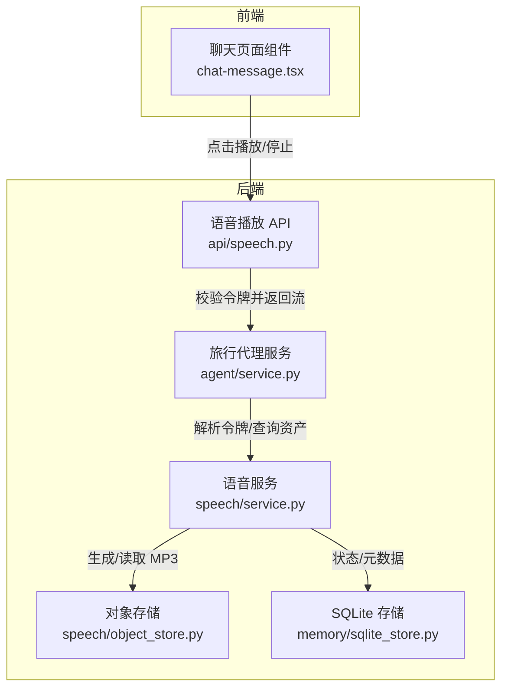
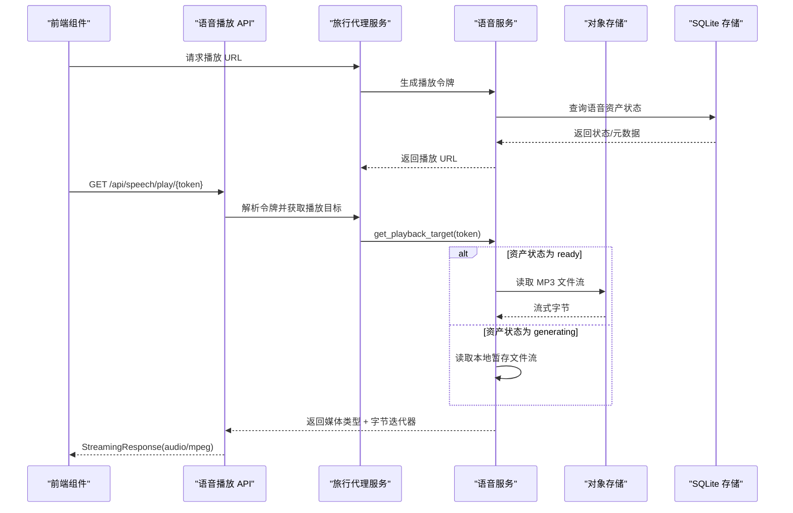
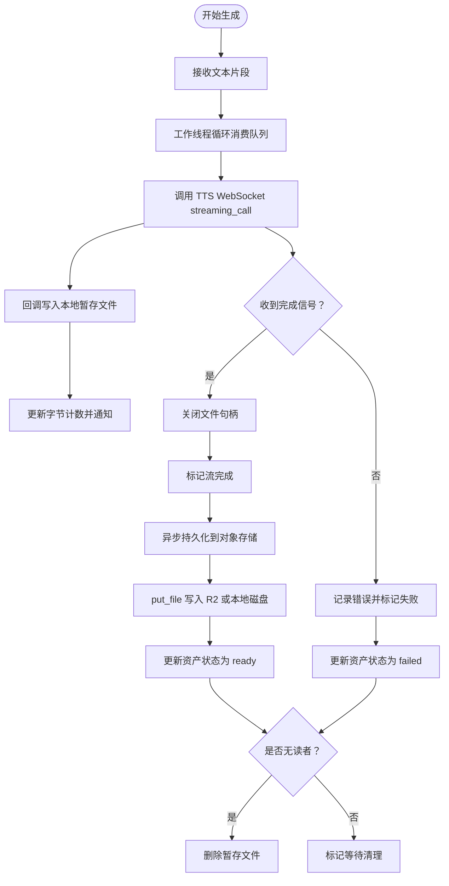
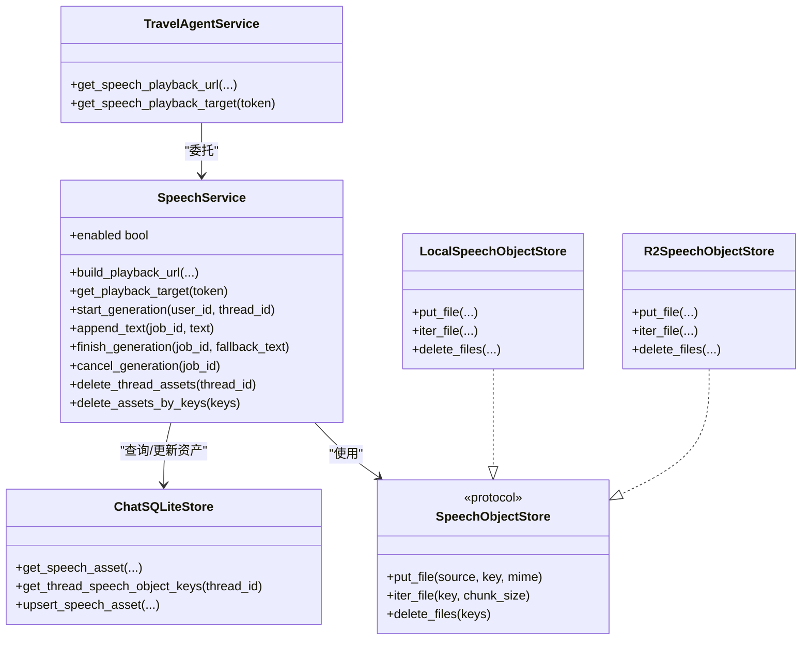
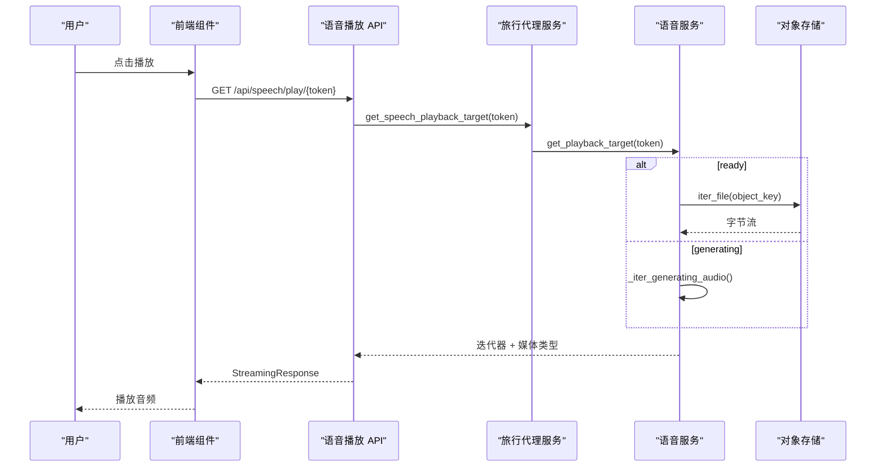
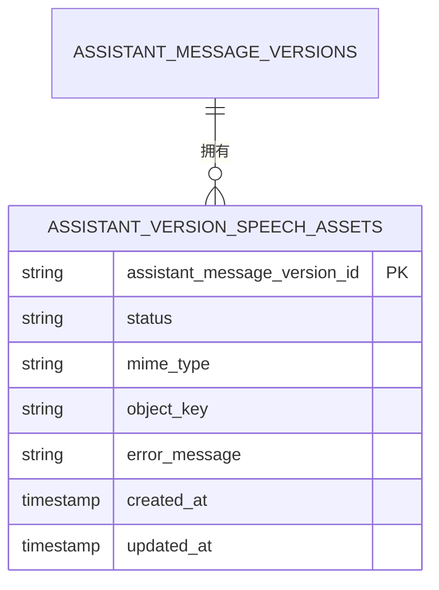

# 语音服务系统

<cite>
**本文档引用的文件**
- [backend/app/speech/service.py](file://backend/app/speech/service.py)
- [backend/app/speech/object_store.py](file://backend/app/speech/object_store.py)
- [backend/app/api/speech.py](file://backend/app/api/speech.py)
- [backend/app/agent/service.py](file://backend/app/agent/service.py)
- [backend/app/memory/sqlite_store.py](file://backend/app/memory/sqlite_store.py)
- [frontend/src/features/chat/ui/chat-message.tsx](file://frontend/src/features/chat/ui/chat-message.tsx)
- [backend/tests/test_speech_service.py](file://backend/tests/test_speech_service.py)
- [backend/migrations/004_chat_speech_assets.sql](file://backend/migrations/004_chat_speech_assets.sql)
</cite>

## 目录
1. [简介](#简介)
2. [项目结构](#项目结构)
3. [核心组件](#核心组件)
4. [架构总览](#架构总览)
5. [详细组件分析](#详细组件分析)
6. [依赖关系分析](#依赖关系分析)
7. [性能考虑](#性能考虑)
8. [故障排除指南](#故障排除指南)
9. [结论](#结论)
10. [附录](#附录)

## 简介
本文件面向语音服务系统的使用者与维护者，系统性阐述从文本到语音播放的完整流程，包括：
- TTS 服务集成与音频生成流水线
- 对象存储管理与持久化策略
- 播放 URL 生成、音频流管理与播放状态跟踪
- 前端语音播放组件的交互与状态反馈
- 完整的集成示例与最佳实践
- 音频格式处理、缓存策略与性能优化建议
- 错误处理、重试机制与监控指标

## 项目结构
语音服务位于后端 Python 代码中，前端通过按钮触发播放，后端提供安全的临时令牌访问音频流。

**图表来源**
- [backend/app/api/speech.py:15-34](file://backend/app/api/speech.py#L15-L34)
- [backend/app/agent/service.py:190-210](file://backend/app/agent/service.py#L190-L210)
- [backend/app/speech/service.py:238-296](file://backend/app/speech/service.py#L238-L296)
- [backend/app/speech/object_store.py:122-138](file://backend/app/speech/object_store.py#L122-L138)
- [backend/app/memory/sqlite_store.py:509-541](file://backend/app/memory/sqlite_store.py#L509-L541)

**章节来源**
- [backend/app/api/speech.py:1-35](file://backend/app/api/speech.py#L1-L35)
- [backend/app/agent/service.py:97-210](file://backend/app/agent/service.py#L97-L210)
- [backend/app/speech/service.py:90-127](file://backend/app/speech/service.py#L90-L127)
- [backend/app/speech/object_store.py:1-139](file://backend/app/speech/object_store.py#L1-L139)
- [backend/app/memory/sqlite_store.py:509-541](file://backend/app/memory/sqlite_store.py#L509-L541)

## 核心组件
- 语音服务（SpeechService）：负责 TTS 生成、本地暂存、对象存储持久化、播放令牌签发与播放目标生成。
- 对象存储（SpeechObjectStore）：抽象本地磁盘与 R2 对象存储，统一 put/iter/delete 接口。
- 旅行代理服务（TravelAgentService）：对外门面，协调聊天与语音播放，提供播放 URL 与播放目标解析。
- 语音播放 API（/api/speech/play/{token}）：基于 JWT 令牌的安全音频流接口。
- SQLite 存储：维护消息版本、语音资产状态与 MIME 类型等元数据。

**章节来源**
- [backend/app/speech/service.py:90-127](file://backend/app/speech/service.py#L90-L127)
- [backend/app/speech/object_store.py:12-21](file://backend/app/speech/object_store.py#L12-L21)
- [backend/app/agent/service.py:97-114](file://backend/app/agent/service.py#L97-L114)
- [backend/app/api/speech.py:15-34](file://backend/app/api/speech.py#L15-L34)
- [backend/app/memory/sqlite_store.py:61-71](file://backend/app/memory/sqlite_store.py#L61-L71)

## 架构总览
语音服务采用“边生成边播放”的架构：后端以流式方式接收文本片段，调用阿里云 TTS WebSocket 接口生成 MP3 片段，同时写入本地暂存文件；生成完成后上传至对象存储并更新资产状态；播放时通过短期 JWT 令牌授权，优先返回对象存储中的 MP3，若仍在生成则返回本地暂存文件的实时流。

**图表来源**
- [backend/app/agent/service.py:190-210](file://backend/app/agent/service.py#L190-L210)
- [backend/app/speech/service.py:238-296](file://backend/app/speech/service.py#L238-L296)
- [backend/app/speech/object_store.py:86-109](file://backend/app/speech/object_store.py#L86-L109)
- [backend/app/api/speech.py:15-34](file://backend/app/api/speech.py#L15-L34)

## 详细组件分析

### 语音服务（SpeechService）
职责与特性：
- 生成与管理语音生成任务（SpeechGenerationJob），支持多版本绑定与状态追踪。
- 使用 DashScope TTS WebSocket API，以 MP3_22050HZ_MONO_256KBPS 格式生成音频。
- 本地暂存（spool）与对象存储（assets）双路径：生成期间返回暂存流，完成后持久化并更新状态。
- 令牌签发与验证：播放 URL 中嵌入短期 JWT，包含用户、会话、消息与版本标识。
- 状态管理：generating/ready/failed 三态，失败时记录错误信息并清理。

关键流程图（生成与持久化）：

**图表来源**
- [backend/app/speech/service.py:298-371](file://backend/app/speech/service.py#L298-L371)
- [backend/app/speech/service.py:387-421](file://backend/app/speech/service.py#L387-L421)
- [backend/app/speech/service.py:422-454](file://backend/app/speech/service.py#L422-L454)

播放目标生成与令牌：
- build_playback_url：根据用户、会话、消息与版本查询资产状态，签发短期 JWT，返回播放 URL 与当前状态。
- get_playback_target：解码 JWT，校验用途，查询资产，若 ready 则从对象存储读取，若 generating 则从暂存流读取。

**章节来源**
- [backend/app/speech/service.py:90-127](file://backend/app/speech/service.py#L90-L127)
- [backend/app/speech/service.py:238-296](file://backend/app/speech/service.py#L238-L296)
- [backend/app/speech/service.py:298-371](file://backend/app/speech/service.py#L298-L371)
- [backend/app/speech/service.py:387-454](file://backend/app/speech/service.py#L387-L454)

### 对象存储（SpeechObjectStore）
- 协议定义：put_file、iter_file、delete_files。
- 本地实现：将文件复制到指定路径，按 object_key 组织目录结构。
- R2 实现：通过 boto3 客户端上传/下载/批量删除，设置 ContentType。
- 自动选择：当环境变量齐全时优先使用 R2，否则回退本地磁盘。

**章节来源**
- [backend/app/speech/object_store.py:12-21](file://backend/app/speech/object_store.py#L12-L21)
- [backend/app/speech/object_store.py:23-62](file://backend/app/speech/object_store.py#L23-L62)
- [backend/app/speech/object_store.py:64-120](file://backend/app/speech/object_store.py#L64-L120)
- [backend/app/speech/object_store.py:122-139](file://backend/app/speech/object_store.py#L122-L139)

### 旅行代理服务（TravelAgentService）
- 作为门面协调聊天与语音播放，提供 get_speech_playback_url 与 get_speech_playback_target。
- 在会话删除时，先查询待删除的语音 object_keys，再删除 DB 记录，最后删除对象存储文件，确保一致性。

**章节来源**
- [backend/app/agent/service.py:168-176](file://backend/app/agent/service.py#L168-L176)
- [backend/app/agent/service.py:190-210](file://backend/app/agent/service.py#L190-L210)

### 语音播放 API（/api/speech/play/{token}）
- 路由：GET /api/speech/play/{token}
- 行为：校验 JWT，解析 token 获取用户、会话、消息与版本信息，调用旅行代理服务获取播放目标，返回 StreamingResponse。
- 错误处理：无效令牌、资源不存在、冲突状态分别返回 401/404/409。

**章节来源**
- [backend/app/api/speech.py:15-34](file://backend/app/api/speech.py#L15-L34)

### SQLite 存储（语音资产）
- 语音资产结构：包含状态、MIME 类型、对象键与错误信息。
- 查询接口：按 thread_id 加载版本语音资产，供 UI 展示“生成中/就绪/失败”状态。

**章节来源**
- [backend/app/memory/sqlite_store.py:61-71](file://backend/app/memory/sqlite_store.py#L61-L71)
- [backend/app/memory/sqlite_store.py:509-541](file://backend/app/memory/sqlite_store.py#L509-L541)

### 前端语音播放组件（chat-message.tsx）
- 渲染逻辑：根据消息版本的 speech_status（generating/ready）显示播放/停止按钮。
- 用户交互：点击播放按钮触发 onToggleSpeech 回调，传入 persistedMessageId 与 versionId。
- 状态反馈：isSpeechPlaying 参数用于高亮当前播放状态；UI 通过图标与文案提示用户操作。

**章节来源**
- [frontend/src/features/chat/ui/chat-message.tsx:295-302](file://frontend/src/features/chat/ui/chat-message.tsx#L295-L302)
- [frontend/src/features/chat/ui/chat-message.tsx:510-519](file://frontend/src/features/chat/ui/chat-message.tsx#L510-L519)

## 依赖关系分析

**图表来源**
- [backend/app/speech/service.py:90-127](file://backend/app/speech/service.py#L90-L127)
- [backend/app/speech/object_store.py:12-21](file://backend/app/speech/object_store.py#L12-L21)
- [backend/app/speech/object_store.py:23-120](file://backend/app/speech/object_store.py#L23-L120)
- [backend/app/agent/service.py:190-210](file://backend/app/agent/service.py#L190-L210)
- [backend/app/memory/sqlite_store.py:509-541](file://backend/app/memory/sqlite_store.py#L509-L541)

**章节来源**
- [backend/app/speech/service.py:90-127](file://backend/app/speech/service.py#L90-L127)
- [backend/app/speech/object_store.py:12-139](file://backend/app/speech/object_store.py#L12-L139)
- [backend/app/agent/service.py:190-210](file://backend/app/agent/service.py#L190-L210)
- [backend/app/memory/sqlite_store.py:509-541](file://backend/app/memory/sqlite_store.py#L509-L541)

## 性能考虑
- 流式生成与播放：TTS 以 MP3 片段写入本地暂存文件，播放时按块读取，降低内存占用。
- 并发与锁：作业对象使用线程锁保护共享状态，避免竞态；事件通知驱动播放流更新。
- 对象存储：R2 适合分布式部署，具备更好的扩展性；本地磁盘适合开发与小规模部署。
- 缓存策略：播放 URL 为短期令牌，避免长期缓存；对象存储文件按版本 key 组织，便于清理。
- I/O 优化：读取使用 asyncio.to_thread 将阻塞 IO 放置线程池，避免阻塞事件循环。

[本节为通用性能建议，不直接分析具体文件，故无章节来源]

## 故障排除指南
常见问题与处理：
- 服务未启用：当缺少 TTS API 密钥或 JWT 密钥时，服务不可用。可通过环境变量检查与测试用例验证。
- 播放令牌无效：API 层捕获无效令牌与过期令牌，返回 401。
- 资源不存在：资产状态非 generating/ready 时，返回 404 或 409。
- 生成失败：TTS 回调 on_error 触发，服务记录错误并标记失败；播放时返回冲突状态。
- 清理策略：播放完成后若无读者，删除暂存文件；删除会话时先查询 object_keys 再删除对象存储文件。

**章节来源**
- [backend/tests/test_speech_service.py:7-19](file://backend/tests/test_speech_service.py#L7-L19)
- [backend/app/api/speech.py:21-28](file://backend/app/api/speech.py#L21-L28)
- [backend/app/speech/service.py:373-385](file://backend/app/speech/service.py#L373-L385)
- [backend/app/agent/service.py:168-176](file://backend/app/agent/service.py#L168-L176)

## 结论
该语音服务系统通过“生成即播放”的设计，结合短期令牌与对象存储，实现了从文本到音频的高效流转与可靠播放。其模块化设计便于扩展与维护，适合在多端应用中集成。

[本节为总结性内容，不直接分析具体文件，故无章节来源]

## 附录

### 完整集成示例（从文本到播放）
- 后端：在聊天流中启动语音生成任务，绑定版本，持续推送文本片段，完成后结束生成。
- 前端：渲染消息版本的语音状态，点击播放按钮发起播放请求。
- 播放：API 校验令牌，返回音频流；前端使用浏览器原生音频能力播放。

**图表来源**
- [frontend/src/features/chat/ui/chat-message.tsx:510-519](file://frontend/src/features/chat/ui/chat-message.tsx#L510-L519)
- [backend/app/api/speech.py:15-34](file://backend/app/api/speech.py#L15-L34)
- [backend/app/agent/service.py:208-210](file://backend/app/agent/service.py#L208-L210)
- [backend/app/speech/service.py:270-296](file://backend/app/speech/service.py#L270-L296)
- [backend/app/speech/service.py:422-454](file://backend/app/speech/service.py#L422-L454)

### 数据模型（语音资产）

**图表来源**
- [backend/migrations/004_chat_speech_assets.sql](file://backend/migrations/004_chat_speech_assets.sql)