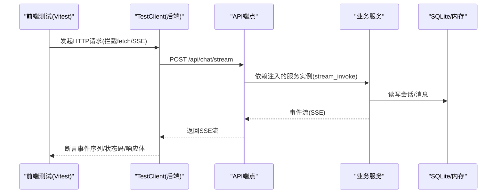
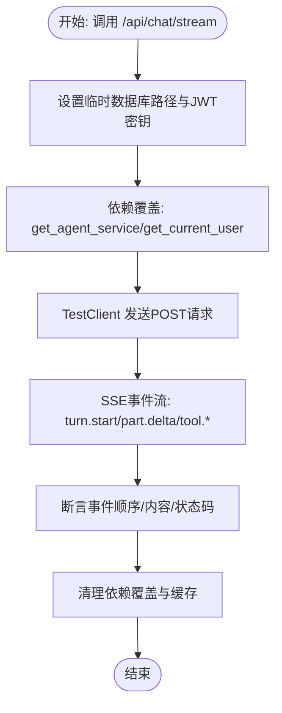
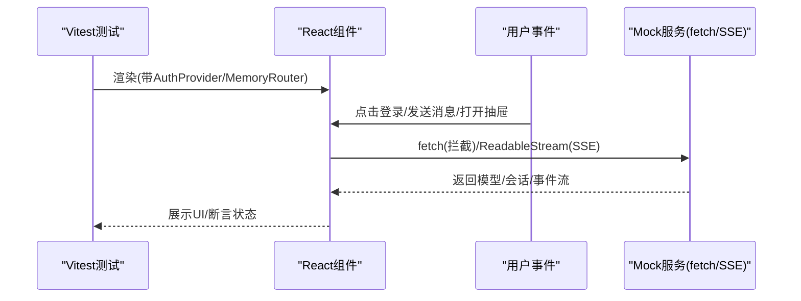
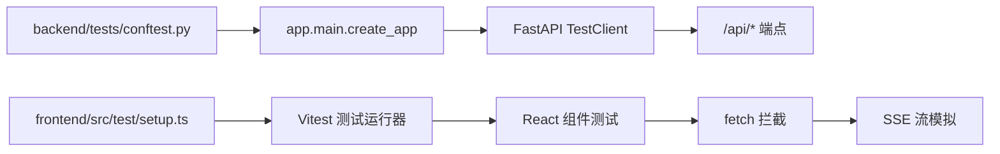

# 测试策略

<cite>
**本文引用的文件**
- [backend/pyproject.toml](file://backend/pyproject.toml)
- [backend/Dockerfile](file://backend/Dockerfile)
- [backend/tests/conftest.py](file://backend/tests/conftest.py)
- [backend/tests/test_api.py](file://backend/tests/test_api.py)
- [backend/tests/test_auth_api.py](file://backend/tests/test_auth_api.py)
- [frontend/package.json](file://frontend/package.json)
- [frontend/src/test/setup.ts](file://frontend/src/test/setup.ts)
- [frontend/src/features/chat/ui/chat-page.test.tsx](file://frontend/src/features/chat/ui/chat-page.test.tsx)
- [frontend/src/features/chat/ui/chat-message.test.tsx](file://frontend/src/features/chat/ui/chat-message.test.tsx)
- [frontend/src/features/chat/model/tool-card-registry.test.ts](file://frontend/src/features/chat/model/tool-card-registry.test.ts)
</cite>

## 目录
1. [引言](#引言)
2. [项目结构与测试范围](#项目结构与测试范围)
3. [核心组件与测试职责](#核心组件与测试职责)
4. [架构总览与测试分层](#架构总览与测试分层)
5. [详细组件测试分析](#详细组件测试分析)
6. [依赖关系与耦合分析](#依赖关系与耦合分析)
7. [性能与稳定性考量](#性能与稳定性考量)
8. [故障排查与调试指南](#故障排查与调试指南)
9. [结论与改进建议](#结论与改进建议)
10. [附录：覆盖率与CI配置建议](#附录覆盖率与ci配置建议)

## 引言
本测试策略文档面向后端（FastAPI）、前端（React + Vitest）与API交互场景，系统化阐述单元测试、集成测试与端到端测试的设计与实施要点。文档覆盖测试框架选择、测试数据与Mock策略、后端服务与API测试、前端组件与用户交互测试、以及性能、安全与兼容性测试方法，并给出覆盖率目标、持续集成配置建议与测试维护策略。

## 项目结构与测试范围
- 后端采用Python与FastAPI，使用pytest作为测试框架，支持异步测试模式；Dockerfile用于容器化运行与部署。
- 前端采用React与Vitest，配合@testing-library生态进行组件级测试；package.json定义了测试脚本与依赖。
- 测试覆盖范围包括：
  - 后端API端点与业务逻辑（认证、聊天流、会话管理、语音等）
  - 前端组件行为与路由守卫、状态持久化、事件流模拟
  - 跨前后端集成（通过TestClient与前端fetch拦截）

```mermaid
graph TB
subgraph "后端"
A["FastAPI 应用<br/>pytest 测试"]
B["API 端点<br/>认证/聊天/会话/语音"]
C["依赖注入与Mock<br/>get_agent_service/get_current_user"]
end
subgraph "前端"
D["React 组件<br/>Vitest 测试"]
E["UI 行为与交互<br/>路由/鉴权/会话恢复"]
F["事件流模拟<br/>SSE/网络请求"]
end
A --> B
B --> C
D --> E
E --> F
A <- --> D
```

图表来源
- [backend/tests/test_api.py:321-440](file://backend/tests/test_api.py#L321-L440)
- [backend/tests/test_auth_api.py:22-57](file://backend/tests/test_auth_api.py#L22-L57)
- [frontend/src/features/chat/ui/chat-page.test.tsx:164-204](file://frontend/src/features/chat/ui/chat-page.test.tsx#L164-L204)

章节来源
- [backend/pyproject.toml:26-42](file://backend/pyproject.toml#L26-L42)
- [backend/Dockerfile:1-21](file://backend/Dockerfile#L1-L21)
- [frontend/package.json:6-13](file://frontend/package.json#L6-L13)

## 核心组件与测试职责
- 后端测试
  - 使用FastAPI TestClient与依赖注入覆盖层，对认证、聊天流、会话管理、语音播放URL与播放接口进行断言。
  - 通过MonkeyPatch替换环境变量与服务实例，隔离外部依赖，确保可重复性与可控性。
- 前端测试
  - 使用Vitest与@testing-library进行组件级测试，覆盖未登录/登录态、路由守卫、会话恢复、消息渲染、工具调用卡片与引用标注等。
  - 通过全局fetch拦截与ReadableStream模拟SSE事件，验证实时交互。
- 集成测试
  - 以TestClient驱动后端，前端通过拦截fetch与SSE流对接，形成端到端闭环。

章节来源
- [backend/tests/test_api.py:321-440](file://backend/tests/test_api.py#L321-L440)
- [backend/tests/test_auth_api.py:59-119](file://backend/tests/test_auth_api.py#L59-L119)
- [frontend/src/features/chat/ui/chat-page.test.tsx:164-204](file://frontend/src/features/chat/ui/chat-page.test.tsx#L164-L204)

## 架构总览与测试分层
- 单元测试（Unit）
  - 后端：针对服务方法与工具函数，使用依赖覆盖与环境变量控制，断言返回值与异常路径。
  - 前端：针对纯函数与小模块（如卡片分组），断言输入输出。
- 集成测试（Integration）
  - 后端：TestClient驱动API，覆盖认证、聊天流、会话生命周期、错误与边界条件。
  - 前端：拦截fetch/SSE，模拟后端事件流，验证UI行为与状态更新。
- 端到端测试（E2E）
  - 通过TestClient与前端测试栈组合，覆盖真实用户路径（登录→发起会话→接收流式响应→切换版本/反馈/语音）。



图表来源
- [backend/tests/test_api.py:321-358](file://backend/tests/test_api.py#L321-L358)
- [backend/tests/conftest.py:1-9](file://backend/tests/conftest.py#L1-L9)

## 详细组件测试分析

### 后端API测试（认证与聊天）
- 认证API
  - CORS预检校验仅允许特定本地源；验证码发送/校验与JWT签发；用户信息查询。
  - Mock策略：替换环境变量、禁用真实邮件发送、使用缓存清理避免依赖残留。
- 聊天与会话API
  - SSE流式响应、会话列表/详情、重生成、版本切换、反馈、语音URL与播放。
  - Mock策略：自定义服务类实现流式事件生成，覆盖正常与异常分支（业务错误、内部异常隐藏）。



图表来源
- [backend/tests/test_api.py:321-358](file://backend/tests/test_api.py#L321-L358)

章节来源
- [backend/tests/test_auth_api.py:22-57](file://backend/tests/test_auth_api.py#L22-L57)
- [backend/tests/test_auth_api.py:59-119](file://backend/tests/test_auth_api.py#L59-L119)
- [backend/tests/test_api.py:321-440](file://backend/tests/test_api.py#L321-L440)
- [backend/tests/test_api.py:442-474](file://backend/tests/test_api.py#L442-L474)
- [backend/tests/test_api.py:476-511](file://backend/tests/test_api.py#L476-L511)

### 前端组件测试（聊天页面与消息）
- 聊天页面
  - 未登录态显示品牌与快捷提示，点击登录弹窗；登录后进入会话页；路由守卫与抽屉入口行为。
  - Mock策略：全局fetch拦截、SSE流构造、位置权限模拟、UUID生成器替换。
- 消息组件
  - 复制、再生、版本切换、反馈、语音播放、工具调用分组与详情、思考过程展开、引用标注渲染。
  - Mock策略：navigator.clipboard、工具面板弹窗挂载根节点、卡片类型路由。



图表来源
- [frontend/src/features/chat/ui/chat-page.test.tsx:164-204](file://frontend/src/features/chat/ui/chat-page.test.tsx#L164-L204)
- [frontend/src/features/chat/ui/chat-message.test.tsx:65-87](file://frontend/src/features/chat/ui/chat-message.test.tsx#L65-L87)

章节来源
- [frontend/src/features/chat/ui/chat-page.test.tsx:164-204](file://frontend/src/features/chat/ui/chat-page.test.tsx#L164-L204)
- [frontend/src/features/chat/ui/chat-page.test.tsx:206-233](file://frontend/src/features/chat/ui/chat-page.test.tsx#L206-L233)
- [frontend/src/features/chat/ui/chat-page.test.tsx:349-357](file://frontend/src/features/chat/ui/chat-page.test.tsx#L349-L357)
- [frontend/src/features/chat/ui/chat-page.test.tsx:437-546](file://frontend/src/features/chat/ui/chat-page.test.tsx#L437-L546)
- [frontend/src/features/chat/ui/chat-message.test.tsx:101-174](file://frontend/src/features/chat/ui/chat-message.test.tsx#L101-L174)
- [frontend/src/features/chat/ui/chat-message.test.tsx:176-229](file://frontend/src/features/chat/ui/chat-message.test.tsx#L176-L229)
- [frontend/src/features/chat/ui/chat-message.test.tsx:231-274](file://frontend/src/features/chat/ui/chat-message.test.tsx#L231-L274)

### 前端工具卡片与类型注册测试
- 卡片分组与渲染器注册：验证同类型连续卡片合并、不同类型分组、未知类型的回退渲染。
- 测试要点：空输入、类型切换、数量分组。

章节来源
- [frontend/src/features/chat/model/tool-card-registry.test.ts:19-48](file://frontend/src/features/chat/model/tool-card-registry.test.ts#L19-L48)
- [frontend/src/features/chat/model/tool-card-registry.test.ts:50-60](file://frontend/src/features/chat/model/tool-card-registry.test.ts#L50-L60)

## 依赖关系与耦合分析
- 后端
  - 测试通过conftest.py扩展Python路径，确保导入应用模块；TestClient直接驱动应用工厂，减少外部依赖。
  - 依赖注入覆盖get_agent_service与get_current_user，隔离外部服务与数据库。
- 前端
  - setup.ts引入jest-dom适配器；组件测试通过MemoryRouter与AuthProvider包裹，确保路由与上下文可用。
  - 全局fetch被Vitest拦截，SSE通过ReadableStream模拟，降低对外部网络的依赖。



图表来源
- [backend/tests/conftest.py:1-9](file://backend/tests/conftest.py#L1-L9)
- [frontend/src/test/setup.ts:1-2](file://frontend/src/test/setup.ts#L1-L2)

章节来源
- [backend/tests/conftest.py:1-9](file://backend/tests/conftest.py#L1-L9)
- [frontend/src/test/setup.ts:1-2](file://frontend/src/test/setup.ts#L1-L2)

## 性能与稳定性考量
- 性能测试
  - 建议对聊天流端点进行压力测试，关注SSE事件吞吐、并发会话数与数据库写入延迟。
  - 前端侧可使用Vitest计时与内存快照，评估组件渲染与事件处理开销。
- 稳定性
  - 通过依赖覆盖与环境隔离，确保测试不受外部服务波动影响。
  - 对异常路径进行显式断言，避免内部细节泄露至客户端。

## 故障排查与调试指南
- 后端
  - 使用pytest的--pdb或--log-cli-level=DEBUG定位异常；检查依赖覆盖是否生效与环境变量是否正确。
  - 关注SSE事件解析逻辑，确保事件名称与数据字段匹配。
- 前端
  - 使用Vitest的--watch模式与交互式断言；对fetch拦截与SSE流进行逐步断言。
  - 对路由守卫与会话恢复逻辑，检查存储状态与初始路径一致性。

章节来源
- [backend/tests/test_api.py:303-318](file://backend/tests/test_api.py#L303-L318)
- [frontend/src/features/chat/ui/chat-page.test.tsx:164-172](file://frontend/src/features/chat/ui/chat-page.test.tsx#L164-L172)

## 结论与改进建议
- 已有测试覆盖了核心业务路径：认证、聊天流、会话管理与前端交互。
- 建议补充：
  - 后端：数据库迁移测试、连接池与并发访问测试、第三方服务超时与熔断测试。
  - 前端：更丰富的工具卡片渲染与引用标注测试、国际化与无障碍测试。
  - 全局：统一的测试报告与覆盖率导出，完善CI流水线。

## 附录：覆盖率与CI配置建议
- 覆盖率要求
  - 后端：语句覆盖率≥80%，分支覆盖率≥70%，关键路径（认证/聊天/会话）100%。
  - 前端：组件覆盖率≥85%，关键交互（登录/会话/消息）100%。
- CI配置建议
  - 后端：pytest + coverage结合，Docker镜像内运行测试，导出XML报告供CI使用。
  - 前端：Vitest内置覆盖率，结合Jest DOM与Testing Library适配器，生成HTML报告。
  - 触发策略：PR触发全量测试，主分支保护与覆盖率阈值门禁。

章节来源
- [backend/pyproject.toml:26-42](file://backend/pyproject.toml#L26-L42)
- [frontend/package.json:6-13](file://frontend/package.json#L6-L13)