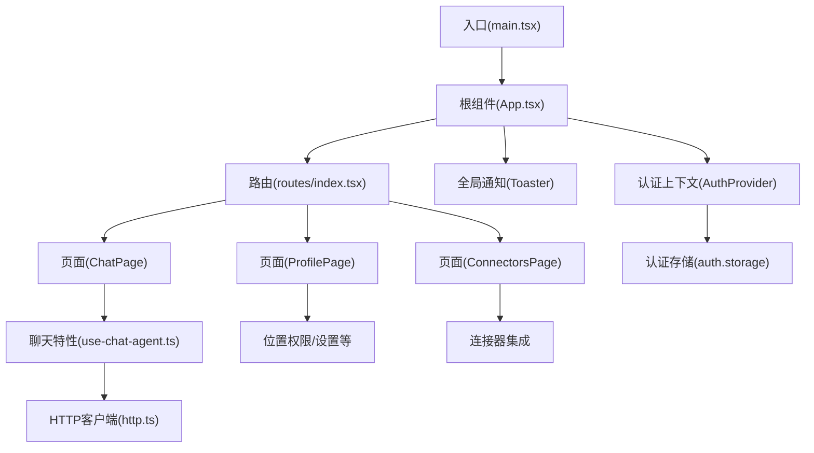
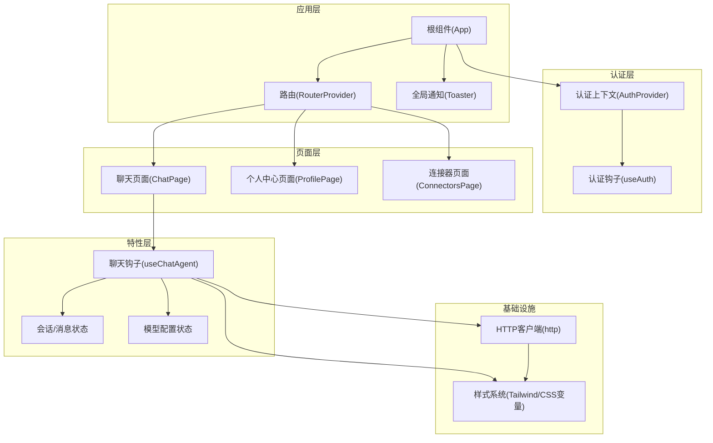
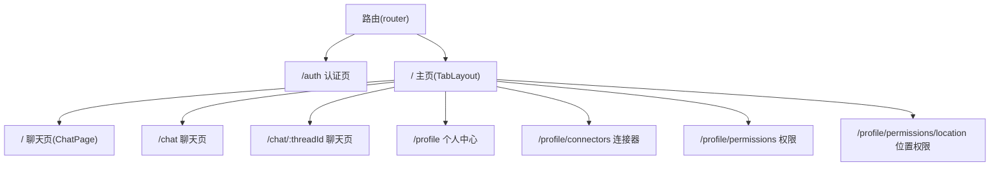
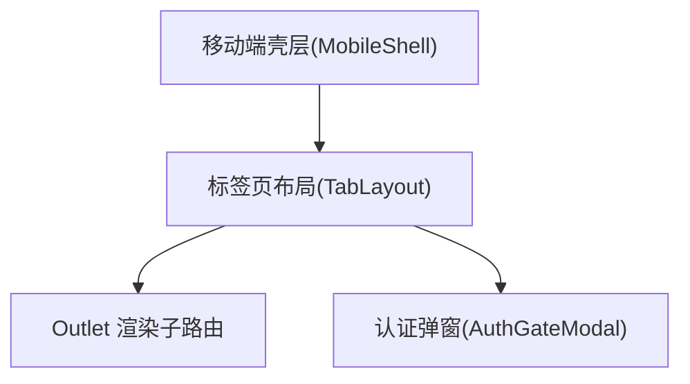
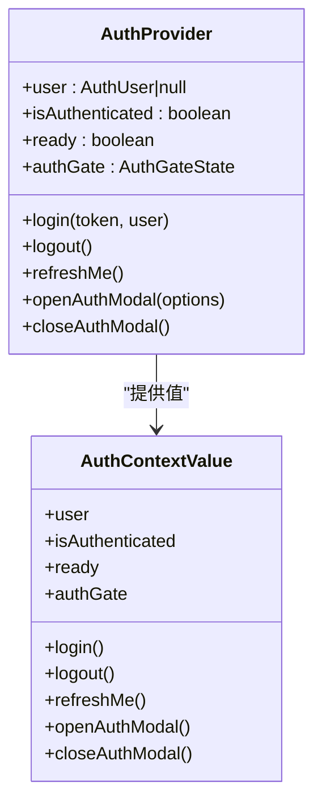
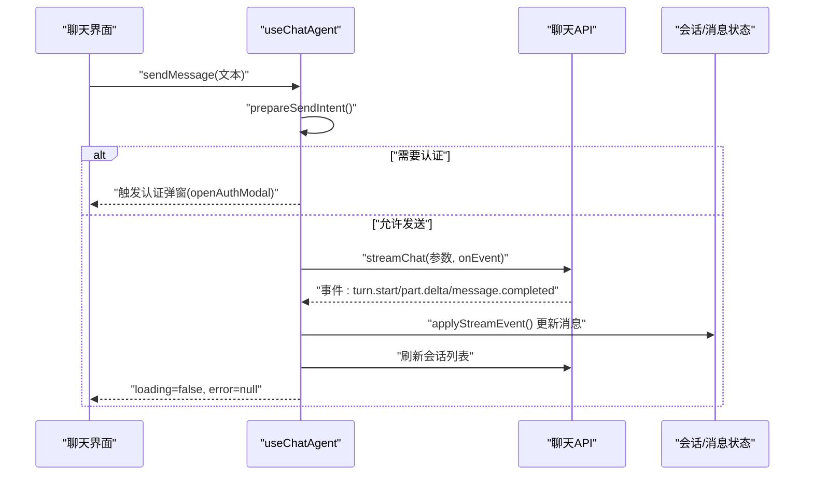
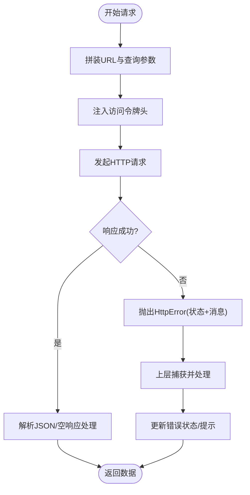
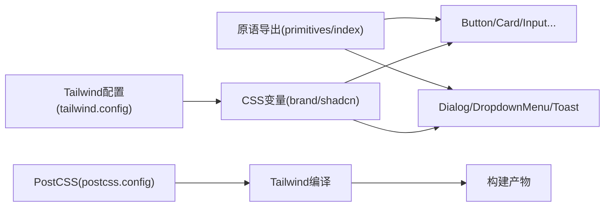
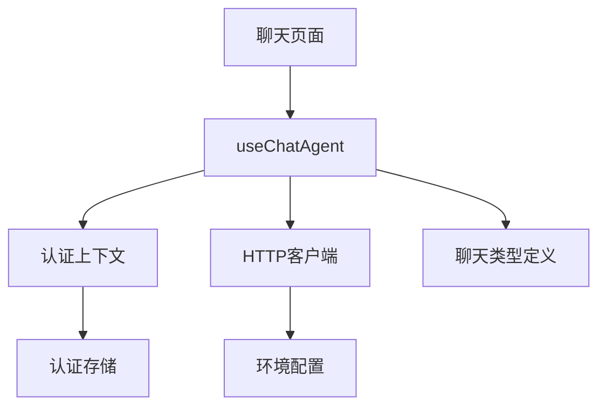

# 前端架构设计

<cite>
**本文引用的文件**
- [main.tsx](file://frontend/src/main.tsx)
- [App.tsx](file://frontend/src/app/App.tsx)
- [routes/index.tsx](file://frontend/src/app/routes/index.tsx)
- [vite.config.ts](file://frontend/vite.config.ts)
- [package.json](file://frontend/package.json)
- [auth.context.tsx](file://frontend/src/features/auth/model/auth.context.tsx)
- [tab-layout.tsx](file://frontend/src/shared/layouts/tab-layout.tsx)
- [mobile-shell.tsx](file://frontend/src/shared/layouts/mobile-shell.tsx)
- [primitives/index.ts](file://frontend/src/shared/ui/primitives/index.ts)
- [tailwind.config.ts](file://frontend/tailwind.config.ts)
- [postcss.config.js](file://frontend/postcss.config.js)
- [chat/index.tsx](file://frontend/src/pages/chat/index.tsx)
- [use-chat-agent.ts](file://frontend/src/features/chat/hooks/use-chat-agent.ts)
- [http.ts](file://frontend/src/shared/lib/http.ts)
- [tsconfig.json](file://frontend/tsconfig.json)
</cite>

## 目录
1. [引言](#引言)
2. [项目结构](#项目结构)
3. [核心组件](#核心组件)
4. [架构总览](#架构总览)
5. [详细组件分析](#详细组件分析)
6. [依赖关系分析](#依赖关系分析)
7. [性能考虑](#性能考虑)
8. [故障排查指南](#故障排查指南)
9. [结论](#结论)
10. [附录](#附录)

## 引言
本文件面向前端架构设计与实现，聚焦于React应用的组件层次、状态管理模式、路由与布局系统、移动端优先设计理念、UI组件库使用、状态管理钩子模式、异步数据处理与错误边界处理、构建配置、样式系统与性能优化策略，并提供组件树结构图与数据流向图，帮助开发者快速理解与迭代该前端工程。

## 项目结构
前端采用按“特性(feature)”与“共享(shared)”分层组织的模块化结构，结合Vite构建工具与TailwindCSS样式体系，形成清晰的职责边界与可维护性。

- 应用入口与初始化
  - 入口文件负责挂载根组件与全局样式，随后由根组件承载路由与全局状态。
- 路由与布局
  - 使用现代路由方案定义多级嵌套路由，配合移动端壳层与标签页布局，实现统一的移动端体验。
- 特性域
  - 认证、聊天、连接器、位置权限等特性均以独立目录组织，便于扩展与测试。
- 共享层
  - 包含通用布局、UI原语、HTTP客户端、分析埋点等跨域能力，避免重复实现。

图表来源
- [main.tsx:1-12](file://frontend/src/main.tsx#L1-L12)
- [App.tsx:1-17](file://frontend/src/app/App.tsx#L1-L17)
- [routes/index.tsx:1-56](file://frontend/src/app/routes/index.tsx#L1-L56)
- [chat/index.tsx:1-6](file://frontend/src/pages/chat/index.tsx#L1-L6)
- [use-chat-agent.ts:1-596](file://frontend/src/features/chat/hooks/use-chat-agent.ts#L1-L596)
- [http.ts:1-75](file://frontend/src/shared/lib/http.ts#L1-L75)

章节来源
- [main.tsx:1-12](file://frontend/src/main.tsx#L1-L12)
- [App.tsx:1-17](file://frontend/src/app/App.tsx#L1-L17)
- [routes/index.tsx:1-56](file://frontend/src/app/routes/index.tsx#L1-L56)

## 核心组件
- 应用入口与初始化
  - 入口文件负责创建根节点并渲染根组件，同时引入全局样式，确保样式在应用启动时可用。
- 根组件与全局状态
  - 根组件注入认证上下文、路由提供者与全局通知，承担应用级状态与导航控制。
- 路由与布局
  - 路由表定义了认证页、主页（标签页布局）、聊天页、个人中心及其子路由；标签页布局包裹移动端壳层与认证弹窗，保证移动端一致体验。
- 状态管理钩子
  - 认证上下文提供登录、登出、刷新用户信息与认证门控；聊天钩子封装消息流、会话管理、模型配置与错误处理。
- UI组件库与样式系统
  - 通过统一的原语导出与TailwindCSS变量扩展，实现品牌色与交互动效的一致性。

章节来源
- [main.tsx:1-12](file://frontend/src/main.tsx#L1-L12)
- [App.tsx:1-17](file://frontend/src/app/App.tsx#L1-L17)
- [routes/index.tsx:1-56](file://frontend/src/app/routes/index.tsx#L1-L56)
- [auth.context.tsx:1-155](file://frontend/src/features/auth/model/auth.context.tsx#L1-L155)
- [use-chat-agent.ts:1-596](file://frontend/src/features/chat/hooks/use-chat-agent.ts#L1-L596)
- [primitives/index.ts:1-32](file://frontend/src/shared/ui/primitives/index.ts#L1-L32)
- [tailwind.config.ts:1-99](file://frontend/tailwind.config.ts#L1-L99)

## 架构总览
下图展示了从入口到页面、再到特性层的数据与控制流：入口创建根组件，根组件注入认证上下文与路由，路由根据路径选择页面，页面调用特性层钩子进行数据与状态管理，HTTP客户端统一处理请求与错误，样式系统通过Tailwind与CSS变量提供一致视觉。

图表来源
- [App.tsx:1-17](file://frontend/src/app/App.tsx#L1-L17)
- [routes/index.tsx:1-56](file://frontend/src/app/routes/index.tsx#L1-L56)
- [auth.context.tsx:1-155](file://frontend/src/features/auth/model/auth.context.tsx#L1-L155)
- [use-chat-agent.ts:1-596](file://frontend/src/features/chat/hooks/use-chat-agent.ts#L1-L596)
- [http.ts:1-75](file://frontend/src/shared/lib/http.ts#L1-L75)
- [tailwind.config.ts:1-99](file://frontend/tailwind.config.ts#L1-L99)

## 详细组件分析

### 组件树结构与路由配置
- 路由表定义了认证页、主页（标签页布局）与多个子路由，其中个人中心相关路由受认证保护。
- 标签页布局作为主页容器，内部通过Outlet渲染当前子路由，并统一挂载认证弹窗与移动端壳层。

图表来源
- [routes/index.tsx:1-56](file://frontend/src/app/routes/index.tsx#L1-L56)

章节来源
- [routes/index.tsx:1-56](file://frontend/src/app/routes/index.tsx#L1-L56)
- [tab-layout.tsx:1-15](file://frontend/src/shared/layouts/tab-layout.tsx#L1-L15)

### 移动端优先与布局系统
- 移动壳层强制内容在移动端宽度内居中显示，并提供顶部状态栏占位与圆角边框，提升移动设备真实感与一致性。
- 标签页布局在移动端提供统一的导航容器，Outlet承载子路由内容，认证弹窗在布局顶层展示。

图表来源
- [mobile-shell.tsx:1-79](file://frontend/src/shared/layouts/mobile-shell.tsx#L1-L79)
- [tab-layout.tsx:1-15](file://frontend/src/shared/layouts/tab-layout.tsx#L1-L15)

章节来源
- [mobile-shell.tsx:1-79](file://frontend/src/shared/layouts/mobile-shell.tsx#L1-L79)
- [tab-layout.tsx:1-15](file://frontend/src/shared/layouts/tab-layout.tsx#L1-L15)

### 状态管理模式与认证上下文
- 认证上下文提供用户信息、认证状态、就绪标志与认证门控，支持登录、登出、刷新用户信息与打开/关闭认证弹窗。
- 登录成功后写入令牌与用户缓存并上报分析事件；登出时清理缓存并重置分析状态。
- 刷新用户信息时优先读取本地缓存，再尝试拉取远端用户，对未授权错误进行清理与降级处理。

图表来源
- [auth.context.tsx:1-155](file://frontend/src/features/auth/model/auth.context.tsx#L1-L155)

章节来源
- [auth.context.tsx:1-155](file://frontend/src/features/auth/model/auth.context.tsx#L1-L155)

### 聊天特性与状态管理钩子
- useChatAgent封装了完整的聊天生命周期：线程创建/切换、消息流处理、会话列表与模型配置管理、错误处理与停止生成。
- 消息流通过事件回调逐步更新部分消息与可见文本，支持工具调用与版本切换、反馈提交等高级能力。
- 钩子内部维护线程ID、消息数组、会话列表、模型配置键、加载状态与错误信息，并通过AbortController支持中断。

图表来源
- [use-chat-agent.ts:1-596](file://frontend/src/features/chat/hooks/use-chat-agent.ts#L1-L596)

章节来源
- [use-chat-agent.ts:1-596](file://frontend/src/features/chat/hooks/use-chat-agent.ts#L1-L596)

### 异步数据处理与错误边界
- HTTP客户端统一处理URL拼装、鉴权头注入、响应校验与错误抛出，错误类型包含状态码与可选数据。
- 聊天钩子在发送与重新生成场景中捕获中断异常与一般错误，分别更新消息状态或设置错误提示。
- 认证上下文在刷新用户信息时对未授权错误进行清理与降级处理，保证应用状态稳定。

图表来源
- [http.ts:1-75](file://frontend/src/shared/lib/http.ts#L1-L75)

章节来源
- [http.ts:1-75](file://frontend/src/shared/lib/http.ts#L1-L75)
- [use-chat-agent.ts:384-476](file://frontend/src/features/chat/hooks/use-chat-agent.ts#L384-L476)
- [auth.context.tsx:81-110](file://frontend/src/features/auth/model/auth.context.tsx#L81-L110)

### UI组件库与样式系统
- UI原语通过统一导出路径集中管理，便于替换与升级；样式系统基于TailwindCSS，通过CSS变量扩展品牌色、圆角、阴影与字体族。
- PostCSS配置启用Tailwind与Autoprefixer，确保跨浏览器兼容与原子类高效产出。

图表来源
- [primitives/index.ts:1-32](file://frontend/src/shared/ui/primitives/index.ts#L1-L32)
- [tailwind.config.ts:1-99](file://frontend/tailwind.config.ts#L1-L99)
- [postcss.config.js:1-7](file://frontend/postcss.config.js#L1-L7)

章节来源
- [primitives/index.ts:1-32](file://frontend/src/shared/ui/primitives/index.ts#L1-L32)
- [tailwind.config.ts:1-99](file://frontend/tailwind.config.ts#L1-L99)
- [postcss.config.js:1-7](file://frontend/postcss.config.js#L1-L7)

### 构建配置与开发体验
- Vite配置启用React插件、路径别名、开发服务器与预览端口、测试环境(jsdom)与自定义setup文件。
- TypeScript配置启用严格模式、路径映射与Bundler解析，确保类型安全与模块解析一致性。

章节来源
- [vite.config.ts:1-28](file://frontend/vite.config.ts#L1-L28)
- [tsconfig.json:1-23](file://frontend/tsconfig.json#L1-L23)
- [package.json:1-52](file://frontend/package.json#L1-L52)

## 依赖关系分析
- 组件耦合与内聚
  - 页面层仅依赖特性层钩子，保持低耦合；特性层钩子依赖HTTP客户端与认证上下文，职责清晰。
- 直接与间接依赖
  - 聊天钩子直接依赖认证上下文与HTTP客户端；认证上下文依赖认证存储与分析SDK。
- 外部依赖与集成点
  - 第三方UI库（Radix UI、Lucide图标）、地图SDK、分析SDK等通过包管理器引入并在特性层使用。
- 接口契约
  - HTTP客户端提供统一的请求方法与错误类型，为所有API调用提供一致契约。

图表来源
- [use-chat-agent.ts:1-596](file://frontend/src/features/chat/hooks/use-chat-agent.ts#L1-L596)
- [auth.context.tsx:1-155](file://frontend/src/features/auth/model/auth.context.tsx#L1-L155)
- [http.ts:1-75](file://frontend/src/shared/lib/http.ts#L1-L75)

章节来源
- [package.json:14-34](file://frontend/package.json#L14-L34)

## 性能考虑
- 按需渲染与懒加载
  - 路由层面的嵌套路由与Outlet组合，减少不必要的全量渲染。
- 状态最小化与引用稳定
  - 使用useMemo与useCallback稳定上下文值与回调，降低子组件重渲染频率。
- 中断与去抖
  - 通过AbortController中断长耗时请求，避免竞态与无意义计算。
- 样式体积控制
  - Tailwind按需扫描源文件，结合CSS变量减少重复样式定义。
- 构建优化
  - Vite提供快速冷启动与热更新；生产构建压缩与Tree-shaking由打包器完成。

## 故障排查指南
- 认证相关问题
  - 登录后仍提示未认证：检查令牌写入与缓存清理逻辑，确认刷新用户信息流程是否正确处理未授权错误。
- 聊天消息流异常
  - 消息不更新或卡住：检查事件回调与消息合并逻辑，确认线程ID与活跃消息ID引用是否同步。
  - 发送被拦截：确认准备意图函数的条件判断与认证门控触发时机。
- HTTP请求失败
  - 统一捕获HttpError并查看状态码与错误数据，定位后端接口问题或网络异常。
- 样式不生效
  - 检查Tailwind扫描路径与CSS变量定义，确认PostCSS插件顺序与构建产物。

章节来源
- [auth.context.tsx:81-110](file://frontend/src/features/auth/model/auth.context.tsx#L81-L110)
- [use-chat-agent.ts:288-382](file://frontend/src/features/chat/hooks/use-chat-agent.ts#L288-L382)
- [http.ts:8-18](file://frontend/src/shared/lib/http.ts#L8-L18)
- [tailwind.config.ts:4-99](file://frontend/tailwind.config.ts#L4-L99)

## 结论
该前端架构以清晰的分层与模块化设计为核心，结合移动端优先的布局系统、统一的UI原语与TailwindCSS样式体系、以及围绕useChatAgent与认证上下文的状态管理模式，实现了高内聚、低耦合且易于扩展的前端工程。通过标准化的HTTP客户端与错误处理机制，保障了异步数据处理的稳定性与可观测性。建议在后续迭代中持续完善测试覆盖、性能监控与可访问性支持。

## 附录
- 关键实现路径参考
  - 应用入口与初始化：[main.tsx:1-12](file://frontend/src/main.tsx#L1-L12)
  - 根组件与路由：[App.tsx:1-17](file://frontend/src/app/App.tsx#L1-L17)，[routes/index.tsx:1-56](file://frontend/src/app/routes/index.tsx#L1-L56)
  - 认证上下文与钩子：[auth.context.tsx:1-155](file://frontend/src/features/auth/model/auth.context.tsx#L1-L155)
  - 聊天钩子与消息流：[use-chat-agent.ts:1-596](file://frontend/src/features/chat/hooks/use-chat-agent.ts#L1-L596)
  - HTTP客户端与错误类型：[http.ts:1-75](file://frontend/src/shared/lib/http.ts#L1-L75)
  - 布局与移动端壳层：[tab-layout.tsx:1-15](file://frontend/src/shared/layouts/tab-layout.tsx#L1-L15)，[mobile-shell.tsx:1-79](file://frontend/src/shared/layouts/mobile-shell.tsx#L1-L79)
  - UI原语与样式系统：[primitives/index.ts:1-32](file://frontend/src/shared/ui/primitives/index.ts#L1-L32)，[tailwind.config.ts:1-99](file://frontend/tailwind.config.ts#L1-L99)，[postcss.config.js:1-7](file://frontend/postcss.config.js#L1-L7)
  - 构建与类型配置：[vite.config.ts:1-28](file://frontend/vite.config.ts#L1-L28)，[tsconfig.json:1-23](file://frontend/tsconfig.json#L1-L23)，[package.json:1-52](file://frontend/package.json#L1-L52)