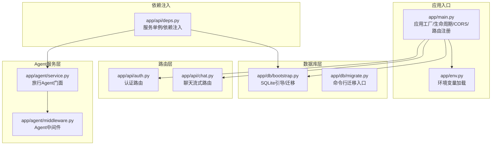
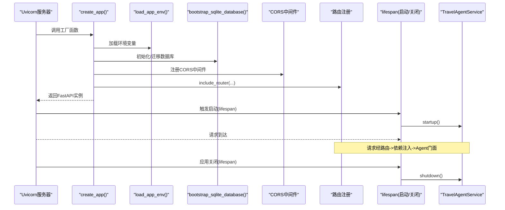
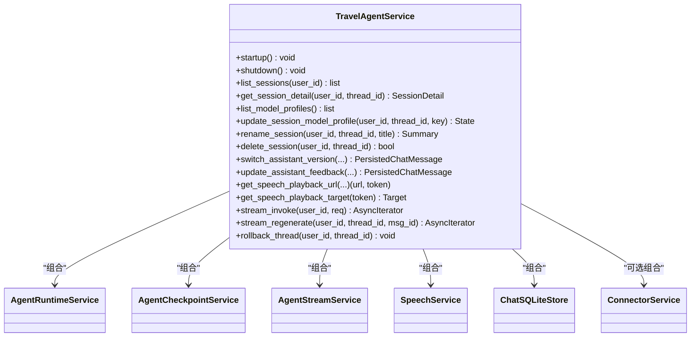
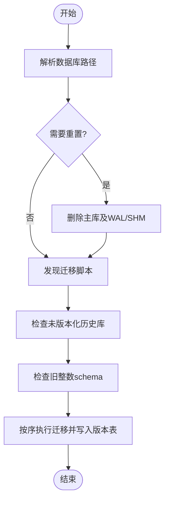
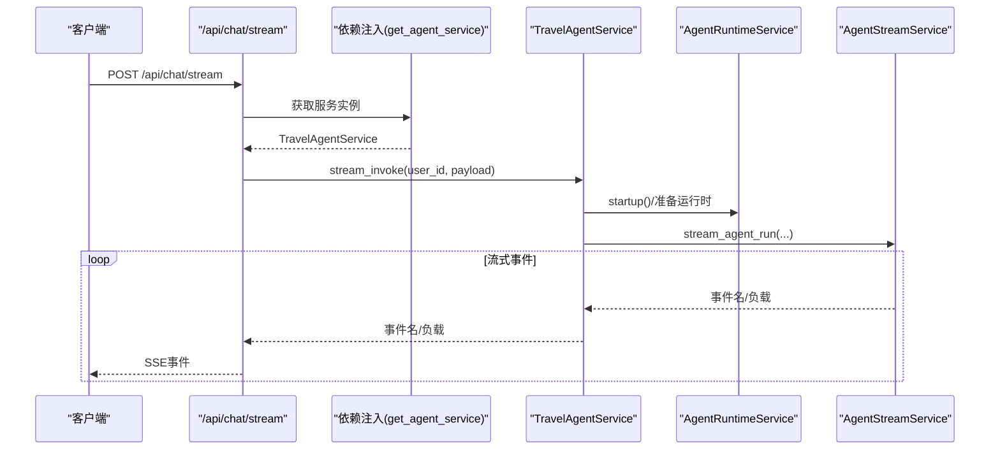
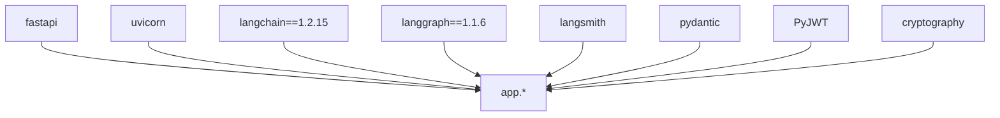

# 后端架构设计

<cite>
**本文引用的文件**
- [backend/app/main.py](file://backend/app/main.py)
- [backend/app/env.py](file://backend/app/env.py)
- [backend/app/db/bootstrap.py](file://backend/app/db/bootstrap.py)
- [backend/app/db/migrate.py](file://backend/app/db/migrate.py)
- [backend/app/api/deps.py](file://backend/app/api/deps.py)
- [backend/app/api/chat.py](file://backend/app/api/chat.py)
- [backend/app/api/auth.py](file://backend/app/api/auth.py)
- [backend/app/agent/service.py](file://backend/app/agent/service.py)
- [backend/app/agent/middleware.py](file://backend/app/agent/middleware.py)
- [backend/app/branding.py](file://backend/app/branding.py)
- [backend/pyproject.toml](file://backend/pyproject.toml)
- [backend/Dockerfile](file://backend/Dockerfile)
</cite>

## 目录
1. [引言](#引言)
2. [项目结构](#项目结构)
3. [核心组件](#核心组件)
4. [架构总览](#架构总览)
5. [详细组件分析](#详细组件分析)
6. [依赖分析](#依赖分析)
7. [性能考量](#性能考量)
8. [故障排查指南](#故障排查指南)
9. [结论](#结论)
10. [附录](#附录)

## 引言
本文件系统性梳理后端FastAPI应用的分层架构与组件组织，重点覆盖以下主题：
- 应用入口main.py中的生命周期管理、中间件配置与路由注册机制
- Agent服务层的门面模式设计与职责边界
- API路由层的模块化组织与依赖注入
- 数据库初始化与迁移流程
- 中间件（含CORS）的配置作用与安全考虑
- 环境变量加载与数据库引导程序的工作原理
- 后端服务启动流程图与组件交互关系图

## 项目结构
后端采用“包内分层+功能域模块化”的组织方式：
- app：应用入口与核心子系统
  - main.py：应用工厂函数、生命周期、中间件与路由注册
  - env.py：环境变量加载
  - db：数据库引导与迁移
  - api：路由层（按功能域拆分）
  - agent：Agent服务门面与运行时中间件
  - 其他子系统：auth、connectors、llm、mcp、memory、observability、prompt、schemas、speech、tool 等
- config：配置文件示例
- migrations：SQL迁移脚本
- tests：测试用例
- pyproject.toml：项目依赖与构建配置
- Dockerfile：容器镜像与运行命令

图表来源
- [backend/app/main.py:1-54](file://backend/app/main.py#L1-L54)
- [backend/app/env.py:1-18](file://backend/app/env.py#L1-L18)
- [backend/app/db/bootstrap.py:1-226](file://backend/app/db/bootstrap.py#L1-L226)
- [backend/app/db/migrate.py:1-22](file://backend/app/db/migrate.py#L1-L22)
- [backend/app/api/deps.py:1-60](file://backend/app/api/deps.py#L1-L60)
- [backend/app/api/auth.py:1-36](file://backend/app/api/auth.py#L1-L36)
- [backend/app/api/chat.py:1-72](file://backend/app/api/chat.py#L1-L72)
- [backend/app/agent/service.py:1-529](file://backend/app/agent/service.py#L1-L529)
- [backend/app/agent/middleware.py:1-211](file://backend/app/agent/middleware.py#L1-L211)

章节来源
- [backend/app/main.py:1-54](file://backend/app/main.py#L1-L54)
- [backend/app/env.py:1-18](file://backend/app/env.py#L1-L18)
- [backend/app/db/bootstrap.py:1-226](file://backend/app/db/bootstrap.py#L1-L226)
- [backend/app/db/migrate.py:1-22](file://backend/app/db/migrate.py#L1-L22)
- [backend/app/api/deps.py:1-60](file://backend/app/api/deps.py#L1-L60)
- [backend/app/api/auth.py:1-36](file://backend/app/api/auth.py#L1-L36)
- [backend/app/api/chat.py:1-72](file://backend/app/api/chat.py#L1-L72)
- [backend/app/agent/service.py:1-529](file://backend/app/agent/service.py#L1-L529)
- [backend/app/agent/middleware.py:1-211](file://backend/app/agent/middleware.py#L1-L211)

## 核心组件
- 应用工厂与生命周期：通过异步生命周期管理Agent服务的启动与关闭，确保资源有序初始化与释放。
- 依赖注入：使用LRU缓存的工厂函数提供全局单例服务，贯穿认证、Agent、连接器等模块。
- 数据库引导：解析路径、强制外键、发现迁移、执行迁移、版本表保护与重置策略。
- 路由层：按功能域拆分（认证、聊天、连接器、会话、语音、健康检查），统一前缀与标签。
- Agent门面：封装运行时、检查点、流式处理、语音合成、连接器工具等子系统。

章节来源
- [backend/app/main.py:23-54](file://backend/app/main.py#L23-L54)
- [backend/app/api/deps.py:18-60](file://backend/app/api/deps.py#L18-L60)
- [backend/app/db/bootstrap.py:181-226](file://backend/app/db/bootstrap.py#L181-L226)
- [backend/app/api/auth.py:1-36](file://backend/app/api/auth.py#L1-L36)
- [backend/app/api/chat.py:1-72](file://backend/app/api/chat.py#L1-L72)
- [backend/app/agent/service.py:97-124](file://backend/app/agent/service.py#L97-L124)

## 架构总览
后端采用“入口工厂 + 生命周期 + 中间件 + 路由 + 依赖注入 + 服务门面 + 数据库引导”的分层架构。应用启动时加载环境变量、初始化SQLite数据库、注册CORS与各路由，随后在生命周期钩子中启动Agent服务；请求进入后经依赖注入获取服务实例，再委派到Agent门面完成业务处理。

图表来源
- [backend/app/main.py:31-54](file://backend/app/main.py#L31-L54)
- [backend/app/env.py:10-18](file://backend/app/env.py#L10-L18)
- [backend/app/db/bootstrap.py:213-226](file://backend/app/db/bootstrap.py#L213-L226)
- [backend/app/agent/service.py:116-124](file://backend/app/agent/service.py#L116-L124)

## 详细组件分析

### 应用入口与生命周期管理
- 工厂函数create_app负责：
  - 加载环境变量
  - 初始化SQLite数据库
  - 创建FastAPI实例并配置标题、版本
  - 注册CORS中间件（允许来源、凭证、方法与头）
  - 注册健康检查、认证、聊天、连接器、会话、语音路由
- 生命周期lifespan在启动时调用Agent服务startup，在关闭时调用shutdown，确保运行时与资源的有序管理。

章节来源
- [backend/app/main.py:31-54](file://backend/app/main.py#L31-L54)

### 中间件配置与安全考虑（CORS）
- CORS中间件配置项：
  - 允许来源：从环境变量解析并去空白
  - 凭证：允许携带Cookie/授权头
  - 方法与头：通配符
- 安全建议：
  - 生产环境建议限制allow_origins为可信域名
  - 明确allow_methods与allow_headers以最小权限原则
  - 如需预检缓存，可配置max_age但需谨慎

章节来源
- [backend/app/main.py:37-44](file://backend/app/main.py#L37-L44)

### 路由层模块化组织
- 认证路由（/api/auth）：邮箱验证码发送与校验、当前用户信息查询
- 聊天路由（/api/chat）：模型档位查询、SSE流式聊天
- 其他路由：连接器、会话、语音、健康检查等均按功能域独立模块化，统一前缀与标签，便于维护与扩展

章节来源
- [backend/app/api/auth.py:1-36](file://backend/app/api/auth.py#L1-L36)
- [backend/app/api/chat.py:1-72](file://backend/app/api/chat.py#L1-L72)

### 依赖注入机制
- 通过LRU缓存的工厂函数提供全局单例：
  - get_agent_service：返回TravelAgentService单例，共享Agent运行时与MCP连接状态
  - get_auth_service：返回AuthService单例
  - get_connector_service：返回ConnectorService单例
- get_current_user：基于Bearer Token解析当前用户，未提供或非Bearer时返回401

章节来源
- [backend/app/api/deps.py:18-60](file://backend/app/api/deps.py#L18-L60)

### Agent服务层门面模式
- TravelAgentService作为门面，聚合以下子系统：
  - AgentRuntimeService：运行时与LangGraph集成
  - AgentCheckpointService：检查点与回滚
  - AgentStreamService：流式事件与状态
  - SpeechService：语音合成与播放
  - ChatSQLiteStore：会话与消息持久化
  - ConnectorService：连接器工具（可选）
- 提供统一接口：会话管理、模型档位、消息流式生成、语音播放、版本切换与反馈等

图表来源
- [backend/app/agent/service.py:97-124](file://backend/app/agent/service.py#L97-L124)
- [backend/app/agent/service.py:106-114](file://backend/app/agent/service.py#L106-L114)

章节来源
- [backend/app/agent/service.py:97-124](file://backend/app/agent/service.py#L97-L124)

### Agent中间件与系统提示词
- 动态系统提示词：根据运行时上下文（时区、语言环境、会话元信息）动态拼装
- 工具错误边界：捕获工具异常并转换为标准ToolMessage，保留GraphInterrupt以支持人工介入
- 模型选择中间件：根据会话档位选择对应ChatModel实例，确保绑定工具后的行为一致

章节来源
- [backend/app/agent/middleware.py:66-108](file://backend/app/agent/middleware.py#L66-L108)
- [backend/app/agent/middleware.py:111-131](file://backend/app/agent/middleware.py#L111-L131)
- [backend/app/agent/middleware.py:133-211](file://backend/app/agent/middleware.py#L133-L211)

### 数据库初始化与迁移流程
- 路径解析：从环境变量解析聊天数据库路径，默认位于data目录
- 重置策略：通过环境变量控制是否删除数据库文件及其WAL/SHM
- 迁移发现：扫描migrations目录，按版本号排序，校验唯一性与命名规范
- 版本表保护：禁止未版本化的历史业务库继续运行；拦截旧整数schema
- 执行迁移：逐个脚本执行，记录版本与应用时间

图表来源
- [backend/app/db/bootstrap.py:213-226](file://backend/app/db/bootstrap.py#L213-L226)
- [backend/app/db/bootstrap.py:181-211](file://backend/app/db/bootstrap.py#L181-L211)
- [backend/app/db/bootstrap.py:112-165](file://backend/app/db/bootstrap.py#L112-L165)

章节来源
- [backend/app/db/bootstrap.py:38-46](file://backend/app/db/bootstrap.py#L38-L46)
- [backend/app/db/bootstrap.py:43-46](file://backend/app/db/bootstrap.py#L43-L46)
- [backend/app/db/bootstrap.py:181-211](file://backend/app/db/bootstrap.py#L181-L211)
- [backend/app/db/bootstrap.py:112-165](file://backend/app/db/bootstrap.py#L112-L165)

### 环境变量加载
- 从后端根目录查找.env文件，不进行$变量展开，避免密钥被错误替换
- 仅在文件存在时加载，避免开发环境缺失文件导致异常

章节来源
- [backend/app/env.py:10-18](file://backend/app/env.py#L10-L18)

### API工作流示例（聊天流式）
- 客户端向POST /api/chat/stream发起请求
- 依赖注入获取TravelAgentService
- 服务启动Agent运行时（如未启动）
- 构造用户Agent与流式处理器
- 通过SSE事件流返回LangGraph原生事件

图表来源
- [backend/app/api/chat.py:41-72](file://backend/app/api/chat.py#L41-L72)
- [backend/app/api/deps.py:18-32](file://backend/app/api/deps.py#L18-L32)
- [backend/app/agent/service.py:373-507](file://backend/app/agent/service.py#L373-L507)

章节来源
- [backend/app/api/chat.py:1-72](file://backend/app/api/chat.py#L1-L72)
- [backend/app/api/deps.py:18-32](file://backend/app/api/deps.py#L18-L32)
- [backend/app/agent/service.py:373-507](file://backend/app/agent/service.py#L373-L507)

## 依赖分析
- 项目依赖集中在FastAPI、Uvicorn、LangChain/LangGraph、LangSmith、Pydantic、JWT、加密库等
- 可选开发依赖包括pytest与pytest-asyncio
- 包发现配置仅包含app*，确保打包范围明确

图表来源
- [backend/pyproject.toml:6-24](file://backend/pyproject.toml#L6-L24)

章节来源
- [backend/pyproject.toml:1-42](file://backend/pyproject.toml#L1-L42)

## 性能考量
- 依赖注入使用LRU缓存，避免重复创建昂贵服务实例
- 数据库迁移仅在必要时执行，减少启动开销
- SSE流式响应避免一次性大响应，降低内存峰值
- 建议生产环境启用CORS白名单、限制请求体大小与并发连接数

## 故障排查指南
- CORS相关问题：检查CORS_ALLOW_ORIGINS环境变量格式与有效性
- 数据库迁移失败：确认migrations目录下SQL命名规范与版本号唯一性
- Agent运行时异常：查看服务日志与LangSmith追踪，关注取消与失败分支的回滚逻辑
- 依赖注入异常：确认get_agent_service/get_auth_service等工厂函数是否被正确调用

章节来源
- [backend/app/main.py:37-44](file://backend/app/main.py#L37-L44)
- [backend/app/db/bootstrap.py:48-65](file://backend/app/db/bootstrap.py#L48-L65)
- [backend/app/agent/service.py:250-268](file://backend/app/agent/service.py#L250-L268)

## 结论
该后端以FastAPI为核心，结合门面模式的Agent服务层、模块化的路由层与完善的数据库引导机制，形成清晰的分层架构。通过生命周期管理、依赖注入与中间件配置，系统在可维护性与可扩展性方面具备良好基础。建议在生产环境中强化CORS与鉴权策略，并持续完善监控与日志体系。

## 附录
- 容器运行命令：通过Uvicorn工厂函数启动应用，监听0.0.0.0:8000
- 品牌与常量：集中于branding.py，便于统一管理

章节来源
- [backend/Dockerfile:20-21](file://backend/Dockerfile#L20-L21)
- [backend/app/branding.py:9-24](file://backend/app/branding.py#L9-L24)