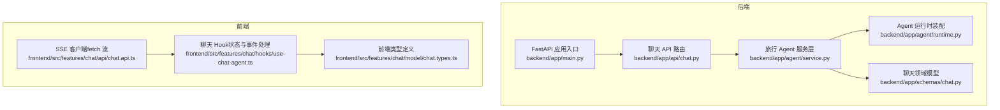
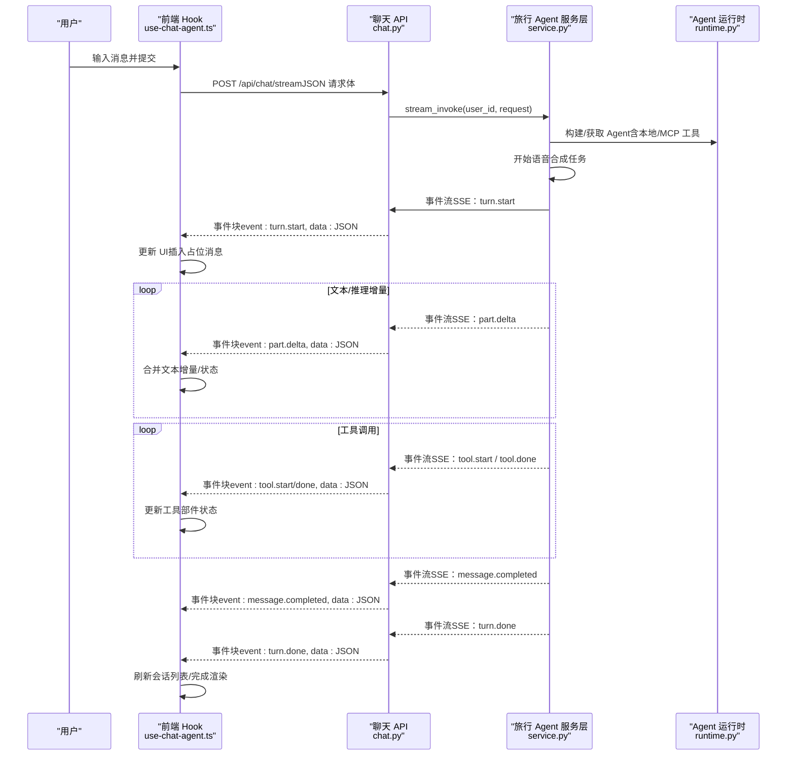
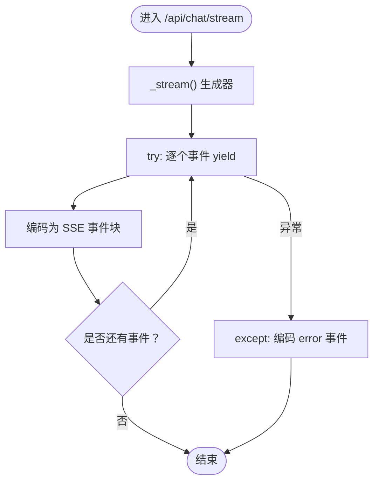
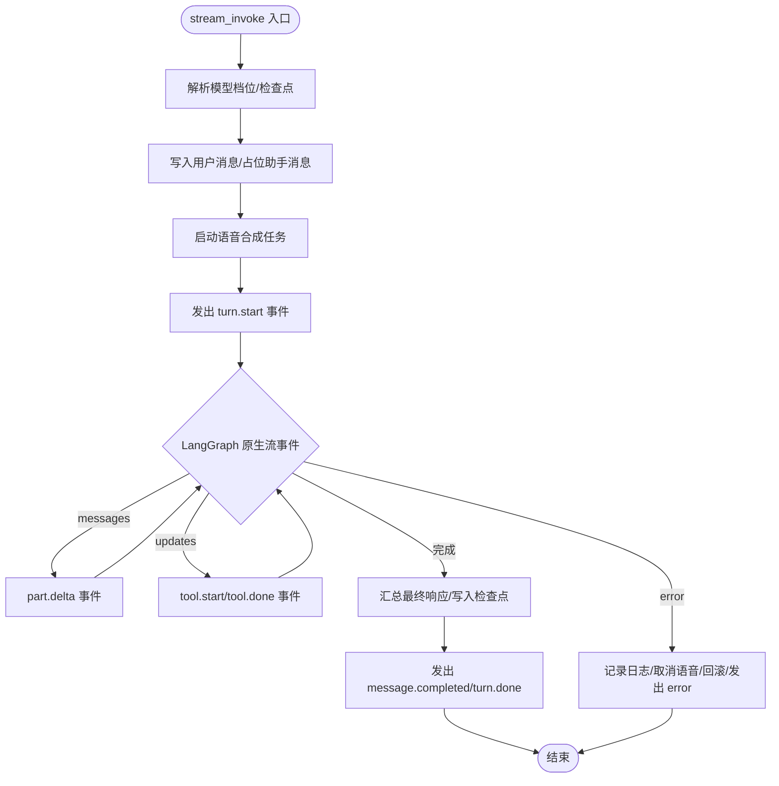
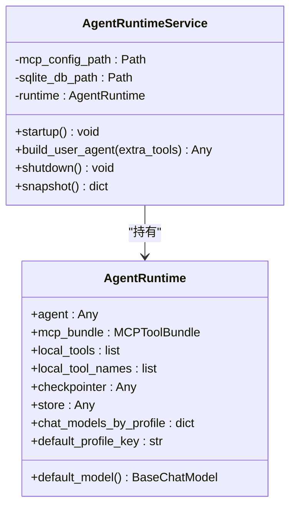
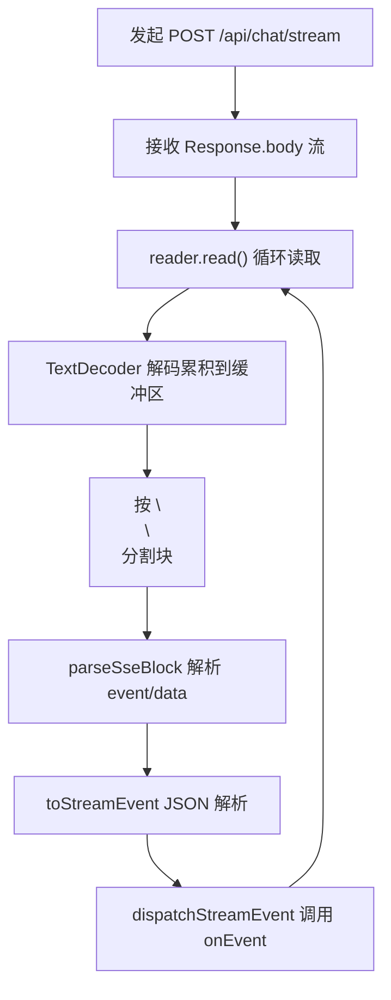
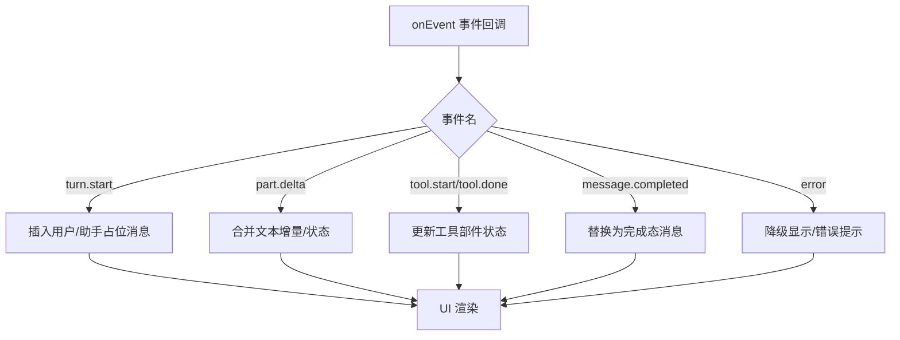
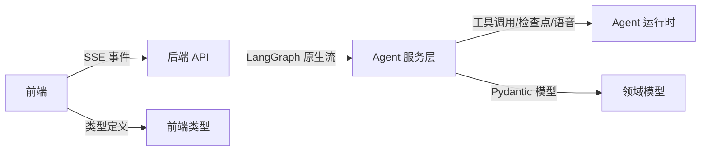

# 数据流设计

<cite>
**本文引用的文件**
- [backend/app/main.py](file://backend/app/main.py)
- [backend/app/api/chat.py](file://backend/app/api/chat.py)
- [backend/app/agent/service.py](file://backend/app/agent/service.py)
- [backend/app/agent/runtime.py](file://backend/app/agent/runtime.py)
- [backend/app/schemas/chat.py](file://backend/app/schemas/chat.py)
- [frontend/src/features/chat/api/chat.api.ts](file://frontend/src/features/chat/api/chat.api.ts)
- [frontend/src/features/chat/hooks/use-chat-agent.ts](file://frontend/src/features/chat/hooks/use-chat-agent.ts)
- [frontend/src/features/chat/model/chat.types.ts](file://frontend/src/features/chat/model/chat.types.ts)
</cite>

## 目录
1. [引言](#引言)
2. [项目结构](#项目结构)
3. [核心组件](#核心组件)
4. [架构总览](#架构总览)
5. [详细组件分析](#详细组件分析)
6. [依赖关系分析](#依赖关系分析)
7. [性能考量](#性能考量)
8. [故障排查指南](#故障排查指南)
9. [结论](#结论)
10. [附录](#附录)

## 引言
本设计文档聚焦于从用户输入到响应输出的完整数据流，系统采用 LangGraph 原生流与 SSE（Server-Sent Events）进行事件驱动的实时数据传输。后端通过旅行 Agent 服务层协调 LangGraph Agent 执行、工具调用编排与回调处理，前端以 SSE 流式消费事件，实现边生成边渲染的交互体验。文档同时覆盖数据交换格式、事件协议、错误传播与异常处理策略，并提供关键业务场景的数据流图与时序图。

## 项目结构
后端采用 FastAPI 应用入口集中注册路由与生命周期管理，聊天 API 负责将 LangGraph 原生流事件编码为 SSE；旅行 Agent 服务层负责会话、检查点、语音合成与流式事件的聚合；前端通过 fetch 流读取 SSE，解析事件并更新 UI。

**图表来源**
- [backend/app/main.py:31-54](file://backend/app/main.py#L31-L54)
- [backend/app/api/chat.py:41-72](file://backend/app/api/chat.py#L41-L72)
- [backend/app/agent/service.py:97-124](file://backend/app/agent/service.py#L97-L124)
- [backend/app/agent/runtime.py:61-116](file://backend/app/agent/runtime.py#L61-L116)
- [backend/app/schemas/chat.py:18-274](file://backend/app/schemas/chat.py#L18-L274)
- [frontend/src/features/chat/api/chat.api.ts:107-180](file://frontend/src/features/chat/api/chat.api.ts#L107-L180)
- [frontend/src/features/chat/hooks/use-chat-agent.ts:288-382](file://frontend/src/features/chat/hooks/use-chat-agent.ts#L288-L382)
- [frontend/src/features/chat/model/chat.types.ts:76-226](file://frontend/src/features/chat/model/chat.types.ts#L76-L226)

**章节来源**
- [backend/app/main.py:31-54](file://backend/app/main.py#L31-L54)
- [backend/app/api/chat.py:41-72](file://backend/app/api/chat.py#L41-L72)
- [frontend/src/features/chat/api/chat.api.ts:107-180](file://frontend/src/features/chat/api/chat.api.ts#L107-L180)

## 核心组件
- 后端应用入口与路由注册：负责加载环境、数据库初始化、CORS 配置以及路由挂载。
- 聊天 API：提供模型档位查询与流式聊天接口，将服务层产生的事件编码为 SSE。
- 旅行 Agent 服务层：封装运行时、检查点、语音合成与流式事件聚合，负责会话与消息的持久化。
- Agent 运行时：装配 LangGraph Agent、MCP 工具、本地工具、检查点与中间件。
- 前端 SSE 客户端：解析 SSE 分块、事件名与 JSON 负载，调度 UI 更新。
- 前端 Hook：根据事件更新消息状态、部分增量、工具调用状态与错误提示。

**章节来源**
- [backend/app/main.py:31-54](file://backend/app/main.py#L31-L54)
- [backend/app/api/chat.py:41-72](file://backend/app/api/chat.py#L41-L72)
- [backend/app/agent/service.py:97-124](file://backend/app/agent/service.py#L97-L124)
- [backend/app/agent/runtime.py:61-116](file://backend/app/agent/runtime.py#L61-L116)
- [frontend/src/features/chat/api/chat.api.ts:107-180](file://frontend/src/features/chat/api/chat.api.ts#L107-L180)
- [frontend/src/features/chat/hooks/use-chat-agent.ts:288-382](file://frontend/src/features/chat/hooks/use-chat-agent.ts#L288-L382)

## 架构总览
系统采用“后端 LangGraph 原生流 + SSE 事件”的模式，事件包括回合开始、文本增量、工具调用生命周期、消息完成与回合结束等。前端以事件名为键，JSON 为值，逐条消费并更新 UI。

**图表来源**
- [backend/app/api/chat.py:41-72](file://backend/app/api/chat.py#L41-L72)
- [backend/app/agent/service.py:373-507](file://backend/app/agent/service.py#L373-L507)
- [frontend/src/features/chat/api/chat.api.ts:107-180](file://frontend/src/features/chat/api/chat.api.ts#L107-L180)
- [frontend/src/features/chat/hooks/use-chat-agent.ts:410-435](file://frontend/src/features/chat/hooks/use-chat-agent.ts#L410-L435)

## 详细组件分析

### 后端应用入口与路由
- 应用入口负责加载环境变量、初始化 SQLite 数据库、注册路由与生命周期事件。
- 生命周期在应用启动时初始化 Agent，在关闭时释放资源。
- 路由包括健康检查、认证、聊天、连接器、会话与语音等。

**章节来源**
- [backend/app/main.py:23-54](file://backend/app/main.py#L23-L54)

### 聊天 API（SSE 编码与错误处理）
- 提供模型档位列表查询与流式聊天接口。
- 将服务层返回的事件名称与负载编码为 SSE 文本块，设置合适的响应头以保持长连接。
- 错误处理：
  - 取消请求：捕获取消异常并返回。
  - 参数错误：返回通用错误事件。
  - 其他异常：返回通用错误事件。

**图表来源**
- [backend/app/api/chat.py:49-71](file://backend/app/api/chat.py#L49-L71)

**章节来源**
- [backend/app/api/chat.py:41-72](file://backend/app/api/chat.py#L41-L72)

### 旅行 Agent 服务层（状态机与事件聚合）
- 启动/关闭：委托运行时服务进行初始化与资源回收。
- 会话与模型档位：提供会话列表、详情、重命名、删除、模型档位更新等。
- 流式聊天：
  - 解析线程当前模型档位，获取有效检查点 ID。
  - 写入用户消息与占位助手消息，启动语音合成任务。
  - 通过流式服务消费 LangGraph 原生流事件，转换为前端可消费的 SSE 事件。
  - 异常时回滚线程、写入失败状态并发出错误事件。
  - 成功时汇总最终响应、写入检查点、发出完成与回合结束事件。

**图表来源**
- [backend/app/agent/service.py:373-507](file://backend/app/agent/service.py#L373-L507)

**章节来源**
- [backend/app/agent/service.py:97-124](file://backend/app/agent/service.py#L97-L124)
- [backend/app/agent/service.py:373-507](file://backend/app/agent/service.py#L373-L507)

### Agent 运行时（Agent 装配与中间件）
- 装配本地工具、MCP 工具、检查点与内存存储。
- 创建 LangGraph Agent，注入上下文模式与中间件（含动态模型选择）。
- 提供按需构建用户级 Agent 的能力，合并用户级 MCP 工具。
- 关闭时安全释放 MCP 客户端与检查点连接。

**图表来源**
- [backend/app/agent/runtime.py:61-174](file://backend/app/agent/runtime.py#L61-L174)

**章节来源**
- [backend/app/agent/runtime.py:61-174](file://backend/app/agent/runtime.py#L61-L174)

### 前端 SSE 客户端与事件消费
- 使用 fetch 流读取 text/event-stream，按行解析 SSE 分块，识别 event 与 data。
- 将 JSON 字符串解析为事件对象，派发到 onEvent 回调。
- 对 tool.start 事件进行节流，确保 UI 及时渲染。

**图表来源**
- [frontend/src/features/chat/api/chat.api.ts:115-180](file://frontend/src/features/chat/api/chat.api.ts#L115-L180)

**章节来源**
- [frontend/src/features/chat/api/chat.api.ts:107-180](file://frontend/src/features/chat/api/chat.api.ts#L107-L180)

### 前端 Hook（事件到 UI 的映射）
- 根据事件类型更新消息状态与部分（文本增量、工具部件、推理片段）。
- 对错误事件进行降级处理（显示错误消息或恢复占位消息）。
- 提供停止生成、重新生成、版本切换与反馈更新等交互能力。

**图表来源**
- [frontend/src/features/chat/hooks/use-chat-agent.ts:288-382](file://frontend/src/features/chat/hooks/use-chat-agent.ts#L288-L382)

**章节来源**
- [frontend/src/features/chat/hooks/use-chat-agent.ts:288-382](file://frontend/src/features/chat/hooks/use-chat-agent.ts#L288-L382)

## 依赖关系分析
- 后端依赖：
  - FastAPI：路由与生命周期管理。
  - LangGraph：原生流事件消费与工具调用生命周期。
  - Pydantic：数据模型与序列化。
  - SQLite：检查点与会话持久化。
- 前端依赖：
  - fetch 流：SSE 读取。
  - React Hooks：状态与副作用管理。
  - 类型系统：强类型事件与消息模型。

**图表来源**
- [backend/app/api/chat.py:41-72](file://backend/app/api/chat.py#L41-L72)
- [backend/app/agent/service.py:373-507](file://backend/app/agent/service.py#L373-L507)
- [backend/app/schemas/chat.py:18-274](file://backend/app/schemas/chat.py#L18-L274)
- [frontend/src/features/chat/api/chat.api.ts:107-180](file://frontend/src/features/chat/api/chat.api.ts#L107-L180)
- [frontend/src/features/chat/model/chat.types.ts:76-226](file://frontend/src/features/chat/model/chat.types.ts#L76-L226)

**章节来源**
- [backend/app/api/chat.py:41-72](file://backend/app/api/chat.py#L41-L72)
- [backend/app/agent/service.py:373-507](file://backend/app/agent/service.py#L373-L507)
- [frontend/src/features/chat/api/chat.api.ts:107-180](file://frontend/src/features/chat/api/chat.api.ts#L107-L180)

## 性能考量
- SSE 与流式读取：前端按块解析，避免一次性缓冲大文本，降低内存峰值。
- 事件粒度：LangGraph 原生流将文本增量与工具生命周期分离，减少前端解析负担。
- 工具调用：仅在 updates 阶段产生工具事件，避免重复与冲突。
- 语音合成：与文本增量同步写入，保证语音与文本对齐。

[本节为通用指导，不直接分析具体文件]

## 故障排查指南
- 后端错误事件：
  - 参数错误：服务层捕获 ValueError 并返回通用错误事件。
  - 其他异常：捕获异常并返回通用错误事件，同时记录日志以便排查。
- 前端错误事件：
  - 解析失败：未知事件名或 JSON 解析失败会被忽略。
  - 网络中断：DOMException/AbortError 触发停止生成，UI 显示停止状态。
- 会话与检查点：
  - 异常时回滚线程，确保状态一致性。
  - 删除会话时清理语音资产与检查点。

**章节来源**
- [backend/app/api/chat.py:55-61](file://backend/app/api/chat.py#L55-L61)
- [backend/app/agent/service.py:444-482](file://backend/app/agent/service.py#L444-L482)
- [frontend/src/features/chat/api/chat.api.ts:128-131](file://frontend/src/features/chat/api/chat.api.ts#L128-L131)
- [frontend/src/features/chat/hooks/use-chat-agent.ts:436-457](file://frontend/src/features/chat/hooks/use-chat-agent.ts#L436-L457)

## 结论
该系统通过 LangGraph 原生流与 SSE 的组合，实现了高内聚、低耦合的实时数据流：后端以最小代价透出事件，前端以事件驱动的方式增量渲染。服务层负责工具调用编排、检查点与语音合成，运行时负责 Agent 装配与中间件注入。整体设计在可维护性、可观测性与用户体验之间取得平衡。

[本节为总结性内容，不直接分析具体文件]

## 附录

### 数据交换格式与事件协议
- 请求体（聊天）：包含线程标识、用户消息、语言区域、模型档位键与会话元数据。
- SSE 事件：
  - turn.start：回合开始，包含线程 ID、用户消息（可选）与助手消息占位。
  - part.delta：文本/推理增量，携带消息 ID、版本 ID、部分 ID、部分类型、增量文本与状态。
  - tool.start/tool.done：工具调用生命周期，携带消息 ID、版本 ID、工具部件。
  - message.completed：消息完成，携带稳定态消息。
  - turn.done：回合结束，包含线程 ID。
  - error：错误事件，包含错误消息。

**章节来源**
- [backend/app/schemas/chat.py:18-274](file://backend/app/schemas/chat.py#L18-L274)
- [frontend/src/features/chat/model/chat.types.ts:84-131](file://frontend/src/features/chat/model/chat.types.ts#L84-L131)