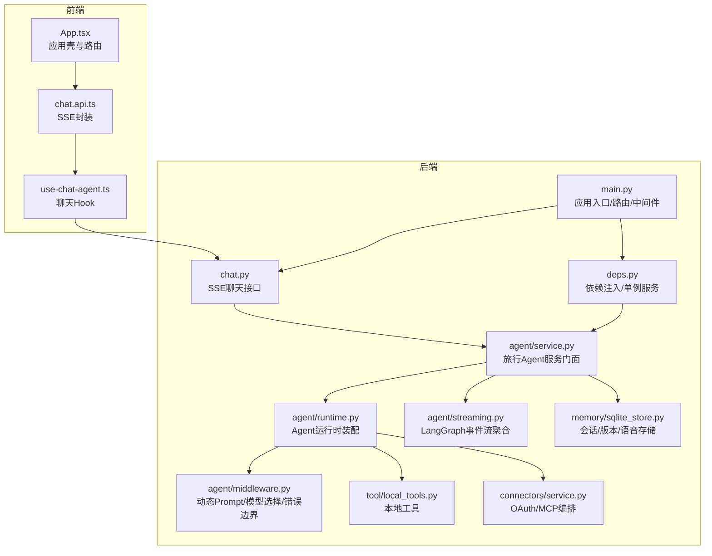
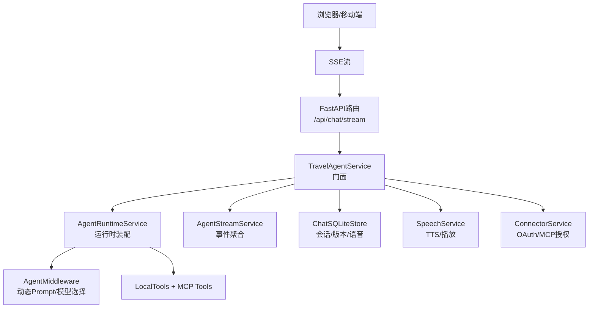
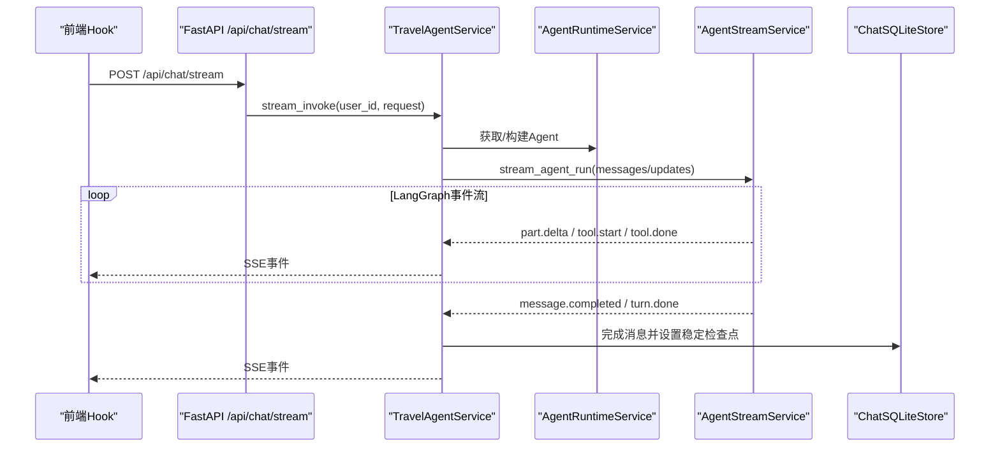
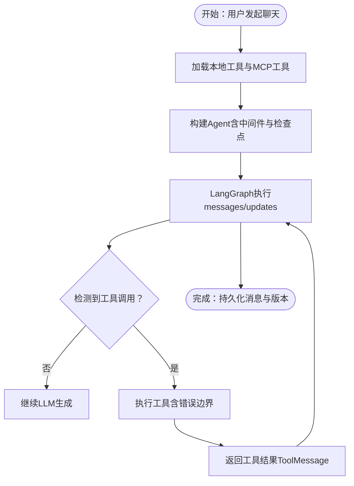
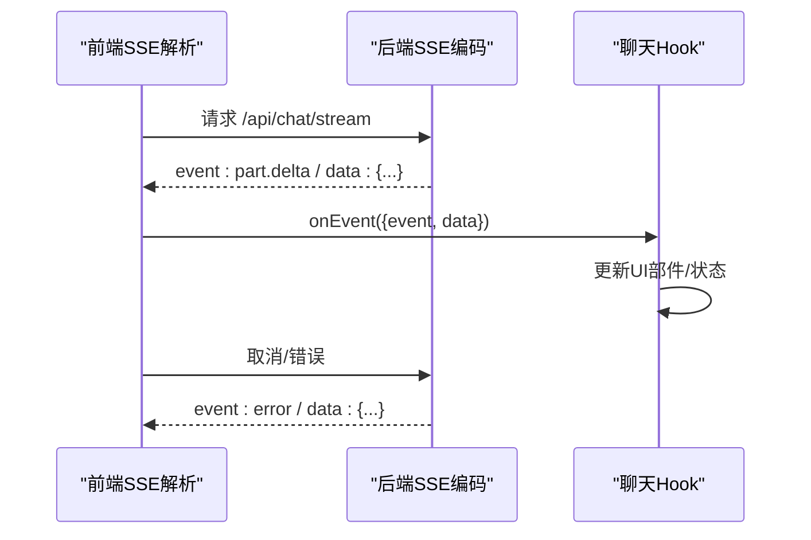
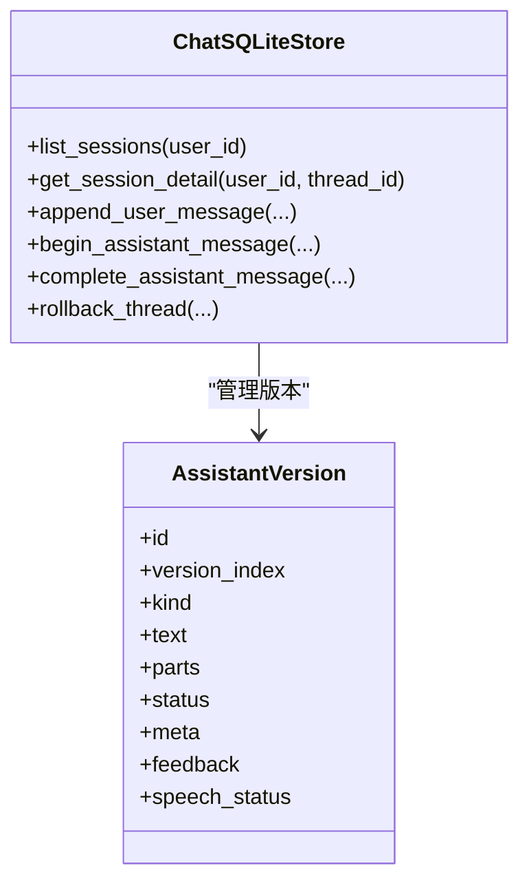
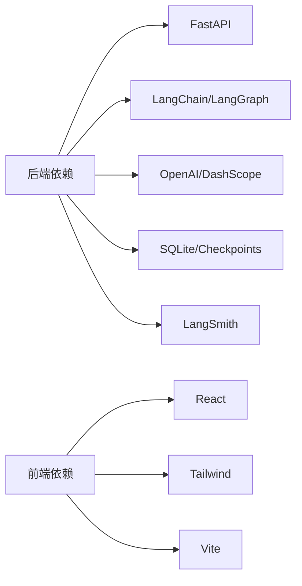

# 系统架构

<cite>
**本文引用的文件**
- [backend/app/main.py](file://backend/app/main.py)
- [backend/app/api/deps.py](file://backend/app/api/deps.py)
- [backend/app/api/chat.py](file://backend/app/api/chat.py)
- [backend/app/agent/service.py](file://backend/app/agent/service.py)
- [backend/app/agent/runtime.py](file://backend/app/agent/runtime.py)
- [backend/app/agent/middleware.py](file://backend/app/agent/middleware.py)
- [backend/app/agent/streaming.py](file://backend/app/agent/streaming.py)
- [backend/app/tool/local_tools.py](file://backend/app/tool/local_tools.py)
- [backend/app/connectors/service.py](file://backend/app/connectors/service.py)
- [backend/app/memory/sqlite_store.py](file://backend/app/memory/sqlite_store.py)
- [backend/pyproject.toml](file://backend/pyproject.toml)
- [frontend/src/app/App.tsx](file://frontend/src/app/App.tsx)
- [frontend/src/features/chat/hooks/use-chat-agent.ts](file://frontend/src/features/chat/hooks/use-chat-agent.ts)
- [frontend/src/features/chat/api/chat.api.ts](file://frontend/src/features/chat/api/chat.api.ts)
</cite>

## 目录
1. [引言](#引言)
2. [项目结构](#项目结构)
3. [核心组件](#核心组件)
4. [架构总览](#架构总览)
5. [详细组件分析](#详细组件分析)
6. [依赖分析](#依赖分析)
7. [性能考量](#性能考量)
8. [故障排查指南](#故障排查指南)
9. [结论](#结论)
10. [附录](#附录)

## 引言
本系统是一个前后端分离的AI旅行Agent平台，采用微服务风格的模块化设计，围绕LangGraph Agent引擎构建事件驱动的数据流。后端基于FastAPI，前端基于React，通过SSE实现流式传输，支持工具调用编排、多模型档位切换、会话记忆与版本控制、以及第三方MCP连接器的OAuth授权与动态工具注入。

## 项目结构
- 后端（Python/FastAPI）
  - 应用入口与路由注册、中间件与生命周期管理
  - Agent服务门面、运行时装配、流式执行与事件聚合
  - 工具与连接器编排、本地工具与MCP工具融合
  - 会话存储与检查点、语音合成与播放
  - LLM Provider与可观测性
- 前端（React）
  - 应用壳与路由、鉴权上下文
  - 聊天Hook与SSE事件解析、消息UI与版本管理
  - API封装与SSE流式解析

图表来源
- [backend/app/main.py:31-54](file://backend/app/main.py#L31-L54)
- [backend/app/api/chat.py:41-72](file://backend/app/api/chat.py#L41-L72)
- [backend/app/agent/service.py:97-529](file://backend/app/agent/service.py#L97-L529)
- [backend/app/agent/runtime.py:61-174](file://backend/app/agent/runtime.py#L61-L174)
- [backend/app/agent/middleware.py:193-211](file://backend/app/agent/middleware.py#L193-L211)
- [backend/app/agent/streaming.py:74-680](file://backend/app/agent/streaming.py#L74-L680)
- [backend/app/tool/local_tools.py:49-56](file://backend/app/tool/local_tools.py#L49-L56)
- [backend/app/connectors/service.py:74-407](file://backend/app/connectors/service.py#L74-L407)
- [backend/app/memory/sqlite_store.py:123-800](file://backend/app/memory/sqlite_store.py#L123-L800)
- [frontend/src/app/App.tsx:1-17](file://frontend/src/app/App.tsx#L1-L17)
- [frontend/src/features/chat/api/chat.api.ts:107-180](file://frontend/src/features/chat/api/chat.api.ts#L107-L180)
- [frontend/src/features/chat/hooks/use-chat-agent.ts:125-596](file://frontend/src/features/chat/hooks/use-chat-agent.ts#L125-L596)

章节来源
- [backend/app/main.py:31-54](file://backend/app/main.py#L31-L54)
- [backend/app/api/chat.py:41-72](file://backend/app/api/chat.py#L41-L72)
- [frontend/src/app/App.tsx:1-17](file://frontend/src/app/App.tsx#L1-L17)

## 核心组件
- 应用入口与路由
  - FastAPI应用创建、CORS中间件、路由注册、生命周期钩子
- 依赖注入与单例服务
  - LRU缓存的全局服务实例，共享Agent运行时与MCP连接状态
- Agent服务门面
  - 统一流式调用、会话管理、模型档位切换、版本控制、语音合成与播放
- Agent运行时
  - 组装LangGraph Agent、动态模型选择、中间件、检查点与内存运行时
- 流式执行与事件聚合
  - LangGraph事件拆分与合并、UI部件增量、工具调用追踪与引用来源提取
- 工具与连接器
  - 本地工具（时间、搜索）、MCP工具动态加载、OAuth授权与令牌刷新
- 会话存储
  - SQLite持久化、版本化消息、检查点、语音资产与回滚
- 前端聊天Hook与SSE
  - SSE解析、事件分发、UI增量渲染、版本切换与反馈

章节来源
- [backend/app/api/deps.py:18-60](file://backend/app/api/deps.py#L18-L60)
- [backend/app/agent/service.py:97-529](file://backend/app/agent/service.py#L97-L529)
- [backend/app/agent/runtime.py:61-174](file://backend/app/agent/runtime.py#L61-L174)
- [backend/app/agent/streaming.py:74-680](file://backend/app/agent/streaming.py#L74-L680)
- [backend/app/tool/local_tools.py:49-56](file://backend/app/tool/local_tools.py#L49-L56)
- [backend/app/connectors/service.py:74-407](file://backend/app/connectors/service.py#L74-L407)
- [backend/app/memory/sqlite_store.py:123-800](file://backend/app/memory/sqlite_store.py#L123-L800)
- [frontend/src/features/chat/api/chat.api.ts:107-180](file://frontend/src/features/chat/api/chat.api.ts#L107-L180)
- [frontend/src/features/chat/hooks/use-chat-agent.ts:125-596](file://frontend/src/features/chat/hooks/use-chat-agent.ts#L125-L596)

## 架构总览
系统采用前后端分离与微服务风格的模块化组织：
- 后端以FastAPI为核心，按功能域拆分为API层、服务层、运行时层、工具层、存储层
- 前端以React为主，通过SSE与后端进行事件驱动通信
- 数据流以LangGraph事件为纽带，贯穿工具调用、UI增量、引用来源与语音合成
- 中间件与门面模式降低耦合，提升可维护性与可测试性

图表来源
- [backend/app/api/chat.py:41-72](file://backend/app/api/chat.py#L41-L72)
- [backend/app/agent/service.py:97-529](file://backend/app/agent/service.py#L97-L529)
- [backend/app/agent/runtime.py:61-174](file://backend/app/agent/runtime.py#L61-L174)
- [backend/app/agent/middleware.py:193-211](file://backend/app/agent/middleware.py#L193-L211)
- [backend/app/agent/streaming.py:74-680](file://backend/app/agent/streaming.py#L74-L680)
- [backend/app/memory/sqlite_store.py:123-800](file://backend/app/memory/sqlite_store.py#L123-L800)
- [backend/app/connectors/service.py:74-407](file://backend/app/connectors/service.py#L74-L407)

## 详细组件分析

### LangGraph Agent引擎与事件驱动数据流
- 事件来源
  - messages：LLM token增量（AIMessageChunk）
  - updates：节点结束快照（AIMessage含tool_calls、ToolMessage含执行结果）
- 事件聚合
  - 将messages与updates分别处理，messages仅消费LLM文本增量，updates统一触发tool.start/tool.done
  - 维护StreamRunState，累计AIMessageChunk、工具追踪、UI部件、引用来源
- 输出事件
  - part.delta：text/reasoning增量与sealed
  - tool.start/tool.done：工具入参与结果、状态、来源与卡片
  - message.completed/turn.done：最终消息完成与回合结束
- 错误处理
  - 统一捕获工具异常为ToolMessage，保留GraphInterrupt以便人工介入

图表来源
- [backend/app/api/chat.py:41-72](file://backend/app/api/chat.py#L41-L72)
- [backend/app/agent/service.py:373-508](file://backend/app/agent/service.py#L373-L508)
- [backend/app/agent/streaming.py:80-229](file://backend/app/agent/streaming.py#L80-L229)
- [backend/app/memory/sqlite_store.py:355-409](file://backend/app/memory/sqlite_store.py#L355-L409)

章节来源
- [backend/app/agent/streaming.py:74-680](file://backend/app/agent/streaming.py#L74-L680)
- [backend/app/agent/service.py:373-508](file://backend/app/agent/service.py#L373-L508)

### 工具调用编排与MCP连接器
- 本地工具
  - 当前时间、高级搜索、网页抓取等
- MCP工具
  - 通过配置加载，按用户维度动态注入
- OAuth编排
  - 发现授权服务器元数据、注册OAuth客户端、PKCE授权码、令牌交换与刷新
  - 保存加密令牌，按需刷新，失败标记并排除
- 用户工具上下文
  - 旅行Agent服务在运行时按用户连接器组装Agent，动态注入用户级工具

图表来源
- [backend/app/tool/local_tools.py:49-56](file://backend/app/tool/local_tools.py#L49-L56)
- [backend/app/agent/runtime.py:117-133](file://backend/app/agent/runtime.py#L117-L133)
- [backend/app/agent/middleware.py:111-131](file://backend/app/agent/middleware.py#L111-L131)
- [backend/app/connectors/service.py:108-230](file://backend/app/connectors/service.py#L108-L230)

章节来源
- [backend/app/tool/local_tools.py:49-56](file://backend/app/tool/local_tools.py#L49-L56)
- [backend/app/connectors/service.py:74-407](file://backend/app/connectors/service.py#L74-L407)
- [backend/app/agent/runtime.py:117-133](file://backend/app/agent/runtime.py#L117-L133)
- [backend/app/agent/middleware.py:111-131](file://backend/app/agent/middleware.py#L111-L131)

### SSE流式传输与前端事件处理
- 后端
  - 以SSE编码事件，保持长连接，支持取消与错误事件
- 前端
  - 解析SSE块，分发事件到聊天Hook
  - 对tool.start进行渲染优化（下一帧机会），保证UI流畅
  - 维护消息parts增量、工具部件、版本切换与反馈

图表来源
- [backend/app/api/chat.py:25-72](file://backend/app/api/chat.py#L25-L72)
- [frontend/src/features/chat/api/chat.api.ts:107-180](file://frontend/src/features/chat/api/chat.api.ts#L107-L180)
- [frontend/src/features/chat/hooks/use-chat-agent.ts:288-382](file://frontend/src/features/chat/hooks/use-chat-agent.ts#L288-L382)

章节来源
- [backend/app/api/chat.py:25-72](file://backend/app/api/chat.py#L25-L72)
- [frontend/src/features/chat/api/chat.api.ts:107-180](file://frontend/src/features/chat/api/chat.api.ts#L107-L180)
- [frontend/src/features/chat/hooks/use-chat-agent.ts:288-382](file://frontend/src/features/chat/hooks/use-chat-agent.ts#L288-L382)

### 会话存储与版本控制
- 会话摘要与详情
  - 列表按活跃时间倒序，详情包含消息与版本
- 版本管理
  - 每条assistant消息可有多个版本，支持切换与反馈
- 检查点与回滚
  - 通过SQLite检查点实现流式生成的原子性与可恢复性
- 语音资产
  - 与版本绑定，支持播放URL生成与清理

图表来源
- [backend/app/memory/sqlite_store.py:123-800](file://backend/app/memory/sqlite_store.py#L123-L800)

章节来源
- [backend/app/memory/sqlite_store.py:123-800](file://backend/app/memory/sqlite_store.py#L123-L800)

### 分层架构与门面模式
- 分层
  - API层：路由与SSE封装
  - 服务层：业务编排与门面
  - 运行时层：Agent装配与中间件
  - 工具层：本地工具与MCP工具
  - 存储层：会话/版本/语音
- 门面
  - TravelAgentService统一暴露流式调用、会话管理、版本控制、语音播放等能力

章节来源
- [backend/app/agent/service.py:97-529](file://backend/app/agent/service.py#L97-L529)
- [backend/app/api/deps.py:18-60](file://backend/app/api/deps.py#L18-L60)

### 中间件与拦截器
- 动态Prompt
  - 基于运行时上下文（locale、timezone、session_meta）生成系统提示词
- 模型选择
  - 根据model_profile_key动态替换模型实例，确保绑定工具不受影响
- 工具错误边界
  - 统一捕获工具异常为ToolMessage，保留GraphInterrupt

章节来源
- [backend/app/agent/middleware.py:66-131](file://backend/app/agent/middleware.py#L66-L131)
- [backend/app/agent/middleware.py:133-211](file://backend/app/agent/middleware.py#L133-L211)

## 依赖分析
- 后端依赖
  - FastAPI、Uvicorn、Pydantic、LangChain/LangGraph、LangSmith、SQLite检查点、Cryptography、DashScope/OpenAI等
- 前端依赖
  - React、React Router、Tailwind、Vite等（详见package.json）

图表来源
- [backend/pyproject.toml:6-24](file://backend/pyproject.toml#L6-L24)

章节来源
- [backend/pyproject.toml:6-24](file://backend/pyproject.toml#L6-L24)

## 性能考量
- 事件流解耦
  - messages与updates分离，避免重复触发与状态竞态
- 渲染优化
  - tool.start延迟渲染至下一帧，减少UI抖动
- 缓存与单例
  - LRU缓存全局服务实例，共享运行时与MCP连接
- I/O与并发
  - SSE长连接与异步流式处理，结合前端AbortController支持取消
- 存储与检查点
  - SQLite检查点保障原子性与回滚，版本上限控制避免无限增长

## 故障排查指南
- SSE错误
  - 后端捕获ValueError与通用异常，向前端发送error事件
  - 前端解析SSE块并触发错误事件，显示友好提示
- 工具异常
  - 统一包装为ToolMessage，保留status与内容，便于前端展示
- 会话与版本
  - 出错时回滚到最近稳定检查点，确保一致性
- OAuth授权
  - 发现服务器失败、令牌交换失败、刷新失败均有明确错误提示与状态标记

章节来源
- [backend/app/api/chat.py:55-61](file://backend/app/api/chat.py#L55-L61)
- [backend/app/agent/service.py:444-482](file://backend/app/agent/service.py#L444-L482)
- [backend/app/agent/middleware.py:111-131](file://backend/app/agent/middleware.py#L111-L131)
- [backend/app/connectors/service.py:120-127](file://backend/app/connectors/service.py#L120-L127)

## 结论
本系统以LangGraph为核心，通过事件驱动与SSE流式传输实现了高内聚、低耦合的前后端协作。门面模式与中间件确保了业务编排与运行时灵活性，工具与连接器的动态注入提升了扩展性。SQLite检查点与版本控制保障了生成过程的可恢复性与可追溯性。整体架构具备良好的性能与可维护性，适合在多模型档位与第三方MCP生态下持续演进。

## 附录
- 系统边界
  - 前端：React应用，负责UI与SSE事件处理
  - 后端：FastAPI服务，负责Agent执行、工具编排、存储与第三方集成
- 第三方集成点
  - LLM提供商（OpenAI、DashScope等）
  - MCP服务器（OAuth授权与工具提供）
  - LangSmith（可观测性追踪）
  - Cryptography（密钥与令牌加密）