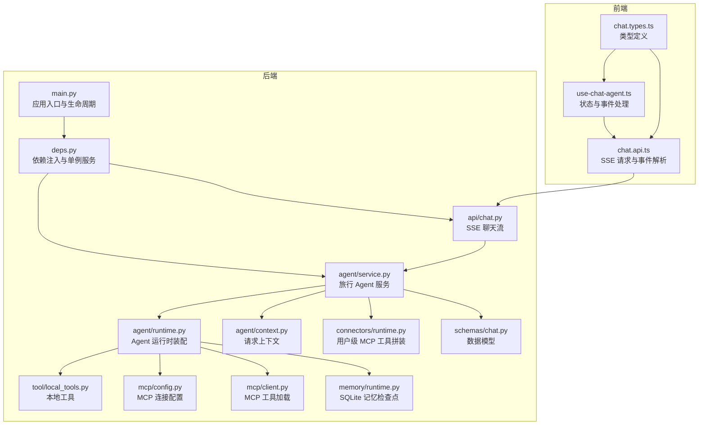
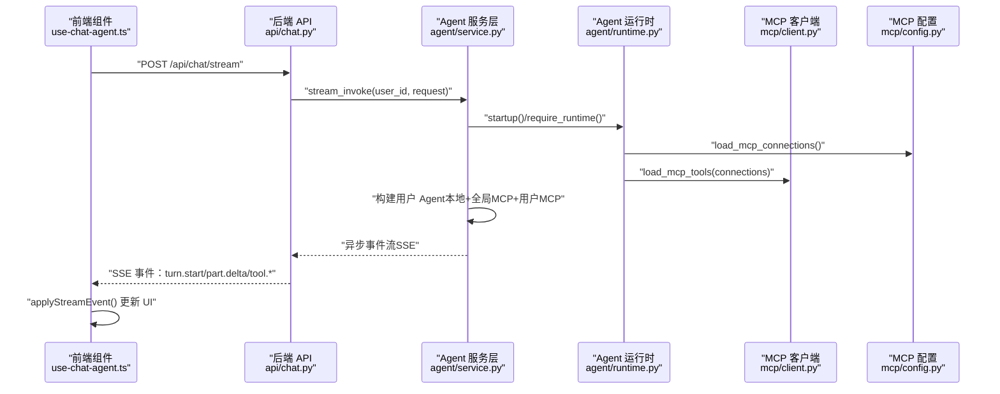
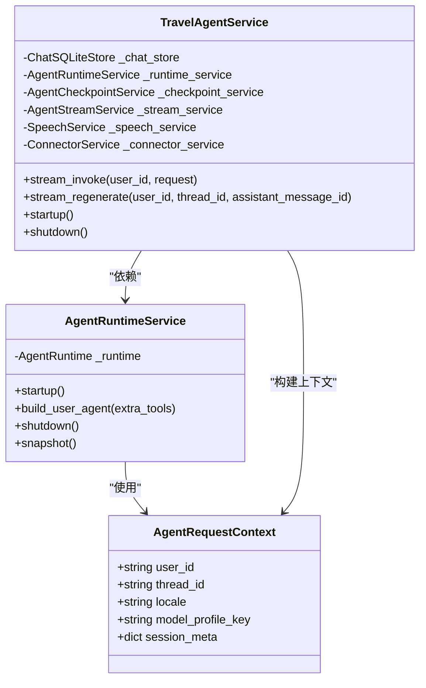
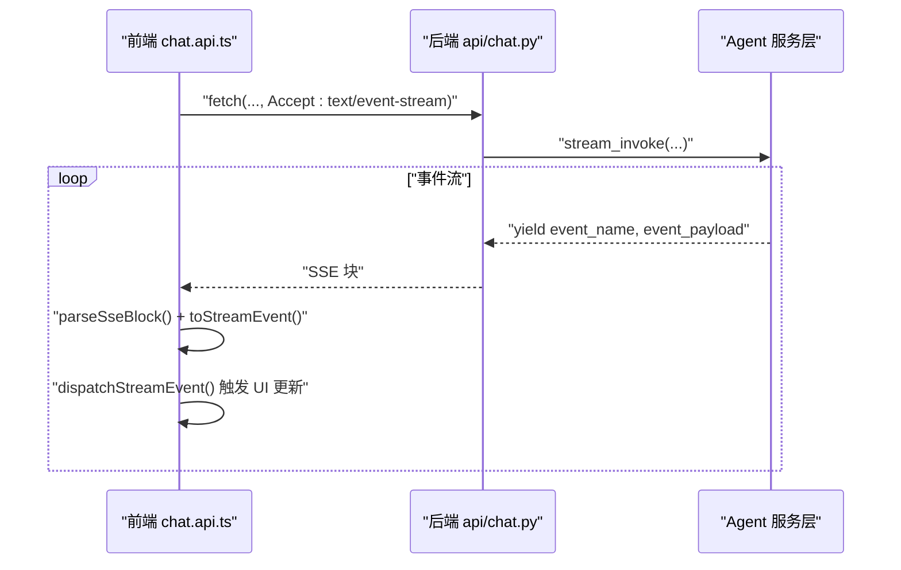
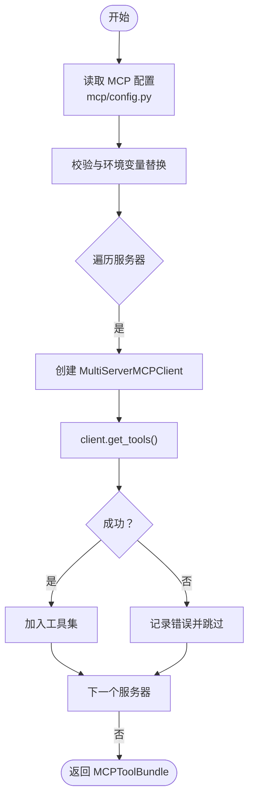
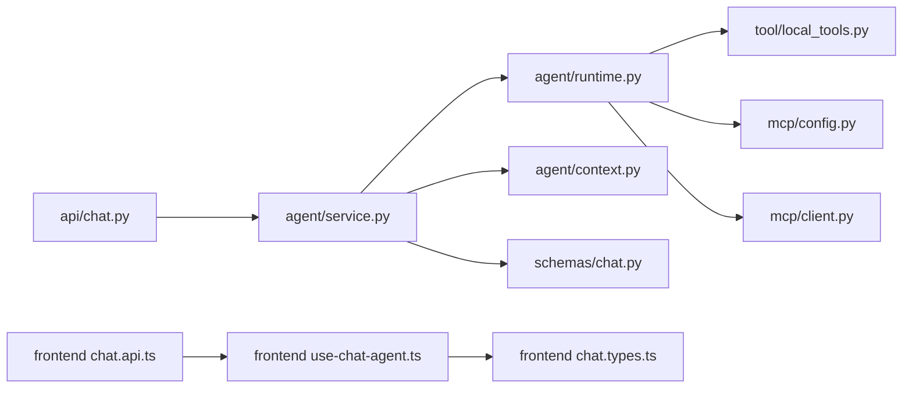

# 组件交互关系

<cite>
**本文引用的文件**
- [backend/app/main.py](file://backend/app/main.py)
- [backend/app/api/deps.py](file://backend/app/api/deps.py)
- [backend/app/api/chat.py](file://backend/app/api/chat.py)
- [backend/app/agent/service.py](file://backend/app/agent/service.py)
- [backend/app/agent/runtime.py](file://backend/app/agent/runtime.py)
- [backend/app/agent/context.py](file://backend/app/agent/context.py)
- [backend/app/tool/local_tools.py](file://backend/app/tool/local_tools.py)
- [backend/app/mcp/client.py](file://backend/app/mcp/client.py)
- [backend/app/mcp/config.py](file://backend/app/mcp/config.py)
- [backend/app/connectors/runtime.py](file://backend/app/connectors/runtime.py)
- [backend/app/memory/runtime.py](file://backend/app/memory/runtime.py)
- [backend/app/schemas/chat.py](file://backend/app/schemas/chat.py)
- [frontend/src/features/chat/api/chat.api.ts](file://frontend/src/features/chat/api/chat.api.ts)
- [frontend/src/features/chat/hooks/use-chat-agent.ts](file://frontend/src/features/chat/hooks/use-chat-agent.ts)
- [frontend/src/features/chat/model/chat.types.ts](file://frontend/src/features/chat/model/chat.types.ts)
</cite>

## 目录
1. [引言](#引言)
2. [项目结构](#项目结构)
3. [核心组件](#核心组件)
4. [架构总览](#架构总览)
5. [详细组件分析](#详细组件分析)
6. [依赖关系分析](#依赖关系分析)
7. [性能考量](#性能考量)
8. [故障排查指南](#故障排查指南)
9. [结论](#结论)
10. [附录](#附录)

## 引言
本文件聚焦于系统组件间的交互关系与协作模式，围绕以下主题展开：
- Agent 服务层与工具层的交互：包括本地工具与 MCP 工具的装配、按用户动态拼接、以及运行时中间件与上下文传递。
- 前端组件与后端 API 的通信：SSE 流式事件协议、事件解析与前端状态同步。
- MCP 客户端与外部服务的集成：连接配置、多服务器客户端、工具加载与错误聚合。
- 插件化架构与扩展点：MCP 工具、本地工具、LLM 档位、记忆检查点等。
- 适配器模式的应用：LangChain 适配器、HTTP/SSE/STDIO 传输抽象。
- 组件生命周期管理、事件总线机制与状态同步方案。

## 项目结构
系统采用前后端分离的双端架构：
- 后端基于 FastAPI，提供聊天流式 API、认证、会话管理、语音合成等能力。
- 前端基于 React，通过 SSE 与后端交互，实时渲染消息、工具调用与版本切换。
- Agent 服务层负责编排工具、LLM、记忆与语音合成，MCP 客户端负责连接外部工具服务器。

图表来源
- [backend/app/main.py:31-54](file://backend/app/main.py#L31-L54)
- [backend/app/api/deps.py:18-32](file://backend/app/api/deps.py#L18-L32)
- [backend/app/api/chat.py:41-72](file://backend/app/api/chat.py#L41-L72)
- [backend/app/agent/service.py:97-124](file://backend/app/agent/service.py#L97-L124)
- [backend/app/agent/runtime.py:61-116](file://backend/app/agent/runtime.py#L61-L116)
- [backend/app/tool/local_tools.py:49-56](file://backend/app/tool/local_tools.py#L49-L56)
- [backend/app/mcp/config.py:63-91](file://backend/app/mcp/config.py#L63-L91)
- [backend/app/mcp/client.py:32-69](file://backend/app/mcp/client.py#L32-L69)
- [backend/app/connectors/runtime.py:50-88](file://backend/app/connectors/runtime.py#L50-L88)
- [backend/app/memory/runtime.py:11-22](file://backend/app/memory/runtime.py#L11-L22)

章节来源
- [backend/app/main.py:31-54](file://backend/app/main.py#L31-L54)
- [backend/app/api/deps.py:18-32](file://backend/app/api/deps.py#L18-L32)

## 核心组件
- 应用入口与生命周期
  - FastAPI 应用创建、CORS 配置、路由注册、生命周期钩子在应用启动时初始化 Agent，在关闭时释放资源。
- 依赖注入与单例服务
  - 通过 LRU 缓存提供全局单例的 TravelAgentService、AuthService、ConnectorService，确保运行时与连接状态跨请求共享。
- Agent 服务层
  - 提供流式聊天、重新生成、会话管理、语音合成与播放、检查点回滚等能力；协调工具、记忆与 LLM 档位。
- Agent 运行时
  - 装配默认 Agent（含本地与全局 MCP 工具）、按用户动态拼接额外 MCP 工具、构建用户 Agent、关闭时释放 MCP 客户端与检查点连接。
- 工具层
  - 本地工具：如当前时间查询、EXA 搜索/抓取等；MCP 工具：按配置加载外部工具服务器的工具集。
- 前端聊天 API
  - SSE 请求封装、事件解析（turn.start、part.delta、tool.start/done、message.completed、turn.done、error）、错误处理与 UI 更新。
- 数据模型
  - 统一定义聊天请求、事件负载、消息体、会话、模型档位、语音播放等类型，保证前后端一致性。

章节来源
- [backend/app/main.py:23-28](file://backend/app/main.py#L23-L28)
- [backend/app/api/deps.py:18-32](file://backend/app/api/deps.py#L18-L32)
- [backend/app/agent/service.py:97-124](file://backend/app/agent/service.py#L97-L124)
- [backend/app/agent/runtime.py:61-116](file://backend/app/agent/runtime.py#L61-L116)
- [backend/app/tool/local_tools.py:49-56](file://backend/app/tool/local_tools.py#L49-L56)
- [frontend/src/features/chat/api/chat.api.ts:107-180](file://frontend/src/features/chat/api/chat.api.ts#L107-L180)
- [backend/app/schemas/chat.py:18-274](file://backend/app/schemas/chat.py#L18-L274)

## 架构总览
系统采用“服务门面 + 运行时装配 + 工具适配 + SSE 事件驱动”的整体设计：
- 后端通过 API 层薄封装，将 Agent 服务层产生的 LangGraph 原生事件以 SSE 形式推送给前端。
- Agent 服务层在运行时根据用户上下文动态拼接本地与 MCP 工具，结合记忆检查点与 LLM 档位进行推理。
- 前端通过 use-chat-agent 钩子订阅事件，实时更新 UI 状态，支持版本切换、重新生成、语音播放等。

图表来源
- [backend/app/api/chat.py:41-72](file://backend/app/api/chat.py#L41-L72)
- [backend/app/agent/service.py:373-507](file://backend/app/agent/service.py#L373-L507)
- [backend/app/agent/runtime.py:80-116](file://backend/app/agent/runtime.py#L80-L116)
- [backend/app/mcp/config.py:63-91](file://backend/app/mcp/config.py#L63-L91)
- [backend/app/mcp/client.py:32-69](file://backend/app/mcp/client.py#L32-L69)
- [frontend/src/features/chat/hooks/use-chat-agent.ts:410-435](file://frontend/src/features/chat/hooks/use-chat-agent.ts#L410-L435)

## 详细组件分析

### Agent 服务层与工具层交互
- 本地工具与 MCP 工具装配
  - 运行时装配阶段加载本地工具与全局 MCP 工具，形成默认 Agent。
  - 按用户上下文动态拼接用户级 MCP 工具，构建用户专属 Agent。
- 上下文与中间件
  - AgentRequestContext 传递用户 ID、线程 ID、语言区域、模型档位与会话元数据，中间件据此选择 LLM 档位与执行策略。
- 事件流与 UI 同步
  - 服务层将 LangGraph 事件转换为 UI 可消费的事件（文本增量、工具调用、消息完成、回合结束），前端据此更新状态。

图表来源
- [backend/app/agent/context.py:10-22](file://backend/app/agent/context.py#L10-L22)
- [backend/app/agent/runtime.py:61-116](file://backend/app/agent/runtime.py#L61-L116)
- [backend/app/agent/service.py:97-124](file://backend/app/agent/service.py#L97-L124)

章节来源
- [backend/app/agent/service.py:373-507](file://backend/app/agent/service.py#L373-L507)
- [backend/app/agent/runtime.py:117-133](file://backend/app/agent/runtime.py#L117-L133)
- [backend/app/agent/context.py:10-22](file://backend/app/agent/context.py#L10-L22)

### 前端组件与后端 API 通信
- SSE 事件协议
  - 后端以 text/event-stream 推送事件，前端解析事件名与数据，分别派发到 UI 更新逻辑。
- 事件处理与 UI 同步
  - use-chat-agent 钩子维护消息列表、会话列表、模型档位、加载状态与错误状态，根据事件进行合并、插入、替换与回退。
- 错误处理
  - 对网络中断、后端异常与工具错误进行分类处理，前端显示相应状态与提示。

图表来源
- [frontend/src/features/chat/api/chat.api.ts:107-180](file://frontend/src/features/chat/api/chat.api.ts#L107-L180)
- [frontend/src/features/chat/hooks/use-chat-agent.ts:410-435](file://frontend/src/features/chat/hooks/use-chat-agent.ts#L410-L435)
- [backend/app/api/chat.py:41-72](file://backend/app/api/chat.py#L41-L72)

章节来源
- [frontend/src/features/chat/api/chat.api.ts:107-180](file://frontend/src/features/chat/api/chat.api.ts#L107-L180)
- [frontend/src/features/chat/hooks/use-chat-agent.ts:288-382](file://frontend/src/features/chat/hooks/use-chat-agent.ts#L288-L382)

### MCP 客户端与外部服务集成
- 连接配置与校验
  - 从配置文件加载连接，支持 http/sse/streamable_http 与 stdio 传输，支持环境变量占位符替换与别名标准化。
- 工具加载与错误聚合
  - 为每个 MCP 服务器创建客户端，加载工具并聚合连接状态与错误信息，失败时记录日志并继续其他服务器。
- 用户级工具拼装
  - 按用户活动连接，动态构造用户级 MCP 工具集合，退出时自动关闭连接。

图表来源
- [backend/app/mcp/config.py:63-91](file://backend/app/mcp/config.py#L63-L91)
- [backend/app/mcp/client.py:32-69](file://backend/app/mcp/client.py#L32-L69)
- [backend/app/connectors/runtime.py:50-88](file://backend/app/connectors/runtime.py#L50-L88)

章节来源
- [backend/app/mcp/config.py:63-91](file://backend/app/mcp/config.py#L63-L91)
- [backend/app/mcp/client.py:32-69](file://backend/app/mcp/client.py#L32-L69)
- [backend/app/connectors/runtime.py:50-88](file://backend/app/connectors/runtime.py#L50-L88)

### 插件化架构与适配器模式
- 插件化工具
  - 本地工具与 MCP 工具均以函数形式注册到 Agent，形成统一的可调用工具集。
- 适配器模式
  - MCP 客户端适配多种传输（HTTP/SSE/STDIO），通过统一接口加载工具，屏蔽底层差异。
- 扩展点
  - LLM 档位扩展：通过中间件按请求上下文选择不同模型实例。
  - 记忆扩展：SQLite 检查点适配 LangGraph，支持回滚与稳定检查点。
  - 语音扩展：语音服务与消息持久化解耦，支持播放 URL 生成与状态同步。

章节来源
- [backend/app/agent/runtime.py:80-116](file://backend/app/agent/runtime.py#L80-L116)
- [backend/app/mcp/client.py:32-69](file://backend/app/mcp/client.py#L32-L69)
- [backend/app/memory/runtime.py:11-22](file://backend/app/memory/runtime.py#L11-L22)

### 组件生命周期管理、事件总线与状态同步
- 生命周期
  - 应用启动时初始化 Agent 运行时与数据库；关闭时释放 MCP 客户端与检查点连接。
- 事件总线
  - 后端以 SSE 事件流模拟事件总线，前端按事件名分发到 UI 更新函数。
- 状态同步
  - 前端维护消息列表、会话列表、模型档位与加载状态；后端在消息完成时写入持久化并返回稳定态。

章节来源
- [backend/app/main.py:23-28](file://backend/app/main.py#L23-L28)
- [backend/app/agent/service.py:484-507](file://backend/app/agent/service.py#L484-L507)
- [frontend/src/features/chat/hooks/use-chat-agent.ts:288-382](file://frontend/src/features/chat/hooks/use-chat-agent.ts#L288-L382)

## 依赖关系分析
- 组件耦合与内聚
  - Agent 服务层对运行时、工具、记忆与语音服务存在高内聚依赖；通过依赖注入与单例模式降低耦合。
  - 前后端通过统一的事件模型解耦，前端仅依赖事件名与数据结构。
- 直接与间接依赖
  - API 层直接依赖服务层；服务层依赖运行时与工具；运行时依赖本地工具、MCP 配置与客户端；MCP 客户端依赖外部服务。
- 外部依赖与集成点
  - LangChain 适配器、LangGraph 检查点、LangSmith 跟踪、SQLite 存储、MCP 服务器。

图表来源
- [backend/app/api/chat.py:41-72](file://backend/app/api/chat.py#L41-L72)
- [backend/app/agent/service.py:97-124](file://backend/app/agent/service.py#L97-L124)
- [backend/app/agent/runtime.py:61-116](file://backend/app/agent/runtime.py#L61-L116)
- [backend/app/tool/local_tools.py:49-56](file://backend/app/tool/local_tools.py#L49-L56)
- [backend/app/mcp/config.py:63-91](file://backend/app/mcp/config.py#L63-L91)
- [backend/app/mcp/client.py:32-69](file://backend/app/mcp/client.py#L32-L69)
- [frontend/src/features/chat/api/chat.api.ts:107-180](file://frontend/src/features/chat/api/chat.api.ts#L107-L180)
- [frontend/src/features/chat/hooks/use-chat-agent.ts:410-435](file://frontend/src/features/chat/hooks/use-chat-agent.ts#L410-L435)

章节来源
- [backend/app/api/chat.py:41-72](file://backend/app/api/chat.py#L41-L72)
- [backend/app/agent/service.py:97-124](file://backend/app/agent/service.py#L97-L124)
- [frontend/src/features/chat/api/chat.api.ts:107-180](file://frontend/src/features/chat/api/chat.api.ts#L107-L180)

## 性能考量
- SSE 流式传输
  - 使用 text/event-stream 减少长连接开销，前端按帧调度优化渲染节拍。
- 工具加载与缓存
  - MCP 工具加载失败不影响其他服务器；运行时工具集合在进程中缓存，避免重复初始化。
- 记忆与检查点
  - SQLite 检查点按线程隔离，减少并发冲突；回滚与稳定检查点保障一致性。
- 语音合成
  - 语音生成与文本流式同步，完成后生成播放 URL，避免阻塞主线程。

## 故障排查指南
- 后端异常
  - API 层捕获 ValueError 与通用异常，返回 error 事件；服务层记录管道失败日志，前端显示错误状态。
- MCP 连接问题
  - 配置文件格式错误、环境变量缺失、传输类型不匹配；客户端记录错误并继续其他服务器。
- 前端事件解析
  - 未知事件名忽略；SSE 块解析失败跳过；UI 回退到稳定态并显示错误提示。

章节来源
- [backend/app/api/chat.py:55-61](file://backend/app/api/chat.py#L55-L61)
- [backend/app/agent/service.py:444-482](file://backend/app/agent/service.py#L444-L482)
- [backend/app/mcp/config.py:72-78](file://backend/app/mcp/config.py#L72-L78)
- [frontend/src/features/chat/api/chat.api.ts:43-86](file://frontend/src/features/chat/api/chat.api.ts#L43-L86)

## 结论
本系统通过清晰的服务门面、可插拔的工具体系与事件驱动的前后端通信，实现了 Agent 的灵活编排与扩展。MCP 客户端与适配器模式有效屏蔽了外部服务差异，生命周期管理与状态同步保障了稳定性与一致性。建议持续关注工具加载失败的可观测性、SSE 事件的边界情况与语音合成的并发控制。

## 附录
- 关键类型与事件
  - 请求与响应：ChatInvokeRequest、ListChatModelProfilesResponse、PersistedChatMessage、TurnStartPayload、PartDeltaPayload、ToolPartPayload、MessageCompletedPayload、TurnDonePayload、StreamErrorPayload。
  - 前端事件：turn.start、part.delta、tool.start、tool.done、message.completed、turn.done、error。
- 配置与环境
  - MCP 连接配置文件路径与环境变量占位符替换规则。

章节来源
- [backend/app/schemas/chat.py:18-274](file://backend/app/schemas/chat.py#L18-L274)
- [frontend/src/features/chat/model/chat.types.ts:84-131](file://frontend/src/features/chat/model/chat.types.ts#L84-L131)
- [backend/app/mcp/config.py:63-91](file://backend/app/mcp/config.py#L63-L91)