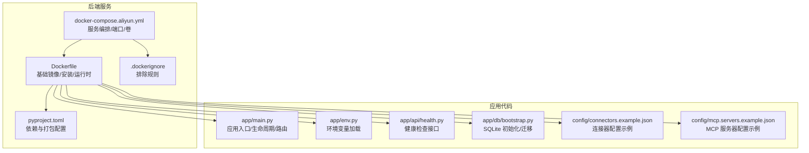
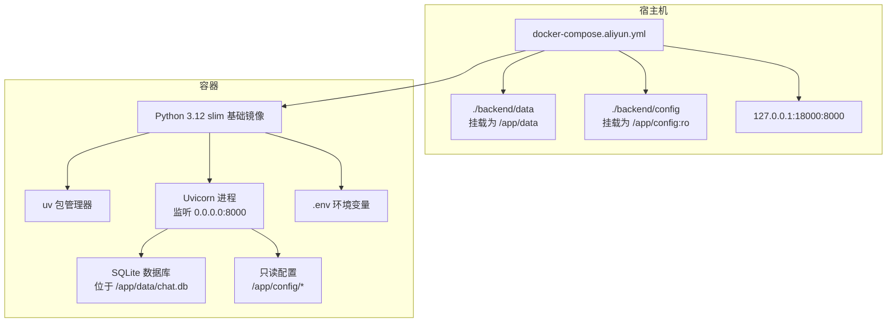
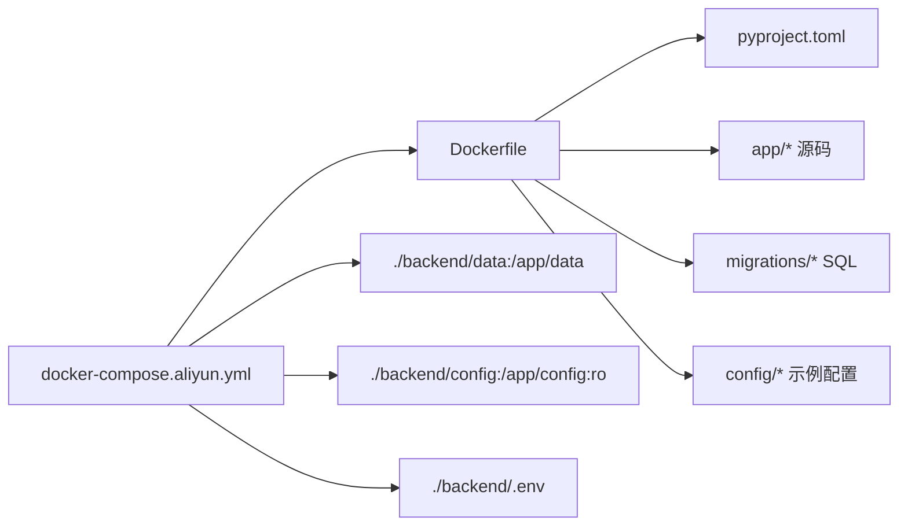

# 容器化部署

<cite>
**本文引用的文件**
- [backend/Dockerfile](file://backend/Dockerfile)
- [backend/.dockerignore](file://backend/.dockerignore)
- [docker-compose.aliyun.yml](file://docker-compose.aliyun.yml)
- [backend/pyproject.toml](file://backend/pyproject.toml)
- [backend/app/main.py](file://backend/app/main.py)
- [backend/app/env.py](file://backend/app/env.py)
- [backend/app/api/health.py](file://backend/app/api/health.py)
- [backend/app/db/bootstrap.py](file://backend/app/db/bootstrap.py)
- [backend/config/connectors.example.json](file://backend/config/connectors.example.json)
- [backend/config/mcp.servers.example.json](file://backend/config/mcp.servers.example.json)
</cite>

## 目录
1. [简介](#简介)
2. [项目结构](#项目结构)
3. [核心组件](#核心组件)
4. [架构总览](#架构总览)
5. [详细组件分析](#详细组件分析)
6. [依赖关系分析](#依赖关系分析)
7. [性能考虑](#性能考虑)
8. [故障排查指南](#故障排查指南)
9. [结论](#结论)
10. [附录](#附录)

## 简介
本文件面向容器化部署场景，系统性说明后端服务的 Docker 镜像构建流程、多阶段优化策略、基础镜像选择、依赖安装与运行时配置；并文档化 docker-compose 编排、网络与卷挂载、环境变量传递、端口映射与健康检查；最后给出容器安全与资源限制建议、调试技巧与常见问题排查方法。目标是帮助运维与开发团队快速、稳定地交付与维护该后端服务。

## 项目结构
后端服务采用 Python 3.12 slim 基础镜像，使用 uv 作为包安装工具，通过 pip 安装项目自身（含 app、migrations）并暴露 8000 端口。compose 文件定义了后端服务的构建上下文、重启策略、环境文件、端口映射与卷挂载，并将数据目录与配置目录分别挂载到容器内对应位置。

图表来源
- [backend/Dockerfile:1-21](file://backend/Dockerfile#L1-L21)
- [backend/.dockerignore:1-10](file://backend/.dockerignore#L1-L10)
- [backend/pyproject.toml:1-42](file://backend/pyproject.toml#L1-L42)
- [docker-compose.aliyun.yml:1-14](file://docker-compose.aliyun.yml#L1-L14)
- [backend/app/main.py:1-54](file://backend/app/main.py#L1-L54)
- [backend/app/env.py:1-18](file://backend/app/env.py#L1-L18)
- [backend/app/api/health.py:1-18](file://backend/app/api/health.py#L1-L18)
- [backend/app/db/bootstrap.py:1-225](file://backend/app/db/bootstrap.py#L1-L225)
- [backend/config/connectors.example.json:1-25](file://backend/config/connectors.example.json#L1-L25)
- [backend/config/mcp.servers.example.json:1-18](file://backend/config/mcp.servers.example.json#L1-L18)

章节来源
- [backend/Dockerfile:1-21](file://backend/Dockerfile#L1-L21)
- [backend/.dockerignore:1-10](file://backend/.dockerignore#L1-L10)
- [docker-compose.aliyun.yml:1-14](file://docker-compose.aliyun.yml#L1-L14)
- [backend/pyproject.toml:1-42](file://backend/pyproject.toml#L1-L42)

## 核心组件
- Dockerfile：定义基础镜像、环境变量、工作目录、依赖安装、复制文件、创建目录、暴露端口与启动命令。
- .dockerignore：控制构建上下文中不需要上传的文件与目录，减少镜像体积与构建时间。
- docker-compose.aliyun.yml：定义后端服务的构建、重启策略、环境文件、端口映射与卷挂载。
- pyproject.toml：声明项目依赖、可选开发依赖、打包配置等。
- 应用入口与生命周期：app/main.py 负责创建 FastAPI 应用、注册路由、CORS 中间件与生命周期事件。
- 环境变量加载：app/env.py 使用 python-dotenv 在不展开 $ 的情况下加载 .env。
- 健康检查：app/api/health.py 提供 /api/health 接口，返回服务状态与 Agent 运行时快照。
- 数据库初始化：app/db/bootstrap.py 解析数据库路径、支持重置与迁移，确保 SQLite 数据库可用。

章节来源
- [backend/Dockerfile:1-21](file://backend/Dockerfile#L1-L21)
- [backend/.dockerignore:1-10](file://backend/.dockerignore#L1-L10)
- [docker-compose.aliyun.yml:1-14](file://docker-compose.aliyun.yml#L1-L14)
- [backend/pyproject.toml:1-42](file://backend/pyproject.toml#L1-L42)
- [backend/app/main.py:1-54](file://backend/app/main.py#L1-L54)
- [backend/app/env.py:1-18](file://backend/app/env.py#L1-L18)
- [backend/app/api/health.py:1-18](file://backend/app/api/health.py#L1-L18)
- [backend/app/db/bootstrap.py:1-225](file://backend/app/db/bootstrap.py#L1-L225)

## 架构总览
下图展示容器化部署的整体交互：compose 启动后端容器，容器内应用监听 8000 端口并通过健康检查接口暴露状态；数据与配置通过卷挂载持久化与注入。

图表来源
- [docker-compose.aliyun.yml:1-14](file://docker-compose.aliyun.yml#L1-L14)
- [backend/Dockerfile:1-21](file://backend/Dockerfile#L1-L21)

## 详细组件分析

### Dockerfile 分析
- 基础镜像选择：使用 python:3.12-slim，兼顾体积与兼容性。
- 环境变量：设置 PYTHONDONTWRITEBYTECODE、PYTHONUNBUFFERED、PIP_NO_CACHE_DIR，避免生成 .pyc、保证日志实时输出、禁用 pip 缓存以减小镜像体积。
- 工作目录：/app。
- 依赖安装：先安装 uv，再复制 pyproject.toml 与应用源码，最后执行 pip install . 安装项目。
- 目录创建：创建 /app/config 与 /app/data 目录，便于后续挂载与运行时写入。
- 端口暴露：8000。
- 启动命令：uvicorn 以工厂函数方式启动 FastAPI 应用，绑定 0.0.0.0:8000。

优化建议（多阶段构建思路）
- 阶段一（构建）：在构建阶段仅安装依赖与构建产物，不包含运行时依赖。
- 阶段二（运行）：从更精简的基础镜像开始，仅拷贝构建产物与运行所需最小依赖，降低攻击面与镜像体积。
- 可选：使用 pip-tools 或 Poetry 的锁定文件进行确定性安装，提升可重复性与安全性。

章节来源
- [backend/Dockerfile:1-21](file://backend/Dockerfile#L1-L21)
- [backend/pyproject.toml:1-42](file://backend/pyproject.toml#L1-L42)

### .dockerignore 分析
- 排除 .env、.venv、venv、env、__pycache__、*.pyc、tests、data、config/mcp.servers.json 等，避免将开发与测试文件、缓存与敏感配置带入镜像，提高安全性与构建效率。

章节来源
- [backend/.dockerignore:1-10](file://backend/.dockerignore#L1-L10)

### docker-compose 编排分析
- 服务名称：backend，容器名为 aitravel-backend。
- 构建上下文：./backend。
- 重启策略：unless-stopped。
- 环境文件：./backend/.env。
- 端口映射：127.0.0.1:18000:8000，限制本地访问。
- 卷挂载：
  - ./backend/data -> /app/data：持久化 SQLite 数据库文件。
  - ./backend/config -> /app/config:ro：注入配置文件，只读挂载。

建议增强
- 健康检查：添加 healthcheck 字段，基于 /api/health 接口进行探测。
- 资源限制：设置 deploy.resources.limits/cpus/memory 或 compose 的 deploy 字段。
- 网络隔离：自定义网络，避免与其他服务冲突。
- 环境变量覆盖：在 compose 中使用 environment/environment_file 组合，确保敏感配置不泄露到镜像层。

章节来源
- [docker-compose.aliyun.yml:1-14](file://docker-compose.aliyun.yml#L1-L14)

### 应用入口与生命周期
- 应用创建：create_app() 加载环境变量、初始化 SQLite 数据库、注册路由与 CORS 中间件。
- 生命周期：lifespan 在启动时初始化 Agent，在关闭时释放资源。
- CORS：允许来源可通过环境变量 CORS_ALLOW_ORIGINS 控制，默认为通配符。

章节来源
- [backend/app/main.py:1-54](file://backend/app/main.py#L1-L54)

### 环境变量加载
- 使用 python-dotenv 的 load_dotenv，设置 override=False、interpolate=False，避免覆盖进程已有环境变量且不展开 $ 符号，保障密钥与占位符的安全性。

章节来源
- [backend/app/env.py:1-18](file://backend/app/env.py#L1-L18)

### 健康检查接口
- 提供 /api/health 接口，返回服务状态与 Agent 运行时快照，可用于容器健康检查与可观测性。

章节来源
- [backend/app/api/health.py:1-18](file://backend/app/api/health.py#L1-L18)

### 数据库初始化与迁移
- 解析数据库路径：优先使用环境变量 CHAT_SQLITE_PATH，否则默认在 /app/data 下创建 chat.db。
- 支持重置：当 DEV_RESET_CHAT_DB 为真值时，重置数据库后再执行迁移。
- 迁移执行：扫描 migrations 目录，按版本号顺序执行未应用的 SQL，并记录到 schema_migrations 表。

章节来源
- [backend/app/db/bootstrap.py:1-225](file://backend/app/db/bootstrap.py#L1-L225)

### 配置示例
- 连接器配置示例：包含 Notion、Linear 等服务的 MCP 服务器地址与客户端信息。
- MCP 服务器配置示例：支持 HTTP 与 stdio 两种传输方式，可注入环境变量。

章节来源
- [backend/config/connectors.example.json:1-25](file://backend/config/connectors.example.json#L1-L25)
- [backend/config/mcp.servers.example.json:1-18](file://backend/config/mcp.servers.example.json#L1-L18)

## 依赖关系分析
Dockerfile 与 compose 之间的依赖关系如下：

图表来源
- [backend/Dockerfile:1-21](file://backend/Dockerfile#L1-L21)
- [backend/pyproject.toml:1-42](file://backend/pyproject.toml#L1-L42)
- [docker-compose.aliyun.yml:1-14](file://docker-compose.aliyun.yml#L1-L14)

章节来源
- [backend/Dockerfile:1-21](file://backend/Dockerfile#L1-L21)
- [docker-compose.aliyun.yml:1-14](file://docker-compose.aliyun.yml#L1-L14)

## 性能考虑
- 镜像体积优化
  - 使用 python:3.12-slim 基础镜像。
  - 禁用 pip 缓存与 .pyc 生成，减少镜像层大小。
  - 利用 .dockerignore 排除不必要的文件与目录。
- 启动性能
  - 使用 uv 作为包管理器，加速依赖安装。
  - 将项目源码与依赖安装分离，利用 Docker 层缓存。
- 运行时性能
  - Uvicorn 以工厂函数方式启动，避免在容器中重复导入应用模块。
  - 通过只读挂载配置目录，减少写放大与 I/O 开销。

[本节为通用指导，无需列出具体文件来源]

## 故障排查指南
- 无法访问健康检查接口
  - 检查端口映射是否正确（compose 中 127.0.0.1:18000:8000），确认容器内应用监听 0.0.0.0:8000。
  - 确认 /api/health 路由已注册（app/main.py 中 include_router）。
- 数据库文件未生成或权限不足
  - 检查 /app/data 是否成功挂载（compose 中 ./backend/data -> /app/data）。
  - 确认容器内用户对 /app/data 有写权限。
- 环境变量未生效
  - 确认 .env 文件存在且路径正确（compose 中 env_file 指向 ./backend/.env）。
  - 检查 app/env.py 的加载逻辑与 override/interpolate 参数。
- CORS 问题
  - 检查 CORS_ALLOW_ORIGINS 环境变量是否正确设置，确保前后端域名匹配。
- 配置注入失败
  - 确认 /app/config 挂载为只读（compose 中 :ro），避免写入冲突。
  - 检查 config 目录下的 JSON 文件格式与键名是否符合预期。

章节来源
- [docker-compose.aliyun.yml:1-14](file://docker-compose.aliyun.yml#L1-L14)
- [backend/app/main.py:1-54](file://backend/app/main.py#L1-L54)
- [backend/app/env.py:1-18](file://backend/app/env.py#L1-L18)
- [backend/app/api/health.py:1-18](file://backend/app/api/health.py#L1-L18)
- [backend/app/db/bootstrap.py:1-225](file://backend/app/db/bootstrap.py#L1-L225)

## 结论
该后端服务的容器化方案以 Python 3.12 slim 基础镜像为核心，结合 uv 安装与最小化构建策略，实现了较优的镜像体积与启动性能。通过 docker-compose 实现了本地端口映射、卷挂载与环境文件注入，并预留了健康检查、资源限制与网络隔离的扩展空间。建议在生产环境中补充健康检查、资源限制与网络隔离策略，以进一步提升稳定性与安全性。

[本节为总结性内容，无需列出具体文件来源]

## 附录

### 环境变量与配置要点
- CORS 允许来源：CORS_ALLOW_ORIGINS
- 数据库路径：CHAT_SQLITE_PATH（默认 /app/data/chat.db）
- 开发重置数据库：DEV_RESET_CHAT_DB（真值时重置）
- 环境文件：./backend/.env（通过 compose 的 env_file 注入）

章节来源
- [backend/app/main.py:1-54](file://backend/app/main.py#L1-L54)
- [backend/app/db/bootstrap.py:1-225](file://backend/app/db/bootstrap.py#L1-L225)
- [backend/app/env.py:1-18](file://backend/app/env.py#L1-L18)
- [docker-compose.aliyun.yml:1-14](file://docker-compose.aliyun.yml#L1-L14)