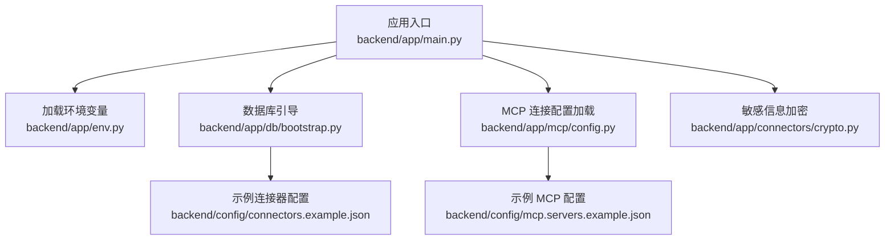
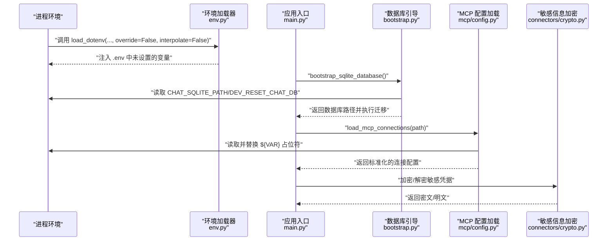
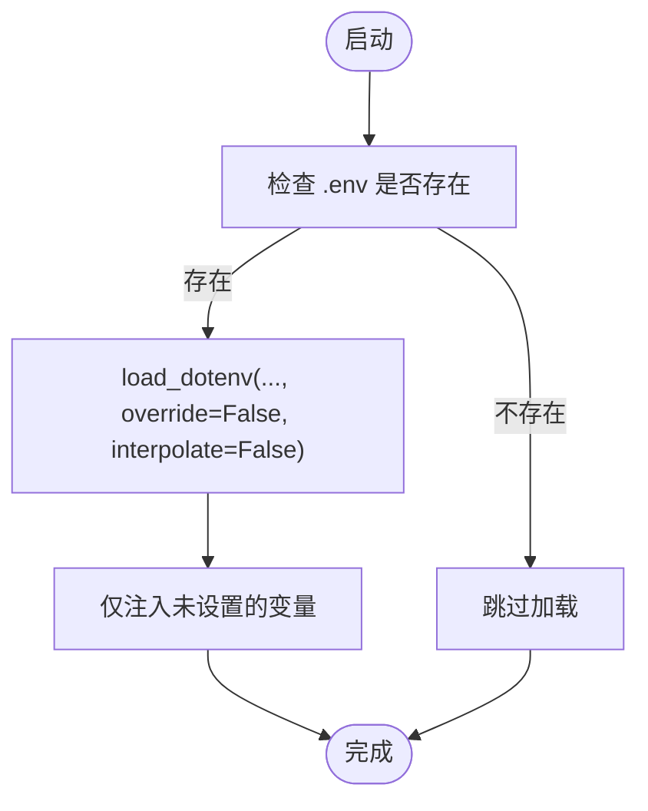
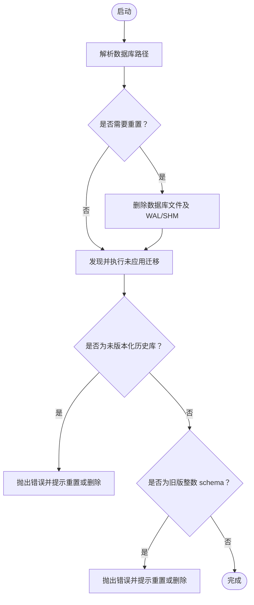
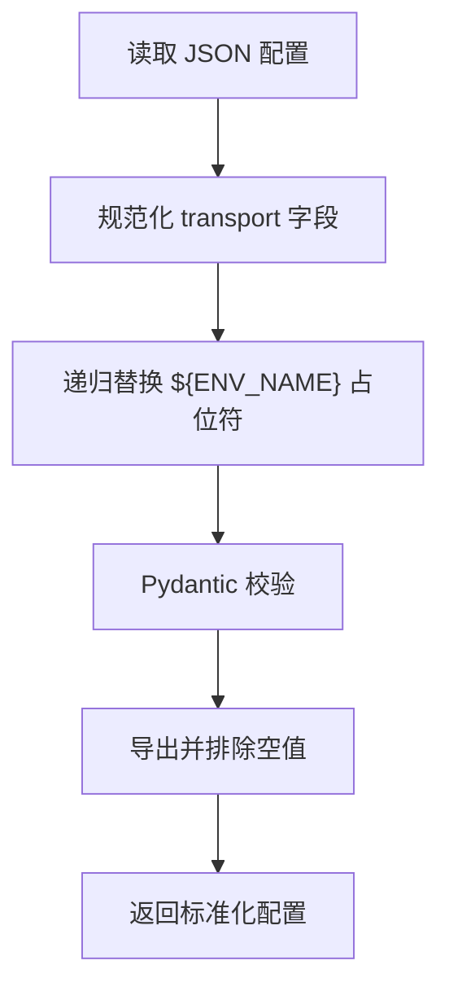
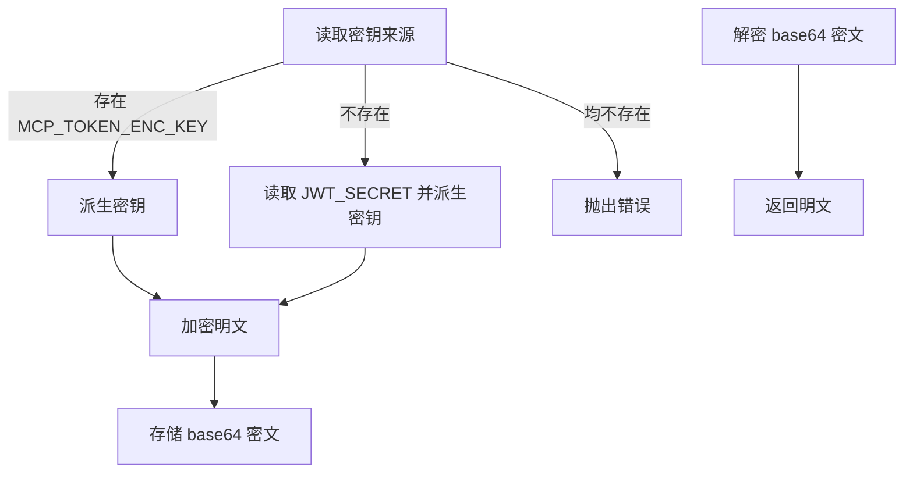
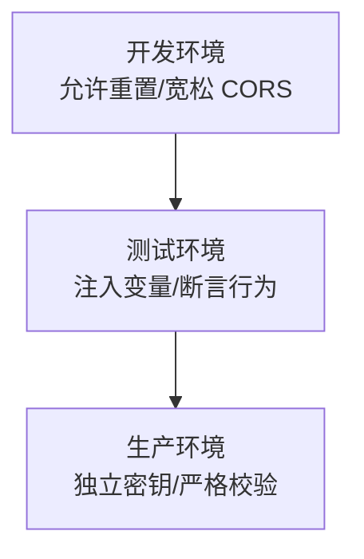
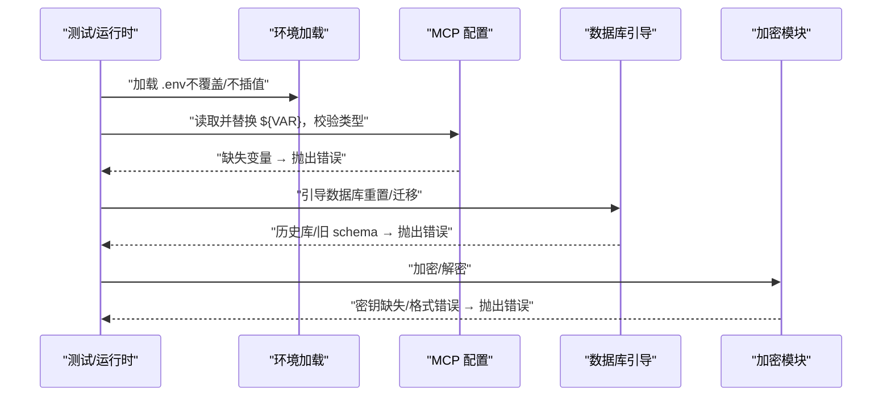
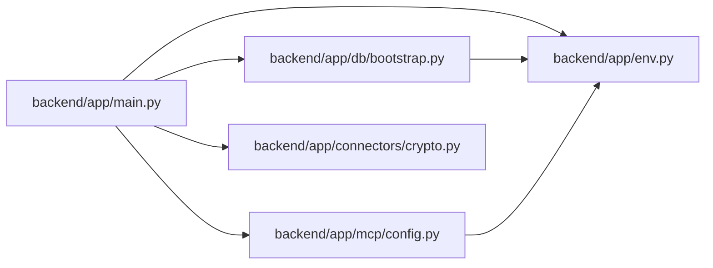

# 环境配置

<cite>
**本文引用的文件**
- [backend/app/env.py](file://backend/app/env.py)
- [backend/app/main.py](file://backend/app/main.py)
- [backend/app/db/bootstrap.py](file://backend/app/db/bootstrap.py)
- [backend/app/mcp/config.py](file://backend/app/mcp/config.py)
- [backend/config/connectors.example.json](file://backend/config/connectors.example.json)
- [backend/config/mcp.servers.example.json](file://backend/config/mcp.servers.example.json)
- [backend/app/connectors/crypto.py](file://backend/app/connectors/crypto.py)
- [backend/tests/test_env.py](file://backend/tests/test_env.py)
- [backend/tests/test_mcp_config.py](file://backend/tests/test_mcp_config.py)
- [backend/.dockerignore](file://backend/.dockerignore)
</cite>

## 目录
1. [简介](#简介)
2. [项目结构](#项目结构)
3. [核心组件](#核心组件)
4. [架构总览](#架构总览)
5. [详细组件分析](#详细组件分析)
6. [依赖关系分析](#依赖关系分析)
7. [性能考量](#性能考量)
8. [故障排查指南](#故障排查指南)
9. [结论](#结论)
10. [附录](#附录)

## 简介
本文件系统性阐述本项目的环境配置与敏感信息管理策略，覆盖以下要点：
- 生产环境变量配置与加载优先级
- 数据库连接配置与迁移控制
- 第三方 API 密钥与 MCP 服务器设置
- 环境文件格式、占位符替换与默认值处理
- 开发/测试/生产环境差异与切换方法
- 配置验证、错误处理与热更新/动态配置思路

## 项目结构
围绕环境配置的关键位置如下：
- 后端环境加载：在应用入口处加载 .env 并注入进程环境
- 数据库路径与迁移：通过环境变量解析 SQLite 路径，并按需重置与迁移
- MCP 连接配置：以 JSON 文件定义，支持环境变量占位符替换与严格校验
- 敏感信息管理：基于对称加密的凭据存储，支持独立密钥轮换
- 示例配置：提供 connectors 与 mcp.servers 的示例文件

**图示来源**
- [backend/app/main.py:31-54](file://backend/app/main.py#L31-L54)
- [backend/app/env.py:10-17](file://backend/app/env.py#L10-L17)
- [backend/app/db/bootstrap.py:213-226](file://backend/app/db/bootstrap.py#L213-L226)
- [backend/app/mcp/config.py:63-91](file://backend/app/mcp/config.py#L63-L91)
- [backend/config/mcp.servers.example.json:1-18](file://backend/config/mcp.servers.example.json#L1-L18)
- [backend/config/connectors.example.json:1-25](file://backend/config/connectors.example.json#L1-L25)
- [backend/app/connectors/crypto.py:18-33](file://backend/app/connectors/crypto.py#L18-L33)

**章节来源**
- [backend/app/main.py:31-54](file://backend/app/main.py#L31-L54)
- [backend/app/env.py:10-17](file://backend/app/env.py#L10-L17)
- [backend/app/db/bootstrap.py:213-226](file://backend/app/db/bootstrap.py#L213-L226)
- [backend/app/mcp/config.py:63-91](file://backend/app/mcp/config.py#L63-L91)
- [backend/config/mcp.servers.example.json:1-18](file://backend/config/mcp.servers.example.json#L1-L18)
- [backend/config/connectors.example.json:1-25](file://backend/config/connectors.example.json#L1-L25)
- [backend/app/connectors/crypto.py:18-33](file://backend/app/connectors/crypto.py#L18-L33)

## 核心组件
- 环境变量加载器：负责从 .env 文件加载变量，避免覆盖已存在的进程变量，且不进行插值展开，保证敏感值原样注入
- 数据库引导器：解析聊天数据库路径，支持重置开关与迁移执行
- MCP 连接配置加载器：读取 JSON 配置，递归替换占位符，严格校验类型与字段
- 敏感信息加密模块：基于 AES-GCM 对连接器凭据进行加解密，支持独立密钥与回退密钥

**章节来源**
- [backend/app/env.py:10-17](file://backend/app/env.py#L10-L17)
- [backend/app/db/bootstrap.py:38-46](file://backend/app/db/bootstrap.py#L38-L46)
- [backend/app/mcp/config.py:36-52](file://backend/app/mcp/config.py#L36-L52)
- [backend/app/connectors/crypto.py:18-33](file://backend/app/connectors/crypto.py#L18-L33)

## 架构总览
下图展示应用启动时的环境配置与数据库引导流程，以及 MCP 配置加载与敏感信息处理的关系。

**图示来源**
- [backend/app/env.py:10-17](file://backend/app/env.py#L10-L17)
- [backend/app/main.py:33-34](file://backend/app/main.py#L33-L34)
- [backend/app/db/bootstrap.py:213-226](file://backend/app/db/bootstrap.py#L213-L226)
- [backend/app/mcp/config.py:63-91](file://backend/app/mcp/config.py#L63-L91)
- [backend/app/connectors/crypto.py:35-55](file://backend/app/connectors/crypto.py#L35-L55)

## 详细组件分析

### 环境变量加载与优先级
- 加载时机：应用入口在创建 FastAPI 实例前调用环境加载函数
- 加载行为：仅当目标 .env 文件存在时才加载；若未指定路径，默认加载后端根目录下的 .env
- 覆盖策略：不覆盖已存在于进程环境中的变量（override=False）
- 插值策略：不对值进行插值展开（interpolate=False），确保包含 $ 符号的敏感值保持原样
- 测试验证：单元测试覆盖了占位符保留与进程变量不被覆盖的行为

**图示来源**
- [backend/app/env.py:10-17](file://backend/app/env.py#L10-L17)
- [backend/app/main.py:33](file://backend/app/main.py#L33)
- [backend/tests/test_env.py:8-27](file://backend/tests/test_env.py#L8-L27)
- [backend/tests/test_env.py:29-37](file://backend/tests/test_env.py#L29-L37)

**章节来源**
- [backend/app/env.py:10-17](file://backend/app/env.py#L10-L17)
- [backend/app/main.py:33](file://backend/app/main.py#L33)
- [backend/tests/test_env.py:8-27](file://backend/tests/test_env.py#L8-L27)
- [backend/tests/test_env.py:29-37](file://backend/tests/test_env.py#L29-L37)

### 数据库连接配置与迁移控制
- 数据库路径解析：优先读取环境变量，否则使用默认路径（后端根目录下的 data/chat.db）
- 重置开关：通过布尔真值集合判断是否重置数据库（支持 1/true/yes/on 等）
- 迁移执行：发现迁移文件、校验版本、写入迁移记录、按序执行未应用的迁移脚本
- 安全保护：拒绝运行未版本化历史数据库或旧版整数 schema，必要时要求显式重置

**图示来源**
- [backend/app/db/bootstrap.py:38-46](file://backend/app/db/bootstrap.py#L38-L46)
- [backend/app/db/bootstrap.py:43-46](file://backend/app/db/bootstrap.py#L43-L46)
- [backend/app/db/bootstrap.py:181-210](file://backend/app/db/bootstrap.py#L181-L210)
- [backend/app/db/bootstrap.py:112-131](file://backend/app/db/bootstrap.py#L112-L131)
- [backend/app/db/bootstrap.py:142-165](file://backend/app/db/bootstrap.py#L142-L165)

**章节来源**
- [backend/app/db/bootstrap.py:38-46](file://backend/app/db/bootstrap.py#L38-L46)
- [backend/app/db/bootstrap.py:43-46](file://backend/app/db/bootstrap.py#L43-L46)
- [backend/app/db/bootstrap.py:181-210](file://backend/app/db/bootstrap.py#L181-L210)
- [backend/app/db/bootstrap.py:112-131](file://backend/app/db/bootstrap.py#L112-L131)
- [backend/app/db/bootstrap.py:142-165](file://backend/app/db/bootstrap.py#L142-L165)

### MCP 服务器配置与占位符替换
- 配置文件：以 JSON 对象形式定义多个服务器连接，键名为服务器名称
- 支持传输类型：http/streamable_http/sse；其中 http 将被规范化为 streamable_http
- 占位符替换：递归遍历配置，将字符串中的 ${ENV_NAME} 替换为对应环境变量值；缺失变量会立即报错
- 类型校验：使用 Pydantic 校验结构，确保字段与类型符合预期
- 默认值处理：配置文件中未提供的可选字段将被排除（exclude_none）

**图示来源**
- [backend/app/mcp/config.py:63-91](file://backend/app/mcp/config.py#L63-L91)
- [backend/app/mcp/config.py:36-52](file://backend/app/mcp/config.py#L36-L52)
- [backend/app/mcp/config.py:55-61](file://backend/app/mcp/config.py#L55-L61)
- [backend/config/mcp.servers.example.json:1-18](file://backend/config/mcp.servers.example.json#L1-L18)

**章节来源**
- [backend/app/mcp/config.py:63-91](file://backend/app/mcp/config.py#L63-L91)
- [backend/app/mcp/config.py:36-52](file://backend/app/mcp/config.py#L36-L52)
- [backend/app/mcp/config.py:55-61](file://backend/app/mcp/config.py#L55-L61)
- [backend/config/mcp.servers.example.json:1-18](file://backend/config/mcp.servers.example.json#L1-L18)
- [backend/tests/test_mcp_config.py:10-32](file://backend/tests/test_mcp_config.py#L10-L32)
- [backend/tests/test_mcp_config.py:34-50](file://backend/tests/test_mcp_config.py#L34-L50)

### 敏感信息管理与凭据加密
- 加密算法：AES-GCM，密钥由环境变量派生而来
- 密钥来源：优先使用独立的 MCP_TOKEN_ENC_KEY；若未设置则回退到 JWT_SECRET；两者均缺失则抛出错误
- 存储格式：密文为 base64，包含 12 字节随机 nonce 前缀
- 解密校验：空值返回 None；格式不正确抛出异常

**图示来源**
- [backend/app/connectors/crypto.py:18-33](file://backend/app/connectors/crypto.py#L18-L33)
- [backend/app/connectors/crypto.py:35-55](file://backend/app/connectors/crypto.py#L35-L55)

**章节来源**
- [backend/app/connectors/crypto.py:18-33](file://backend/app/connectors/crypto.py#L18-L33)
- [backend/app/connectors/crypto.py:35-55](file://backend/app/connectors/crypto.py#L35-L55)
- [backend/tests/test_connectors_crypto.py:17-41](file://backend/tests/test_connectors_crypto.py#L17-L41)

### 不同环境的配置差异与切换
- 开发环境：可启用调试与重置开关，如 DEV_RESET_CHAT_DB；允许更宽松的 CORS 设置
- 测试环境：通过测试工具注入环境变量，验证占位符替换与错误处理
- 生产环境：强调独立密钥轮换与严格的配置校验，避免在 .env 中直接暴露敏感值

**图示来源**
- [backend/app/db/bootstrap.py:43-46](file://backend/app/db/bootstrap.py#L43-L46)
- [backend/app/main.py:37-44](file://backend/app/main.py#L37-L44)
- [backend/tests/test_env.py:8-27](file://backend/tests/test_env.py#L8-L27)
- [backend/tests/test_mcp_config.py:10-32](file://backend/tests/test_mcp_config.py#L10-L32)

**章节来源**
- [backend/app/db/bootstrap.py:43-46](file://backend/app/db/bootstrap.py#L43-L46)
- [backend/app/main.py:37-44](file://backend/app/main.py#L37-L44)
- [backend/tests/test_env.py:8-27](file://backend/tests/test_env.py#L8-L27)
- [backend/tests/test_mcp_config.py:10-32](file://backend/tests/test_mcp_config.py#L10-L32)

### 配置验证与错误处理机制
- 环境加载：保留 $ 符号与进程变量优先，避免意外覆盖
- MCP 配置：占位符缺失即刻报错，类型不符抛出异常
- 数据库：对历史库与旧 schema 提前拦截，防止不一致状态
- 加密：密钥缺失与密文格式错误均抛出异常

**图示来源**
- [backend/tests/test_env.py:8-27](file://backend/tests/test_env.py#L8-L27)
- [backend/tests/test_mcp_config.py:34-50](file://backend/tests/test_mcp_config.py#L34-L50)
- [backend/app/db/bootstrap.py:112-131](file://backend/app/db/bootstrap.py#L112-L131)
- [backend/app/db/bootstrap.py:142-165](file://backend/app/db/bootstrap.py#L142-L165)
- [backend/app/connectors/crypto.py:28-32](file://backend/app/connectors/crypto.py#L28-L32)
- [backend/app/connectors/crypto.py:50-52](file://backend/app/connectors/crypto.py#L50-L52)

**章节来源**
- [backend/tests/test_env.py:8-27](file://backend/tests/test_env.py#L8-L27)
- [backend/tests/test_mcp_config.py:34-50](file://backend/tests/test_mcp_config.py#L34-L50)
- [backend/app/db/bootstrap.py:112-131](file://backend/app/db/bootstrap.py#L112-L131)
- [backend/app/db/bootstrap.py:142-165](file://backend/app/db/bootstrap.py#L142-L165)
- [backend/app/connectors/crypto.py:28-32](file://backend/app/connectors/crypto.py#L28-L32)
- [backend/app/connectors/crypto.py:50-52](file://backend/app/connectors/crypto.py#L50-L52)

### 配置热更新与动态配置管理方案
- 现状：当前实现为一次性加载与校验，重启服务以应用变更
- 建议方案：
  - 引入配置缓存与文件监控：监听配置文件变化，触发增量刷新
  - 分层配置：将常变配置迁移到外部集中式配置中心（如 etcd/Consul），应用内定期拉取并校验
  - 动态密钥轮换：独立密钥支持在线轮换，配合密文版本标记与渐进切换
  - 灰度发布：对 MCP 服务器连接采用分组灰度，失败时快速隔离

[本节为通用实践建议，不直接分析具体文件，故无章节来源]

## 依赖关系分析
- 应用入口依赖环境加载器与数据库引导器
- 数据库引导器依赖环境变量解析与迁移脚本
- MCP 配置加载器依赖环境变量与 Pydantic 校验
- 敏感信息加密模块依赖环境变量派生密钥

**图示来源**
- [backend/app/main.py:31-54](file://backend/app/main.py#L31-L54)
- [backend/app/env.py:10-17](file://backend/app/env.py#L10-L17)
- [backend/app/db/bootstrap.py:213-226](file://backend/app/db/bootstrap.py#L213-L226)
- [backend/app/mcp/config.py:63-91](file://backend/app/mcp/config.py#L63-L91)
- [backend/app/connectors/crypto.py:18-33](file://backend/app/connectors/crypto.py#L18-L33)

**章节来源**
- [backend/app/main.py:31-54](file://backend/app/main.py#L31-L54)
- [backend/app/env.py:10-17](file://backend/app/env.py#L10-L17)
- [backend/app/db/bootstrap.py:213-226](file://backend/app/db/bootstrap.py#L213-L226)
- [backend/app/mcp/config.py:63-91](file://backend/app/mcp/config.py#L63-L91)
- [backend/app/connectors/crypto.py:18-33](file://backend/app/connectors/crypto.py#L18-L33)

## 性能考量
- 环境加载：仅在应用启动时执行一次，开销极低
- 数据库引导：重置与迁移为一次性操作，后续启动仅执行迁移校验
- MCP 配置：JSON 解析与校验在启动时完成，运行期按需访问内存映射
- 加密：密钥派生结果带缓存，避免重复计算

[本节提供一般性指导，不直接分析具体文件，故无章节来源]

## 故障排查指南
- 环境变量未生效
  - 检查 .env 是否存在且未被进程变量覆盖
  - 确认加载函数调用位置在应用创建之前
  - 参考测试用例验证占位符保留与覆盖策略
- MCP 配置加载失败
  - 检查 JSON 结构与字段类型是否符合规范
  - 确认所有 ${VAR} 占位符均有对应环境变量
  - 关注缺失变量导致的异常信息
- 数据库异常
  - 若出现历史库或旧 schema 错误，请按提示设置重置开关或删除旧数据库后重启
- 加密异常
  - 确保设置了独立密钥或回退密钥之一
  - 检查密文格式是否正确

**章节来源**
- [backend/tests/test_env.py:8-27](file://backend/tests/test_env.py#L8-L27)
- [backend/tests/test_env.py:29-37](file://backend/tests/test_env.py#L29-L37)
- [backend/tests/test_mcp_config.py:34-50](file://backend/tests/test_mcp_config.py#L34-L50)
- [backend/app/db/bootstrap.py:112-131](file://backend/app/db/bootstrap.py#L112-L131)
- [backend/app/db/bootstrap.py:142-165](file://backend/app/db/bootstrap.py#L142-L165)
- [backend/app/connectors/crypto.py:28-32](file://backend/app/connectors/crypto.py#L28-L32)
- [backend/app/connectors/crypto.py:50-52](file://backend/app/connectors/crypto.py#L50-L52)

## 结论
本项目通过“启动时一次性加载与校验”的方式，确保环境变量、数据库与 MCP 配置在运行前得到严格验证。敏感信息采用对称加密与独立密钥策略，兼顾安全性与可运维性。建议在生产环境中结合集中式配置中心与密钥轮换机制，进一步提升动态配置与安全治理能力。

## 附录
- 环境文件格式与示例
  - .env：键值对形式，值中 $ 符号将保持原样
  - mcp.servers.json：对象形式，键为服务器名称，值为连接配置，支持 ${ENV_NAME} 占位符
  - connectors.json：对象形式，描述连接器元数据与 MCP 服务器地址等
- 配置优先级与默认值
  - 进程环境变量优先于 .env
  - 数据库路径默认位于后端根目录 data/chat.db
  - MCP 传输类型 http 规范化为 streamable_http
  - 加密密钥优先 MCP_TOKEN_ENC_KEY，其次 JWT_SECRET
- Docker 与部署注意事项
  - .dockerignore 排除 .env、config/mcp.servers.json 等运行时敏感文件，应通过服务器侧预创建或挂载方式提供

**章节来源**
- [backend/.dockerignore:1-9](file://backend/.dockerignore#L1-L9)
- [backend/config/mcp.servers.example.json:1-18](file://backend/config/mcp.servers.example.json#L1-L18)
- [backend/config/connectors.example.json:1-25](file://backend/config/connectors.example.json#L1-L25)
- [backend/app/db/bootstrap.py:38-46](file://backend/app/db/bootstrap.py#L38-L46)
- [backend/app/mcp/config.py:55-61](file://backend/app/mcp/config.py#L55-L61)
- [backend/app/connectors/crypto.py:24-32](file://backend/app/connectors/crypto.py#L24-L32)