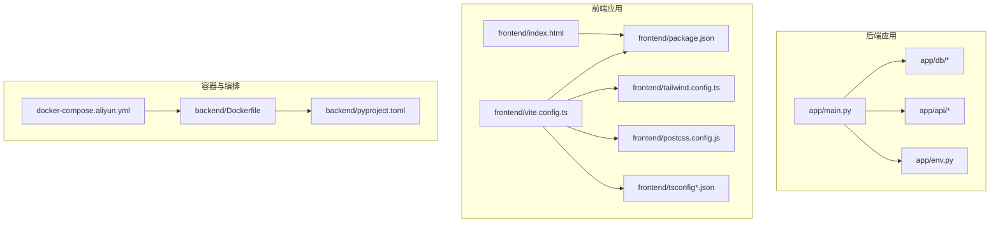
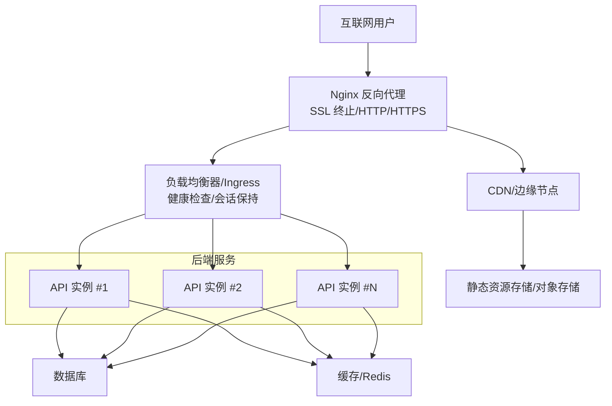
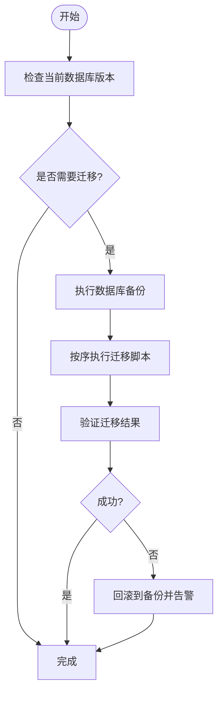
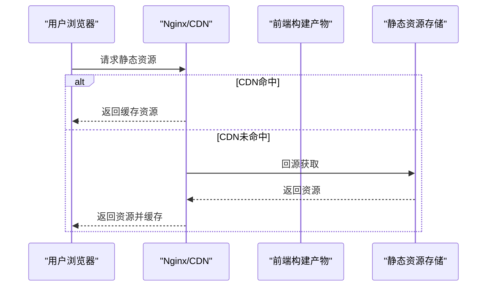
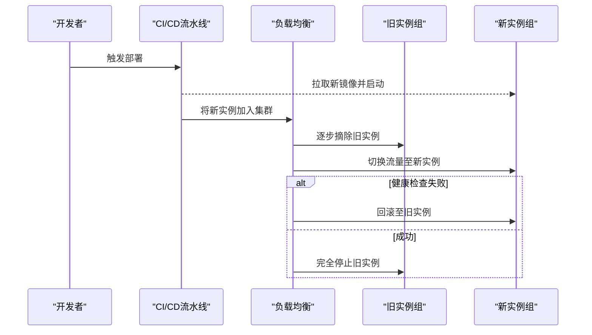
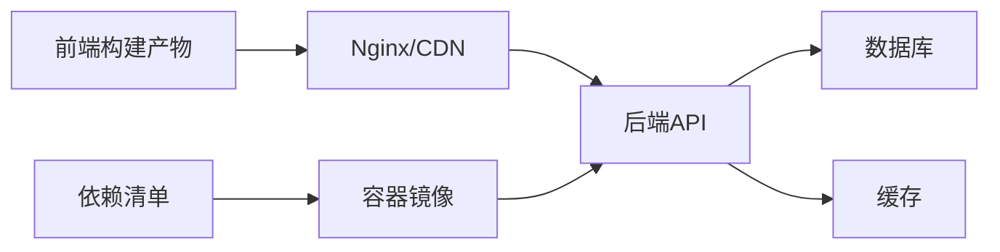

# 生产部署

<cite>
**本文引用的文件**
- [Dockerfile](file://backend/Dockerfile)
- [pyproject.toml](file://backend/pyproject.toml)
- [docker-compose.aliyun.yml](file://docker-compose.aliyun.yml)
- [migrate.py](file://backend/app/db/migrate.py)
- [bootstrap.py](file://backend/app/db/bootstrap.py)
- [health.py](file://backend/app/api/health.py)
- [env.py](file://backend/app/env.py)
- [001_auth_tables.sql](file://backend/migrations/001_auth_tables.sql)
- [002_chat_core.sql](file://backend/migrations/002_chat_core.sql)
- [003_chat_versions.sql](file://backend/migrations/003_chat_versions.sql)
- [004_chat_speech_assets.sql](file://backend/migrations/004_chat_speech_assets.sql)
- [005_chat_parts_status.sql](file://backend/migrations/005_chat_parts_status.sql)
- [006_user_mcp_authorizations.sql](file://backend/migrations/006_user_mcp_authorizations.sql)
- [main.py](file://backend/app/main.py)
- [index.html](file://frontend/index.html)
- [package.json](file://frontend/package.json)
- [vite.config.ts](file://frontend/vite.config.ts)
- [tailwind.config.ts](file://frontend/tailwind.config.ts)
- [postcss.config.js](file://frontend/postcss.config.js)
- [tsconfig.json](file://frontend/tsconfig.json)
- [tsconfig.node.json](file://frontend/tsconfig.node.json)
</cite>

## 目录
1. [简介](#简介)
2. [项目结构](#项目结构)
3. [核心组件](#核心组件)
4. [架构总览](#架构总览)
5. [详细组件分析](#详细组件分析)
6. [依赖关系分析](#依赖关系分析)
7. [性能考量](#性能考量)
8. [故障排查指南](#故障排查指南)
9. [结论](#结论)
10. [附录](#附录)

## 简介
本文件面向生产环境部署，提供从容器镜像构建、服务编排到数据库迁移、静态资源优化与CDN集成的完整指南。结合仓库中的后端应用、前端构建配置与容器编排示例，给出可落地的部署步骤与运维策略，涵盖反向代理、SSL、负载均衡、会话保持、健康检查、滚动/蓝绿发布、回滚、安全加固与备份恢复等主题。

## 项目结构
该仓库采用前后端分离架构：后端为Python应用（FastAPI风格），通过容器化交付；前端为Vite+React/Turbo管理的单页应用；同时提供基于Docker Compose的编排示例，便于在云服务器或容器平台快速部署。

**图表来源**
- [main.py](file://backend/app/main.py)
- [env.py](file://backend/app/env.py)
- [Dockerfile](file://backend/Dockerfile)
- [pyproject.toml](file://backend/pyproject.toml)
- [docker-compose.aliyun.yml](file://docker-compose.aliyun.yml)
- [index.html](file://frontend/index.html)
- [package.json](file://frontend/package.json)
- [vite.config.ts](file://frontend/vite.config.ts)
- [tailwind.config.ts](file://frontend/tailwind.config.ts)
- [postcss.config.js](file://frontend/postcss.config.js)
- [tsconfig.json](file://frontend/tsconfig.json)
- [tsconfig.node.json](file://frontend/tsconfig.node.json)

**章节来源**
- [main.py](file://backend/app/main.py)
- [env.py](file://backend/app/env.py)
- [Dockerfile](file://backend/Dockerfile)
- [pyproject.toml](file://backend/pyproject.toml)
- [docker-compose.aliyun.yml](file://docker-compose.aliyun.yml)
- [index.html](file://frontend/index.html)
- [package.json](file://frontend/package.json)
- [vite.config.ts](file://frontend/vite.config.ts)
- [tailwind.config.ts](file://frontend/tailwind.config.ts)
- [postcss.config.js](file://frontend/postcss.config.js)
- [tsconfig.json](file://frontend/tsconfig.json)
- [tsconfig.node.json](file://frontend/tsconfig.node.json)

## 核心组件
- 应用入口与运行时
  - 后端主程序负责路由注册、中间件装配与业务模块加载，提供健康检查端点以供外部探活。
  - 前端通过Vite构建生成静态资源，配合Tailwind与PostCSS进行样式优化。
- 容器与依赖
  - Dockerfile定义镜像构建流程；pyproject.toml声明依赖与脚本；docker-compose.aliyun.yml提供编排示例。
- 数据库与迁移
  - 迁移脚本按版本顺序执行，确保生产数据库结构一致；启动引导逻辑负责初始化必要表与索引。
- 配置与环境
  - 环境变量用于控制运行参数（如数据库连接、日志级别、调试开关等）。

**章节来源**
- [main.py](file://backend/app/main.py)
- [health.py](file://backend/app/api/health.py)
- [env.py](file://backend/app/env.py)
- [Dockerfile](file://backend/Dockerfile)
- [pyproject.toml](file://backend/pyproject.toml)
- [docker-compose.aliyun.yml](file://docker-compose.aliyun.yml)
- [bootstrap.py](file://backend/app/db/bootstrap.py)
- [migrate.py](file://backend/app/db/migrate.py)

## 架构总览
下图展示生产环境典型拓扑：Nginx作为反向代理与SSL终止，后端服务以容器形式运行，前端静态资源由Nginx提供或经CDN分发，数据库与缓存独立部署。

[此图为概念性架构示意，不直接映射具体源码文件，故无“图表来源”标注]

## 详细组件分析

### 反向代理与域名解析
- Nginx配置要点
  - 监听443端口，启用TLS，指向SSL证书与私钥。
  - 将 /api 前缀转发至后端服务集群，开启 keepalive 与超时参数优化。
  - 对静态资源路径（如 /assets、/static）直接返回或经CDN加速。
  - 设置安全响应头（HSTS、X-Frame-Options、X-Content-Type-Options、Referrer-Policy）。
- 域名解析
  - 使用A/AAAA记录将域名指向Nginx公网IP；若使用云平台负载均衡，指向其提供的地址。
  - 为CDN配置CNAME，确保静态资源走全球加速网络。

[本节为通用部署实践说明，未直接分析具体源码文件，故无“章节来源”与“图表来源”]

### SSL证书部署
- 推荐方案
  - 使用Let’s Encrypt自动签发与续期（acme-tiny、certbot或平台托管证书服务）。
  - 在Nginx中配置证书链与DH参数，禁用弱密码套件，启用OCSP Stapling。
- 密钥管理
  - 将私钥权限限制为仅Nginx进程可读；定期轮换并审计变更。

[本节为通用部署实践说明，未直接分析具体源码文件，故无“章节来源”与“图表来源”]

### 负载均衡、会话保持与健康检查
- 负载均衡策略
  - 轮询或最少连接；对长连接场景建议启用会话保持（基于Cookie或IP哈希）。
- 健康检查
  - 使用后端健康端点（如 /api/health）探测存活状态；失败时自动摘除实例。
- Nginx示例
  - upstream块定义后端实例列表；
  - proxy_pass转发请求；
  - proxy_next_upstream与重试策略提升可用性。

[本节为通用部署实践说明，未直接分析具体源码文件，故无“章节来源”与“图表来源”]

### 数据库迁移、备份与同步
- 迁移策略
  - 生产环境禁止回滚到旧版本；迁移前先备份数据库。
  - 使用只读副本执行迁移脚本，确认无误后再切换流量。
- 备份策略
  - 全量+增量备份，保留至少7天全备；备份加密并异地存放。
- 同步方案
  - 主从复制或集群模式；写操作集中在主库，读操作分流至从库。
- 仓库内迁移脚本
  - 按版本顺序执行的SQL脚本集合，确保数据库结构演进可控。

**图表来源**
- [migrate.py](file://backend/app/db/migrate.py)
- [bootstrap.py](file://backend/app/db/bootstrap.py)
- [001_auth_tables.sql](file://backend/migrations/001_auth_tables.sql)
- [002_chat_core.sql](file://backend/migrations/002_chat_core.sql)
- [003_chat_versions.sql](file://backend/migrations/003_chat_versions.sql)
- [004_chat_speech_assets.sql](file://backend/migrations/004_chat_speech_assets.sql)
- [005_chat_parts_status.sql](file://backend/migrations/005_chat_parts_status.sql)
- [006_user_mcp_authorizations.sql](file://backend/migrations/006_user_mcp_authorizations.sql)

**章节来源**
- [migrate.py](file://backend/app/db/migrate.py)
- [bootstrap.py](file://backend/app/db/bootstrap.py)
- [001_auth_tables.sql](file://backend/migrations/001_auth_tables.sql)
- [002_chat_core.sql](file://backend/migrations/002_chat_core.sql)
- [003_chat_versions.sql](file://backend/migrations/003_chat_versions.sql)
- [004_chat_speech_assets.sql](file://backend/migrations/004_chat_speech_assets.sql)
- [005_chat_parts_status.sql](file://backend/migrations/005_chat_parts_status.sql)
- [006_user_mcp_authorizations.sql](file://backend/migrations/006_user_mcp_authorizations.sql)

### 缓存配置、静态资源优化与CDN集成
- 缓存策略
  - 启用浏览器缓存与服务端缓存（如Redis）；对动态内容设置合理TTL与失效策略。
- 静态资源优化
  - 前端构建产物包含哈希文件名；Tailwind与PostCSS优化样式体积。
  - Vite配置压缩与分包策略，减少首屏加载时间。
- CDN集成
  - 将静态资源托管于CDN，配置缓存头与回源规则；对图片、字体等二进制资源启用压缩与WebP转换。

**图表来源**
- [index.html](file://frontend/index.html)
- [package.json](file://frontend/package.json)
- [vite.config.ts](file://frontend/vite.config.ts)
- [tailwind.config.ts](file://frontend/tailwind.config.ts)
- [postcss.config.js](file://frontend/postcss.config.js)
- [tsconfig.json](file://frontend/tsconfig.json)
- [tsconfig.node.json](file://frontend/tsconfig.node.json)

**章节来源**
- [index.html](file://frontend/index.html)
- [package.json](file://frontend/package.json)
- [vite.config.ts](file://frontend/vite.config.ts)
- [tailwind.config.ts](file://frontend/tailwind.config.ts)
- [postcss.config.js](file://frontend/postcss.config.js)
- [tsconfig.json](file://frontend/tsconfig.json)
- [tsconfig.node.json](file://frontend/tsconfig.node.json)

### 滚动更新、蓝绿部署与回滚
- 滚动更新
  - 分批重启容器，每次替换一部分实例，维持服务连续性。
- 蓝绿部署
  - 同时维护两套环境，切换流量至新版本，失败则立即切回。
- 回滚策略
  - 记录镜像版本与配置快照；回滚时恢复到上一稳定版本。
- 健康检查
  - 部署期间依赖健康端点与就绪探针，避免将流量引入未完全启动的服务。

[本节为通用部署实践说明，未直接分析具体源码文件，故无“章节来源”与“图表来源”]

### 安全加固、防火墙与访问控制
- 网络安全
  - 仅开放必要端口（如80/443/22），其余端口拒绝入站。
  - 使用WAF与DDoS防护，限制请求速率与异常IP。
- 应用安全
  - 启用HTTPS与安全响应头；对敏感接口增加鉴权与限流。
  - 定期更新依赖与系统补丁，扫描漏洞。
- 访问控制
  - 使用IP白名单与VPN访问管理后台；对数据库与缓存设置内网访问策略。

[本节为通用部署实践说明，未直接分析具体源码文件，故无“章节来源”与“图表来源”]

## 依赖关系分析
后端应用通过容器化打包，依赖Python运行时与项目依赖清单；前端构建产物由Nginx提供或经CDN分发；数据库与缓存作为外部服务接入。

**图表来源**
- [Dockerfile](file://backend/Dockerfile)
- [pyproject.toml](file://backend/pyproject.toml)
- [main.py](file://backend/app/main.py)
- [env.py](file://backend/app/env.py)

**章节来源**
- [Dockerfile](file://backend/Dockerfile)
- [pyproject.toml](file://backend/pyproject.toml)
- [main.py](file://backend/app/main.py)
- [env.py](file://backend/app/env.py)

## 性能考量
- 连接池与并发
  - 后端数据库连接池大小与超时需根据实例规格与QPS调优；启用连接复用。
- 缓存命中率
  - 对热点数据与查询结果进行多级缓存；设置合理的过期策略与失效通知。
- 前端性能
  - 启用Gzip/Brotli压缩；拆分大包、懒加载非关键资源；预加载关键字体与图标。
- 监控与告警
  - 关注CPU、内存、磁盘IO、连接数、错误率与响应时间；建立阈值告警。

[本节为通用性能指导，未直接分析具体源码文件，故无“章节来源”]

## 故障排查指南
- 健康检查失败
  - 检查后端健康端点是否可达；查看容器日志与资源占用；确认数据库与缓存连通性。
- 静态资源加载失败
  - 校验Nginx配置与CDN缓存；确认构建产物上传与路径正确。
- 数据库异常
  - 查看迁移日志与备份恢复记录；核对连接参数与权限；评估主从延迟。
- 安全事件
  - 审计访问日志与WAF拦截记录；封禁可疑IP；更新密钥与证书。

**章节来源**
- [health.py](file://backend/app/api/health.py)
- [env.py](file://backend/app/env.py)
- [migrate.py](file://backend/app/db/migrate.py)

## 结论
通过容器化与编排、完善的反向代理与CDN策略、严格的数据库迁移与备份机制、以及滚动/蓝绿发布与回滚预案，可实现高可用、可扩展且安全的生产部署。建议结合监控与自动化工具，持续优化性能与稳定性。

## 附录
- 部署清单
  - 准备Nginx与SSL证书；规划域名与DNS；准备数据库与缓存实例；构建并推送容器镜像；部署并验证健康检查。
- 快速参考
  - 健康检查端点：/api/health
  - 前端构建命令：参见前端package.json脚本
  - 容器镜像构建：参见Dockerfile与pyproject.toml

**章节来源**
- [health.py](file://backend/app/api/health.py)
- [package.json](file://frontend/package.json)
- [Dockerfile](file://backend/Dockerfile)
- [pyproject.toml](file://backend/pyproject.toml)