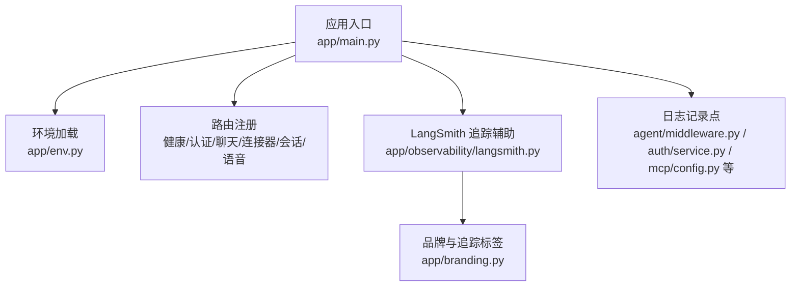
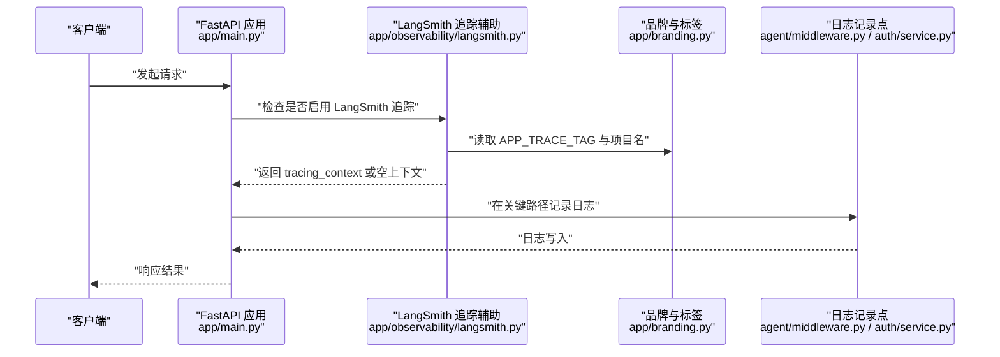
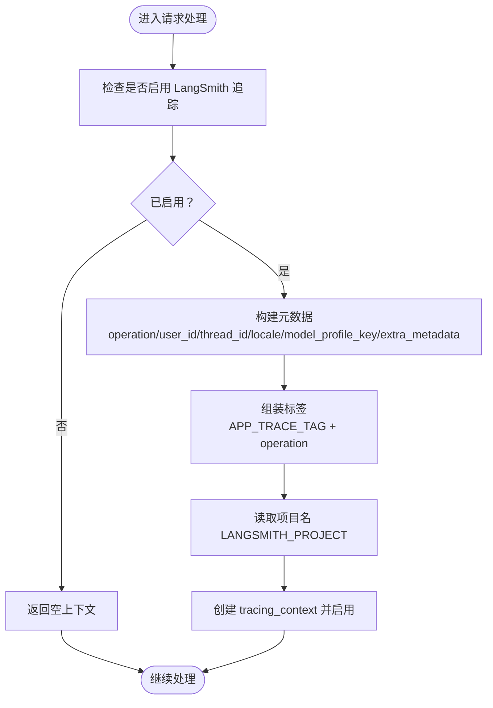
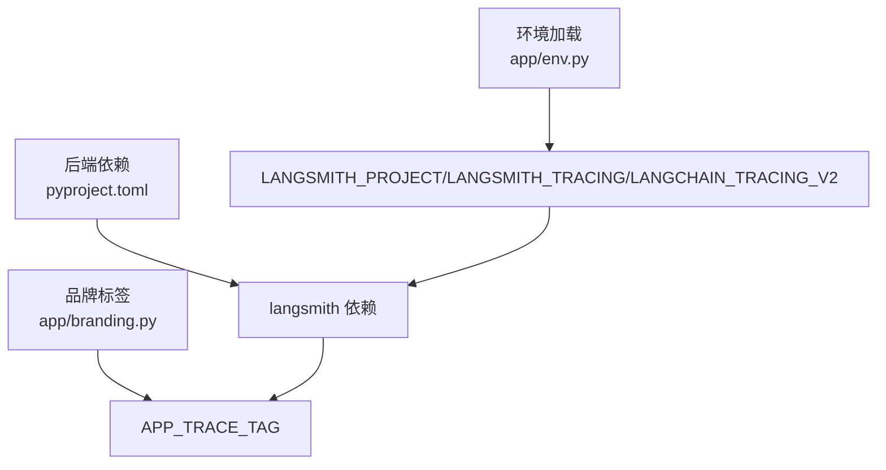

# 监控日志

<cite>
**本文引用的文件**
- [backend/app/observability/langsmith.py](file://backend/app/observability/langsmith.py)
- [backend/tests/test_langsmith_tracing.py](file://backend/tests/test_langsmith_tracing.py)
- [backend/app/main.py](file://backend/app/main.py)
- [backend/pyproject.toml](file://backend/pyproject.toml)
- [backend/app/env.py](file://backend/app/env.py)
- [backend/app/branding.py](file://backend/app/branding.py)
- [backend/app/agent/middleware.py](file://backend/app/agent/middleware.py)
- [backend/app/auth/service.py](file://backend/app/auth/service.py)
- [backend/app/mcp/config.py](file://backend/app/mcp/config.py)
- [backend/docs/agent-implementation-retrospective.md](file://backend/docs/agent-implementation-retrospective.md)
</cite>

## 目录
1. [简介](#简介)
2. [项目结构](#项目结构)
3. [核心组件](#核心组件)
4. [架构总览](#架构总览)
5. [详细组件分析](#详细组件分析)
6. [依赖分析](#依赖分析)
7. [性能考虑](#性能考虑)
8. [故障排查指南](#故障排查指南)
9. [结论](#结论)
10. [附录](#附录)

## 简介
本文件聚焦于应用的监控与日志体系，涵盖以下方面：
- 应用性能监控与日志收集配置
- LangSmith 集成、链路追踪与指标采集
- 日志级别、格式化与输出目标配置
- 告警规则、阈值与通知机制
- 性能指标解读与瓶颈分析方法
- 日志聚合、搜索与可视化工具使用
- 分布式追踪与用户体验监控方案

本项目已内置 LangSmith 追踪辅助封装，并通过环境变量控制启用；日志记录广泛分布于各业务模块，便于统一采集与分析。

## 项目结构
后端采用 FastAPI 应用入口，统一加载环境变量与数据库初始化，随后注册健康检查、认证、聊天、连接器、会话与语音等路由。LangSmith 追踪辅助位于 observability 子模块，品牌与追踪标签常量位于 branding 模块，日志记录散落在 agent、auth、connectors、mcp 等子系统中。

图表来源
- [backend/app/main.py:31-53](file://backend/app/main.py#L31-L53)
- [backend/app/env.py:10-18](file://backend/app/env.py#L10-L18)
- [backend/app/observability/langsmith.py:19-56](file://backend/app/observability/langsmith.py#L19-L56)
- [backend/app/branding.py:18-19](file://backend/app/branding.py#L18-L19)

章节来源
- [backend/app/main.py:31-53](file://backend/app/main.py#L31-L53)
- [backend/app/env.py:10-18](file://backend/app/env.py#L10-L18)

## 核心组件
- LangSmith 追踪辅助：提供启用检测与上下文构建，支持项目名、标签与元数据注入，便于在 LangSmith 控制台进行过滤与分析。
- 环境变量加载：统一加载后端 .env 文件，保证配置一致性与可移植性。
- 日志记录：在代理中间件、认证服务、MCP 配置加载等模块中使用标准 logging，便于集中采集与检索。
- FastAPI 应用入口：负责生命周期管理、CORS 中间件与路由注册，为监控与日志提供统一入口。

章节来源
- [backend/app/observability/langsmith.py:19-56](file://backend/app/observability/langsmith.py#L19-L56)
- [backend/app/env.py:10-18](file://backend/app/env.py#L10-L18)
- [backend/app/agent/middleware.py:26](file://backend/app/agent/middleware.py#L26)
- [backend/app/auth/service.py:26](file://backend/app/auth/service.py#L26)
- [backend/app/mcp/config.py:63-90](file://backend/app/mcp/config.py#L63-L90)
- [backend/app/main.py:23-53](file://backend/app/main.py#L23-L53)

## 架构总览
LangSmith 追踪贯穿请求处理链路，结合品牌标签与操作元数据，形成可检索的分布式追踪视图。日志记录点覆盖关键业务路径，便于问题定位与性能分析。

图表来源
- [backend/app/observability/langsmith.py:19-56](file://backend/app/observability/langsmith.py#L19-L56)
- [backend/app/branding.py:18-19](file://backend/app/branding.py#L18-L19)
- [backend/app/agent/middleware.py:26](file://backend/app/agent/middleware.py#L26)
- [backend/app/auth/service.py:26](file://backend/app/auth/service.py#L26)

## 详细组件分析

### LangSmith 集成与链路追踪
- 启用条件：通过环境变量开关判断是否启用 LangSmith 追踪。
- 上下文构建：在启用状态下，构造包含项目名、标签与元数据的 tracing_context，便于在 LangSmith 控制台筛选与分析。
- 测试验证：测试覆盖禁用环境变量与项目名、标签、元数据传递逻辑。

图表来源
- [backend/app/observability/langsmith.py:19-56](file://backend/app/observability/langsmith.py#L19-L56)
- [backend/app/branding.py:18-19](file://backend/app/branding.py#L18-L19)

章节来源
- [backend/app/observability/langsmith.py:19-56](file://backend/app/observability/langsmith.py#L19-L56)
- [backend/tests/test_langsmith_tracing.py:8-49](file://backend/tests/test_langsmith_tracing.py#L8-L49)

### 日志级别、格式化与输出目标
- 日志模块：在多个模块中导入标准 logging 并获取 logger 实例，用于记录警告、异常与诊断信息。
- 建议实践：
  - 统一日志级别：开发环境 INFO，生产环境 WARNING 或更高。
  - 统一格式：建议使用结构化日志（如 JSON），包含时间戳、级别、模块、消息与上下文字段。
  - 输出目标：本地开发可输出到 stdout/stderr，容器化部署建议输出到 stdout 并由平台日志收集器采集；必要时可落盘或转发到集中式日志系统。
  - 关键记录点：代理中间件的模型选择回退、认证服务的 SMTP 失败与异常、MCP 配置加载与连接异常等。

章节来源
- [backend/app/agent/middleware.py:26](file://backend/app/agent/middleware.py#L26)
- [backend/app/auth/service.py:26](file://backend/app/auth/service.py#L26)
- [backend/app/mcp/config.py:63-90](file://backend/app/mcp/config.py#L63-L90)

### 告警规则、阈值与通知机制
- 告警维度建议：
  - 错误率：认证 SMTP 失败、MCP 连接异常、工具调用失败等异常计数。
  - 响应时间：关键接口（如聊天流式）P95/P99 延迟。
  - 资源使用：CPU、内存、磁盘与数据库连接池占用。
  - 追踪覆盖率：LangSmith 追踪采样比例与缺失率。
- 阈值示例（示例值，需结合实际压测与线上观察设定）：
  - 错误率 > 1%（5 分钟窗口）
  - P95 延迟 > 5 秒
  - CPU 使用率 > 80%
  - 追踪缺失率 > 5%
- 通知渠道：邮件、IM 机器人、PagerDuty 等，按严重等级分层通知。

[本节为通用实践指导，无需特定文件引用]

### 性能指标解读与瓶颈分析方法
- 指标体系：
  - 吞吐：每秒事务数（TPS）、每秒请求量（RPS）。
  - 延迟：平均、P50、P95、P99；LangSmith 可提供链路级耗时。
  - 资源：CPU、内存、I/O、数据库连接数。
  - 业务：会话时长、消息长度、工具调用次数与成功率。
- 分析方法：
  - 时间序列对比：对比基线与变更后的指标变化。
  - 分位数分析：关注尾部延迟对用户体验的影响。
  - 热点定位：结合 LangSmith 链路追踪，定位慢节点（LLM 推理、工具调用、外部 API）。
  - A/B 对比：变更模型档位、工具策略或外部依赖时，对比关键指标差异。

[本节为通用实践指导，无需特定文件引用]

### 日志聚合、搜索与可视化工具使用
- 工具建议：ELK/EFK（Elasticsearch/Filebeat/Logstash/Kibana）、Grafana Loki、Cloud Logging、DataDog、NewRelic 等。
- 操作要点：
  - 结构化日志：统一 JSON 字段，包含 trace_id、span_id、operation、user_id、thread_id、level、module、message。
  - 搜索与过滤：基于 trace_id、operation、错误码、用户 ID、时间范围进行检索。
  - 可视化：仪表板展示错误率、延迟分布、资源使用趋势与 LangSmith 追踪覆盖率。

[本节为通用实践指导，无需特定文件引用]

### 分布式追踪与用户体验监控
- 分布式追踪：利用 LangSmith tracing_context 为每个请求建立统一的 trace_id 与标签，跨服务与工具调用保持一致的追踪链。
- 用户体验监控：结合 LangSmith 的链路耗时、工具调用耗时与错误统计，评估端到端体验；通过用户 ID 与会话 ID 进行用户级分析。

[本节为通用实践指导，无需特定文件引用]

## 依赖分析
- LangSmith 依赖：后端 pyproject.toml 明确声明 langsmith 版本范围，确保与追踪功能兼容。
- 环境变量：通过 app/env 加载 .env，避免硬编码敏感配置；LangSmith 项目名与追踪开关亦来自环境变量。
- 品牌与标签：APP_TRACE_TAG 作为统一标签，便于在 LangSmith 控制台筛选本应用请求。

图表来源
- [backend/pyproject.toml:22](file://backend/pyproject.toml#L22)
- [backend/app/env.py:10-18](file://backend/app/env.py#L10-L18)
- [backend/app/branding.py:18-19](file://backend/app/branding.py#L18-L19)

章节来源
- [backend/pyproject.toml:22](file://backend/pyproject.toml#L22)
- [backend/app/env.py:10-18](file://backend/app/env.py#L10-L18)
- [backend/app/branding.py:18-19](file://backend/app/branding.py#L18-L19)

## 性能考虑
- 追踪开销：LangSmith 追踪在启用时会引入额外开销，建议在生产环境按采样比例开启，或仅在关键路径启用。
- 日志开销：高频警告与异常会带来 IO 压力，建议分级与限流，避免日志风暴影响系统稳定性。
- 资源隔离：将日志采集与主业务解耦，使用异步写入或缓冲队列降低对请求路径的影响。

[本节为通用实践指导，无需特定文件引用]

## 故障排查指南
- LangSmith 追踪未生效
  - 检查环境变量开关与项目名是否正确设置。
  - 确认 tracing_context 是否被正确包裹在关键请求路径。
- 认证 SMTP 失败
  - 查看认证服务日志中的异常堆栈与错误分类，结合网络、DNS、端口与 TLS 模式进行排查。
- MCP 配置加载失败
  - 检查配置文件结构与环境变量注入是否正确，确认缺失变量报错信息并补齐。
- 代理模型选择异常
  - 关注代理中间件日志中的模型档位回退提示，核对运行时上下文中的 model_profile_key。

章节来源
- [backend/tests/test_langsmith_tracing.py:8-49](file://backend/tests/test_langsmith_tracing.py#L8-L49)
- [backend/app/auth/service.py:102-120](file://backend/app/auth/service.py#L102-L120)
- [backend/app/mcp/config.py:63-90](file://backend/app/mcp/config.py#L63-L90)
- [backend/app/agent/middleware.py:164-170](file://backend/app/agent/middleware.py#L164-L170)

## 结论
本项目已具备完善的 LangSmith 追踪基础与广泛的日志记录点，建议在此基础上完善日志格式化与集中采集、建立基于 LangSmith 与系统指标的告警体系，并持续优化追踪采样与日志级别，以平衡可观测性与性能。

[本节为总结性内容，无需特定文件引用]

## 附录

### 环境变量与配置清单
- 追踪相关
  - LANGSMITH_TRACING：启用 LangSmith 追踪
  - LANGCHAIN_TRACING_V2：兼容 LangChain v2 追踪开关
  - LANGSMITH_PROJECT：LangSmith 项目名
- CORS 相关
  - CORS_ALLOW_ORIGINS：允许的前端域名列表
- 认证与 SMTP
  - JWT_SECRET：JWT 密钥
  - AUTH_CODE_EXPIRE_MINUTES：验证码有效期（分钟）
  - SMTP_HOST/PORT/USERNAME/PASSWORD/FROM_EMAIL/USE_TLS：SMTP 配置
- MCP 配置
  - 支持在配置文件中使用 ${ENV_VAR} 注入环境变量，缺失时会抛出错误

章节来源
- [backend/app/observability/langsmith.py:19-56](file://backend/app/observability/langsmith.py#L19-L56)
- [backend/app/main.py:37-44](file://backend/app/main.py#L37-L44)
- [backend/app/auth/service.py:59-82](file://backend/app/auth/service.py#L59-L82)
- [backend/app/mcp/config.py:36-52](file://backend/app/mcp/config.py#L36-L52)