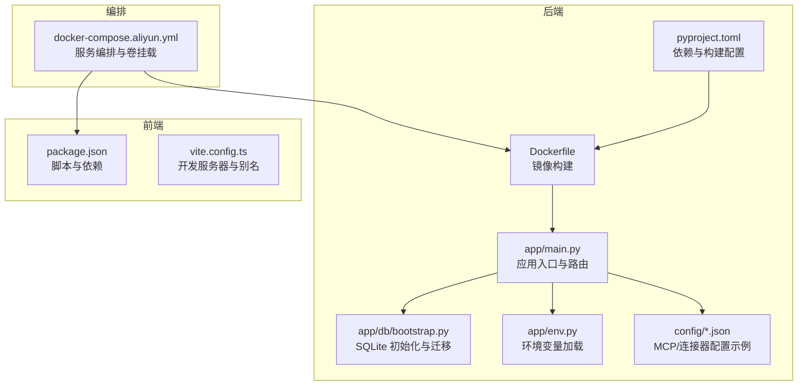
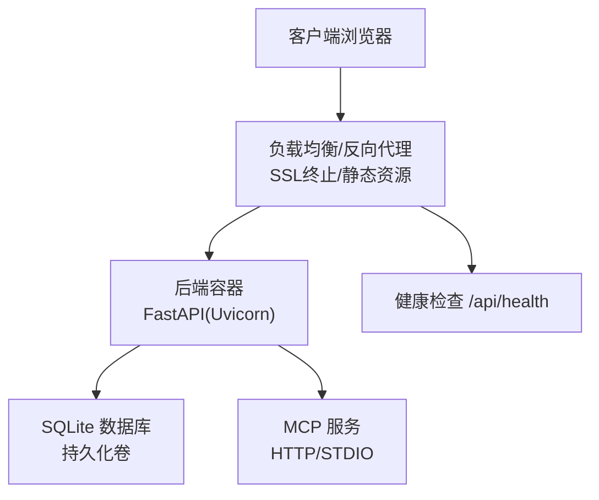
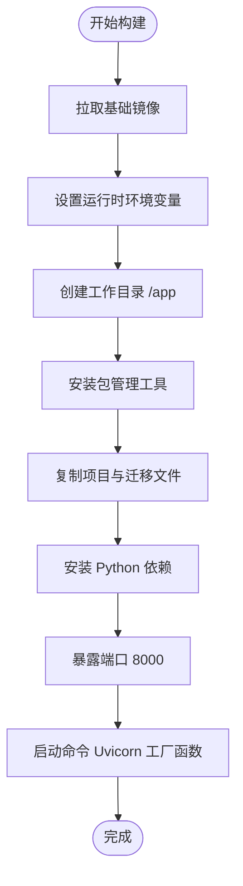
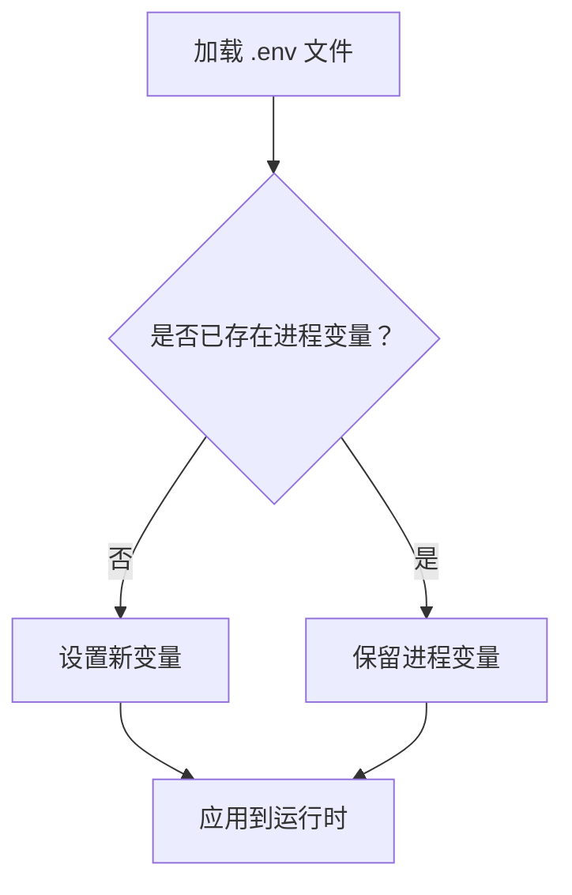
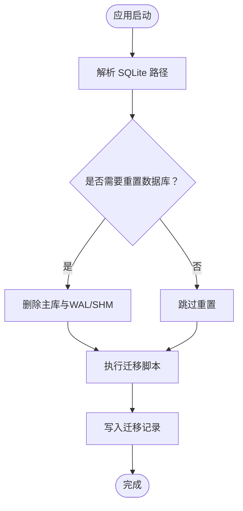
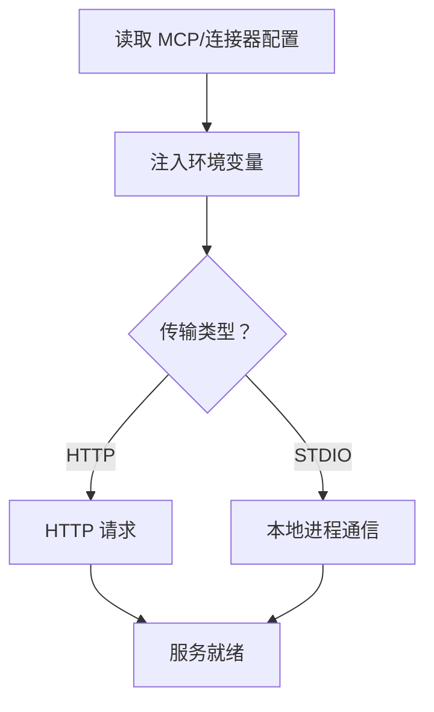
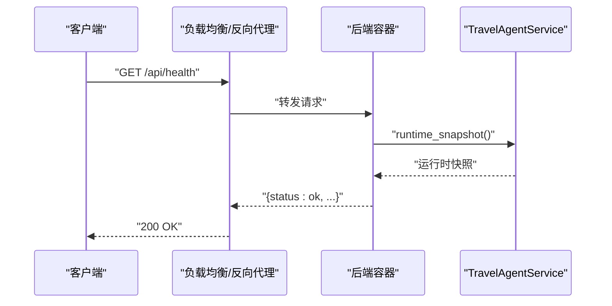
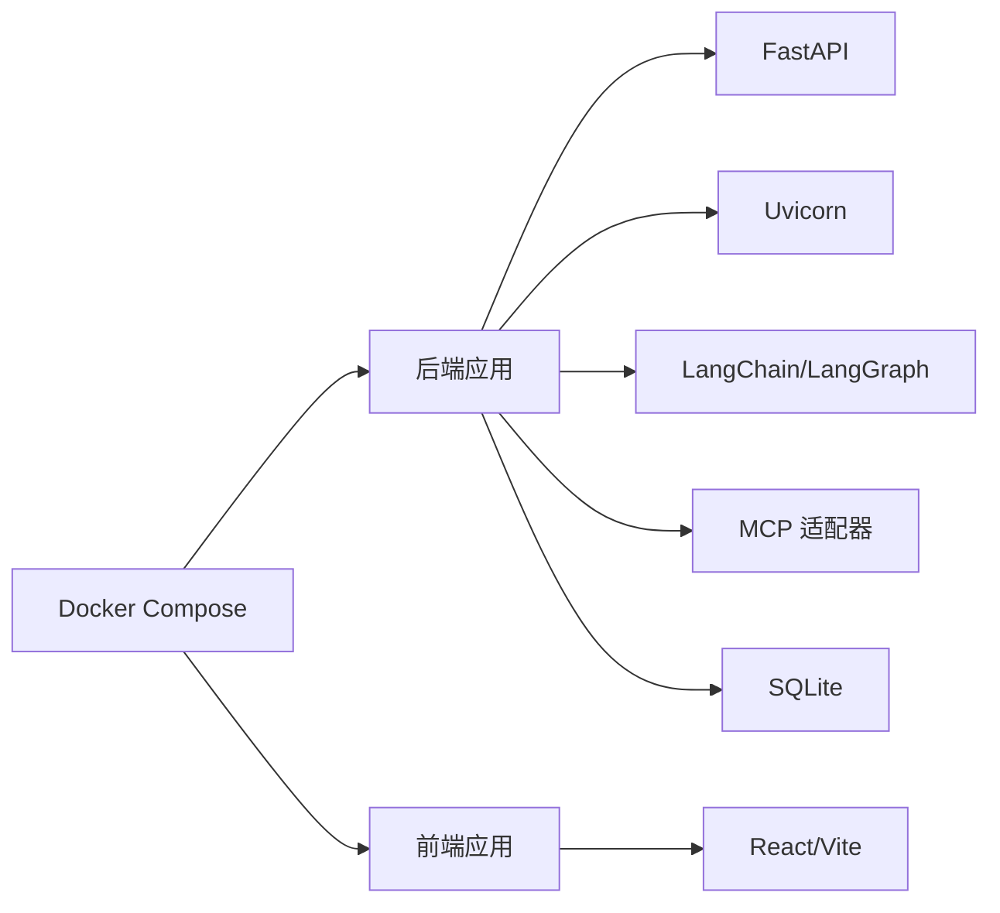

# 部署运维

<cite>
**本文引用的文件**
- [Dockerfile](file://backend/Dockerfile)
- [.dockerignore](file://backend/.dockerignore)
- [docker-compose.aliyun.yml](file://docker-compose.aliyun.yml)
- [pyproject.toml](file://backend/pyproject.toml)
- [env.py](file://backend/app/env.py)
- [main.py](file://backend/app/main.py)
- [connectors.example.json](file://backend/config/connectors.example.json)
- [mcp.servers.example.json](file://backend/config/mcp.servers.example.json)
- [bootstrap.py](file://backend/app/db/bootstrap.py)
- [health.py](file://backend/app/api/health.py)
- [deps.py](file://backend/app/api/deps.py)
- [test_env.py](file://backend/tests/test_env.py)
- [package.json](file://frontend/package.json)
- [vite.config.ts](file://frontend/vite.config.ts)
- [README.md](file://README.md)
</cite>

## 目录
1. [简介](#简介)
2. [项目结构](#项目结构)
3. [核心组件](#核心组件)
4. [架构总览](#架构总览)
5. [详细组件分析](#详细组件分析)
6. [依赖关系分析](#依赖关系分析)
7. [性能考虑](#性能考虑)
8. [故障排除指南](#故障排除指南)
9. [结论](#结论)
10. [附录](#附录)

## 简介
本部署运维文档面向生产环境，提供从容器化、镜像构建、多阶段优化到环境变量、数据库与第三方服务集成的完整指南；涵盖负载均衡与反向代理、SSL 证书配置建议；给出监控指标、日志收集与告警思路；说明 CI/CD 流水线、自动化测试与发布策略；并包含性能调优、容量规划与灾难恢复方案，以及运维最佳实践与故障排除清单。

## 项目结构
后端采用 Python 3.12 + FastAPI + Uvicorn，前端采用 React + Vite + TypeScript。整体采用单仓双端结构，后端提供 API 与 Agent 能力，前端提供 Web 界面与交互体验。开发与部署均支持 Docker Compose 编排。

**图表来源**
- [Dockerfile:1-21](file://backend/Dockerfile#L1-L21)
- [pyproject.toml:1-42](file://backend/pyproject.toml#L1-L42)
- [main.py:1-54](file://backend/app/main.py#L1-L54)
- [bootstrap.py:1-226](file://backend/app/db/bootstrap.py#L1-L226)
- [env.py:1-18](file://backend/app/env.py#L1-L18)
- [connectors.example.json:1-25](file://backend/config/connectors.example.json#L1-L25)
- [mcp.servers.example.json:1-18](file://backend/config/mcp.servers.example.json#L1-L18)
- [docker-compose.aliyun.yml:1-14](file://docker-compose.aliyun.yml#L1-L14)
- [package.json:1-52](file://frontend/package.json#L1-L52)
- [vite.config.ts:1-28](file://frontend/vite.config.ts#L1-L28)

**章节来源**
- [README.md:1-118](file://README.md#L1-L118)
- [docker-compose.aliyun.yml:1-14](file://docker-compose.aliyun.yml#L1-L14)

## 核心组件
- 应用入口与生命周期：后端通过工厂函数创建 FastAPI 实例，注册路由与 CORS 中间件，并在 lifespan 中启动/关闭 Agent 服务。
- 数据库与迁移：启动时自动初始化 SQLite，执行迁移脚本，确保 schema_migrations 表存在并校验历史数据兼容性。
- 环境变量加载：安全地从 .env 加载变量，避免对值进行 $ 变量展开，且不会覆盖已存在的进程环境变量。
- 第三方服务集成：通过 MCP 配置文件注入环境变量，支持 http 与 stdio 两类传输；连接器配置示例展示 Notion、Linear 等集成。
- 健康检查：提供 /api/health 接口，返回服务状态与 Agent 运行时快照。

**章节来源**
- [main.py:23-54](file://backend/app/main.py#L23-L54)
- [bootstrap.py:181-226](file://backend/app/db/bootstrap.py#L181-L226)
- [env.py:10-18](file://backend/app/env.py#L10-L18)
- [mcp.servers.example.json:1-18](file://backend/config/mcp.servers.example.json#L1-L18)
- [connectors.example.json:1-25](file://backend/config/connectors.example.json#L1-L25)
- [health.py:13-18](file://backend/app/api/health.py#L13-L18)

## 架构总览
下图展示生产环境典型拓扑：反向代理（Nginx/Tengine）前置，负责 SSL 终止、静态资源与请求转发；后端容器监听 8000 端口并通过健康检查接入负载均衡；SQLite 数据库存放在持久化卷中；MCP 服务可通过 HTTP 或本地进程方式接入。

[此图为概念性架构示意，不直接映射具体源码文件]

## 详细组件分析

### 容器化与镜像构建
- 基础镜像与运行时：使用官方 Python slim 镜像，设置 PYTHONDONTWRITEBYTECODE、PYTHONUNBUFFERED、PIP_NO_CACHE_DIR 等环境变量，减少字节码缓存与 pip 缓存占用。
- 包管理：安装 uv 后使用 pip 安装项目依赖，随后在 /app 目录下执行安装，暴露 8000 端口，使用 Uvicorn 以工厂函数方式启动应用。
- 构建上下文：Dockerfile 指定 backend 目录为构建上下文，复制 pyproject.toml、app、migrations 等必要文件。
- 忽略规则：.dockerignore 排除 .env、tests、data、config/mcp.servers.json 等目录与文件，避免污染镜像。

**图表来源**
- [Dockerfile:1-21](file://backend/Dockerfile#L1-L21)

**章节来源**
- [Dockerfile:1-21](file://backend/Dockerfile#L1-L21)
- [.dockerignore:1-10](file://backend/.dockerignore#L1-L10)

### 多阶段构建优化建议
- 阶段一（构建）：在专用构建镜像中安装构建工具与依赖，生成可分发产物。
- 阶段二（运行）：从最小化运行时镜像复制必要文件，禁用 pip 缓存，减少镜像体积与攻击面。
- 产物隔离：仅复制运行所需文件，排除测试、配置示例与开发依赖。
- 层缓存优化：将变更频率低的层（如安装依赖）置于上层，变更频繁的层（如源码）置于下层。

[本小节为通用优化建议，不直接分析具体文件]

### 环境变量与配置
- 后端 .env 加载：load_app_env 从 backend 根目录加载 .env，不进行变量展开，且不会覆盖已存在的进程环境变量。
- 关键变量：
  - CORS 允许来源：CORS_ALLOW_ORIGINS，默认允许所有来源。
  - SQLite 路径：CHAT_SQLITE_PATH，默认位于 data/chat.db。
  - 开发重置开关：DEV_RESET_CHAT_DB，用于强制重置数据库。
  - MCP 配置：TRAVEL_MCP_URL、TRAVEL_MCP_TOKEN、CALENDAR_API_KEY 等通过环境变量注入。
- 前端 .env：由前端脚本 copy .env.example .env 创建，Vite 在开发模式下使用本地后端地址。

**图表来源**
- [env.py:10-18](file://backend/app/env.py#L10-L18)
- [test_env.py:8-37](file://backend/tests/test_env.py#L8-L37)

**章节来源**
- [env.py:10-18](file://backend/app/env.py#L10-L18)
- [test_env.py:8-37](file://backend/tests/test_env.py#L8-L37)
- [README.md:50-66](file://README.md#L50-L66)

### 数据库与迁移
- 初始化流程：启动时解析 SQLite 路径，若开启重置则删除主库及 WAL/SHM 文件，再执行迁移脚本。
- 迁移机制：扫描 migrations 目录，按版本顺序执行未应用的 SQL 脚本，并记录到 schema_migrations 表。
- 兼容性保护：拒绝未版本化的旧表与旧整数型 schema，防止数据损坏。

**图表来源**
- [bootstrap.py:167-226](file://backend/app/db/bootstrap.py#L167-L226)

**章节来源**
- [bootstrap.py:181-226](file://backend/app/db/bootstrap.py#L181-L226)

### 第三方服务集成（MCP 与连接器）
- MCP 配置：支持 http 与 stdio 两种传输，示例中通过环境变量注入 URL 与令牌，stdio 场景可注入额外环境变量。
- 连接器配置：示例展示 Notion 与 Linear 的 MCP 服务地址、图标、客户端信息等字段，便于统一管理。

**图表来源**
- [mcp.servers.example.json:1-18](file://backend/config/mcp.servers.example.json#L1-L18)
- [connectors.example.json:1-25](file://backend/config/connectors.example.json#L1-L25)

**章节来源**
- [mcp.servers.example.json:1-18](file://backend/config/mcp.servers.example.json#L1-L18)
- [connectors.example.json:1-25](file://backend/config/connectors.example.json#L1-L25)

### 健康检查与依赖注入
- 健康检查：/api/health 返回服务状态与 Agent 运行时快照，供负载均衡探活使用。
- 依赖注入：通过 LRU 缓存的工厂函数提供全局单例服务，包括 TravelAgentService、AuthService、ConnectorService，并在 lifespan 中统一管理生命周期。

**图表来源**
- [health.py:13-18](file://backend/app/api/health.py#L13-L18)
- [deps.py:18-32](file://backend/app/api/deps.py#L18-L32)

**章节来源**
- [health.py:13-18](file://backend/app/api/health.py#L13-L18)
- [deps.py:18-32](file://backend/app/api/deps.py#L18-L32)

### 前端开发与联调
- 开发脚本：前端 package.json 提供 dev 与 dev:backend 脚本，dev:backend 通过 uv 执行后端并指定 reload 目录与主机端口。
- 开发服务器：vite.config.ts 设置开发与预览主机、端口与别名，便于前后端联调。

**章节来源**
- [package.json:6-12](file://frontend/package.json#L6-L12)
- [vite.config.ts:10-17](file://frontend/vite.config.ts#L10-L17)

## 依赖关系分析
- 后端依赖：FastAPI、Uvicorn、Pydantic、Pydantic Settings、dotenv、JWT、Boto3、DashScope、LangChain/LangGraph、LangSmith、Cryptography 等。
- 构建系统：setuptools/wheel，包发现 include app*，测试路径 tests。
- 前端依赖：React、Vite、TypeScript、Tailwind、shadcn/ui 组件库等。

**图表来源**
- [pyproject.toml:6-24](file://backend/pyproject.toml#L6-L24)
- [README.md:7-8](file://README.md#L7-L8)

**章节来源**
- [pyproject.toml:1-42](file://backend/pyproject.toml#L1-L42)
- [README.md:7-8](file://README.md#L7-L8)

## 性能考虑
- 运行时优化
  - 使用工厂函数与异步生命周期，避免重复初始化。
  - 启动时一次性执行数据库迁移，减少运行期开销。
  - 严格控制 CORS 来源，降低跨域处理成本。
- 数据库优化
  - 启用外键约束，确保数据一致性。
  - 迁移脚本按序执行，避免并发写入冲突。
- 容器与网络
  - 将 SQLite 数据与配置分别挂载为持久化卷与只读卷，提升安全性与可维护性。
  - 反向代理统一处理 TLS 与静态资源，后端专注业务逻辑。
- 监控与可观测性
  - 暴露 /api/health 供探活。
  - 结合日志与指标采集，建立告警阈值。

[本节提供通用指导，不直接分析具体文件]

## 故障排除指南
- 环境变量问题
  - .env 未生效：确认 .env 存在且未被忽略；检查加载函数是否正确调用。
  - 变量展开异常：确认未对敏感值进行 $ 变量展开，避免意外替换。
- 数据库问题
  - 未版本化历史表：设置 DEV_RESET_CHAT_DB=true 或删除旧数据库后重启。
  - 旧整数型 schema：同上，重置或删除后重启。
- MCP/连接器问题
  - 无法连接：核对 TRAVEL_MCP_URL、TRAVEL_MCP_TOKEN、CALENDAR_API_KEY 是否正确注入。
  - 传输类型错误：确认配置为 http 或 stdio，并与实际服务一致。
- 健康检查失败
  - Agent 未启动：检查 lifespan 生命周期钩子与依赖注入。
  - 代理未转发：核对反向代理配置与端口映射。

**章节来源**
- [test_env.py:8-37](file://backend/tests/test_env.py#L8-L37)
- [bootstrap.py:112-164](file://backend/app/db/bootstrap.py#L112-L164)
- [mcp.servers.example.json:4-7](file://backend/config/mcp.servers.example.json#L4-L7)
- [health.py:13-18](file://backend/app/api/health.py#L13-L18)

## 结论
本项目具备清晰的容器化与编排能力，结合 SQLite 与 MCP 生态，可在生产环境中快速落地。建议在生产中完善反向代理与 SSL 配置、引入监控与日志体系、制定 CI/CD 与发布策略，并持续进行性能与容量评估，确保高可用与可扩展性。

## 附录

### A. 生产环境部署步骤
- 准备工作
  - 准备 .env 文件，设置 CORS_ALLOW_ORIGINS、CHAT_SQLITE_PATH、DEV_RESET_CHAT_DB、MCP 与连接器相关变量。
  - 准备 config/mcp.servers.json 与 config/connectors.json（基于示例文件）。
- 构建镜像
  - 使用 Dockerfile 在 backend 目录构建镜像。
- 启动服务
  - 使用 docker-compose.aliyun.yml 启动后端服务，映射 8000 端口至宿主机。
- 反向代理与 SSL
  - 在 Nginx/Tengine 前置，启用 HTTPS，配置静态资源缓存与 gzip。
- 健康检查
  - 配置负载均衡探活，指向 /api/health。

**章节来源**
- [docker-compose.aliyun.yml:1-14](file://docker-compose.aliyun.yml#L1-L14)
- [README.md:50-66](file://README.md#L50-L66)

### B. 监控、日志与告警
- 指标
  - 应用：/api/health 健康状态、Agent 运行时快照。
  - 基础设施：CPU、内存、磁盘、网络、连接数。
- 日志
  - 后端：Uvicorn 访问日志与应用日志分离，按天轮转。
  - 前端：浏览器控制台与网络面板排查。
- 告警
  - 健康检查失败、响应时间超阈值、错误率上升、磁盘空间不足等。

[本小节为通用运维建议，不直接分析具体文件]

### C. CI/CD 流水线与发布策略
- 流水线
  - 触发：push/PR 触发后端与前端测试。
  - 步骤：安装依赖、运行测试、构建镜像、推送镜像、编排部署。
- 自动化测试
  - 后端：pytest（tests 目录），前端：Vitest/Jest。
- 发布策略
  - 蓝绿/金丝雀发布，配合健康检查与回滚策略。

**章节来源**
- [pyproject.toml:26-30](file://backend/pyproject.toml#L26-L30)
- [README.md:103-117](file://README.md#L103-L117)

### D. 容量规划与灾难恢复
- 容量规划
  - 评估并发连接数、峰值 QPS、响应时间目标，预留 CPU/内存/磁盘。
- 灾难恢复
  - 定期备份 SQLite 数据库与配置；制定回滚与切换方案；演练故障场景。

[本小节为通用运维建议，不直接分析具体文件]