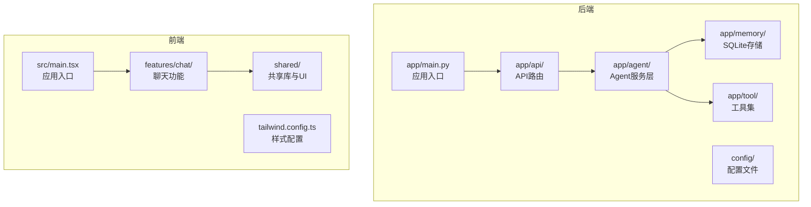
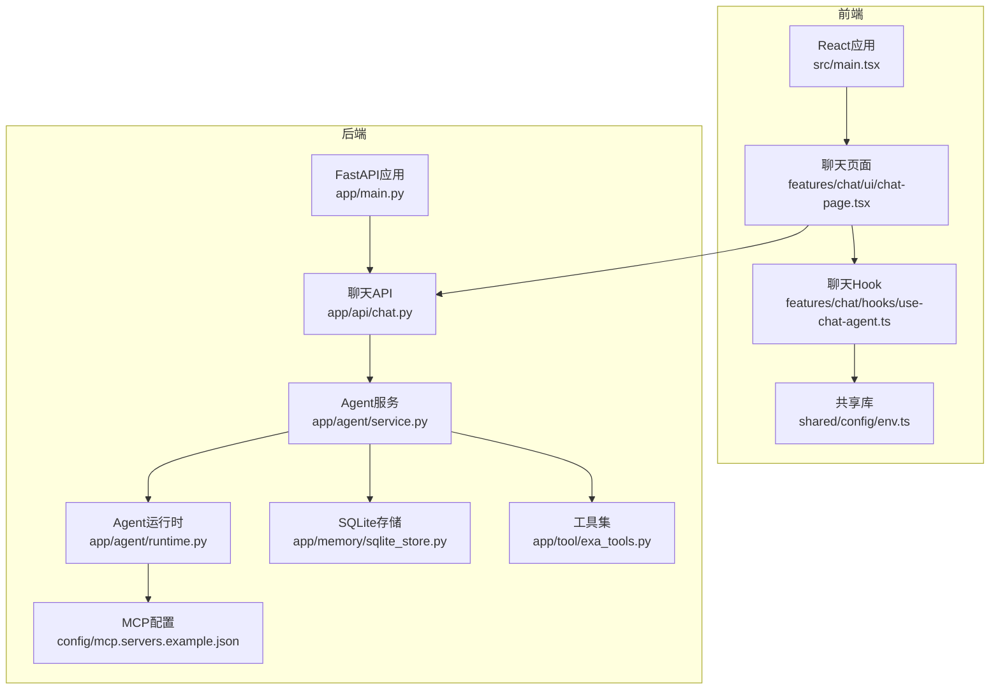
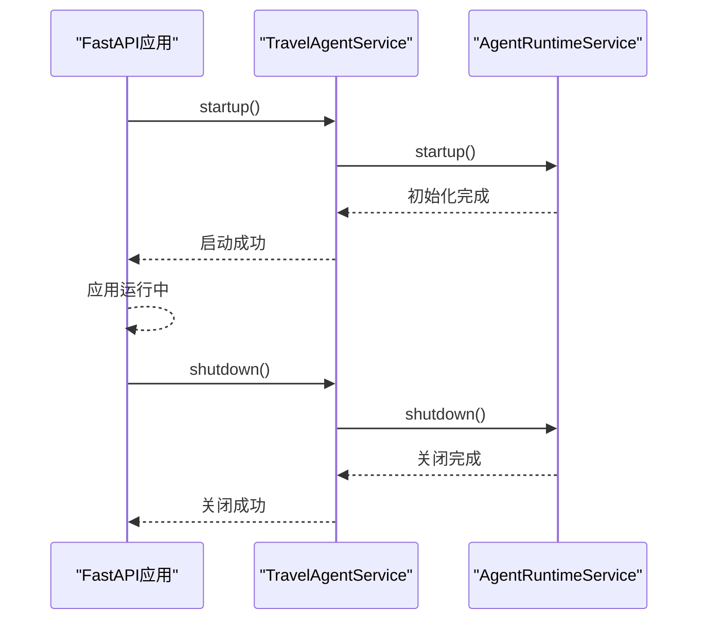
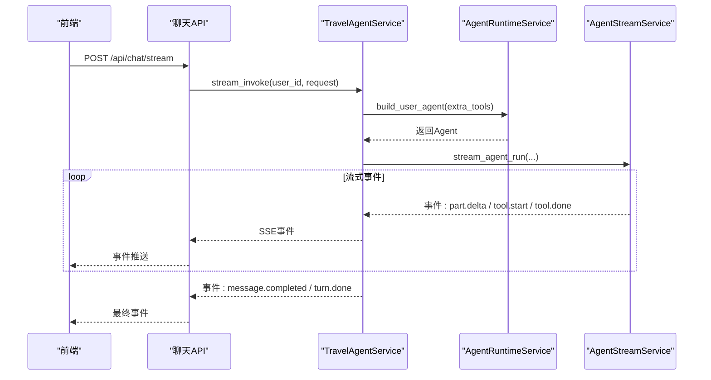
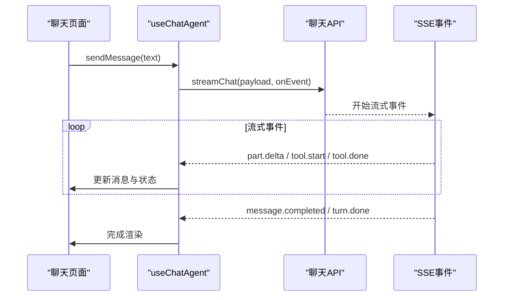
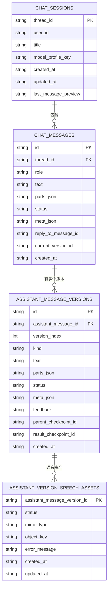
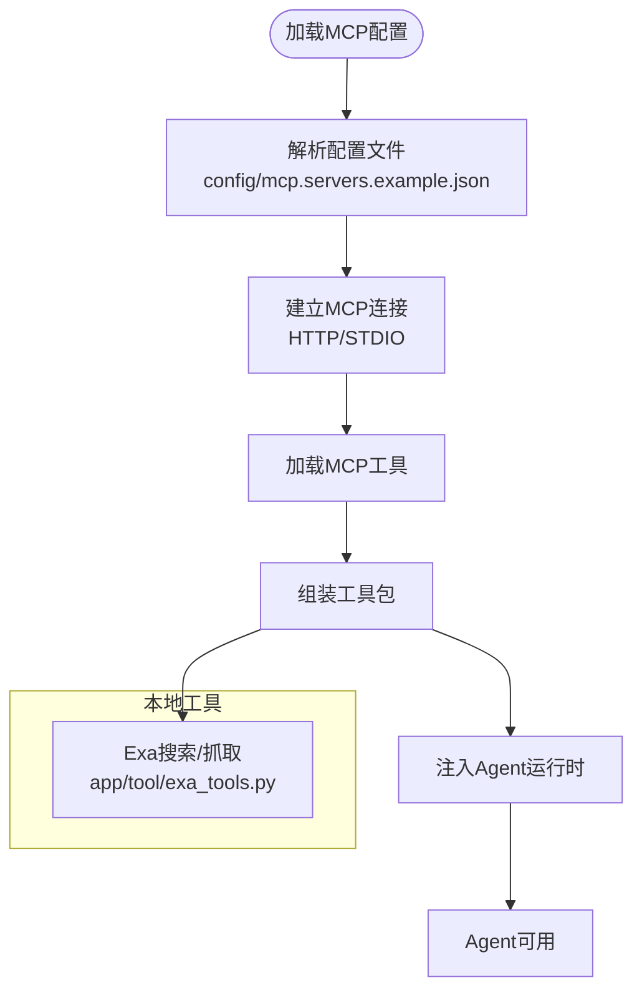
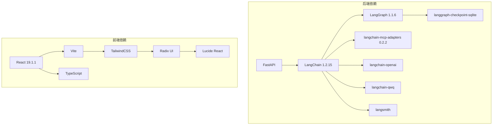

# 项目概述

<cite>
**本文档引用的文件**
- [README.md](file://README.md)
- [pyproject.toml](file://backend/pyproject.toml)
- [package.json](file://frontend/package.json)
- [main.py](file://backend/app/main.py)
- [service.py](file://backend/app/agent/service.py)
- [chat.py](file://backend/app/api/chat.py)
- [chat-page.tsx](file://frontend/src/features/chat/ui/chat-page.tsx)
- [use-chat-agent.ts](file://frontend/src/features/chat/hooks/use-chat-agent.ts)
- [exa_tools.py](file://backend/app/tool/exa_tools.py)
- [sqlite_store.py](file://backend/app/memory/sqlite_store.py)
- [mcp.servers.example.json](file://backend/config/mcp.servers.example.json)
- [runtime.py](file://backend/app/agent/runtime.py)
- [chat.py](file://backend/app/schemas/chat.py)
- [tailwind.config.ts](file://frontend/tailwind.config.ts)
- [env.ts](file://frontend/src/shared/config/env.ts)
</cite>

## 目录
1. [引言](#引言)
2. [项目结构](#项目结构)
3. [核心组件](#核心组件)
4. [架构总览](#架构总览)
5. [详细组件分析](#详细组件分析)
6. [依赖关系分析](#依赖关系分析)
7. [性能考虑](#性能考虑)
8. [故障排除指南](#故障排除指南)
9. [结论](#结论)
10. [附录](#附录)

## 引言

AI旅行Agent是一个基于**LangChain + LangGraph + MCP + React + shadcn/ui**的移动优先旅行对话应用。该项目旨在为用户提供智能旅行规划、多轮会话记忆与流式输出体验，支持本地工具与MCP（Model Context Protocol）服务器集成，结合SQLite持久化与语音合成能力，打造完整的旅行助手体验。

项目的核心目标是：
- 提供自然语言驱动的旅行规划与建议
- 通过LangGraph实现多轮对话与上下文记忆
- 通过MCP与本地工具扩展Agent能力
- 通过流式SSE输出提升交互体验
- 通过SQLite实现会话持久化与版本管理
- 通过语音合成增强可访问性与体验

技术愿景：
- 以模块化架构实现前后端分离与可扩展性
- 以LangChain生态为核心，结合LangGraph进行状态管理
- 以MCP协议实现外部工具与服务的标准化接入
- 以前端React + shadcn/ui提供移动端友好的交互界面

应用场景：
- 旅行行程规划与建议
- 实时天气查询与路线推荐
- 景点信息检索与导航
- 语音播报与无障碍体验

## 项目结构

项目采用前后端分离架构，后端基于FastAPI，前端基于React + Vite + TypeScript，整体目录结构如下：

**图表来源**
- [main.py:1-54](file://backend/app/main.py#L1-L54)
- [chat.py:1-72](file://backend/app/api/chat.py#L1-L72)
- [service.py:1-529](file://backend/app/agent/service.py#L1-L529)
- [sqlite_store.py:1-800](file://backend/app/memory/sqlite_store.py#L1-L800)
- [exa_tools.py:1-216](file://backend/app/tool/exa_tools.py#L1-L216)
- [main.tsx:1-12](file://frontend/src/main.tsx#L1-L12)
- [chat-page.tsx:1-741](file://frontend/src/features/chat/ui/chat-page.tsx#L1-L741)
- [tailwind.config.ts:1-99](file://frontend/tailwind.config.ts#L1-L99)

**章节来源**
- [README.md:19-48](file://README.md#L19-L48)
- [pyproject.toml:1-42](file://backend/pyproject.toml#L1-L42)
- [package.json:1-52](file://frontend/package.json#L1-L52)

## 核心组件

- 后端核心组件
  - 应用入口与生命周期管理：负责加载环境变量、初始化数据库与Agent运行时，并注册路由。
  - Agent服务层：封装旅行Agent的业务逻辑，包括流式聊天、会话管理、工具调用与持久化。
  - API层：提供健康检查、认证、聊天流式接口、会话管理与语音播放等REST接口。
  - 存储层：基于SQLite实现聊天会话、消息、版本与语音资产的持久化。
  - 工具层：集成本地工具与MCP工具，支持Exa搜索、内容抓取等能力。
  - 配置层：提供MCP服务器配置示例与运行时加载。

- 前端核心组件
  - 应用入口：初始化React应用与样式。
  - 聊天页面：实现消息渲染、工具调用展示、版本切换、语音播放与会话管理。
  - 聊天Hook：封装SSE流式事件处理、消息发送、重新生成与版本切换逻辑。
  - 共享库：HTTP客户端、浏览器适配、UI组件与主题配置。

**章节来源**
- [main.py:23-54](file://backend/app/main.py#L23-L54)
- [service.py:97-529](file://backend/app/agent/service.py#L97-L529)
- [chat.py:21-72](file://backend/app/api/chat.py#L21-L72)
- [sqlite_store.py:123-800](file://backend/app/memory/sqlite_store.py#L123-L800)
- [exa_tools.py:1-216](file://backend/app/tool/exa_tools.py#L1-L216)
- [chat-page.tsx:140-741](file://frontend/src/features/chat/ui/chat-page.tsx#L140-L741)
- [use-chat-agent.ts:125-596](file://frontend/src/features/chat/hooks/use-chat-agent.ts#L125-L596)
- [tailwind.config.ts:1-99](file://frontend/tailwind.config.ts#L1-L99)

## 架构总览

系统采用前后端分离架构，后端通过FastAPI提供REST与SSE接口，前端通过React实现流式事件消费与UI渲染。Agent运行时基于LangGraph进行状态管理，结合SQLite实现会话与版本持久化，MCP协议用于外部工具接入。

**图表来源**
- [main.py:31-54](file://backend/app/main.py#L31-L54)
- [chat.py:41-72](file://backend/app/api/chat.py#L41-L72)
- [service.py:97-529](file://backend/app/agent/service.py#L97-L529)
- [runtime.py:61-174](file://backend/app/agent/runtime.py#L61-L174)
- [sqlite_store.py:123-800](file://backend/app/memory/sqlite_store.py#L123-L800)
- [exa_tools.py:1-216](file://backend/app/tool/exa_tools.py#L1-L216)
- [mcp.servers.example.json:1-18](file://backend/config/mcp.servers.example.json#L1-L18)
- [main.tsx:1-12](file://frontend/src/main.tsx#L1-L12)
- [chat-page.tsx:140-741](file://frontend/src/features/chat/ui/chat-page.tsx#L140-L741)
- [use-chat-agent.ts:125-596](file://frontend/src/features/chat/hooks/use-chat-agent.ts#L125-L596)
- [env.ts:1-48](file://frontend/src/shared/config/env.ts#L1-L48)

## 详细组件分析

### 后端应用入口与生命周期

后端应用通过异步生命周期管理Agent运行时的启动与关闭，确保在应用启动时初始化Agent，在关闭时释放资源。同时注册健康检查、认证、聊天、会话与语音等路由。

**图表来源**
- [main.py:23-28](file://backend/app/main.py#L23-L28)
- [service.py:116-124](file://backend/app/agent/service.py#L116-L124)
- [runtime.py:80-116](file://backend/app/agent/runtime.py#L80-L116)

**章节来源**
- [main.py:23-54](file://backend/app/main.py#L23-L54)

### Agent服务层与流式聊天

Agent服务层负责接收前端请求，构建用户上下文，调用Agent运行时进行推理与工具调用，并通过SSE向前端推送流式事件。服务层还负责会话管理、版本控制与持久化。

**图表来源**
- [chat.py:41-72](file://backend/app/api/chat.py#L41-L72)
- [service.py:373-508](file://backend/app/agent/service.py#L373-L508)
- [runtime.py:117-133](file://backend/app/agent/runtime.py#L117-L133)

**章节来源**
- [service.py:373-508](file://backend/app/agent/service.py#L373-L508)
- [chat.py:41-72](file://backend/app/api/chat.py#L41-L72)

### 前端聊天页面与Hook

前端聊天页面负责渲染消息、工具调用与版本切换，聊天Hook负责处理SSE事件、消息发送、重新生成与版本切换逻辑，并与后端API进行交互。

**图表来源**
- [chat-page.tsx:140-741](file://frontend/src/features/chat/ui/chat-page.tsx#L140-L741)
- [use-chat-agent.ts:384-476](file://frontend/src/features/chat/hooks/use-chat-agent.ts#L384-L476)
- [chat.py:41-72](file://backend/app/api/chat.py#L41-L72)

**章节来源**
- [chat-page.tsx:140-741](file://frontend/src/features/chat/ui/chat-page.tsx#L140-L741)
- [use-chat-agent.ts:125-596](file://frontend/src/features/chat/hooks/use-chat-agent.ts#L125-L596)

### 数据模型与持久化

后端通过SQLite实现聊天会话、消息、版本与语音资产的持久化，支持会话列表、消息详情、版本切换与反馈等功能。

**图表来源**
- [sqlite_store.py:123-800](file://backend/app/memory/sqlite_store.py#L123-L800)
- [chat.py:145-200](file://backend/app/schemas/chat.py#L145-L200)

**章节来源**
- [sqlite_store.py:123-800](file://backend/app/memory/sqlite_store.py#L123-L800)
- [chat.py:145-200](file://backend/app/schemas/chat.py#L145-L200)

### 工具集成与MCP配置

后端通过MCP协议与外部工具集成，支持HTTP与stdio两种传输方式。本地工具如Exa搜索与内容抓取通过HTTP客户端调用，MCP工具通过动态加载与连接管理。

**图表来源**
- [mcp.servers.example.json:1-18](file://backend/config/mcp.servers.example.json#L1-L18)
- [runtime.py:80-116](file://backend/app/agent/runtime.py#L80-L116)
- [exa_tools.py:1-216](file://backend/app/tool/exa_tools.py#L1-L216)

**章节来源**
- [mcp.servers.example.json:1-18](file://backend/config/mcp.servers.example.json#L1-L18)
- [runtime.py:80-116](file://backend/app/agent/runtime.py#L80-L116)
- [exa_tools.py:1-216](file://backend/app/tool/exa_tools.py#L1-L216)

## 依赖关系分析

后端与前端的关键依赖关系如下：

**图表来源**
- [pyproject.toml:6-24](file://backend/pyproject.toml#L6-L24)
- [package.json:14-34](file://frontend/package.json#L14-L34)

**章节来源**
- [pyproject.toml:1-42](file://backend/pyproject.toml#L1-L42)
- [package.json:1-52](file://frontend/package.json#L1-L52)

## 性能考虑

- 流式输出优化：后端通过SSE实现流式事件推送，前端通过事件合并与增量更新减少渲染开销。
- 会话持久化：SQLite存储支持高效的会话查询与版本管理，避免重复计算。
- 工具调用：MCP工具与本地工具分离，减少不必要的网络延迟。
- 前端渲染：使用虚拟滚动与条件渲染，提升长对话场景下的用户体验。
- 缓存与回滚：Agent运行时支持检查点与回滚，提高稳定性与一致性。

## 故障排除指南

常见问题与解决方案：
- SSE连接中断：前端通过AbortController中断请求，后端记录异常并清理语音生成任务。
- 会话加载失败：前端捕获错误并提示用户重试，后端记录异常日志以便排查。
- MCP连接失败：检查MCP配置文件与环境变量，确认服务器可达与认证信息正确。
- 语音播放异常：前端检测409状态并刷新当前线程，后端确保语音资产存在且可访问。

**章节来源**
- [use-chat-agent.ts:436-458](file://frontend/src/features/chat/hooks/use-chat-agent.ts#L436-L458)
- [service.py:444-482](file://backend/app/agent/service.py#L444-L482)

## 结论

AI旅行Agent项目通过LangChain + LangGraph + MCP + React + shadcn/ui的技术组合，实现了移动优先的旅行对话应用。项目具备良好的模块化架构、可扩展的工具集成能力与流畅的用户体验。通过流式输出、多轮会话记忆与语音合成，为用户提供了智能化、个性化的旅行助手体验。

## 附录

### 快速开始

后端启动步骤：
- 进入后端目录，安装依赖并启动开发服务器
- 复制示例环境变量文件并根据需要修改
- 启动Uvicorn服务监听本地端口

前端启动步骤：
- 进入前端目录，安装依赖并启动开发服务器
- 复制示例环境变量文件并配置API基础URL
- 在浏览器中打开开发地址

MCP配置说明：
- 主配置文件位于后端config目录
- 支持HTTP与STDIO两种传输方式
- 可通过环境变量注入敏感信息

API接口说明：
- 健康检查：GET /api/health
- 流式聊天：POST /api/chat/stream（SSE）

**章节来源**
- [README.md:50-118](file://README.md#L50-L118)
- [mcp.servers.example.json:1-18](file://backend/config/mcp.servers.example.json#L1-L18)
- [chat.py:80-101](file://backend/app/api/chat.py#L80-L101)